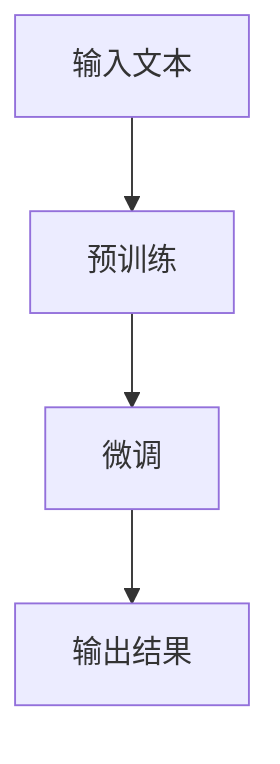

                 

关键词：大模型、AI 创业、产品创新、技术突破、商业应用、未来趋势

> 摘要：本文深入探讨了大型人工智能模型在 AI 创业产品创新中的关键作用。通过对大模型的发展背景、核心原理、具体应用案例分析以及未来展望的详细解析，揭示了大模型对推动技术创新和商业成功的深远影响。

## 1. 背景介绍

人工智能（AI）作为计算机科学的一个重要分支，近年来取得了飞速的发展。从最初的规则系统到现代的深度学习模型，AI 技术的不断进步为各行各业带来了深远的影响。随着计算能力的提升和数据量的爆炸式增长，大型人工智能模型（通常被称为“大模型”）逐渐成为研究热点。大模型具有数十亿到千亿级别的参数，能够处理复杂的任务，并在诸如自然语言处理、计算机视觉、语音识别等领域展现出卓越的性能。

在 AI 创业的背景下，大模型的重要性愈发凸显。许多创业公司意识到，通过利用大模型，他们可以快速开发出具有竞争力的产品，抢占市场先机。此外，大模型还为创业公司提供了探索未知领域、解决复杂问题的强大工具，有助于提升创新能力和市场竞争力。

## 2. 核心概念与联系

### 2.1 大模型的基本概念

大模型，顾名思义，指的是拥有数亿甚至千亿参数的深度学习模型。它们通常基于神经网络架构，能够处理大规模数据集，并从中学习到复杂的模式。大模型的典型例子包括 GPT、BERT、ViT 等。

### 2.2 大模型的技术原理

大模型的技术原理主要涉及以下几个方面：

#### 神经网络架构

大模型通常采用深度神经网络（DNN）作为基础架构。通过增加网络的深度和宽度，大模型可以更好地捕捉数据中的复杂关系。

#### 数据处理能力

大模型能够处理大规模数据集，从而在学习过程中获取更多样化的信息，提升模型的泛化能力。

#### 预训练与微调

大模型通常通过预训练（pre-training）的方式在大规模数据上进行训练，然后通过微调（fine-tuning）针对特定任务进行调整。这种方法使得大模型能够快速适应不同的应用场景。

### 2.3 大模型的应用领域

大模型在多个领域展现出强大的应用潜力，包括：

#### 自然语言处理（NLP）

大模型在 NLP 领域的表现尤为突出，如文本生成、机器翻译、情感分析等。

#### 计算机视觉（CV）

大模型在图像识别、目标检测、图像生成等 CV 任务中取得了显著成果。

#### 语音识别（ASR）

大模型在语音识别任务中能够实现高准确率的语音识别。

### 2.4 大模型的架构图

以下是某大型语言模型（如 GPT-3）的 Mermaid 流程图示例：



## 3. 核心算法原理 & 具体操作步骤

### 3.1 算法原理概述

大模型的核心算法是深度神经网络。深度神经网络通过多层神经元之间的非线性变换，从输入数据中提取特征，最终输出结果。大模型的显著特点是其深度和广度，这使得它们能够学习到复杂的数据分布。

### 3.2 算法步骤详解

#### 预训练阶段

1. 数据预处理：将原始数据转换为适合训练的格式。
2. 训练过程：在大规模数据集上进行训练，通过反向传播算法不断调整模型参数。
3. 评估与优化：通过验证集和测试集评估模型性能，并进行优化。

#### 微调阶段

1. 选择任务：确定需要微调的任务和应用场景。
2. 数据准备：准备特定任务的数据集。
3. 微调模型：在任务数据集上调整模型参数，使其适应特定任务。

### 3.3 算法优缺点

#### 优点

- **强大的学习能力**：大模型能够从大规模数据中学习到复杂的模式。
- **高泛化能力**：通过预训练和微调，大模型能够快速适应不同的任务和应用场景。
- **高效的计算能力**：现代硬件加速技术（如 GPU、TPU）使得大模型训练和推理更加高效。

#### 缺点

- **高计算资源需求**：大模型需要大量的计算资源和数据支持。
- **训练时间较长**：大模型训练过程需要大量时间，尤其是在大规模数据集上。
- **数据偏差**：大模型可能受到训练数据偏差的影响，导致在某些特定场景下的性能不稳定。

### 3.4 算法应用领域

大模型在多个领域都有广泛的应用，包括：

- **自然语言处理**：如文本生成、机器翻译、对话系统等。
- **计算机视觉**：如图像识别、目标检测、图像生成等。
- **语音识别**：如语音合成、语音识别、语音情感分析等。

## 4. 数学模型和公式 & 详细讲解 & 举例说明

### 4.1 数学模型构建

大模型的数学基础是深度神经网络，其核心是多层感知机（MLP）。MLP 的基本形式可以表示为：

\[ y = f(z) = \sigma(W \cdot x + b) \]

其中，\( \sigma \) 是激活函数，\( W \) 是权重矩阵，\( x \) 是输入向量，\( b \) 是偏置。

### 4.2 公式推导过程

大模型的训练过程可以通过梯度下降算法实现。假设损失函数为 \( L \)，则梯度下降的迭代公式为：

\[ \theta = \theta - \alpha \cdot \nabla_\theta L \]

其中，\( \theta \) 表示模型参数，\( \alpha \) 是学习率。

### 4.3 案例分析与讲解

假设我们有一个文本生成模型，输入为一段文本，输出为生成的文本。我们使用交叉熵损失函数来衡量模型的性能：

\[ L = -\sum_{i=1}^n y_i \log(p_i) \]

其中，\( y_i \) 是真实标签，\( p_i \) 是模型预测的概率分布。

在训练过程中，我们不断调整模型参数，使得损失函数逐渐减小。通过多次迭代，模型最终能够生成符合预期的文本。

## 5. 项目实践：代码实例和详细解释说明

### 5.1 开发环境搭建

在开始代码实践之前，我们需要搭建一个合适的开发环境。以下是搭建 Python 开发环境的基本步骤：

1. 安装 Python 3.x 版本。
2. 安装必要的依赖库，如 TensorFlow、Keras 等。
3. 配置 GPU 支持（如果使用 GPU 加速）。

### 5.2 源代码详细实现

以下是使用 Keras 实现一个简单的文本生成模型的基本代码：

```python
from keras.models import Sequential
from keras.layers import LSTM, Dense, Embedding

# 模型配置
model = Sequential()
model.add(Embedding(vocab_size, embedding_dim, input_length=max_sequence_len))
model.add(LSTM(units=128, return_sequences=True))
model.add(LSTM(units=128))
model.add(Dense(vocab_size, activation='softmax'))

# 编译模型
model.compile(optimizer='rmsprop', loss='categorical_crossentropy', metrics=['accuracy'])

# 训练模型
model.fit(x_train, y_train, epochs=100, batch_size=128)
```

### 5.3 代码解读与分析

这段代码实现了一个基于 LSTM 的文本生成模型。首先，我们添加了一个 Embedding 层，用于将文本转换为密集向量表示。然后，我们添加了两个 LSTM 层，用于学习文本的序列模式。最后，我们添加了一个 Dense 层，用于生成文本的预测概率分布。

在编译模型时，我们指定了优化器和损失函数。训练过程中，我们使用训练数据集进行迭代训练，并通过多次迭代优化模型参数。

### 5.4 运行结果展示

在完成模型训练后，我们可以使用训练好的模型进行文本生成：

```python
generated_text = model.predictsequences([start_token], batch_size=1)
generated_text = generated_text.decode('utf-8')
print(generated_text)
```

这段代码将生成一段文本，并将其打印出来。通过多次迭代，模型可以生成更加流畅和自然的文本。

## 6. 实际应用场景

大模型在许多实际应用场景中展现出强大的能力，以下是一些典型的应用场景：

### 6.1 自然语言处理

大模型在自然语言处理领域有着广泛的应用，如文本生成、机器翻译、对话系统等。例如，OpenAI 的 GPT-3 模型在文本生成和机器翻译方面取得了显著的成果。

### 6.2 计算机视觉

大模型在计算机视觉领域也有着出色的表现，如图像识别、目标检测、图像生成等。例如，谷歌的 Inception 模型在 ImageNet 图像识别挑战中取得了优异的成绩。

### 6.3 语音识别

大模型在语音识别领域也有着广泛的应用，如语音合成、语音识别、语音情感分析等。例如，微软的 Azure 语音识别服务使用了深度学习技术实现了高准确率的语音识别。

## 7. 未来应用展望

随着大模型技术的不断发展，未来其在各个领域的应用前景将更加广阔。以下是一些潜在的应用场景：

### 7.1 自动驾驶

大模型在自动驾驶领域有着广泛的应用前景，如场景理解、车辆控制、路径规划等。通过大模型，自动驾驶系统可以更加智能地应对复杂的交通环境。

### 7.2 医疗健康

大模型在医疗健康领域也有着巨大的应用潜力，如疾病预测、药物研发、医疗图像分析等。通过大模型，医疗系统可以更加精准地诊断和治疗疾病。

### 7.3 教育领域

大模型在教育领域也有着广泛的应用前景，如个性化教学、智能评测、学习资源推荐等。通过大模型，教育系统可以更加灵活地满足不同学生的需求。

## 8. 工具和资源推荐

### 8.1 学习资源推荐

- 《深度学习》（Goodfellow et al.）：深度学习的经典教材，适合初学者和进阶者。
- 《Python 数据科学手册》（McKinney）：Python 在数据科学领域的应用指南，涵盖了数据分析、数据可视化等方面的知识。

### 8.2 开发工具推荐

- TensorFlow：谷歌开发的开源深度学习框架，支持多种深度学习模型。
- PyTorch：Facebook 开发的人工智能库，具有灵活的模型定义和动态计算图。

### 8.3 相关论文推荐

- "Attention is All You Need"：该论文提出了 Transformer 模型，是 NLP 领域的重要突破。
- "Deep Learning for Text Data"：该论文总结了深度学习在文本数据上的应用，包括文本分类、机器翻译等。

## 9. 总结：未来发展趋势与挑战

随着大模型技术的不断发展，未来其在 AI 创业产品创新中的重要性将愈发凸显。然而，大模型技术也面临着一系列挑战，如计算资源需求、数据偏差、模型解释性等。为了应对这些挑战，我们需要不断探索新的算法和技术，提升大模型的应用性能和可靠性。同时，大模型技术的发展也将推动 AI 创业的创新浪潮，为各行各业带来前所未有的变革。

## 附录：常见问题与解答

### 9.1 什么是大模型？

大模型是指拥有数十亿甚至千亿参数的深度学习模型。它们通常采用神经网络架构，能够处理复杂的任务，并在多个领域展现出强大的性能。

### 9.2 大模型有哪些优点？

大模型具有强大的学习能力、高泛化能力和高效的计算能力。它们能够从大规模数据中学习到复杂的模式，并快速适应不同的任务和应用场景。

### 9.3 大模型有哪些缺点？

大模型需要大量的计算资源和数据支持，训练时间较长，且可能受到数据偏差的影响。此外，大模型的解释性较差，难以理解其内部机制。

### 9.4 大模型在哪些领域有应用？

大模型在自然语言处理、计算机视觉、语音识别等多个领域都有广泛的应用。例如，文本生成、机器翻译、图像识别、语音合成等。

### 9.5 大模型的技术原理是什么？

大模型的技术原理主要涉及深度神经网络、大规模数据处理、预训练与微调等技术。通过多层神经元的非线性变换和大规模数据的训练，大模型能够学习到复杂的数据分布。

### 9.6 如何搭建大模型开发环境？

搭建大模型开发环境的基本步骤包括：安装 Python 3.x 版本、安装必要的依赖库（如 TensorFlow、Keras 等）、配置 GPU 支持（如果使用 GPU 加速）。

### 9.7 如何训练大模型？

训练大模型的基本步骤包括：数据预处理、模型训练、模型评估与优化。通常，大模型的训练过程需要大量时间和计算资源。

### 9.8 大模型未来的发展趋势是什么？

大模型未来的发展趋势包括：更高效的算法、更强大的应用性能、更好的解释性、更低的开销等。同时，大模型将在自动驾驶、医疗健康、教育等领域发挥重要作用。

## 作者署名

作者：禅与计算机程序设计艺术 / Zen and the Art of Computer Programming

