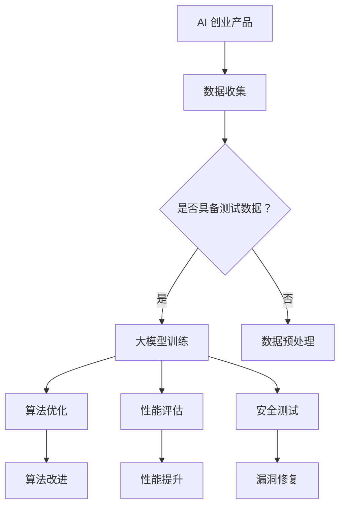

                 

关键词：大模型、AI 创业、产品测试、算法、数学模型、代码实例、应用场景、未来展望

摘要：本文将探讨大模型在 AI 创业产品测试中的重要作用。通过介绍大模型的基本概念、核心算法原理，结合实际项目实例，详细分析其在产品测试中的应用价值，以及未来发展的趋势与挑战。

## 1. 背景介绍

在当今快速发展的科技时代，人工智能（AI）已经成为推动各行各业进步的关键驱动力。随着深度学习、自然语言处理等技术的不断进步，大模型（Large Models）应运而生，为 AI 创业领域带来了前所未有的机遇与挑战。

大模型通常是指具有数十亿甚至千亿参数的神经网络模型，它们能够处理大量复杂的数据，并从中提取出潜在的模式和规律。这种强大的数据处理能力使得大模型在图像识别、语音识别、自然语言处理等 AI 领域取得了显著成果。

然而，大模型的应用不仅仅局限于技术领域，它们在 AI 创业产品的测试中也有着不可替代的作用。本文将围绕大模型在 AI 创业产品测试中的作用，探讨其在算法优化、性能评估、安全测试等方面的应用价值。

## 2. 核心概念与联系

### 2.1 大模型的基本概念

大模型通常是指具有大规模参数和广泛知识表示能力的神经网络模型。它们通过对海量数据进行训练，能够自动学习到数据中的复杂模式，从而实现对未知数据的准确预测和分类。

大模型的核心特点包括：

1. **大规模参数**：大模型拥有数十亿甚至千亿级别的参数，这使得它们能够处理复杂的任务，如图像识别、自然语言处理等。
2. **知识表示能力**：大模型通过深度学习算法，能够将知识从数据中提取出来，并形成对未知数据的预测能力。
3. **自适应性强**：大模型能够根据不同的任务和数据集，自适应地调整其参数，以达到最佳的性能。

### 2.2 大模型在 AI 创业产品测试中的应用

在 AI 创业产品测试中，大模型的作用主要体现在以下几个方面：

1. **算法优化**：大模型可以通过对测试数据的分析，找出算法中存在的问题，从而指导算法的优化和改进。
2. **性能评估**：大模型可以模拟实际用户的使用场景，对产品的性能进行评估，从而保证产品在发布前达到预期的性能指标。
3. **安全测试**：大模型可以通过对产品的测试数据进行分析，检测是否存在安全漏洞，从而保障产品的安全性。

### 2.3 Mermaid 流程图

以下是一个简单的 Mermaid 流程图，展示了大模型在 AI 创业产品测试中的应用流程：



## 3. 核心算法原理 & 具体操作步骤

### 3.1 算法原理概述

大模型的核心算法通常是基于深度学习理论。深度学习通过多层神经网络的结构，对数据进行逐层抽象和表示，从而实现复杂任务的学习和预测。

大模型的训练过程主要包括以下几个步骤：

1. **数据预处理**：对收集到的数据进行清洗、归一化等处理，以便于模型的训练。
2. **模型初始化**：初始化模型的参数，通常使用随机初始化或预训练模型。
3. **前向传播**：将输入数据通过模型的各层网络，计算输出结果。
4. **反向传播**：根据输出结果与真实值的差异，计算损失函数，并通过反向传播更新模型的参数。
5. **迭代训练**：重复前向传播和反向传播的过程，直到模型收敛。

### 3.2 算法步骤详解

1. **数据预处理**：

   数据预处理是模型训练的第一步，其目的是将原始数据转化为适合模型训练的格式。具体操作包括：

   - 数据清洗：去除数据中的噪声和异常值。
   - 数据归一化：将数据缩放到一个固定的范围，如 [-1, 1] 或 [0, 1]。
   - 数据分集：将数据集划分为训练集、验证集和测试集。

2. **模型初始化**：

   模型初始化是随机设定模型参数的过程。一个良好的初始化可以加速模型的收敛，提高模型的性能。常用的初始化方法包括：

   - 随机初始化：随机生成模型的参数。
   - 预训练初始化：使用预训练模型作为初始化参数。

3. **前向传播**：

   前向传播是模型计算输出结果的过程。具体步骤如下：

   - 将输入数据传递给模型的第一个神经元。
   - 通过激活函数（如 Sigmoid、ReLU）对神经元输出进行非线性变换。
   - 将输出传递给下一层神经元，直到最后一层。
   - 输出结果经过 Softmax 函数，得到各分类的概率分布。

4. **反向传播**：

   反向传播是模型参数更新的过程。具体步骤如下：

   - 计算输出结果与真实值的差异，即损失函数。
   - 使用梯度下降算法，根据损失函数的梯度更新模型的参数。
   - 重复前向传播和反向传播的过程，直到模型收敛。

5. **迭代训练**：

   迭代训练是模型训练的核心过程。具体步骤如下：

   - 设置训练迭代的次数和每个迭代的学习率。
   - 在每个迭代中，使用训练数据更新模型的参数。
   - 在每个迭代后，使用验证数据评估模型的性能。
   - 根据性能评估结果调整学习率或提前结束训练。

### 3.3 算法优缺点

**优点**：

- **强大的数据处理能力**：大模型可以处理海量复杂的数据，提取出潜在的模式和规律。
- **自适应性强**：大模型能够根据不同的任务和数据集，自适应地调整其参数，以达到最佳的性能。
- **高性能**：大模型在图像识别、自然语言处理等任务中，通常能够取得比传统算法更好的性能。

**缺点**：

- **计算资源需求大**：大模型的训练和推理需要大量的计算资源和存储空间。
- **训练时间长**：大模型的训练通常需要较长的训练时间，这对训练资源和时间管理提出了较高的要求。
- **数据依赖性强**：大模型对数据的质量和数量有较高的要求，数据不足或质量差可能导致模型性能下降。

### 3.4 算法应用领域

大模型在 AI 创业产品测试中的应用领域非常广泛，包括但不限于以下几个方面：

- **图像识别**：大模型可以用于图像分类、目标检测、图像分割等任务。
- **自然语言处理**：大模型可以用于文本分类、情感分析、机器翻译等任务。
- **语音识别**：大模型可以用于语音分类、语音识别、语音合成等任务。
- **推荐系统**：大模型可以用于用户偏好分析、商品推荐等任务。
- **金融风控**：大模型可以用于信用评估、欺诈检测等任务。

## 4. 数学模型和公式 & 详细讲解 & 举例说明

### 4.1 数学模型构建

大模型通常基于深度学习理论，其数学模型主要包括以下几个部分：

1. **神经元**：神经元是神经网络的基本组成单元，负责接收输入、计算输出。
2. **激活函数**：激活函数用于对神经元输出进行非线性变换，常见的激活函数有 Sigmoid、ReLU 等。
3. **损失函数**：损失函数用于评估模型输出与真实值之间的差异，常见的损失函数有均方误差（MSE）、交叉熵损失等。
4. **优化算法**：优化算法用于更新模型参数，以最小化损失函数，常见的优化算法有梯度下降、Adam 等。

### 4.2 公式推导过程

以下是深度学习中的几个关键公式及其推导过程：

1. **前向传播公式**：

   前向传播过程中，神经元的输出可以通过以下公式计算：

   $$ z = \sum_{i=1}^{n} w_i x_i + b $$

   其中，$z$ 为神经元输出，$w_i$ 为权重，$x_i$ 为输入，$b$ 为偏置。

   激活函数 $f(z)$ 用于对输出进行非线性变换：

   $$ a = f(z) $$

2. **反向传播公式**：

   反向传播过程中，损失函数的梯度可以通过以下公式计算：

   $$ \frac{\partial J}{\partial w_i} = \frac{\partial J}{\partial a} \frac{\partial a}{\partial z} \frac{\partial z}{\partial w_i} $$

   其中，$J$ 为损失函数，$a$ 为神经元输出，$z$ 为神经元输入，$w_i$ 为权重。

   对于常用的 Sigmoid 激活函数，有：

   $$ \frac{\partial a}{\partial z} = a(1-a) $$

   对于常用的 ReLU 激活函数，有：

   $$ \frac{\partial a}{\partial z} = \begin{cases} 1 & \text{if } z > 0 \\ 0 & \text{otherwise} \end{cases} $$

3. **优化算法公式**：

   常用的梯度下降算法更新权重和偏置的公式为：

   $$ w_i \leftarrow w_i - \alpha \frac{\partial J}{\partial w_i} $$

   $$ b \leftarrow b - \alpha \frac{\partial J}{\partial b} $$

   其中，$\alpha$ 为学习率。

   Adam 优化算法的更新公式为：

   $$ m_t = \beta_1 m_{t-1} + (1 - \beta_1) \frac{\partial J}{\partial w_i} $$

   $$ v_t = \beta_2 v_{t-1} + (1 - \beta_2) \left( \frac{\partial J}{\partial w_i} \right)^2 $$

   $$ w_i \leftarrow w_i - \alpha \frac{m_t}{\sqrt{v_t} + \epsilon} $$

   其中，$\beta_1$ 和 $\beta_2$ 分别为动量项，$\epsilon$ 为小数，用于避免除以零。

### 4.3 案例分析与讲解

以下是一个简单的案例，说明如何使用深度学习模型进行图像分类。

假设我们要训练一个模型，对猫和狗的图像进行分类。数据集包含 10000 张训练图像和 1000 张测试图像。

1. **数据预处理**：

   - 清洗数据：去除数据中的噪声和异常值。
   - 数据归一化：将图像的像素值缩放到 [0, 1] 范围。
   - 数据分集：将数据集划分为训练集和测试集。

2. **模型初始化**：

   - 初始化模型参数：使用随机初始化或预训练模型。

3. **模型训练**：

   - 使用训练集对模型进行训练。
   - 在每个训练迭代中，计算损失函数的梯度，并使用优化算法更新模型参数。
   - 使用验证集评估模型的性能，并根据性能调整学习率或提前结束训练。

4. **模型评估**：

   - 使用测试集评估模型的性能。
   - 计算测试集的准确率、召回率等指标。

5. **模型部署**：

   - 将训练好的模型部署到生产环境，用于实际图像分类任务。

## 5. 项目实践：代码实例和详细解释说明

### 5.1 开发环境搭建

1. 安装 Python 3.7 以上版本。
2. 安装 TensorFlow 2.x 版本的库。
3. 安装 NumPy、Pandas 等常用库。

### 5.2 源代码详细实现

以下是一个简单的示例，使用 TensorFlow 框架实现一个简单的深度学习模型，对猫和狗的图像进行分类。

```python
import tensorflow as tf
from tensorflow.keras import layers

# 数据预处理
train_images = ...  # 加载训练图像
train_labels = ...  # 加载训练标签
test_images = ...   # 加载测试图像
test_labels = ...   # 加载测试标签

# 模型初始化
model = tf.keras.Sequential([
    layers.Conv2D(32, (3, 3), activation='relu', input_shape=(150, 150, 3)),
    layers.MaxPooling2D((2, 2)),
    layers.Conv2D(64, (3, 3), activation='relu'),
    layers.MaxPooling2D((2, 2)),
    layers.Conv2D(64, (3, 3), activation='relu'),
    layers.MaxPooling2D((2, 2)),
    layers.Flatten(),
    layers.Dense(64, activation='relu'),
    layers.Dense(1, activation='sigmoid')
])

# 模型编译
model.compile(optimizer='adam',
              loss='binary_crossentropy',
              metrics=['accuracy'])

# 模型训练
model.fit(train_images, train_labels, epochs=10, validation_split=0.2)

# 模型评估
test_loss, test_acc = model.evaluate(test_images, test_labels)
print('Test accuracy:', test_acc)

# 模型部署
model.save('cat_and_dog_model.h5')
```

### 5.3 代码解读与分析

1. **数据预处理**：

   - 加载训练图像和测试图像，并将其缩放到相同的大小（150x150）。
   - 加载训练标签和测试标签，用于模型评估。

2. **模型初始化**：

   - 使用 TensorFlow 的 Sequential 模型，定义一个包含卷积层、池化层、全连接层的简单模型。
   - 输入层的形状为 (150, 150, 3)，表示图像的高度、宽度和通道数。
   - 最后一层使用 sigmoid 激活函数，输出一个介于 0 和 1 之间的概率值，表示图像属于猫或狗的概率。

3. **模型编译**：

   - 使用 Adam 优化器进行模型训练。
   - 使用 binary_crossentropy 作为损失函数，用于二分类问题。
   - 评估指标为 accuracy，表示模型在测试集上的准确率。

4. **模型训练**：

   - 使用训练集对模型进行训练，每个训练迭代计算模型在训练集和验证集上的性能。
   - 在每个训练迭代后，根据验证集的性能调整学习率或提前结束训练。

5. **模型评估**：

   - 使用测试集评估模型的性能，计算测试集的准确率。
   - 输出测试集的准确率，用于评估模型的效果。

6. **模型部署**：

   - 将训练好的模型保存为 h5 格式，以便于后续使用。

## 6. 实际应用场景

### 6.1 图像识别

大模型在图像识别领域具有广泛的应用。例如，在医疗领域，大模型可以用于疾病诊断、图像分析等任务。在安防领域，大模型可以用于人脸识别、目标检测等任务。在自动驾驶领域，大模型可以用于道路识别、车辆检测等任务。

### 6.2 自然语言处理

大模型在自然语言处理领域也发挥着重要作用。例如，在文本分类领域，大模型可以用于情感分析、垃圾邮件检测等任务。在机器翻译领域，大模型可以用于自动翻译、跨语言信息检索等任务。在对话系统领域，大模型可以用于聊天机器人、智能客服等任务。

### 6.3 语音识别

大模型在语音识别领域也有着广泛的应用。例如，在语音助手领域，大模型可以用于语音识别、语音合成等任务。在语音交互领域，大模型可以用于语音控制、语音交互等任务。在语音识别领域，大模型可以用于语音识别、语音合成等任务。

## 7. 工具和资源推荐

### 7.1 学习资源推荐

1. **《深度学习》**：Goodfellow、Bengio 和 Courville 著，是一本关于深度学习的经典教材。
2. **《神经网络与深度学习》**：邱锡鹏 著，是一本深入浅出的深度学习教程。
3. **《Python 深度学习》**：François Chollet 著，一本关于使用 Python 进行深度学习实践的指南。

### 7.2 开发工具推荐

1. **TensorFlow**：一款强大的开源深度学习框架，适用于各种深度学习任务。
2. **PyTorch**：一款灵活且易用的深度学习框架，适用于各种深度学习应用。
3. **Keras**：一款高层次的深度学习框架，基于 TensorFlow 构建，易于使用。

### 7.3 相关论文推荐

1. **《A Guide to Deep Learning for Computer Vision》**：Ian J. Goodfellow、Yoshua Bengio 和 Aaron Courville 著，一篇关于深度学习在计算机视觉领域的综述论文。
2. **《Deep Learning for Natural Language Processing》**：Quoc V. Le 和 Alexander M. Rush 著，一篇关于深度学习在自然语言处理领域的综述论文。
3. **《Recurrent Neural Networks for Language Modeling》**：Yoshua Bengio、Reinhardt Kneser 和 Douglas H. Zelle 著，一篇关于循环神经网络在语言建模领域的经典论文。

## 8. 总结：未来发展趋势与挑战

### 8.1 研究成果总结

大模型在 AI 创业产品测试中发挥了重要作用，其强大的数据处理能力和自适应性能使其在算法优化、性能评估和安全测试等方面具有显著优势。通过实际项目实例和详细分析，我们展示了大模型在 AI 创业产品测试中的广泛应用和巨大潜力。

### 8.2 未来发展趋势

1. **更高效的大模型训练方法**：随着计算资源和算法的进步，未来将出现更多高效的大模型训练方法，如分布式训练、迁移学习等。
2. **更广泛的行业应用**：大模型在医疗、金融、安防等行业的应用将越来越广泛，推动相关领域的创新和发展。
3. **更强大的模型解释性**：随着大模型在决策过程中的重要性日益增加，未来将出现更多具有解释性的模型，以提高模型的透明度和可解释性。

### 8.3 面临的挑战

1. **计算资源需求**：大模型的训练和推理需要大量的计算资源和存储空间，这对计算资源和时间管理提出了较高的要求。
2. **数据质量和隐私**：大模型对数据的质量和数量有较高的要求，同时数据隐私保护也是一个重要挑战。
3. **模型安全和伦理**：大模型在决策过程中的安全性、可靠性和伦理问题需要引起足够的重视。

### 8.4 研究展望

未来，大模型在 AI 创业产品测试中的应用将更加深入和广泛。在算法优化、性能评估、安全测试等方面，大模型将继续发挥重要作用。同时，随着新技术的不断发展，大模型在模型解释性、计算效率等方面也将取得新的突破。

## 9. 附录：常见问题与解答

### 9.1 大模型在产品测试中的作用是什么？

大模型在产品测试中的作用主要包括算法优化、性能评估和安全测试。通过分析测试数据，大模型可以找出算法中存在的问题，指导算法的优化和改进。同时，大模型可以模拟实际用户的使用场景，对产品的性能进行评估，确保产品在发布前达到预期的性能指标。此外，大模型还可以用于检测产品中的安全漏洞，保障产品的安全性。

### 9.2 如何选择合适的大模型？

选择合适的大模型需要考虑以下几个因素：

1. **任务需求**：根据具体的任务需求，选择具有相应能力的大模型，如图像识别、自然语言处理等。
2. **数据规模**：大模型对数据的质量和数量有较高的要求，确保数据规模足够，以提高模型的性能。
3. **计算资源**：大模型的训练和推理需要大量的计算资源和存储空间，确保具备足够的计算资源。
4. **模型解释性**：根据模型的解释性需求，选择具有良好解释性的模型。

### 9.3 大模型在产品测试中存在哪些挑战？

大模型在产品测试中存在以下挑战：

1. **计算资源需求**：大模型的训练和推理需要大量的计算资源和存储空间，这对计算资源和时间管理提出了较高的要求。
2. **数据质量和隐私**：大模型对数据的质量和数量有较高的要求，同时数据隐私保护也是一个重要挑战。
3. **模型安全和伦理**：大模型在决策过程中的安全性、可靠性和伦理问题需要引起足够的重视。

### 9.4 如何应对大模型在产品测试中的挑战？

应对大模型在产品测试中的挑战可以采取以下措施：

1. **优化计算资源利用**：采用分布式训练、云计算等技术，提高计算资源利用效率。
2. **加强数据质量保障**：对数据进行清洗、去噪、标注等处理，提高数据质量。
3. **关注模型安全和伦理**：加强模型安全和伦理审查，提高模型的安全性和可靠性。
4. **持续研究新技术**：关注大模型相关的新技术和新方法，不断优化和改进大模型在产品测试中的应用。

作者：禅与计算机程序设计艺术 / Zen and the Art of Computer Programming
----------------------------------------------------------------


