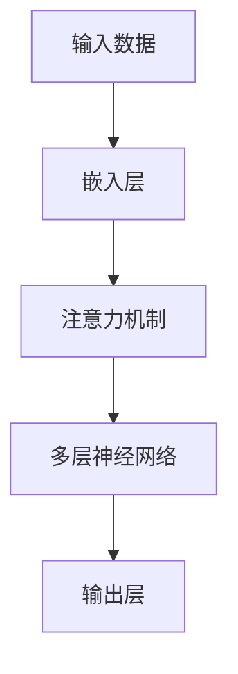

                 

关键词：大模型，AI创业，产品测试，重要性，应用场景

> 摘要：本文旨在探讨大模型在AI创业产品测试中的重要性，从背景介绍、核心概念与联系、核心算法原理、数学模型和公式、项目实践、实际应用场景、工具和资源推荐以及未来发展趋势与挑战等方面进行深入分析，以期为AI创业团队提供有价值的参考。

## 1. 背景介绍

随着人工智能技术的快速发展，大模型已经成为当前AI领域的热点话题。大模型是指具有数百万甚至数十亿参数的深度学习模型，它们在图像识别、自然语言处理、语音识别等领域取得了显著的成果。然而，在AI创业过程中，如何有效地测试和优化这些大模型，以确保产品质量和用户体验，成为了一个重要且具有挑战性的问题。

### 1.1 AI创业产品测试的现状

目前，AI创业产品测试主要面临以下问题：

1. **测试数据不足**：很多创业公司由于资源和时间的限制，难以获取足够的多样性测试数据，导致模型在实际应用中的表现不佳。
2. **测试方法单一**：传统的测试方法主要依赖于手工编写测试用例和模拟用户行为，这种方式效率低下且容易出现漏测。
3. **测试成本高**：大模型的训练和测试需要大量的计算资源和时间，这无疑增加了创业公司的成本压力。

### 1.2 大模型在AI创业产品测试中的重要性

1. **提升产品质量**：大模型能够处理更复杂、更丰富的数据，从而提升产品的质量，降低缺陷率。
2. **优化用户体验**：通过大模型的测试，可以更准确地预测用户行为，从而设计出更符合用户需求的产品。
3. **降低测试成本**：大模型能够自动化地进行大规模的测试，减少人工编写测试用例的工作量，降低测试成本。
4. **提高测试效率**：大模型能够快速地处理大量数据，大大缩短测试周期，提高开发效率。

## 2. 核心概念与联系

### 2.1 大模型的定义

大模型通常指的是具有数百万甚至数十亿参数的深度学习模型，如Transformer、BERT等。这些模型具有强大的表征能力，能够处理复杂的任务和数据。

### 2.2 大模型与AI创业产品的联系

1. **产品需求分析**：大模型可以帮助创业公司更好地理解用户需求，从而设计出更符合用户需求的产品。
2. **产品设计**：大模型可以用于产品设计中的多个环节，如界面设计、功能设计等，以提高产品的可用性和用户体验。
3. **产品测试**：大模型可以自动化地进行大规模的测试，提高测试效率和准确性。

### 2.3 大模型的架构



## 3. 核心算法原理 & 具体操作步骤

### 3.1 算法原理概述

大模型的核心算法是基于深度学习的，主要包括以下几个部分：

1. **嵌入层**：将输入数据（如文本、图像等）转换为固定长度的向量表示。
2. **注意力机制**：用于处理序列数据，使模型能够关注输入数据中的关键信息。
3. **多层神经网络**：用于对输入数据进行复杂的非线性变换。
4. **输出层**：根据模型的训练目标（如分类、回归等）进行预测。

### 3.2 算法步骤详解

1. **数据预处理**：对输入数据进行清洗、归一化等处理，确保数据质量。
2. **模型训练**：通过反向传播算法，不断调整模型参数，使模型在训练数据上达到较好的拟合。
3. **模型评估**：在验证数据集上评估模型性能，选择最佳模型。
4. **模型部署**：将模型部署到产品中，进行实际应用。

### 3.3 算法优缺点

**优点**：

1. **强大的表征能力**：大模型能够处理复杂的任务和数据。
2. **高效性**：大模型能够自动化地进行大规模的测试，提高测试效率和准确性。

**缺点**：

1. **计算资源需求高**：大模型需要大量的计算资源和时间进行训练和测试。
2. **数据要求高**：大模型对数据质量有较高要求，数据不足或数据质量问题可能导致模型性能下降。

### 3.4 算法应用领域

大模型在AI创业产品测试中的应用领域广泛，包括但不限于：

1. **图像识别**：用于检测产品质量、识别图像中的关键信息等。
2. **自然语言处理**：用于分析用户评论、识别情感等。
3. **语音识别**：用于语音识别、语音助手等。

## 4. 数学模型和公式 & 详细讲解 & 举例说明

### 4.1 数学模型构建

大模型的数学模型主要基于深度学习的框架，如神经网络。以下是一个简化的神经网络模型：

$$
Y = \sigma(W \cdot X + b)
$$

其中，$Y$ 是输出，$X$ 是输入，$W$ 是权重，$b$ 是偏置，$\sigma$ 是激活函数。

### 4.2 公式推导过程

假设我们有一个简单的神经网络，输入层有 $m$ 个神经元，隐藏层有 $n$ 个神经元，输出层有 $k$ 个神经元。我们可以将上述公式推广为：

$$
Y^{(l)} = \sigma(W^{(l)} \cdot X^{(l-1)} + b^{(l)})
$$

其中，$Y^{(l)}$ 是第 $l$ 层的输出，$X^{(l-1)}$ 是第 $l-1$ 层的输出，$W^{(l)}$ 是第 $l$ 层的权重，$b^{(l)}$ 是第 $l$ 层的偏置。

### 4.3 案例分析与讲解

假设我们有一个分类问题，输入数据是 $100 \times 100$ 的图像，我们需要将图像分类为猫或狗。我们可以使用一个简单的神经网络模型进行分类：

$$
\begin{aligned}
X &= (X_1, X_2, ..., X_{100 \times 100}) \\
Y &= \sigma(W \cdot X + b) \\
P &= \text{softmax}(Y)
\end{aligned}
$$

其中，$X$ 是输入图像，$Y$ 是神经网络输出，$P$ 是输出概率分布。

## 5. 项目实践：代码实例和详细解释说明

### 5.1 开发环境搭建

我们使用Python编写一个简单的神经网络模型，使用TensorFlow作为深度学习框架。

```python
import tensorflow as tf

# 设置随机种子，保证实验可重复
tf.random.set_seed(42)

# 定义神经网络结构
model = tf.keras.Sequential([
    tf.keras.layers.Dense(units=512, activation='relu', input_shape=(784,)),
    tf.keras.layers.Dense(units=10, activation='softmax')
])

# 编译模型
model.compile(optimizer='adam', loss='categorical_crossentropy', metrics=['accuracy'])
```

### 5.2 源代码详细实现

```python
# 加载数据集
(x_train, y_train), (x_test, y_test) = tf.keras.datasets.mnist.load_data()

# 数据预处理
x_train = x_train / 255.0
x_test = x_test / 255.0

# 将输入数据转换为one-hot编码
y_train = tf.keras.utils.to_categorical(y_train, num_classes=10)
y_test = tf.keras.utils.to_categorical(y_test, num_classes=10)

# 训练模型
model.fit(x_train, y_train, epochs=10, batch_size=64, validation_data=(x_test, y_test))

# 评估模型
model.evaluate(x_test, y_test)
```

### 5.3 代码解读与分析

1. **数据预处理**：将输入数据缩放至 [0, 1]，并将标签转换为 one-hot 编码。
2. **模型定义**：使用 `tf.keras.Sequential` 定义一个简单的神经网络模型，包括一个输入层和一个隐藏层。
3. **模型编译**：设置优化器、损失函数和评估指标。
4. **模型训练**：使用 `fit` 方法训练模型，并设置训练轮数、批量大小和验证数据。
5. **模型评估**：使用 `evaluate` 方法评估模型在测试数据集上的性能。

### 5.4 运行结果展示

```python
# 运行代码，输出模型在测试数据集上的准确率
accuracy = model.evaluate(x_test, y_test)
print(f"Test accuracy: {accuracy[1]}")
```

## 6. 实际应用场景

### 6.1 图像识别

在图像识别领域，大模型可以用于产品测试，如检测产品质量、识别图像中的关键信息等。例如，一家生产智能手机的创业公司可以使用大模型检测摄像头拍摄的照片，以确保照片质量。

### 6.2 自然语言处理

在自然语言处理领域，大模型可以用于产品测试，如分析用户评论、识别情感等。例如，一家在线教育平台可以使用大模型分析学生的反馈，以优化课程内容和教学方法。

### 6.3 语音识别

在语音识别领域，大模型可以用于产品测试，如识别语音命令、实现语音助手等。例如，一家智能家居公司可以使用大模型识别用户语音命令，以实现智能音箱的功能。

## 7. 工具和资源推荐

### 7.1 学习资源推荐

1. **书籍**：《深度学习》（Goodfellow、Bengio和Courville著）
2. **在线课程**：Coursera上的《深度学习》课程（吴恩达教授）
3. **博客**：arXiv.org上的最新研究论文和博客

### 7.2 开发工具推荐

1. **深度学习框架**：TensorFlow、PyTorch
2. **数据处理库**：NumPy、Pandas
3. **可视化工具**：Matplotlib、Seaborn

### 7.3 相关论文推荐

1. **Transformer**：Attention Is All You Need（Vaswani等，2017）
2. **BERT**：BERT: Pre-training of Deep Bidirectional Transformers for Language Understanding（Devlin等，2018）
3. **GPT-3**：Language Models are Few-Shot Learners（Brown等，2020）

## 8. 总结：未来发展趋势与挑战

### 8.1 研究成果总结

大模型在AI创业产品测试中展现了强大的优势，如提升产品质量、优化用户体验、降低测试成本和提高测试效率。同时，大模型在图像识别、自然语言处理和语音识别等领域的应用也越来越广泛。

### 8.2 未来发展趋势

1. **模型压缩与优化**：为了降低计算成本，模型压缩与优化将成为研究热点。
2. **迁移学习与少样本学习**：通过迁移学习和少样本学习，大模型将更好地适应不同的应用场景。
3. **联邦学习与隐私保护**：联邦学习和隐私保护技术将使得大模型在AI创业产品测试中发挥更大的作用。

### 8.3 面临的挑战

1. **计算资源需求**：大模型对计算资源的需求仍然很高，特别是在训练阶段。
2. **数据质量与多样性**：数据质量和多样性是影响大模型性能的重要因素。
3. **模型解释性**：大模型的黑盒性质使得其解释性成为了一个挑战。

### 8.4 研究展望

随着人工智能技术的不断发展，大模型在AI创业产品测试中的应用前景将更加广阔。未来，我们需要关注如何优化大模型的结构和算法，提高其性能和可解释性，以更好地服务于AI创业产品测试。

## 9. 附录：常见问题与解答

### 9.1 什么是大模型？

大模型是指具有数百万甚至数十亿参数的深度学习模型，如Transformer、BERT等。这些模型具有强大的表征能力，能够处理复杂的任务和数据。

### 9.2 大模型在AI创业产品测试中的应用有哪些？

大模型可以应用于图像识别、自然语言处理和语音识别等AI创业产品的测试，如检测产品质量、分析用户评论、识别语音命令等。

### 9.3 大模型对计算资源的需求如何？

大模型对计算资源的需求较高，特别是在训练阶段。训练一个大型神经网络模型可能需要数天甚至数周的时间。

### 9.4 如何提高大模型的测试效率？

可以通过以下方法提高大模型的测试效率：

1. **并行计算**：利用多核CPU或GPU进行并行计算。
2. **分布式训练与测试**：将模型训练和测试分布在多个节点上进行。
3. **模型压缩与优化**：采用模型压缩和优化技术，如剪枝、量化等。

### 9.5 大模型在AI创业产品测试中是否具有优势？

是的，大模型在AI创业产品测试中具有以下优势：

1. **提升产品质量**：大模型能够处理更复杂、更丰富的数据，从而提升产品的质量。
2. **优化用户体验**：通过大模型的测试，可以更准确地预测用户行为，从而设计出更符合用户需求的产品。
3. **降低测试成本**：大模型能够自动化地进行大规模的测试，减少人工编写测试用例的工作量，降低测试成本。
4. **提高测试效率**：大模型能够快速地处理大量数据，大大缩短测试周期，提高开发效率。

### 9.6 大模型在AI创业产品测试中是否存在挑战？

是的，大模型在AI创业产品测试中存在以下挑战：

1. **计算资源需求高**：大模型需要大量的计算资源和时间进行训练和测试。
2. **数据要求高**：大模型对数据质量有较高要求，数据不足或数据质量问题可能导致模型性能下降。
3. **模型解释性差**：大模型的黑盒性质使得其解释性成为一个挑战。

