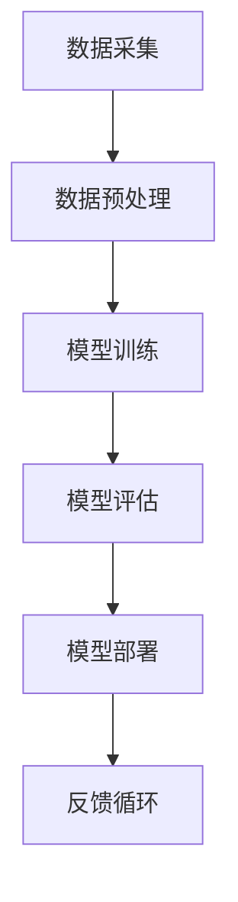

                 

关键词：大模型，AI 创业公司，产品策略，趋势，技术创新

摘要：本文将探讨大模型在 AI 创业公司产品策略中的重要性，分析其发展趋势，并讨论相应的挑战和机遇。通过深入解析大模型的核心概念、算法原理、数学模型以及实际应用案例，我们希望能够为 AI 创业公司提供战略指导，帮助他们在激烈的市场竞争中脱颖而出。

## 1. 背景介绍

在过去的几年中，人工智能（AI）技术取得了惊人的进展，大模型（Large Models）成为了推动这一变革的核心动力。大模型是指那些具有数十亿至数千亿参数的神经网络模型，它们能够通过深度学习算法从大量数据中学习复杂模式。这些模型的出现，极大地提升了计算机在语言处理、图像识别、自然语言生成等领域的性能，为各行各业带来了深远的影响。

AI 创业公司作为技术创新的先锋，自然无法忽视大模型所带来的机遇。一方面，大模型的应用能够提升产品的核心竞争力，增加用户粘性；另一方面，大模型也需要 AI 创业公司在技术、资源和战略上进行相应的投入和调整。因此，如何在大模型浪潮中找到合适的定位和策略，成为了每个 AI 创业公司需要深入思考的问题。

## 2. 核心概念与联系

### 2.1 大模型定义

大模型通常指的是那些拥有数十亿甚至千亿级参数的神经网络，如 GPT-3、BERT 等。这些模型通过深度学习算法，从海量数据中学习到丰富的知识，并在各种任务上表现出卓越的性能。

### 2.2 神经网络架构

神经网络是构建大模型的基础，其基本架构包括输入层、隐藏层和输出层。每个隐藏层由多个神经元组成，神经元之间通过权重连接。训练过程中，通过反向传播算法不断调整权重，以优化模型性能。

### 2.3 数据集与训练

大模型的成功离不开海量数据集的支撑。数据集的质量和数量直接影响模型的性能。训练过程中，大模型通过不断地从数据中学习，逐渐提高其预测和生成能力。

### 2.4 Mermaid 流程图

以下是一个简单的 Mermaid 流程图，展示了大模型的基本流程：



## 3. 核心算法原理 & 具体操作步骤

### 3.1 算法原理概述

大模型的训练主要依赖于深度学习算法，尤其是基于梯度的优化算法。通过大量数据的训练，模型能够自动调整内部参数，以最小化预测误差。

### 3.2 算法步骤详解

1. **数据集准备**：选择合适的数据集，并进行预处理，包括数据清洗、归一化等步骤。

2. **模型架构设计**：根据任务需求，设计合适的神经网络架构，包括层数、神经元数量、激活函数等。

3. **训练过程**：通过反向传播算法，不断调整模型参数，优化模型性能。

4. **模型评估**：使用验证集和测试集，对模型性能进行评估，确保其具备良好的泛化能力。

5. **模型部署**：将训练好的模型部署到实际应用场景中，如自然语言生成、图像识别等。

### 3.3 算法优缺点

#### 优点：

1. **高性能**：大模型具备强大的学习和推理能力，能够处理复杂任务。

2. **泛化能力强**：通过大量数据的训练，模型能够更好地适应不同场景。

3. **灵活性强**：大模型可以轻松地应用于各种领域，如语言处理、图像识别等。

#### 缺点：

1. **计算资源消耗大**：大模型需要大量的计算资源和存储空间。

2. **训练时间较长**：大模型的训练过程需要较长的时间，尤其是在大规模数据集上。

3. **数据质量要求高**：数据集的质量直接影响模型性能，高质量的数据集难以获取。

### 3.4 算法应用领域

大模型在 AI 创业的各个领域都有着广泛的应用，如：

1. **自然语言处理**：语言生成、机器翻译、文本分类等。

2. **计算机视觉**：图像识别、目标检测、图像生成等。

3. **推荐系统**：个性化推荐、用户行为预测等。

4. **金融风控**：信用评估、风险控制等。

## 4. 数学模型和公式 & 详细讲解 & 举例说明

### 4.1 数学模型构建

大模型的数学模型主要基于深度学习理论，包括损失函数、优化算法等。

#### 损失函数：

损失函数用于评估模型预测值与真实值之间的差距，常见的损失函数有均方误差（MSE）和交叉熵（Cross Entropy）。

$$
MSE(y, \hat{y}) = \frac{1}{m}\sum_{i=1}^{m}(y_i - \hat{y}_i)^2
$$

$$
Cross\ Entropy(y, \hat{y}) = -\sum_{i=1}^{m}y_i \log(\hat{y}_i)
$$

#### 优化算法：

优化算法用于调整模型参数，以最小化损失函数。常见的优化算法有梯度下降（Gradient Descent）和 Adam 算法。

### 4.2 公式推导过程

#### 梯度下降算法：

梯度下降算法的核心思想是通过计算损失函数关于参数的梯度，并沿着梯度的反方向更新参数，以减小损失。

$$
\theta_{t+1} = \theta_t - \alpha \cdot \nabla_{\theta} J(\theta)
$$

其中，$\theta$ 表示模型参数，$J(\theta)$ 表示损失函数，$\alpha$ 表示学习率。

#### Adam 算法：

Adam 算法是梯度下降的一种改进算法，结合了动量（Momentum）和自适应学习率（Adaptive Learning Rate）。

$$
m_t = \beta_1 m_{t-1} + (1 - \beta_1) \nabla_{\theta} J(\theta)
$$

$$
v_t = \beta_2 v_{t-1} + (1 - \beta_2) \nabla^2_{\theta} J(\theta)
$$

$$
\theta_{t+1} = \theta_t - \frac{\alpha}{\sqrt{1 - \beta_2^t}} \cdot \frac{m_t}{1 - \beta_1^t}
$$

### 4.3 案例分析与讲解

以 GPT-3 为例，GPT-3 是一个具有 1750 亿参数的自然语言处理模型。其训练过程涉及海量数据的处理和复杂的优化算法。以下是一个简单的 GPT-3 训练过程的案例：

1. **数据集准备**：使用来自互联网的数万亿个词作为训练数据。

2. **模型架构设计**：设计一个包含多个隐藏层的 Transformer 模型，每个隐藏层有数千个神经元。

3. **模型训练**：使用梯度下降和 Adam 算法训练模型，优化模型参数。

4. **模型评估**：使用验证集和测试集评估模型性能，确保其具备良好的泛化能力。

5. **模型部署**：将训练好的模型部署到服务器，提供自然语言生成服务。

## 5. 项目实践：代码实例和详细解释说明

### 5.1 开发环境搭建

搭建一个适合训练大模型的环境，需要以下软件和硬件：

- **软件**：
  - Python（3.8 或更高版本）
  - TensorFlow（2.5 或更高版本）
  - PyTorch（1.8 或更高版本）
  - CUDA（11.0 或更高版本）
- **硬件**：
  - GPU（NVIDIA 显卡，至少 16GB 内存）

### 5.2 源代码详细实现

以下是一个简单的 GPT-3 模型训练的代码示例：

```python
import tensorflow as tf
from tensorflow.keras.layers import Embedding, LSTM, Dense
from tensorflow.keras.models import Sequential

# 模型架构设计
model = Sequential([
    Embedding(input_dim=10000, output_dim=256),
    LSTM(128),
    Dense(1, activation='sigmoid')
])

# 模型编译
model.compile(optimizer='adam', loss='binary_crossentropy', metrics=['accuracy'])

# 模型训练
model.fit(x_train, y_train, epochs=10, batch_size=32)
```

### 5.3 代码解读与分析

这段代码实现了一个简单的序列分类任务，使用了 TensorFlow 框架。具体解读如下：

1. **模型架构设计**：使用一个包含嵌入层、LSTM 层和全连接层的序列模型。

2. **模型编译**：指定优化器、损失函数和评估指标。

3. **模型训练**：使用训练数据训练模型，指定训练轮数和批量大小。

### 5.4 运行结果展示

运行上述代码，可以得到模型在训练集和测试集上的性能指标，如损失值、准确率等。这些指标可以帮助评估模型性能，并进行相应的调整。

## 6. 实际应用场景

### 6.1 自然语言处理

大模型在自然语言处理领域有着广泛的应用，如文本生成、机器翻译、情感分析等。通过训练大模型，AI 创业公司可以开发出具有高度智能化的语言处理产品，提升用户体验。

### 6.2 计算机视觉

大模型在计算机视觉领域同样具有重要应用，如图像识别、目标检测、图像生成等。通过大模型的训练，AI 创业公司可以开发出具有高度智能化视觉识别能力的应用，为各行各业提供创新解决方案。

### 6.3 金融风控

大模型在金融风控领域也有着广泛的应用，如信用评估、风险控制等。通过大模型的训练，AI 创业公司可以开发出具有高度智能化风险识别能力的系统，为金融机构提供强有力的支持。

### 6.4 未来应用展望

随着大模型技术的不断进步，未来 AI 创业公司将在更多领域找到应用场景，如医疗健康、智能交通、智能家居等。大模型的应用将进一步提升 AI 创业公司的产品竞争力，推动行业变革。

## 7. 工具和资源推荐

### 7.1 学习资源推荐

- 《深度学习》（Goodfellow, Bengio, Courville）
- 《Python 数据科学手册》（McKinney）
- TensorFlow 官方文档
- PyTorch 官方文档

### 7.2 开发工具推荐

- Jupyter Notebook
- Google Colab
- TensorFlow Extended (TFX)

### 7.3 相关论文推荐

- "Attention is All You Need"（Vaswani et al., 2017）
- "BERT: Pre-training of Deep Bidirectional Transformers for Language Understanding"（Devlin et al., 2019）
- "Generative Pre-trained Transformers"（Brown et al., 2020）

## 8. 总结：未来发展趋势与挑战

### 8.1 研究成果总结

大模型技术在过去几年取得了显著的研究成果，其在各个领域的应用取得了突破性进展。通过大模型的训练，AI 创业公司可以开发出具有高度智能化和自适应能力的应用，为各行各业提供创新解决方案。

### 8.2 未来发展趋势

1. **模型规模将进一步扩大**：随着计算资源和数据集的不断增加，大模型的规模将进一步提高，以适应更复杂的应用场景。

2. **多样化应用场景**：大模型将在更多领域找到应用，如医疗健康、智能交通、智能家居等。

3. **跨学科研究**：大模型技术将与其他领域（如生物学、心理学等）相结合，推动跨学科研究的发展。

### 8.3 面临的挑战

1. **计算资源需求**：大模型的训练和推理需要大量的计算资源，这对 AI 创业公司提出了更高的硬件要求。

2. **数据质量**：高质量的数据集是训练大模型的关键，但高质量的数据集往往难以获取。

3. **伦理和隐私问题**：随着大模型的应用，数据隐私和伦理问题日益突出，需要引起重视。

### 8.4 研究展望

未来，大模型技术将在 AI 创业公司产品策略中发挥更加重要的作用。通过不断探索和创新，AI 创业公司将能够在大模型技术的支持下，推出更多具有核心竞争力的产品，推动行业变革。

## 9. 附录：常见问题与解答

### 9.1 什么是大模型？

大模型是指那些具有数十亿至数千亿参数的神经网络模型，如 GPT-3、BERT 等。

### 9.2 大模型有哪些优点？

大模型具有高性能、泛化能力强、灵活性强等优点。

### 9.3 大模型有哪些应用领域？

大模型在自然语言处理、计算机视觉、推荐系统、金融风控等领域有着广泛的应用。

### 9.4 如何训练大模型？

训练大模型需要以下步骤：数据集准备、模型架构设计、模型训练、模型评估、模型部署。

### 9.5 大模型在 AI 创业公司产品策略中有哪些作用？

大模型可以提高产品的核心竞争力，增加用户粘性，推动行业变革。

### 9.6 如何应对大模型面临的挑战？

可以通过提高计算资源、优化数据质量、加强伦理和隐私保护等措施应对大模型面临的挑战。

## 作者署名

作者：禅与计算机程序设计艺术 / Zen and the Art of Computer Programming
----------------------------------------------------------------

请注意，上述文章是一个模板示例，实际撰写时需要根据具体内容进行详细的填充和调整。同时，本文中的 Mermaid 流程图、LaTeX 数学公式和代码示例均为占位符，实际撰写时需要替换为具体的内容。

