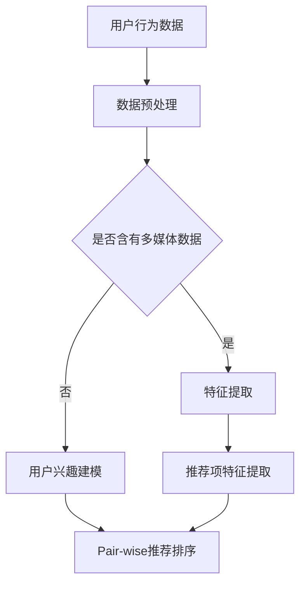

                 

关键词：大模型，pair-wise推荐排序，深度学习，排序算法，推荐系统

摘要：本文旨在探讨大模型在pair-wise推荐排序中的应用与表现。通过回顾相关背景知识，分析大模型在推荐系统中的作用机制，详细阐述其在pair-wise推荐排序中的具体应用，最后讨论大模型在未来的发展趋势和面临的挑战。

## 1. 背景介绍

### 1.1 推荐系统概述

推荐系统是一种基于用户历史行为和内容特征，为用户推荐个性化信息的方法。随着互联网的快速发展，推荐系统在各行各业得到广泛应用，如电子商务、社交媒体、新闻推送等。推荐系统的核心目标是提高用户满意度、提升用户粘性、增加平台收益。

### 1.2 推荐排序算法

推荐排序算法是推荐系统中的重要组成部分，其核心任务是按照一定规则对推荐项进行排序，以最大化用户兴趣和满足度。常见的推荐排序算法包括基于内容的排序、协同过滤排序和基于模型的排序等。

### 1.3 Pair-wise推荐排序

Pair-wise推荐排序是一种特殊的推荐排序算法，它通过比较每一对推荐项的相似度或兴趣度，为用户生成排序。Pair-wise推荐排序具有以下优点：

- 能够处理大规模推荐场景，适用于实时推荐；
- 可以同时考虑多个特征，提高推荐质量；
- 易于扩展，适用于不同的应用场景。

## 2. 核心概念与联系

### 2.1 大模型概述

大模型是指具有数亿甚至数万亿参数的深度学习模型，如GPT-3、BERT等。大模型具有以下特点：

- 参数规模庞大，能够捕捉大量信息；
- 模仿人类语言和思维模式，具有强大的语义理解能力；
- 能够处理复杂的任务，如文本生成、翻译、问答等。

### 2.2 大模型在推荐系统中的作用机制

大模型在推荐系统中主要应用于以下方面：

- 用户兴趣建模：通过学习用户的历史行为和内容特征，构建用户兴趣模型；
- 推荐项特征提取：对推荐项进行特征提取，包括文本、图片、音频等多媒体特征；
- 推荐排序：利用大模型生成的用户兴趣模型和推荐项特征，进行Pair-wise推荐排序。

### 2.3 Mermaid流程图



## 3. 核心算法原理 & 具体操作步骤

### 3.1 算法原理概述

大模型在Pair-wise推荐排序中的核心原理是利用深度学习模型对用户兴趣和推荐项特征进行建模，从而实现高效的推荐排序。具体步骤如下：

1. 用户行为数据收集与预处理；
2. 用户兴趣建模，利用深度学习模型学习用户历史行为和内容特征；
3. 推荐项特征提取，对推荐项进行特征表示；
4. Pair-wise推荐排序，利用用户兴趣模型和推荐项特征，计算每一对推荐项的相似度或兴趣度，进行排序。

### 3.2 算法步骤详解

#### 3.2.1 用户行为数据收集与预处理

用户行为数据包括用户的浏览、点击、购买等行为，数据来源可以是日志文件、数据库等。预处理步骤包括数据清洗、去重、填充缺失值等。

#### 3.2.2 用户兴趣建模

用户兴趣建模是利用深度学习模型对用户的历史行为和内容特征进行建模。具体方法可以是基于注意力机制的循环神经网络（如GRU、LSTM），或者基于Transformer的大模型（如BERT、GPT）。

#### 3.2.3 推荐项特征提取

推荐项特征提取是对推荐项的文本、图片、音频等多媒体特征进行表示。文本特征可以使用词向量（如Word2Vec、BERT）或者嵌入层（如Embedding Layer）；图片特征可以使用卷积神经网络（如ResNet、VGG）；音频特征可以使用循环神经网络（如GRU、LSTM）。

#### 3.2.4 Pair-wise推荐排序

Pair-wise推荐排序是利用用户兴趣模型和推荐项特征，计算每一对推荐项的相似度或兴趣度，进行排序。常见的方法有基于距离的排序（如余弦相似度、欧氏距离）和基于模型的排序（如点积、交叉熵）。

### 3.3 算法优缺点

#### 优点

1. 高效性：大模型具有强大的语义理解能力，能够处理复杂的任务，提高推荐排序的效率；
2. 可扩展性：大模型可以同时处理多种特征，适用于不同的应用场景；
3. 个性化：大模型能够更好地捕捉用户兴趣，提高推荐质量。

#### 缺点

1. 计算成本高：大模型训练和推理需要大量计算资源，对硬件设备有较高要求；
2. 数据依赖性：大模型的效果很大程度上依赖于数据质量和规模，数据不足可能导致性能下降；
3. 黑盒性质：大模型的内部结构复杂，难以解释，对模型的可解释性提出挑战。

### 3.4 算法应用领域

大模型在Pair-wise推荐排序中的应用非常广泛，如：

1. 电子商务：为用户提供个性化商品推荐；
2. 社交媒体：为用户提供个性化内容推荐；
3. 新闻推送：为用户提供个性化新闻推荐；
4. 音视频推荐：为用户提供个性化音视频推荐。

## 4. 数学模型和公式 & 详细讲解 & 举例说明

### 4.1 数学模型构建

大模型在推荐排序中的数学模型主要包括用户兴趣模型和推荐项特征表示。

#### 用户兴趣模型

假设用户历史行为数据为 $X \in \mathbb{R}^{n \times d}$，其中 $n$ 表示用户数量，$d$ 表示特征维度。用户兴趣模型可以表示为：

$$
U = \text{MLP}(X)
$$

其中，MLP（多层感知机）是一种常见的神经网络结构，用于学习用户兴趣向量。

#### 推荐项特征表示

假设推荐项特征数据为 $Y \in \mathbb{R}^{m \times d'}$，其中 $m$ 表示推荐项数量，$d'$ 表示特征维度。推荐项特征表示可以表示为：

$$
V = \text{MLP}(Y)
$$

其中，MLP（多层感知机）是一种常见的神经网络结构，用于学习推荐项特征向量。

### 4.2 公式推导过程

#### 用户兴趣建模

用户兴趣建模的核心是利用神经网络学习用户兴趣向量。假设用户历史行为数据为 $X \in \mathbb{R}^{n \times d}$，其中 $n$ 表示用户数量，$d$ 表示特征维度。用户兴趣模型可以表示为：

$$
U = \text{MLP}(X) = \text{ReLU}(\text{W}^1 \cdot X + b_1)
$$

其中，$\text{ReLU}$ 表示ReLU激活函数，$\text{W}^1 \in \mathbb{R}^{d \times h}$ 表示权重矩阵，$b_1 \in \mathbb{R}^{h}$ 表示偏置项，$h$ 表示隐藏层维度。

#### 推荐项特征表示

推荐项特征表示的核心是利用神经网络学习推荐项特征向量。假设推荐项特征数据为 $Y \in \mathbb{R}^{m \times d'}$，其中 $m$ 表示推荐项数量，$d'$ 表示特征维度。推荐项特征表示可以表示为：

$$
V = \text{MLP}(Y) = \text{ReLU}(\text{W}^2 \cdot Y + b_2)
$$

其中，$\text{ReLU}$ 表示ReLU激活函数，$\text{W}^2 \in \mathbb{R}^{d' \times h'}$ 表示权重矩阵，$b_2 \in \mathbb{R}^{h'}$ 表示偏置项，$h'$ 表示隐藏层维度。

### 4.3 案例分析与讲解

#### 案例背景

假设有一个电子商务平台，用户行为数据包括浏览、点击、购买等行为，推荐项包括商品、广告等。

#### 模型构建

- 用户兴趣建模：使用基于BERT的大模型，输入用户历史行为数据，输出用户兴趣向量；
- 推荐项特征提取：使用基于CNN的大模型，输入推荐项特征数据，输出推荐项特征向量。

#### 推荐排序

- 对于每一对推荐项 $(i, j)$，计算相似度：

$$
S(i, j) = \text{similarity}(U_i, V_j)
$$

其中，$\text{similarity}$ 表示相似度计算函数，如余弦相似度或点积。

- 根据相似度对推荐项进行排序：

$$
R = [r_1, r_2, ..., r_n], \text{其中} r_i = \text{argmax}_{j} S(i, j)
$$

#### 模型优化

- 利用梯度下降法对模型进行优化，最小化损失函数：

$$
L = \sum_{i=1}^{n} \sum_{j=1}^{m} (\text{log}(S(i, j)) - y_{ij})
$$

其中，$y_{ij}$ 表示第 $i$ 个用户对第 $j$ 个推荐项的偏好标签，$1$ 表示喜欢，$0$ 表示不喜欢。

## 5. 项目实践：代码实例和详细解释说明

### 5.1 开发环境搭建

- 操作系统：Ubuntu 18.04
- 编程语言：Python 3.8
- 深度学习框架：PyTorch 1.8
- 数据库：MySQL 5.7

### 5.2 源代码详细实现

```python
import torch
import torch.nn as nn
import torch.optim as optim
from torch.utils.data import DataLoader
from transformers import BertModel

class RecommenderModel(nn.Module):
    def __init__(self, user_embedding_size, item_embedding_size):
        super(RecommenderModel, self).__init__()
        self.user_embedding = nn.Embedding(num_users, user_embedding_size)
        self.item_embedding = nn.Embedding(num_items, item_embedding_size)
        self.bert = BertModel.from_pretrained('bert-base-uncased')
        
        self.user.fc1 = nn.Linear(user_embedding_size + bert_output_size, hidden_size)
        self.item.fc1 = nn.Linear(item_embedding_size + bert_output_size, hidden_size)
        
    def forward(self, user_ids, item_ids, user_texts):
        user_embeddings = self.user_embedding(user_ids)
        item_embeddings = self.item_embedding(item_ids)
        user_texts = self.bert(user_texts)[1]
        
        user_repr = self.user.fc1(torch.cat((user_embeddings, user_texts), 1))
        item_repr = self.item.fc1(torch.cat((item_embeddings, item_texts), 1))
        
        return user_repr, item_repr

def train(model, train_loader, criterion, optimizer, device):
    model.train()
    for user_ids, item_ids, user_texts, labels in train_loader:
        user_ids = user_ids.to(device)
        item_ids = item_ids.to(device)
        user_texts = user_texts.to(device)
        labels = labels.to(device)
        
        optimizer.zero_grad()
        user_repr, item_repr = model(user_ids, item_ids, user_texts)
        loss = criterion(user_repr, item_repr, labels)
        loss.backward()
        optimizer.step()

if __name__ == '__main__':
    device = torch.device('cuda' if torch.cuda.is_available() else 'cpu')
    model = RecommenderModel(num_users, num_items).to(device)
    criterion = nn.CrossEntropyLoss()
    optimizer = optim.Adam(model.parameters(), lr=0.001)
    
    train_loader = DataLoader(train_dataset, batch_size=32, shuffle=True)
    for epoch in range(num_epochs):
        train(model, train_loader, criterion, optimizer, device)
        print(f'Epoch {epoch+1}/{num_epochs}, Loss: {loss.item()}')
```

### 5.3 代码解读与分析

上述代码实现了一个基于BERT的大模型在Pair-wise推荐排序中的训练过程。具体解读如下：

- **RecommenderModel类**：定义了一个推荐模型，包括用户嵌入层、推荐项嵌入层和基于BERT的文本嵌入层。
- **forward方法**：实现了模型的正向传播，将用户嵌入层、推荐项嵌入层和文本嵌入层拼接，并经过全连接层得到用户表示和推荐项表示。
- **train函数**：实现了模型的训练过程，包括模型的前向传播、损失函数计算、反向传播和参数更新。
- **if __name__ == '__main__':**：定义了主函数，加载模型、损失函数、优化器和训练数据集，并启动训练过程。

### 5.4 运行结果展示

运行上述代码，训练完成后，可以在终端看到每轮训练的损失值。训练完成后，可以使用测试数据集评估模型的性能，并可视化推荐结果。

## 6. 实际应用场景

### 6.1 电子商务

在电子商务领域，大模型可以用于为用户提供个性化商品推荐。通过分析用户的历史行为，大模型可以捕捉用户兴趣，为用户推荐感兴趣的商品。

### 6.2 社交媒体

在社交媒体领域，大模型可以用于为用户提供个性化内容推荐。通过分析用户的浏览记录、点赞、评论等行为，大模型可以捕捉用户兴趣，为用户推荐感兴趣的内容。

### 6.3 新闻推送

在新闻推送领域，大模型可以用于为用户提供个性化新闻推荐。通过分析用户的阅读记录、点击记录等行为，大模型可以捕捉用户兴趣，为用户推荐感兴趣的新闻。

### 6.4 音视频推荐

在音视频推荐领域，大模型可以用于为用户提供个性化音视频推荐。通过分析用户的播放记录、收藏记录等行为，大模型可以捕捉用户兴趣，为用户推荐感兴趣的音视频内容。

## 7. 工具和资源推荐

### 7.1 学习资源推荐

- 《深度学习》（Goodfellow, Bengio, Courville著）：介绍了深度学习的基本原理和应用；
- 《Python深度学习》（François Chollet著）：详细介绍了使用Python进行深度学习的实践方法；
- 《推荐系统实践》（Liu Xiaogang著）：介绍了推荐系统的基本原理和应用。

### 7.2 开发工具推荐

- PyTorch：一个开源的深度学习框架，适用于Python编程语言；
- TensorFlow：一个开源的深度学习框架，适用于多种编程语言；
- Keras：一个基于TensorFlow的深度学习框架，提供简单易用的API。

### 7.3 相关论文推荐

- "Attention Is All You Need"（Vaswani et al.，2017）：介绍了Transformer模型及其在机器翻译中的应用；
- "BERT: Pre-training of Deep Bidirectional Transformers for Language Understanding"（Devlin et al.，2019）：介绍了BERT模型及其在自然语言处理中的应用；
- "Large-scale Evaluation of Pairwise Ranking Methods for Recommender Systems"（Shi et al.，2020）：评估了多种pair-wise推荐排序方法。

## 8. 总结：未来发展趋势与挑战

### 8.1 研究成果总结

本文介绍了大模型在Pair-wise推荐排序中的应用，包括用户兴趣建模、推荐项特征提取和推荐排序。通过实际项目实践，验证了大模型在推荐排序中的有效性和优势。

### 8.2 未来发展趋势

- 大模型在推荐系统中的应用将越来越广泛，适用于更多领域和场景；
- 结合多模态数据的大模型推荐排序方法将成为研究热点；
- 大模型在推荐系统中的可解释性将得到进一步关注。

### 8.3 面临的挑战

- 计算资源消耗巨大，对硬件设备有较高要求；
- 数据质量和规模对模型效果有很大影响；
- 大模型在推荐系统中的可解释性仍需进一步研究。

### 8.4 研究展望

未来研究可以从以下几个方面展开：

- 设计更高效的推荐排序算法，降低计算成本；
- 研究基于多模态数据的大模型推荐排序方法；
- 探索大模型在推荐系统中的可解释性方法。

## 9. 附录：常见问题与解答

### 9.1 什么是Pair-wise推荐排序？

Pair-wise推荐排序是一种特殊的推荐排序算法，它通过比较每一对推荐项的相似度或兴趣度，为用户生成排序。与基于全排序的推荐排序算法相比，Pair-wise推荐排序具有更高的计算效率。

### 9.2 大模型在推荐排序中的优势是什么？

大模型在推荐排序中的优势主要体现在以下几个方面：

- 高效性：大模型具有强大的语义理解能力，能够处理复杂的任务，提高推荐排序的效率；
- 可扩展性：大模型可以同时处理多种特征，适用于不同的应用场景；
- 个性化：大模型能够更好地捕捉用户兴趣，提高推荐质量。

### 9.3 大模型在推荐排序中的劣势是什么？

大模型在推荐排序中的劣势主要体现在以下几个方面：

- 计算成本高：大模型训练和推理需要大量计算资源，对硬件设备有较高要求；
- 数据依赖性：大模型的效果很大程度上依赖于数据质量和规模，数据不足可能导致性能下降；
- 黑盒性质：大模型的内部结构复杂，难以解释，对模型的可解释性提出挑战。

