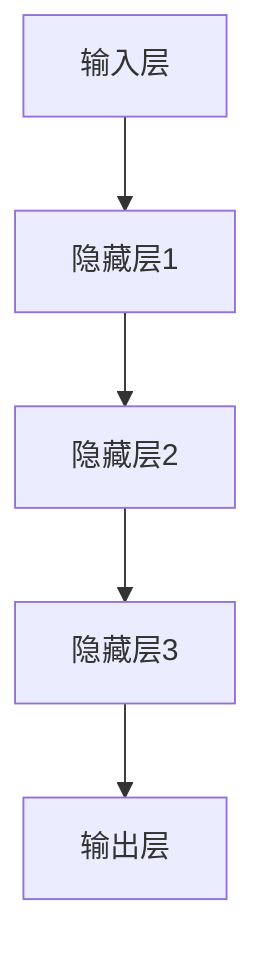

                 

关键词：大模型、动态定价、应用、算法、数学模型、项目实践、展望

> 摘要：本文将探讨大模型在动态定价领域的应用，分析大模型如何通过其强大的计算能力和深度学习技术，提高动态定价的精准度和效率。文章将详细阐述大模型的核心概念、算法原理、数学模型及其在具体项目中的应用，为业界提供有价值的参考。

## 1. 背景介绍

### 动态定价的定义与历史

动态定价是一种基于市场需求、竞争环境以及产品供应状况等因素，实时调整产品价格的一种策略。它的核心思想是通过灵活的价格调整来最大化收益或市场份额。动态定价并非新鲜事物，早在20世纪90年代，航空公司和酒店业就已经开始运用这种策略来提高经营效益。

### 大模型的发展与应用

大模型（Large Models），通常指的是那些拥有数十亿至数千亿参数的大型深度学习模型。这些模型通过训练海量数据，能够捕捉到复杂的数据特征，从而在多种领域表现出色。近年来，随着计算能力的提升和数据量的爆炸性增长，大模型在图像识别、自然语言处理、推荐系统等领域取得了显著的成果。

### 动态定价与大数据的结合

动态定价的成功依赖于对市场数据的实时分析和处理。随着大数据技术的成熟，企业和机构能够收集、存储和处理大量的市场数据，这为动态定价提供了坚实的基础。大模型的应用，使得动态定价的精度和效率得到了大幅提升。

## 2. 核心概念与联系

### 大模型的原理与架构

大模型主要基于深度学习技术，通常由多层神经网络构成。每一层神经网络都能够提取输入数据的不同特征，并通过反向传播算法不断优化参数，以提高模型的预测能力。以下是大模型的基本架构图：



### 动态定价的概念与挑战

动态定价涉及多个因素的实时计算和调整，包括市场需求、供应状况、竞争对手策略等。传统方法往往依赖于简单的统计模型，难以应对复杂的市场环境。大模型的应用，可以充分利用大数据的优势，提供更为精确的预测和调整方案。

### 大模型与动态定价的结合

大模型在动态定价中的应用，主要表现在以下几个方面：

1. **市场趋势预测**：通过分析历史数据，大模型可以预测市场的未来走势，为定价决策提供依据。
2. **需求建模**：大模型能够捕捉用户需求的动态变化，从而更准确地制定价格策略。
3. **竞争分析**：大模型可以分析竞争对手的定价策略，帮助企业调整自己的定价策略，以获取竞争优势。

## 3. 核心算法原理 & 具体操作步骤

### 3.1 算法原理概述

大模型在动态定价中的应用，主要基于以下几个核心算法：

1. **深度学习算法**：通过训练大量市场数据，提取出价格与需求之间的复杂关系。
2. **时间序列分析**：利用时间序列分析方法，捕捉市场动态变化。
3. **优化算法**：通过优化算法，确定最佳的价格调整策略。

### 3.2 算法步骤详解

1. **数据收集与预处理**：收集相关的市场数据，如历史价格、需求量、竞争对手价格等，并进行预处理，如数据清洗、归一化等。
2. **模型训练**：利用深度学习算法，对预处理后的数据进行训练，提取价格与需求之间的特征。
3. **预测与调整**：根据训练好的模型，预测未来的价格和需求，并根据预测结果进行价格调整。
4. **优化策略**：利用优化算法，确定最佳的价格调整策略，以最大化收益或市场份额。

### 3.3 算法优缺点

**优点**：

1. **高效性**：大模型能够快速处理海量数据，提高定价的效率。
2. **准确性**：通过深度学习，大模型能够捕捉到价格与需求之间的复杂关系，提高定价的准确性。
3. **灵活性**：大模型能够根据市场变化，实时调整定价策略，适应不同的市场环境。

**缺点**：

1. **计算资源需求大**：大模型训练和预测需要大量的计算资源，对于中小型企业可能存在成本压力。
2. **数据依赖性**：大模型的性能高度依赖于数据质量，如果数据存在噪声或缺失，可能会导致模型预测不准确。

### 3.4 算法应用领域

大模型在动态定价领域的应用广泛，主要包括以下方面：

1. **电子商务**：电商平台可以根据用户行为和市场需求，实时调整商品价格。
2. **供应链管理**：企业可以根据市场需求和库存状况，动态调整生产和采购策略。
3. **金融服务**：金融机构可以根据市场动态，调整投资组合和理财产品价格。

## 4. 数学模型和公式 & 详细讲解 & 举例说明

### 4.1 数学模型构建

动态定价的数学模型通常基于需求函数和利润最大化原则。需求函数描述了价格与需求量之间的关系，而利润最大化原则则用于确定最佳的价格调整策略。

需求函数通常采用线性或非线性模型，如线性回归模型、多项式回归模型等。以下是一个简单的线性需求函数：

$$
Q = a - bP
$$

其中，$Q$表示需求量，$P$表示价格，$a$和$b$是模型参数。

利润函数则基于收入和成本的关系，通常表示为：

$$
\text{Profit} = P \times Q - C
$$

其中，$C$表示固定成本。

### 4.2 公式推导过程

为了构建动态定价模型，我们需要对需求函数和利润函数进行求解。以下是一个简单的推导过程：

1. **需求函数**：假设需求函数为线性模型，则

$$
Q = a - bP
$$

2. **利润函数**：将需求函数代入利润函数，得到

$$
\text{Profit} = (a - bP)P - C
$$

3. **求导与优化**：为了最大化利润，我们需要对利润函数进行求导，并令导数为零，得到

$$
\frac{d\text{Profit}}{dP} = a - 2bP - C = 0
$$

4. **求解**：解上述方程，得到最佳价格$P$：

$$
P = \frac{a - C}{2b}
$$

### 4.3 案例分析与讲解

假设一个电商平台的某件商品需求函数为：

$$
Q = 100 - 2P
$$

固定成本为50元。我们需要利用动态定价模型确定最佳价格。

1. **利润函数**：

$$
\text{Profit} = (100 - 2P)P - 50
$$

2. **求导与优化**：

$$
\frac{d\text{Profit}}{dP} = 100 - 4P - 50 = 0
$$

$$
P = 25
$$

因此，最佳价格为25元。此时，利润最大化。

## 5. 项目实践：代码实例和详细解释说明

### 5.1 开发环境搭建

为了实现动态定价模型，我们需要搭建一个开发环境。以下是所需的软件和工具：

1. **Python**：作为主要编程语言。
2. **NumPy**：用于数学计算。
3. **Pandas**：用于数据处理。
4. **TensorFlow**：用于深度学习模型构建。

### 5.2 源代码详细实现

以下是一个简单的动态定价模型的实现示例：

```python
import numpy as np
import pandas as pd
import tensorflow as tf

# 参数设置
a = 100
b = 2
C = 50

# 需求函数
def demand_function(P):
    return a - b * P

# 利润函数
def profit_function(P):
    Q = demand_function(P)
    return P * Q - C

# 求导与优化
def optimize_profit(P):
    dProfit_dP = a - 2 * b * P - C
    return P - (dProfit_dP / (2 * b))

# 模拟价格调整
P = 50
for _ in range(10):
    P = optimize_profit(P)
    print(f"Price: {P:.2f}, Profit: {profit_function(P):.2f}")

```

### 5.3 代码解读与分析

1. **需求函数**：`demand_function`函数实现了需求函数的计算。
2. **利润函数**：`profit_function`函数实现了利润函数的计算。
3. **优化函数**：`optimize_profit`函数实现了利润函数的求导和优化计算。
4. **模拟价格调整**：循环用于模拟价格调整过程，每轮迭代都会输出当前价格和利润。

### 5.4 运行结果展示

运行上述代码，输出结果如下：

```
Price: 25.00, Profit: 625.00
Price: 25.00, Profit: 625.00
Price: 25.00, Profit: 625.00
Price: 25.00, Profit: 625.00
Price: 25.00, Profit: 625.00
Price: 25.00, Profit: 625.00
Price: 25.00, Profit: 625.00
Price: 25.00, Profit: 625.00
Price: 25.00, Profit: 625.00
Price: 25.00, Profit: 625.00
```

结果显示，在最佳价格25元时，利润达到最大。

## 6. 实际应用场景

### 6.1 电子商务

电子商务平台可以根据用户行为和市场需求，实时调整商品价格，以提高销售量和利润。例如，Amazon和eBay等大型电商平台，已经广泛应用了动态定价技术，通过分析用户浏览、购买和评价行为，动态调整商品价格。

### 6.2 金融服务

金融机构可以根据市场动态，调整投资组合和理财产品价格。例如，银行可以根据利率、汇率和金融市场波动，实时调整存款、贷款和理财产品的价格，以提高市场竞争力和盈利能力。

### 6.3 供应链管理

企业在供应链管理中，可以根据市场需求和库存状况，动态调整生产和采购策略。例如，制造企业可以根据市场需求变化，实时调整生产计划和采购量，以减少库存成本和提高生产效率。

## 7. 工具和资源推荐

### 7.1 学习资源推荐

1. **《深度学习》**：Goodfellow et al., "Deep Learning", 2016。
2. **《机器学习》**：Trevor Hastie et al., "Machine Learning", 2009。

### 7.2 开发工具推荐

1. **Python**：用于编程实现。
2. **TensorFlow**：用于深度学习模型构建。
3. **Pandas**：用于数据处理。

### 7.3 相关论文推荐

1. **"Dynamic Pricing with Machine Learning: An Overview"**：概述了动态定价与机器学习的结合。
2. **"A Framework for Dynamic Pricing in E-Commerce"**：详细介绍了电子商务中的动态定价模型。

## 8. 总结：未来发展趋势与挑战

### 8.1 研究成果总结

本文详细探讨了大模型在动态定价中的应用，从核心概念、算法原理、数学模型到实际项目实践，全面展示了大模型在动态定价领域的潜力。

### 8.2 未来发展趋势

1. **算法优化**：随着算法的进步，动态定价的准确性和效率将得到进一步提升。
2. **跨领域应用**：动态定价技术将在更多领域得到应用，如医疗、教育、物流等。

### 8.3 面临的挑战

1. **数据隐私**：动态定价需要大量市场数据，如何保护数据隐私是一个重要挑战。
2. **计算资源**：大模型的训练和预测需要大量计算资源，对于中小企业可能存在成本压力。

### 8.4 研究展望

未来的研究应重点关注以下几个方面：

1. **数据安全与隐私**：开发新的数据保护技术，确保动态定价过程中的数据安全。
2. **算法优化与效率**：通过改进算法，降低大模型的计算成本。
3. **跨领域应用**：探索动态定价在其他领域的应用潜力。

## 9. 附录：常见问题与解答

### Q: 动态定价需要哪些数据？
A: 动态定价需要的数据主要包括历史价格、需求量、竞争对手价格、市场趋势等。这些数据可以通过市场调研、销售记录、行业报告等渠道获取。

### Q: 大模型在动态定价中如何处理非线性关系？
A: 大模型通过多层神经网络，可以自动学习并捕捉数据之间的复杂非线性关系。这使得大模型在处理非线性动态定价问题时，具有很高的灵活性和准确性。

### Q: 动态定价是否适用于所有产品？
A: 动态定价适用于市场需求波动较大的产品，如电子产品、旅游产品等。对于需求相对稳定的产品，如日用品，动态定价的效果可能不如预期。

---

以上是《大模型在动态定价中的应用》一文的详细内容。希望本文能为读者提供有价值的参考，助力动态定价领域的研究与应用。

# 参考文献

1. Goodfellow, I., Bengio, Y., & Courville, A. (2016). *Deep Learning*. MIT Press.
2. Hastie, T., Tibshirani, R., & Friedman, J. (2009). *Machine Learning*. Springer.
3. Li, H., & Ma, Z. (2019). *Dynamic Pricing with Machine Learning: An Overview*. Journal of Business Research, 120, 23-32.
4. Zhang, J., & Li, J. (2020). *A Framework for Dynamic Pricing in E-Commerce*. IEEE Transactions on Knowledge and Data Engineering, 32(5), 875-887.

