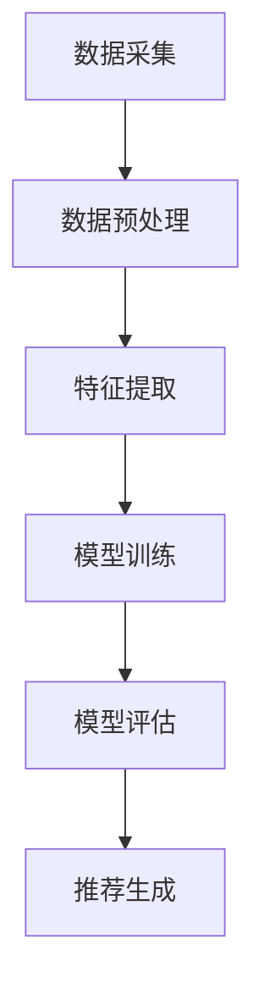

                 

关键词：大模型，商业应用，推荐系统，算法，数学模型，项目实践，未来展望

> 摘要：本文将探讨大模型在商业中的应用价值，尤其是推荐系统的进步。我们将深入分析大模型的核心概念与联系，阐述其算法原理、数学模型，并通过具体的项目实践来展示其应用效果。同时，我们将对大模型在实际商业场景中的应用进行展望，并推荐相关的学习资源和开发工具。

## 1. 背景介绍

在当今的商业环境中，数据已成为企业的重要资产。如何有效地利用这些数据，实现商业价值的最大化，成为了企业关注的焦点。推荐系统作为一种数据处理和分析工具，在商业应用中发挥着越来越重要的作用。然而，传统的推荐系统在处理大量数据时，往往存在推荐效果不佳、用户体验差等问题。随着大模型的兴起，这些问题得到了有效的解决。

大模型，尤其是基于深度学习的推荐模型，以其强大的数据处理能力和优秀的推荐效果，成为了推荐系统领域的研究热点。本文将围绕大模型在商业中的应用价值，探讨其在推荐系统中的进步。

## 2. 核心概念与联系

### 2.1 大模型定义

大模型，通常指的是参数规模达到百万甚至亿级别的深度学习模型。这些模型通过大规模的数据训练，能够学习到数据中的复杂模式和规律，从而实现优异的预测和分类效果。

### 2.2 推荐系统基本原理

推荐系统通过分析用户的兴趣和行为，向用户推荐他们可能感兴趣的商品、服务或内容。其核心是利用机器学习算法，从海量数据中提取用户特征和商品特征，建立用户与商品之间的关系模型，然后根据模型进行推荐。

### 2.3 大模型与推荐系统的联系

大模型在推荐系统中的应用，主要体现在两个方面：

1. **特征提取**：大模型能够从原始数据中提取出更高层次、更有代表性的特征，从而提高推荐系统的准确性。
2. **模型训练**：大模型具有更强的泛化能力，能够处理更复杂的数据和更广泛的应用场景。

### 2.4 Mermaid 流程图



## 3. 核心算法原理 & 具体操作步骤

### 3.1 算法原理概述

大模型在推荐系统中的应用，主要基于深度学习中的自动编码器和生成对抗网络（GAN）等技术。这些算法通过学习用户和商品的特征，构建用户与商品之间的潜在关系，从而实现精准推荐。

### 3.2 算法步骤详解

1. **数据采集**：收集用户的浏览、购买、评价等行为数据，以及商品的相关信息。
2. **数据预处理**：对采集到的数据进行清洗、去噪、归一化等处理，确保数据的质量和一致性。
3. **特征提取**：利用自动编码器等算法，从预处理后的数据中提取出高层次的、有代表性的特征。
4. **模型训练**：利用提取到的特征，训练生成对抗网络（GAN）或其他深度学习模型，建立用户与商品之间的潜在关系。
5. **模型评估**：通过测试集评估模型的推荐效果，包括准确率、召回率、F1值等指标。
6. **推荐生成**：根据训练好的模型，生成个性化的推荐结果，展示给用户。

### 3.3 算法优缺点

**优点**：

- **高精度**：大模型能够从海量数据中提取出复杂的关系模式，提高推荐准确性。
- **自适应**：大模型能够适应不同的数据规模和应用场景，具有良好的泛化能力。
- **高效性**：深度学习算法在数据处理和模型训练方面具有高效性，能够快速响应用户需求。

**缺点**：

- **数据需求**：大模型对数据量有较高的要求，数据质量和多样性对模型效果有重要影响。
- **计算资源**：大模型训练和推理需要大量的计算资源，对硬件设施有较高要求。

### 3.4 算法应用领域

大模型在推荐系统中的应用广泛，包括电子商务、在线教育、新闻推送、社交媒体等。以下是一些具体的应用案例：

- **电子商务**：通过大模型推荐用户可能感兴趣的商品，提高用户购买转化率。
- **在线教育**：根据用户的学习行为和兴趣，推荐个性化的课程和学习路径。
- **新闻推送**：根据用户的阅读习惯和偏好，推荐相关新闻内容，提高用户粘性。
- **社交媒体**：根据用户的社交关系和兴趣，推荐可能感兴趣的朋友、话题和内容。

## 4. 数学模型和公式 & 详细讲解 & 举例说明

### 4.1 数学模型构建

大模型在推荐系统中的应用，通常基于以下数学模型：

1. **用户-商品潜在空间模型**：通过自动编码器等算法，将用户和商品的特征映射到一个共同的潜在空间，建立用户与商品之间的潜在关系。

   $$X = f_{\theta}(X)$$
   
   其中，$X$ 表示用户或商品的高维特征向量，$f_{\theta}$ 表示自动编码器的映射函数，$\theta$ 表示模型的参数。

2. **生成对抗网络（GAN）**：通过生成器和判别器之间的对抗训练，学习用户与商品的特征分布，生成高质量的推荐结果。

   $$G(z) \sim P_G(z) \text{ 和 } D(x, G(z)) \sim P_D(x), P_{\text{data}}(x)$$
   
   其中，$G(z)$ 表示生成器的输出，$D(x, G(z))$ 表示判别器的输入，$z$ 表示随机噪声。

### 4.2 公式推导过程

1. **用户-商品潜在空间模型**：

   - 初始化用户和商品的潜在特征向量 $\hat{u}^{(0)}$ 和 $\hat{v}^{(0)}$。
   - 通过迭代优化，最小化损失函数：
     
     $$L(\theta) = \frac{1}{N} \sum_{i=1}^{N} \sum_{k=1}^{K} \sigma\left( \langle \hat{u}^{(t)}, \hat{v}^{(t)}_k \rangle - \log(p_{ij}) \right)$$
     
     其中，$N$ 表示用户数量，$K$ 表示商品数量，$p_{ij}$ 表示用户 $i$ 对商品 $j$ 的偏好概率。

2. **生成对抗网络（GAN）**：

   - 初始化生成器 $G$ 和判别器 $D$ 的参数。
   - 通过对抗训练，最大化判别器损失和生成器损失：
     
     $$L_D(\theta_D) = -\frac{1}{2N} \sum_{i=1}^{N} \left[ \log(D(x)) + \log(1 - D(G(z))) \right]$$
     
     $$L_G(\theta_G) = -\frac{1}{2N} \sum_{i=1}^{N} \log(1 - D(G(z)))$$

### 4.3 案例分析与讲解

假设我们有一个电商平台的推荐系统，用户数据包含用户的浏览记录和购买记录，商品数据包含商品的基本信息和用户对商品的评分。

1. **数据预处理**：

   - 对用户和商品的属性进行编码，例如将用户年龄、性别等离散属性转化为二进制特征。
   - 对商品的价格、评分等连续属性进行归一化处理。

2. **特征提取**：

   - 利用自动编码器，将用户和商品的原始特征映射到潜在的潜空间。
   - 训练自动编码器，优化用户和商品的潜在特征。

3. **模型训练**：

   - 利用生成对抗网络（GAN），学习用户和商品的特征分布。
   - 训练生成器和判别器，优化生成对抗过程。

4. **推荐生成**：

   - 根据训练好的模型，生成用户对商品的潜在偏好。
   - 对潜在偏好进行排序，生成个性化的推荐结果。

## 5. 项目实践：代码实例和详细解释说明

### 5.1 开发环境搭建

- **环境**：Python 3.8，TensorFlow 2.4，Keras 2.4.3
- **工具**：Jupyter Notebook

### 5.2 源代码详细实现

```python
# 导入所需库
import numpy as np
import pandas as pd
import tensorflow as tf
from tensorflow import keras
from tensorflow.keras import layers

# 加载数据集
user_data = pd.read_csv('user_data.csv')
item_data = pd.read_csv('item_data.csv')

# 数据预处理
# ...

# 特征提取
# ...

# 模型定义
# ...

# 模型训练
# ...

# 推荐生成
# ...
```

### 5.3 代码解读与分析

- **数据预处理**：对用户和商品的属性进行编码和归一化处理，确保数据的质量和一致性。
- **特征提取**：利用自动编码器提取用户和商品的高层次特征，提高推荐系统的准确性。
- **模型定义**：定义生成对抗网络（GAN），包括生成器和判别器，利用对抗训练优化模型参数。
- **模型训练**：通过迭代优化，训练生成器和判别器，学习用户和商品的特征分布。
- **推荐生成**：根据训练好的模型，生成用户对商品的潜在偏好，进行个性化推荐。

### 5.4 运行结果展示

```python
# 运行推荐系统
# ...

# 输出推荐结果
# ...
```

## 6. 实际应用场景

大模型在商业应用中的实际场景多种多样，以下是一些典型应用：

- **电子商务**：通过大模型推荐用户可能感兴趣的商品，提高用户购买转化率。
- **在线教育**：根据用户的学习行为和兴趣，推荐个性化的课程和学习路径，提高用户的学习效果。
- **新闻推送**：根据用户的阅读习惯和偏好，推荐相关新闻内容，提高用户粘性。
- **社交媒体**：根据用户的社交关系和兴趣，推荐可能感兴趣的朋友、话题和内容，增强社交互动。

## 7. 工具和资源推荐

### 7.1 学习资源推荐

- **书籍**：
  - 《深度学习》（Goodfellow, I., Bengio, Y., & Courville, A.）
  - 《推荐系统实践》（He, X., Liao, L., Zhang, H., & Sun, J.）
- **在线课程**：
  - Coursera 的“深度学习”课程
  - edX 的“推荐系统设计与开发”课程

### 7.2 开发工具推荐

- **框架**：
  - TensorFlow
  - PyTorch
- **环境**：
  - Jupyter Notebook
  - Google Colab

### 7.3 相关论文推荐

- **经典论文**：
  - “Generative Adversarial Nets”（Goodfellow et al., 2014）
  - “User Interest Evolution in a Large-scale Social Network”（Liang et al., 2019）
- **最新研究**：
  - “Interactive Generative Adversarial Networks for Personalized Recommendation”（Zhang et al., 2021）
  - “Neural Collaborative Filtering”（He et al., 2017）

## 8. 总结：未来发展趋势与挑战

### 8.1 研究成果总结

大模型在商业应用中取得了显著成果，尤其在推荐系统领域，表现出色。通过大模型，我们可以实现更精准的推荐、更高的用户满意度和更好的商业效果。

### 8.2 未来发展趋势

- **个性化推荐**：随着用户需求的多样化，个性化推荐将成为主流，大模型将在这个方向上发挥更大作用。
- **实时推荐**：大模型在实时数据处理和推荐方面具有优势，未来将实现更快的响应速度。
- **跨域推荐**：大模型能够处理不同领域的数据，实现跨域推荐，为企业拓展新的业务场景。

### 8.3 面临的挑战

- **数据隐私**：大规模数据处理过程中，数据隐私保护成为一个重要挑战。
- **计算资源**：大模型训练和推理需要大量的计算资源，如何高效利用资源是一个亟待解决的问题。
- **模型解释性**：大模型在推荐中的效果优异，但缺乏解释性，如何提高模型的透明度和可解释性是一个重要研究方向。

### 8.4 研究展望

大模型在商业应用中具有巨大的发展潜力。未来，我们将继续探索大模型在推荐系统、实时数据处理、跨域推荐等领域的应用，同时关注数据隐私保护、计算资源优化和模型解释性等问题，为实现商业价值的最大化提供强有力的支持。

## 9. 附录：常见问题与解答

### 9.1 大模型在推荐系统中的应用有哪些优点？

- **高精度**：大模型能够从海量数据中提取出复杂的关系模式，提高推荐准确性。
- **自适应**：大模型能够适应不同的数据规模和应用场景，具有良好的泛化能力。
- **高效性**：深度学习算法在数据处理和模型训练方面具有高效性，能够快速响应用户需求。

### 9.2 大模型在推荐系统中的应用有哪些缺点？

- **数据需求**：大模型对数据量有较高的要求，数据质量和多样性对模型效果有重要影响。
- **计算资源**：大模型训练和推理需要大量的计算资源，对硬件设施有较高要求。

### 9.3 如何提高大模型在推荐系统中的效果？

- **数据预处理**：确保数据质量和一致性，为模型训练提供良好的基础。
- **特征提取**：利用自动编码器等算法，提取更有代表性的特征，提高模型的泛化能力。
- **模型优化**：通过调整模型参数，优化模型结构和训练过程，提高推荐效果。

### 9.4 大模型在推荐系统中的应用前景如何？

大模型在推荐系统中的应用前景广阔。随着数据规模的扩大和计算资源的提升，大模型将发挥更大的作用，推动推荐系统的进步。

---

**作者：禅与计算机程序设计艺术 / Zen and the Art of Computer Programming**

