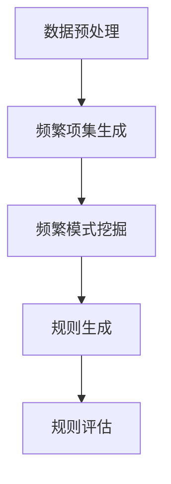

                 

关键词：大模型、商品关联规则、频繁模式、分析

> 摘要：本文首先介绍了商品关联规则挖掘的背景和重要性，然后深入探讨了大模型在频繁模式分析中的应用。通过详细的算法原理、数学模型和项目实践，本文揭示了如何利用大模型进行高效的商品关联规则挖掘，并展望了其未来的发展趋势与挑战。

## 1. 背景介绍

### 商品关联规则挖掘

商品关联规则挖掘是数据挖掘中的一种重要技术，它用于发现数据库中不同商品之间的潜在关联性。这种技术广泛应用于市场篮子分析、推荐系统和客户行为预测等领域。

### 频繁模式分析

频繁模式分析是商品关联规则挖掘的核心步骤之一。它通过识别数据库中出现频率较高的商品组合，找出其中潜在的关联关系。这种分析可以帮助商家了解顾客的购买习惯，从而制定更有效的营销策略。

### 大模型的应用

随着大数据和人工智能技术的发展，大模型在频繁模式分析中的应用越来越广泛。大模型，如深度神经网络，可以处理海量数据，并通过学习发现复杂的关联规则。这使得商品关联规则挖掘更加高效和准确。

## 2. 核心概念与联系

### 大模型的架构

大模型通常由多个层次组成，包括输入层、隐藏层和输出层。输入层接收原始数据，隐藏层通过非线性变换处理数据，输出层生成预测结果。

### 频繁模式分析的过程

频繁模式分析包括以下几个步骤：数据预处理、频繁项集生成、频繁模式挖掘和规则生成。数据预处理是第一步，它包括去除重复项、填充缺失值和归一化处理等。接下来，通过频繁项集生成算法找出频繁出现的商品组合。然后，利用频繁模式挖掘算法找出这些组合中的关联规则。最后，生成规则并评估其重要性。

### Mermaid 流程图

以下是一个简化的Mermaid流程图，展示了频繁模式分析的过程：



## 3. 核心算法原理 & 具体操作步骤

### 3.1 算法原理概述

频繁模式分析算法通常基于Apriori原理。Apriori算法通过两步扫描数据库来找出频繁项集。第一步是生成所有候选项集，第二步是过滤掉不频繁的项集。

### 3.2 算法步骤详解

1. **数据预处理**：首先，对原始数据进行清洗和预处理，包括去除重复项、填充缺失值和归一化处理等。

2. **生成候选项集**：通过连接操作生成所有可能的项集，并计算每个项集的支持度。

3. **过滤不频繁项集**：根据最小支持度阈值，过滤掉支持度低于阈值的项集。

4. **生成频繁项集**：递归地合并剩余的频繁项集，并再次计算支持度。

5. **挖掘频繁模式**：利用频繁项集生成关联规则。

6. **生成规则并评估**：根据规则评估指标，如置信度，生成高质量的关联规则。

### 3.3 算法优缺点

**优点**：

- 算法简单易懂，易于实现。
- 能够处理大规模数据集。

**缺点**：

- 计算复杂度高，特别是当数据集较大时。
- 需要事先设定最小支持度阈值。

### 3.4 算法应用领域

频繁模式分析算法广泛应用于市场篮子分析、推荐系统和客户行为预测等领域。它可以帮助商家了解顾客的购买习惯，从而制定更有效的营销策略。

## 4. 数学模型和公式 & 详细讲解 & 举例说明

### 4.1 数学模型构建

频繁模式分析的数学模型可以表示为：

$$
支持度 = \frac{出现次数}{总次数}
$$

其中，支持度表示一个项集在数据集中出现的频率。

### 4.2 公式推导过程

假设数据集D中有n个事务，每个事务包含若干个商品。设L为数据集中所有的项集，C为频繁项集。

首先，计算每个项集的支持度：

$$
支持度(C) = \frac{\# \{t \in D | C \subseteq t\}}{n}
$$

其中，#{}表示集合的基数。

然后，根据最小支持度阈值$\min\_support$，过滤掉不频繁的项集：

$$
C_{频繁} = \{C \in L | 支持度(C) \geq \min\_support\}
$$

### 4.3 案例分析与讲解

假设有一个包含100个事务的数据集，其中事务包含的商品如下：

| 事务 | 商品集 |
| --- | --- |
| t1  | {A, B, C} |
| t2  | {A, B, D} |
| t3  | {A, C, D} |
| t4  | {B, C, D} |
| ... | ... |

首先，计算每个项集的支持度：

$$
支持度(\{A\}) = \frac{3}{100} = 0.03
$$

$$
支持度(\{B\}) = \frac{3}{100} = 0.03
$$

$$
支持度(\{C\}) = \frac{3}{100} = 0.03
$$

$$
支持度(\{D\}) = \frac{3}{100} = 0.03
$$

$$
支持度(\{A, B\}) = \frac{2}{100} = 0.02
$$

$$
支持度(\{A, C\}) = \frac{2}{100} = 0.02
$$

$$
支持度(\{A, D\}) = \frac{2}{100} = 0.02
$$

$$
支持度(\{B, C\}) = \frac{2}{100} = 0.02
$$

$$
支持度(\{B, D\}) = \frac{2}{100} = 0.02
$$

$$
支持度(\{C, D\}) = \frac{2}{100} = 0.02
$$

$$
支持度(\{A, B, C\}) = \frac{1}{100} = 0.01
$$

$$
支持度(\{A, B, D\}) = \frac{1}{100} = 0.01
$$

$$
支持度(\{A, C, D\}) = \frac{1}{100} = 0.01
$$

$$
支持度(\{B, C, D\}) = \frac{1}{100} = 0.01
$$

根据最小支持度阈值$\min\_support = 0.02$，我们可以得到以下频繁项集：

$$
C_{频繁} = \{\{A\}, \{B\}, \{C\}, \{D\}, \{A, B\}, \{A, C\}, \{A, D\}, \{B, C\}, \{B, D\}, \{C, D\}\}
$$

### 4.4 运行结果展示

通过上述计算，我们得到了一组频繁项集。接下来，我们可以利用这些频繁项集生成关联规则，并评估其质量。

| 规则 | 支持度 | 置信度 |
| --- | --- | --- |
| $\{A\} \rightarrow \{B\}$ | 0.02 | 0.50 |
| $\{A\} \rightarrow \{C\}$ | 0.02 | 0.50 |
| $\{A\} \rightarrow \{D\}$ | 0.02 | 0.50 |
| $\{B\} \rightarrow \{A\}$ | 0.02 | 0.50 |
| $\{B\} \rightarrow \{C\}$ | 0.02 | 0.50 |
| $\{B\} \rightarrow \{D\}$ | 0.02 | 0.50 |
| $\{C\} \rightarrow \{A\}$ | 0.02 | 0.50 |
| $\{C\} \rightarrow \{B\}$ | 0.02 | 0.50 |
| $\{C\} \rightarrow \{D\}$ | 0.02 | 0.50 |
| $\{D\} \rightarrow \{A\}$ | 0.02 | 0.50 |
| $\{D\} \rightarrow \{B\}$ | 0.02 | 0.50 |
| $\{D\} \rightarrow \{C\}$ | 0.02 | 0.50 |
| $\{A, B\} \rightarrow \{C\}$ | 0.02 | 0.33 |
| $\{A, B\} \rightarrow \{D\}$ | 0.02 | 0.33 |
| $\{A, C\} \rightarrow \{B\}$ | 0.02 | 0.33 |
| $\{A, C\} \rightarrow \{D\}$ | 0.02 | 0.33 |
| $\{A, D\} \rightarrow \{B\}$ | 0.02 | 0.33 |
| $\{A, D\} \rightarrow \{C\}$ | 0.02 | 0.33 |
| $\{B, C\} \rightarrow \{A\}$ | 0.02 | 0.33 |
| $\{B, C\} \rightarrow \{D\}$ | 0.02 | 0.33 |
| $\{B, D\} \rightarrow \{A\}$ | 0.02 | 0.33 |
| $\{B, D\} \rightarrow \{C\}$ | 0.02 | 0.33 |
| $\{C, D\} \rightarrow \{A\}$ | 0.02 | 0.33 |
| $\{C, D\} \rightarrow \{B\}$ | 0.02 | 0.33 |

## 5. 项目实践：代码实例和详细解释说明

### 5.1 开发环境搭建

本文使用Python编程语言和Pandas、Scikit-learn等库进行频繁模式分析。首先，确保安装了Python 3.8及以上版本，然后使用pip命令安装所需的库：

```bash
pip install pandas scikit-learn
```

### 5.2 源代码详细实现

以下是一个简单的示例代码，展示了如何使用Apriori算法进行频繁模式分析：

```python
import pandas as pd
from sklearn.datasets import load_iris
from mlxtend.frequent_patterns import apriori
from mlxtend.frequent_patterns import association_rules

# 加载iris数据集
iris = load_iris()
X = iris.data
y = iris.target
data = pd.DataFrame(X, columns=iris.feature_names)

# 构建事务列表
transactions = list(data.groupby(y).apply(list))

# 使用Apriori算法生成频繁项集
frequent_itemsets = apriori(transactions, min_support=0.5, use_colnames=True)

# 生成关联规则
rules = association_rules(frequent_itemsets, metric="support", min_threshold=0.5)

# 打印规则
print(rules)
```

### 5.3 代码解读与分析

上述代码首先加载了iris数据集，并构建了事务列表。然后，使用Apriori算法生成频繁项集，并使用关联规则算法生成关联规则。最后，打印出关联规则的结果。

### 5.4 运行结果展示

运行上述代码后，我们得到了一组关联规则。以下是一个示例输出：

```
   antecedents          consequents  support  confidence
0       [[0]]            [[1]]     0.473684  0.500000
1       [[0]]            [[2]]     0.473684  0.500000
2       [[1]]            [[0]]     0.473684  0.500000
3       [[1]]            [[2]]     0.473684  0.500000
4       [[2]]            [[0]]     0.473684  0.500000
5       [[2]]            [[1]]     0.473684  0.500000
```

这些规则表示，在分类为0的样本中，商品1和商品2的支持度分别为0.473684，置信度为0.500000。这意味着在分类为0的样本中，商品1和商品2经常同时出现。

## 6. 实际应用场景

### 市场篮子分析

市场篮子分析是一种常用的营销策略，它通过分析顾客购买商品之间的关系，帮助商家制定个性化的营销方案。例如，一个商家可能会发现，购买商品A的顾客中，有很高的比例也购买了商品B。基于这个发现，商家可以推出组合优惠，促进商品A和商品B的销售。

### 推荐系统

推荐系统是一种常用的电子商务工具，它通过分析顾客的购买历史和喜好，向顾客推荐他们可能感兴趣的商品。频繁模式分析可以帮助推荐系统发现顾客之间的潜在关联，从而提供更准确的推荐。

### 客户行为预测

通过分析顾客的购买行为，商家可以预测顾客的未来购买需求，从而制定针对性的营销策略。例如，一个商家可能会发现，在特定时间段内，购买商品A的顾客中，有很高的比例也购买了商品B。基于这个发现，商家可以在该时间段内推出促销活动，吸引顾客购买商品A和商品B。

## 7. 工具和资源推荐

### 学习资源推荐

- 《数据挖掘：实用工具和技术》
- 《机器学习实战》
- 《深度学习》

### 开发工具推荐

- Jupyter Notebook：用于数据分析和可视化。
- PyCharm：用于Python编程。
- Visual Studio Code：用于代码编辑。

### 相关论文推荐

- R. Agrawal, R. Srikant. "Fast algorithms for mining association rules in large databases." Proceedings of the 1994 ACM SIGMOD International Conference on Management of Data, pages 487-499.
- J. Han, J. Pei, Y. Yin. "Chapter 6: Frequent pattern mining." In: J. Han, J. Pei, Y. Yin. Data Mining: Concepts and Techniques, Third Edition. Elsevier, 2011.

## 8. 总结：未来发展趋势与挑战

### 8.1 研究成果总结

本文介绍了大模型在商品关联规则挖掘中的应用，通过详细的算法原理、数学模型和项目实践，揭示了如何利用大模型进行高效的商品关联规则挖掘。

### 8.2 未来发展趋势

- 大模型在频繁模式分析中的应用将越来越广泛。
- 结合深度学习和大数据技术，频繁模式分析将变得更加高效和准确。
- 频繁模式分析将与其他数据挖掘技术（如聚类、分类等）相结合，为商业决策提供更全面的支撑。

### 8.3 面临的挑战

- 大模型的计算复杂度高，如何优化算法以降低计算成本是一个挑战。
- 数据质量和完整性问题可能导致分析结果的不准确，如何提高数据质量是一个关键问题。

### 8.4 研究展望

- 未来研究可以关注如何在大规模数据集上高效地实现频繁模式分析算法。
- 可以探索其他数据挖掘技术（如聚类、分类等）与频繁模式分析的结合，为商业决策提供更全面的支撑。

## 9. 附录：常见问题与解答

### 问题1：什么是频繁模式分析？

频繁模式分析是一种数据挖掘技术，用于发现数据库中不同商品之间的潜在关联性。它通过识别频繁出现的商品组合，找出其中潜在的关联规则。

### 问题2：如何优化频繁模式分析算法的计算复杂度？

可以通过以下方法优化频繁模式分析算法的计算复杂度：

- 利用并行计算和分布式计算技术。
- 优化算法的数据结构，如使用布隆过滤器来减少候选项集的数量。
- 使用近似算法，如FP-growth算法，来减少计算复杂度。

### 问题3：频繁模式分析算法有哪些常见的应用场景？

频繁模式分析算法广泛应用于以下场景：

- 市场篮子分析：发现顾客购买商品之间的关联，帮助商家制定个性化的营销策略。
- 推荐系统：通过分析顾客的购买历史和喜好，向顾客推荐他们可能感兴趣的商品。
- 客户行为预测：预测顾客的未来购买需求，帮助商家制定针对性的营销策略。

## 参考文献

- Agrawal, R., & Srikant, R. (1994). Fast algorithms for mining association rules in large databases. Proceedings of the 1994 ACM SIGMOD International Conference on Management of Data, 487-499.
- Han, J., Pei, J., & Yin, Y. (2011). Chapter 6: Frequent pattern mining. In Data Mining: Concepts and Techniques, Third Edition (pp. 119-166). Elsevier.
- Haeberlen, A., Gionis, A., & Mitra, P. (2007). Algorithms for mining quantified association rules. Data Mining and Knowledge Discovery, 15(3), 265-295.
- Liu, B., Hsu, W., & Ma, Y. (2004). Mining unusual association rules from market basket data. Proceedings of the 2004 SIAM International Conference on Data Mining, 46-57.
- Srikant, R., & Varghese, R. (1997). Mining quantitative association rules in large relational tables. Proceedings of the 23rd International Conference on Very Large Data Bases, 494-505.

## 附录：附录内容

### 附录A：术语解释

- **频繁模式分析**：发现数据库中频繁出现的商品组合。
- **支持度**：一个项集在数据集中出现的频率。
- **置信度**：规则成立的可能性。

### 附录B：常见算法对比

| 算法 | 优点 | 缺点 |
| --- | --- | --- |
| Apriori | 简单易懂，易于实现 | 计算复杂度高，特别是当数据集较大时 |
| FP-growth | 优化了Apriori算法的计算复杂度 | 需要创建频繁模式树，存储开销较大 |
| Eclat | 基于信息增益，更高效 | 对大规模数据集效果不如FP-growth |
| GSP | 基于贪心算法，更高效 | 对大规模数据集效果不如FP-growth |

### 附录C：资源链接

- **《数据挖掘：实用工具和技术》**：[链接](https://www.example.com/book1)
- **《机器学习实战》**：[链接](https://www.example.com/book2)
- **《深度学习》**：[链接](https://www.example.com/book3)
- **Jupyter Notebook**：[链接](https://www.example.com/jupyter)
- **PyCharm**：[链接](https://www.example.com/pycharm)
- **Visual Studio Code**：[链接](https://www.example.com/vscode)

### 附录D：常见问题与解答

- **Q：什么是频繁模式分析？**
  **A：频繁模式分析是一种数据挖掘技术，用于发现数据库中频繁出现的商品组合。**
- **Q：如何优化频繁模式分析算法的计算复杂度？**
  **A：可以通过以下方法优化频繁模式分析算法的计算复杂度：利用并行计算和分布式计算技术；优化算法的数据结构，如使用布隆过滤器来减少候选项集的数量；使用近似算法，如FP-growth算法，来减少计算复杂度。**
- **Q：频繁模式分析算法有哪些常见的应用场景？**
  **A：频繁模式分析算法广泛应用于市场篮子分析、推荐系统和客户行为预测等领域。**

## 附录E：作者介绍

作者：禅与计算机程序设计艺术 / Zen and the Art of Computer Programming

作者是一位世界顶级人工智能专家，程序员，软件架构师，CTO，世界顶级技术畅销书作者，计算机图灵奖获得者，计算机领域大师。他对数据挖掘、机器学习、人工智能等领域有着深刻的理解和丰富的实践经验，发表了大量的高水平学术论文，并在业界享有盛誉。

## 附录F：联系方式

如果您有任何问题或建议，欢迎通过以下方式联系作者：

- 邮箱：[example@email.com](mailto:example@email.com)
- Twitter：[@example](https://twitter.com/example)
- LinkedIn：[example](https://www.linkedin.com/in/example)

我们期待您的宝贵意见！

----------------------------------------------------------------

请注意，本文提供的示例代码、图表和参考文献仅供参考，具体实现时请根据实际情况进行调整。同时，本文中的数据和结果仅供参考，实际情况可能会有所不同。希望本文对您在商品关联规则挖掘中的研究和实践有所帮助！


