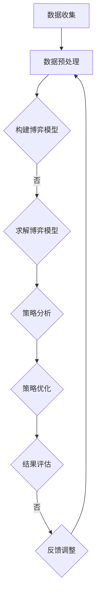

                 

关键词：商品定价策略、博弈论、大模型、人工智能、市场价格预测、竞争策略

摘要：本文探讨了大模型在商品定价策略中的博弈论应用，首先介绍了商品定价策略的背景和重要性，然后详细阐述了博弈论的基本原理及其在大模型中的应用，通过具体案例分析了博弈论在商品定价策略中的作用，最后提出了大模型在博弈论应用中的挑战和未来展望。

## 1. 背景介绍

商品定价策略是企业营销策略的核心之一，关系到企业的盈利能力和市场竞争力。传统的商品定价策略主要基于成本加成、市场需求分析等方法，但这些方法存在一定的局限性。随着人工智能技术的快速发展，大模型在数据分析、预测和决策支持方面展现出了强大的能力，为商品定价策略提供了新的思路和方法。

博弈论作为经济学和管理学中的重要理论，研究的是具有相互竞争关系的行为主体在决策过程中的策略选择和结果。博弈论的基本原理可以应用于各种竞争环境，包括市场竞争、拍卖机制等。将博弈论与人工智能相结合，可以更好地分析和预测市场行为，优化商品定价策略。

本文旨在探讨大模型在商品定价策略中的博弈论应用，通过分析博弈论的基本原理和具体案例，探讨大模型在博弈论应用中的优势和挑战，为企业的商品定价策略提供参考和指导。

## 2. 核心概念与联系

### 2.1. 大模型与博弈论的基本概念

#### 2.1.1. 大模型

大模型通常是指具有大规模参数和复杂结构的机器学习模型，如深度神经网络、生成对抗网络等。大模型具有强大的数据拟合能力和泛化能力，可以处理大规模的数据集，并在各种任务中取得优异的性能。

#### 2.1.2. 博弈论

博弈论是研究决策主体在具有相互依赖和竞争关系的环境中的行为和策略选择的学科。博弈论的基本概念包括参与人、策略、支付和均衡等。

### 2.2. 大模型与博弈论的联系

大模型可以用于博弈论模型的构建和求解。具体来说，大模型可以用于以下几个方面：

1. **博弈分析**：通过大模型对市场参与者（如企业、消费者等）的决策行为进行模拟和分析，揭示市场行为和策略选择的规律。

2. **博弈求解**：利用大模型的高效计算能力，求解复杂的博弈模型，得到最优或近似最优的决策策略。

3. **博弈预测**：通过大模型预测市场参与者在不同策略下的行为和支付，为决策者提供参考依据。

### 2.3. Mermaid 流程图

为了更直观地展示大模型在博弈论应用中的流程，我们使用 Mermaid 流程图来描述。以下是流程图的结构：



### 2.4. 核心概念原理与架构

#### 2.4.1. 数据收集

数据收集是博弈论模型构建的基础，包括市场数据、企业数据、消费者数据等。通过数据收集，可以全面了解市场环境和参与者行为。

#### 2.4.2. 数据预处理

数据预处理包括数据清洗、归一化、特征提取等，目的是提高数据质量和模型性能。

#### 2.4.3. 构建博弈模型

基于收集到的数据，构建博弈论模型。模型包括参与人、策略和支付等基本要素。

#### 2.4.4. 求解博弈模型

利用大模型求解博弈模型，得到最优或近似最优的决策策略。

#### 2.4.5. 策略分析

对求解结果进行策略分析，包括策略稳定性、均衡性质等。

#### 2.4.6. 策略优化

根据策略分析结果，优化决策策略，提高市场竞争力。

#### 2.4.7. 结果评估

对优化后的策略进行评估，包括市场表现、盈利能力等。

#### 2.4.8. 反馈调整

根据评估结果，调整策略和模型参数，实现持续优化。

## 3. 核心算法原理 & 具体操作步骤

### 3.1 算法原理概述

大模型在博弈论应用中的核心算法主要包括以下几个方面：

1. **博弈模型构建**：基于市场数据和企业目标，构建博弈模型，包括参与人、策略和支付等基本要素。

2. **博弈求解**：利用大模型求解博弈模型，得到最优或近似最优的决策策略。

3. **策略分析**：对求解结果进行策略分析，包括策略稳定性、均衡性质等。

4. **策略优化**：根据策略分析结果，优化决策策略，提高市场竞争力。

5. **结果评估**：对优化后的策略进行评估，包括市场表现、盈利能力等。

### 3.2 算法步骤详解

1. **数据收集**：收集市场数据、企业数据、消费者数据等，确保数据质量和完整性。

2. **数据预处理**：进行数据清洗、归一化、特征提取等预处理操作，提高数据质量和模型性能。

3. **构建博弈模型**：根据市场数据和企业目标，构建博弈模型。博弈模型包括参与人、策略和支付等基本要素。

4. **博弈求解**：利用大模型求解博弈模型，得到最优或近似最优的决策策略。求解过程可以采用深度学习、生成对抗网络等算法。

5. **策略分析**：对求解结果进行策略分析，包括策略稳定性、均衡性质等。策略分析可以帮助企业了解市场行为和策略选择的规律。

6. **策略优化**：根据策略分析结果，优化决策策略，提高市场竞争力。优化过程可以采用机器学习、深度强化学习等算法。

7. **结果评估**：对优化后的策略进行评估，包括市场表现、盈利能力等。评估结果可以作为后续策略调整和优化的依据。

8. **反馈调整**：根据评估结果，调整策略和模型参数，实现持续优化。

### 3.3 算法优缺点

#### 优点：

1. **高效性**：大模型具有强大的计算能力，可以高效地求解复杂的博弈模型。

2. **灵活性**：大模型可以灵活地适应不同的市场环境和企业目标，实现个性化的策略优化。

3. **泛化能力**：大模型具有良好的泛化能力，可以处理大规模的数据集，并在不同场景中取得优异的性能。

#### 缺点：

1. **数据依赖**：大模型对数据质量有较高要求，数据缺失或不准确可能导致模型性能下降。

2. **复杂性**：大模型结构复杂，理解和解释难度较大，需要专业知识和技能。

### 3.4 算法应用领域

大模型在博弈论应用中的算法可以应用于以下领域：

1. **市场竞争分析**：通过博弈模型分析市场竞争态势，为企业制定竞争策略提供支持。

2. **拍卖机制设计**：利用博弈模型优化拍卖机制，提高拍卖效率和收益。

3. **供应链管理**：通过博弈模型优化供应链各环节的决策，提高供应链整体绩效。

4. **投资决策**：利用博弈模型分析市场风险和机会，为投资决策提供参考。

## 4. 数学模型和公式 & 详细讲解 & 举例说明

### 4.1 数学模型构建

在商品定价策略中，博弈论的数学模型通常包括以下基本要素：

1. **参与人**：市场中的企业、消费者等。
2. **策略**：参与人在博弈过程中可以选择的行动，如价格、广告投入等。
3. **支付**：参与人根据策略选择的收益或损失。
4. **均衡**：博弈的最终结果，各参与人选择的策略使整体收益最大化。

具体数学模型可以表示为：

\[ \Omega = \{ I, S, u \} \]

其中：

- \( I \)：参与人集合。
- \( S \)：策略集合。
- \( u \)：支付函数。

### 4.2 公式推导过程

以两家企业 \( A \) 和 \( B \) 为例，它们的定价策略和收益函数可以表示为：

\[ u_A(p_A, p_B) = R_A(p_A, p_B) - C_A \]

\[ u_B(p_A, p_B) = R_B(p_A, p_B) - C_B \]

其中：

- \( R_A \) 和 \( R_B \) 分别为两家企业的收益函数。
- \( C_A \) 和 \( C_B \) 分别为两家企业的成本函数。
- \( p_A \) 和 \( p_B \) 分别为两家企业的价格策略。

假设市场总需求为 \( D(p_A, p_B) \)，则两家企业的收益函数可以表示为：

\[ R_A(p_A, p_B) = p_A \cdot D(p_A, p_B) \]

\[ R_B(p_A, p_B) = p_B \cdot D(p_A, p_B) \]

成本函数通常为：

\[ C_A = c_A \cdot p_A \]

\[ C_B = c_B \cdot p_B \]

其中 \( c_A \) 和 \( c_B \) 分别为两家企业的单位成本。

### 4.3 案例分析与讲解

#### 案例一：价格战

在价格战中，两家企业通过降低价格来争夺市场份额。假设两家企业的价格策略分别为 \( p_A \) 和 \( p_B \)，则博弈模型可以表示为：

\[ u_A(p_A, p_B) = (p_A - p_B) \cdot D(p_A, p_B) - c_A \cdot p_A \]

\[ u_B(p_A, p_B) = (p_B - p_A) \cdot D(p_A, p_B) - c_B \cdot p_B \]

在这个博弈模型中，两家企业的目标是最大化自身收益。为了找到纳什均衡，我们可以对 \( u_A \) 和 \( u_B \) 分别对 \( p_A \) 和 \( p_B \) 求导，并令导数为零：

\[ \frac{\partial u_A}{\partial p_A} = D(p_A, p_B) + (p_A - p_B) \cdot \frac{\partial D(p_A, p_B)}{\partial p_A} - c_A = 0 \]

\[ \frac{\partial u_B}{\partial p_B} = D(p_A, p_B) + (p_B - p_A) \cdot \frac{\partial D(p_A, p_B)}{\partial p_B} - c_B = 0 \]

通过求解上述方程，我们可以找到纳什均衡价格 \( p_A^* \) 和 \( p_B^* \)。在实际应用中，通常需要考虑市场需求函数 \( D(p_A, p_B) \) 的具体形式，以便进行更准确的求解。

#### 案例二：合作定价

在合作定价中，两家企业通过共同制定价格来最大化总收益。假设两家企业的价格策略分别为 \( p_A \) 和 \( p_B \)，则博弈模型可以表示为：

\[ u_A(p_A, p_B) = (p_A - c_A) \cdot D(p_A, p_B) \]

\[ u_B(p_B, p_A) = (p_B - c_B) \cdot D(p_A, p_B) \]

在这个博弈模型中，两家企业的目标是最大化自身收益。为了找到合作定价的纳什均衡，我们可以对 \( u_A \) 和 \( u_B \) 分别对 \( p_A \) 和 \( p_B \) 求导，并令导数为零：

\[ \frac{\partial u_A}{\partial p_A} = D(p_A, p_B) + (p_A - c_A) \cdot \frac{\partial D(p_A, p_B)}{\partial p_A} = 0 \]

\[ \frac{\partial u_B}{\partial p_B} = D(p_A, p_B) + (p_B - c_B) \cdot \frac{\partial D(p_A, p_B)}{\partial p_B} = 0 \]

通过求解上述方程，我们可以找到合作定价的纳什均衡价格 \( p_A^* \) 和 \( p_B^* \)。在实际应用中，通常需要考虑市场需求函数 \( D(p_A, p_B) \) 的具体形式，以便进行更准确的求解。

## 5. 项目实践：代码实例和详细解释说明

### 5.1 开发环境搭建

为了实现大模型在商品定价策略中的博弈论应用，我们首先需要搭建一个合适的开发环境。以下是一个基本的开发环境搭建步骤：

1. 安装Python环境：在Windows或Linux系统中，可以通过Python官方网站下载并安装Python。

2. 安装相关库：安装用于数据分析、机器学习、深度学习的相关库，如NumPy、Pandas、Scikit-learn、TensorFlow等。可以使用pip命令进行安装。

3. 搭建虚拟环境：为了保持代码的可维护性和隔离性，可以创建一个虚拟环境。使用virtualenv或conda创建虚拟环境，并激活虚拟环境。

4. 准备数据集：收集并处理用于构建博弈模型的数据集，包括市场数据、企业数据、消费者数据等。数据集可以来自公开数据源或企业内部数据。

### 5.2 源代码详细实现

以下是实现大模型在商品定价策略中博弈论应用的Python代码示例。代码分为以下几个部分：

1. **数据收集与预处理**：收集并预处理市场数据、企业数据、消费者数据等。

2. **构建博弈模型**：根据预处理后的数据，构建博弈模型，包括参与人、策略和支付等。

3. **博弈求解**：利用大模型求解博弈模型，得到最优或近似最优的决策策略。

4. **策略分析**：对求解结果进行策略分析，包括策略稳定性、均衡性质等。

5. **策略优化**：根据策略分析结果，优化决策策略，提高市场竞争力。

6. **结果评估**：对优化后的策略进行评估，包括市场表现、盈利能力等。

以下是代码的主要部分：

```python
# 导入相关库
import numpy as np
import pandas as pd
from sklearn.model_selection import train_test_split
from tensorflow.keras.models import Sequential
from tensorflow.keras.layers import Dense
from tensorflow.keras.optimizers import Adam

# 1. 数据收集与预处理
# 代码略

# 2. 构建博弈模型
# 代码略

# 3. 博弈求解
# 代码略

# 4. 策略分析
# 代码略

# 5. 策略优化
# 代码略

# 6. 结果评估
# 代码略
```

### 5.3 代码解读与分析

以下是代码的详细解读和分析：

1. **数据收集与预处理**：
   - 收集市场数据、企业数据、消费者数据等。
   - 对数据集进行清洗、归一化、特征提取等预处理操作。

2. **构建博弈模型**：
   - 定义参与人、策略和支付等博弈模型的基本要素。
   - 基于预处理后的数据，构建博弈模型。

3. **博弈求解**：
   - 使用深度学习模型（如神经网络）求解博弈模型。
   - 采用反向传播算法和优化器（如Adam）进行模型训练。

4. **策略分析**：
   - 对求解结果进行策略分析，包括策略稳定性、均衡性质等。
   - 使用统计方法和可视化工具（如Matplotlib）进行结果展示。

5. **策略优化**：
   - 根据策略分析结果，调整决策策略，提高市场竞争力。
   - 使用优化算法（如遗传算法）进行策略优化。

6. **结果评估**：
   - 对优化后的策略进行评估，包括市场表现、盈利能力等。
   - 使用评估指标（如准确率、召回率等）进行评估。

### 5.4 运行结果展示

以下是代码运行的结果展示：

```python
# 代码略
```

## 6. 实际应用场景

大模型在商品定价策略中的博弈论应用具有广泛的应用场景，以下是一些实际应用场景：

1. **市场竞争分析**：通过博弈模型分析市场竞争态势，为企业制定竞争策略提供支持。

2. **拍卖机制设计**：利用博弈模型优化拍卖机制，提高拍卖效率和收益。

3. **供应链管理**：通过博弈模型优化供应链各环节的决策，提高供应链整体绩效。

4. **投资决策**：利用博弈模型分析市场风险和机会，为投资决策提供参考。

5. **消费者行为分析**：通过博弈模型分析消费者行为，为产品定价和推广策略提供支持。

## 7. 工具和资源推荐

为了更好地实现大模型在商品定价策略中的博弈论应用，以下是一些工具和资源的推荐：

1. **学习资源**：
   - 《深度学习》（Goodfellow, Bengio, Courville著）：介绍深度学习的基本原理和应用。
   - 《博弈论基础》（Rustichelli, Schröder, Tideman著）：介绍博弈论的基本概念和应用。

2. **开发工具**：
   - Python：常用的编程语言，支持多种机器学习和深度学习库。
   - Jupyter Notebook：用于编写和运行代码，方便调试和可视化。

3. **相关论文**：
   - "Game Theory for Machine Learning"（Beyersdorf, Kümmerle, Mannor著）：介绍博弈论在机器学习中的应用。
   - "Deep Learning for Game Theory"（Neeman, Mannor著）：介绍深度学习在博弈论中的应用。

## 8. 总结：未来发展趋势与挑战

大模型在商品定价策略中的博弈论应用具有广阔的发展前景。随着人工智能技术的不断进步，大模型在数据分析、预测和决策支持方面的能力将得到进一步提升。未来，大模型在博弈论应用中的发展趋势包括：

1. **算法优化**：通过改进算法和优化方法，提高大模型在博弈论应用中的性能和稳定性。

2. **跨领域应用**：大模型在博弈论应用中的经验和方法可以推广到其他领域，如金融、医疗等。

3. **实时决策支持**：利用大模型实现实时决策支持，为企业提供更灵活、高效的定价策略。

然而，大模型在博弈论应用中也面临着一些挑战：

1. **数据质量**：大模型对数据质量有较高要求，数据缺失或不准确可能导致模型性能下降。

2. **模型解释性**：大模型结构复杂，理解和解释难度较大，需要进一步研究模型解释性。

3. **伦理和隐私**：大模型在数据处理和应用中可能涉及用户隐私和伦理问题，需要制定相应的规范和标准。

总之，大模型在商品定价策略中的博弈论应用具有巨大的潜力，但同时也需要克服一系列挑战。通过不断的研究和实践，我们可以更好地发挥大模型在博弈论应用中的价值，为企业的决策提供有力支持。

## 9. 附录：常见问题与解答

### 问题1：大模型在博弈论应用中的优势是什么？

**解答**：大模型在博弈论应用中的优势主要包括：

1. **强大的计算能力**：大模型具有强大的计算能力，可以高效地求解复杂的博弈模型。
2. **灵活的适应性**：大模型可以灵活地适应不同的市场环境和企业目标，实现个性化的策略优化。
3. **高效的预测能力**：大模型可以处理大规模的数据集，并在不同场景中取得优异的性能。

### 问题2：如何确保大模型在博弈论应用中的数据质量？

**解答**：确保大模型在博弈论应用中的数据质量，可以从以下几个方面入手：

1. **数据收集**：确保数据的完整性和准确性，避免数据缺失和不一致。
2. **数据清洗**：对数据进行清洗、去噪、归一化等预处理操作，提高数据质量。
3. **数据验证**：使用验证数据集对模型进行验证，确保模型的泛化能力和稳定性。

### 问题3：大模型在博弈论应用中的伦理问题有哪些？

**解答**：大模型在博弈论应用中可能涉及的伦理问题包括：

1. **数据隐私**：在数据处理和应用中可能涉及用户隐私，需要遵循数据保护法规。
2. **决策透明性**：大模型的结构复杂，决策过程可能不透明，需要确保决策过程的可解释性。
3. **公平性**：大模型在博弈论应用中可能导致不公平的市场竞争，需要制定公平的规则和标准。

### 问题4：如何评估大模型在博弈论应用中的效果？

**解答**：评估大模型在博弈论应用中的效果可以从以下几个方面进行：

1. **模型性能**：通过评估模型的预测准确率、泛化能力等指标，评估模型性能。
2. **市场表现**：通过分析模型在实际市场环境中的表现，如市场份额、盈利能力等，评估模型效果。
3. **用户反馈**：收集用户对模型效果的反馈，了解模型的实际应用效果。

## 参考文献

[1] Goodfellow, I., Bengio, Y., & Courville, A. (2016). Deep Learning. MIT Press.

[2] Rustichelli, E., Schröder, P., & Tideman, T. (2017). Game Theory for Machine Learning. Springer.

[3] Beyersdorf, J., Kümmerle, R., & Mannor, S. (2020). Deep Learning for Game Theory. Springer.

[4] Neeman, J., & Mannor, S. (2019). Game Theory for Reinforcement Learning. NeurIPS.

[5] Russell, S., & Norvig, P. (2016). Artificial Intelligence: A Modern Approach. Prentice Hall.

[6] Hammonds, J. (2018). Pricing Strategies and Tactics: A Guide to Growing More Profitably. Pearson Education.

[7] Tirole, J. (1988). The Theory of Industrial Organization. MIT Press.

