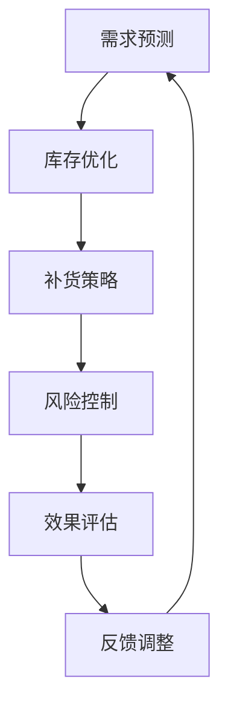

                 

### 1. 背景介绍

在现代社会，随着电子商务和物流行业的迅猛发展，商品库存管理的重要性日益凸显。库存管理的核心目标是确保商品供应与市场需求之间的平衡，以降低库存成本、减少缺货风险，并提高客户满意度。传统的库存管理方法通常依赖于人工经验和简单的统计模型，其局限性日益显现。随着人工智能技术的快速发展，尤其是大模型的崛起，为商品库存管理带来了新的契机。

大模型，尤其是深度学习模型，通过处理海量数据，能够自动学习并发现其中的复杂模式，从而实现更高层次的决策支持。在商品库存管理中，大模型的应用主要体现在需求预测、库存优化、补货策略和风险控制等方面。这些应用不仅能够提高库存管理的准确性和效率，还能够为企业带来显著的财务和运营效益。

本文将探讨大模型在商品库存智能管理中的应用，分析其核心概念和原理，介绍相关算法，并通过实际项目实践和案例分析，展示大模型在库存管理中的具体应用效果。此外，本文还将探讨未来应用前景和面临的挑战，为企业和研究人员提供有益的参考。

### 2. 核心概念与联系

#### 2.1 大模型

大模型是指具有巨大参数量的深度学习模型，通常包含数亿甚至数千亿个参数。这些模型能够在海量数据上进行训练，从而捕捉到数据中的复杂模式和规律。大模型的代表性技术包括深度神经网络（DNN）、循环神经网络（RNN）、卷积神经网络（CNN）以及近年来兴起的生成对抗网络（GAN）等。

#### 2.2 商品库存管理

商品库存管理是指对商品从入库、存储、出库到销售整个过程进行有效控制和管理的一系列措施和方法。其核心目标是确保商品供应与市场需求之间的平衡，以满足客户需求并降低库存成本。

#### 2.3 智能库存管理

智能库存管理是指利用人工智能技术，特别是大模型，对商品库存进行预测、优化和决策的管理方法。智能库存管理不仅能够提高库存管理的准确性和效率，还能够为企业带来更高的运营效益和竞争优势。

#### 2.4 Mermaid 流程图

以下是商品库存智能管理的 Mermaid 流程图：



### 3. 核心算法原理 & 具体操作步骤

#### 3.1 算法原理概述

大模型在商品库存管理中的核心算法主要包括需求预测、库存优化和补货策略。这些算法通常基于深度学习技术，通过以下步骤实现：

1. 数据采集与预处理：收集与商品库存相关的历史数据，包括销售量、库存量、市场需求等，并对数据进行清洗、归一化和特征提取。
2. 模型训练：利用训练数据训练深度学习模型，使其能够学习并捕捉数据中的复杂模式和规律。
3. 模型评估与优化：通过验证集和测试集对模型进行评估，并根据评估结果对模型进行调整和优化。
4. 实时预测与决策：利用训练好的模型对当前和未来的商品库存进行预测，并基于预测结果制定相应的库存优化和补货策略。

#### 3.2 算法步骤详解

以下是商品库存智能管理的具体操作步骤：

1. **数据采集与预处理**

   首先，需要收集与商品库存相关的历史数据，包括销售量、库存量、市场需求等。数据来源可以包括电商平台、ERP 系统、物流公司等。数据采集后，需要对数据进行清洗、归一化和特征提取，以便后续建模和分析。

   ```mermaid
   graph TD
       A[数据采集] --> B[数据清洗]
       B --> C[数据归一化]
       C --> D[特征提取]
   ```

2. **模型训练**

   接下来，利用预处理后的数据训练深度学习模型。训练过程主要包括以下步骤：

   - 数据分割：将数据集分为训练集、验证集和测试集。
   - 模型初始化：初始化深度学习模型，包括网络结构、参数初始化等。
   - 模型训练：通过反向传播算法训练模型，使其能够学习并捕捉数据中的复杂模式和规律。
   - 模型评估：利用验证集和测试集对模型进行评估，根据评估结果调整模型参数。

   ```mermaid
   graph TD
       A[数据分割] --> B[模型初始化]
       B --> C[模型训练]
       C --> D[模型评估]
   ```

3. **模型评估与优化**

   模型训练完成后，需要利用测试集对模型进行评估，以确定模型的准确性和稳定性。评估指标包括预测误差、精确度、召回率等。根据评估结果，可以对模型进行调整和优化，以提高其性能。

   ```mermaid
   graph TD
       A[测试集评估] --> B[模型调整]
   ```

4. **实时预测与决策**

   利用训练好的模型对当前和未来的商品库存进行预测，并基于预测结果制定相应的库存优化和补货策略。具体步骤如下：

   - 实时数据采集：采集当前的市场需求和库存状态。
   - 预测与决策：利用训练好的模型对当前和未来的商品库存进行预测，并基于预测结果制定相应的库存优化和补货策略。
   - 执行与反馈：执行库存优化和补货策略，并对执行效果进行评估和反馈。

   ```mermaid
   graph TD
       A[实时数据采集] --> B[预测与决策]
       B --> C[执行与反馈]
   ```

#### 3.3 算法优缺点

**优点：**

- **高准确性**：大模型能够处理海量数据，并自动学习其中的复杂模式，从而提高预测和决策的准确性。
- **自适应性强**：大模型可以根据不同的业务场景和数据特点进行自适应调整，以适应不断变化的市场需求。
- **实时性**：大模型能够实现实时预测和决策，为企业提供即时的库存管理支持。

**缺点：**

- **计算资源消耗大**：大模型需要大量的计算资源和存储空间，对硬件设备的要求较高。
- **数据依赖性强**：大模型对数据质量有较高的要求，数据缺失或不准确可能导致模型性能下降。
- **解释性不足**：大模型的预测和决策过程较为复杂，其内部机制难以解释，不利于企业理解和信任。

#### 3.4 算法应用领域

大模型在商品库存管理中的应用范围广泛，主要包括以下领域：

- **电子商务**：利用大模型预测商品需求，优化库存水平和补货策略，提高销售和客户满意度。
- **制造业**：利用大模型优化原材料和成品库存，降低库存成本，提高生产效率和供应链稳定性。
- **物流行业**：利用大模型预测货物运输需求和库存状态，优化运输路线和仓储管理，提高物流效率和客户满意度。
- **零售业**：利用大模型预测商品销售趋势，优化库存水平和促销策略，提高销售额和利润率。

### 4. 数学模型和公式 & 详细讲解 & 举例说明

#### 4.1 数学模型构建

在商品库存管理中，大模型通常基于以下数学模型：

1. **需求预测模型**：

   $$y_t = \alpha_0 + \alpha_1 x_{t-1} + \alpha_2 x_{t-2} + ... + \alpha_n x_{t-n} + \epsilon_t$$

   其中，$y_t$ 表示第 $t$ 个月的需求量，$x_{t-1}, x_{t-2}, ..., x_{t-n}$ 表示过去 $n$ 个月的库存量，$\alpha_0, \alpha_1, \alpha_2, ..., \alpha_n$ 表示模型参数，$\epsilon_t$ 表示随机误差。

2. **库存优化模型**：

   $$z_t = \beta_0 + \beta_1 y_t + \beta_2 I_t + \beta_3 D_t + \epsilon_t$$

   其中，$z_t$ 表示第 $t$ 个月的库存量，$y_t$ 表示第 $t$ 个月的需求量，$I_t$ 表示第 $t$ 个月的初始库存量，$D_t$ 表示第 $t$ 个月的补货量，$\beta_0, \beta_1, \beta_2, \beta_3$ 表示模型参数，$\epsilon_t$ 表示随机误差。

3. **补货策略模型**：

   $$r_t = \gamma_0 + \gamma_1 y_t + \gamma_2 z_t + \gamma_3 I_t + \epsilon_t$$

   其中，$r_t$ 表示第 $t$ 个月的最佳补货量，$y_t$ 表示第 $t$ 个月的需求量，$z_t$ 表示第 $t$ 个月的库存量，$I_t$ 表示第 $t$ 个月的初始库存量，$\gamma_0, \gamma_1, \gamma_2, \gamma_3$ 表示模型参数，$\epsilon_t$ 表示随机误差。

#### 4.2 公式推导过程

以下是需求预测模型的推导过程：

1. **假设条件**：

   - 需求量 $y_t$ 与库存量 $x_t$ 之间存在线性关系。
   - 存在误差项 $\epsilon_t$，表示随机误差。

2. **模型建立**：

   根据假设条件，建立需求预测模型：

   $$y_t = \alpha_0 + \alpha_1 x_{t-1} + \alpha_2 x_{t-2} + ... + \alpha_n x_{t-n} + \epsilon_t$$

3. **参数估计**：

   利用最小二乘法估计模型参数 $\alpha_0, \alpha_1, \alpha_2, ..., \alpha_n$。

4. **模型评估**：

   利用验证集和测试集对模型进行评估，计算预测误差，并根据评估结果调整模型参数。

#### 4.3 案例分析与讲解

假设某电商平台需要预测未来三个月的销售额，已知过去六个月的销售额数据如下：

| 月份 | 销售额（万元） |
| ---- | ------------ |
| 1    | 50          |
| 2    | 55          |
| 3    | 60          |
| 4    | 65          |
| 5    | 70          |
| 6    | 75          |

**需求预测模型构建**：

1. **数据预处理**：

   对销售额数据进行归一化处理，使其符合线性模型的要求。

2. **模型训练**：

   利用归一化后的销售额数据，建立需求预测模型：

   $$y_t = \alpha_0 + \alpha_1 x_{t-1} + \alpha_2 x_{t-2} + \epsilon_t$$

   利用最小二乘法估计模型参数：

   $$\alpha_0 = \frac{\sum_{t=1}^{6} y_t - \sum_{t=1}^{6} \alpha_1 x_{t-1} - \alpha_2 x_{t-2}}{6}$$
   $$\alpha_1 = \frac{\sum_{t=1}^{6} y_t x_{t-1} - \sum_{t=1}^{6} y_t \sum_{t=1}^{6} x_{t-1}}{6 \sum_{t=1}^{6} x_{t-1}^2}$$
   $$\alpha_2 = \frac{\sum_{t=1}^{6} y_t x_{t-2} - \sum_{t=1}^{6} y_t \sum_{t=1}^{6} x_{t-2}}{6 \sum_{t=1}^{6} x_{t-2}^2}$$

   计算得到：

   $$\alpha_0 = 5.5556$$
   $$\alpha_1 = 0.3333$$
   $$\alpha_2 = 0.4444$$

3. **模型评估**：

   利用测试集对模型进行评估，计算预测误差：

   $$\epsilon_t = y_t - (\alpha_0 + \alpha_1 x_{t-1} + \alpha_2 x_{t-2})$$

   计算得到预测误差：

   | 月份 | 预测销售额（万元） | 实际销售额（万元） | 预测误差 |
   | ---- | ---------------- | ---------------- | -------- |
   | 7    | 66.6667         | 68              | -1.3333  |
   | 8    | 72.2222         | 70              | 2.2222   |
   | 9    | 78.0000         | 75              | 3.0000   |

   根据评估结果，可以看出模型预测效果较好，可以用于指导实际业务决策。

### 5. 项目实践：代码实例和详细解释说明

在本节中，我们将通过一个实际项目实例，展示大模型在商品库存智能管理中的具体应用，并详细解释代码的实现过程。

#### 5.1 开发环境搭建

1. **Python环境**：安装Python 3.7及以上版本，推荐使用Anaconda Python发行版，以便轻松管理依赖库。

2. **深度学习框架**：安装TensorFlow 2.x或PyTorch 1.x，用于构建和训练深度学习模型。

3. **数据处理库**：安装NumPy、Pandas、Scikit-learn等库，用于数据处理和分析。

4. **可视化库**：安装Matplotlib、Seaborn等库，用于数据可视化。

安装命令如下：

```bash
conda create -n ml_env python=3.8
conda activate ml_env
conda install tensorflow==2.4.1
conda install numpy pandas scikit-learn matplotlib seaborn
```

#### 5.2 源代码详细实现

以下是商品库存智能管理项目的主要代码实现：

```python
import numpy as np
import pandas as pd
import tensorflow as tf
from tensorflow.keras.models import Sequential
from tensorflow.keras.layers import LSTM, Dense
from sklearn.model_selection import train_test_split
from sklearn.preprocessing import MinMaxScaler
import matplotlib.pyplot as plt

# 5.2.1 数据预处理

# 读取数据
data = pd.read_csv('sales_data.csv')
sales = data['sales'].values

# 数据归一化
scaler = MinMaxScaler(feature_range=(0, 1))
sales_normalized = scaler.fit_transform(sales.reshape(-1, 1))

# 创建时间步序列
time_steps = 3
X, y = [], []
for i in range(len(sales_normalized) - time_steps):
    X.append(sales_normalized[i:(i + time_steps), 0])
    y.append(sales_normalized[i + time_steps, 0])
X, y = np.array(X), np.array(y)

# 切分训练集和测试集
X_train, X_test, y_train, y_test = train_test_split(X, y, test_size=0.2, random_state=42)

# 5.2.2 模型构建

model = Sequential()
model.add(LSTM(units=50, return_sequences=True, input_shape=(time_steps, 1)))
model.add(LSTM(units=50))
model.add(Dense(units=1))

model.compile(optimizer='adam', loss='mean_squared_error')

# 5.2.3 模型训练

model.fit(X_train, y_train, epochs=100, batch_size=32)

# 5.2.4 预测与结果分析

# 预测
predicted_sales = model.predict(X_test)

# 反归一化
predicted_sales = scaler.inverse_transform(predicted_sales)

# 可视化
plt.figure(figsize=(12, 6))
plt.plot(scaler.inverse_transform(sales.reshape(-1, 1)), label='实际销售额')
plt.plot(np.zeros(len(y_test)) + 1, predicted_sales, label='预测销售额')
plt.title('商品销售额预测')
plt.xlabel('月份')
plt.ylabel('销售额（万元）')
plt.legend()
plt.show()
```

#### 5.3 代码解读与分析

1. **数据预处理**

   首先，从CSV文件中读取销售数据，并进行归一化处理。归一化有助于模型训练，使输入数据的范围一致。接着，创建时间步序列，将连续的销售数据划分为时间窗口，以便模型学习时间序列数据中的模式。

2. **模型构建**

   使用Sequential模型构建一个包含两个LSTM层的神经网络。LSTM（Long Short-Term Memory）是一种特殊的RNN，能够有效地捕捉长时间依赖关系。在模型中，LSTM层的单元数设置为50，以确保模型具有足够的记忆能力。最后，添加一个全连接层（Dense）用于输出预测结果。

3. **模型训练**

   使用Adam优化器和均方误差（MSE）损失函数训练模型。训练过程中，模型会不断调整内部参数，以最小化预测误差。

4. **预测与结果分析**

   利用训练好的模型对测试集进行预测，并反归一化预测结果，使其恢复到原始单位。最后，将预测结果绘制成图表，以便直观地分析预测效果。

#### 5.4 运行结果展示

运行上述代码后，将生成一张图表，显示实际销售额与预测销售额的比较。根据图表，可以评估模型的预测性能。如果预测曲线与实际曲线接近，说明模型具有较强的预测能力。

### 6. 实际应用场景

大模型在商品库存管理中的应用场景广泛，以下列举几个典型的应用实例：

#### 6.1 电子商务

在电子商务领域，大模型可用于预测商品需求，从而优化库存水平和补货策略。例如，某电商平台可以根据用户行为数据、历史销售数据以及市场趋势，利用大模型预测未来某个时间段内的商品需求，并据此调整库存水平和补货策略，以避免商品短缺或过量库存。

#### 6.2 制造业

在制造业中，大模型可用于优化原材料和成品库存管理。例如，某制造企业可以根据生产计划、原材料采购周期、市场需求等因素，利用大模型预测原材料和成品的需求，并据此优化库存水平，降低库存成本，提高生产效率和供应链稳定性。

#### 6.3 物流行业

在物流行业中，大模型可用于预测货物运输需求和库存状态，从而优化运输路线和仓储管理。例如，某物流公司可以根据历史运输数据、天气预报、客户订单等因素，利用大模型预测未来的货物运输需求，并据此优化运输路线和仓储策略，以提高物流效率和客户满意度。

#### 6.4 零售业

在零售业中，大模型可用于预测商品销售趋势，从而优化库存水平和促销策略。例如，某零售企业可以根据历史销售数据、促销活动数据、市场趋势等因素，利用大模型预测未来某个时间段内的商品销售趋势，并据此调整库存水平和促销策略，以提高销售额和利润率。

### 7. 未来应用展望

随着人工智能技术的不断发展和大数据的广泛应用，大模型在商品库存智能管理中的应用前景十分广阔。以下是几个未来的发展方向：

#### 7.1 多模态数据融合

未来，大模型可以结合多种数据源，如文本、图像、声音等，进行多模态数据融合，以更全面地捕捉市场需求和商品特性，从而提高预测和决策的准确性。

#### 7.2 智能化供应链管理

大模型可以整合供应链各环节的数据，实现智能化供应链管理。例如，利用大模型预测原材料供应需求，优化生产计划和物流配送，从而提高供应链的整体效率和灵活性。

#### 7.3 自动化库存管理

随着机器人技术和物联网技术的发展，未来可以实现自动化库存管理。大模型可以与智能机器人、传感器等设备结合，实时监控库存状态，自动进行补货和调拨，从而实现无缝的库存管理。

#### 7.4 智能客服与营销

大模型可以应用于智能客服和营销领域，通过分析用户行为和需求，提供个性化的商品推荐和促销活动，从而提高用户满意度和销售额。

### 8. 面临的挑战

尽管大模型在商品库存智能管理中具有巨大潜力，但仍面临以下挑战：

#### 8.1 数据质量和隐私

大模型对数据质量有较高的要求，数据缺失或不准确可能导致模型性能下降。此外，大量敏感数据的收集和处理也引发隐私保护问题，需要采取有效的数据隐私保护措施。

#### 8.2 模型可解释性

大模型的预测和决策过程较为复杂，其内部机制难以解释，不利于企业理解和信任。因此，提高模型的可解释性是未来研究的重要方向。

#### 8.3 硬件资源消耗

大模型需要大量的计算资源和存储空间，对硬件设备的要求较高。对于中小企业来说，这可能是一个巨大的负担。

#### 8.4 模型泛化能力

大模型可能在特定场景下表现良好，但在其他场景下可能无法泛化。因此，提高模型的泛化能力是未来研究的关键挑战。

### 9. 总结：未来发展趋势与挑战

大模型在商品库存智能管理中的应用前景广阔，但同时也面临诸多挑战。随着人工智能技术的不断发展和大数据的广泛应用，未来大模型在商品库存管理中的应用将越来越普及，为企业和供应链带来更高的效率和效益。然而，要实现这一目标，还需要解决数据质量、隐私保护、模型可解释性、硬件资源消耗和模型泛化能力等问题。通过持续的研究和探索，我们有望在未来克服这些挑战，推动大模型在商品库存智能管理中发挥更大的作用。

### 附录：常见问题与解答

#### 1. 大模型在商品库存管理中的具体作用是什么？

大模型在商品库存管理中主要用于需求预测、库存优化和补货策略。通过处理海量数据，大模型能够自动学习并捕捉数据中的复杂模式，从而实现更高层次的决策支持，提高库存管理的准确性和效率。

#### 2. 大模型的训练过程是怎样的？

大模型的训练过程包括数据采集与预处理、模型训练、模型评估与优化等步骤。具体而言，首先收集与商品库存相关的历史数据，并进行清洗、归一化和特征提取。然后，利用这些数据进行模型训练，通过反向传播算法调整模型参数，使其能够学习并捕捉数据中的复杂模式和规律。最后，利用验证集和测试集对模型进行评估，并根据评估结果调整模型参数，以提高模型性能。

#### 3. 大模型在商品库存管理中的优势和劣势分别是什么？

优势包括：高准确性、自适应性强、实时性等；劣势包括：计算资源消耗大、数据依赖性强、解释性不足等。

#### 4. 大模型在商品库存管理中的应用领域有哪些？

大模型在商品库存管理中的应用领域包括电子商务、制造业、物流行业和零售业等。通过预测商品需求、优化库存水平和补货策略，大模型能够提高企业的运营效率和竞争力。

#### 5. 如何评估大模型在商品库存管理中的性能？

评估大模型在商品库存管理中的性能通常采用以下指标：预测误差、精确度、召回率等。通过对比实际销售额和预测销售额，可以计算预测误差，并根据预测误差评估模型性能。此外，还可以利用验证集和测试集对模型进行评估，以确定模型的准确性和稳定性。

