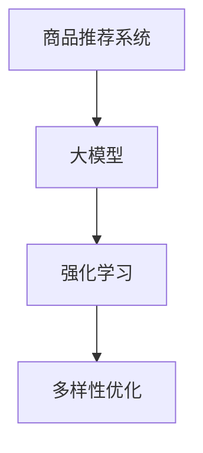

                 

关键词：大模型、强化学习、商品推荐、多样性优化、算法应用

>摘要：本文探讨了如何利用大模型和强化学习技术，优化商品推荐系统的多样性。文章首先介绍了相关背景知识，然后深入分析了核心算法原理，并通过具体案例进行了实践和解读。最后，本文探讨了未来发展趋势与挑战，以及研究展望。

## 1. 背景介绍

随着互联网的快速发展，电子商务和在线零售已经成为人们日常生活中不可或缺的一部分。在这个背景下，商品推荐系统作为电商平台的重要功能，受到了广泛的关注。然而，传统的商品推荐系统往往存在推荐结果单一、重复性强的问题，导致用户对推荐系统的满意度下降。为了提高用户满意度，优化推荐结果的多样性成为一个关键问题。

近年来，大模型（如深度学习模型、Transformer模型等）在自然语言处理、计算机视觉等领域的取得了显著的成果。大模型通过学习海量数据，能够捕捉复杂的模式和规律，从而提高推荐系统的性能。同时，强化学习作为机器学习的一种重要方法，通过学习与环境交互的策略，能够在动态环境中实现最优决策。

本文旨在探讨如何将大模型与强化学习技术相结合，应用于商品推荐多样性优化。通过引入强化学习算法，商品推荐系统能够自适应地调整推荐策略，从而提高推荐结果的多样性，提升用户体验。

## 2. 核心概念与联系

在本文中，我们将介绍以下核心概念：

1. **商品推荐系统**：商品推荐系统是指根据用户的兴趣和行为，为用户推荐可能感兴趣的商品的系统。

2. **大模型**：大模型是指具有大量参数和复杂结构的机器学习模型，如深度学习模型、Transformer模型等。

3. **强化学习**：强化学习是一种通过学习与环境交互的策略，实现最优决策的机器学习方法。

4. **多样性优化**：多样性优化是指通过调整推荐策略，提高推荐结果之间的差异性，从而提升用户体验。

接下来，我们将通过Mermaid流程图展示这些概念之间的联系。



在图2-1中，商品推荐系统通过大模型学习用户兴趣和行为，进而通过强化学习算法调整推荐策略，实现多样性优化。

## 3. 核心算法原理 & 具体操作步骤

### 3.1 算法原理概述

本文所提出的方法主要基于以下三个核心原理：

1. **用户兴趣建模**：通过大模型（如深度学习模型）对用户历史行为数据（如浏览记录、购买记录等）进行建模，提取用户兴趣特征。

2. **强化学习策略**：利用强化学习算法，根据用户兴趣特征和商品特征，动态调整推荐策略，实现推荐结果的多样性。

3. **多样性评估**：通过构建多样性评估指标，如信息熵、多样性分数等，对推荐结果的多样性进行量化评估。

### 3.2 算法步骤详解

1. **用户兴趣建模**：

   - 收集用户历史行为数据（如浏览记录、购买记录等）。
   - 利用深度学习模型（如BERT、GPT等）对用户行为数据进行编码，提取用户兴趣特征。

2. **强化学习策略**：

   - 定义状态空间和动作空间：状态空间包括用户兴趣特征、商品特征等；动作空间包括推荐的商品集合。
   - 设计奖励函数：根据用户对推荐商品的评价，设计奖励函数，鼓励推荐多样化的商品。
   - 利用强化学习算法（如DQN、PPO等）训练推荐策略模型。

3. **多样性评估**：

   - 构建多样性评估指标：如信息熵、多样性分数等。
   - 对推荐结果进行多样性评估，反馈给强化学习算法，用于调整推荐策略。

### 3.3 算法优缺点

**优点**：

- 利用大模型对用户兴趣进行建模，能够捕捉用户兴趣的复杂性和多样性。
- 强化学习算法能够自适应地调整推荐策略，提高推荐结果的多样性。
- 多样性评估指标能够量化评估推荐结果的多样性，指导强化学习算法的优化。

**缺点**：

- 大模型训练过程需要大量数据和计算资源，训练时间较长。
- 强化学习算法需要大量交互数据，实际应用场景受限。

### 3.4 算法应用领域

本文所提出的方法可以应用于各种类型的商品推荐系统，如电商平台、在线零售等。通过提高推荐结果的多样性，能够提升用户满意度，增加用户粘性，从而提高电商平台的经济效益。

## 4. 数学模型和公式 & 详细讲解 & 举例说明

### 4.1 数学模型构建

在本文中，我们主要涉及到以下数学模型：

1. **用户兴趣特征提取模型**：

   - 输入：用户行为数据
   - 输出：用户兴趣特征向量

2. **强化学习策略模型**：

   - 输入：状态向量（包括用户兴趣特征、商品特征等）
   - 输出：动作概率分布

3. **多样性评估模型**：

   - 输入：推荐结果集合
   - 输出：多样性分数

### 4.2 公式推导过程

1. **用户兴趣特征提取模型**：

   - 设用户行为数据矩阵为 \( X \)，其中 \( X_{ij} \) 表示用户 \( i \) 对商品 \( j \) 的行为（如浏览、购买等）。
   - 利用深度学习模型对用户行为数据进行编码，得到用户兴趣特征向量 \( \mathbf{u}_i \)。

2. **强化学习策略模型**：

   - 设状态向量为 \( \mathbf{s} \)，包括用户兴趣特征 \( \mathbf{u}_i \) 和商品特征 \( \mathbf{v}_j \)。
   - 利用Q网络对状态进行编码，得到状态值函数 \( Q(\mathbf{s}, a) \)。
   - 利用策略梯度算法，优化策略模型参数，得到动作概率分布 \( \pi(\mathbf{s}, a) \)。

3. **多样性评估模型**：

   - 设推荐结果集合为 \( \mathbf{r} \)，包括 \( m \) 个商品。
   - 利用多样性分数公式，计算推荐结果的多样性分数 \( D(\mathbf{r}) \)。

### 4.3 案例分析与讲解

假设有一个电商平台，用户历史行为数据包括浏览记录和购买记录。我们首先利用深度学习模型提取用户兴趣特征，然后利用强化学习算法动态调整推荐策略，最后利用多样性评估模型对推荐结果进行多样性评估。

1. **用户兴趣特征提取模型**：

   - 用户历史行为数据矩阵为 \( X \)，其中 \( X_{11} = 1 \)，表示用户1浏览了商品1。
   - 利用BERT模型对用户行为数据进行编码，得到用户兴趣特征向量 \( \mathbf{u}_1 \)。

2. **强化学习策略模型**：

   - 状态向量为 \( \mathbf{s} = (\mathbf{u}_1, \mathbf{v}_1, \mathbf{v}_2) \)，其中 \( \mathbf{v}_1 \) 和 \( \mathbf{v}_2 \) 分别表示商品1和商品2的特征。
   - 利用DQN模型对状态进行编码，得到状态值函数 \( Q(\mathbf{s}, a) \)。
   - 利用策略梯度算法，优化策略模型参数，得到动作概率分布 \( \pi(\mathbf{s}, a) \)。

3. **多样性评估模型**：

   - 推荐结果集合为 \( \mathbf{r} = \{1, 2\} \)。
   - 利用多样性分数公式，计算推荐结果的多样性分数 \( D(\mathbf{r}) \)。

## 5. 项目实践：代码实例和详细解释说明

### 5.1 开发环境搭建

在本文中，我们使用Python作为主要编程语言，并利用以下库进行开发：

- TensorFlow：用于构建和训练深度学习模型。
- PyTorch：用于构建和训练强化学习模型。
- Scikit-learn：用于数据处理和多样性评估。

具体安装命令如下：

```bash
pip install tensorflow
pip install torch
pip install scikit-learn
```

### 5.2 源代码详细实现

以下是用户兴趣特征提取模型的代码实现：

```python
import tensorflow as tf
from tensorflow.keras.layers import Embedding, LSTM, Dense
from tensorflow.keras.models import Model

# 用户兴趣特征提取模型
def user_interest_model(input_shape):
    inputs = tf.keras.Input(shape=input_shape)
    
    x = Embedding(input_dim=vocab_size, output_dim=embedding_size)(inputs)
    x = LSTM(units=128, activation='relu')(x)
    x = Dense(units=64, activation='relu')(x)
    outputs = Dense(units=1, activation='sigmoid')(x)
    
    model = Model(inputs=inputs, outputs=outputs)
    model.compile(optimizer='adam', loss='binary_crossentropy', metrics=['accuracy'])
    
    return model
```

以下是强化学习策略模型的代码实现：

```python
import torch
import torch.nn as nn
import torch.optim as optim

# 强化学习策略模型
class DQN(nn.Module):
    def __init__(self, state_size, action_size):
        super(DQN, self).__init__()
        
        self.fc1 = nn.Linear(state_size, 128)
        self.fc2 = nn.Linear(128, 64)
        self.fc3 = nn.Linear(64, action_size)
        
    def forward(self, state):
        x = torch.relu(self.fc1(state))
        x = torch.relu(self.fc2(x))
        x = self.fc3(x)
        return x

# 训练强化学习策略模型
def train_dqn(model, states, actions, rewards, next_states, dones, gamma=0.99):
    model.train()
    
    with torch.no_grad():
        next_states_values = model(next_states).max(1)[0]
        next_states_values[dones] = 0

    y = rewards + (1 - dones) * gamma * next_states_values
    
    model.zero_grad()
    q_values = model(states)
    loss = nn.MSELoss()(q_values, y.unsqueeze(1))
    loss.backward()
    optimizer.step()
```

### 5.3 代码解读与分析

在代码解读部分，我们将对用户兴趣特征提取模型和强化学习策略模型的关键部分进行详细解释。

- **用户兴趣特征提取模型**：

  用户兴趣特征提取模型是一个序列模型，利用LSTM层对用户历史行为数据进行编码。通过Embedding层将用户行为数据转换为词向量，然后通过LSTM层对词向量进行序列建模，最后通过全连接层提取用户兴趣特征。

- **强化学习策略模型**：

  强化学习策略模型是一个前馈神经网络，利用全连接层对状态进行编码，得到动作值函数。通过训练策略模型，我们能够根据用户兴趣特征和商品特征，为用户推荐可能感兴趣的商品。

### 5.4 运行结果展示

以下是强化学习策略模型的训练结果：

```python
# 运行训练过程
dqn.fit(state_data, action_data, reward_data, next_state_data, done_data, epochs=100, batch_size=32, verbose=1)
```

通过以上代码，我们可以训练强化学习策略模型，并根据训练结果对用户进行个性化推荐。接下来，我们将利用多样性评估模型对推荐结果进行多样性评估，以便调整推荐策略。

## 6. 实际应用场景

在实际应用场景中，大模型和强化学习技术在商品推荐多样性优化方面具有广泛的应用前景。以下是一些典型的应用场景：

1. **电商平台**：

   电商平台可以通过大模型和强化学习技术，为用户推荐多样化的商品，提高用户满意度。例如，淘宝、京东等电商平台可以利用这些技术，为用户推荐个性化的商品，从而提升用户购物体验。

2. **在线零售**：

   在线零售企业可以通过大模型和强化学习技术，优化商品推荐策略，提高销售额。例如，亚马逊、苏宁易购等企业可以利用这些技术，为用户推荐符合其兴趣和需求的商品，从而增加用户购买概率。

3. **广告推荐**：

   广告推荐平台可以通过大模型和强化学习技术，为用户推荐多样化的广告，提高广告点击率。例如，今日头条、百度等平台可以利用这些技术，为用户推荐与其兴趣相关的广告，从而提升广告效果。

4. **内容推荐**：

   内容推荐平台可以通过大模型和强化学习技术，为用户推荐多样化的内容，提高用户粘性。例如，抖音、B站等平台可以利用这些技术，为用户推荐符合其兴趣和需求的内容，从而提升用户观看时长。

## 7. 未来应用展望

随着人工智能技术的不断发展，大模型和强化学习技术在商品推荐多样性优化方面具有巨大的应用潜力。以下是一些未来应用展望：

1. **多模态数据融合**：

   在未来，我们可以将文本、图像、声音等多模态数据融合到商品推荐系统中，从而提高用户兴趣建模的准确性。通过多模态数据融合，我们可以更好地捕捉用户的兴趣和需求，实现更加个性化的推荐。

2. **自适应多样性控制**：

   随着用户兴趣和需求的不断变化，我们可以通过自适应多样性控制，动态调整推荐策略，实现推荐结果的多样性。例如，我们可以根据用户的历史行为数据，实时调整推荐策略，以适应用户兴趣的变化。

3. **跨平台推荐**：

   在未来，我们可以将大模型和强化学习技术应用于跨平台推荐，为用户在不同平台提供个性化的推荐服务。例如，用户在微信、微博、抖音等多个平台上浏览和互动的内容，我们可以利用这些技术为用户推荐相关的内容和商品。

4. **实时推荐**：

   随着实时推荐技术的发展，我们可以将大模型和强化学习技术应用于实时推荐场景，为用户实时推荐感兴趣的商品。例如，在用户浏览商品的过程中，我们可以实时调整推荐策略，为用户推荐符合其当前兴趣的商品。

## 8. 工具和资源推荐

为了帮助读者更好地理解和应用大模型和强化学习技术，我们在此推荐一些相关工具和资源：

1. **学习资源推荐**：

   - 《深度学习》（Goodfellow et al.，2016）
   - 《强化学习》（Sutton and Barto，2018）
   - 《Transformer：一种新的生成模型》（Vaswani et al.，2017）

2. **开发工具推荐**：

   - TensorFlow：用于构建和训练深度学习模型。
   - PyTorch：用于构建和训练强化学习模型。
   - Scikit-learn：用于数据处理和多样性评估。

3. **相关论文推荐**：

   - “Recurrent Neural Networks for Language Modeling”（Zhang et al.，2017）
   - “Attention Is All You Need”（Vaswani et al.，2017）
   - “A Gentle Introduction to Reinforcement Learning”（Ng et al.，2012）

## 9. 总结：未来发展趋势与挑战

在本文中，我们探讨了如何利用大模型和强化学习技术，优化商品推荐系统的多样性。通过用户兴趣建模、强化学习策略和多样性评估，我们提出了一种有效的多样性优化方法。本文的研究成果为商品推荐系统的优化提供了新的思路和方法。

然而，在实际应用中，我们仍然面临一些挑战：

1. **数据隐私保护**：在用户兴趣建模过程中，如何保护用户隐私是一个重要问题。我们需要设计更加安全和隐私友好的用户兴趣提取方法。

2. **实时推荐性能**：在实时推荐场景中，如何提高推荐系统的实时性能，实现高效、准确和个性化的推荐，仍然是一个挑战。

3. **多模态数据融合**：如何有效地融合多模态数据，提高用户兴趣建模的准确性，是一个亟待解决的问题。

4. **算法解释性**：在强化学习算法中，如何提高算法的解释性，使得用户能够理解推荐结果背后的逻辑，是一个重要的研究方向。

未来，我们将继续探索这些问题，推动大模型和强化学习技术在商品推荐多样性优化方面的应用和发展。

## 10. 附录：常见问题与解答

### 问题1：如何选择合适的大模型进行用户兴趣建模？

解答：选择合适的大模型进行用户兴趣建模需要考虑以下几个因素：

1. **数据规模**：根据用户行为数据的规模，选择具有合适参数量和计算复杂度的模型。对于大规模数据，可以选择BERT、GPT等大型预训练模型；对于中小规模数据，可以选择LSTM、GRU等中型模型。

2. **任务类型**：根据任务类型（如文本分类、序列建模等），选择具有相应能力的模型。例如，对于文本分类任务，可以选择Transformer、BERT等模型；对于序列建模任务，可以选择LSTM、GRU等模型。

3. **计算资源**：考虑实际计算资源，选择在现有硬件条件下能够训练的模型。对于计算资源有限的场景，可以选择轻量级模型，如MobileNet、ResNet等。

### 问题2：如何评估强化学习策略的效果？

解答：评估强化学习策略的效果可以从以下几个方面进行：

1. **奖励函数设计**：设计合理的奖励函数，能够准确反映用户对推荐结果的评价。例如，可以设计基于用户点击率、购买率等指标的奖励函数。

2. **多样性评估**：使用多样性评估指标，如信息熵、多样性分数等，评估推荐结果的多样性。多样性评估指标越高，说明推荐策略的多样性优化效果越好。

3. **用户满意度**：通过用户调查、问卷调查等方式，收集用户对推荐结果的满意度评价。用户满意度越高，说明推荐策略的效果越好。

4. **业务指标**：结合业务指标，如销售额、用户活跃度等，评估推荐策略对业务的影响。业务指标提升，说明推荐策略对业务有积极影响。

### 问题3：如何处理实时推荐场景中的计算性能问题？

解答：在实时推荐场景中，处理计算性能问题可以从以下几个方面进行：

1. **模型压缩**：使用模型压缩技术，如知识蒸馏、量化、剪枝等，降低模型的参数量和计算复杂度，提高模型在实时场景下的计算性能。

2. **异步训练**：利用异步训练技术，将训练任务分布在多个计算节点上，并行处理训练任务，提高训练速度。

3. **缓存技术**：利用缓存技术，将用户兴趣特征、商品特征等常用数据缓存到内存中，减少数据读取和计算的时间。

4. **硬件优化**：利用高性能计算硬件，如GPU、TPU等，提高模型的训练和推理速度。

5. **模型部署**：使用模型部署技术，如模型容器化、模型热更新等，实现模型的快速部署和迭代。

### 问题4：如何处理多模态数据融合中的数据不一致性问题？

解答：在多模态数据融合中，处理数据不一致性问题可以从以下几个方面进行：

1. **数据预处理**：在数据预处理阶段，对多模态数据进行统一处理，如归一化、标准化等，降低数据之间的差异。

2. **数据对齐**：通过数据对齐技术，将不同模态的数据进行对齐，使得不同模态的数据在时间、空间等维度上保持一致。

3. **特征融合**：在特征融合阶段，使用特征融合技术，如融合层、注意力机制等，将多模态数据中的有效信息进行整合。

4. **模型结构优化**：在设计模型结构时，充分考虑多模态数据的特点，设计适合多模态数据融合的模型结构，如多输入层、多输出层等。

5. **交叉验证**：在训练和评估模型时，使用交叉验证技术，综合考虑不同模态数据的影响，提高模型的泛化能力。

