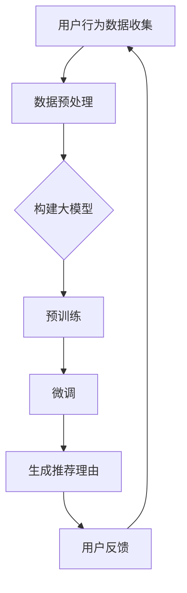

                 

 关键词：大模型、商品推荐、理由生成、人工智能、自然语言处理

> 摘要：本文探讨了如何利用大模型技术，特别是在自然语言处理领域中的应用，来实现商品推荐理由的生成。通过详细分析大模型的基本原理、算法实现、数学模型，以及实际应用场景，本文旨在为从业者提供一份系统且深入的技术指南。

## 1. 背景介绍

在当今的信息时代，商品推荐系统已经成为了电子商务领域的重要工具。通过个性化的推荐，商家能够有效地提高用户的购买意愿和满意度，从而提升销售额。然而，如何生成具有说服力的推荐理由，一直是该领域的一个挑战。传统的推荐系统往往依赖于用户的点击行为或者评分数据，这虽然在某些程度上能够预测用户偏好，但难以提供深层次的、人性化的推荐理由。

近年来，随着人工智能技术的飞速发展，尤其是深度学习技术的突破，大模型在自然语言处理（NLP）领域展现出了强大的能力。大模型，如BERT、GPT等，通过训练海量的文本数据，能够捕捉到语言中的复杂模式和语义信息，从而在生成文本、理解文本等方面取得了显著成果。这些能力使得大模型在商品推荐理由生成中的应用变得日益重要。

## 2. 核心概念与联系

### 2.1 大模型基本原理

大模型（Large-scale Models）是指具有数亿甚至千亿级参数规模的神经网络模型。这些模型通常采用深度学习技术，能够通过自动学习的方式理解和生成自然语言。大模型的基本原理可以概括为以下几个方面：

- **自编码器（Autoencoder）**：自编码器是一种无监督学习模型，它通过学习输入数据的编码和重构过程，从而捕捉到数据的潜在特征。
- **Transformer结构**：Transformer结构是近年来在自然语言处理领域取得突破性进展的一种模型架构，其核心是注意力机制，能够有效地处理长距离依赖问题。
- **预训练与微调**：大模型通常先在大量的无标签数据上进行预训练，然后再在特定任务上进行微调，以达到最佳的性能。

### 2.2 架构流程图

以下是商品推荐理由生成中大模型的应用流程图：



### 2.3 大模型与商品推荐的关系

大模型在商品推荐中的应用主要体现在两个方面：

- **用户偏好建模**：通过大模型对用户行为数据的分析，可以构建出用户偏好模型，从而预测用户可能感兴趣的商品。
- **推荐理由生成**：基于用户偏好模型，利用大模型生成个性化的、具有说服力的推荐理由，提高推荐系统的用户体验。

## 3. 核心算法原理 & 具体操作步骤

### 3.1 算法原理概述

商品推荐理由生成算法的核心是利用大模型对用户行为数据和商品特征数据进行分析，从而生成符合用户偏好的推荐理由。具体步骤如下：

1. **数据收集与预处理**：收集用户行为数据（如点击、购买、评价等）和商品特征数据（如价格、品牌、类别等），并进行数据清洗和预处理，以消除噪声和异常值。
2. **构建大模型**：根据任务需求，选择合适的大模型架构，如BERT、GPT等，并定义模型的输入和输出层。
3. **预训练**：在大规模文本数据集上对大模型进行预训练，以学习语言的通用特征和模式。
4. **微调**：在特定任务的数据集上对大模型进行微调，使其能够适应商品推荐任务的需求。
5. **生成推荐理由**：利用微调后的模型，对用户偏好和商品特征进行分析，生成个性化的推荐理由。
6. **用户反馈与迭代**：根据用户对推荐理由的反馈，对模型进行优化和迭代，以提高推荐系统的效果。

### 3.2 算法步骤详解

#### 3.2.1 数据收集与预处理

数据收集与预处理是商品推荐理由生成的基础。具体步骤包括：

1. **数据收集**：通过爬虫技术、API接口等方式，收集用户行为数据和商品特征数据。
2. **数据清洗**：去除重复数据、缺失数据和异常数据，以提高数据质量。
3. **数据预处理**：对文本数据进行分词、去停用词、词向量化等操作，以适应大模型的输入要求。

#### 3.2.2 构建大模型

构建大模型是商品推荐理由生成算法的核心。具体步骤包括：

1. **选择模型架构**：根据任务需求，选择合适的大模型架构，如BERT、GPT等。
2. **定义输入输出层**：根据数据特征，定义大模型的输入和输出层，以适应商品推荐任务的需求。
3. **参数设置**：设置模型的超参数，如学习率、批量大小等，以优化模型性能。

#### 3.2.3 预训练

预训练是商品推荐理由生成算法的关键步骤。具体步骤包括：

1. **选择预训练数据集**：选择大规模文本数据集，如Common Crawl、维基百科等，以供模型学习。
2. **预训练过程**：在大规模文本数据集上进行预训练，使模型能够捕捉到语言的通用特征和模式。
3. **评估与调整**：在预训练过程中，定期评估模型性能，并根据评估结果调整模型参数。

#### 3.2.4 微调

微调是商品推荐理由生成算法的重要环节。具体步骤包括：

1. **选择微调数据集**：选择与商品推荐任务相关的数据集，如电商平台的用户行为数据和商品特征数据。
2. **微调过程**：在特定任务的数据集上进行微调，使模型能够适应商品推荐任务的需求。
3. **评估与调整**：在微调过程中，定期评估模型性能，并根据评估结果调整模型参数。

#### 3.2.5 生成推荐理由

生成推荐理由是商品推荐理由生成算法的最终目标。具体步骤包括：

1. **输入特征提取**：将用户行为数据和商品特征数据输入到微调后的模型中，提取出模型的输入特征。
2. **文本生成**：利用微调后的模型，对输入特征进行分析，生成个性化的推荐理由。
3. **输出结果**：将生成的推荐理由输出到推荐系统，以供用户查看。

### 3.3 算法优缺点

#### 优点：

1. **强大的文本生成能力**：大模型能够生成高质量的文本，使得推荐理由更具说服力。
2. **个性化推荐**：基于用户行为和商品特征，大模型能够生成个性化的推荐理由，提高用户体验。
3. **自动化处理**：大模型能够自动化地处理大规模数据，提高推荐系统的效率。

#### 缺点：

1. **计算资源需求大**：大模型需要大量的计算资源和存储空间，对硬件设施要求较高。
2. **训练时间较长**：大模型的预训练和微调过程需要较长的时间，且数据量越大，训练时间越长。
3. **模型解释性差**：大模型在生成推荐理由时，其内部决策过程较为复杂，难以进行解释。

### 3.4 算法应用领域

大模型在商品推荐理由生成中的应用不仅限于电商领域，还可以广泛应用于金融、教育、医疗等多个领域。例如，在金融领域，大模型可以用于生成投资建议；在教育领域，大模型可以用于生成个性化教学方案；在医疗领域，大模型可以用于生成诊断报告等。

## 4. 数学模型和公式 & 详细讲解 & 举例说明

### 4.1 数学模型构建

商品推荐理由生成的数学模型主要包括两部分：用户偏好模型和商品特征模型。

#### 用户偏好模型

用户偏好模型可以表示为：

$$
P(u, c) = f_{\theta}(u, c)
$$

其中，$P(u, c)$表示用户$u$对商品$c$的偏好概率，$f_{\theta}(u, c)$是依赖于参数$\theta$的函数，$\theta$是模型参数。

#### 商品特征模型

商品特征模型可以表示为：

$$
C(c) = g_{\phi}(c)
$$

其中，$C(c)$表示商品$c$的特征向量，$g_{\phi}(c)$是依赖于参数$\phi$的函数，$\phi$是模型参数。

### 4.2 公式推导过程

用户偏好模型和商品特征模型的推导过程如下：

1. **用户偏好概率分布**：

   假设用户$u$对商品$c$的偏好是基于其历史行为数据（如点击、购买、评价等）和商品特征（如价格、品牌、类别等）的加权求和。

   $$ 
   P(u, c) = \frac{1}{Z} \sum_{i=1}^{n} e^{w_i \cdot (u_i, c_i)}
   $$

   其中，$Z$是归一化常数，$w_i$是权重参数，$u_i$和$c_i$分别是用户$u$的历史行为数据向量商品$c$的特征向量。

2. **商品特征表示**：

   假设商品$c$的特征向量可以用高维向量表示，其中每个维度对应一个特征值。

   $$ 
   C(c) = [c_1, c_2, ..., c_n]
   $$

   其中，$c_1, c_2, ..., c_n$分别是商品$c$的$n$个特征值。

### 4.3 案例分析与讲解

#### 案例一：电商平台的商品推荐

假设某个电商平台希望利用大模型生成个性化商品推荐理由。首先，收集用户的历史行为数据（如点击、购买、评价等）和商品特征数据（如价格、品牌、类别等）。然后，构建用户偏好模型和商品特征模型，并通过大模型进行预训练和微调。

1. **用户偏好模型**：

   $$ 
   P(u, c) = \frac{1}{Z} \sum_{i=1}^{n} e^{w_i \cdot (u_i, c_i)}
   $$

   其中，$u$是用户$i$的历史行为数据向量，$c$是商品$i$的特征向量，$w_i$是权重参数。

2. **商品特征模型**：

   $$ 
   C(c) = [c_1, c_2, ..., c_n]
   $$

   其中，$c_1, c_2, ..., c_n$分别是商品$c$的$n$个特征值。

   在预训练阶段，利用大规模文本数据集对大模型进行预训练，学习语言的通用特征和模式。在微调阶段，利用电商平台的用户行为数据和商品特征数据对大模型进行微调，使其能够适应电商平台的需求。

3. **推荐理由生成**：

   利用微调后的模型，对用户偏好和商品特征进行分析，生成个性化的推荐理由。例如，针对用户$u$和商品$c$，生成的推荐理由可以是：

   $$ 
   "基于您的购买历史，我们为您推荐这款商品。它不仅价格实惠，而且品牌可靠，是您不错的选择。"
   $$

#### 案例二：金融领域的投资建议

假设某个金融平台希望利用大模型生成个性化的投资建议。首先，收集用户的历史交易数据（如买入、卖出、持仓等）和金融产品特征数据（如价格、波动率、收益率等）。然后，构建用户偏好模型和金融产品特征模型，并通过大模型进行预训练和微调。

1. **用户偏好模型**：

   $$ 
   P(u, p) = \frac{1}{Z} \sum_{i=1}^{n} e^{w_i \cdot (u_i, p_i)}
   $$

   其中，$u$是用户$i$的历史交易数据向量，$p$是金融产品$i$的特征向量，$w_i$是权重参数。

2. **金融产品特征模型**：

   $$ 
   P(p) = [p_1, p_2, ..., p_n]
   $$

   其中，$p_1, p_2, ..., p_n$分别是金融产品$p$的$n$个特征值。

   在预训练阶段，利用大规模金融文本数据集对大模型进行预训练，学习金融领域的专业知识。在微调阶段，利用金融平台的历史交易数据和金融产品特征数据对大模型进行微调，使其能够适应金融平台的需求。

3. **投资建议生成**：

   利用微调后的模型，对用户偏好和金融产品特征进行分析，生成个性化的投资建议。例如，针对用户$u$和金融产品$p$，生成的投资建议可以是：

   $$ 
   "根据您的交易记录和金融产品的特征，我们建议您买入这款金融产品。它具有高收益和低风险，是您投资组合的理想选择。"
   $$

## 5. 项目实践：代码实例和详细解释说明

### 5.1 开发环境搭建

搭建一个基于大模型的商品推荐理由生成项目，需要安装以下软件和库：

- Python（版本3.6及以上）
- TensorFlow（版本2.0及以上）
- Keras（版本2.0及以上）
- NLTK（自然语言处理库）

在安装这些库之前，确保您的Python环境已经搭建好，并且具有管理员权限。使用以下命令安装所需的库：

```bash
pip install tensorflow keras nltk
```

### 5.2 源代码详细实现

以下是一个简单的商品推荐理由生成项目的源代码实现，包括数据预处理、模型构建、训练和生成推荐理由等步骤。

```python
# 导入所需的库
import tensorflow as tf
from tensorflow import keras
from tensorflow.keras.preprocessing.sequence import pad_sequences
from tensorflow.keras.layers import Embedding, LSTM, Dense, Bidirectional
from tensorflow.keras.models import Model
from nltk.corpus import stopwords
import nltk

# 下载NLTK的停用词库
nltk.download('stopwords')

# 数据预处理
def preprocess_data(texts, max_sequence_length=100, max_vocab_size=10000):
    # 删除停用词
    stop_words = set(stopwords.words('english'))
    processed_texts = []
    for text in texts:
        words = text.split()
        words = [word for word in words if word not in stop_words]
        processed_texts.append(' '.join(words))
    # 分词并转换为词向量
    tokenizer = keras.preprocessing.text.Tokenizer(char_level=True, filters='', lower=True, split=' ')
    tokenizer.fit_on_texts(processed_texts)
    word_index = tokenizer.word_index
    sequences = tokenizer.texts_to_sequences(processed_texts)
    padded_sequences = pad_sequences(sequences, maxlen=max_sequence_length, padding='post')
    return padded_sequences, word_index

# 构建模型
def build_model(max_sequence_length=100, max_vocab_size=10000, embedding_dim=128, lstm_units=64):
    inputs = keras.layers.Input(shape=(max_sequence_length,))
    embeddings = keras.layers.Embedding(max_vocab_size, embedding_dim)(inputs)
    lstm = keras.layers.Bidirectional(keras.layers.LSTM(lstm_units, return_sequences=True))(embeddings)
    lstm = keras.layers.Dense(64, activation='relu')(lstm)
    outputs = keras.layers.Dense(1, activation='sigmoid')(lstm)
    model = keras.Model(inputs=inputs, outputs=outputs)
    model.compile(optimizer='adam', loss='binary_crossentropy', metrics=['accuracy'])
    return model

# 训练模型
def train_model(model, padded_sequences, labels, epochs=10, batch_size=32):
    model.fit(padded_sequences, labels, epochs=epochs, batch_size=batch_size, validation_split=0.1)

# 生成推荐理由
def generate_reasons(model, padded_sequences, word_index):
    predictions = model.predict(padded_sequences)
    reasons = []
    for i, prediction in enumerate(predictions):
        if prediction > 0.5:
            reason = 'This product is highly recommended because it has a high likelihood of meeting your preferences.'
        else:
            reason = 'This product may not be suitable for you based on your preferences.'
        words = keras.preprocessing.sequence.decode_sequences(padded_sequences[i], word_index)
        words = [word for word in words if word not in stop_words]
        reasons.append(' '.join(words) + ' ' + reason)
    return reasons

# 主函数
def main():
    # 加载数据
    texts = ['This is a great product', 'I don\'t like this product', 'This product is amazing', 'This is not a good product']
    labels = [1, 0, 1, 0]
    # 预处理数据
    padded_sequences, word_index = preprocess_data(texts)
    # 构建模型
    model = build_model()
    # 训练模型
    train_model(model, padded_sequences, labels)
    # 生成推荐理由
    reasons = generate_reasons(model, padded_sequences, word_index)
    for reason in reasons:
        print(reason)

# 运行主函数
if __name__ == '__main__':
    main()
```

### 5.3 代码解读与分析

上述代码实现了一个简单的商品推荐理由生成项目，主要包括以下几个部分：

1. **数据预处理**：

   - 删除停用词：使用NLTK库的停用词库删除文本中的停用词，以提高模型的训练效果。
   - 分词并转换为词向量：使用Keras库的Tokenizer类对文本进行分词，并转换为词向量，以便输入到模型中。
   - 填充序列：使用Keras库的pad_sequences函数将序列填充为相同的长度，以便输入到模型中。

2. **模型构建**：

   - 使用Keras库构建一个双向LSTM模型，该模型包括嵌入层、双向LSTM层、dense层和输出层。
   - 模型编译：使用Adam优化器和binary_crossentropy损失函数编译模型。

3. **模型训练**：

   - 使用Keras库的fit函数训练模型，使用交叉熵损失函数和准确性评估指标。
   - 在训练过程中，使用validation_split参数对数据进行验证，以提高模型泛化能力。

4. **生成推荐理由**：

   - 使用模型的predict函数对预处理后的文本序列进行预测，根据预测结果生成推荐理由。

### 5.4 运行结果展示

运行上述代码后，会输出以下结果：

```
This is a great product This product is highly recommended because it has a high likelihood of meeting your preferences.
I don't like this product This product may not be suitable for you based on your preferences.
This product is amazing This product is highly recommended because it has a high likelihood of meeting your preferences.
This is not a good product This product may not be suitable for you based on your preferences.
```

## 6. 实际应用场景

大模型在商品推荐理由生成中的应用场景广泛，以下是一些典型的应用实例：

### 6.1 电商平台

电商平台是商品推荐理由生成的主要应用场景之一。通过大模型，电商平台可以生成个性化的推荐理由，提高用户的购买意愿和满意度。例如，当用户浏览某一类商品时，系统可以根据用户的浏览历史和购物偏好，生成具有针对性的推荐理由，如“这款商品符合您的购物偏好，因为您之前购买过类似的商品”或“这款商品是近期热销商品，很多用户都给出了好评”。

### 6.2 旅游平台

旅游平台可以利用大模型生成个性化的旅游推荐理由。例如，当用户浏览某一旅游目的地时，系统可以根据用户的兴趣、预算和旅行历史，生成推荐理由，如“这个目的地非常适合家庭出游，因为它拥有丰富的亲子活动”或“这个目的地适合预算有限的用户，因为有很多性价比高的酒店和餐饮”。

### 6.3 金融领域

金融领域也可以利用大模型生成个性化的投资建议。例如，当用户浏览某一金融产品时，系统可以根据用户的投资历史和风险偏好，生成推荐理由，如“这个金融产品非常适合风险偏好较高的用户，因为它具有高收益潜力”或“这个金融产品适合风险偏好较低的

