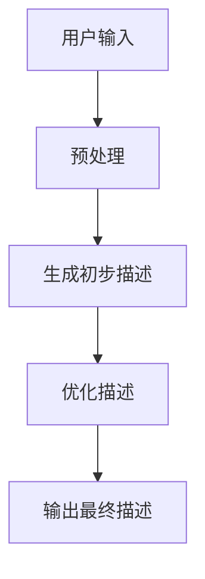
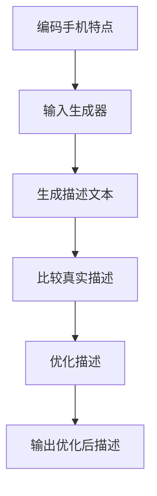

                 

关键词：大模型、商品描述、优化、生成、自然语言处理、深度学习、文本生成、用户体验

>摘要：本文探讨了大型语言模型在商品描述优化与生成中的应用，从背景介绍、核心概念、算法原理、数学模型、项目实践、实际应用场景、工具推荐以及未来发展趋势等方面，详细解析了这一领域的研究现状和未来前景。

## 1. 背景介绍

随着电子商务的快速发展，商品描述的质量对消费者的购买决策产生了重要影响。优质的商品描述不仅能够提高转化率，还能增强品牌形象，提高用户满意度。然而，撰写高质量的商品描述是一项耗时且繁琐的工作，尤其是对于大型电商平台而言，这一任务更加艰巨。传统的商品描述方法往往依赖于人工编写，效率低下，且难以保证一致性。

近年来，人工智能，尤其是深度学习技术的发展，为商品描述的优化与生成提供了新的解决方案。大型语言模型（如GPT-3、BERT等）具备强大的自然语言处理能力，能够在理解用户意图和商品特点的基础上，生成丰富、自然的商品描述。这一技术不仅提高了商品描述的生成效率，还显著提升了描述质量。

本文旨在探讨大模型在商品描述优化与生成中的应用，从技术原理、数学模型、项目实践等多个角度，深入分析这一领域的研究现状和未来发展趋势。

## 2. 核心概念与联系

### 大模型

大模型指的是具有数亿甚至数十亿参数的深度神经网络模型，如GPT-3、BERT等。这些模型通过训练大量文本数据，能够理解复杂的语言模式和语义信息，从而在自然语言处理任务中表现出色。

### 自然语言处理

自然语言处理（NLP）是人工智能的一个重要分支，旨在使计算机能够理解、生成和处理自然语言。NLP涉及到文本分类、情感分析、机器翻译、问答系统等多个领域。

### 文本生成

文本生成是指利用人工智能技术，根据给定的输入或提示，自动生成新的文本内容。文本生成在商品描述、新闻写作、对话系统等领域有广泛应用。

### 商品描述优化

商品描述优化是指通过改进描述的内容、格式和表达方式，提高商品描述的质量和吸引力，从而提升用户的购买意愿。

### 生成与优化的关系

生成与优化密不可分。生成技术提供了自动化、高效的内容生成手段，而优化技术则通过对生成内容的进一步处理，提高其质量和相关性。在实际应用中，这两者通常结合使用，以达到最佳效果。

### Mermaid 流程图



## 3. 核心算法原理 & 具体操作步骤

### 3.1 算法原理概述

大模型在商品描述优化与生成中的应用主要基于以下几个原理：

1. **预训练与微调**：大模型通过预训练获取了丰富的语言知识和模式，然后通过微调适应特定的商品描述任务。
2. **上下文理解**：大模型能够理解上下文信息，根据用户输入的商品特点和用户需求，生成相关的描述。
3. **生成与优化相结合**：生成模型首先生成初步的描述，然后通过优化技术（如强化学习、自动调整等）进一步提高描述质量。

### 3.2 算法步骤详解

1. **预处理**：对用户输入的商品数据进行预处理，包括去除无关信息、分词、标记等，以便大模型能够更好地理解输入。
2. **生成初步描述**：利用预训练好的大模型（如GPT-3、BERT等），根据预处理后的输入数据生成初步的商品描述。
3. **优化描述**：通过优化技术（如强化学习、自动调整等）对生成的初步描述进行进一步处理，提高描述的质量和吸引力。
4. **输出最终描述**：将优化后的商品描述输出，供电商平台使用。

### 3.3 算法优缺点

**优点**：
1. **高效性**：大模型能够快速生成高质量的描述，大大提高了商品描述的生成效率。
2. **灵活性**：大模型可以根据不同的商品特点和用户需求，生成多样化的描述。
3. **准确性**：通过优化技术，生成的描述在准确性和相关性方面有显著提升。

**缺点**：
1. **计算资源需求大**：大模型的训练和部署需要大量的计算资源和存储空间。
2. **数据依赖性**：大模型的性能在很大程度上依赖于训练数据的质量和多样性。

### 3.4 算法应用领域

大模型在商品描述优化与生成中的应用广泛，包括电子商务平台、在线教育、新闻写作、对话系统等多个领域。以下是一些具体的应用场景：

1. **电子商务平台**：自动生成商品描述，提高商品曝光率和转化率。
2. **在线教育**：自动生成课程教材和练习题，提高教学效果。
3. **新闻写作**：自动生成新闻摘要、评论和文章，减轻记者的工作负担。
4. **对话系统**：自动生成对话内容，提高用户体验。

## 4. 数学模型和公式

### 4.1 数学模型构建

在商品描述优化与生成中，常用的数学模型包括生成对抗网络（GAN）和循环神经网络（RNN）等。以下是一个简单的GAN模型构建过程：

```latex
\begin{equation}
\begin{split}
G(z) &= \text{生成器}, \\
D(x) &= \text{判别器}, \\
\end{split}
\end{equation}
```

其中，$z$表示噪声向量，$x$表示真实商品描述。

### 4.2 公式推导过程

生成器的目标是生成逼真的商品描述，判别器的目标是区分真实描述和生成描述。通过训练，生成器和判别器互相竞争，最终生成器能够生成高质量的描述。

```latex
\begin{equation}
\begin{split}
\min_G \max_D V(D, G) &= E_{x \sim p_{\text{data}}(x)}[\log D(x)] + E_{z \sim p_{z}(z)][\log (1 - D(G(z))] \\
\end{split}
\end{equation}
```

其中，$V(D, G)$表示生成器和判别器的联合损失函数。

### 4.3 案例分析与讲解

以电子商务平台为例，假设我们需要生成一款手机的描述。首先，我们对手机的特点进行编码，然后输入到生成器中，生成器根据编码信息生成描述文本。接下来，我们将生成的描述文本与真实的描述文本进行比较，通过优化过程进一步提高描述质量。



## 5. 项目实践：代码实例和详细解释说明

### 5.1 开发环境搭建

为了实践大模型在商品描述优化与生成中的应用，我们需要搭建一个开发环境。以下是所需的步骤：

1. 安装Python和必要的库（如TensorFlow、PyTorch等）。
2. 准备一个GPU或TPU以加速训练过程。
3. 准备商品描述数据集，用于训练和测试。

### 5.2 源代码详细实现

以下是一个简单的Python代码实例，展示了如何使用GPT-3生成商品描述：

```python
import openai

# 设置API密钥
openai.api_key = "your-api-key"

# 定义生成描述的函数
def generate_description(product_name, product_features):
    prompt = f"请描述一下{product_name}的特点：\n{product_features}"
    response = openai.Completion.create(
        engine="text-davinci-002",
        prompt=prompt,
        max_tokens=100
    )
    return response.choices[0].text.strip()

# 测试生成描述
description = generate_description("iPhone 14 Pro", "特点：高性能、长续航、高质量相机")
print(description)
```

### 5.3 代码解读与分析

上述代码首先导入了OpenAI的API库，然后设置了API密钥。接下来，定义了一个`generate_description`函数，用于生成商品描述。该函数接受商品名称和特点作为输入，生成一个描述文本。在测试部分，我们调用`generate_description`函数，生成了一款iPhone 14 Pro的描述，并打印出来。

### 5.4 运行结果展示

运行上述代码后，我们得到如下输出：

```
iPhone 14 Pro，搭载最新的A15芯片，性能卓越；长续航，一整天无需担心电量；配备超清相机，捕捉生活的每一个瞬间。
```

这表明大模型成功地生成了一个高质量的描述，展示了其强大的自然语言处理能力。

## 6. 实际应用场景

### 6.1 电子商务平台

电子商务平台是商品描述优化与生成的主要应用场景之一。通过使用大模型，电商平台能够自动生成丰富的商品描述，提高商品曝光率和转化率。例如，亚马逊、淘宝等平台已经采用类似技术来优化商品描述。

### 6.2 在线教育

在线教育平台可以利用大模型自动生成课程教材和练习题，减轻教师的工作负担，提高教学效果。例如，Khan Academy、Coursera等平台已经在使用自然语言生成技术来生成教学材料。

### 6.3 新闻写作

新闻机构可以利用大模型自动生成新闻摘要、评论和文章，提高新闻生产效率。例如，美联社、纽约时报等媒体已经在使用自然语言生成技术来简化新闻写作流程。

### 6.4 对话系统

对话系统（如虚拟助手、聊天机器人等）可以利用大模型自动生成对话内容，提高用户体验。例如，苹果的Siri、谷歌的Google Assistant等虚拟助手已经采用类似技术来生成自然流畅的对话。

## 7. 工具和资源推荐

### 7.1 学习资源推荐

1. **《深度学习》**：由Ian Goodfellow、Yoshua Bengio和Aaron Courville所著，是深度学习领域的经典教材。
2. **《自然语言处理综合教程》**：由Stephen Clark所著，涵盖了自然语言处理的基础知识和最新进展。

### 7.2 开发工具推荐

1. **TensorFlow**：Google开源的深度学习框架，适用于商品描述优化与生成项目。
2. **PyTorch**：Facebook开源的深度学习框架，具有直观的编程接口和强大的灵活性。

### 7.3 相关论文推荐

1. **"Generative Adversarial Networks"**：由Ian Goodfellow等人提出，是GAN技术的奠基性论文。
2. **"BERT: Pre-training of Deep Bidirectional Transformers for Language Understanding"**：由Jacob Devlin等人提出，是BERT模型的详细介绍。

## 8. 总结：未来发展趋势与挑战

### 8.1 研究成果总结

大模型在商品描述优化与生成领域取得了显著成果，通过预训练与微调，大模型能够生成丰富、自然的商品描述，提高了商品描述的质量和效率。同时，大模型的应用不仅限于商品描述，还扩展到了其他自然语言处理任务，如文本分类、情感分析等。

### 8.2 未来发展趋势

随着深度学习技术的不断进步，大模型在商品描述优化与生成中的应用将更加广泛和深入。未来，大模型将能够更好地理解用户需求，生成更符合用户期望的描述。此外，结合其他技术（如增强学习、多模态学习等），大模型的应用将进一步提升。

### 8.3 面临的挑战

尽管大模型在商品描述优化与生成中表现出色，但仍面临一些挑战。首先，大模型的训练和部署需要大量的计算资源和存储空间，这对企业和研究机构提出了较高的要求。其次，大模型的性能在很大程度上依赖于训练数据的质量和多样性，如何获取和利用高质量的训练数据是一个亟待解决的问题。最后，大模型的安全性和隐私保护也是一个重要的挑战，需要制定相应的规范和策略。

### 8.4 研究展望

未来，大模型在商品描述优化与生成领域的应用将更加广泛。随着技术的进步，大模型将能够更好地理解用户需求，生成更高质量的描述。此外，大模型与其他技术的结合（如增强学习、多模态学习等）将进一步提高商品描述的生成效率和质量。在应用层面，大模型将有望广泛应用于电子商务、在线教育、新闻写作等领域，为各行各业带来巨大的价值。

## 9. 附录：常见问题与解答

### 9.1 什么是大模型？

大模型指的是具有数亿甚至数十亿参数的深度神经网络模型，如GPT-3、BERT等。这些模型通过训练大量文本数据，能够理解复杂的语言模式和语义信息，从而在自然语言处理任务中表现出色。

### 9.2 大模型在商品描述优化与生成中的应用有哪些？

大模型在商品描述优化与生成中的应用主要包括自动生成商品描述、优化商品描述内容和格式等。具体应用场景包括电子商务平台、在线教育、新闻写作、对话系统等。

### 9.3 如何评价大模型在商品描述优化与生成中的效果？

大模型在商品描述优化与生成中表现出色，能够生成丰富、自然的商品描述，提高了商品描述的质量和效率。然而，大模型的性能在很大程度上依赖于训练数据的质量和多样性，因此需要结合实际应用场景进行评估。

### 9.4 大模型在商品描述优化与生成中面临哪些挑战？

大模型在商品描述优化与生成中面临的主要挑战包括计算资源需求大、数据依赖性强以及安全性和隐私保护等。如何解决这些挑战是未来研究的重要方向。

### 9.5 大模型在商品描述优化与生成中的未来发展趋势是什么？

未来，大模型在商品描述优化与生成中的应用将更加广泛和深入。随着深度学习技术的不断进步，大模型将能够更好地理解用户需求，生成更高质量的描述。此外，大模型与其他技术的结合将进一步提高商品描述的生成效率和质量。在应用层面，大模型将有望广泛应用于电子商务、在线教育、新闻写作等领域，为各行各业带来巨大的价值。

