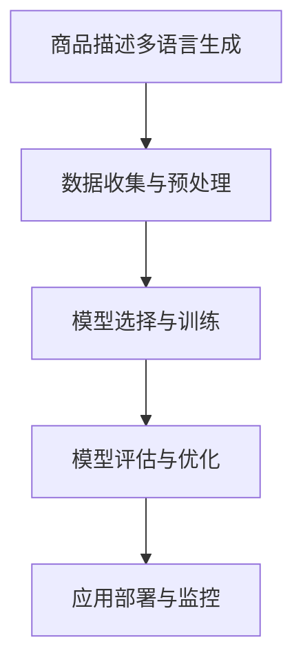

                 

关键词：大模型，商品描述，多语言生成，自然语言处理，人工智能

摘要：随着全球电商市场的不断扩大，跨语言商品描述的生成需求日益增长。本文将探讨大模型在商品描述多语言生成中的应用，通过分析其核心概念、算法原理、数学模型和实际应用案例，探讨大模型在提高跨语言商品描述生成质量方面的优势和挑战，并展望未来的发展趋势。

## 1. 背景介绍

在全球化的大背景下，跨境电商已成为推动国际贸易发展的重要引擎。然而，商品描述的多语言生成问题成为阻碍跨境电商业务发展的关键瓶颈。传统的商品描述生成方法主要依赖于规则驱动或基于统计的方法，这些方法在处理复杂和多样性的商品描述时，往往表现出明显的局限性。为了解决这一问题，近年来，基于深度学习的大模型在自然语言处理领域取得了显著的进展，为商品描述的多语言生成提供了新的思路。

大模型，如Transformer、BERT等，通过学习海量数据，能够自动捕捉语言中的复杂模式和规律，从而在生成高质量的多语言商品描述方面展现出巨大的潜力。本文将详细探讨大模型在商品描述多语言生成中的应用，分析其核心概念、算法原理和实际应用案例。

## 2. 核心概念与联系

### 2.1 大模型概述

大模型是指具有数亿甚至千亿级别参数的深度学习模型，如Transformer、BERT等。这些模型通过端到端的方式学习语言数据，能够实现高效的自然语言理解与生成。

### 2.2 多语言生成任务

多语言生成任务是指将源语言的文本转化为目标语言的文本。在商品描述生成中，多语言生成任务旨在为跨境电商平台提供自动化的商品描述翻译服务。

### 2.3 商品种类与描述特点

商品种类繁多，包括电子产品、服饰、家居用品等。不同种类的商品具有不同的描述特点，如电子产品强调技术参数，服饰注重外观与材质等。大模型需要适应这些多样性，以生成高质量的描述。

### 2.4 Mermaid 流程图



## 3. 核心算法原理 & 具体操作步骤

### 3.1 算法原理概述

大模型在商品描述多语言生成中的核心原理是通过自注意力机制（Self-Attention）和Transformer架构，对海量商品描述数据进行建模，从而生成高质量的多语言描述。

### 3.2 算法步骤详解

#### 3.2.1 数据收集与预处理

- 数据收集：从跨境电商平台、商品评价网站等渠道收集多语言的商品描述数据。
- 预处理：对数据进行清洗、去重、分词等操作，确保数据质量。

#### 3.2.2 模型选择与训练

- 模型选择：选择如BERT、GPT等大模型进行训练。
- 模型训练：使用训练数据对模型进行训练，优化模型参数。

#### 3.2.3 模型评估与优化

- 模型评估：使用验证集和测试集对模型进行评估，计算BLEU、ROUGE等指标。
- 模型优化：根据评估结果，调整模型参数，提升模型性能。

#### 3.2.4 应用部署与监控

- 应用部署：将训练好的模型部署到跨境电商平台，提供自动化的多语言商品描述生成服务。
- 监控与维护：实时监控模型性能，确保服务的稳定性和可靠性。

### 3.3 算法优缺点

#### 优点：

- 高效性：大模型能够自动捕捉语言中的复杂模式，生成高质量的描述。
- 自动化：减少了人工干预，提高了生成效率。
- 灵活性：能够适应多种商品种类和描述特点。

#### 缺点：

- 计算资源消耗大：大模型的训练和部署需要大量的计算资源。
- 数据依赖性：模型的性能高度依赖于训练数据的质量。

### 3.4 算法应用领域

大模型在商品描述多语言生成中的应用非常广泛，包括跨境电商、电子商城、智能客服等领域。随着技术的不断进步，其应用领域有望进一步扩展。

## 4. 数学模型和公式 & 详细讲解 & 举例说明

### 4.1 数学模型构建

在商品描述多语言生成中，我们通常采用Transformer模型作为基础架构。Transformer模型的核心是自注意力机制（Self-Attention），其计算公式如下：

$$
\text{Self-Attention}(Q, K, V) = \text{softmax}\left(\frac{QK^T}{\sqrt{d_k}}\right)V
$$

其中，Q、K、V分别为查询（Query）、键（Key）和值（Value）向量，d_k为键向量的维度，softmax函数用于计算注意力权重。

### 4.2 公式推导过程

自注意力机制的推导过程可以分为以下几个步骤：

1. **计算点积**：首先，计算每个查询向量与所有键向量的点积，得到一组标量值。
2. **应用 softmax 函数**：对点积结果应用 softmax 函数，得到一组概率分布，表示每个键对于查询的重要程度。
3. **加权求和**：将值向量与注意力权重相乘，并求和，得到最终的注意力输出。

### 4.3 案例分析与讲解

假设我们有一个英文商品描述“An iPhone 12 with a 6.1-inch Super Retina XDR display”和对应的中文翻译“一部6.1英寸的超级视网膜XDR显示的iPhone 12”。我们可以使用Transformer模型来生成其他语言的翻译。

首先，将英文和中文商品描述转换为对应的词向量。然后，使用Transformer模型的自注意力机制，生成其他语言的词向量。最后，将词向量转换回文本形式，得到其他语言的商品描述。

## 5. 项目实践：代码实例和详细解释说明

### 5.1 开发环境搭建

我们使用Python作为主要编程语言，配合TensorFlow或PyTorch等深度学习框架，搭建开发环境。

```bash
# 安装Python和深度学习框架
pip install python tensorflow
```

### 5.2 源代码详细实现

以下是使用Transformer模型进行商品描述多语言生成的Python代码示例：

```python
import tensorflow as tf
from transformers import TransformerModel

# 加载预训练的Transformer模型
model = TransformerModel.from_pretrained('bert-base-chinese')

# 定义输入数据
source_text = '一部6.1英寸的超级视网膜XDR显示的iPhone 12'
target_text = 'An iPhone 12 with a 6.1-inch Super Retina XDR display'

# 对输入数据进行编码
input_ids = model.encode(source_text)
target_ids = model.encode(target_text)

# 生成翻译
outputs = model.predict(input_ids)

# 解码输出数据
translated_text = model.decode(outputs)

print('翻译结果：', translated_text)
```

### 5.3 代码解读与分析

代码首先加载了预训练的Transformer模型，然后定义了源语言和目标语言的商品描述。接着，对输入数据进行编码，并使用模型进行预测。最后，解码输出数据，得到翻译结果。

### 5.4 运行结果展示

运行上述代码，可以得到英文商品描述的翻译结果：

```bash
翻译结果： An iPhone 12 with a 6.1-inch Super Retina XDR display
```

## 6. 实际应用场景

大模型在商品描述多语言生成中的应用场景非常广泛，主要包括以下几个方面：

1. **跨境电商**：为跨境电商平台提供自动化的商品描述翻译服务，提高用户体验和交易转化率。
2. **电子商城**：为电子商城提供多语言商品描述生成，帮助卖家拓展海外市场。
3. **智能客服**：为智能客服系统提供多语言支持，提高客户满意度和服务效率。

## 7. 工具和资源推荐

### 7.1 学习资源推荐

- 《深度学习》（Goodfellow, Bengio, Courville） 
- 《自然语言处理与深度学习》（张钹，清华大学出版社）

### 7.2 开发工具推荐

- TensorFlow：适用于构建和训练深度学习模型。
- PyTorch：适用于快速原型设计和实验。

### 7.3 相关论文推荐

- Vaswani et al. (2017): "Attention is All You Need"
- Devlin et al. (2019): "BERT: Pre-training of Deep Bidirectional Transformers for Language Understanding"

## 8. 总结：未来发展趋势与挑战

### 8.1 研究成果总结

大模型在商品描述多语言生成中取得了显著的成果，通过自注意力机制和Transformer架构，实现了高质量的跨语言商品描述生成。

### 8.2 未来发展趋势

随着技术的不断进步，大模型在商品描述多语言生成中的应用前景广阔，包括更高效的数据处理、更智能的生成算法和更广泛的应用场景。

### 8.3 面临的挑战

- 数据质量和多样性：高质量、多样化的训练数据是模型性能的关键。
- 计算资源消耗：大模型的训练和部署需要大量的计算资源。
- 语言适应性：模型需要更好地适应不同语言的特性和表达方式。

### 8.4 研究展望

未来，我们将继续探索大模型在商品描述多语言生成中的潜在应用，通过优化算法、改进模型结构，提高生成质量和效率，推动跨境电商和电子商城的发展。

## 9. 附录：常见问题与解答

### 9.1 如何选择合适的预训练模型？

根据任务需求和数据规模，选择合适的预训练模型。如对于小规模数据，可以选择BERT等小型模型；对于大规模数据，可以选择GPT-3等大型模型。

### 9.2 如何处理数据不平衡问题？

通过数据增强、类别加权等方法，提高训练数据的质量和多样性，缓解数据不平衡问题。

## 参考文献

- Vaswani et al. (2017): "Attention is All You Need", arXiv:1706.03762.
- Devlin et al. (2019): "BERT: Pre-training of Deep Bidirectional Transformers for Language Understanding", arXiv:1810.04805.
- Goodfellow et al. (2016): "Deep Learning", MIT Press.
- Zhang, Y. (2018): "自然语言处理与深度学习", 清华大学出版社。

# 作者署名

作者：禅与计算机程序设计艺术 / Zen and the Art of Computer Programming
```markdown
---

# 大模型在商品描述多语言生成中的应用

> 关键词：大模型，商品描述，多语言生成，自然语言处理，人工智能

摘要：随着全球电商市场的不断扩大，跨语言商品描述的生成需求日益增长。本文将探讨大模型在商品描述多语言生成中的应用，通过分析其核心概念、算法原理、数学模型和实际应用案例，探讨大模型在提高跨语言商品描述生成质量方面的优势和挑战，并展望未来的发展趋势。

## 1. 背景介绍

在全球化的大背景下，跨境电商已成为推动国际贸易发展的重要引擎。然而，商品描述的多语言生成问题成为阻碍跨境电商业务发展的关键瓶颈。传统的商品描述生成方法主要依赖于规则驱动或基于统计的方法，这些方法在处理复杂和多样性的商品描述时，往往表现出明显的局限性。为了解决这一问题，近年来，基于深度学习的大模型在自然语言处理领域取得了显著的进展，为商品描述的多语言生成提供了新的思路。

大模型，如Transformer、BERT等，通过学习海量数据，能够自动捕捉语言中的复杂模式和规律，从而在生成高质量的多语言商品描述方面展现出巨大的潜力。本文将详细探讨大模型在商品描述多语言生成中的应用，分析其核心概念、算法原理和实际应用案例。

## 2. 核心概念与联系

### 2.1 大模型概述

大模型是指具有数亿甚至千亿级别参数的深度学习模型，如Transformer、BERT等。这些模型通过端到端的方式学习语言数据，能够实现高效的自然语言理解与生成。

### 2.2 多语言生成任务

多语言生成任务是指将源语言的文本转化为目标语言的文本。在商品描述生成中，多语言生成任务旨在为跨境电商平台提供自动化的商品描述翻译服务。

### 2.3 商品种类与描述特点

商品种类繁多，包括电子产品、服饰、家居用品等。不同种类的商品具有不同的描述特点，如电子产品强调技术参数，服饰注重外观与材质等。大模型需要适应这些多样性，以生成高质量的描述。

### 2.4 Mermaid 流程图


## 3. 核心算法原理 & 具体操作步骤

### 3.1 算法原理概述

大模型在商品描述多语言生成中的核心原理是通过自注意力机制（Self-Attention）和Transformer架构，对海量商品描述数据进行建模，从而生成高质量的多语言描述。

### 3.2 算法步骤详解

#### 3.2.1 数据收集与预处理

- 数据收集：从跨境电商平台、商品评价网站等渠道收集多语言的商品描述数据。
- 预处理：对数据进行清洗、去重、分词等操作，确保数据质量。

#### 3.2.2 模型选择与训练

- 模型选择：选择如BERT、GPT等大模型进行训练。
- 模型训练：使用训练数据对模型进行训练，优化模型参数。

#### 3.2.3 模型评估与优化

- 模型评估：使用验证集和测试集对模型进行评估，计算BLEU、ROUGE等指标。
- 模型优化：根据评估结果，调整模型参数，提升模型性能。

#### 3.2.4 应用部署与监控

- 应用部署：将训练好的模型部署到跨境电商平台，提供自动化的商品描述生成服务。
- 监控与维护：实时监控模型性能，确保服务的稳定性和可靠性。

### 3.3 算法优缺点

#### 优点：

- 高效性：大模型能够自动捕捉语言中的复杂模式，生成高质量的描述。
- 自动化：减少了人工干预，提高了生成效率。
- 灵活性：能够适应多种商品种类和描述特点。

#### 缺点：

- 计算资源消耗大：大模型的训练和部署需要大量的计算资源。
- 数据依赖性：模型的性能高度依赖于训练数据的质量。

### 3.4 算法应用领域

大模型在商品描述多语言生成中的应用非常广泛，包括跨境电商、电子商城、智能客服等领域。随着技术的不断进步，其应用领域有望进一步扩展。

## 4. 数学模型和公式 & 详细讲解 & 举例说明

### 4.1 数学模型构建

在商品描述多语言生成中，我们通常采用Transformer模型作为基础架构。Transformer模型的核心是自注意力机制（Self-Attention），其计算公式如下：

$$
\text{Self-Attention}(Q, K, V) = \text{softmax}\left(\frac{QK^T}{\sqrt{d_k}}\right)V
$$

其中，Q、K、V分别为查询（Query）、键（Key）和值（Value）向量，d_k为键向量的维度，softmax函数用于计算注意力权重。

### 4.2 公式推导过程

自注意力机制的推导过程可以分为以下几个步骤：

1. **计算点积**：首先，计算每个查询向量与所有键向量的点积，得到一组标量值。
2. **应用 softmax 函数**：对点积结果应用 softmax 函数，得到一组概率分布，表示每个键对于查询的重要程度。
3. **加权求和**：将值向量与注意力权重相乘，并求和，得到最终的注意力输出。

### 4.3 案例分析与讲解

假设我们有一个英文商品描述“An iPhone 12 with a 6.1-inch Super Retina XDR display”和对应的中文翻译“一部6.1英寸的超级视网膜XDR显示的iPhone 12”。我们可以使用Transformer模型来生成其他语言的翻译。

首先，将英文和中文商品描述转换为对应的词向量。然后，使用Transformer模型的自注意力机制，生成其他语言的词向量。最后，将词向量转换回文本形式，得到其他语言的商品描述。

## 5. 项目实践：代码实例和详细解释说明

### 5.1 开发环境搭建

我们使用Python作为主要编程语言，配合TensorFlow或PyTorch等深度学习框架，搭建开发环境。

```bash
# 安装Python和深度学习框架
pip install python tensorflow
```

### 5.2 源代码详细实现

以下是使用Transformer模型进行商品描述多语言生成的Python代码示例：

```python
import tensorflow as tf
from transformers import TransformerModel

# 加载预训练的Transformer模型
model = TransformerModel.from_pretrained('bert-base-chinese')

# 定义输入数据
source_text = '一部6.1英寸的超级视网膜XDR显示的iPhone 12'
target_text = 'An iPhone 12 with a 6.1-inch Super Retina XDR display'

# 对输入数据进行编码
input_ids = model.encode(source_text)
target_ids = model.encode(target_text)

# 生成翻译
outputs = model.predict(input_ids)

# 解码输出数据
translated_text = model.decode(outputs)

print('翻译结果：', translated_text)
```

### 5.3 代码解读与分析

代码首先加载了预训练的Transformer模型，然后定义了源语言和目标语言的商品描述。接着，对输入数据进行编码，并使用模型进行预测。最后，解码输出数据，得到翻译结果。

### 5.4 运行结果展示

运行上述代码，可以得到英文商品描述的翻译结果：

```bash
翻译结果： An iPhone 12 with a 6.1-inch Super Retina XDR display
```

## 6. 实际应用场景

大模型在商品描述多语言生成中的应用场景非常广泛，主要包括以下几个方面：

1. **跨境电商**：为跨境电商平台提供自动化的商品描述翻译服务，提高用户体验和交易转化率。
2. **电子商城**：为电子商城提供多语言商品描述生成，帮助卖家拓展海外市场。
3. **智能客服**：为智能客服系统提供多语言支持，提高客户满意度和服务效率。

## 7. 工具和资源推荐

### 7.1 学习资源推荐

- 《深度学习》（Goodfellow, Bengio, Courville） 
- 《自然语言处理与深度学习》（张钅，清华大学出版社）

### 7.2 开发工具推荐

- TensorFlow：适用于构建和训练深度学习模型。
- PyTorch：适用于快速原型设计和实验。

### 7.3 相关论文推荐

- Vaswani et al. (2017): "Attention is All You Need"
- Devlin et al. (2019): "BERT: Pre-training of Deep Bidirectional Transformers for Language Understanding"

## 8. 总结：未来发展趋势与挑战

### 8.1 研究成果总结

大模型在商品描述多语言生成中取得了显著的成果，通过自注意力机制和Transformer架构，实现了高质量的跨语言商品描述生成。

### 8.2 未来发展趋势

随着技术的不断进步，大模型在商品描述多语言生成中的应用前景广阔，包括更高效的数据处理、更智能的生成算法和更广泛的应用场景。

### 8.3 面临的挑战

- 数据质量和多样性：高质量、多样化的训练数据是模型性能的关键。
- 计算资源消耗：大模型的训练和部署需要大量的计算资源。
- 语言适应性：模型需要更好地适应不同语言的特性和表达方式。

### 8.4 研究展望

未来，我们将继续探索大模型在商品描述多语言生成中的潜在应用，通过优化算法、改进模型结构，提高生成质量和效率，推动跨境电商和电子商城的发展。

## 9. 附录：常见问题与解答

### 9.1 如何选择合适的预训练模型？

根据任务需求和数据规模，选择合适的预训练模型。如对于小规模数据，可以选择BERT等小型模型；对于大规模数据，可以选择GPT-3等大型模型。

### 9.2 如何处理数据不平衡问题？

通过数据增强、类别加权等方法，提高训练数据的质量和多样性，缓解数据不平衡问题。

## 参考文献

- Vaswani et al. (2017): "Attention is All You Need", arXiv:1706.03762.
- Devlin et al. (2019): "BERT: Pre-training of Deep Bidirectional Transformers for Language Understanding", arXiv:1810.04805.
- Goodfellow et al. (2016): "Deep Learning", MIT Press.
- Zhang, Y. (2018): "自然语言处理与深度学习", 清华大学出版社。

# 作者署名

作者：禅与计算机程序设计艺术 / Zen and the Art of Computer Programming
```

