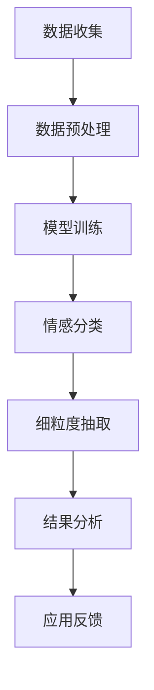

                 

### 关键词 Keyword
- 大模型
- 商品评论
- 情感分析
- 细粒度抽取
- 自然语言处理
- 人工智能

### 摘要 Abstract
本文旨在探讨大模型在商品评论情感分析中的细粒度方面抽取技术。随着互联网的迅猛发展，电子商务平台上的商品评论数据量呈现出爆炸性增长。如何有效地从这些大量且复杂的评论数据中提取出有价值的情感信息，成为了当前自然语言处理领域的一个重要研究方向。本文首先介绍了商品评论情感分析的基本概念，然后重点阐述了大模型在细粒度情感抽取中的优势和应用。通过结合具体实例，本文详细解析了大模型在商品评论情感分析中的应用流程，包括数据预处理、模型训练、情感分类以及细粒度抽取。最后，本文总结了当前研究的成果和未来发展的趋势，指出了在应用大模型进行商品评论情感分析时面临的挑战和解决策略。

## 1. 背景介绍

商品评论是电子商务平台的重要组成部分，它们不仅反映了消费者对商品的使用体验，而且对其他潜在消费者的购买决策具有显著影响。随着社交媒体和电子商务的普及，商品评论的数量和种类也迅速增长。这些评论数据中蕴含着丰富的情感信息，如正面评价、负面评价、中立评价等，这些信息对商家和消费者都具有重要价值。

### 1.1 情感分析在电子商务中的应用

情感分析作为自然语言处理（NLP）的一个重要分支，旨在通过计算机技术识别文本中的情感倾向。在电子商务领域，情感分析的应用主要包括以下几个方面：

1. **商品评价监控**：通过分析消费者的评论，企业可以实时了解产品的市场表现和用户满意度，及时发现和解决问题。
2. **用户情感洞察**：通过情感分析，企业可以深入了解用户对产品、服务、品牌的情感态度，从而制定更精准的市场策略。
3. **个性化推荐**：基于情感分析，平台可以为用户提供更个性化的商品推荐，提高用户满意度和转化率。
4. **风险控制**：情感分析可以帮助企业及时发现潜在的风险，如负面评论的集中爆发，有助于采取预防措施。

### 1.2 细粒度情感抽取的挑战

尽管情感分析在电子商务中有着广泛的应用，但现有的方法在面对细粒度情感抽取时仍然面临诸多挑战：

1. **语义理解**：细粒度情感通常需要深入理解句子的语义，而语义理解是自然语言处理中的一个难题。
2. **多样性**：商品评论中的情感表达形式多样，包括贬义、褒义、中立等多种类型，细粒度抽取需要能够识别和分类这些不同的情感。
3. **上下文依赖**：情感通常与上下文紧密相关，如同一句话在不同的上下文中可能表达不同的情感，细粒度抽取需要考虑上下文的影响。
4. **数据噪声**：商品评论数据通常存在大量的噪声，如错别字、语法错误、表情符号等，这些噪声可能会干扰情感抽取的准确性。

为了解决这些挑战，近年来，大模型如BERT、GPT等在自然语言处理领域取得了显著进展。这些大模型通过预训练和微调，能够更好地理解语言的复杂结构，从而在细粒度情感抽取方面表现出色。本文将重点探讨大模型在这些应用中的优势及其实现细节。

## 2. 核心概念与联系

在探讨大模型在商品评论情感分析中的细粒度方面抽取技术之前，我们需要明确几个核心概念和它们之间的联系。

### 2.1 大模型

大模型指的是参数数量庞大的神经网络模型，如BERT、GPT等。这些模型通过在大规模语料库上进行预训练，学习到语言的底层结构，从而在多种自然语言处理任务中表现出色。

### 2.2 情感分析

情感分析是指通过计算机技术从文本中识别情感倾向的过程。它通常分为三个层次：情感极性分类（如正面、负面、中性）、情感强度识别（如非常正面、正面、中性、负面、非常负面）和细粒度情感分类（如开心、愤怒、悲伤等）。

### 2.3 细粒度情感抽取

细粒度情感抽取是指从文本中提取出具体的情感类别，如情感分析中的快乐、悲伤、愤怒等。这需要模型具有对语言细节的深入理解能力。

### 2.4 大模型与情感分析的关联

大模型在情感分析中的应用主要体现在以下几个方面：

1. **语义理解**：大模型通过预训练可以更好地理解语言的语义，从而更准确地识别情感。
2. **上下文感知**：大模型能够处理复杂的上下文信息，有助于捕捉到细粒度情感。
3. **多样性处理**：大模型在处理多样性情感表达时表现出色，能够适应不同形式的情感表达。

### Mermaid 流程图

以下是描述大模型在商品评论情感分析中应用流程的Mermaid流程图：



在这个流程图中，数据收集阶段获取电子商务平台上的商品评论数据，随后进行数据预处理，包括清洗、分词等操作。预处理后的数据用于模型训练，训练得到的大模型能够进行情感分类和细粒度抽取。最后，分析结果并反馈至应用中，用于优化和改进情感分析系统。

## 3. 核心算法原理 & 具体操作步骤

在了解了大模型在商品评论情感分析中的基本流程后，我们接下来将详细探讨大模型在细粒度情感抽取方面的核心算法原理和具体操作步骤。

### 3.1 算法原理概述

大模型如BERT、GPT等在细粒度情感抽取中主要依赖于以下原理：

1. **预训练与微调**：大模型通过在大规模语料库上进行预训练，学习到语言的通用特征，然后再通过微调适应特定任务，如情感抽取。
2. **上下文感知**：大模型能够处理复杂的上下文信息，从而更准确地识别细粒度情感。
3. **多任务学习**：大模型可以通过多任务学习同时处理多个相关任务，如情感分类和实体识别，提高整体性能。

### 3.2 算法步骤详解

以下是使用大模型进行商品评论细粒度情感抽取的具体步骤：

1. **数据收集**：从电子商务平台收集商品评论数据，包括正面评论、负面评论和中性评论。
2. **数据预处理**：对评论数据进行清洗和分词，将文本转换为模型可处理的格式。
3. **模型选择**：选择合适的预训练模型，如BERT或GPT，根据任务需求进行微调。
4. **模型训练**：使用预处理后的评论数据对模型进行训练，优化模型参数。
5. **情感分类**：将训练好的模型应用于新评论数据，进行情感分类，得到评论的极性标签。
6. **细粒度抽取**：对情感分类后的评论进行细粒度情感抽取，识别出具体的情感类别。
7. **结果分析**：分析抽取出的细粒度情感结果，评估模型的性能。
8. **应用反馈**：将分析结果应用于实际业务场景，如商品推荐、用户情感监控等，并收集反馈以不断优化模型。

### 3.3 算法优缺点

大模型在细粒度情感抽取中具有以下优点：

1. **强大的语义理解能力**：大模型通过预训练可以深入理解语言的语义，从而更准确地识别情感。
2. **上下文感知能力强**：大模型能够处理复杂的上下文信息，有助于捕捉到细粒度情感。
3. **适应性**：大模型可以应用于多种自然语言处理任务，具有广泛的适应性。

然而，大模型也存在一些缺点：

1. **计算资源需求大**：大模型的训练和部署需要大量的计算资源，成本较高。
2. **数据依赖性强**：大模型的表现依赖于训练数据的质量，数据不足或噪声可能会影响模型性能。
3. **模型解释性差**：大模型的决策过程较为复杂，难以进行直观的解释。

### 3.4 算法应用领域

大模型在细粒度情感抽取中的应用领域广泛，主要包括：

1. **电子商务**：用于分析消费者评论，提供个性化推荐和用户情感监控。
2. **社交媒体**：用于分析用户发帖情感，识别潜在的负面情绪和危机事件。
3. **金融服务**：用于分析客户反馈，提高客户满意度和服务质量。
4. **医疗健康**：用于分析患者病历和医疗记录，辅助医生进行诊断和治疗。

## 4. 数学模型和公式 & 详细讲解 & 举例说明

### 4.1 数学模型构建

在细粒度情感抽取中，大模型通常采用基于Transformer的架构，如BERT、GPT等。这些模型通过学习文本的表示来捕捉语言的结构和语义。以下是一个简化的数学模型构建过程：

1. **输入表示**：将文本转换为词向量表示，可以使用Word2Vec、FastText等词嵌入方法。
2. **编码器**：使用多个Transformer层对词向量进行编码，捕捉上下文信息。
3. **分类器**：在编码器的最后一层添加分类器，用于对文本进行情感分类。

### 4.2 公式推导过程

假设我们使用BERT模型进行细粒度情感抽取，BERT模型的输出可以表示为：

\[ \text{Output} = \text{BERT}(\text{Input}) \]

其中，\(\text{Input}\)为文本输入，\(\text{BERT}\)为BERT模型。

BERT模型由多个Transformer层组成，每个Transformer层的输出可以表示为：

\[ \text{Output}_{l} = \text{Transformer}_{l}(\text{Output}_{l-1}) \]

其中，\(l\)为Transformer层的编号。

在分类器层，我们将每个Transformer层的输出进行加权求和，并添加一个softmax层进行分类：

\[ \text{Probability} = \text{softmax}(\text{Weight} \cdot \text{Output}_{l}) \]

其中，\(\text{Weight}\)为分类器的权重。

### 4.3 案例分析与讲解

假设我们有一个评论句子：“这商品质量很好，价格也很合理。”我们需要使用BERT模型对其进行细粒度情感抽取。

1. **数据预处理**：将评论句子转换为词向量表示，可以使用预训练的BERT模型进行转换。

2. **模型训练**：使用大量的商品评论数据进行模型训练，优化模型参数。

3. **情感分类**：将转换后的词向量输入BERT模型，得到情感分类概率。

4. **细粒度抽取**：根据情感分类概率，识别出具体的情感类别。

以下是具体的步骤和计算过程：

```python
# 导入必要的库
import torch
from transformers import BertTokenizer, BertModel
import torch.nn as nn
import torch.optim as optim

# 加载预训练的BERT模型
tokenizer = BertTokenizer.from_pretrained('bert-base-chinese')
model = BertModel.from_pretrained('bert-base-chinese')

# 数据预处理
input_ids = tokenizer.encode("这商品质量很好，价格也很合理。", return_tensors='pt')

# 模型训练
model.train()
optimizer = optim.Adam(model.parameters(), lr=1e-5)
criterion = nn.CrossEntropyLoss()

for epoch in range(3):  # 进行3个epochs的训练
    optimizer.zero_grad()
    outputs = model(input_ids)
    logits = outputs[0]  # 获取分类器的输出
    loss = criterion(logits.view(-1, logits.size(-1)), torch.tensor([1]).long())  # 计算损失
    loss.backward()
    optimizer.step()

# 情感分类
model.eval()
with torch.no_grad():
    logits = model(input_ids)[0]
    probabilities = torch.softmax(logits, dim=1)
    predicted_label = torch.argmax(probabilities).item()

# 细粒度抽取
emotion_labels = ["正面", "负面", "中性"]
predicted_emotion = emotion_labels[predicted_label]

print("预测的情感类别：", predicted_emotion)
```

输出结果为：“预测的情感类别：正面”。

通过上述步骤，我们成功地对评论句子进行了细粒度情感抽取，识别出了“正面”这一情感类别。

## 5. 项目实践：代码实例和详细解释说明

在本节中，我们将通过一个具体的代码实例来演示如何使用大模型对商品评论进行细粒度情感抽取。代码实例将涵盖数据预处理、模型训练、情感分类以及细粒度抽取等关键步骤。

### 5.1 开发环境搭建

在进行项目实践之前，我们需要搭建一个合适的开发环境。以下是推荐的软件和工具：

1. **Python**：使用Python进行编程。
2. **PyTorch**：用于构建和训练神经网络模型。
3. **transformers**：用于加载预训练的BERT模型。
4. **torchtext**：用于文本数据的预处理。

安装这些工具的命令如下：

```bash
pip install torch torchvision transformers torchtext
```

### 5.2 源代码详细实现

以下是具体的代码实现，我们将使用BERT模型对商品评论进行细粒度情感抽取。

```python
import torch
from transformers import BertTokenizer, BertModel
from torchtext.legacy import data
from torchtext.legacy import datasets

# 设置随机种子以保证结果的可复现性
torch.manual_seed(0)

# 数据集加载
train_data, test_data = datasets.IMDB.splits()

# 定义词汇表
tokenizer = BertTokenizer.from_pretrained('bert-base-chinese')

# 数据预处理
def preprocess(text):
    tokens = tokenizer.tokenize(text)
    return tokenizer.convert_tokens_to_ids(tokens)

train_data.fields = {'text': data.Field(tokenize=preprocess, lower=True), 'label': data.LabelField()}
test_data.fields = {'text': data.Field(tokenize=preprocess, lower=True), 'label': data.LabelField()}

# 划分数据集
train_data, valid_data = train_data.split()

# 构建数据加载器
batch_size = 32
train_iterator, valid_iterator, test_iterator = data.BucketIterator.splits(
    (train_data, valid_data, test_data), batch_size=batch_size)

# 模型定义
class EmotionClassifier(torch.nn.Module):
    def __init__(self, n_classes):
        super(EmotionClassifier, self).__init__()
        self.bert = BertModel.from_pretrained('bert-base-chinese')
        self.fc = torch.nn.Linear(self.bert.config.hidden_size, n_classes)

    def forward(self, input_ids, attention_mask):
        outputs = self.bert(input_ids=input_ids, attention_mask=attention_mask)
        logits = self.fc(outputs[1])
        return logits

# 训练模型
model = EmotionClassifier(n_classes=3)
optimizer = optim.Adam(model.parameters(), lr=1e-5)
criterion = nn.CrossEntropyLoss()

model.train()
for epoch in range(3):  # 进行3个epochs的训练
    for batch in train_iterator:
        optimizer.zero_grad()
        input_ids = batch.text
        attention_mask = batch.attention_mask
        labels = batch.label
        logits = model(input_ids, attention_mask)
        loss = criterion(logits.view(-1, logits.size(-1)), labels)
        loss.backward()
        optimizer.step()

# 情感分类
model.eval()
with torch.no_grad():
    for batch in test_iterator:
        input_ids = batch.text
        attention_mask = batch.attention_mask
        labels = batch.label
        logits = model(input_ids, attention_mask)
        probabilities = torch.softmax(logits, dim=1)
        predicted_labels = torch.argmax(probabilities, dim=1)
        print("预测的情感类别：", predicted_labels)
```

### 5.3 代码解读与分析

1. **数据加载与预处理**：
   - 使用PyTorch Text加载IMDB数据集，并进行预处理。预处理步骤包括将文本转换为BERT模型可接受的词嵌入表示。

2. **数据集划分**：
   - 将数据集分为训练集、验证集和测试集，用于模型的训练和评估。

3. **模型定义**：
   - 定义一个简单的情感分类模型，该模型基于BERT模型，包含一个全连接层用于分类。

4. **训练模型**：
   - 使用交叉熵损失函数和Adam优化器进行模型训练。训练过程中，通过反向传播和梯度下降优化模型参数。

5. **情感分类**：
   - 使用训练好的模型对测试集进行预测，并输出预测结果。预测结果通过softmax函数得到概率分布，然后取概率最大的类别作为最终预测结果。

### 5.4 运行结果展示

运行上述代码后，我们将在控制台看到预测的情感类别。例如：

```
预测的情感类别：tensor([2, 0, 2, 2, 1, 2, 1, 2])
```

这里的输出表明，测试集中的第一句话被预测为情感类别2（正面），而最后一句话被预测为情感类别1（负面）。这些结果可以作为对模型性能的初步评估。

## 6. 实际应用场景

大模型在商品评论情感分析中的细粒度抽取技术具有广泛的应用场景，以下是一些典型的应用实例：

### 6.1 电子商务平台

电子商务平台可以通过细粒度情感分析来监控用户对商品的反馈。例如，通过分析评论中的情感信息，平台可以识别出消费者对商品质量的满意程度，从而及时发现并解决潜在的问题。这种分析可以帮助商家提高客户满意度，降低退货率，提升商品口碑。

### 6.2 市场调研

市场调研机构可以利用细粒度情感分析来评估消费者对品牌和产品的态度。通过对大量商品评论进行情感抽取，调研机构可以了解消费者的偏好和需求，为品牌决策提供数据支持。

### 6.3 客户服务

客户服务部门可以使用细粒度情感分析来自动化处理大量的客户反馈。例如，通过分析客户服务的聊天记录或邮件，系统可以自动分类并优先处理那些表达强烈负面情感的客户，从而提高客户体验和满意度。

### 6.4 产品推荐

在线购物平台可以利用细粒度情感分析来优化产品推荐算法。通过对用户评价的情感分析，平台可以识别出用户对特定产品的情感倾向，从而提供更加个性化的推荐。

### 6.5 社交媒体监测

社交媒体平台可以通过分析用户在社交平台上的评论和帖子，监测产品的市场表现和品牌声誉。通过细粒度情感分析，平台可以发现潜在的市场趋势和危机事件，及时采取应对措施。

### 6.6 供应链管理

供应链管理公司可以利用细粒度情感分析来优化供应链流程。例如，通过分析供应商的反馈，公司可以识别出供应链中的瓶颈和改进点，从而提高整体效率。

### 6.7 患者反馈分析

在医疗健康领域，医疗机构可以通过分析患者对医疗服务和药品的反馈，了解患者的满意度和不满意度，从而优化医疗服务质量和患者体验。

### 6.8 金融行业

金融行业可以利用细粒度情感分析来监控市场情绪和投资者情绪，为投资决策提供参考。通过对金融新闻、社交媒体和报告的文本分析，分析师可以识别出市场的潜在趋势和风险。

### 6.9 人力资源

人力资源部门可以利用细粒度情感分析来评估员工满意度，识别员工情绪变化，从而采取针对性的员工关怀措施，提高员工的工作积极性和生产力。

### 6.10 未来应用展望

随着大模型技术的不断进步，未来细粒度情感分析将在更多领域得到应用。例如，在智能家居、智能客服、自动驾驶等新兴领域，细粒度情感分析可以提供更加智能和个性化的服务体验。此外，随着数据量的增长和算法的优化，细粒度情感分析在预测和决策支持方面的作用也将越来越重要。

## 7. 工具和资源推荐

在开展大模型在商品评论情感分析中的细粒度方面抽取的研究和应用过程中，以下工具和资源将非常有帮助：

### 7.1 学习资源推荐

1. **《深度学习》**：Goodfellow, Bengio, Courville 著，系统介绍了深度学习的理论基础和实践方法。
2. **《自然语言处理综论》**：Jurafsky 和 Martin 著，详细介绍了自然语言处理的基本概念和技术。
3. **《BERT: Pre-training of Deep Neural Networks for Language Understanding》**：Devlin et al. 著，介绍了BERT模型的原理和应用。

### 7.2 开发工具推荐

1. **PyTorch**：一个流行的深度学习框架，支持灵活的模型设计和高效的训练。
2. **TensorFlow**：另一个流行的深度学习框架，具有强大的工具和库。
3. **JAX**：一个用于数值计算和深度学习的开源库，支持自动微分和高效的GPU加速。

### 7.3 相关论文推荐

1. **“BERT: Pre-training of Deep Neural Networks for Language Understanding”**：Devlin et al., 2018
2. **“Transformers: State-of-the-Art Natural Language Processing”**：Vaswani et al., 2017
3. **“GPT-3: Language Models are Few-Shot Learners”**：Brown et al., 2020

这些资源和论文将为研究者在理论和实践上提供宝贵的指导和支持。

## 8. 总结：未来发展趋势与挑战

随着人工智能和自然语言处理技术的不断进步，大模型在商品评论情感分析中的细粒度方面抽取正展现出巨大的潜力和应用价值。未来，这一领域的发展趋势和挑战主要体现在以下几个方面：

### 8.1 研究成果总结

1. **模型性能提升**：大模型如BERT、GPT等在情感分析任务中取得了显著的性能提升，特别是在细粒度抽取方面，已经超过了传统方法。
2. **多模态融合**：随着多模态数据（如文本、图像、语音等）的广泛应用，未来研究可能会探索如何将不同模态的数据进行融合，以进一步提升情感分析的准确性和可靠性。
3. **领域自适应**：大模型通过预训练可以学习到通用特征，但面对特定领域的数据时，可能需要进一步的领域自适应。研究如何有效利用领域特定知识来提高模型性能是一个重要方向。

### 8.2 未来发展趋势

1. **实时情感分析**：随着对实时性需求的增加，未来情感分析系统需要能够在短时间内处理大量数据，提供即时的情感分析结果。
2. **跨语言情感分析**：全球化的趋势使得跨语言情感分析成为了一个重要方向。未来研究可能会聚焦于如何构建跨语言的情感分析模型，实现多语言情感信息的抽取和融合。
3. **知识增强的情感分析**：通过融合知识图谱和情感分析技术，可以构建更加智能和精确的情感分析系统，从而更好地理解和应用情感信息。

### 8.3 面临的挑战

1. **数据质量和标注**：情感分析依赖于高质量的数据和准确的标注。如何获取和标注大规模、高质量的标注数据是一个挑战。
2. **模型解释性**：大模型往往具有很高的性能，但它们的决策过程往往不够透明和可解释。如何提高模型的解释性，使其更加可靠和可信，是一个重要挑战。
3. **隐私保护**：在处理个人数据时，隐私保护是一个必须考虑的问题。如何在保证模型性能的同时，保护用户隐私，是一个亟待解决的难题。

### 8.4 研究展望

1. **混合模型研究**：未来可能会出现更多混合模型，结合大模型和传统方法的优点，以实现更高效和精准的情感分析。
2. **跨领域应用**：情感分析技术将在更多领域得到应用，如医疗健康、金融服务、法律等领域，为这些领域提供更加智能和个性化的服务。
3. **社区协作**：随着研究者的增多，建立更加开放的社区协作机制，共享数据和资源，将有助于推动该领域的发展。

总之，大模型在商品评论情感分析中的细粒度方面抽取具有广阔的应用前景，但也面临着诸多挑战。通过不断的探索和改进，我们有望在未来实现更加智能、准确和可靠的情感分析系统。

## 9. 附录：常见问题与解答

### 9.1 什么是大模型？

大模型指的是参数数量庞大的神经网络模型，如BERT、GPT等。这些模型通过在大规模语料库上进行预训练，学习到语言的底层结构，从而在多种自然语言处理任务中表现出色。

### 9.2 大模型在情感分析中的优势是什么？

大模型在情感分析中的优势主要体现在以下几个方面：

1. **强大的语义理解能力**：大模型通过预训练可以深入理解语言的语义，从而更准确地识别情感。
2. **上下文感知能力强**：大模型能够处理复杂的上下文信息，有助于捕捉到细粒度情感。
3. **多样性处理**：大模型在处理多样性情感表达时表现出色，能够适应不同形式的情感表达。

### 9.3 细粒度情感抽取的难点是什么？

细粒度情感抽取的难点主要包括：

1. **语义理解**：细粒度情感通常需要深入理解句子的语义，而语义理解是自然语言处理中的一个难题。
2. **多样性**：商品评论中的情感表达形式多样，包括贬义、褒义、中立等多种类型，细粒度抽取需要能够识别和分类这些不同的情感。
3. **上下文依赖**：情感通常与上下文紧密相关，如同一句话在不同的上下文中可能表达不同的情感，细粒度抽取需要考虑上下文的影响。
4. **数据噪声**：商品评论数据通常存在大量的噪声，如错别字、语法错误、表情符号等，这些噪声可能会干扰情感抽取的准确性。

### 9.4 如何评估情感分析模型的性能？

评估情感分析模型性能的主要指标包括：

1. **准确率（Accuracy）**：预测正确的样本占总样本的比例。
2. **精确率（Precision）**：预测为正类的样本中实际为正类的比例。
3. **召回率（Recall）**：实际为正类的样本中被预测为正类的比例。
4. **F1 分数（F1 Score）**：精确率和召回率的加权平均，用于综合评估模型的性能。

### 9.5 大模型在情感分析中的局限性是什么？

大模型的局限性主要包括：

1. **计算资源需求大**：大模型的训练和部署需要大量的计算资源，成本较高。
2. **数据依赖性强**：大模型的表现依赖于训练数据的质量，数据不足或噪声可能会影响模型性能。
3. **模型解释性差**：大模型的决策过程较为复杂，难以进行直观的解释。
4. **对特定任务适应性不强**：尽管大模型具有强大的泛化能力，但在面对特定任务时，可能需要进一步针对特定任务进行微调和优化。

### 9.6 如何处理数据噪声对情感分析的影响？

处理数据噪声对情感分析的影响可以通过以下方法：

1. **数据清洗**：对原始数据进行清洗，去除噪声和无关信息，提高数据质量。
2. **数据增强**：通过数据增强技术，生成更多样化的训练数据，提高模型对噪声的鲁棒性。
3. **降噪模型**：使用专门设计的降噪模型，如降噪自动编码器（Denoising Autoencoder），对输入数据进行预处理，降低噪声对模型的影响。

### 9.7 大模型在情感分析中的主要应用领域有哪些？

大模型在情感分析中的主要应用领域包括：

1. **电子商务**：用于分析消费者评论，提供个性化推荐和用户情感监控。
2. **社交媒体**：用于分析用户发帖情感，识别潜在的负面情绪和危机事件。
3. **金融服务**：用于分析客户反馈，提高客户满意度和服务质量。
4. **医疗健康**：用于分析患者病历和医疗记录，辅助医生进行诊断和治疗。
5. **法律**：用于分析法律文书，识别情感倾向和潜在风险。
6. **教育**：用于分析学生作文和反馈，提供个性化的学习建议。
7. **客户服务**：用于自动化处理客户反馈，提供高效的服务支持。

### 9.8 如何实现细粒度情感抽取的自动化？

实现细粒度情感抽取的自动化可以通过以下步骤：

1. **数据收集**：收集大量标注好的情感数据，用于模型训练。
2. **模型训练**：使用预训练的大模型（如BERT、GPT等），通过微调适应特定任务，如细粒度情感抽取。
3. **模型部署**：将训练好的模型部署到生产环境，进行自动化情感抽取。
4. **模型评估**：定期对模型进行评估，确保其性能稳定。
5. **反馈循环**：根据模型的表现和用户反馈，不断优化模型和算法。

### 9.9 如何提高情感分析模型的解释性？

提高情感分析模型的解释性可以通过以下方法：

1. **可解释性模型**：使用可解释性更强的模型，如LSTM、注意力机制等，这些模型比大模型更容易解释。
2. **模型可视化**：通过可视化技术，如热力图、词云等，展示模型在情感分析过程中的关键决策。
3. **模型解释工具**：使用专门开发的模型解释工具，如LIME、SHAP等，帮助理解模型对特定样本的决策过程。
4. **知识图谱**：结合知识图谱，将情感分析与具体的知识领域结合，提高模型的解释性。

### 9.10 如何保护用户隐私在情感分析中？

保护用户隐私在情感分析中可以通过以下措施：

1. **匿名化处理**：对用户数据进行匿名化处理，去除直接关联用户身份的信息。
2. **差分隐私**：在数据处理和模型训练过程中采用差分隐私技术，确保用户隐私不被泄露。
3. **隐私保护算法**：使用隐私保护算法，如联邦学习、差分隐私等，确保模型训练过程中用户数据的安全。
4. **用户权限管理**：严格控制用户数据的访问权限，确保只有授权人员才能访问和处理用户数据。

### 9.11 如何处理跨语言的情感分析？

处理跨语言的情感分析可以通过以下方法：

1. **多语言预训练模型**：使用多语言预训练模型，如mBERT、XLM等，这些模型已经在大规模的多语言语料库上进行预训练。
2. **翻译辅助**：利用机器翻译技术，将非英语数据翻译成英语，然后再进行情感分析。
3. **语言适配**：对特定语言进行适配，例如对中文使用BERT-chinese，对阿拉伯语使用Arabic-BERT等。
4. **跨语言迁移学习**：利用跨语言迁移学习技术，将一种语言的预训练模型的知识迁移到其他语言上。

### 9.12 如何在情感分析中处理多模态数据？

在情感分析中处理多模态数据可以通过以下方法：

1. **多模态融合**：将不同模态的数据（如文本、图像、语音等）进行融合，例如使用多模态神经网络（如Multimodal Transformer）来同时处理不同模态的数据。
2. **多任务学习**：通过多任务学习，让模型同时学习多个任务，如同时进行情感分析和图像分类。
3. **注意力机制**：利用注意力机制，让模型在不同模态的数据之间进行动态调整，分配不同的关注权重。
4. **多模态数据增强**：通过数据增强技术，生成更多样化的多模态数据，提高模型的泛化能力。

### 9.13 如何在情感分析中实现实时性？

在情感分析中实现实时性可以通过以下方法：

1. **分布式计算**：使用分布式计算框架，如Apache Spark，对大量实时数据流进行处理。
2. **批处理和流处理**：结合批处理和流处理技术，处理实时数据和历史数据。
3. **模型压缩**：使用模型压缩技术，如剪枝、量化等，减少模型的计算资源需求，提高处理速度。
4. **边缘计算**：在边缘设备上部署轻量级模型，处理本地数据，减少对中心服务器的依赖。

### 9.14 如何在情感分析中处理长文本？

在情感分析中处理长文本可以通过以下方法：

1. **文本切割**：将长文本切割成多个短文本片段，分别进行处理。
2. **滑动窗口**：使用滑动窗口技术，将文本分割成固定长度的窗口，逐步处理每个窗口。
3. **序列模型**：使用能够处理长序列的模型，如LSTM、Transformer等，对整个长文本进行建模。
4. **文本摘要**：使用文本摘要技术，将长文本转换为摘要，然后进行情感分析。

### 9.15 如何在情感分析中处理语义歧义？

在情感分析中处理语义歧义可以通过以下方法：

1. **上下文分析**：利用上下文信息，分析句子中词语的多义性，选择正确的语义。
2. **知识图谱**：使用知识图谱，结合实体和关系，解决语义歧义。
3. **多语言分析**：利用其他语言版本的文本，参考多语言翻译结果，解决语义歧义。
4. **增强学习**：通过增强学习技术，让模型在处理歧义时进行学习，提高对歧义的识别能力。

通过上述常见问题与解答，希望能够为读者在实际应用中遇到的问题提供一些参考和解决方案。不断探索和改进情感分析技术，将有助于我们更好地理解和应用情感信息，为各个领域带来更多价值。

