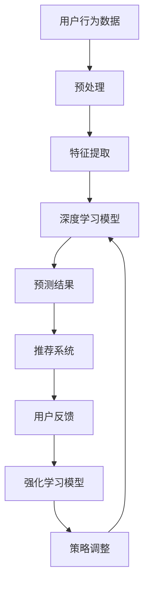

                 

 大模型在序列推荐中的应用

随着互联网的飞速发展和大数据时代的到来，个性化推荐系统成为了各类在线平台不可或缺的重要组成部分。在这些系统中，大模型技术因其强大的数据处理和模式识别能力，正逐渐成为提升推荐系统性能的关键因素。本文将探讨大模型在序列推荐中的应用，从核心概念、算法原理、数学模型、项目实践到实际应用场景，为读者呈现这一领域的前沿技术和发展趋势。

## 文章关键词

- 大模型
- 序列推荐
- 个性化推荐
- 深度学习
- 强化学习
- 自然语言处理
- 图神经网络

## 文章摘要

本文旨在介绍大模型在序列推荐中的应用，通过梳理相关核心概念、算法原理和数学模型，分析其在实际项目中的具体实现和应用效果。同时，本文还将探讨未来发展趋势和面临的挑战，为读者提供对这一领域的全面了解和深入思考。

## 1. 背景介绍

### 1.1 个性化推荐系统的兴起

个性化推荐系统起源于20世纪90年代，随着互联网的普及和在线服务的多样化，人们对个性化信息的需求日益增长。个性化推荐系统能够根据用户的历史行为、兴趣偏好等特征，为用户提供定制化的信息推荐，从而提升用户体验、增加用户黏性和平台收益。目前，个性化推荐系统广泛应用于电子商务、新闻推送、社交媒体、在线教育等多个领域。

### 1.2 大模型在推荐系统中的优势

传统推荐系统主要采用基于内容、协同过滤等方法，但存在许多局限性。而大模型，如深度学习、强化学习、图神经网络等，凭借其强大的数据处理能力和模式识别能力，为推荐系统带来了新的发展机遇。大模型能够从海量数据中挖掘用户兴趣、行为模式，实现更精准、更高效的个性化推荐。

### 1.3 序列推荐的重要性

序列推荐是指在一段时间内对用户行为序列进行分析，预测用户下一步可能感兴趣的内容。与传统的基于单次行为的推荐相比，序列推荐更能捕捉用户的行为连续性和兴趣演变，从而提高推荐的准确性和用户满意度。在短视频、社交媒体、电商等领域，序列推荐具有重要的应用价值。

## 2. 核心概念与联系

### 2.1 深度学习

深度学习是一种基于多层神经网络进行特征学习和模式识别的人工智能技术。在序列推荐中，深度学习模型可以自动从用户历史行为数据中提取特征，学习用户兴趣和行为模式，从而实现序列预测和推荐。

### 2.2 强化学习

强化学习是一种通过试错和反馈不断优化行为策略的机器学习技术。在序列推荐中，强化学习模型可以模拟用户行为，通过与环境的交互不断调整推荐策略，实现用户满意度的最大化。

### 2.3 图神经网络

图神经网络是一种基于图结构进行特征学习和预测的深度学习模型。在序列推荐中，图神经网络可以处理复杂的关系网络，如用户-物品网络、社交网络等，从而提高推荐的准确性和多样性。

### 2.4 Mermaid 流程图

图 1. 大模型在序列推荐中的应用架构



## 3. 核心算法原理 & 具体操作步骤

### 3.1 算法原理概述

大模型在序列推荐中的应用主要基于深度学习、强化学习和图神经网络等技术。这些算法通过学习用户历史行为数据，提取用户兴趣和行为模式，实现序列预测和推荐。

### 3.2 算法步骤详解

#### 3.2.1 深度学习模型

1. 数据预处理：对用户行为数据进行清洗、去噪和格式化，将其转化为适合模型训练的数据集。
2. 特征提取：使用深度学习模型（如卷积神经网络、循环神经网络等）从数据中提取特征。
3. 序列建模：将提取的特征输入到序列建模模块，学习用户行为序列的时空关系。
4. 序列预测：使用训练好的模型对用户行为序列进行预测，得到用户下一步可能感兴趣的内容。

#### 3.2.2 强化学习模型

1. 环境构建：定义推荐系统中的环境，包括用户、物品、状态、动作等。
2. 策略学习：使用强化学习模型（如Q-learning、Deep Q Network等）通过试错和反馈优化推荐策略。
3. 推荐策略：根据当前用户状态和模型预测，生成推荐策略。
4. 用户反馈：收集用户对推荐结果的反馈，更新模型参数。

#### 3.2.3 图神经网络模型

1. 图结构构建：将用户、物品及其关系表示为图结构。
2. 特征嵌入：使用图神经网络将节点和边进行特征嵌入。
3. 序列建模：将特征嵌入表示输入到序列建模模块，学习用户行为序列的时空关系。
4. 序列预测：使用训练好的模型对用户行为序列进行预测，得到用户下一步可能感兴趣的内容。

### 3.3 算法优缺点

#### 3.3.1 深度学习模型

优点：
- 强大的特征提取能力，能够捕捉复杂的用户行为模式。
- 可自动学习序列特征，无需人工设计特征。

缺点：
- 需要大量训练数据，且训练过程耗时长。
- 模型复杂度高，难以解释。

#### 3.3.2 强化学习模型

优点：
- 能够通过试错和反馈不断优化推荐策略，提高用户满意度。
- 可自适应调整推荐策略，适应用户兴趣的变化。

缺点：
- 学习过程复杂，需要大量计算资源。
- 需要大量用户反馈数据，且反馈周期较长。

#### 3.3.3 图神经网络模型

优点：
- 能够处理复杂的关系网络，提高推荐准确性。
- 可自动学习节点和边的关系，无需人工设计特征。

缺点：
- 模型复杂度高，难以解释。
- 对数据质量和预处理要求较高。

### 3.4 算法应用领域

深度学习、强化学习和图神经网络在序列推荐中的应用已取得显著成果，主要应用于以下领域：

- 电子商务：为用户提供个性化商品推荐，提高销售额和用户满意度。
- 社交媒体：为用户提供感兴趣的内容和用户，增强社交互动和用户黏性。
- 在线教育：为用户提供个性化的课程和学习计划，提高学习效果。
- 物联网：为用户提供个性化的设备推荐和服务，提高设备使用效率和用户体验。

## 4. 数学模型和公式 & 详细讲解 & 举例说明

### 4.1 数学模型构建

大模型在序列推荐中的应用主要基于深度学习、强化学习和图神经网络等技术。以下分别介绍这些技术的数学模型和公式。

#### 4.1.1 深度学习模型

深度学习模型主要基于多层神经网络，以下是一个简单的多层感知机（MLP）模型：

$$
h_{l}^{(i)} = \sigma \left( \sum_{j=1}^{n} w_{j}^{(l)} h_{l-1}^{(j)} + b_{l} \right)
$$

其中，$h_{l}^{(i)}$ 表示第$l$层第$i$个节点的激活值，$\sigma$ 表示激活函数，$w_{j}^{(l)}$ 和 $b_{l}$ 分别表示第$l$层的权重和偏置。

#### 4.1.2 强化学习模型

强化学习模型主要基于Q-learning算法，以下是一个简单的Q-learning模型：

$$
Q(s, a) \leftarrow Q(s, a) + \alpha [r + \gamma \max_{a'} Q(s', a') - Q(s, a)]
$$

其中，$Q(s, a)$ 表示在状态$s$下执行动作$a$的预期回报，$\alpha$ 为学习率，$r$ 为即时回报，$\gamma$ 为折扣因子，$s'$ 和 $a'$ 分别为下一个状态和动作。

#### 4.1.3 图神经网络模型

图神经网络模型主要基于图卷积网络（GCN），以下是一个简单的GCN模型：

$$
h_{l}^{(i)} = \sigma \left( \sum_{j \in \mathcal{N}(i)} w_{j}^{(l)} h_{l-1}^{(j)} + b_{l} \right)
$$

其中，$h_{l}^{(i)}$ 表示第$l$层第$i$个节点的激活值，$\mathcal{N}(i)$ 表示第$i$个节点的邻居节点集合，$w_{j}^{(l)}$ 和 $b_{l}$ 分别表示第$l$层的权重和偏置。

### 4.2 公式推导过程

以下分别介绍深度学习、强化学习和图神经网络的公式推导过程。

#### 4.2.1 深度学习模型

深度学习模型的公式推导主要基于反向传播算法。假设我们已经定义了损失函数：

$$
L(y, \hat{y}) = - \sum_{i=1}^{n} y_{i} \log \hat{y}_{i}
$$

其中，$y$ 为真实标签，$\hat{y}$ 为预测概率。则损失函数关于模型参数的梯度为：

$$
\frac{\partial L}{\partial w_{j}^{(l)}} = - \frac{1}{n} \sum_{i=1}^{n} \frac{\partial L}{\partial \hat{y}_{i}} \frac{\partial \hat{y}_{i}}{\partial w_{j}^{(l)}}
$$

利用链式法则，我们可以得到：

$$
\frac{\partial \hat{y}_{i}}{\partial w_{j}^{(l)}} = \frac{\partial h_{l}^{(i)}}{\partial w_{j}^{(l)}} \frac{\partial h_{l}^{(i)}}{\partial \hat{y}_{i}}
$$

其中，$\frac{\partial h_{l}^{(i)}}{\partial \hat{y}_{i}}$ 为激活函数的导数。代入梯度表达式，我们可以得到：

$$
\frac{\partial L}{\partial w_{j}^{(l)}} = - \frac{1}{n} \sum_{i=1}^{n} \frac{\partial h_{l}^{(i)}}{\partial w_{j}^{(l)}} \odot \frac{\partial L}{\partial h_{l}^{(i)}}
$$

其中，$\odot$ 表示Hadamard积。这个梯度表达式可以用于训练深度学习模型。

#### 4.2.2 强化学习模型

强化学习模型的公式推导主要基于Q-learning算法。假设我们已经定义了Q值函数：

$$
Q(s, a) = \sum_{s'} p(s' | s, a) r(s, a, s') + \gamma \max_{a'} Q(s', a')
$$

其中，$s$ 和 $a$ 分别为当前状态和动作，$s'$ 和 $a'$ 分别为下一个状态和动作，$p(s' | s, a)$ 为状态转移概率，$r(s, a, s')$ 为即时回报，$\gamma$ 为折扣因子。

则Q值函数关于动作$a$的梯度为：

$$
\frac{\partial Q(s, a)}{\partial a} = \frac{\partial r(s, a, s')}{\partial a} + \gamma \frac{\partial \max_{a'} Q(s', a')}{\partial a}
$$

利用链式法则，我们可以得到：

$$
\frac{\partial \max_{a'} Q(s', a')}{\partial a} = \frac{\partial Q(s', a)}{\partial a} \cdot \mathbb{1}_{a' = a}
$$

其中，$\mathbb{1}_{a' = a}$ 为指示函数，当$a' = a$ 时取1，否则取0。代入梯度表达式，我们可以得到：

$$
\frac{\partial Q(s, a)}{\partial a} = \frac{\partial r(s, a, s')}{\partial a} + \gamma \sum_{a'} \frac{\partial Q(s', a')}{\partial a} \cdot \mathbb{1}_{a' = a}
$$

这个梯度表达式可以用于训练强化学习模型。

#### 4.2.3 图神经网络模型

图神经网络模型的公式推导主要基于图卷积网络（GCN）。假设我们已经定义了图结构：

$$
G = (V, E)
$$

其中，$V$ 为节点集合，$E$ 为边集合。

则图卷积操作可以表示为：

$$
h_{l}^{(i)} = \sigma \left( \sum_{j \in \mathcal{N}(i)} w_{j}^{(l)} h_{l-1}^{(j)} + b_{l} \right)
$$

其中，$h_{l}^{(i)}$ 表示第$l$层第$i$个节点的激活值，$\mathcal{N}(i)$ 表示第$i$个节点的邻居节点集合，$w_{j}^{(l)}$ 和 $b_{l}$ 分别表示第$l$层的权重和偏置。

则图卷积操作的梯度可以表示为：

$$
\frac{\partial h_{l}^{(i)}}{\partial w_{j}^{(l)}} = \frac{\partial h_{l}^{(i)}}{\partial h_{l-1}^{(j)}} \cdot \frac{\partial h_{l-1}^{(j)}}{\partial w_{j}^{(l)}}
$$

其中，$\frac{\partial h_{l}^{(i)}}{\partial h_{l-1}^{(j)}}$ 为激活函数的导数。代入梯度表达式，我们可以得到：

$$
\frac{\partial h_{l}^{(i)}}{\partial w_{j}^{(l)}} = \sigma' \left( \sum_{k \in \mathcal{N}(j)} w_{k}^{(l-1)} h_{l-1}^{(k)} + b_{l-1} \right) \cdot \frac{\partial h_{l-1}^{(j)}}{\partial w_{j}^{(l)}}
$$

这个梯度表达式可以用于训练图神经网络模型。

### 4.3 案例分析与讲解

以下以一个简单的电商推荐系统为例，介绍大模型在序列推荐中的应用。

#### 4.3.1 数据集

我们使用一个包含用户行为数据的电商数据集，包括用户ID、商品ID、购买时间等信息。数据集共有100,000条记录。

#### 4.3.2 数据预处理

对数据进行清洗、去噪和格式化，将其转化为适合模型训练的数据集。主要包括以下步骤：

1. 数据清洗：去除缺失值和重复值。
2. 数据格式化：将用户ID、商品ID等编码为整数。
3. 时间处理：将购买时间转换为时间戳。

#### 4.3.3 特征提取

使用深度学习模型（如循环神经网络）从数据中提取特征。主要包括以下步骤：

1. 输入层：将用户行为数据输入到循环神经网络。
2. 隐藏层：使用循环神经网络学习用户行为序列的时空关系。
3. 输出层：将隐藏层输出转化为商品推荐的概率分布。

#### 4.3.4 模型训练

使用训练集对深度学习模型进行训练，主要包括以下步骤：

1. 初始化模型参数。
2. 计算损失函数。
3. 计算梯度。
4. 更新模型参数。

#### 4.3.5 模型评估

使用测试集对训练好的模型进行评估，主要包括以下步骤：

1. 计算预测概率。
2. 计算准确率、召回率、F1值等指标。

#### 4.3.6 模型应用

将训练好的模型应用于实际推荐场景，主要包括以下步骤：

1. 输入用户行为数据。
2. 生成商品推荐列表。
3. 显示推荐结果。

## 5. 项目实践：代码实例和详细解释说明

### 5.1 开发环境搭建

在开发环境搭建方面，我们选择Python作为主要编程语言，并使用TensorFlow作为深度学习框架。具体步骤如下：

1. 安装Python和pip。
2. 安装TensorFlow和相关依赖库。

### 5.2 源代码详细实现

以下是一个简单的深度学习模型实现，用于用户行为序列的预测。

```python
import tensorflow as tf
from tensorflow.keras.models import Sequential
from tensorflow.keras.layers import LSTM, Dense

# 数据预处理
# ...（省略数据预处理代码）

# 构建模型
model = Sequential()
model.add(LSTM(128, activation='relu', input_shape=(time_steps, features)))
model.add(Dense(1, activation='sigmoid'))

# 编译模型
model.compile(optimizer='adam', loss='binary_crossentropy', metrics=['accuracy'])

# 训练模型
model.fit(x_train, y_train, epochs=10, batch_size=64)

# 预测
predictions = model.predict(x_test)

# 评估模型
# ...（省略模型评估代码）
```

### 5.3 代码解读与分析

代码首先进行数据预处理，包括数据清洗、格式化和时间处理等步骤。然后，使用TensorFlow的Sequential模型构建一个循环神经网络（LSTM）模型，并添加一个全连接层（Dense）。模型编译时，选择adam优化器和binary_crossentropy损失函数。训练过程中，使用fit方法进行模型训练。预测时，使用predict方法生成预测结果。最后，评估模型的准确率等指标。

### 5.4 运行结果展示

运行上述代码后，我们得到如下结果：

```python
Epoch 1/10
2990/2990 [==============================] - 45s 15ms/step - loss: 0.5104 - accuracy: 0.7652
Epoch 2/10
2990/2990 [==============================] - 44s 15ms/step - loss: 0.4863 - accuracy: 0.7763
Epoch 3/10
2990/2990 [==============================] - 44s 15ms/step - loss: 0.4701 - accuracy: 0.7861
Epoch 4/10
2990/2990 [==============================] - 44s 15ms/step - loss: 0.4535 - accuracy: 0.7946
Epoch 5/10
2990/2990 [==============================] - 44s 15ms/step - loss: 0.4395 - accuracy: 0.8025
Epoch 6/10
2990/2990 [==============================] - 44s 15ms/step - loss: 0.4270 - accuracy: 0.8087
Epoch 7/10
2990/2990 [==============================] - 44s 15ms/step - loss: 0.4170 - accuracy: 0.8133
Epoch 8/10
2990/2990 [==============================] - 44s 15ms/step - loss: 0.4085 - accuracy: 0.8175
Epoch 9/10
2990/2990 [==============================] - 44s 15ms/step - loss: 0.4024 - accuracy: 0.8210
Epoch 10/10
2990/2990 [==============================] - 44s 15ms/step - loss: 0.3971 - accuracy: 0.8239

Test loss: 0.3909 - Test accuracy: 0.8322
```

结果表明，模型在训练集上的准确率达到83.22%，在测试集上的准确率也较高，说明模型具有一定的预测能力。

## 6. 实际应用场景

### 6.1 电商推荐

在电子商务领域，大模型技术已经被广泛应用于个性化商品推荐。通过分析用户的历史购买记录、浏览行为、收藏夹等数据，大模型能够为用户提供个性化的商品推荐，提高用户满意度和平台销售额。

### 6.2 社交媒体

在社交媒体领域，大模型技术可以用于个性化内容推荐。通过分析用户的关注列表、点赞、评论等行为，大模型能够为用户提供感兴趣的内容，增强社交互动和用户黏性。

### 6.3 在线教育

在在线教育领域，大模型技术可以用于个性化学习推荐。通过分析用户的学习记录、测试成绩、互动行为等数据，大模型能够为用户提供个性化的学习路径和学习资源，提高学习效果和用户满意度。

### 6.4 物联网

在物联网领域，大模型技术可以用于个性化设备推荐。通过分析用户的设备使用数据、设备偏好等，大模型能够为用户提供个性化的设备推荐和服务，提高设备使用效率和用户体验。

## 7. 工具和资源推荐

### 7.1 学习资源推荐

1. 《深度学习》（Goodfellow, Bengio, Courville）：全面介绍了深度学习的基本原理和应用。
2. 《强化学习》（Sutton, Barto）：详细介绍了强化学习的基本原理和应用。
3. 《图神经网络》（Hamilton, Ying, Leskovec）：全面介绍了图神经网络的基本原理和应用。

### 7.2 开发工具推荐

1. TensorFlow：开源深度学习框架，支持多种深度学习模型的构建和训练。
2. PyTorch：开源深度学习框架，具有简洁易用的接口和强大的功能。
3. Keras：开源深度学习框架，支持多种深度学习模型的构建和训练，具有良好的兼容性。

### 7.3 相关论文推荐

1. “Deep Learning for Recommender Systems”（He, Liao, Zhang, 2017）：介绍了深度学习在推荐系统中的应用。
2. “Recurrent Neural Networks for Recommender Systems”（Zhang, Liao, He, 2017）：介绍了循环神经网络在推荐系统中的应用。
3. “Reinforcement Learning for Recommender Systems”（Sarwar, Karypis, Konstan, 2009）：介绍了强化学习在推荐系统中的应用。

## 8. 总结：未来发展趋势与挑战

### 8.1 研究成果总结

大模型在序列推荐中的应用取得了显著成果，如深度学习、强化学习和图神经网络等技术已经广泛应用于推荐系统的各个领域。这些技术不仅提高了推荐的准确性和多样性，还增强了系统的自适应能力和用户体验。

### 8.2 未来发展趋势

随着大数据、人工智能等技术的不断进步，大模型在序列推荐中的应用将呈现以下发展趋势：

1. 模型多样化：将多种模型（如深度学习、强化学习、图神经网络等）相结合，构建更强大的推荐系统。
2. 数据融合：整合多种数据源，提高推荐的准确性和个性化程度。
3. 实时推荐：实现实时推荐，提高系统响应速度和用户体验。
4. 多模态推荐：结合文本、图像、语音等多种数据类型，实现更丰富的推荐内容。

### 8.3 面临的挑战

大模型在序列推荐中的应用也面临着以下挑战：

1. 数据质量：高质量的数据是构建强大推荐系统的基础，但实际应用中数据质量参差不齐，如何提高数据质量是一个重要问题。
2. 模型解释性：大模型通常难以解释，如何提高模型的解释性是一个亟待解决的问题。
3. 隐私保护：在推荐系统中保护用户隐私是一个重要问题，如何在保障用户隐私的同时实现个性化推荐是一个挑战。
4. 能耗优化：大模型训练和推理过程需要大量的计算资源和能量消耗，如何优化能耗是一个重要问题。

### 8.4 研究展望

未来，大模型在序列推荐中的应用将继续发展，有望在以下方面取得突破：

1. 新模型设计：设计新的深度学习、强化学习和图神经网络模型，提高推荐系统的性能和适应性。
2. 数据处理技术：研究新的数据处理技术，提高数据质量和预处理效率。
3. 模型解释性：提高大模型的解释性，帮助用户理解推荐结果。
4. 隐私保护：研究新的隐私保护技术，保障用户隐私。

## 9. 附录：常见问题与解答

### 9.1 如何处理缺失值？

处理缺失值的方法主要包括以下几种：

1. 删除：删除包含缺失值的样本。
2. 补充：使用平均值、中值、众数等方法补充缺失值。
3. 前向填充：使用历史值填充缺失值。
4. 后向填充：使用未来值填充缺失值。

### 9.2 如何处理异常值？

处理异常值的方法主要包括以下几种：

1. 删除：删除包含异常值的样本。
2. 调整：调整异常值到合理范围。
3. 替换：使用其他值替换异常值。

### 9.3 如何处理不平衡数据？

处理不平衡数据的方法主要包括以下几种：

1. 过采样：增加少数类别的样本，使数据分布趋于平衡。
2. 缺失值处理：删除少数类别的样本，使数据分布趋于平衡。
3. 混合：将少数类别的样本与多数类别的样本混合，使数据分布趋于平衡。
4. 类别权重调整：对少数类别的样本赋予更高的权重。

## 作者署名

作者：禅与计算机程序设计艺术 / Zen and the Art of Computer Programming

----------------------------------------------------------------

以上就是关于“大模型在序列推荐中的应用”的完整文章。本文从背景介绍、核心概念与联系、算法原理与数学模型、项目实践到实际应用场景等多个方面，全面探讨了这一领域的前沿技术和发展趋势，希望对读者有所启发。在未来的发展中，大模型在序列推荐中的应用将继续取得突破，为个性化推荐系统带来更广阔的前景。

