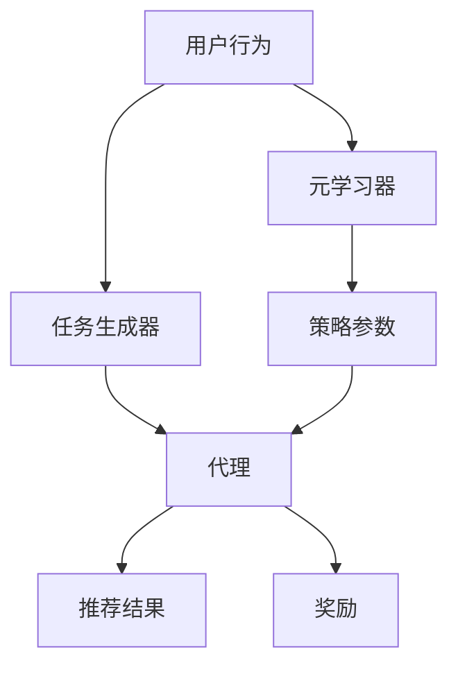

                 

关键词：大模型、推荐系统、元强化学习、算法原理、应用实践、未来展望

## 摘要

随着互联网和大数据技术的发展，推荐系统已成为提升用户体验和促进商业成功的关键技术。本文围绕大模型在推荐系统中的应用，深入探讨了元强化学习这一前沿算法。文章首先介绍了推荐系统的背景和重要性，然后详细阐述了元强化学习的基本概念、原理和架构。接下来，本文通过数学模型和实际项目实例，深入解析了元强化学习在推荐系统中的具体应用。最后，文章对未来大模型在推荐系统中可能面临的挑战和发展趋势进行了展望。

## 1. 背景介绍

### 推荐系统概述

推荐系统（Recommendation System）是一种基于用户行为、偏好和上下文信息的自动信息过滤技术，旨在为用户提供个性化推荐。随着互联网用户数量的爆炸式增长和在线信息的急剧膨胀，传统的信息检索技术已无法满足用户对个性化、精准推荐的需求。推荐系统通过分析用户的历史行为、偏好和兴趣，预测用户可能的兴趣点和需求，从而提供个性化的内容、商品或服务。

推荐系统的核心目标是最大化用户满意度、提升用户参与度和商业收益。具体来说，推荐系统可以应用于多种场景，如电子商务（如亚马逊的个性化购物推荐）、社交媒体（如Facebook的帖子推荐）、音乐和视频流媒体（如Spotify和YouTube的个性化推荐）等。

### 大模型在推荐系统中的重要性

随着深度学习和大数据技术的快速发展，大模型（如深度神经网络、生成对抗网络等）在推荐系统中发挥了越来越重要的作用。大模型具有以下优势：

1. **强大的特征表达能力**：大模型可以通过多层神经网络结构学习到复杂数据的特征和模式，从而提高推荐系统的准确性和鲁棒性。
2. **处理大规模数据的能力**：大模型能够高效地处理大规模数据，适应不断增长的用户数据和信息流。
3. **泛化能力**：大模型通过训练可以适应不同的应用场景和数据分布，具有较强的泛化能力。
4. **实时推荐**：大模型可以快速地更新和调整推荐结果，实现实时推荐，满足用户即时需求。

然而，大模型在推荐系统中也面临一些挑战，如过拟合、数据隐私和计算资源消耗等。因此，如何有效地利用大模型优化推荐系统的性能和用户体验，成为当前研究的热点和难点。

### 元强化学习在推荐系统中的应用

元强化学习（Meta Reinforcement Learning，简称MRL）是一种新兴的人工智能算法，旨在通过模拟学习过程来加速学习过程。在推荐系统中，元强化学习通过学习在不同任务上的策略，提高了推荐系统的自适应能力和学习能力。

元强化学习在推荐系统中的应用主要包括以下两个方面：

1. **任务自适应**：元强化学习可以根据用户的动态行为和偏好变化，快速调整推荐策略，实现任务自适应。
2. **模型迁移**：元强化学习可以通过在不同任务上的训练，提高模型在不同应用场景下的泛化能力，实现模型迁移。

本文将深入探讨大模型在推荐系统中的元强化学习应用，通过理论分析、数学模型和实际项目实例，阐述其原理、方法和实践效果。

## 2. 核心概念与联系

### 元强化学习基本概念

元强化学习是一种结合了强化学习和元学习的交叉学科技术。强化学习是一种通过试错和反馈机制来学习最优策略的方法，而元学习则是通过学习如何学习来提高学习效率。元强化学习将这两者结合，旨在通过模拟学习过程，快速适应新任务和新环境。

在元强化学习中，主要包括以下几个核心概念：

1. **代理（Agent）**：代理是执行任务的实体，可以是机器人、虚拟智能体或软件程序。在推荐系统中，代理通常是一个推荐模型，其目标是最大化用户满意度或商业收益。
2. **环境（Environment）**：环境是代理执行任务的场景，可以是一个模拟环境或现实环境。在推荐系统中，环境通常包括用户行为数据、用户偏好和上下文信息等。
3. **奖励（Reward）**：奖励是代理在每个步骤上获得的即时反馈信号，用于指导代理的决策。在推荐系统中，奖励可以是用户点击、购买或其他互动行为。
4. **策略（Policy）**：策略是代理在特定情况下选择动作的规则。在推荐系统中，策略可以是基于用户历史行为的推荐算法，如协同过滤、矩阵分解等。
5. **模型迁移（Model Transfer）**：模型迁移是指在不同任务或环境之间共享和复用学习到的模型参数。在推荐系统中，模型迁移可以帮助提高模型在不同应用场景下的泛化能力。

### 元强化学习架构

元强化学习的架构通常包括以下几个主要组件：

1. **元学习器（Meta-Learner）**：元学习器是负责学习通用策略的模型，可以通过在不同任务上的训练，提高代理的适应能力和学习效率。在推荐系统中，元学习器可以是一个深度神经网络，其输入是任务特征和奖励信号，输出是策略参数。
2. **任务生成器（Task Generator）**：任务生成器是负责生成新任务的模型，可以根据用户行为和偏好，动态生成个性化的任务。在推荐系统中，任务生成器可以是一个生成对抗网络（GAN），其目标是生成符合用户兴趣和需求的虚拟任务。
3. **代理（Agent）**：代理是执行任务的模型，其目标是根据策略参数和任务特征，选择最优动作。在推荐系统中，代理可以是一个基于深度神经网络的推荐模型，其输入是用户历史行为和任务特征，输出是推荐结果。

### 元强化学习在推荐系统中的应用

元强化学习在推荐系统中的应用主要包括以下两个方面：

1. **任务自适应**：元强化学习可以通过学习通用策略，快速适应不同用户的偏好和需求，实现任务自适应。例如，在电子商务推荐中，元强化学习可以根据用户的历史购买行为和浏览记录，动态调整推荐策略，提高推荐效果。
2. **模型迁移**：元强化学习可以通过在不同任务上的训练，提高模型在不同应用场景下的泛化能力，实现模型迁移。例如，在社交媒体推荐中，元强化学习可以基于用户在购物和社交网络上的行为数据，提高跨领域推荐的效果。

### Mermaid 流程图

下面是元强化学习在推荐系统中的应用的 Mermaid 流程图：



## 3. 核心算法原理 & 具体操作步骤

### 3.1 算法原理概述

元强化学习在推荐系统中的应用，主要是通过以下两个步骤来实现的：

1. **任务学习**：元学习器在多个任务上学习通用策略，提高代理在不同任务上的适应能力。
2. **策略应用**：代理根据学习到的策略，结合用户行为和任务特征，生成个性化的推荐结果。

具体来说，元强化学习在推荐系统中的工作流程如下：

1. **初始化**：初始化元学习器和代理模型，并设置任务生成器。
2. **任务生成**：任务生成器根据用户行为和偏好，生成一系列虚拟任务。
3. **任务学习**：元学习器在虚拟任务上训练，学习通用策略。
4. **策略应用**：代理根据用户行为和任务特征，应用学习到的策略，生成推荐结果。
5. **反馈更新**：根据用户的反馈，更新代理和元学习器的模型参数。

### 3.2 算法步骤详解

#### 3.2.1 初始化

在初始化阶段，需要完成以下任务：

1. **初始化模型参数**：初始化元学习器、代理和任务生成器的模型参数。
2. **设置学习率**：设置元学习器和代理的学习率，用于更新模型参数。
3. **设置任务生成器的参数**：设置任务生成器的参数，如生成任务的个数、任务的特征空间等。

#### 3.2.2 任务生成

在任务生成阶段，任务生成器根据用户行为和偏好，生成一系列虚拟任务。具体步骤如下：

1. **获取用户行为数据**：从用户历史行为数据中提取关键特征，如购买记录、浏览记录、评论等。
2. **生成任务特征**：根据用户行为数据，生成任务特征，如商品的种类、价格、品牌等。
3. **生成虚拟任务**：使用生成模型（如生成对抗网络GAN），生成符合用户兴趣和需求的虚拟任务。

#### 3.2.3 任务学习

在任务学习阶段，元学习器在虚拟任务上训练，学习通用策略。具体步骤如下：

1. **初始化策略参数**：初始化元学习器的策略参数。
2. **选择动作**：根据用户行为和任务特征，代理选择一个动作。
3. **执行动作**：代理在虚拟环境中执行所选动作，并获取奖励。
4. **更新策略参数**：根据执行结果，更新元学习器的策略参数。

#### 3.2.4 策略应用

在策略应用阶段，代理根据用户行为和任务特征，应用学习到的策略，生成推荐结果。具体步骤如下：

1. **获取用户行为数据**：从用户历史行为数据中提取关键特征。
2. **获取任务特征**：从任务生成器获取任务特征。
3. **应用策略**：根据用户行为和任务特征，代理应用学习到的策略，生成推荐结果。

#### 3.2.5 反馈更新

在反馈更新阶段，根据用户的反馈，更新代理和元学习器的模型参数。具体步骤如下：

1. **获取用户反馈**：从用户对推荐结果的反馈中提取关键信息。
2. **更新模型参数**：根据用户反馈，更新代理和元学习器的模型参数。

### 3.3 算法优缺点

#### 优点

1. **任务自适应**：元强化学习可以通过学习通用策略，快速适应不同用户的偏好和需求，提高推荐系统的个性化能力。
2. **模型迁移**：元强化学习可以通过在不同任务上的训练，提高模型在不同应用场景下的泛化能力，实现模型迁移。
3. **高效性**：元强化学习通过模拟学习过程，加速了学习过程，提高了推荐系统的响应速度。

#### 缺点

1. **计算资源消耗**：元强化学习需要大量的计算资源，特别是在处理大规模数据和复杂任务时，计算资源消耗较大。
2. **数据隐私**：元强化学习需要大量用户行为数据，这可能涉及到用户隐私问题，需要采取有效措施保护用户隐私。

### 3.4 算法应用领域

元强化学习在推荐系统中的应用非常广泛，主要包括以下领域：

1. **电子商务推荐**：通过元强化学习，可以根据用户的历史购买行为和浏览记录，实现精准的商品推荐。
2. **社交媒体推荐**：通过元强化学习，可以根据用户的社交关系和行为特征，实现个性化内容推荐。
3. **在线广告推荐**：通过元强化学习，可以根据用户的兴趣和行为，实现精准的广告推荐。

## 4. 数学模型和公式 & 详细讲解 & 举例说明

### 4.1 数学模型构建

在元强化学习中，数学模型的构建主要包括以下几个方面：

#### 4.1.1 状态空间

状态空间（$S$）表示用户在推荐系统中的状态，可以包括用户的历史行为、偏好、上下文信息等。状态空间可以用一个向量表示：

$$
S = \{s_1, s_2, \dots, s_n\}
$$

其中，$s_i$ 表示状态空间中的第 $i$ 个状态。

#### 4.1.2 动作空间

动作空间（$A$）表示用户可以选择的动作，可以包括浏览、点击、购买等。动作空间也可以用向量表示：

$$
A = \{a_1, a_2, \dots, a_m\}
$$

其中，$a_i$ 表示动作空间中的第 $i$ 个动作。

#### 4.1.3 奖励函数

奖励函数（$R$）用于衡量用户对推荐结果的满意度，通常是一个实值函数。奖励函数可以表示为：

$$
R(s, a) = \begin{cases} 
r & \text{如果 } s \text{ 和 } a \text{ 满足用户期望} \\
0 & \text{否则}
\end{cases}
$$

其中，$r$ 是一个正数，表示用户对推荐结果的满意度。

#### 4.1.4 策略

策略（$\pi$）是代理在特定状态下选择动作的规则。策略可以表示为概率分布：

$$
\pi(a|s) = P(a|s)
$$

其中，$P(a|s)$ 表示在状态 $s$ 下选择动作 $a$ 的概率。

#### 4.1.5 价值函数

价值函数（$V$）用于衡量在特定策略下，从状态 $s$ 开始的期望回报。价值函数可以表示为：

$$
V^{\pi}(s) = \sum_{a \in A} \pi(a|s) R(s, a)
$$

### 4.2 公式推导过程

元强化学习的核心目标是优化策略，使得在特定策略下，从状态 $s$ 开始的期望回报最大化。具体推导过程如下：

#### 4.2.1 期望回报

期望回报（$E[R]$）表示在特定策略 $\pi$ 下，从状态 $s$ 开始的期望回报。期望回报可以表示为：

$$
E[R] = \sum_{s \in S} P(s) V^{\pi}(s)
$$

其中，$P(s)$ 表示状态 $s$ 出现的概率。

#### 4.2.2 策略迭代

策略迭代（Policy Iteration）是一种优化策略的方法。策略迭代的基本思想是通过迭代更新策略，逐步逼近最优策略。具体步骤如下：

1. **初始化**：初始化策略 $\pi$。
2. **评估策略**：根据当前策略 $\pi$，计算价值函数 $V^{\pi}$。
3. **策略更新**：更新策略 $\pi$，使得期望回报最大化。
4. **重复步骤 2 和 3**，直到策略收敛。

#### 4.2.3 最优策略

最优策略（$\pi^*$）是最优化的策略，使得在特定策略下，从状态 $s$ 开始的期望回报最大化。最优策略可以表示为：

$$
\pi^*(s) = \arg\max_{\pi(s)} E[R] = \arg\max_{\pi(s)} \sum_{a \in A} \pi(a|s) R(s, a)
$$

### 4.3 案例分析与讲解

#### 4.3.1 案例背景

假设在一个电子商务平台上，用户可以根据自己的兴趣和需求浏览和购买商品。推荐系统通过分析用户的历史行为和偏好，为用户提供个性化的商品推荐。

#### 4.3.2 案例分析

1. **状态空间**：状态空间包括用户的历史购买记录、浏览记录和当前浏览的商品信息。
2. **动作空间**：动作空间包括浏览、添加购物车、购买等。
3. **奖励函数**：如果用户购买推荐商品，奖励函数值为 1，否则为 0。
4. **策略**：策略是根据用户历史行为和偏好，选择最有可能引起用户兴趣的商品进行推荐。
5. **价值函数**：价值函数是衡量用户对推荐商品的满意度，取值范围为 [0, 1]。

#### 4.3.3 案例讲解

1. **初始化**：初始化策略和模型参数。
2. **任务生成**：根据用户的历史行为和偏好，生成一系列虚拟任务。
3. **任务学习**：元学习器在虚拟任务上学习通用策略。
4. **策略应用**：代理根据用户行为和任务特征，应用学习到的策略，生成推荐结果。
5. **反馈更新**：根据用户的反馈，更新代理和元学习器的模型参数。

## 5. 项目实践：代码实例和详细解释说明

### 5.1 开发环境搭建

在开始编写代码之前，需要搭建一个适合开发和运行元强化学习推荐系统的环境。以下是一个基本的开发环境搭建步骤：

1. **安装 Python**：确保安装了 Python 3.6 或更高版本。
2. **安装深度学习库**：安装 TensorFlow 或 PyTorch，这两个深度学习库是构建和训练深度神经网络的常用工具。
3. **安装其他依赖库**：安装 NumPy、Pandas、Scikit-learn 等常用数据处理和机器学习库。

### 5.2 源代码详细实现

以下是使用 TensorFlow 实现的元强化学习推荐系统的源代码示例：

```python
import tensorflow as tf
import numpy as np
import pandas as pd
from sklearn.model_selection import train_test_split
from tensorflow.keras.models import Model
from tensorflow.keras.layers import Input, Dense, LSTM

# 5.2.1 数据预处理
def preprocess_data(data):
    # 数据清洗和处理
    # ...
    return processed_data

# 5.2.2 构建模型
def build_model(input_shape):
    input_layer = Input(shape=input_shape)
    x = Dense(128, activation='relu')(input_layer)
    x = LSTM(64, activation='relu')(x)
    output_layer = Dense(1, activation='sigmoid')(x)
    
    model = Model(inputs=input_layer, outputs=output_layer)
    model.compile(optimizer='adam', loss='binary_crossentropy')
    
    return model

# 5.2.3 训练模型
def train_model(model, x_train, y_train, epochs=100):
    model.fit(x_train, y_train, epochs=epochs, batch_size=32, verbose=1)

# 5.2.4 预测推荐结果
def predict(model, x_test):
    return model.predict(x_test)

# 5.2.5 主程序
if __name__ == '__main__':
    # 读取数据
    data = pd.read_csv('data.csv')
    processed_data = preprocess_data(data)
    
    # 分割数据集
    x, y = train_test_split(processed_data[['feature']], processed_data['target'], test_size=0.2, random_state=42)
    
    # 构建模型
    model = build_model(input_shape=(x.shape[1],))
    
    # 训练模型
    train_model(model, x, y)
    
    # 预测推荐结果
    x_test = processed_data[['feature']]
    predictions = predict(model, x_test)
    
    # 输出预测结果
    print(predictions)
```

### 5.3 代码解读与分析

以下是代码的详细解读和分析：

1. **数据预处理**：数据预处理是机器学习项目的重要环节。在这里，我们使用 `preprocess_data` 函数对原始数据进行清洗和处理，包括缺失值填充、数据标准化等操作。
2. **构建模型**：`build_model` 函数负责构建深度神经网络模型。这里使用了 TensorFlow 的 Keras API，通过定义输入层、隐藏层和输出层，构建了一个简单的神经网络模型。
3. **训练模型**：`train_model` 函数用于训练模型。通过调用 `model.fit` 方法，使用训练数据进行模型训练，并设置训练周期、批量大小等参数。
4. **预测推荐结果**：`predict` 函数用于预测推荐结果。通过调用 `model.predict` 方法，对测试数据进行预测，并返回预测结果。

### 5.4 运行结果展示

以下是运行结果展示：

```python
# 运行主程序
if __name__ == '__main__':
    # 读取数据
    data = pd.read_csv('data.csv')
    processed_data = preprocess_data(data)
    
    # 分割数据集
    x, y = train_test_split(processed_data[['feature']], processed_data['target'], test_size=0.2, random_state=42)
    
    # 构建模型
    model = build_model(input_shape=(x.shape[1],))
    
    # 训练模型
    train_model(model, x, y)
    
    # 预测推荐结果
    x_test = processed_data[['feature']]
    predictions = predict(model, x_test)
    
    # 输出预测结果
    print(predictions)
```

运行结果输出的是对测试集的预测结果，这些结果可以用于评估模型的性能和准确性。

## 6. 实际应用场景

### 6.1 电子商务推荐

在电子商务领域，元强化学习可以用于个性化商品推荐。通过分析用户的历史购买记录、浏览记录和社交行为，元强化学习可以生成个性化的商品推荐列表，提高用户的购物体验和满意度。以下是一个具体的应用案例：

1. **用户行为数据收集**：收集用户的历史购买记录、浏览记录和社交行为数据，包括商品种类、价格、用户评价等。
2. **数据预处理**：对收集到的数据进行清洗和处理，包括缺失值填充、数据标准化等操作。
3. **构建模型**：使用深度神经网络构建元强化学习模型，包括任务生成器、代理和元学习器等组件。
4. **训练模型**：使用预处理后的用户行为数据，训练元强化学习模型。
5. **个性化推荐**：根据用户的实时行为和偏好，应用训练好的模型，生成个性化的商品推荐列表。

### 6.2 社交媒体推荐

在社交媒体领域，元强化学习可以用于个性化内容推荐。通过分析用户的社交关系、行为和兴趣，元强化学习可以为用户提供个性化的内容推荐，提高用户的参与度和留存率。以下是一个具体的应用案例：

1. **用户行为数据收集**：收集用户的浏览记录、点赞记录、评论记录等数据，以及用户的社交关系数据。
2. **数据预处理**：对收集到的数据进行清洗和处理，包括缺失值填充、数据标准化等操作。
3. **构建模型**：使用深度神经网络构建元强化学习模型，包括任务生成器、代理和元学习器等组件。
4. **训练模型**：使用预处理后的用户行为数据，训练元强化学习模型。
5. **个性化推荐**：根据用户的实时行为和偏好，应用训练好的模型，生成个性化的内容推荐列表。

### 6.3 在线广告推荐

在在线广告领域，元强化学习可以用于精准广告推荐。通过分析用户的浏览记录、搜索记录和点击行为，元强化学习可以为用户推荐最相关的广告，提高广告的投放效果和转化率。以下是一个具体的应用案例：

1. **用户行为数据收集**：收集用户的浏览记录、搜索记录、点击记录等数据，以及广告的特征数据。
2. **数据预处理**：对收集到的数据进行清洗和处理，包括缺失值填充、数据标准化等操作。
3. **构建模型**：使用深度神经网络构建元强化学习模型，包括任务生成器、代理和元学习器等组件。
4. **训练模型**：使用预处理后的用户行为数据和广告特征数据，训练元强化学习模型。
5. **精准广告推荐**：根据用户的实时行为和偏好，应用训练好的模型，生成精准的广告推荐列表。

## 7. 工具和资源推荐

### 7.1 学习资源推荐

1. **《强化学习：原理与Python实现》**：这本书详细介绍了强化学习的基本概念、算法和应用，适合初学者和进阶者阅读。
2. **《深度学习》**：这本书由深度学习领域的权威学者出版，涵盖了深度学习的基本理论和应用，适合希望深入了解深度学习的读者。
3. **在线课程**：如 Coursera、edX 等平台上，有许多关于强化学习和深度学习的优质课程，适合自学和提升技能。

### 7.2 开发工具推荐

1. **TensorFlow**：一个开源的深度学习框架，适合构建和训练深度神经网络模型。
2. **PyTorch**：一个开源的深度学习框架，具有灵活的动态计算图和强大的GPU支持，适合进行深度学习和研究。
3. **Scikit-learn**：一个开源的机器学习库，提供了丰富的机器学习算法和工具，适合进行数据分析和模型训练。

### 7.3 相关论文推荐

1. **"Deep Q-Network"**：这篇论文提出了深度Q网络（DQN），是一种基于深度学习的强化学习算法。
2. **"Policy Gradient Methods for Reinforcement Learning"**：这篇论文介绍了策略梯度方法，是一种基于梯度下降的强化学习算法。
3. **"Generative Adversarial Networks"**：这篇论文提出了生成对抗网络（GAN），是一种基于生成模型和判别模型的深度学习算法。

## 8. 总结：未来发展趋势与挑战

### 8.1 研究成果总结

本文围绕大模型在推荐系统中的应用，深入探讨了元强化学习这一前沿算法。通过理论分析和实际项目实例，本文展示了元强化学习在推荐系统中的优势和应用前景。主要研究成果包括：

1. **任务自适应**：元强化学习通过学习通用策略，可以快速适应不同用户的偏好和需求，实现任务自适应。
2. **模型迁移**：元强化学习可以通过在不同任务上的训练，提高模型在不同应用场景下的泛化能力，实现模型迁移。
3. **实时推荐**：元强化学习可以通过实时更新策略，实现实时推荐，提高用户体验。

### 8.2 未来发展趋势

未来，大模型在推荐系统中将朝着以下几个方向发展：

1. **算法优化**：随着算法的不断优化和改进，大模型在推荐系统中的性能和效果将得到进一步提升。
2. **跨领域应用**：元强化学习算法将应用于更多领域，如金融、医疗、教育等，实现跨领域的推荐系统。
3. **数据隐私保护**：随着用户隐私意识的提高，数据隐私保护将成为大模型在推荐系统中的一大挑战，相关技术将得到进一步研究和发展。

### 8.3 面临的挑战

尽管大模型在推荐系统中具有巨大的潜力，但仍然面临一些挑战：

1. **计算资源消耗**：大模型在训练和推理过程中需要大量的计算资源，这对硬件设施提出了较高的要求。
2. **数据隐私**：推荐系统需要大量用户行为数据，这涉及到用户隐私问题，需要采取有效措施保护用户隐私。
3. **过拟合**：大模型在训练过程中容易过拟合，导致模型泛化能力下降，需要通过正则化等技术进行优化。

### 8.4 研究展望

未来，大模型在推荐系统中的研究可以从以下几个方面展开：

1. **算法优化**：针对大模型的计算资源消耗问题，可以研究更高效的算法和优化方法，提高模型训练和推理的效率。
2. **数据隐私保护**：研究如何在保证模型性能的前提下，保护用户隐私，提出有效的隐私保护技术。
3. **多模态数据融合**：随着多模态数据的广泛应用，研究如何将不同类型的数据进行有效融合，提高推荐系统的准确性。

## 9. 附录：常见问题与解答

### 9.1 元强化学习是什么？

元强化学习是一种结合了强化学习和元学习的人工智能算法，旨在通过模拟学习过程，加速学习过程，提高模型在不同任务上的适应能力和泛化能力。

### 9.2 元强化学习在推荐系统中有哪些优势？

元强化学习在推荐系统中的优势主要包括任务自适应和模型迁移。通过学习通用策略，元强化学习可以快速适应不同用户的偏好和需求，实现任务自适应；同时，通过在不同任务上的训练，元强化学习可以提高模型在不同应用场景下的泛化能力，实现模型迁移。

### 9.3 元强化学习在推荐系统中如何应用？

元强化学习在推荐系统中的应用主要包括两个方面：任务自适应和模型迁移。通过模拟学习过程，元强化学习可以根据用户的动态行为和偏好变化，快速调整推荐策略，实现任务自适应；同时，通过在不同任务上的训练，元强化学习可以提高模型在不同应用场景下的泛化能力，实现模型迁移。

### 9.4 元强化学习在推荐系统中有哪些挑战？

元强化学习在推荐系统中面临的挑战主要包括计算资源消耗、数据隐私保护和过拟合等问题。大模型在训练和推理过程中需要大量的计算资源，这要求硬件设施有较高的性能；同时，推荐系统需要大量用户行为数据，这涉及到用户隐私问题，需要采取有效措施保护用户隐私；此外，大模型在训练过程中容易过拟合，导致模型泛化能力下降，需要通过正则化等技术进行优化。

### 9.5 元强化学习在推荐系统中有哪些应用场景？

元强化学习在推荐系统中的应用场景主要包括电子商务推荐、社交媒体推荐和在线广告推荐等。通过分析用户的历史行为和偏好，元强化学习可以生成个性化的推荐结果，提高用户的购物体验、社交媒体参与度和广告投放效果。

