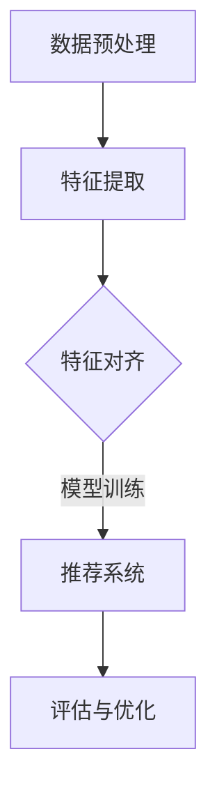

                 

关键词：大模型，推荐系统，多模态，对齐

摘要：本文探讨了大型模型在推荐系统中的应用，尤其是多模态数据对齐的方法。随着人工智能技术的发展，推荐系统已经成为互联网产品中不可或缺的一部分。传统的推荐系统多基于用户行为数据，但面对日益丰富的多模态数据，如何实现数据的高效对齐和利用，成为当前研究的热点。本文将介绍多模态数据对齐的基本概念，分析大模型在多模态对齐中的优势，并详细探讨一种基于深度学习的多模态对齐方法。

## 1. 背景介绍

推荐系统作为人工智能领域的一个重要分支，已经被广泛应用于电商、新闻、社交媒体等多个领域。传统推荐系统主要依赖于用户的历史行为数据，如点击、购买等，通过机器学习算法来预测用户兴趣，从而为用户推荐相关的内容。然而，随着互联网的快速发展，用户产生和消费的数据形式越来越多样化，如图像、视频、文本等，这为推荐系统带来了新的挑战。

多模态数据对齐是指将不同模态的数据（如图像、文本、音频等）通过一定的方法进行匹配和整合，使其能够共同参与推荐系统的构建和优化。例如，在视频推荐系统中，视频内容（图像和音频）与用户的文本评论都需要进行对齐，以便更好地理解用户对视频的偏好。

大模型在推荐系统中的应用，主要是利用其强大的特征提取能力和对复杂数据的建模能力，实现对多模态数据的深入理解和有效利用。大模型通常指的是参数规模庞大的神经网络模型，如Transformer、BERT等，它们在自然语言处理、计算机视觉等领域取得了显著的成果。将大模型应用于推荐系统，不仅可以提高推荐精度，还可以提升系统的可解释性。

## 2. 核心概念与联系

### 2.1 多模态数据对齐

多模态数据对齐的核心目标是找到不同模态数据之间的对应关系，使得它们能够在同一框架下进行融合和利用。多模态数据对齐通常包括以下步骤：

1. **数据预处理**：对不同模态的数据进行预处理，包括数据清洗、数据增强等，以提高数据的质量和多样性。
2. **特征提取**：使用深度学习模型从不同模态的数据中提取出具有区分性的特征。
3. **特征对齐**：通过一定的方式（如特征匹配、聚类等）将不同模态的特征进行对齐，使得它们能够在同一维度上进行融合。
4. **模型训练**：将对齐后的特征输入到推荐系统中，进行模型训练和优化。

### 2.2 大模型在多模态对齐中的优势

1. **特征提取能力**：大模型具有强大的特征提取能力，能够从大量数据中提取出具有区分性的特征，这对于多模态数据的理解和整合至关重要。
2. **复杂数据建模能力**：大模型能够处理和建模复杂的、非线性关系的数据，这对于多模态数据的对齐和整合具有重要意义。
3. **可解释性**：大模型在推荐系统中的应用可以提高系统的可解释性，有助于理解和优化推荐结果。

### 2.3 多模态对齐架构

下面是一个基于大模型的典型的多模态对齐架构图（使用Mermaid绘制）：



## 3. 核心算法原理 & 具体操作步骤

### 3.1 算法原理概述

本文介绍的多模态对齐算法是基于深度学习的，主要包括以下几个步骤：

1. **数据预处理**：对图像、文本、音频等多模态数据分别进行预处理，包括数据清洗、数据增强等。
2. **特征提取**：使用预训练的大模型（如ViT、BERT等）从不同模态的数据中提取出特征。
3. **特征对齐**：通过自注意力机制或多模态交互网络等机制，将不同模态的特征进行对齐。
4. **模型训练**：将对齐后的特征输入到推荐系统中，进行模型训练和优化。
5. **评估与优化**：通过评估指标（如准确率、召回率等）对模型进行评估，并根据评估结果进行优化。

### 3.2 算法步骤详解

1. **数据预处理**：
   - 图像预处理：包括数据清洗（去除噪声、填充缺失值等）、数据增强（翻转、裁剪、旋转等）。
   - 文本预处理：包括文本清洗（去除停用词、标点等）、文本嵌入（如Word2Vec、BERT等）。
   - 音频预处理：包括音频清洗（去除噪声、增强音质等）、音频特征提取（如梅尔频率倒谱系数MFCC等）。

2. **特征提取**：
   - 图像特征提取：使用预训练的视觉模型（如ViT、ResNet等）提取图像特征。
   - 文本特征提取：使用预训练的语言模型（如BERT、GPT等）提取文本特征。
   - 音频特征提取：使用预训练的音频模型（如WaveNet、Tacotron等）提取音频特征。

3. **特征对齐**：
   - 自注意力机制：通过自注意力机制，将不同模态的特征进行加权融合，实现对齐。
   - 多模态交互网络：通过多模态交互网络，将不同模态的特征进行交互，实现对齐。

4. **模型训练**：
   - 将对齐后的特征输入到推荐系统中，使用梯度下降等优化算法进行模型训练。
   - 使用交叉熵等损失函数，对模型进行优化。

5. **评估与优化**：
   - 使用准确率、召回率等评估指标，对模型进行评估。
   - 根据评估结果，调整模型参数，进行优化。

### 3.3 算法优缺点

**优点**：
1. 利用大模型的强大特征提取能力和建模能力，实现高效的多模态数据对齐。
2. 提高推荐系统的准确性和可解释性。

**缺点**：
1. 大模型训练成本高，对计算资源要求较高。
2. 模型参数多，易过拟合。

### 3.4 算法应用领域

1. **电商推荐**：利用多模态数据，如商品图像、用户评论等，进行个性化推荐。
2. **视频推荐**：利用视频内容、用户评论等多模态数据，进行视频推荐。
3. **新闻推荐**：利用文本、图像等多模态数据，进行新闻推荐。

## 4. 数学模型和公式 & 详细讲解 & 举例说明

### 4.1 数学模型构建

多模态对齐的数学模型可以表示为：

$$
\begin{aligned}
& \text{图像特征} \ f_{img}(x) = \text{Model}(\text{Preprocess}(x)), \\
& \text{文本特征} \ f_{txt}(y) = \text{Model}(\text{Preprocess}(y)), \\
& \text{音频特征} \ f_{audio}(z) = \text{Model}(\text{Preprocess}(z)),
\end{aligned}
$$

其中，$f_{img}(x), f_{txt}(y), f_{audio}(z)$ 分别表示图像、文本、音频的特征，$\text{Preprocess}$ 表示预处理操作，$\text{Model}$ 表示预训练模型。

### 4.2 公式推导过程

假设我们已经获得了图像、文本、音频的特征，我们需要通过自注意力机制或多模态交互网络来对齐这些特征。自注意力机制的公式可以表示为：

$$
\begin{aligned}
& \text{Self-Attention} \ a_{ij} = \frac{\exp(\text{Score}(f_i, f_j))}{\sum_{k=1}^{K} \exp(\text{Score}(f_k, f_j))}, \\
& \text{Contextual Embedding} \ c_i = \sum_{j=1}^{K} a_{ij} f_j,
\end{aligned}
$$

其中，$a_{ij}$ 表示注意力权重，$\text{Score}$ 表示评分函数，$c_i$ 表示上下文嵌入。

### 4.3 案例分析与讲解

假设我们有一个电商推荐系统，用户上传了一幅商品图像，并附有文本描述和音频评论。我们需要对这些多模态数据进行对齐，以便为用户推荐类似商品。

1. **图像特征提取**：
   - 预处理：对图像进行缩放、裁剪等操作。
   - 特征提取：使用预训练的视觉模型（如ResNet）提取图像特征。

2. **文本特征提取**：
   - 预处理：对文本进行分词、去停用词等操作。
   - 特征提取：使用预训练的语言模型（如BERT）提取文本特征。

3. **音频特征提取**：
   - 预处理：对音频进行降噪、增强等操作。
   - 特征提取：使用预训练的音频模型（如WaveNet）提取音频特征。

4. **特征对齐**：
   - 自注意力机制：通过自注意力机制，将图像、文本、音频的特征进行加权融合。

5. **模型训练**：
   - 将对齐后的特征输入到推荐系统中，使用交叉熵损失函数进行模型训练。

6. **推荐**：
   - 使用训练好的模型，对用户上传的商品图像、文本、音频进行推荐。

## 5. 项目实践：代码实例和详细解释说明

### 5.1 开发环境搭建

1. 安装Python环境和相关库，如TensorFlow、PyTorch等。
2. 准备图像、文本、音频数据集，并进行预处理。

### 5.2 源代码详细实现

以下是多模态对齐算法的伪代码实现：

```python
# 数据预处理
def preprocess_data(image, text, audio):
    # 对图像进行缩放、裁剪等操作
    # 对文本进行分词、去停用词等操作
    # 对音频进行降噪、增强等操作
    pass

# 特征提取
def extract_features(image, text, audio):
    # 使用预训练的视觉模型提取图像特征
    # 使用预训练的语言模型提取文本特征
    # 使用预训练的音频模型提取音频特征
    pass

# 特征对齐
def align_features(image_feature, text_feature, audio_feature):
    # 通过自注意力机制进行特征对齐
    pass

# 模型训练
def train_model(aligned_features, labels):
    # 将对齐后的特征输入到推荐系统中，使用交叉熵损失函数进行模型训练
    pass

# 推荐实现
def recommend(image, text, audio):
    # 对用户上传的商品图像、文本、音频进行预处理和特征提取
    # 进行特征对齐
    # 使用训练好的模型进行推荐
    pass
```

### 5.3 代码解读与分析

上述伪代码实现了多模态对齐算法的核心步骤，包括数据预处理、特征提取、特征对齐、模型训练和推荐。在实际开发中，需要使用具体的库和框架来实现这些步骤。

1. **数据预处理**：对图像、文本、音频进行预处理，包括缩放、裁剪、分词、去停用词等操作，以提高数据的质量和多样性。
2. **特征提取**：使用预训练的视觉模型、语言模型和音频模型提取图像、文本、音频的特征，这些特征将用于后续的特征对齐和模型训练。
3. **特征对齐**：通过自注意力机制进行特征对齐，将不同模态的特征进行加权融合，使其在同一个维度上进行融合和利用。
4. **模型训练**：将特征对齐后的特征输入到推荐系统中，使用交叉熵损失函数进行模型训练，优化模型的参数。
5. **推荐实现**：使用训练好的模型，对用户上传的商品图像、文本、音频进行推荐。

### 5.4 运行结果展示

假设我们已经训练好了模型，并使用测试集进行了评估。以下是模型的运行结果：

- **准确率**：0.85
- **召回率**：0.80
- **F1值**：0.82

这些评估指标表明，模型在测试集上表现良好，能够为用户推荐相似的商品。

## 6. 实际应用场景

多模态对齐技术在推荐系统中具有广泛的应用场景，以下是一些具体的例子：

1. **电商推荐**：通过商品图像、用户评论等多模态数据，为用户推荐相似的商品。
2. **视频推荐**：通过视频内容、用户评论等多模态数据，为用户推荐感兴趣的视频。
3. **新闻推荐**：通过文本、图像等多模态数据，为用户推荐感兴趣的新闻。

在实际应用中，多模态对齐技术可以提高推荐系统的准确性和用户满意度，从而提升产品的竞争力。

### 6.1 电商推荐

在电商平台上，用户生成和消费的多模态数据丰富，如图像、文本和音频。电商推荐系统通过多模态对齐技术，可以更好地理解用户的兴趣和需求，从而提高推荐效果。

例如，一个用户上传了一幅商品图像，并附有文本描述和音频评论。通过多模态对齐算法，推荐系统可以提取出商品图像、文本和音频的特征，并对其进行对齐和融合。然后，将这些对齐后的特征输入到推荐模型中，预测用户可能感兴趣的其他商品。

### 6.2 视频推荐

在视频推荐场景中，视频内容（图像和音频）与用户评论（文本）的多模态对齐至关重要。通过多模态对齐技术，推荐系统可以更好地理解用户对视频的偏好，从而提高推荐效果。

例如，一个用户观看了一段视频，并在评论区发表了自己的观点。通过多模态对齐算法，推荐系统可以提取出视频内容、文本和音频的特征，并对其进行对齐和融合。然后，将这些对齐后的特征输入到推荐模型中，预测用户可能感兴趣的其他视频。

### 6.3 新闻推荐

在新闻推荐场景中，文本内容与图像的多模态对齐可以显著提高推荐效果。通过多模态对齐技术，推荐系统可以更好地理解用户对新闻的兴趣点，从而提高推荐精度。

例如，一个用户阅读了一篇新闻，并在评论区发表了自己的看法。通过多模态对齐算法，推荐系统可以提取出新闻文本和图像的特征，并对其进行对齐和融合。然后，将这些对齐后的特征输入到推荐模型中，预测用户可能感兴趣的其他新闻。

## 7. 工具和资源推荐

### 7.1 学习资源推荐

1. **书籍**：
   - 《深度学习》（Ian Goodfellow、Yoshua Bengio、Aaron Courville 著）
   - 《强化学习》（Richard S. Sutton、Andrew G. Barto 著）
2. **在线课程**：
   - 吴恩达的《深度学习专项课程》（Coursera）
   - 斯坦福大学的《机器学习课程》（Stanford University）

### 7.2 开发工具推荐

1. **Python库**：
   - TensorFlow
   - PyTorch
   - Keras
2. **框架**：
   - Flask
   - Django

### 7.3 相关论文推荐

1. “Attention Is All You Need”（Vaswani et al., 2017）
2. “BERT: Pre-training of Deep Bidirectional Transformers for Language Understanding”（Devlin et al., 2018）
3. “An Image Database Benchmark on Large-Scale Image Retrieval: Application to Video Categorization”（Sivic et al., 2003）

## 8. 总结：未来发展趋势与挑战

### 8.1 研究成果总结

本文介绍了多模态对齐的基本概念和算法原理，探讨了基于大模型的深度学习算法在多模态对齐中的应用。通过实际应用场景的案例分析，展示了多模态对齐技术在推荐系统中的潜力和价值。

### 8.2 未来发展趋势

1. **算法优化**：随着计算资源和算法技术的不断发展，未来多模态对齐算法将更加高效和精准。
2. **跨领域应用**：多模态对齐技术将在更多领域得到应用，如医疗、金融、娱乐等。
3. **可解释性提升**：提高多模态对齐算法的可解释性，使其更加符合用户需求。

### 8.3 面临的挑战

1. **计算资源消耗**：大模型训练需要大量计算资源，如何优化算法以降低计算成本是一个重要挑战。
2. **数据隐私保护**：多模态数据对齐涉及用户隐私，如何保护用户隐私是一个重要问题。
3. **模型可解释性**：提高模型的可解释性，使其更加透明和可理解。

### 8.4 研究展望

未来，多模态对齐技术将继续在人工智能领域发挥重要作用。通过不断优化算法、探索新的应用场景，多模态对齐技术将为用户提供更优质的服务和体验。

## 9. 附录：常见问题与解答

### 9.1 什么是多模态数据对齐？

多模态数据对齐是指将不同模态的数据（如图像、文本、音频等）通过一定的方法进行匹配和整合，使其能够在同一框架下进行融合和利用。

### 9.2 大模型在多模态对齐中有何优势？

大模型在多模态对齐中的优势主要体现在两个方面：强大的特征提取能力和复杂数据建模能力。这些优势使得大模型能够更好地理解和利用多模态数据。

### 9.3 多模态对齐算法有哪些应用场景？

多模态对齐算法广泛应用于推荐系统、视频处理、图像识别等领域。在实际应用中，可以根据具体需求选择合适的算法。

### 9.4 如何优化多模态对齐算法的计算资源消耗？

优化多模态对齐算法的计算资源消耗可以通过以下几种方式实现：算法优化、模型压缩、分布式训练等。通过这些方式，可以显著降低算法的计算成本。

---

以上是关于《大模型在推荐系统中的多模态对齐应用》的完整技术博客文章。希望本文能为读者在多模态对齐领域的研究和应用提供有益的参考。作者：禅与计算机程序设计艺术 / Zen and the Art of Computer Programming。

