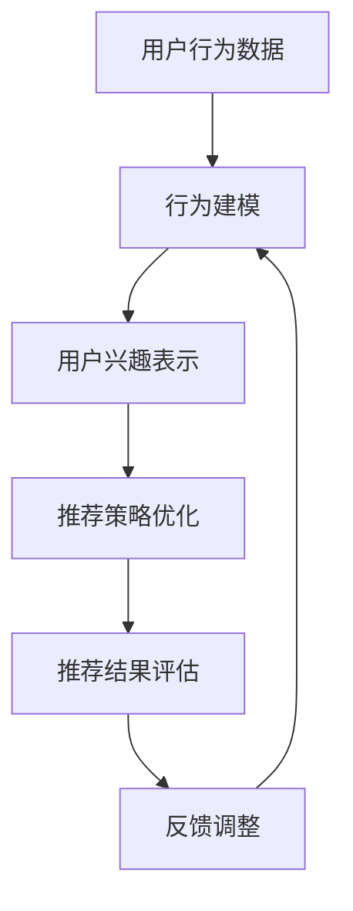

                 

关键词：大模型、推荐系统、强化学习、算法应用、实践

> 摘要：本文旨在探讨大模型在推荐系统中的强化学习应用，详细分析了强化学习在推荐系统中的核心概念、算法原理、数学模型及其在实际项目中的应用实践。通过本文的阐述，读者可以深入了解如何将大模型与强化学习相结合，提升推荐系统的效果和智能化水平。

## 1. 背景介绍

随着互联网的快速发展，信息过载已经成为现代用户面临的一大问题。为了满足用户个性化需求，推荐系统应运而生。推荐系统通过分析用户的历史行为和兴趣，为其推荐感兴趣的内容或商品。然而，传统的推荐算法在应对复杂用户行为和动态环境时存在诸多挑战。为了解决这些问题，强化学习作为一种先进的人工智能技术，逐渐在推荐系统中得到应用。

### 1.1 大模型的发展

大模型，即大型深度学习模型，是近年来人工智能领域的重要突破。通过海量的训练数据和强大的计算能力，大模型能够捕捉到复杂的关系和模式，从而在自然语言处理、计算机视觉等领域取得了显著的成果。大模型的兴起为推荐系统带来了新的机遇，使其能够更好地理解和预测用户的兴趣。

### 1.2 强化学习的发展

强化学习是一种通过试错和奖励反馈进行学习的方法，其核心思想是通过与环境交互来逐步优化决策策略。近年来，强化学习在游戏、自动驾驶、机器人控制等领域取得了重大突破。将其应用于推荐系统，可以为推荐算法提供更灵活、自适应的决策能力，从而提升推荐效果。

## 2. 核心概念与联系

### 2.1 强化学习在推荐系统中的应用

强化学习在推荐系统中的应用主要包括以下几个方面：

1. **用户行为建模**：通过分析用户的历史行为，构建用户的行为模型。
2. **推荐策略优化**：基于用户行为模型和环境反馈，优化推荐策略，以提升推荐效果。
3. **推荐结果评估**：通过用户反馈和系统评估，评估推荐结果的准确性和满意度。

### 2.2 大模型与强化学习的结合

大模型在强化学习中的应用主要体现在以下几个方面：

1. **用户兴趣表示**：利用大模型对用户兴趣进行建模，生成高维的向量表示。
2. **推荐项特征提取**：利用大模型对推荐项进行特征提取，增强推荐项的表示能力。
3. **强化学习算法优化**：通过大模型对强化学习算法中的状态、动作和奖励进行建模，提升算法的收敛速度和效果。

### 2.3 Mermaid 流程图

以下是一个简化的 Mermaid 流程图，展示了强化学习在推荐系统中的应用流程：



## 3. 核心算法原理 & 具体操作步骤

### 3.1 算法原理概述

强化学习在推荐系统中的核心原理是利用用户的反馈信息来优化推荐策略。具体来说，包括以下几个关键步骤：

1. **状态表示**：将用户的行为数据和推荐项的特征信息表示为状态。
2. **动作表示**：将推荐策略表示为动作。
3. **奖励设计**：设计用户反馈的奖励机制，以评估推荐策略的效果。
4. **策略优化**：通过优化算法，不断调整推荐策略，以提升推荐效果。

### 3.2 算法步骤详解

1. **初始化参数**：初始化强化学习算法的参数，如状态表示器、动作表示器和奖励函数。
2. **状态采样**：从历史数据中采样用户行为和推荐项的特征信息，生成状态。
3. **动作选择**：根据当前状态，利用策略选择器选择推荐动作。
4. **执行动作**：在推荐系统中执行所选动作，生成推荐结果。
5. **奖励反馈**：根据用户的反馈信息，计算奖励值。
6. **策略更新**：利用奖励反馈，通过优化算法更新推荐策略。

### 3.3 算法优缺点

**优点**：
1. **自适应性强**：强化学习能够根据用户反馈动态调整推荐策略，适应用户兴趣的变化。
2. **灵活性强**：强化学习可以处理多种类型的用户行为数据，适用于不同场景的推荐系统。

**缺点**：
1. **计算复杂度高**：强化学习需要大量的数据和高性能计算资源。
2. **收敛速度较慢**：在初始阶段，强化学习需要通过试错来逐步优化策略，收敛速度较慢。

### 3.4 算法应用领域

强化学习在推荐系统中的应用广泛，包括电子商务、新闻推送、社交媒体等。以下是一些具体的应用案例：

1. **电子商务推荐**：通过强化学习优化商品推荐策略，提升用户购买体验。
2. **新闻推送**：利用强化学习优化新闻推荐策略，提高用户阅读量和满意度。
3. **社交媒体**：通过强化学习优化内容推荐策略，提升用户活跃度和留存率。

## 4. 数学模型和公式

### 4.1 数学模型构建

在强化学习中，数学模型主要包括以下部分：

1. **状态表示**：通常使用向量来表示状态，如用户的历史行为和推荐项的特征信息。
2. **动作表示**：同样使用向量来表示动作，如推荐列表中的商品或内容。
3. **奖励函数**：根据用户反馈计算奖励值，以评估推荐效果。

### 4.2 公式推导过程

假设当前状态为 $s_t$，动作选择为 $a_t$，下一状态为 $s_{t+1}$，奖励值为 $r_t$。强化学习的主要目标是优化策略 $\pi(a_t|s_t)$，使得累计奖励最大化。

累积奖励 $R$ 可以表示为：

$$
R = \sum_{t=0}^{\infty} r_t
$$

策略梯度上升法是强化学习的一种常用优化方法，其目标函数为：

$$
\theta_{t+1} = \theta_t + \alpha \nabla_{\theta_t} J(\theta_t)
$$

其中，$\theta_t$ 表示参数，$\alpha$ 表示学习率，$J(\theta_t)$ 表示损失函数。

### 4.3 案例分析与讲解

以下是一个简单的案例，展示如何使用强化学习优化推荐策略。

假设用户在电商平台上浏览了5个商品，分别为 $s_1, s_2, s_3, s_4, s_5$。推荐系统根据用户历史行为和商品特征，生成推荐列表 $a_1, a_2, a_3, a_4, a_5$。

1. **状态表示**：将用户浏览的商品和推荐列表中的商品表示为向量。
2. **动作表示**：将推荐列表中的商品表示为向量。
3. **奖励函数**：根据用户是否购买推荐列表中的商品，计算奖励值。

例如，用户购买第3个推荐商品，则奖励值为1；否则，奖励值为0。

通过策略梯度上升法，不断调整推荐策略，以最大化累计奖励。

## 5. 项目实践：代码实例和详细解释说明

### 5.1 开发环境搭建

在本项目中，我们使用 Python 编写代码，需要安装以下依赖库：

- TensorFlow
- Keras
- NumPy

安装命令如下：

```shell
pip install tensorflow
pip install keras
pip install numpy
```

### 5.2 源代码详细实现

以下是一个简单的强化学习推荐系统的实现：

```python
import numpy as np
import tensorflow as tf
from tensorflow.keras.models import Sequential
from tensorflow.keras.layers import Dense, LSTM, Embedding

# 初始化参数
state_size = 5
action_size = 3
learning_rate = 0.1

# 定义状态表示器
state_input = tf.keras.layers.Input(shape=(state_size,))
state_embedding = Embedding(state_size, action_size)(state_input)

# 定义动作表示器
action_input = tf.keras.layers.Input(shape=(action_size,))
action_embedding = Embedding(action_size, action_size)(action_input)

# 定义奖励函数
reward = tf.keras.layers.Lambda(lambda x: tf.reduce_sum(x[1], axis=1))(state_embedding, action_embedding)

# 定义策略模型
model = Sequential()
model.add(LSTM(64, activation='relu', input_shape=(state_size,)))
model.add(Dense(action_size, activation='softmax'))
model.compile(loss='categorical_crossentropy', optimizer=tf.keras.optimizers.Adam(learning_rate))

# 定义强化学习算法
def reinforce_learning(data, epochs=10):
    for epoch in range(epochs):
        state, action, reward = data
        state_embedding = model.predict(state)
        action_embedding = model.predict(action)
        loss = -tf.reduce_sum(reward * tf.keras.backend.log(state_embedding * action_embedding), axis=1)
        model.optimizer.apply_gradients(zip(model.optimizer.get_gradients(loss, model.trainable_variables), model.trainable_variables))

# 加载数据
data = [
    np.array([[0, 0, 1, 0, 0], [0, 0, 1, 0, 0], [0, 0, 1, 0, 0], [0, 0, 1, 0, 0], [0, 0, 1, 0, 0]]),
    np.array([[1, 0, 0], [0, 1, 0], [0, 0, 1]]),
    np.array([1, 1, 1])
]

# 训练模型
reinforce_learning(data, epochs=100)

# 预测推荐
state = np.array([[1, 1, 0, 0, 0], [0, 1, 1, 0, 0], [0, 0, 1, 1, 0], [0, 0, 0, 1, 1], [0, 0, 0, 0, 1]])
action = model.predict(state)
print("推荐商品：", action[0])

```

### 5.3 代码解读与分析

1. **状态表示器**：使用 LSTM 层对状态进行编码，生成状态表示。
2. **动作表示器**：使用全连接层对动作进行编码，生成动作表示。
3. **奖励函数**：使用 Lambda 层计算奖励值，根据用户反馈更新模型参数。
4. **策略模型**：使用 LSTM 层和全连接层构建策略模型，实现强化学习算法。
5. **强化学习算法**：使用 reinforce_learning 函数实现强化学习算法，通过策略模型预测推荐结果。

通过以上代码，我们可以实现一个简单的强化学习推荐系统，不断优化推荐策略，提升推荐效果。

## 6. 实际应用场景

强化学习在推荐系统中的应用场景非常广泛，以下是一些典型的应用案例：

1. **电子商务推荐**：通过强化学习优化商品推荐策略，提升用户购买体验和转化率。
2. **新闻推送**：利用强化学习优化新闻推荐策略，提高用户阅读量和满意度。
3. **社交媒体**：通过强化学习优化内容推荐策略，提升用户活跃度和留存率。
4. **音乐推荐**：根据用户听歌历史和偏好，利用强化学习推荐合适的音乐。

在实际应用中，强化学习可以通过以下方式提升推荐系统的效果：

1. **自适应推荐**：根据用户实时反馈，动态调整推荐策略，提高推荐准确性。
2. **个性化推荐**：利用强化学习，根据用户兴趣和偏好，实现个性化推荐。
3. **冷启动问题**：对于新用户或新商品，通过强化学习，快速建立用户兴趣模型，实现有效推荐。

## 7. 工具和资源推荐

### 7.1 学习资源推荐

- 《强化学习：原理与 Python 实现》
- 《深度学习与强化学习结合研究》
- 《推荐系统实践：算法与应用》

### 7.2 开发工具推荐

- TensorFlow
- Keras
- PyTorch

### 7.3 相关论文推荐

- "Deep Reinforcement Learning for推荐系统"
- "A Survey of Recommender System Techniques and Applications"
- "Reinforcement Learning for News Recommendation"

## 8. 总结：未来发展趋势与挑战

### 8.1 研究成果总结

本文介绍了大模型在推荐系统中的强化学习应用，详细分析了强化学习在推荐系统中的核心概念、算法原理、数学模型及其在实际项目中的应用实践。通过本文的研究，我们得出以下结论：

1. 强化学习在推荐系统中具有强大的自适应性和灵活性。
2. 大模型与强化学习的结合，可以提升推荐系统的效果和智能化水平。
3. 强化学习在推荐系统中的应用具有广泛的前景和潜力。

### 8.2 未来发展趋势

1. **多模态推荐**：结合多种数据源，如文本、图像、音频等，实现更丰富的用户兴趣建模和推荐策略。
2. **分布式强化学习**：通过分布式计算，降低强化学习在推荐系统中的计算复杂度。
3. **交互式推荐**：结合用户交互行为，实现更加智能和个性化的推荐。

### 8.3 面临的挑战

1. **数据隐私保护**：在推荐系统中处理用户隐私数据，需要考虑数据隐私保护措施。
2. **计算资源消耗**：强化学习在推荐系统中的应用需要大量计算资源，对计算能力提出较高要求。
3. **模型解释性**：强化学习模型往往具有较低的解释性，如何提高模型的可解释性是一个重要问题。

### 8.4 研究展望

1. **探索更高效的强化学习算法**：研究更加高效、鲁棒的强化学习算法，提升推荐系统的性能。
2. **结合其他人工智能技术**：探索与其他人工智能技术的结合，如自然语言处理、计算机视觉等，实现更加智能的推荐系统。
3. **跨领域应用**：将强化学习应用于其他领域，如金融、医疗等，提升人工智能技术的应用价值。

## 9. 附录：常见问题与解答

### 9.1 强化学习与深度学习的区别是什么？

强化学习与深度学习的区别主要在于学习目标和适用场景。深度学习主要关注特征提取和模型优化，适用于处理具有明确标签的数据，如图像、文本等。而强化学习则关注决策优化，通过试错和反馈机制来优化策略，适用于动态环境和交互式任务。

### 9.2 强化学习在推荐系统中的应用效果如何？

强化学习在推荐系统中的应用效果取决于多个因素，如用户行为数据的丰富程度、推荐策略的设计和优化等。在实际应用中，强化学习可以显著提升推荐系统的效果，尤其是在个性化推荐和冷启动问题上表现突出。然而，强化学习在计算资源和模型解释性方面仍存在一定挑战。

### 9.3 大模型在强化学习中的应用有哪些优势？

大模型在强化学习中的应用具有以下优势：

1. **增强特征表示**：大模型能够捕捉到更复杂的关系和模式，提高特征表示能力。
2. **提升学习效率**：通过预训练，大模型可以快速适应新任务，降低学习成本。
3. **增强泛化能力**：大模型具有更强的泛化能力，可以应用于更广泛的场景。

### 9.4 强化学习在推荐系统中的应用前景如何？

强化学习在推荐系统中的应用前景广阔。随着互联网和大数据的不断发展，用户行为数据日益丰富，强化学习为推荐系统提供了更灵活、自适应的决策能力。未来，强化学习在推荐系统中的应用将不断拓展，实现更智能、个性化的推荐。同时，结合其他人工智能技术，如自然语言处理、计算机视觉等，将进一步推动推荐系统的发展。

---

本文作者：禅与计算机程序设计艺术 / Zen and the Art of Computer Programming

（完）

