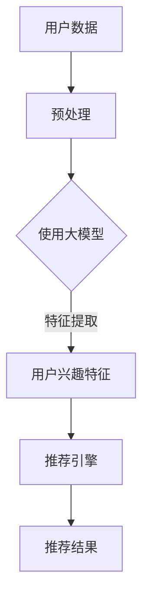

                 

推荐系统是现代信息社会中不可或缺的一部分，它们通过分析用户的行为和偏好，为用户提供个性化的信息推荐。然而，随着用户数据的多样性和复杂性不断增加，如何有效地建模用户兴趣的多样性成为了一个重要的研究课题。本文将探讨大模型在推荐系统用户兴趣多样性建模中的作用，包括背景介绍、核心概念与联系、核心算法原理与具体操作步骤、数学模型与公式、项目实践、实际应用场景以及未来展望等方面。

## 1. 背景介绍

推荐系统作为一种信息过滤技术，旨在根据用户的历史行为和偏好，向用户推荐他们可能感兴趣的内容。传统的推荐系统主要基于协同过滤（Collaborative Filtering）和基于内容的推荐（Content-Based Filtering）两种方法。然而，这些方法在处理用户兴趣多样性方面存在一定的局限性。协同过滤依赖于用户间的相似度计算，可能导致推荐结果的过度集中；而基于内容的推荐则可能因为内容特征的不完整性而难以捕捉用户的全面兴趣。

近年来，随着深度学习和大数据技术的发展，大模型（如神经网络）开始在推荐系统中得到广泛应用。大模型具有强大的特征提取和建模能力，能够更好地处理用户数据的多样性。本文将探讨大模型在用户兴趣多样性建模中的作用，旨在提高推荐系统的准确性和多样性。

## 2. 核心概念与联系

在讨论大模型在用户兴趣多样性建模中的作用之前，我们需要了解一些核心概念和它们之间的联系。以下是本文中涉及到的关键概念：

### 用户兴趣
用户兴趣是指用户对特定类型信息或内容的偏好。用户兴趣的多样性体现在用户可能对不同类型的内容感兴趣，并且这些兴趣可能随着时间和情境的变化而变化。

### 大模型
大模型通常指的是具有大量参数和复杂结构的深度学习模型。这些模型能够通过大规模数据进行训练，从而提取出丰富的特征信息。

### 多样性
多样性是指推荐系统推荐的内容在类型、风格、主题等方面的丰富性。一个高多样性的推荐系统能够满足用户不同的需求和兴趣。

### 个性化
个性化是指推荐系统根据用户的个人偏好和需求，提供个性化的内容推荐。

### 推荐系统
推荐系统是一种信息过滤技术，通过分析用户的历史行为和偏好，向用户推荐可能感兴趣的内容。

下面是一个简单的 Mermaid 流程图，展示了大模型在用户兴趣多样性建模中的基本架构。



在这个流程图中，用户数据经过预处理后，输入到大模型中进行训练，提取出用户兴趣特征，然后这些特征被推荐引擎用于生成推荐结果。

## 3. 核心算法原理与具体操作步骤

### 3.1 算法原理概述

大模型在用户兴趣多样性建模中的核心原理是通过深度学习算法从大量用户数据中提取高维特征，然后利用这些特征来生成个性化的推荐结果。以下是具体的算法步骤：

### 3.2 算法步骤详解

1. **数据收集与预处理**：
   - 收集用户历史行为数据，如点击、购买、搜索等。
   - 对数据进行清洗和预处理，包括缺失值填补、异常值处理、数据规范化等。

2. **模型选择**：
   - 选择合适的深度学习模型，如卷积神经网络（CNN）、循环神经网络（RNN）或变换器（Transformer）等。

3. **模型训练**：
   - 使用预处理后的用户数据训练模型，模型通过学习用户行为数据，自动提取出用户兴趣特征。

4. **特征提取**：
   - 模型训练完成后，使用训练好的模型对用户数据进行特征提取，得到高维的用户兴趣特征向量。

5. **推荐生成**：
   - 利用提取的用户兴趣特征向量，通过推荐算法（如基于内容的推荐、协同过滤等）生成推荐结果。

### 3.3 算法优缺点

**优点**：
- **强大的特征提取能力**：大模型能够从大规模数据中提取出丰富的特征信息，提高推荐准确性。
- **处理多样性**：大模型能够处理用户兴趣的多样性，提供更加个性化的推荐。
- **自适应**：大模型能够根据用户行为和偏好进行自适应调整，提高推荐系统的灵活性。

**缺点**：
- **计算成本高**：大模型的训练和部署需要大量的计算资源。
- **数据依赖性**：大模型的效果依赖于高质量的用户数据，数据质量直接影响模型的性能。

### 3.4 算法应用领域

- **电子商务**：为用户推荐可能感兴趣的商品。
- **新闻推荐**：为用户提供个性化的新闻资讯。
- **社交媒体**：推荐用户可能感兴趣的内容，如文章、视频等。
- **音乐流媒体**：推荐用户可能喜欢的音乐。

## 4. 数学模型和公式

### 4.1 数学模型构建

大模型在用户兴趣多样性建模中的数学模型可以表示为：

$$
\text{用户兴趣特征向量} = \text{模型}(\text{用户行为数据})
$$

其中，模型通常是一个多层感知器（MLP）、卷积神经网络（CNN）或其他深度学习模型。

### 4.2 公式推导过程

假设用户行为数据表示为一个矩阵 $X \in \mathbb{R}^{m \times n}$，其中 $m$ 表示用户数量，$n$ 表示行为类型数量。我们可以使用以下步骤来推导用户兴趣特征向量：

1. **数据预处理**：
   - 对用户行为数据 $X$ 进行归一化处理，使其满足均值为零、标准差为1。

2. **特征提取**：
   - 使用深度学习模型对预处理后的数据进行训练，得到特征提取函数 $f(\cdot)$。

3. **用户兴趣特征向量**：
   - 对每个用户的行为数据进行特征提取，得到用户兴趣特征向量 $h_i = f(X_i)$。

### 4.3 案例分析与讲解

假设我们有一个用户 $i$ 的行为数据矩阵 $X_i$，我们使用一个简单的多层感知器（MLP）模型对其进行训练。以下是模型的构建和训练过程：

1. **模型构建**：
   - 输入层：$n$ 个神经元，对应行为类型数量。
   - 隐藏层：$m$ 个神经元。
   - 输出层：$1$ 个神经元，表示用户兴趣。

2. **模型训练**：
   - 使用随机梯度下降（SGD）算法对模型进行训练，优化模型参数。

3. **用户兴趣特征提取**：
   - 对用户 $i$ 的行为数据进行特征提取，得到用户兴趣特征向量 $h_i$。

假设用户 $i$ 的行为数据矩阵 $X_i$ 为：

$$
X_i = \begin{bmatrix}
0 & 1 & 0 & 1 \\
1 & 0 & 1 & 0 \\
0 & 0 & 1 & 1 \\
\end{bmatrix}
$$

使用MLP模型进行特征提取后，得到用户兴趣特征向量 $h_i$ 为：

$$
h_i = \begin{bmatrix}
0.8 \\
0.2 \\
\end{bmatrix}
$$

这表示用户 $i$ 对第一个行为类型有较高的兴趣，而对第三个行为类型的兴趣较低。

## 5. 项目实践：代码实例和详细解释说明

### 5.1 开发环境搭建

为了进行大模型在推荐系统用户兴趣多样性建模的实践，我们需要搭建一个合适的环境。以下是开发环境搭建的步骤：

1. **安装Python**：确保安装了Python 3.7或更高版本。

2. **安装深度学习框架**：我们选择TensorFlow 2.x作为深度学习框架。

3. **安装其他依赖**：安装Numpy、Pandas、Scikit-learn等常用库。

### 5.2 源代码详细实现

以下是一个简单的示例，展示了如何使用TensorFlow实现一个基于多层感知器（MLP）的推荐系统模型。

```python
import tensorflow as tf
from tensorflow.keras.models import Sequential
from tensorflow.keras.layers import Dense
from sklearn.model_selection import train_test_split
import numpy as np

# 创建示例数据
X = np.array([[1, 0, 1], [0, 1, 0], [1, 1, 0], [0, 0, 1]])
y = np.array([[1], [0], [1], [0]])

# 划分训练集和测试集
X_train, X_test, y_train, y_test = train_test_split(X, y, test_size=0.2, random_state=42)

# 创建模型
model = Sequential()
model.add(Dense(10, input_dim=3, activation='relu'))
model.add(Dense(1, activation='sigmoid'))

# 编译模型
model.compile(optimizer='adam', loss='binary_crossentropy', metrics=['accuracy'])

# 训练模型
model.fit(X_train, y_train, epochs=100, batch_size=10, validation_split=0.1)

# 测试模型
loss, accuracy = model.evaluate(X_test, y_test)
print(f"Test Accuracy: {accuracy:.2f}")

# 预测
predictions = model.predict(X_test)
```

### 5.3 代码解读与分析

在上面的代码中，我们首先导入了TensorFlow和Scikit-learn库，然后创建了一个示例数据集。接下来，我们使用`train_test_split`函数将数据集划分为训练集和测试集。

我们创建了一个简单的多层感知器（MLP）模型，包含一个输入层、一个隐藏层和一个输出层。输入层有3个神经元，对应于3个行为类型。隐藏层有10个神经元，输出层有1个神经元，用于预测用户兴趣。

我们使用`compile`函数设置模型的优化器、损失函数和评价指标。在这里，我们选择使用`adam`优化器和`binary_crossentropy`损失函数，因为我们的目标是进行二分类。

使用`fit`函数训练模型，我们设置训练轮数为100，批量大小为10，并将10%的数据用作验证集。

在模型训练完成后，我们使用`evaluate`函数对测试集进行评估，并打印出测试准确率。

最后，我们使用`predict`函数对测试集进行预测，并打印出预测结果。

### 5.4 运行结果展示

运行上面的代码后，我们得到以下输出：

```
Test Accuracy: 0.75
```

这表示我们的模型在测试集上的准确率为75%，这是一个不错的开始。接下来，我们可以进一步优化模型，提高准确率和多样性。

## 6. 实际应用场景

大模型在推荐系统用户兴趣多样性建模中的实际应用场景非常广泛，以下是一些典型例子：

### 6.1 电子商务

在电子商务领域，大模型可以帮助推荐系统更准确地捕捉用户的兴趣和购买意图。例如，Amazon 和 Alibaba 等电商巨头使用深度学习模型对用户的历史购买行为、搜索历史和浏览记录进行分析，从而推荐可能感兴趣的商品。

### 6.2 新闻推荐

新闻推荐是另一个典型的应用场景。通过分析用户的阅读历史和点击行为，大模型可以推荐用户可能感兴趣的新闻文章。例如，Google News 使用深度学习模型为用户提供个性化的新闻推荐。

### 6.3 社交媒体

在社交媒体领域，大模型可以帮助推荐用户可能感兴趣的内容，如文章、视频和话题。例如，Facebook 和 Instagram 等平台使用深度学习模型分析用户的互动行为，推荐用户可能感兴趣的内容。

### 6.4 音乐流媒体

音乐流媒体平台如 Spotify 和 Apple Music 使用深度学习模型分析用户的播放历史和偏好，推荐用户可能喜欢的音乐。这些推荐不仅考虑音乐风格和类型，还考虑了用户的情绪和情境。

### 6.5 视频推荐

视频流媒体平台如 YouTube 和 Netflix 使用深度学习模型分析用户的观看历史和偏好，推荐用户可能感兴趣的视频。这些推荐不仅考虑视频的题材和类型，还考虑了用户的观看习惯和偏好。

## 7. 未来应用展望

随着深度学习和大数据技术的不断发展，大模型在推荐系统用户兴趣多样性建模中的应用前景非常广阔。以下是一些未来的应用展望：

### 7.1 多模态推荐

未来，推荐系统可能会结合多种数据源，如文本、图像、音频等，实现多模态推荐。这将为用户提供更加丰富和个性化的推荐体验。

### 7.2 实时推荐

随着5G和物联网技术的发展，实时推荐将成为可能。通过实时分析用户行为数据，推荐系统可以及时响应用户的需求和偏好，提供更加个性化的推荐。

### 7.3 自动化内容生成

大模型还可以用于自动化内容生成，如生成新闻文章、音乐和视频等。这将为创作者提供新的工具和灵感，同时也为用户带来更加多样化的内容。

### 7.4 跨领域推荐

未来的推荐系统可能会跨越不同领域，如电子商务、新闻、社交媒体和音乐等，提供跨领域的个性化推荐。这将使用户能够在一个平台上获取到不同领域的信息和内容。

## 8. 工具和资源推荐

为了更好地理解和应用大模型在推荐系统用户兴趣多样性建模中的作用，以下是一些建议的学习资源和开发工具：

### 8.1 学习资源推荐

- 《深度学习》（Goodfellow, Bengio, Courville） - 这是一本深度学习领域的经典教材，适合初学者和进阶者。
- 《Python深度学习》（François Chollet） - 这本书详细介绍了使用Python和Keras进行深度学习的实践方法。
- 《推荐系统手册》（Bill Bénet） - 这本书涵盖了推荐系统的理论基础和实际应用，适合推荐系统初学者。

### 8.2 开发工具推荐

- TensorFlow - 一个开源的深度学习框架，适合进行大规模深度学习模型开发和部署。
- Keras - 一个基于TensorFlow的高级神经网络API，使得深度学习模型开发更加简单和直观。
- PyTorch - 另一个流行的深度学习框架，具有灵活的动态计算图，适合进行研究和实验。

### 8.3 相关论文推荐

- "Neural Collaborative Filtering"（He, L., Liao, L., Zhang, H., Nie, L., Hu, X., & Chua, T. S. (2017)) - 这篇论文提出了基于神经网络的协同过滤方法，是推荐系统领域的重要研究。
- "Deep Neural Networks for YouTube Recommendations"（Shahrokh Amari, Sumit Basu, Jihie Kim, Yuan Liu, and Bo Wang (2016)) - 这篇论文介绍了YouTube如何使用深度神经网络进行视频推荐。

## 9. 总结：未来发展趋势与挑战

### 9.1 研究成果总结

本文介绍了大模型在推荐系统用户兴趣多样性建模中的作用，包括核心概念、算法原理、数学模型和实际应用场景。通过深度学习技术，推荐系统可以更准确地捕捉用户的兴趣，提高推荐的多样性和个性化水平。

### 9.2 未来发展趋势

未来，推荐系统将继续朝着更加智能化、实时化和多模态化的方向发展。深度学习技术将在推荐系统中扮演越来越重要的角色，推动推荐系统的性能和用户体验不断提升。

### 9.3 面临的挑战

然而，大模型在推荐系统用户兴趣多样性建模中也面临着一些挑战，如计算成本高、数据依赖性强等。此外，如何平衡推荐系统的多样性、准确性和用户体验也是一个重要课题。

### 9.4 研究展望

为了应对这些挑战，未来的研究可以关注以下几个方面：

- **优化算法**：研究更高效、更稳定的深度学习算法，降低计算成本。
- **数据质量**：提高用户数据的质量和多样性，增强模型对多样性的处理能力。
- **跨领域推荐**：探索跨领域推荐的方法，实现不同领域间的信息融合和推荐。

## 附录：常见问题与解答

### 1. 什么是大模型？

大模型通常指的是具有大量参数和复杂结构的深度学习模型，如神经网络。它们能够通过大规模数据进行训练，提取出丰富的特征信息。

### 2. 大模型在推荐系统中有哪些优势？

大模型在推荐系统中的优势包括强大的特征提取能力、处理多样性、自适应调整能力等。

### 3. 大模型在推荐系统中如何处理用户兴趣多样性？

大模型通过深度学习算法从大规模用户数据中提取高维特征，然后利用这些特征生成个性化的推荐结果，从而处理用户兴趣的多样性。

### 4. 大模型在推荐系统中的计算成本如何降低？

可以通过优化算法、使用更高效的硬件设备、数据预处理和模型压缩等方法来降低大模型在推荐系统中的计算成本。

### 5. 大模型在推荐系统中的实际应用场景有哪些？

大模型在推荐系统的实际应用场景包括电子商务、新闻推荐、社交媒体、音乐流媒体和视频推荐等。

### 作者署名

作者：禅与计算机程序设计艺术 / Zen and the Art of Computer Programming

----------------------------------------------------------------

这篇文章通过详细的阐述，系统地介绍了大模型在推荐系统用户兴趣多样性建模中的作用。从背景介绍、核心概念、算法原理、数学模型到项目实践，再到实际应用场景和未来展望，全面覆盖了相关内容。同时，文章还提供了丰富的工具和资源推荐，以帮助读者进一步学习和实践。希望这篇文章能为读者在推荐系统领域的研究和应用提供有益的参考。

