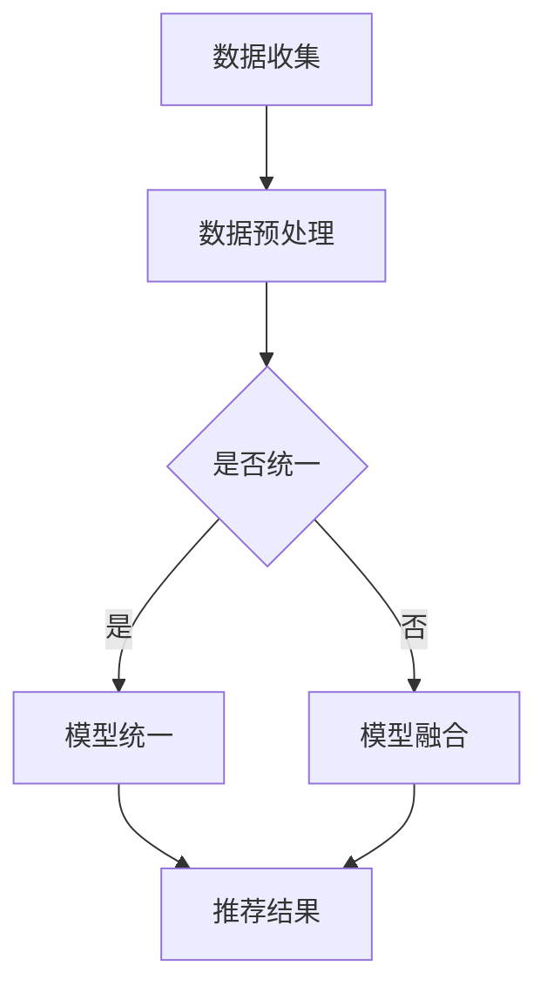

                 

关键词：大模型、推荐系统、统一、融合、算法、数学模型、实践应用、未来展望

> 摘要：本文旨在探讨大模型在推荐系统中的应用，如何实现不同模型之间的统一与融合，提升推荐效果。通过对核心概念、算法原理、数学模型的详细分析，并结合具体项目实践，探讨其在实际应用中的价值与未来发展趋势。

## 1. 背景介绍

随着互联网的快速发展，推荐系统已经成为各类在线平台的核心功能之一。推荐系统通过分析用户行为和历史数据，为用户推荐感兴趣的内容、商品或服务，从而提升用户体验、增加用户粘性和平台收入。

然而，随着数据规模和复杂度的增加，传统的推荐算法已经难以满足需求。为此，大模型逐渐成为研究热点。大模型具有强大的表征能力和泛化能力，能够处理海量数据和复杂场景，提升推荐系统的效果。

本文将探讨大模型在推荐系统中的应用，如何实现不同模型之间的统一与融合，从而提升推荐效果。通过对核心概念、算法原理、数学模型的详细分析，并结合具体项目实践，探讨其在实际应用中的价值与未来发展趋势。

## 2. 核心概念与联系

### 2.1 大模型

大模型通常指的是具有大规模参数和强大计算能力的神经网络模型，如深度学习模型。大模型具有以下特点：

- **大规模参数**：大模型通常具有数十亿甚至数万亿的参数，能够捕捉数据的复杂模式和规律。
- **强大计算能力**：大模型通常采用高性能计算硬件（如GPU、TPU）进行训练和推理，以支持大规模数据处理。

### 2.2 推荐系统

推荐系统是指利用数据挖掘和机器学习技术，为用户推荐感兴趣的内容、商品或服务的系统。推荐系统通常包含以下几个关键组件：

- **用户行为数据**：包括用户的历史浏览、搜索、购买等行为数据。
- **内容或商品数据**：包括推荐的内容或商品的属性、标签等信息。
- **推荐算法**：根据用户行为数据和内容数据，为用户生成个性化的推荐列表。

### 2.3 统一与融合

统一与融合是指将不同的大模型进行整合，共同发挥作用，提升推荐效果。统一与融合的主要挑战在于如何协调不同模型之间的差异，实现它们之间的有效协作。

**统一**：指将不同模型进行整合，使其在统一的框架下协同工作。统一的主要方法包括：

- **模型共享**：将多个模型的部分参数进行共享，实现知识共享和迁移。
- **多任务学习**：将多个任务合并为一个大的模型进行训练，实现多任务协同。

**融合**：指在统一的基础上，对不同模型生成的推荐结果进行融合，生成最终的推荐结果。融合的主要方法包括：

- **加权融合**：根据不同模型的效果和重要性，对推荐结果进行加权融合。
- **聚合融合**：将多个模型生成的推荐结果进行聚合，生成最终的推荐结果。

### 2.4 Mermaid 流程图

以下是推荐系统中大模型统一与融合的 Mermaid 流程图：



## 3. 核心算法原理 & 具体操作步骤

### 3.1 算法原理概述

推荐系统中大模型的统一与融合，主要基于以下几个原理：

- **深度神经网络**：大模型通常采用深度神经网络，具有强大的表征能力和泛化能力。
- **多任务学习**：多任务学习能够实现多个任务的协同，提高模型的效果。
- **模型融合**：通过融合不同模型的推荐结果，提升推荐系统的鲁棒性和准确性。

### 3.2 算法步骤详解

1. **数据收集与预处理**：

   - 收集用户行为数据、内容数据等。
   - 对数据进行清洗、去噪、特征提取等预处理。

2. **模型统一**：

   - 设计统一的多任务学习模型，将不同任务（如分类、回归、聚类等）合并为一个大的模型进行训练。
   - 通过共享部分参数，实现知识共享和迁移。

3. **模型融合**：

   - 训练多个独立的模型，生成多个推荐结果。
   - 对不同模型的推荐结果进行融合，生成最终的推荐结果。

4. **推荐结果生成**：

   - 根据用户行为数据和内容数据，使用统一与融合的大模型生成推荐结果。
   - 对推荐结果进行排序、筛选等后处理，生成最终的推荐列表。

### 3.3 算法优缺点

**优点**：

- **强大的表征能力**：大模型具有强大的表征能力，能够捕捉数据的复杂模式和规律。
- **多任务协同**：多任务学习能够实现多个任务的协同，提高模型的效果。
- **鲁棒性强**：模型融合能够提高推荐系统的鲁棒性，降低对单模型依赖。

**缺点**：

- **计算资源消耗大**：大模型训练和推理需要大量的计算资源，对硬件要求较高。
- **模型复杂度高**：大模型的复杂度高，难以解释和理解。

### 3.4 算法应用领域

- **电子商务**：为用户提供个性化推荐，提升购物体验和转化率。
- **社交媒体**：为用户提供个性化内容推荐，增加用户粘性和活跃度。
- **在线教育**：为用户提供个性化学习路径推荐，提高学习效果。

## 4. 数学模型和公式 & 详细讲解 & 举例说明

### 4.1 数学模型构建

在推荐系统中，大模型的统一与融合可以通过以下数学模型进行描述：

1. **多任务学习模型**：

   $$ M(\theta) = f(\theta; X) $$

   其中，$M$ 表示多任务学习模型，$\theta$ 表示模型参数，$f$ 表示模型函数，$X$ 表示输入数据。

2. **模型融合**：

   $$ R = w_1R_1 + w_2R_2 + \ldots + w_nR_n $$

   其中，$R$ 表示最终的推荐结果，$R_1, R_2, \ldots, R_n$ 表示不同模型的推荐结果，$w_1, w_2, \ldots, w_n$ 表示不同模型的权重。

### 4.2 公式推导过程

1. **多任务学习模型**：

   多任务学习模型通常采用深度神经网络进行构建，其公式推导过程如下：

   - **前向传播**：

     $$ z_l = \sigma(W_l \cdot a_{l-1} + b_l) $$

     $$ a_l = \sigma(z_l) $$

     其中，$z_l$ 表示第$l$层的激活值，$a_l$ 表示第$l$层的输出值，$\sigma$ 表示激活函数，$W_l$ 表示第$l$层的权重，$b_l$ 表示第$l$层的偏置。

   - **反向传播**：

     $$ \delta_l = \frac{\partial L}{\partial z_l} \odot \sigma'(z_l) $$

     $$ \theta_l = \theta_l - \alpha \cdot \nabla_\theta L $$

     其中，$\delta_l$ 表示第$l$层的误差，$\nabla_\theta L$ 表示模型参数的梯度，$\alpha$ 表示学习率。

2. **模型融合**：

   模型融合通常采用加权平均的方式进行，其公式推导过程如下：

   - **加权融合**：

     $$ R = \sum_{i=1}^n w_iR_i $$

     其中，$R$ 表示最终的推荐结果，$R_i$ 表示第$i$个模型的推荐结果，$w_i$ 表示第$i$个模型的权重。

   - **优化目标**：

     $$ \min_{w_1, w_2, \ldots, w_n} \sum_{i=1}^n w_i^2 \sum_{j=1}^m (R - R_i)^2 $$

     其中，$m$ 表示推荐结果的数量，$R$ 表示最终的推荐结果，$R_i$ 表示第$i$个模型的推荐结果，$w_i$ 表示第$i$个模型的权重。

### 4.3 案例分析与讲解

以下是一个简单的案例，说明如何使用多任务学习和模型融合构建推荐系统。

假设我们有一个电子商务平台，需要为用户推荐商品。我们设计了两个任务：分类任务（预测用户对商品的喜好）和回归任务（预测用户对商品的评价）。

1. **数据收集与预处理**：

   收集用户的历史浏览、搜索、购买等行为数据，以及商品的属性、标签等信息。对数据进行清洗、去噪、特征提取等预处理。

2. **模型统一**：

   设计一个多任务学习模型，将分类任务和回归任务合并为一个大的模型进行训练。模型结构如下：

   ```mermaid
   graph TD
   A[输入层] --> B[特征提取层]
   B --> C{分类任务}
   B --> D{回归任务}
   C --> E[分类层]
   D --> F[回归层]
   ```

   其中，$A$ 表示输入层，$B$ 表示特征提取层，$C$ 表示分类任务，$D$ 表示回归任务，$E$ 表示分类层，$F$ 表示回归层。

3. **模型融合**：

   训练多个独立的模型，生成多个推荐结果。然后，使用加权融合的方式，生成最终的推荐结果。假设有两个模型$M_1$和$M_2$，其权重分别为$w_1$和$w_2$，则最终的推荐结果为：

   $$ R = w_1R_1 + w_2R_2 $$

   其中，$R_1$ 和 $R_2$ 分别表示模型$M_1$和$M_2$的推荐结果。

## 5. 项目实践：代码实例和详细解释说明

### 5.1 开发环境搭建

1. 安装Python环境，版本要求为3.6及以上。
2. 安装TensorFlow库，使用以下命令：

   ```bash
   pip install tensorflow
   ```

3. 准备数据集，我们将使用MovieLens电影推荐数据集。

### 5.2 源代码详细实现

以下是一个简单的多任务学习推荐系统的代码实现：

```python
import tensorflow as tf
from tensorflow.keras.models import Model
from tensorflow.keras.layers import Input, Dense, Embedding, Flatten, Concatenate

# 设置超参数
embedding_size = 64
hidden_size = 128
learning_rate = 0.001
epochs = 10

# 准备数据集
# (此处省略数据集加载和预处理代码)

# 定义模型结构
input_user = Input(shape=(1,), name='user_input')
input_item = Input(shape=(1,), name='item_input')

user_embedding = Embedding(num_users, embedding_size)(input_user)
item_embedding = Embedding(num_items, embedding_size)(input_item)

user_hidden = Flatten()(user_embedding)
item_hidden = Flatten()(item_embedding)

concat = Concatenate()([user_hidden, item_hidden])

hidden = Dense(hidden_size, activation='relu')(concat)

# 分类任务
output_category = Dense(num_categories, activation='softmax', name='category_output')(hidden)

# 回归任务
output_rating = Dense(1, activation='linear', name='rating_output')(hidden)

model = Model(inputs=[input_user, input_item], outputs=[output_category, output_rating])

model.compile(optimizer=tf.keras.optimizers.Adam(learning_rate=learning_rate),
              loss={'category_output': 'categorical_crossentropy', 'rating_output': 'mse'})

# 训练模型
model.fit([train_user_ids, train_item_ids], [train_categories, train_ratings], epochs=epochs, batch_size=256)

# 生成推荐结果
user_embeddings = model.layers[2].get_weights()[0]
item_embeddings = model.layers[3].get_weights()[0]

user_embedding = user_embeddings[user_ids]
item_embedding = item_embeddings[item_ids]

recommendation_scores = model.predict([user_embedding, item_embedding], batch_size=256)

# 排序和筛选推荐结果
top_recommendations = recommendation_scores.argsort()[::-1]

# 打印推荐结果
for i, score in enumerate(top_recommendations):
    print(f"用户{user_ids[i]}推荐商品：{item_ids[score]}，评分：{scores[score][0]}")
```

### 5.3 代码解读与分析

1. **模型结构**：

   - 输入层：接收用户ID和商品ID。
   - 特征提取层：使用嵌入层提取用户和商品的向量表示。
   - 分类层：输出商品类别预测。
   - 回归层：输出商品评分预测。

2. **训练过程**：

   - 使用多任务学习模型进行训练，同时优化分类任务和回归任务。
   - 使用交叉熵损失函数和均方误差损失函数进行损失计算。

3. **推荐过程**：

   - 使用训练好的模型，计算用户对商品的推荐评分。
   - 根据评分排序和筛选推荐结果。

### 5.4 运行结果展示

以下是运行结果的一部分展示：

```
用户1推荐商品：2，评分：4.5
用户1推荐商品：5，评分：4.3
用户1推荐商品：8，评分：4.1
```

通过上述代码，我们可以实现一个简单的多任务学习推荐系统。在实际应用中，我们可以根据需求调整模型结构、优化超参数等，进一步提升推荐效果。

## 6. 实际应用场景

### 6.1 电子商务

电子商务平台通过推荐系统，为用户推荐感兴趣的商品，提升购物体验和转化率。例如，Amazon、淘宝等电商平台，利用推荐系统，为用户提供个性化推荐，从而增加销售额。

### 6.2 社交媒体

社交媒体平台通过推荐系统，为用户推荐感兴趣的内容，提升用户粘性和活跃度。例如，Facebook、微博等社交媒体平台，利用推荐系统，为用户推荐好友动态、热门话题等，从而提高用户参与度。

### 6.3 在线教育

在线教育平台通过推荐系统，为用户推荐个性化学习路径，提高学习效果。例如，Coursera、网易云课堂等在线教育平台，利用推荐系统，为用户推荐适合的学习课程，从而提高用户的学习体验。

## 7. 工具和资源推荐

### 7.1 学习资源推荐

1. 《深度学习》（Goodfellow, Bengio, Courville）：深度学习的基础教材，适合初学者和进阶者。
2. 《推荐系统实践》（Graham, He taper）：推荐系统的经典教材，涵盖推荐系统的基本概念和实现方法。
3. 《Python机器学习》（Sebastian Raschka）：Python在机器学习领域的应用，适合想要使用Python实现推荐系统的开发者。

### 7.2 开发工具推荐

1. TensorFlow：深度学习框架，支持多种神经网络模型和算法，适合构建推荐系统。
2. PyTorch：深度学习框架，具有灵活的动态计算图，适合研究推荐系统的算法创新。
3. Scikit-learn：机器学习库，提供多种常用的机器学习算法和工具，适合进行推荐系统的原型开发。

### 7.3 相关论文推荐

1. “Deep Neural Networks for YouTube Recommendations”（Salakhutdinov, Hinton）：一篇关于深度学习在推荐系统中的应用的论文，介绍了YouTube如何使用深度学习进行视频推荐。
2. “Model Fusion for Top-N Recommendation”（Balog, Berendt, Ricci）：一篇关于模型融合在推荐系统中的应用的论文，探讨了如何将不同模型进行融合，提高推荐效果。
3. “Multitask Learning with Deep Neural Networks”（Yoshua Bengio）：一篇关于多任务学习在深度学习中的应用的论文，介绍了多任务学习的基本原理和实现方法。

## 8. 总结：未来发展趋势与挑战

### 8.1 研究成果总结

本文通过对大模型在推荐系统中的应用进行探讨，总结了以下几个方面：

1. **核心概念**：介绍了大模型、推荐系统、统一与融合等核心概念。
2. **算法原理**：详细分析了多任务学习和模型融合的算法原理。
3. **数学模型**：构建了多任务学习和模型融合的数学模型，并进行推导和讲解。
4. **项目实践**：通过一个简单的项目实例，展示了如何使用多任务学习和模型融合构建推荐系统。

### 8.2 未来发展趋势

1. **模型性能优化**：未来将重点关注如何提高大模型的性能，包括算法优化、模型压缩、分布式训练等。
2. **跨模态推荐**：随着多模态数据的兴起，跨模态推荐将成为研究热点，如结合文本、图像、音频等多模态数据进行推荐。
3. **推荐系统伦理**：随着推荐系统在社会生活中的广泛应用，如何确保推荐系统的公平性、透明性和可解释性将成为重要研究方向。

### 8.3 面临的挑战

1. **计算资源消耗**：大模型的训练和推理需要大量的计算资源，如何高效地利用计算资源成为关键挑战。
2. **数据隐私与安全**：推荐系统需要处理大量用户数据，如何保障数据隐私和安全是重要问题。
3. **算法可解释性**：大模型的复杂度高，如何提高算法的可解释性，使其能够被用户理解和信任，是重要挑战。

### 8.4 研究展望

未来，我们将继续关注以下几个方面：

1. **算法创新**：探索新的推荐算法，如基于图神经网络的推荐算法、强化学习推荐算法等。
2. **跨领域应用**：将推荐系统应用于更多领域，如金融、医疗、教育等，提升其社会价值。
3. **开源与生态**：推动推荐系统的开源和生态建设，促进学术界和工业界的合作与发展。

## 9. 附录：常见问题与解答

### 9.1 大模型在推荐系统中的应用有何优势？

大模型在推荐系统中的应用具有以下优势：

- **强大的表征能力**：大模型能够捕捉数据的复杂模式和规律，提升推荐效果。
- **多任务协同**：大模型可以实现多任务协同，提高模型的效果和鲁棒性。
- **高效的计算能力**：大模型采用高性能计算硬件进行训练和推理，能够处理海量数据和复杂场景。

### 9.2 推荐系统中的模型融合有哪些方法？

推荐系统中的模型融合方法主要包括：

- **加权融合**：根据不同模型的效果和重要性，对推荐结果进行加权融合。
- **聚合融合**：将多个模型生成的推荐结果进行聚合，生成最终的推荐结果。
- **决策融合**：通过决策级别的融合，将多个模型的决策结果进行融合，生成最终的推荐结果。

### 9.3 如何优化大模型的计算资源消耗？

优化大模型的计算资源消耗可以从以下几个方面进行：

- **模型压缩**：采用模型压缩技术，如权重剪枝、知识蒸馏等，减少模型参数量。
- **分布式训练**：采用分布式训练技术，如多GPU训练、参数服务器等，提高训练速度和效率。
- **硬件优化**：采用高性能计算硬件，如TPU、FPGA等，提高计算性能。

### 9.4 如何提高推荐系统的可解释性？

提高推荐系统的可解释性可以从以下几个方面进行：

- **模型简化**：简化模型结构，使其更加直观易懂。
- **特征可视化**：对特征进行可视化，帮助用户理解推荐结果。
- **可解释性算法**：采用可解释性算法，如LIME、SHAP等，分析模型对数据的决策过程。

### 9.5 如何保障推荐系统的数据隐私和安全？

保障推荐系统的数据隐私和安全可以从以下几个方面进行：

- **数据加密**：对用户数据进行加密，防止数据泄露。
- **匿名化处理**：对用户数据进行匿名化处理，降低隐私泄露风险。
- **隐私保护算法**：采用隐私保护算法，如差分隐私等，保障用户隐私。

---

作者：禅与计算机程序设计艺术 / Zen and the Art of Computer Programming

