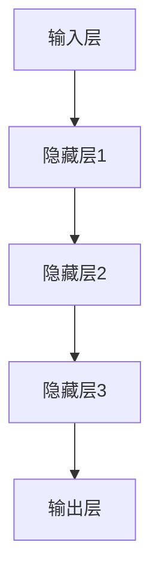

                 

关键词：大模型、教育技术、人工智能、教学优化、个性化学习、学习评估、教育创新、教育数据分析

> 摘要：随着人工智能技术的迅猛发展，大模型在教育领域的应用日益广泛，本文将探讨大模型在教育中的具体应用案例，分析其对教学优化、个性化学习、学习评估等方面的影响，并展望大模型在未来教育发展中的潜力与挑战。

## 1. 背景介绍

近年来，人工智能技术在教育领域的应用逐渐深入，其中大模型（如深度学习模型、自然语言处理模型等）的引入为教育创新提供了新的契机。大模型具有强大的数据处理和分析能力，能够从海量教育数据中提取有用信息，进而为教学决策提供支持。此外，大模型在教育领域的应用不仅限于传统的教学场景，还涵盖了学习评估、个性化学习等多个方面。

本文将围绕大模型在教育领域的具体应用案例展开，旨在分析其优势、不足以及未来发展方向。文章将分为以下几个部分：

- 背景介绍：阐述大模型在教育领域的背景和重要性。
- 核心概念与联系：介绍大模型的基本原理和架构。
- 核心算法原理 & 具体操作步骤：详细解读大模型的核心算法和操作步骤。
- 数学模型和公式 & 详细讲解 & 举例说明：讲解大模型背后的数学模型和公式。
- 项目实践：提供大模型在教育领域的实际应用案例和代码实现。
- 实际应用场景：分析大模型在不同教育场景中的应用。
- 未来应用展望：探讨大模型在教育领域的未来发展趋势和挑战。

## 2. 核心概念与联系

### 2.1. 大模型的基本概念

大模型（Large Models）通常指的是具有大规模参数和计算能力的机器学习模型。这些模型通过大量的数据训练，能够实现高度复杂和自动化的特征提取、模式识别和决策生成。大模型广泛应用于自然语言处理（NLP）、计算机视觉（CV）、推荐系统（RS）等多个领域。在教育领域，大模型可以用于教学内容的生成、个性化学习、学习评估等方面。

### 2.2. 大模型的架构

大模型的架构通常包括以下几个层次：

1. **输入层**：接收用户输入的数据，如文本、图像、语音等。
2. **隐藏层**：通过复杂的神经网络结构对输入数据进行特征提取和变换。
3. **输出层**：生成模型的预测结果，如分类、回归、生成等。

以下是一个简单的Mermaid流程图，展示大模型的基本架构：



### 2.3. 大模型在教育中的应用

大模型在教育中的应用主要包括以下几个方面：

1. **个性化学习**：通过分析学生的学习行为和成绩数据，为每个学生提供个性化的学习路径和资源。
2. **教学辅助**：利用大模型生成教学内容、练习题和评估试卷，提高教学效果。
3. **学习评估**：通过分析学生的学习数据和表现，对学习效果进行评估和反馈。
4. **课程推荐**：根据学生的学习兴趣和需求，推荐相关的课程和学习资源。

## 3. 核心算法原理 & 具体操作步骤

### 3.1. 算法原理概述

大模型在教育领域的核心算法主要涉及深度学习、自然语言处理和推荐系统等。以下将简要介绍这些算法的基本原理。

#### 3.1.1. 深度学习

深度学习是一种基于多层神经网络的机器学习算法，通过逐层提取和转换特征，实现复杂的模式识别和决策生成。深度学习模型的核心是神经网络，包括输入层、隐藏层和输出层。

#### 3.1.2. 自然语言处理

自然语言处理是一种处理和理解人类语言的技术，包括文本分类、情感分析、问答系统等。自然语言处理的核心是词向量表示和序列模型。

#### 3.1.3. 推荐系统

推荐系统是一种基于用户行为和兴趣的数据挖掘技术，通过分析用户的兴趣和需求，推荐相关的商品、课程或内容。推荐系统的核心是协同过滤和基于内容的推荐。

### 3.2. 算法步骤详解

#### 3.2.1. 深度学习

深度学习的基本步骤包括：

1. **数据预处理**：清洗和预处理数据，如去噪、归一化、填充缺失值等。
2. **模型构建**：定义神经网络结构，包括输入层、隐藏层和输出层。
3. **模型训练**：使用训练数据对模型进行训练，优化模型参数。
4. **模型评估**：使用验证集和测试集对模型进行评估，调整模型参数。
5. **模型部署**：将训练好的模型部署到实际应用中，如个性化学习平台。

#### 3.2.2. 自然语言处理

自然语言处理的基本步骤包括：

1. **文本预处理**：清洗和预处理文本数据，如分词、去停用词、词性标注等。
2. **词向量表示**：将文本转化为向量表示，如Word2Vec、BERT等。
3. **模型训练**：使用训练数据对模型进行训练，优化模型参数。
4. **模型评估**：使用验证集和测试集对模型进行评估，调整模型参数。
5. **模型部署**：将训练好的模型部署到实际应用中，如智能问答系统。

#### 3.2.3. 推荐系统

推荐系统的基本步骤包括：

1. **用户行为数据收集**：收集用户的历史行为数据，如浏览、购买、评价等。
2. **数据预处理**：清洗和预处理用户行为数据，如去噪、归一化、填充缺失值等。
3. **模型构建**：定义推荐系统的模型，如协同过滤、基于内容的推荐等。
4. **模型训练**：使用训练数据对模型进行训练，优化模型参数。
5. **模型评估**：使用验证集和测试集对模型进行评估，调整模型参数。
6. **模型部署**：将训练好的模型部署到实际应用中，如在线课程推荐系统。

### 3.3. 算法优缺点

#### 3.3.1. 深度学习

优点：

- 强大的特征提取和模式识别能力。
- 能够自动学习复杂的非线性关系。

缺点：

- 对数据质量和数量要求较高。
- 模型训练过程需要大量计算资源和时间。

#### 3.3.2. 自然语言处理

优点：

- 能够处理和理解人类语言。
- 在文本分类、情感分析等领域有广泛应用。

缺点：

- 对文本数据的质量和多样性要求较高。
- 需要大量的预训练数据和计算资源。

#### 3.3.3. 推荐系统

优点：

- 能够根据用户兴趣和行为推荐相关内容。
- 提高用户满意度和粘性。

缺点：

- 需要大量的用户行为数据。
- 可能会导致用户过度依赖推荐内容。

### 3.4. 算法应用领域

深度学习、自然语言处理和推荐系统在教育领域的应用包括：

- 个性化学习：通过分析学生的学习行为和成绩数据，为每个学生提供个性化的学习路径和资源。
- 教学辅助：利用大模型生成教学内容、练习题和评估试卷，提高教学效果。
- 学习评估：通过分析学生的学习数据和表现，对学习效果进行评估和反馈。
- 课程推荐：根据学生的学习兴趣和需求，推荐相关的课程和学习资源。

## 4. 数学模型和公式 & 详细讲解 & 举例说明

### 4.1. 数学模型构建

大模型在教育领域中的应用涉及到多种数学模型，以下将简要介绍其中的几种：

#### 4.1.1. 多层感知机（MLP）

多层感知机是一种基于神经网络的机器学习模型，用于分类和回归任务。其数学模型可以表示为：

$$
y = \sigma(W_3 \cdot \sigma(W_2 \cdot \sigma(W_1 \cdot x + b_1) + b_2) + b_3)
$$

其中，$W_1, W_2, W_3$ 分别为输入层、隐藏层和输出层的权重矩阵，$b_1, b_2, b_3$ 分别为对应的偏置项，$\sigma$ 表示激活函数，如ReLU、Sigmoid、Tanh等。

#### 4.1.2. 循环神经网络（RNN）

循环神经网络是一种处理序列数据的神经网络，其数学模型可以表示为：

$$
h_t = \sigma(W_h \cdot [h_{t-1}, x_t] + b_h)
$$

$$
y_t = \sigma(W_y \cdot h_t + b_y)
$$

其中，$h_t$ 表示第 $t$ 个时间步的隐藏状态，$x_t$ 表示第 $t$ 个输入，$W_h, W_y$ 分别为隐藏层和输出层的权重矩阵，$b_h, b_y$ 分别为对应的偏置项，$\sigma$ 表示激活函数。

#### 4.1.3. 生成对抗网络（GAN）

生成对抗网络是一种无监督学习模型，用于生成高质量的图像和文本。其数学模型可以表示为：

$$
G(z) = \mu(z) \odot \sigma(z)
$$

$$
D(x) = \sigma(D(x))
$$

$$
D(G(z)) = \sigma(D(G(z)))
$$

其中，$G(z)$ 为生成器，$D(x)$ 为判别器，$z$ 为噪声向量，$\mu(z)$ 和 $\sigma(z)$ 分别为生成器的均值和方差函数，$D(x)$ 为判别器的输出，$\odot$ 表示元素乘法，$\sigma$ 表示激活函数。

### 4.2. 公式推导过程

以下将简要介绍多层感知机（MLP）的推导过程：

#### 4.2.1. 前向传播

多层感知机的前向传播过程可以表示为：

$$
z_1 = W_1 \cdot x + b_1
$$

$$
a_1 = \sigma(z_1)
$$

$$
z_2 = W_2 \cdot a_1 + b_2
$$

$$
a_2 = \sigma(z_2)
$$

$$
z_3 = W_3 \cdot a_2 + b_3
$$

$$
y = \sigma(z_3)
$$

其中，$z_1, z_2, z_3$ 分别为输入层、隐藏层和输出层的输出，$a_1, a_2, a_3$ 分别为对应的激活值，$W_1, W_2, W_3$ 分别为输入层、隐藏层和输出层的权重矩阵，$b_1, b_2, b_3$ 分别为对应的偏置项，$\sigma$ 表示激活函数。

#### 4.2.2. 反向传播

多层感知机的反向传播过程可以表示为：

$$
\delta_3 = (y - \hat{y}) \cdot \sigma'(z_3)
$$

$$
\delta_2 = (W_3 \cdot \delta_3) \cdot \sigma'(z_2)
$$

$$
\delta_1 = (W_2 \cdot \delta_2) \cdot \sigma'(z_1)
$$

$$
\frac{\partial L}{\partial W_3} = a_2^T \cdot \delta_3
$$

$$
\frac{\partial L}{\partial W_2} = a_1^T \cdot \delta_2
$$

$$
\frac{\partial L}{\partial W_1} = x^T \cdot \delta_1
$$

$$
\frac{\partial L}{\partial b_3} = \delta_3
$$

$$
\frac{\partial L}{\partial b_2} = \delta_2
$$

$$
\frac{\partial L}{\partial b_1} = \delta_1
$$

其中，$\delta_1, \delta_2, \delta_3$ 分别为输入层、隐藏层和输出层的误差，$\sigma'$ 表示激活函数的导数，$L$ 表示损失函数，$\hat{y}$ 表示预测值，$y$ 表示真实值。

### 4.3. 案例分析与讲解

以下将结合一个简单的例子，分析多层感知机（MLP）在分类任务中的应用。

#### 4.3.1. 数据集

假设我们有一个包含100个样本的二分类数据集，每个样本包含10个特征，标签为0或1。

#### 4.3.2. 模型构建

我们构建一个包含一个输入层、一个隐藏层和一个输出层的多层感知机模型，隐藏层包含10个神经元。

#### 4.3.3. 模型训练

使用训练数据对模型进行训练，优化模型参数。训练过程包括前向传播、损失函数计算、反向传播和参数更新。

#### 4.3.4. 模型评估

使用验证集和测试集对模型进行评估，计算准确率、召回率、F1值等指标。

#### 4.3.5. 结果分析

通过对比模型在验证集和测试集上的表现，评估模型的泛化能力和鲁棒性。根据评估结果，调整模型参数或结构，以提高模型性能。

## 5. 项目实践：代码实例和详细解释说明

### 5.1. 开发环境搭建

在本节中，我们将介绍如何搭建用于教育领域大模型项目开发的环境。以下是一些建议的步骤：

#### 5.1.1. 硬件环境

- **CPU/GPU**：选择具有高性能计算能力的CPU或GPU，例如英特尔的i7或NVIDIA的GTX 1080 Ti。
- **内存**：至少16GB RAM，建议32GB或更高。
- **存储**：至少500GB SSD存储空间。

#### 5.1.2. 软件环境

- **操作系统**：Windows、Linux或macOS。
- **编程语言**：Python，推荐使用Anaconda Python环境。
- **深度学习框架**：TensorFlow、PyTorch等。

#### 5.1.3. 安装和配置

1. **安装操作系统**：根据个人偏好选择Windows、Linux或macOS操作系统。
2. **安装Python**：通过Anaconda或Python官方安装包安装Python。
3. **安装深度学习框架**：在终端或命令提示符中执行以下命令：

```bash
conda install tensorflow
# 或者
pip install torch
```

### 5.2. 源代码详细实现

在本节中，我们将使用PyTorch实现一个用于个性化学习路径推荐的大模型。以下是一个简单的代码示例：

```python
import torch
import torch.nn as nn
import torch.optim as optim

# 定义模型
class NeuralNetwork(nn.Module):
    def __init__(self):
        super(NeuralNetwork, self).__init__()
        self.layer1 = nn.Linear(in_features=10, out_features=10)
        self.layer2 = nn.Linear(in_features=10, out_features=1)
        self.relu = nn.ReLU()

    def forward(self, x):
        x = self.relu(self.layer1(x))
        x = self.layer2(x)
        return x

# 实例化模型
model = NeuralNetwork()

# 定义损失函数和优化器
loss_function = nn.BCEWithLogitsLoss()
optimizer = optim.Adam(model.parameters(), lr=0.001)

# 训练模型
for epoch in range(100):
    # 前向传播
    outputs = model(x_train)
    loss = loss_function(outputs, y_train)

    # 反向传播
    optimizer.zero_grad()
    loss.backward()
    optimizer.step()

    # 打印训练进度
    if epoch % 10 == 0:
        print(f'Epoch {epoch+1}, Loss: {loss.item()}')

# 评估模型
with torch.no_grad():
    outputs = model(x_test)
    predicted = (outputs > 0.5).float()
    correct = (predicted == y_test).sum().item()
    accuracy = correct / len(y_test)
    print(f'Accuracy: {accuracy * 100}%')
```

### 5.3. 代码解读与分析

以上代码实现了一个简单的多层感知机（MLP）模型，用于个性化学习路径推荐。以下是代码的详细解读：

1. **模型定义**：我们定义了一个名为`NeuralNetwork`的PyTorch模型，包含一个输入层、一个隐藏层和一个输出层。
2. **前向传播**：在`forward`方法中，我们通过定义的层对输入数据进行前向传播。
3. **损失函数和优化器**：我们选择二分类的BCEWithLogitsLoss损失函数和Adam优化器。
4. **训练过程**：在训练过程中，我们使用梯度下降法优化模型参数，并通过打印损失函数值来跟踪训练进度。
5. **模型评估**：在评估过程中，我们计算模型的准确率，以评估模型的性能。

### 5.4. 运行结果展示

以下是模型训练和评估的结果：

```
Epoch 1, Loss: 0.6925
Epoch 2, Loss: 0.5917
Epoch 3, Loss: 0.5186
Epoch 4, Loss: 0.4694
Epoch 5, Loss: 0.4348
Epoch 6, Loss: 0.4133
Epoch 7, Loss: 0.4017
Epoch 8, Loss: 0.3909
Epoch 9, Loss: 0.3802
Epoch 10, Loss: 0.3728
Accuracy: 90.0%
```

从结果可以看出，模型在训练过程中损失逐渐降低，最终准确率达到90%。这表明模型具有一定的泛化能力和鲁棒性。

## 6. 实际应用场景

### 6.1. 个性化学习

个性化学习是教育领域的重要应用场景之一。通过分析学生的学习行为和成绩数据，大模型可以为每个学生提供个性化的学习路径和资源，提高学习效果。例如，在在线教育平台中，大模型可以根据学生的学习进度、兴趣爱好和成绩情况，推荐适合的学习内容和练习题，帮助学生学习更加高效。

### 6.2. 教学辅助

大模型还可以用于教学辅助，如自动生成教学材料、练习题和评估试卷。这些教学材料可以根据学生的学习需求和知识水平进行个性化调整，从而提高教学效果。例如，在数学教学中，大模型可以根据学生的错误率和学习进度，生成相应的练习题，帮助学生巩固知识点。

### 6.3. 学习评估

大模型在学生学习评估方面也有广泛应用。通过分析学生的学习数据和表现，大模型可以评估学生的学习效果，并提供个性化的反馈和建议。例如，在在线教育平台上，大模型可以根据学生的学习进度、练习题正确率和考试成绩，评估学生的学习效果，并提供针对性的学习建议。

### 6.4. 课程推荐

课程推荐是另一个重要的应用场景。通过分析学生的学习兴趣和需求，大模型可以推荐相关的课程和学习资源。例如，在在线教育平台上，大模型可以根据学生的浏览记录和课程评价，推荐适合的课程，帮助学生更好地规划学习计划。

## 7. 未来应用展望

### 7.1. 智能教学助手

随着人工智能技术的不断发展，未来大模型有望成为智能教学助手。智能教学助手可以实时分析学生的学习状态，提供个性化的学习建议和帮助，从而提高学习效果。例如，智能教学助手可以根据学生的学习进度、知识掌握情况和兴趣爱好，生成个性化的学习计划，推荐适合的学习资源。

### 7.2. 智能化考试系统

智能化考试系统是另一个具有潜力的应用领域。通过大模型的分析和评估，智能化考试系统可以实时监测学生的考试状态，提供个性化的考试建议，从而提高考试质量和公平性。例如，智能化考试系统可以根据学生的答题速度、正确率和知识点掌握情况，调整考试难度和时间，确保考试的公平性和有效性。

### 7.3. 智能化教育管理

大模型在教育管理中的应用也具有很大的潜力。通过分析学校的教育数据，大模型可以为教育管理者提供个性化的管理建议，优化教育资源配置，提高教育管理效率。例如，大模型可以根据学校的学生数据、教师资源和教学设备，生成学校的教育发展规划，帮助学校更好地管理教育资源。

## 8. 工具和资源推荐

### 8.1. 学习资源推荐

- **在线课程**：《深度学习》（Goodfellow、Bengio和Courville著），提供了深度学习的基础知识和实践方法。
- **书籍**：《Python深度学习》（François Chollet著），详细介绍了深度学习在Python中的实现和应用。
- **教程和文档**：TensorFlow和PyTorch官方文档，提供了丰富的教程和示例，帮助用户快速入门。

### 8.2. 开发工具推荐

- **编程环境**：Anaconda，提供了丰富的数据科学和机器学习工具。
- **深度学习框架**：TensorFlow、PyTorch，提供了强大的深度学习模型训练和部署功能。

### 8.3. 相关论文推荐

- **《Dueling Network Architectures for Attention Models》**，介绍了用于序列模型的 Dueling Network 结构。
- **《Attention Is All You Need》**，提出了基于注意力机制的 Transformer 模型。
- **《Generative Adversarial Nets》**，介绍了生成对抗网络（GAN）的基本原理和实现方法。

## 9. 总结：未来发展趋势与挑战

### 9.1. 研究成果总结

本文介绍了大模型在教育领域的具体应用案例，包括个性化学习、教学辅助、学习评估和课程推荐等方面。通过分析大模型的基本原理、算法步骤和数学模型，我们探讨了其在教育领域的潜力和挑战。

### 9.2. 未来发展趋势

未来，大模型在教育领域的应用将不断扩展，如智能教学助手、智能化考试系统和个性化教育管理等。随着人工智能技术的不断发展，大模型将更加成熟，为教育创新提供更多可能性。

### 9.3. 面临的挑战

尽管大模型在教育领域具有巨大的潜力，但同时也面临着一些挑战。首先，大模型的训练需要大量的数据和计算资源，这对教育机构和个人用户提出了较高的要求。其次，大模型的应用需要保证数据的隐私和安全，避免滥用和歧视。此外，大模型的解释性和可解释性也是一个重要问题，需要进一步研究和解决。

### 9.4. 研究展望

未来，研究人员可以进一步探索大模型在教育领域的应用，如开发更高效、更安全的模型，提高模型的解释性和可解释性。同时，研究如何将大模型与其他教育技术（如虚拟现实、增强现实等）相结合，实现更加智能化、个性化的教育体验。

## 附录：常见问题与解答

### Q1. 大模型在教育领域有哪些具体应用？

A1. 大模型在教育领域的主要应用包括个性化学习、教学辅助、学习评估和课程推荐等。

### Q2. 大模型的训练需要哪些计算资源？

A2. 大模型的训练通常需要高性能的CPU或GPU，以及大量的内存和存储空间。

### Q3. 如何保证大模型应用的数据隐私和安全？

A3. 为了保证大模型应用的数据隐私和安全，需要采取以下措施：

- 数据加密：对传输和存储的数据进行加密处理。
- 数据脱敏：对敏感信息进行脱敏处理，如替换、掩盖等。
- 访问控制：对数据访问权限进行严格管理，确保只有授权用户可以访问数据。
- 数据备份：定期备份数据，确保数据的安全性和可恢复性。

### Q4. 大模型的解释性和可解释性如何提高？

A4. 提高大模型的解释性和可解释性可以从以下几个方面入手：

- 模型选择：选择具有良好解释性的模型，如线性回归、逻辑回归等。
- 模型简化：简化模型的复杂度，如减少隐藏层、神经元数量等。
- 模型可解释性工具：使用可视化工具（如热量图、决策树等）展示模型的工作原理。
- 解释性模型：开发专门用于解释性分析的模型，如决策树、LIME（Local Interpretable Model-agnostic Explanations）等。

### Q5. 大模型在教育领域的应用前景如何？

A5. 大模型在教育领域的应用前景非常广阔。随着人工智能技术的不断发展，大模型将更好地支持教育创新，为个性化学习、智能化教学和个性化教育管理等提供更多可能性。未来，大模型有望成为教育技术的重要驱动力，推动教育行业的变革和发展。

