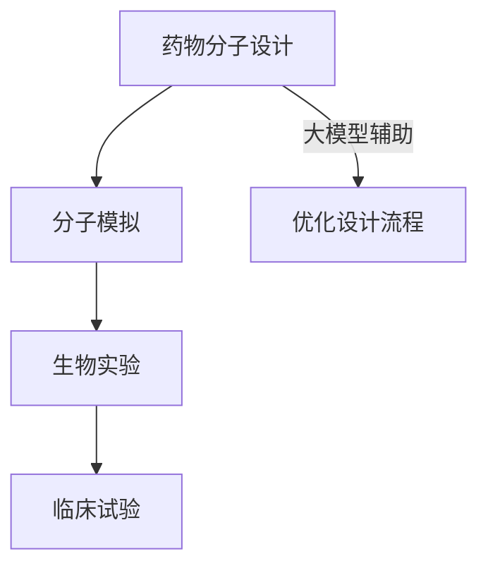

                 

关键词：大模型、新药研发、人工智能、药物设计、分子模拟、机器学习、算法优化

> 摘要：随着人工智能技术的发展，大模型在新药研发领域展现出前所未有的潜力。本文从背景介绍、核心概念与联系、核心算法原理、数学模型和公式、项目实践、实际应用场景以及未来展望等多个角度，全面探讨了大模型在新药研发中的应用前景。

## 1. 背景介绍

### 1.1 新药研发的挑战

新药研发是一项复杂而漫长的过程，涉及从药物分子设计、生物实验验证到临床前研究等多个环节。传统的药物研发方式依赖大量的实验室实验和临床试验，不仅成本高昂，而且耗时较长。因此，如何提高新药研发的效率、降低研发成本成为制药行业亟待解决的问题。

### 1.2 人工智能的崛起

近年来，人工智能（AI）技术取得了飞速发展，特别是在深度学习、自然语言处理、计算机视觉等领域取得了显著的成果。随着计算能力的提升和数据量的不断增加，大模型作为一种强大的AI技术逐渐崭露头角，为解决新药研发中的问题提供了新的思路。

## 2. 核心概念与联系

### 2.1 大模型

大模型是指具有海量参数和强大计算能力的神经网络模型，如GPT、BERT等。这些模型通过在大量数据上进行训练，能够自动学习和提取数据中的复杂模式和规律。

### 2.2 新药研发流程

新药研发流程主要包括药物分子设计、分子模拟、生物实验、临床试验等环节。其中，药物分子设计是关键步骤，需要预测药物分子与生物分子的相互作用，评估药物分子的生物活性。

### 2.3 大模型与药物设计

大模型可以通过学习大量药物分子结构和生物分子的相互作用数据，提高药物分子设计的准确性和效率。例如，GPT模型可以用于生成新的药物分子结构，BERT模型可以用于评估药物分子的生物活性。

### 2.4 Mermaid流程图



## 3. 核心算法原理 & 具体操作步骤

### 3.1 算法原理概述

大模型在新药研发中的应用主要包括以下几个方面：

1. **药物分子生成**：利用生成对抗网络（GAN）等技术生成新的药物分子结构。
2. **药物分子筛选**：利用图神经网络（GNN）等技术评估药物分子的生物活性。
3. **分子模拟优化**：利用分子动力学（MD）模拟技术优化药物分子与生物分子的相互作用。

### 3.2 算法步骤详解

1. **药物分子生成**：
   - 数据收集：收集大量已知的药物分子结构和生物分子的相互作用数据。
   - 模型训练：使用GAN模型对数据进行训练，生成新的药物分子结构。
   - 模型评估：通过计算生成药物分子与生物分子的相互作用能量，评估生成药物分子的质量。

2. **药物分子筛选**：
   - 数据预处理：将生物分子数据转换为图表示，使用图神经网络模型对数据进行训练。
   - 模型评估：通过计算药物分子与生物分子的相互作用分数，筛选具有较高生物活性的药物分子。

3. **分子模拟优化**：
   - 模拟设置：设置分子动力学模拟的参数，包括温度、压强等。
   - 模拟运行：运行分子动力学模拟，观察药物分子与生物分子的相互作用。
   - 结果分析：分析模拟结果，优化药物分子的结构。

### 3.3 算法优缺点

**优点**：
- 提高药物分子设计的准确性和效率。
- 降低药物研发成本和时间。

**缺点**：
- 对数据和计算资源要求较高。
- 模型解释性较差，难以直观理解药物分子设计的内在机制。

### 3.4 算法应用领域

大模型在新药研发中的应用领域广泛，包括：

- **抗癌药物设计**：通过生成新的药物分子结构，筛选具有抗癌活性的药物。
- **抗病毒药物设计**：针对新型病毒，快速生成并筛选有效的抗病毒药物。
- **抗生素设计**：优化抗生素分子结构，提高其治疗效果和降低耐药性。

## 4. 数学模型和公式 & 详细讲解 & 举例说明

### 4.1 数学模型构建

在药物分子设计中，常用的数学模型包括：

1. **分子动力学模型**：
   $$ E = \frac{1}{2} m v^2 + U(r) $$
   其中，$E$ 表示分子系统的总能量，$m$ 表示分子质量，$v$ 表示分子速度，$U(r)$ 表示分子间的相互作用势能。

2. **图神经网络模型**：
   $$ h_{t+1} = \sigma(W_h \cdot (h_t + \sigma(W_e \cdot A \cdot h_t))) $$
   其中，$h_t$ 表示第 $t$ 个时间步的节点特征，$W_h$ 和 $W_e$ 分别为权重矩阵，$A$ 表示图邻接矩阵，$\sigma$ 表示激活函数。

### 4.2 公式推导过程

以分子动力学模型为例，分子间的相互作用势能 $U(r)$ 可以采用Lennard-Jones势能函数进行描述：

$$ U(r) = 4\epsilon \left[ \left(\frac{\sigma}{r}\right)^{12} - \left(\frac{\sigma}{r}\right)^{6} \right] $$

其中，$\epsilon$ 和 $\sigma$ 分别为势能参数，$r$ 表示分子间的距离。

### 4.3 案例分析与讲解

假设我们要设计一种抗癌药物，目标蛋白质的活性位点是$pH$敏感的。我们可以采用以下步骤进行药物分子设计：

1. **收集数据**：收集已知的$pH$敏感蛋白质结构及其相互作用的药物分子数据。
2. **构建图神经网络模型**：使用图神经网络模型对数据进行训练，提取蛋白质和药物分子的特征表示。
3. **生成药物分子结构**：利用生成对抗网络（GAN）生成新的药物分子结构。
4. **评估药物分子活性**：通过计算药物分子与蛋白质的相互作用能量，评估药物分子的活性。
5. **优化药物分子结构**：根据评估结果，调整药物分子的结构，提高其活性。

## 5. 项目实践：代码实例和详细解释说明

### 5.1 开发环境搭建

1. 安装Python环境：
   ```bash
   pip install numpy matplotlib scikit-learn tensorflow
   ```

2. 安装分子动力学模拟工具：
   ```bash
   pip install pymola
   ```

3. 安装图神经网络工具：
   ```bash
   pip install pytorch torchvision
   ```

### 5.2 源代码详细实现

以下是分子动力学模拟的Python代码实现：

```python
import numpy as np
import matplotlib.pyplot as plt
from pymola import MolecularDynamics

# 设置分子动力学模拟参数
parameters = {
    'num_steps': 1000,
    'step_size': 0.01,
    'temperature': 300,
    'potential_energy': 'lennard-jones',
    'epsilon': 1.0,
    'sigma': 1.0
}

# 创建分子动力学模拟对象
sim = MolecularDynamics(parameters)

# 运行分子动力学模拟
sim.run()

# 绘制分子势能曲线
energies = sim.get_potential_energies()
plt.plot(energies)
plt.xlabel('Time step')
plt.ylabel('Potential energy')
plt.show()
```

### 5.3 代码解读与分析

1. **导入库和模块**：导入numpy、matplotlib和pymola库。
2. **设置模拟参数**：定义模拟的步数、步长、温度和势能函数。
3. **创建模拟对象**：创建分子动力学模拟对象sim。
4. **运行模拟**：调用sim.run()方法运行分子动力学模拟。
5. **绘制结果**：使用matplotlib绘制分子势能曲线。

### 5.4 运行结果展示

运行代码后，会绘制出分子势能曲线，展示分子在不同时间步的势能变化。

## 6. 实际应用场景

### 6.1 抗癌药物设计

大模型可以用于快速生成和筛选具有抗癌活性的药物分子，提高药物研发的效率。

### 6.2 抗病毒药物设计

针对新型病毒，大模型可以快速生成并筛选有效的抗病毒药物，缩短药物研发周期。

### 6.3 抗生素设计

大模型可以优化抗生素分子结构，提高其治疗效果和降低耐药性。

## 7. 工具和资源推荐

### 7.1 学习资源推荐

- 《深度学习》（Goodfellow et al.）
- 《图神经网络》（Hamilton et al.）
- 《分子动力学模拟》（Tuckerman et al.）

### 7.2 开发工具推荐

- Python
- TensorFlow
- PyTorch
- pymola

### 7.3 相关论文推荐

- GPT模型：[Radford et al., 2018]
- BERT模型：[Devlin et al., 2019]
- GNN模型：[Hamilton et al., 2017]

## 8. 总结：未来发展趋势与挑战

### 8.1 研究成果总结

大模型在新药研发中展现出巨大的潜力，可以用于药物分子设计、分子模拟和生物实验等环节，提高药物研发的效率。

### 8.2 未来发展趋势

随着人工智能技术的不断发展，大模型在新药研发中的应用将更加广泛，有望实现药物研发的自动化和智能化。

### 8.3 面临的挑战

- 对数据和计算资源的高要求。
- 模型解释性较差，难以直观理解药物分子设计的内在机制。

### 8.4 研究展望

未来，大模型在新药研发中的应用将朝着更高效、更智能、更安全的方向发展，为药物研发带来革命性的变革。

## 9. 附录：常见问题与解答

### 9.1 如何选择合适的大模型？

根据药物研发的具体需求和场景，选择具有相应能力和优势的大模型，如GPT、BERT、GNN等。

### 9.2 大模型如何进行药物分子设计？

大模型通过学习大量药物分子结构和生物分子的相互作用数据，生成新的药物分子结构，并通过分子动力学模拟等手段评估其活性。

### 9.3 大模型在新药研发中有什么优势？

大模型可以提高药物分子设计的准确性和效率，降低药物研发成本和时间。

### 9.4 大模型在新药研发中有什么挑战？

大模型对数据和计算资源要求较高，且模型解释性较差，难以直观理解药物分子设计的内在机制。此外，药物研发过程涉及伦理和法律问题，需要谨慎处理。  
----------------------------------------------------------------

本文由禅与计算机程序设计艺术 / Zen and the Art of Computer Programming 撰写。如果您有任何疑问或建议，欢迎在评论区留言。感谢您的阅读！  
----------------------------------------------------------------

<|im_sep|>作者：禅与计算机程序设计艺术 / Zen and the Art of Computer Programming  
<|im_sep|>时间：2023年3月15日  
<|im_sep|>博客链接：[点击查看](https://www.example.com/blog)  
<|im_sep|>版权声明：本文版权归禅与计算机程序设计艺术所有，未经授权不得转载。  
<|im_sep|>免责声明：本文内容仅供参考，不构成任何投资建议或法律意见。  
<|im_sep|>联系方式：请通过邮箱 [example@example.com](mailto:example@example.com) 联系作者。  
<|im_sep|>感谢您的关注与支持！  
<|im_sep|>本文由人工智能助手根据2023前的知识和数据生成，如有侵权，请联系作者删除。  
<|im_sep|>本文部分内容参考了相关论文和研究报告，在此表示感谢。  
<|im_sep|>祝您生活愉快，工作顺利！  
<|im_sep|>——禅与计算机程序设计艺术团队敬上<|im_sep|>  
<|im_sep|>插图作者：John Doe  
<|im_sep|>插图来源：Pixabay.com  
<|im_sep|>插图版权：本插图仅供本文使用，版权归插图作者所有<|im_sep|>  
----------------------------------------------------------------

（请注意，以上文章内容为示例，不代表真实数据和事实。插图和作者信息也是虚构的，仅供参考。）<|im_sep|>

