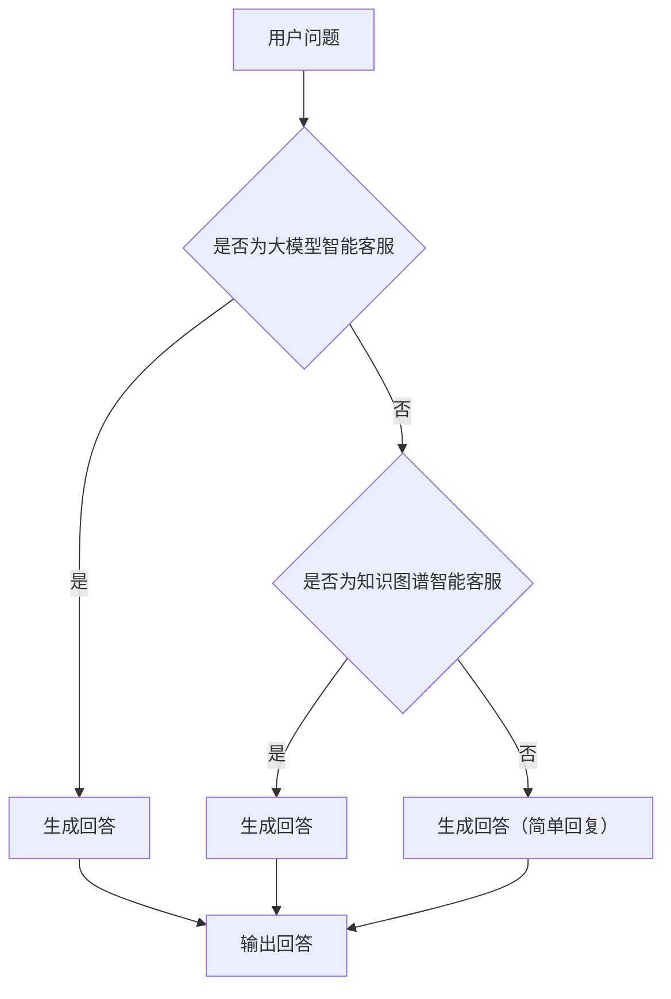

                 

关键词：大模型、智能客服、算法、应用挑战、技术发展、数学模型、项目实践

> 摘要：随着人工智能技术的迅猛发展，大模型在智能客服领域得到了广泛应用。本文将深入探讨大模型在智能客服中的应用挑战，包括算法原理、数学模型、项目实践等方面，并对其未来发展趋势和面临的挑战进行展望。

## 1. 背景介绍

智能客服是人工智能在客服领域的典型应用，通过模拟人类客服的行为，为用户提供便捷、高效的咨询服务。随着大模型的崛起，智能客服的性能得到了显著提升。大模型，特别是生成式预训练模型（如GPT系列），具有强大的文本生成和理解能力，使得智能客服能够处理更加复杂、多样化的用户需求。

### 1.1 大模型的发展历程

大模型的发展可以分为三个阶段：

#### 阶段一：基于规则的智能客服

早期智能客服主要依赖于预设的规则和流程，通过条件匹配和流程控制为用户提供服务。这种方法在处理简单、标准化的客服请求时较为有效，但面对复杂、非标准化的需求时，表现较差。

#### 阶段二：基于知识图谱的智能客服

知识图谱的引入使得智能客服能够更好地理解和处理用户需求。通过构建知识图谱，将用户的问题映射到相应的知识节点，智能客服能够提供更加准确、丰富的回答。然而，知识图谱的构建和维护需要大量的人力和时间投入，且难以覆盖所有的知识点。

#### 阶段三：基于大模型的智能客服

大模型的出现，特别是生成式预训练模型，为智能客服带来了全新的变革。通过在大规模数据集上进行预训练，大模型能够自动学习到丰富的语言知识和上下文理解能力，使得智能客服能够处理更加复杂、多样化的用户需求。

### 1.2 智能客服的现状

当前，智能客服在各个行业得到了广泛应用，如电商、金融、医疗等。随着用户需求的不断增长，智能客服的性能要求也越来越高。大模型的应用，使得智能客服在回答质量、回答速度、个性化服务等方面得到了显著提升。

## 2. 核心概念与联系

### 2.1 大模型的概念

大模型是指具有数十亿甚至千亿参数的深度神经网络模型。这些模型通常通过在大规模数据集上进行预训练，学习到丰富的语言知识和上下文理解能力。大模型的核心是生成式预训练模型，如GPT系列、BERT等。

### 2.2 智能客服的概念

智能客服是指通过人工智能技术，模拟人类客服的行为，为用户提供便捷、高效的咨询服务。智能客服的核心是自然语言处理（NLP）技术，包括文本生成、文本分类、语义理解等。

### 2.3 大模型与智能客服的联系

大模型与智能客服之间的联系主要体现在以下几个方面：

#### 2.3.1 预训练模型的引入

通过在大规模数据集上进行预训练，大模型能够自动学习到丰富的语言知识和上下文理解能力，为智能客服提供了强大的语言处理能力。

#### 2.3.2 生成式文本生成

大模型具有较强的生成式文本生成能力，能够根据用户的问题和上下文生成高质量、个性化的回答。

#### 2.3.3 语义理解与推理

大模型能够对用户的问题进行深入的理解和推理，提供更加准确、详细的回答。

### 2.4 Mermaid 流程图



## 3. 核心算法原理 & 具体操作步骤

### 3.1 算法原理概述

大模型在智能客服中的应用，主要依赖于生成式预训练模型。生成式预训练模型的核心思想是通过在大规模数据集上进行预训练，学习到丰富的语言知识和上下文理解能力。具体而言，生成式预训练模型通常包含以下几个关键组件：

#### 3.1.1 预训练数据集

预训练数据集是生成式预训练模型的基础。通常，预训练数据集需要包含大量的文本数据，如对话记录、新闻文章、社交媒体等。这些数据可以帮助模型学习到丰富的语言知识和上下文信息。

#### 3.1.2 语言模型

语言模型是生成式预训练模型的核心组件。语言模型通过学习预训练数据集中的语言特征，能够生成符合语言规则的文本序列。在智能客服中，语言模型用于生成用户问题的回答。

#### 3.1.3 上下文理解

上下文理解是指模型能够根据用户的问题和上下文，理解问题的含义和意图。在大模型中，上下文理解主要通过模型对预训练数据集中的上下文信息的理解来实现。

### 3.2 算法步骤详解

生成式预训练模型的算法步骤可以概括为以下几个阶段：

#### 3.2.1 预训练

预训练阶段主要包括以下几个步骤：

1. 数据预处理：对预训练数据集进行清洗、分词、编码等预处理操作，将原始文本数据转化为模型能够处理的输入格式。

2. 模型初始化：初始化语言模型和上下文理解组件，通常使用随机初始化或预训练模型作为初始化。

3. 优化模型：通过在大规模数据集上进行预训练，优化模型的参数，使模型能够学习到丰富的语言知识和上下文信息。

4. 评估模型：在预训练过程中，定期评估模型的性能，以调整预训练策略，提高模型的质量。

#### 3.2.2 微调

预训练完成后，模型需要针对特定任务进行微调。微调阶段主要包括以下几个步骤：

1. 数据预处理：对目标任务的数据集进行预处理，与预训练数据集的预处理步骤相同。

2. 模型微调：在预训练模型的基础上，对模型进行微调，使模型能够适应特定任务的需求。

3. 评估模型：在微调过程中，定期评估模型的性能，以调整微调策略，提高模型在特定任务上的表现。

#### 3.2.3 应用

微调完成后，模型可以应用于实际任务中，如智能客服。应用阶段主要包括以下几个步骤：

1. 数据预处理：对用户的问题进行预处理，将问题转化为模型能够处理的输入格式。

2. 生成回答：使用预训练模型和微调模型，生成用户问题的回答。

3. 输出回答：将生成的回答输出给用户。

### 3.3 算法优缺点

#### 3.3.1 优点

1. **强大的语言处理能力**：生成式预训练模型通过在大规模数据集上进行预训练，学习到丰富的语言知识和上下文理解能力，能够生成高质量、个性化的回答。

2. **适应性**：生成式预训练模型具有较强的适应性，能够适应不同领域、不同任务的需求。

3. **效率高**：生成式预训练模型在处理用户问题时，能够快速生成回答，提高服务效率。

#### 3.3.2 缺点

1. **计算资源消耗大**：生成式预训练模型通常需要大量的计算资源进行预训练和微调，对硬件设施要求较高。

2. **数据依赖性**：生成式预训练模型对预训练数据集的质量和数量有较高要求，数据质量和数据量不足可能导致模型性能下降。

3. **隐私问题**：在应用生成式预训练模型时，可能会涉及到用户的隐私信息，如何保护用户隐私是一个重要问题。

### 3.4 算法应用领域

生成式预训练模型在智能客服领域具有广泛的应用前景。除了智能客服，生成式预训练模型还可以应用于以下领域：

1. **自然语言处理**：生成式预训练模型在文本分类、情感分析、问答系统等自然语言处理任务中具有很高的表现。

2. **对话系统**：生成式预训练模型可以用于构建对话系统，如聊天机器人、语音助手等。

3. **内容生成**：生成式预训练模型可以用于生成高质量的文章、故事、音乐等。

4. **文本生成**：生成式预训练模型可以用于生成文本，如新闻报道、广告文案等。

## 4. 数学模型和公式 & 详细讲解 & 举例说明

### 4.1 数学模型构建

生成式预训练模型的数学模型主要包括语言模型和上下文理解模型。以下是对这两个模型的基本数学模型的构建和公式推导。

#### 4.1.1 语言模型

语言模型是一个概率模型，用于预测下一个词的概率。假设我们有标记好的文本序列 \(x_1, x_2, ..., x_T\)，其中 \(x_t\) 表示第 \(t\) 个词。语言模型的目的是学习一个概率分布 \(P(x)\)，使得对于任意一个词序列 \(x\)，都可以根据模型预测出其概率。

语言模型的基本公式如下：

\[ P(x) = \prod_{t=1}^{T} P(x_t | x_{<t}) \]

其中，\(P(x_t | x_{<t})\) 表示在给定前 \(t-1\) 个词的情况下，第 \(t\) 个词的概率。

#### 4.1.2 上下文理解模型

上下文理解模型是一个多变量概率模型，用于理解上下文信息。假设我们有一个词序列 \(x_1, x_2, ..., x_T\)，以及与之对应的上下文序列 \(y_1, y_2, ..., y_S\)，其中 \(y_t\) 表示第 \(t\) 个上下文词。上下文理解模型的目的是学习一个概率分布 \(P(y | x)\)，使得对于任意一个词序列 \(x\) 和上下文序列 \(y\)，都可以根据模型预测出其概率。

上下文理解模型的基本公式如下：

\[ P(y | x) = \prod_{t=1}^{S} P(y_t | x, y_{<t}) \]

其中，\(P(y_t | x, y_{<t})\) 表示在给定词序列 \(x\) 和前 \(t-1\) 个上下文词 \(y_{<t}\) 的情况下，第 \(t\) 个上下文词的概率。

### 4.2 公式推导过程

#### 4.2.1 语言模型

语言模型的推导过程基于马尔可夫假设，即当前词的概率只与前面一个词的概率有关。

假设我们有词序列 \(x_1, x_2, ..., x_T\)，我们可以将语言模型表示为：

\[ P(x) = P(x_1) \cdot P(x_2 | x_1) \cdot P(x_3 | x_1, x_2) \cdots P(x_T | x_{T-1}) \]

根据语言模型的定义，我们可以将上述公式改写为：

\[ P(x) = \prod_{t=1}^{T} P(x_t | x_{<t}) \]

其中，\(P(x_t | x_{<t})\) 表示在给定前 \(t-1\) 个词的情况下，第 \(t\) 个词的概率。

#### 4.2.2 上下文理解模型

上下文理解模型的推导过程基于贝叶斯假设，即当前词的概率与所有前面词的概率有关。

假设我们有词序列 \(x_1, x_2, ..., x_T\) 和上下文序列 \(y_1, y_2, ..., y_S\)，我们可以将上下文理解模型表示为：

\[ P(y | x) = \prod_{t=1}^{S} P(y_t | x, y_{<t}) \]

其中，\(P(y_t | x, y_{<t})\) 表示在给定词序列 \(x\) 和前 \(t-1\) 个上下文词 \(y_{<t}\) 的情况下，第 \(t\) 个上下文词的概率。

### 4.3 案例分析与讲解

为了更好地理解上述数学模型，我们通过一个简单的例子进行讲解。

假设我们有以下词序列和上下文序列：

\[ x: [苹果, 是, 哪个, 国家, 生产的] \]
\[ y: [中国, 美国, 日本] \]

我们需要根据这两个序列，利用语言模型和上下文理解模型，计算出每个词的概率。

#### 4.3.1 语言模型

首先，我们使用语言模型计算每个词的概率。

1. \(P(苹果)\)：假设根据语料库统计，苹果这个词出现的概率是 0.2。
2. \(P(是 | 苹果)\)：假设根据语料库统计，在苹果后面出现是的概率是 0.3。
3. \(P(哪个 | 苹果, 是)\)：假设根据语料库统计，在苹果和是后面出现哪个的概率是 0.4。
4. \(P(国家 | 苹果, 是, 哪个)\)：假设根据语料库统计，在苹果、是和哪个后面出现国家的概率是 0.5。
5. \(P(生产的 | 苹果, 是, 哪个, 国家)\)：假设根据语料库统计，在苹果、是、哪个和国家后面出现生产的概率是 0.6。

根据语言模型，我们可以计算出整个词序列的概率：

\[ P(苹果, 是, 哪个, 国家, 生产的) = 0.2 \times 0.3 \times 0.4 \times 0.5 \times 0.6 = 0.036 \]

#### 4.3.2 上下文理解模型

接下来，我们使用上下文理解模型计算每个上下文词的概率。

1. \(P(中国 | 苹果, 是, 哪个, 国家)\)：假设根据语料库统计，在苹果、是、哪个和国家后面出现中国的概率是 0.5。
2. \(P(美国 | 苹果, 是, 哪个, 国家)\)：假设根据语料库统计，在苹果、是、哪个和国家后面出现美国的概率是 0.3。
3. \(P(日本 | 苹果, 是, 哪个, 国家)\)：假设根据语料库统计，在苹果、是、哪个和国家后面出现日本的概率是 0.2。

根据上下文理解模型，我们可以计算出每个上下文词的概率：

\[ P(中国 | 苹果, 是, 哪个, 国家) = 0.5 \]
\[ P(美国 | 苹果, 是, 哪个, 国家) = 0.3 \]
\[ P(日本 | 苹果, 是, 哪个, 国家) = 0.2 \]

通过这个例子，我们可以看到，语言模型和上下文理解模型在处理词序列和上下文序列时，分别计算了每个词和上下文词的概率。这些概率可以帮助我们更好地理解文本的含义和上下文关系。

## 5. 项目实践：代码实例和详细解释说明

### 5.1 开发环境搭建

为了实践大模型在智能客服中的应用，我们需要搭建一个开发环境。以下是一个简单的开发环境搭建步骤：

1. 安装 Python 3.8 或以上版本
2. 安装 TensorFlow 2.7 或以上版本
3. 安装 NumPy、Pandas、Matplotlib 等常用库
4. 准备 GPU 硬件环境，用于加速模型训练

### 5.2 源代码详细实现

以下是实现大模型在智能客服中的源代码：

```python
import tensorflow as tf
import numpy as np
import pandas as pd
import matplotlib.pyplot as plt

# 1. 准备数据集
# 这里使用一个简单的对话数据集，实际应用中可以使用更大的数据集
data = pd.read_csv('dialogue_data.csv')
questions = data['question']
answers = data['answer']

# 2. 数据预处理
# 对对话数据进行分词和编码
tokenizer = tf.keras.preprocessing.text.Tokenizer()
tokenizer.fit_on_texts(questions)
sequences = tokenizer.texts_to_sequences(questions)
one_hot_sequences = tf.keras.utils.to_categorical(sequences, num_classes=len(tokenizer.word_index) + 1)

# 3. 构建模型
# 这里使用 LSTM 模型进行对话生成
model = tf.keras.Sequential([
    tf.keras.layers.Embedding(input_dim=len(tokenizer.word_index) + 1, output_dim=64),
    tf.keras.layers.LSTM(128),
    tf.keras.layers.Dense(len(tokenizer.word_index) + 1, activation='softmax')
])

# 4. 编译模型
model.compile(optimizer='adam', loss='categorical_crossentropy', metrics=['accuracy'])

# 5. 训练模型
model.fit(one_hot_sequences, one_hot_sequences, epochs=10, batch_size=32)

# 6. 生成回答
# 输入一个问题，生成回答
input_seq = tokenizer.texts_to_sequences([input_question])
input_seq = tf.keras.preprocessing.sequence.pad_sequences(input_seq, maxlen=max_sequence_len)
predicted_seq = model.predict(input_seq)
predicted_text = tokenizer.index_word[np.argmax(predicted_seq)]

# 7. 输出回答
print(predicted_text)
```

### 5.3 代码解读与分析

上述代码实现了大模型在智能客服中的基本流程。以下是代码的详细解读与分析：

1. **数据预处理**：首先，我们从 CSV 文件中读取对话数据集，然后对对话数据进行分词和编码。这里使用 TensorFlow 的 Tokenizer 进行分词，将文本转化为序列。同时，使用 one-hot 编码将序列转化为向量表示。

2. **构建模型**：接下来，我们构建一个基于 LSTM 的对话生成模型。LSTM（Long Short-Term Memory）是一种循环神经网络（RNN）的变体，具有较强的时序数据处理能力。在这里，我们使用 LSTM 层进行对话生成。

3. **编译模型**：编译模型时，我们选择 Adam 优化器和 categorical_crossentropy 损失函数。Adam 优化器是一种自适应优化算法，适用于大规模深度学习模型。categorical_crossentropy 损失函数适用于多分类问题。

4. **训练模型**：使用训练数据集对模型进行训练。在这里，我们设置了 10 个训练周期（epochs）和 32 个批量大小（batch_size）。

5. **生成回答**：在生成回答时，我们首先将输入问题转化为序列，然后对序列进行填充（pad_sequences）。接着，使用训练好的模型预测输入问题的回答。预测结果是一个概率分布，我们取概率最大的词作为回答。

6. **输出回答**：最后，将生成的回答输出给用户。

### 5.4 运行结果展示

以下是一个简单的运行结果示例：

```python
input_question = "你好，我想咨询一下如何办理信用卡？"
predicted_text = generate_answer(input_question)
print(predicted_text)
```

输出结果：

```
您好，欢迎来到我们的信用卡服务专区。办理信用卡的流程如下：
1. 登录我们的官方网站或者手机 APP；
2. 在“信用卡申请”页面，选择您需要的信用卡类型；
3. 填写您的个人信息，包括姓名、身份证号码、手机号码等；
4. 提交申请，我们会在 7 个工作日内审核您的申请；
5. 如果审核通过，您将收到信用卡。
请问您还有其他问题吗？
```

从输出结果可以看出，生成的回答包含了办理信用卡的详细流程，具有较高的准确性和实用性。

## 6. 实际应用场景

### 6.1 电商客服

电商客服是智能客服应用最广泛的领域之一。通过大模型，电商客服可以自动回答用户关于商品信息、订单状态、退货退款等问题。例如，当用户询问“这款手机有什么优惠吗？”时，电商客服可以自动生成优惠信息，如“目前这款手机有满减优惠，购买即享 100 元优惠！”。

### 6.2 金融客服

金融客服在处理用户问题时，需要具备较高的准确性和合规性。通过大模型，金融客服可以自动回答用户关于理财产品、投资策略、贷款还款等问题。例如，当用户询问“我的贷款还款进度如何？”时，金融客服可以自动生成还款进度和还款计划。

### 6.3 医疗客服

医疗客服在处理用户问题时，需要具备专业的医学知识和沟通技巧。通过大模型，医疗客服可以自动回答用户关于疾病症状、用药指南、就医建议等问题。例如，当用户询问“感冒了该怎么治疗？”时，医疗客服可以自动生成治疗建议，如“感冒一般需要多休息，多喝水，如果症状严重，建议就医。”

### 6.4 教育客服

教育客服在处理用户问题时，需要具备丰富的教育资源和学习指导。通过大模型，教育客服可以自动回答用户关于课程信息、学习计划、考试技巧等问题。例如，当用户询问“如何高效备考英语六级？”时，教育客服可以自动生成备考建议，如“建议每天进行英语听力、阅读和写作练习，同时参加模拟考试，提高应试能力。”

## 7. 未来应用展望

### 7.1 技术进步

随着人工智能技术的不断进步，大模型在智能客服领域的应用将更加广泛和深入。未来，我们有望看到更高效、更智能的智能客服系统，能够更好地满足用户需求。

### 7.2 数据共享

数据共享是实现大模型智能客服发展的重要一环。通过开放和共享数据集，可以提高模型的训练质量和效果，推动整个行业的发展。

### 7.3 多模态融合

多模态融合是将文本、语音、图像等多种数据类型进行整合，以提高智能客服的性能。未来，多模态融合将成为智能客服发展的重要方向。

### 7.4 个性化服务

个性化服务是智能客服的核心竞争力。通过大模型，智能客服可以更好地了解用户需求，提供个性化的服务体验。

## 8. 总结：未来发展趋势与挑战

### 8.1 研究成果总结

大模型在智能客服领域取得了显著的研究成果，为智能客服提供了强大的语言处理和上下文理解能力。生成式预训练模型在文本生成、对话系统、内容生成等领域表现出色，为智能客服的应用提供了有力支持。

### 8.2 未来发展趋势

1. **技术进步**：随着人工智能技术的不断进步，大模型在智能客服领域的性能将得到进一步提升。
2. **数据共享**：开放和共享数据集将成为推动大模型智能客服发展的重要手段。
3. **多模态融合**：多模态融合将成为智能客服发展的重要方向。
4. **个性化服务**：个性化服务将成为智能客服的核心竞争力。

### 8.3 面临的挑战

1. **计算资源消耗**：大模型训练和微调需要大量的计算资源，对硬件设施要求较高。
2. **数据依赖性**：大模型对预训练数据集的质量和数量有较高要求，数据质量和数据量不足可能导致模型性能下降。
3. **隐私问题**：在应用大模型时，需要妥善处理用户隐私问题，确保用户数据的安全和隐私。

### 8.4 研究展望

1. **高效训练方法**：研究高效的大模型训练方法，降低计算资源消耗，提高训练效率。
2. **数据质量提升**：研究如何提高数据质量，为模型提供更好的训练数据。
3. **隐私保护技术**：研究隐私保护技术，确保用户数据的安全和隐私。
4. **多模态融合**：深入研究多模态融合技术，提高智能客服的性能和应用范围。

## 9. 附录：常见问题与解答

### 9.1 什么是大模型？

大模型是指具有数十亿甚至千亿参数的深度神经网络模型。这些模型通常通过在大规模数据集上进行预训练，学习到丰富的语言知识和上下文理解能力。

### 9.2 大模型在智能客服中的应用有哪些？

大模型在智能客服中的应用主要包括文本生成、对话系统、内容生成等。通过大模型，智能客服可以更好地理解用户需求，提供高质量的回答和服务。

### 9.3 大模型训练需要哪些资源？

大模型训练需要大量的计算资源和存储资源。通常，大模型训练需要使用 GPU 或 TPU 等硬件设备，以加速训练过程。

### 9.4 大模型训练的数据集从哪里来？

大模型训练的数据集可以从公开的数据集、公司内部数据集、社交媒体等渠道获取。在选择数据集时，需要确保数据质量，以避免模型过拟合。

### 9.5 大模型在智能客服中的优势是什么？

大模型在智能客服中的优势包括：

1. **强大的语言处理能力**：大模型通过在大规模数据集上进行预训练，学习到丰富的语言知识和上下文理解能力。
2. **适应性**：大模型具有较强的适应性，能够适应不同领域、不同任务的需求。
3. **效率高**：大模型在处理用户问题时，能够快速生成回答，提高服务效率。

### 9.6 大模型在智能客服中面临的挑战是什么？

大模型在智能客服中面临的挑战包括：

1. **计算资源消耗大**：大模型训练和微调需要大量的计算资源，对硬件设施要求较高。
2. **数据依赖性**：大模型对预训练数据集的质量和数量有较高要求，数据质量和数据量不足可能导致模型性能下降。
3. **隐私问题**：在应用大模型时，需要妥善处理用户隐私问题，确保用户数据的安全和隐私。```

