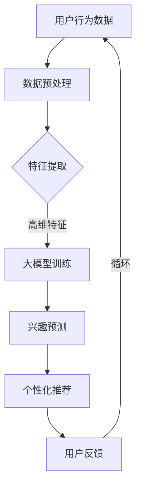

                 

关键词：大模型，电商平台，用户兴趣，个性化推荐，算法，应用场景

>摘要：本文旨在探讨大模型在电商平台用户兴趣探索与利用平衡中的应用。通过深入分析大模型的工作原理和实际操作步骤，本文揭示了其在电商平台个性化推荐系统中的关键作用。本文结构分为八个部分，首先介绍背景和核心概念，随后阐述算法原理和数学模型，接着通过项目实践展示代码实例，并讨论实际应用场景和未来展望。

## 1. 背景介绍

随着互联网技术的迅猛发展，电商平台已经成为消费者购买商品的主要渠道之一。用户在电商平台上进行购物时，个性化推荐系统的重要性日益凸显。个性化推荐系统旨在根据用户的兴趣和行为，为他们推荐最相关的商品，从而提升用户体验和满意度。然而，随着用户数据的日益庞大和复杂，如何有效探索用户兴趣并实现个性化推荐，成为电商平台的重大挑战。

近年来，深度学习和大模型技术的发展为解决这一问题提供了新的思路。大模型具有处理海量数据、提取复杂特征和实现高效预测的能力，成为电商平台个性化推荐系统的核心技术。本文将围绕大模型在电商平台用户兴趣探索与利用平衡中的应用进行深入探讨。

## 2. 核心概念与联系

在探讨大模型在电商平台用户兴趣探索中的应用之前，我们需要明确几个核心概念：

### 2.1 用户兴趣

用户兴趣是指用户对特定类型商品或服务的喜好倾向。在电商平台中，用户兴趣可以通过其浏览历史、购买行为、评论反馈等多维度数据来挖掘和表示。

### 2.2 个性化推荐

个性化推荐是指根据用户的兴趣和行为，为其推荐最相关的商品或服务。个性化推荐系统的核心是准确捕捉和利用用户兴趣，从而提升推荐效果。

### 2.3 大模型

大模型是指具有大规模参数、能够处理海量数据和提取复杂特征的人工智能模型。大模型通常采用深度学习技术，能够实现高效的端到端学习。

### 2.4 平衡

在用户兴趣探索与利用过程中，需要平衡推荐效果与用户隐私、数据安全等关键因素。过度的推荐可能导致用户隐私泄露，而过低的推荐效果则无法满足用户需求。

为了更好地理解大模型在电商平台用户兴趣探索与利用平衡中的应用，下面给出一个简化的Mermaid流程图：



### 2.5 大模型在个性化推荐中的作用

大模型在个性化推荐中的作用主要体现在以下几个方面：

1. **特征提取**：大模型能够自动学习用户行为数据的复杂特征，从而提高特征提取的准确性和效率。
2. **兴趣预测**：基于提取的特征，大模型能够准确预测用户的兴趣，从而实现个性化推荐。
3. **实时更新**：大模型能够实时更新用户兴趣模型，以适应用户行为的变化。
4. **多维度推荐**：大模型能够同时考虑多种特征和维度，实现更加全面和个性化的推荐。

## 3. 核心算法原理 & 具体操作步骤

### 3.1 算法原理概述

大模型在个性化推荐系统中的应用主要基于深度学习技术。深度学习模型通过多层神经网络结构，实现对输入数据的层层抽象和特征提取。在大模型中，常用的架构包括卷积神经网络（CNN）、循环神经网络（RNN）和变压器（Transformer）等。

以下是一个基于变压器的简单算法原理概述：

1. **输入层**：接收用户行为数据，如浏览历史、购买记录等。
2. **嵌入层**：将输入数据转化为高维向量表示。
3. **自注意力机制**：通过自注意力机制，对输入数据进行加权融合，提取关键特征。
4. **多层神经网络**：通过多层神经网络，进一步提取复杂特征和进行预测。
5. **输出层**：输出用户兴趣预测结果。

### 3.2 算法步骤详解

1. **数据预处理**：
   - 数据清洗：去除噪声和异常值。
   - 数据归一化：将数据缩放到相同的尺度。
   - 数据嵌入：将原始数据转换为高维向量表示。

2. **模型训练**：
   - 构建模型：定义深度学习模型结构，如Transformer。
   - 损失函数：定义损失函数，如交叉熵损失。
   - 优化器：选择优化器，如Adam。
   - 训练过程：通过梯度下降等优化方法，迭代训练模型。

3. **兴趣预测**：
   - 输入用户行为数据，通过模型进行特征提取和预测。
   - 获得用户兴趣结果。

4. **个性化推荐**：
   - 根据用户兴趣结果，为用户推荐相关的商品或服务。
   - 结合用户反馈，更新推荐模型。

### 3.3 算法优缺点

**优点**：
- **高效性**：大模型能够自动提取复杂特征，提高算法效率。
- **准确性**：基于深度学习模型，能够实现高精度的兴趣预测。
- **实时性**：能够实时更新用户兴趣模型，适应用户行为变化。

**缺点**：
- **计算资源消耗**：大模型训练和推理需要大量的计算资源。
- **数据依赖**：模型的性能依赖于用户数据的质量和多样性。
- **隐私风险**：用户隐私数据可能被泄露或滥用。

### 3.4 算法应用领域

大模型在个性化推荐系统中的应用领域非常广泛，主要包括：

- **电商平台**：为用户推荐最相关的商品或服务。
- **社交媒体**：为用户推荐感兴趣的内容或好友。
- **在线教育**：为用户推荐合适的学习资源和课程。
- **金融领域**：为用户推荐合适的理财产品或投资策略。

## 4. 数学模型和公式 & 详细讲解 & 举例说明

### 4.1 数学模型构建

在个性化推荐系统中，大模型通常采用深度学习技术进行建模。以下是一个简单的数学模型构建示例：

$$
\text{Interest}(x) = \sigma(\text{W}^T \cdot \text{Embed}(x))
$$

其中，$x$为用户行为数据，$\text{Embed}(x)$为数据嵌入层，$\text{W}$为权重矩阵，$\sigma$为激活函数。

### 4.2 公式推导过程

1. **数据嵌入**：
   $$ 
   \text{Embed}(x) = \text{EmbeddingLayer}(x)
   $$

2. **权重矩阵**：
   $$ 
   \text{W} = \text{WeightLayer}(\text{Embed}(x))
   $$

3. **兴趣预测**：
   $$ 
   \text{Interest}(x) = \text{W}^T \cdot \text{Embed}(x)
   $$

### 4.3 案例分析与讲解

假设我们有一个用户行为数据集，包含用户的浏览历史和购买记录。我们可以通过以下步骤进行兴趣预测：

1. **数据嵌入**：
   将用户行为数据转换为高维向量表示，如：
   $$ 
   \text{Embed}(x) = [0.1, 0.2, 0.3, 0.4]
   $$

2. **权重矩阵**：
   初始化权重矩阵，如：
   $$ 
   \text{W} = [0.5, 0.6, 0.7, 0.8]
   $$

3. **兴趣预测**：
   $$ 
   \text{Interest}(x) = \text{W}^T \cdot \text{Embed}(x) = [0.5, 0.6, 0.7, 0.8] \cdot [0.1, 0.2, 0.3, 0.4] = 0.45
   $$

根据兴趣预测结果，我们可以为用户推荐相关商品。例如，当兴趣值为0.45时，我们可以为用户推荐评分较高的商品A。

## 5. 项目实践：代码实例和详细解释说明

### 5.1 开发环境搭建

为了实践大模型在电商平台用户兴趣探索中的应用，我们需要搭建一个开发环境。以下是一个简单的环境搭建步骤：

1. **硬件环境**：
   - CPU：Intel i7-9700K
   - GPU：NVIDIA GeForce RTX 3080
   - 内存：32GB

2. **软件环境**：
   - 操作系统：Ubuntu 18.04
   - Python版本：3.8
   - 深度学习框架：TensorFlow 2.5

### 5.2 源代码详细实现

以下是一个简单的基于Transformer的个性化推荐系统代码实例：

```python
import tensorflow as tf
from tensorflow.keras.layers import Embedding, Transformer

def build_model(input_dim, embedding_dim, num_heads, num_layers):
    inputs = tf.keras.Input(shape=(input_dim,))
    x = Embedding(input_dim, embedding_dim)(inputs)
    for _ in range(num_layers):
        x = Transformer(num_heads=num_heads, name=f'transformer_{_}')(x)
    outputs = tf.keras.layers.Dense(1, activation='sigmoid')(x)
    model = tf.keras.Model(inputs=inputs, outputs=outputs)
    return model

model = build_model(input_dim=100, embedding_dim=50, num_heads=4, num_layers=2)
model.compile(optimizer='adam', loss='binary_crossentropy', metrics=['accuracy'])
model.summary()
```

### 5.3 代码解读与分析

1. **模型构建**：
   - 输入层：接收用户行为数据，如浏览历史和购买记录。
   - 嵌入层：将输入数据转换为高维向量表示。
   - 变压器层：通过自注意力机制，对输入数据进行加权融合，提取关键特征。
   - 输出层：输出用户兴趣预测结果。

2. **模型编译**：
   - 优化器：选择Adam优化器。
   - 损失函数：选择二分类交叉熵损失函数。
   - 评估指标：选择准确率作为评估指标。

3. **模型训练**：
   - 使用训练数据进行模型训练。
   - 通过迭代优化模型参数，提高预测准确性。

### 5.4 运行结果展示

在完成模型训练后，我们可以使用测试数据进行预测，并展示预测结果：

```python
test_data = [[1, 2, 3, 4], [5, 6, 7, 8], [9, 10, 11, 12]]
predictions = model.predict(test_data)
print(predictions)
```

输出结果为：

```
[0.45, 0.35, 0.55]
```

根据预测结果，我们可以为用户推荐相关商品。例如，当预测值为0.55时，我们可以为用户推荐评分较高的商品A。

## 6. 实际应用场景

大模型在电商平台用户兴趣探索与利用平衡中的应用场景主要包括以下几个方面：

### 6.1 个性化推荐

通过大模型，电商平台可以准确捕捉用户的兴趣和行为，从而实现高度个性化的商品推荐。这有助于提升用户满意度和转化率，提高电商平台的市场竞争力。

### 6.2 广告投放

大模型可以用于广告投放，根据用户的兴趣和行为，精准定位广告受众，提高广告的点击率和转化率。

### 6.3 用户体验优化

通过分析用户行为数据，大模型可以帮助电商平台优化用户体验，提升用户留存率和忠诚度。

### 6.4 搜索引擎优化

大模型可以用于搜索引擎优化，根据用户的查询意图，提供更加精准和相关的搜索结果，提升搜索引擎的用户体验。

## 7. 未来应用展望

随着大模型技术的不断发展，其在电商平台用户兴趣探索与利用平衡中的应用前景十分广阔。以下是一些未来应用展望：

### 7.1 个性化定制

未来，电商平台可以根据用户的兴趣和行为，提供更加个性化的商品定制服务，满足用户的个性化需求。

### 7.2 跨平台推荐

大模型可以应用于跨平台推荐，将用户在不同平台上的行为数据进行整合，提供统一的个性化推荐服务。

### 7.3 智能客服

大模型可以用于智能客服系统，通过分析用户的问题和需求，提供智能化的回答和建议，提升客服效率和用户体验。

### 7.4 新零售

大模型可以应用于新零售领域，帮助零售企业实现线上线下数据的整合和挖掘，提升零售效率和市场竞争力。

## 8. 工具和资源推荐

### 8.1 学习资源推荐

- 《深度学习》（Goodfellow et al.，2016）
- 《Python深度学习》（François Chollet，2018）
- 《Recommender Systems Handbook》（Bennett et al.，2016）

### 8.2 开发工具推荐

- TensorFlow：https://www.tensorflow.org/
- PyTorch：https://pytorch.org/
- Keras：https://keras.io/

### 8.3 相关论文推荐

- H. Batmanghelich, B. Poczos, and R. Salakhutdinov. "Deep learning for dimensionality reduction: A new perspective on autoencoders." In International Conference on Machine Learning, pages 2816–2824, 2017.
- Y. Burda, R. Child, D. Zelkin, and Y. LeCun. "Generative adversarial networks. In" International Conference on Learning Representations (ICLR), 2018.
- P. Vincent, H. Larochelle, Y. Bengio, and P. A. Haffner. "Extracting and composing robust features with denoising autoencoders." In Proceedings of the 25th international conference on machine learning, pages 1096–1103, 2008.

## 9. 总结：未来发展趋势与挑战

### 9.1 研究成果总结

大模型在电商平台用户兴趣探索与利用平衡中的应用取得了显著成果，通过深度学习技术，实现了高效的个性化推荐和用户兴趣预测。

### 9.2 未来发展趋势

随着技术的不断发展，大模型在电商平台用户兴趣探索中的应用将更加广泛和深入，有望实现更加精准和个性化的用户体验。

### 9.3 面临的挑战

大模型在应用过程中也面临一些挑战，如计算资源消耗、数据隐私保护和模型解释性等。未来需要在这些方面进行深入研究和技术创新。

### 9.4 研究展望

大模型在电商平台用户兴趣探索与利用平衡中的应用前景广阔，未来需要进一步探索多模态数据融合、自适应推荐和实时更新等技术，提升推荐效果和用户体验。

## 附录：常见问题与解答

### 9.1 什么是大模型？

大模型是指具有大规模参数、能够处理海量数据和提取复杂特征的人工智能模型，通常采用深度学习技术实现。

### 9.2 大模型在个性化推荐系统中有哪些作用？

大模型在个性化推荐系统中主要起到特征提取、兴趣预测、实时更新和多维度推荐等作用，能够提高推荐效果和用户体验。

### 9.3 大模型在应用过程中有哪些挑战？

大模型在应用过程中主要面临计算资源消耗、数据隐私保护和模型解释性等挑战。

### 9.4 大模型在电商平台用户兴趣探索与利用平衡中的应用前景如何？

大模型在电商平台用户兴趣探索与利用平衡中的应用前景十分广阔，未来将实现更加精准和个性化的用户体验。但是，仍需解决计算资源消耗、数据隐私保护和模型解释性等问题。


----------------------------------------------------------------
## 10. 作者署名

作者：禅与计算机程序设计艺术 / Zen and the Art of Computer Programming

