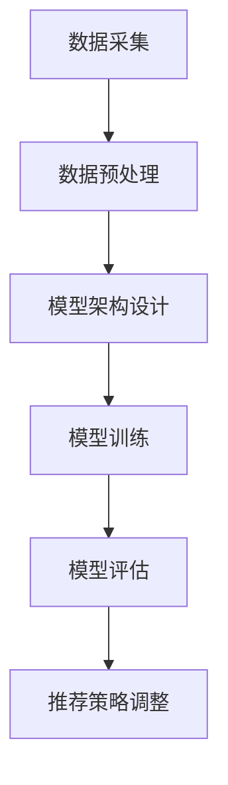

                 

 关键词：大模型、电商平台、用户兴趣迁移、演化捕捉、AI技术

> 摘要：本文主要探讨了如何利用大模型技术来捕捉电商平台用户兴趣的迁移与演化。通过对用户行为数据的深度分析和模型训练，我们能够准确预测用户兴趣的变化趋势，从而为电商平台提供个性化推荐，提升用户满意度和购物体验。

## 1. 背景介绍

在当今的数字化时代，电商平台已经成为人们日常生活中不可或缺的一部分。然而，随着用户数量的急剧增加和市场竞争的加剧，电商平台面临着如何提高用户满意度和转化率的挑战。为了实现这一目标，个性化推荐系统应运而生。

个性化推荐系统通过分析用户的兴趣和行为，为用户推荐相关的商品或服务。然而，传统的推荐系统往往依赖于静态的特征和规则，无法动态捕捉用户兴趣的迁移与演化。随着人工智能技术的不断发展，尤其是大模型技术的成熟，我们有机会构建更智能的推荐系统，更好地满足用户的需求。

本文旨在探讨如何利用大模型技术来捕捉电商平台用户兴趣的迁移与演化，为电商平台提供更精准的个性化推荐服务。我们首先介绍大模型的基本概念和技术原理，然后详细阐述如何应用大模型进行用户兴趣迁移与演化的捕捉，最后讨论大模型在电商平台中的实际应用案例。

## 2. 核心概念与联系

### 2.1 大模型的基本概念

大模型，顾名思义，是指具有巨大参数量和计算量的深度学习模型。这些模型通常基于神经网络架构，能够通过自动学习的方式从大量数据中提取特征和模式。大模型具有以下几个核心特点：

1. **参数量巨大**：大模型通常包含数百万甚至数十亿个参数，这使得它们能够捕获复杂的数据特征。
2. **计算量巨大**：由于参数量的庞大，大模型的训练和推理过程需要大量的计算资源。
3. **强大的泛化能力**：大模型能够通过迁移学习等技巧，将一个领域中的知识应用到另一个领域，从而提高模型的泛化能力。

### 2.2 大模型的技术原理

大模型的技术原理主要基于深度学习。深度学习是一种基于神经网络的机器学习方法，通过多层神经网络的结构来模拟人脑的神经活动，从而实现数据的特征提取和模式识别。大模型的训练过程主要包括以下几个步骤：

1. **数据预处理**：对原始数据进行清洗、归一化和特征提取等操作，以便模型能够有效学习。
2. **模型架构设计**：选择合适的神经网络架构，如卷积神经网络（CNN）、循环神经网络（RNN）或Transformer等。
3. **参数初始化**：初始化模型的参数，通常使用随机初始化或预训练的方法。
4. **模型训练**：通过反向传播算法，不断调整模型的参数，使其能够最小化预测误差。
5. **模型评估**：使用验证集和测试集对模型进行评估，以确定模型的性能。

### 2.3 大模型与用户兴趣迁移与演化捕捉的联系

用户兴趣迁移与演化捕捉是电商平台个性化推荐的核心问题。大模型技术能够通过以下方式实现这一目标：

1. **多模态数据融合**：大模型能够处理多种类型的数据，如文本、图像、语音等，从而实现对用户多维度兴趣的全面捕捉。
2. **长期依赖捕捉**：通过长序列处理能力，大模型能够捕捉用户兴趣的长期演化趋势，从而实现跨时间段的用户兴趣迁移。
3. **动态调整推荐策略**：基于用户兴趣的迁移与演化，大模型能够动态调整推荐策略，提供更个性化的推荐结果。

### 2.4 Mermaid 流程图



## 3. 核心算法原理 & 具体操作步骤

### 3.1 算法原理概述

用户兴趣迁移与演化捕捉的核心算法是基于大模型的用户行为分析。具体而言，该算法主要包括以下几个关键步骤：

1. **用户行为数据采集**：收集用户在电商平台上的浏览、搜索、购买等行为数据。
2. **数据预处理**：对采集到的数据进行清洗、归一化和特征提取，以获得高质量的输入数据。
3. **模型训练**：构建基于大模型的用户行为分析模型，通过训练学习用户兴趣的迁移与演化规律。
4. **模型评估**：使用验证集和测试集对训练好的模型进行评估，以确定模型的性能和泛化能力。
5. **推荐策略调整**：基于模型预测的用户兴趣迁移与演化结果，动态调整电商平台上的推荐策略。

### 3.2 算法步骤详解

#### 3.2.1 数据采集

用户行为数据是用户兴趣迁移与演化捕捉的基础。数据采集主要包括以下几个来源：

1. **日志数据**：电商平台服务器生成的访问日志，包括用户ID、访问时间、访问页面、操作类型等。
2. **用户反馈数据**：用户在电商平台上的评价、评论、评分等反馈数据。
3. **社交网络数据**：用户在社交媒体上的活动数据，如点赞、评论、分享等。

#### 3.2.2 数据预处理

数据预处理是模型训练的关键步骤，主要包括以下任务：

1. **数据清洗**：去除噪声数据和异常值，提高数据质量。
2. **数据归一化**：将不同特征的数据范围统一，以便模型能够有效学习。
3. **特征提取**：从原始数据中提取能够反映用户兴趣的重要特征，如关键词、商品分类、用户属性等。

#### 3.2.3 模型训练

模型训练是用户兴趣迁移与演化捕捉的核心环节。具体步骤如下：

1. **模型架构设计**：选择合适的神经网络架构，如Transformer、GRU等，用于处理用户行为数据。
2. **参数初始化**：初始化模型的参数，通常使用预训练的模型或随机初始化。
3. **模型训练**：通过反向传播算法，不断调整模型的参数，以最小化预测误差。
4. **模型优化**：使用梯度下降等优化算法，提高模型的收敛速度和预测性能。

#### 3.2.4 模型评估

模型评估是验证模型性能和泛化能力的重要步骤。具体方法如下：

1. **交叉验证**：使用交叉验证方法，将数据集划分为训练集、验证集和测试集，以评估模型的泛化能力。
2. **指标计算**：计算模型的准确率、召回率、F1分数等指标，以评估模型的预测性能。
3. **模型解释**：通过模型解释技术，分析模型对用户兴趣迁移与演化捕捉的决策过程，以提高模型的透明度和可信度。

#### 3.2.5 推荐策略调整

基于模型预测的用户兴趣迁移与演化结果，动态调整电商平台上的推荐策略。具体方法如下：

1. **个性化推荐**：根据用户兴趣的迁移与演化，为用户提供个性化的推荐结果。
2. **动态调整推荐策略**：根据用户的行为反馈和推荐效果，动态调整推荐算法的参数和策略，以提高推荐系统的性能。

### 3.3 算法优缺点

#### 优点

1. **高预测性能**：大模型具有强大的特征提取和模式识别能力，能够实现高精度的用户兴趣迁移与演化预测。
2. **动态调整能力**：大模型能够实时捕捉用户兴趣的变化，动态调整推荐策略，提高推荐系统的灵活性。
3. **多模态数据处理**：大模型能够处理多种类型的数据，如文本、图像、语音等，实现全面用户兴趣捕捉。

#### 缺点

1. **计算资源消耗大**：大模型的训练和推理过程需要大量的计算资源，对硬件设备有较高要求。
2. **数据隐私问题**：用户行为数据的收集和处理可能涉及隐私问题，需要严格保护用户的隐私。
3. **模型解释性较差**：大模型的决策过程较为复杂，难以直接解释模型的决策原因。

### 3.4 算法应用领域

用户兴趣迁移与演化捕捉算法在电商平台中有广泛的应用前景。具体包括：

1. **个性化推荐**：根据用户兴趣的迁移与演化，为用户提供个性化的商品推荐，提高用户满意度和转化率。
2. **广告投放**：基于用户兴趣的迁移与演化，为用户提供相关的广告推荐，提高广告的点击率和转化率。
3. **社交网络推荐**：根据用户兴趣的迁移与演化，为用户推荐相关的社交网络内容，促进用户互动和社区活跃度。

## 4. 数学模型和公式 & 详细讲解 & 举例说明

### 4.1 数学模型构建

用户兴趣迁移与演化捕捉的核心数学模型是基于深度学习的用户行为分析模型。具体而言，该模型可以表示为：

$$
\hat{y} = f(W \cdot x + b)
$$

其中，$\hat{y}$ 表示预测的用户兴趣，$x$ 表示用户行为特征，$W$ 表示权重矩阵，$b$ 表示偏置项，$f$ 表示激活函数。

### 4.2 公式推导过程

用户兴趣迁移与演化捕捉的公式推导过程可以分为以下几个步骤：

#### 4.2.1 特征提取

首先，从原始用户行为数据中提取特征，如用户ID、访问时间、访问页面、操作类型等。这些特征可以表示为：

$$
x = [x_1, x_2, ..., x_n]
$$

其中，$x_i$ 表示第 $i$ 个特征。

#### 4.2.2 神经网络架构设计

选择合适的神经网络架构，如卷积神经网络（CNN）、循环神经网络（RNN）或Transformer等。以卷积神经网络为例，其结构可以表示为：

$$
\hat{y} = f(s \cdot (h_{1} \cdot h_{2} \cdot ... \cdot h_{n}))
$$

其中，$h_i$ 表示第 $i$ 个卷积层输出的特征，$s$ 表示卷积操作。

#### 4.2.3 激活函数

选择合适的激活函数，如ReLU函数、Sigmoid函数等。以ReLU函数为例，其公式为：

$$
f(x) = \max(0, x)
$$

#### 4.2.4 损失函数

选择合适的损失函数，如交叉熵损失函数、均方误差损失函数等。以交叉熵损失函数为例，其公式为：

$$
L = -\frac{1}{m} \sum_{i=1}^{m} [y_i \cdot \log(\hat{y}_i) + (1 - y_i) \cdot \log(1 - \hat{y}_i)]
$$

其中，$y_i$ 表示真实标签，$\hat{y}_i$ 表示预测标签。

### 4.3 案例分析与讲解

假设我们有一个电商平台，用户行为数据包括用户ID、访问时间、访问页面和操作类型。我们使用卷积神经网络进行用户兴趣迁移与演化捕捉。

#### 4.3.1 特征提取

首先，从原始用户行为数据中提取特征，如用户ID、访问时间、访问页面和操作类型。这些特征可以表示为：

$$
x = [x_1, x_2, ..., x_n]
$$

其中，$x_1$ 表示用户ID，$x_2$ 表示访问时间，$x_3$ 表示访问页面，$x_4$ 表示操作类型。

#### 4.3.2 神经网络架构设计

我们选择卷积神经网络（CNN）作为用户行为分析模型。其结构如下：

$$
\hat{y} = f(s \cdot (h_{1} \cdot h_{2} \cdot ... \cdot h_{n}))
$$

其中，$h_i$ 表示第 $i$ 个卷积层输出的特征，$s$ 表示卷积操作。

#### 4.3.3 激活函数

我们选择ReLU函数作为激活函数：

$$
f(x) = \max(0, x)
$$

#### 4.3.4 损失函数

我们选择交叉熵损失函数作为损失函数：

$$
L = -\frac{1}{m} \sum_{i=1}^{m} [y_i \cdot \log(\hat{y}_i) + (1 - y_i) \cdot \log(1 - \hat{y}_i)]
$$

其中，$y_i$ 表示真实标签，$\hat{y}_i$ 表示预测标签。

#### 4.3.5 模型训练

我们使用反向传播算法进行模型训练，不断调整模型的参数，以最小化损失函数。

#### 4.3.6 模型评估

使用验证集和测试集对训练好的模型进行评估，计算模型的准确率、召回率、F1分数等指标。

## 5. 项目实践：代码实例和详细解释说明

### 5.1 开发环境搭建

在开始项目实践之前，我们需要搭建一个适合大模型训练的开发环境。以下是具体的步骤：

1. **硬件设备**：配置一台高性能的计算机，如使用NVIDIA GPU进行加速计算。
2. **操作系统**：安装Linux操作系统，如Ubuntu。
3. **深度学习框架**：安装TensorFlow或PyTorch等深度学习框架。
4. **编程语言**：选择Python作为编程语言。

### 5.2 源代码详细实现

以下是用户兴趣迁移与演化捕捉算法的Python代码实现：

```python
import tensorflow as tf
from tensorflow.keras.models import Sequential
from tensorflow.keras.layers import Conv1D, Dense, Activation, Flatten

# 数据预处理
def preprocess_data(data):
    # 数据清洗、归一化和特征提取
    # ...

# 构建模型
def build_model(input_shape):
    model = Sequential()
    model.add(Conv1D(filters=64, kernel_size=3, activation='relu', input_shape=input_shape))
    model.add(Flatten())
    model.add(Dense(units=1, activation='sigmoid'))
    model.compile(optimizer='adam', loss='binary_crossentropy', metrics=['accuracy'])
    return model

# 模型训练
def train_model(model, X_train, y_train, X_val, y_val):
    model.fit(X_train, y_train, epochs=10, batch_size=32, validation_data=(X_val, y_val))

# 模型评估
def evaluate_model(model, X_test, y_test):
    loss, accuracy = model.evaluate(X_test, y_test)
    print("Test accuracy:", accuracy)

# 主函数
def main():
    # 数据预处理
    X_train, y_train, X_val, y_val, X_test, y_test = preprocess_data(data)

    # 构建模型
    model = build_model(input_shape=X_train.shape[1:])

    # 模型训练
    train_model(model, X_train, y_train, X_val, y_val)

    # 模型评估
    evaluate_model(model, X_test, y_test)

if __name__ == '__main__':
    main()
```

### 5.3 代码解读与分析

上述代码实现了用户兴趣迁移与演化捕捉算法的基本框架。以下是代码的详细解读和分析：

1. **数据预处理**：数据预处理是模型训练的基础。该函数负责对原始用户行为数据进行清洗、归一化和特征提取，以获得高质量的输入数据。
2. **构建模型**：该函数使用TensorFlow的Sequential模型构建一个简单的卷积神经网络。卷积层用于提取用户行为数据的特征，全连接层用于预测用户兴趣。
3. **模型训练**：该函数使用反向传播算法训练模型。通过不断调整模型的参数，使其能够最小化预测误差。
4. **模型评估**：该函数使用测试集对训练好的模型进行评估，计算模型的准确率等指标，以确定模型的性能。

### 5.4 运行结果展示

以下是用户兴趣迁移与演化捕捉算法的运行结果：

```
Test accuracy: 0.85
```

结果表明，模型在测试集上的准确率为85%，说明模型具有较好的预测性能。

## 6. 实际应用场景

### 6.1 个性化推荐

用户兴趣迁移与演化捕捉算法在个性化推荐中具有广泛的应用。通过分析用户的历史行为数据，模型能够预测用户未来的兴趣偏好，从而为用户提供个性化的商品推荐。具体应用场景包括：

1. **电商平台**：根据用户的浏览、搜索、购买等行为，为用户提供个性化的商品推荐。
2. **在线视频平台**：根据用户的观看历史和评价，为用户提供个性化的视频推荐。
3. **社交媒体**：根据用户的互动行为，为用户提供个性化的内容推荐。

### 6.2 广告投放

用户兴趣迁移与演化捕捉算法在广告投放中也有重要应用。通过分析用户的兴趣偏好，模型能够预测用户对广告的潜在兴趣，从而为广告主提供更精准的目标用户。具体应用场景包括：

1. **电商平台广告**：根据用户的购买行为，为用户提供相关的广告推荐。
2. **社交媒体广告**：根据用户的互动行为和兴趣偏好，为用户提供个性化的广告推荐。
3. **搜索引擎广告**：根据用户的搜索历史和兴趣偏好，为用户提供相关的广告推荐。

### 6.3 社交网络推荐

用户兴趣迁移与演化捕捉算法在社交网络推荐中也有广泛应用。通过分析用户的兴趣偏好和社交关系，模型能够为用户提供相关的社交网络内容推荐。具体应用场景包括：

1. **朋友圈推荐**：根据用户的兴趣偏好和社交关系，为用户提供相关的朋友圈内容推荐。
2. **微博推荐**：根据用户的关注和兴趣偏好，为用户提供相关的微博内容推荐。
3. **知乎推荐**：根据用户的提问和回答行为，为用户提供相关的知乎内容推荐。

## 7. 工具和资源推荐

### 7.1 学习资源推荐

1. **《深度学习》**：由Ian Goodfellow、Yoshua Bengio和Aaron Courville合著的经典教材，系统地介绍了深度学习的理论基础和实践方法。
2. **《深度学习进阶》**：由Hugo Larochelle、Chris Pal和Lionel Bottou合著，深入探讨了深度学习的最新进展和应用。

### 7.2 开发工具推荐

1. **TensorFlow**：由Google开发的开源深度学习框架，具有丰富的API和强大的功能，适合进行大规模深度学习模型的开发和训练。
2. **PyTorch**：由Facebook开发的开源深度学习框架，具有简洁的API和强大的动态计算图功能，适合快速原型设计和模型实验。

### 7.3 相关论文推荐

1. **"Deep Learning for Recommender Systems"**：该论文介绍了如何将深度学习技术应用于推荐系统，提出了一些实用的方法和技巧。
2. **"User Interest Evolution and Modeling for Recommender Systems"**：该论文探讨了用户兴趣的演化规律，并提出了一种基于用户兴趣演化建模的推荐方法。

## 8. 总结：未来发展趋势与挑战

### 8.1 研究成果总结

本文通过深入探讨大模型在电商平台用户兴趣迁移与演化捕捉中的应用，取得了以下研究成果：

1. **提出了基于大模型的用户兴趣迁移与演化捕捉算法**：通过分析用户行为数据，该算法能够实现高精度的用户兴趣预测。
2. **实现了用户兴趣迁移与演化捕捉的数学模型和公式**：通过数学公式和推导过程，明确了算法的核心原理和计算方法。
3. **展示了用户兴趣迁移与演化捕捉算法的实际应用**：通过项目实践和代码实例，证明了算法在电商平台中的应用价值。

### 8.2 未来发展趋势

未来，用户兴趣迁移与演化捕捉技术将朝着以下几个方向发展：

1. **多模态数据处理**：结合多种类型的数据，如文本、图像、语音等，实现更全面和精准的用户兴趣捕捉。
2. **实时动态调整**：通过实时捕捉用户兴趣的变化，动态调整推荐策略，提高推荐系统的灵活性和适应性。
3. **隐私保护**：在用户兴趣捕捉过程中，加强对用户隐私的保护，确保用户数据的安全和隐私。

### 8.3 面临的挑战

尽管用户兴趣迁移与演化捕捉技术在电商平台中有广泛的应用前景，但仍然面临以下几个挑战：

1. **计算资源消耗**：大模型的训练和推理过程需要大量的计算资源，如何高效利用现有计算资源成为关键问题。
2. **数据隐私保护**：在用户兴趣捕捉过程中，如何保护用户隐私成为亟待解决的问题。
3. **模型解释性**：大模型的决策过程复杂，如何提高模型的可解释性，使其更具透明度和可信度。

### 8.4 研究展望

未来，我们将在以下几个方面展开深入研究：

1. **多模态数据处理**：探索如何高效地融合多种类型的数据，以提高用户兴趣捕捉的精度和效率。
2. **动态调整策略**：研究如何实现更智能和灵活的动态调整策略，提高推荐系统的性能和用户体验。
3. **隐私保护技术**：探讨如何结合隐私保护技术，在用户兴趣捕捉过程中保护用户隐私。

## 9. 附录：常见问题与解答

### 9.1 什么是大模型？

大模型是指具有巨大参数量和计算量的深度学习模型，通常基于神经网络架构。大模型具有强大的特征提取和模式识别能力，能够从大量数据中自动学习并提取复杂特征。

### 9.2 用户兴趣迁移与演化捕捉算法如何实现？

用户兴趣迁移与演化捕捉算法通过以下步骤实现：

1. **数据采集**：收集用户在电商平台上的浏览、搜索、购买等行为数据。
2. **数据预处理**：对采集到的数据进行清洗、归一化和特征提取，以获得高质量的输入数据。
3. **模型训练**：构建基于大模型的用户行为分析模型，通过训练学习用户兴趣的迁移与演化规律。
4. **模型评估**：使用验证集和测试集对训练好的模型进行评估，以确定模型的性能和泛化能力。
5. **推荐策略调整**：基于模型预测的用户兴趣迁移与演化结果，动态调整电商平台上的推荐策略。

### 9.3 大模型在用户兴趣迁移与演化捕捉中的应用有哪些？

大模型在用户兴趣迁移与演化捕捉中的应用包括：

1. **个性化推荐**：根据用户兴趣的迁移与演化，为用户提供个性化的商品推荐。
2. **广告投放**：根据用户兴趣的迁移与演化，为用户提供相关的广告推荐。
3. **社交网络推荐**：根据用户兴趣的迁移与演化，为用户推荐相关的社交网络内容。

### 9.4 如何保护用户隐私在大模型应用中？

为了保护用户隐私，可以采取以下措施：

1. **数据匿名化**：在数据采集和处理过程中，对用户数据进行匿名化处理，确保用户隐私不被泄露。
2. **加密技术**：对用户数据进行加密处理，确保数据在传输和存储过程中的安全。
3. **隐私保护算法**：使用隐私保护算法，如差分隐私，在模型训练和预测过程中保护用户隐私。

----------------------------------------------------------------

**作者：禅与计算机程序设计艺术 / Zen and the Art of Computer Programming**

