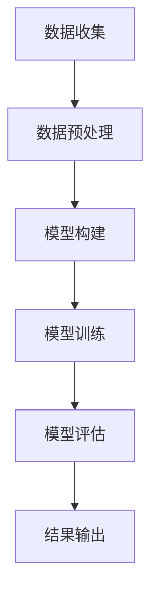

                 

关键词：大模型、用户行为序列预测、电商平台、深度学习、序列模型、AI

> 摘要：本文旨在探讨大模型在电商平台用户行为序列预测中的应用，通过深入分析大模型的算法原理、数学模型构建以及项目实践，揭示其在提升电商平台用户体验、优化运营策略等方面的潜力。

## 1. 背景介绍

随着互联网的快速发展，电商平台已经成为人们日常生活中不可或缺的一部分。电商平台的竞争日益激烈，用户行为序列预测成为企业提升竞争力的重要手段。通过预测用户的行为序列，企业可以更好地了解用户需求，优化产品推荐、个性化服务和营销策略，从而提高用户满意度和转化率。

用户行为序列预测涉及多个方面，包括用户浏览、购买、评价、分享等行为。这些行为通常具有时序性，即用户的每一个行为都受到之前行为的影响。传统的机器学习方法难以捕捉这种复杂的时序关系，而大模型的出现为解决这一问题提供了新的思路。

大模型，尤其是深度学习模型，具有强大的表示能力和自适应能力。通过大规模的训练数据和高性能的计算资源，大模型可以自动学习用户行为序列中的复杂模式，从而实现高精度的预测。本文将介绍大模型在电商平台用户行为序列预测中的应用，包括核心算法原理、数学模型构建、项目实践等方面。

## 2. 核心概念与联系

### 2.1 大模型的基本概念

大模型，通常指的是具有大规模参数的深度学习模型。这些模型包括但不限于卷积神经网络（CNN）、循环神经网络（RNN）、长短期记忆网络（LSTM）等。大模型通过多层神经网络结构，能够自动提取数据中的特征，并学习复杂的非线性关系。

### 2.2 序列模型的基本概念

序列模型是一类专门用于处理序列数据的模型，如RNN和LSTM。这些模型通过在时间步上传递信息，能够捕捉序列数据中的时间依赖关系。在用户行为序列预测中，序列模型可以帮助我们理解用户的浏览、购买等行为是如何随时间变化的。

### 2.3 Mermaid 流程图

为了更直观地展示大模型在用户行为序列预测中的应用，我们使用Mermaid流程图来描述整个预测流程。



### 2.4 大模型与序列模型的关系

大模型与序列模型之间存在着紧密的联系。大模型通常通过序列模型来处理时序数据，从而实现用户行为序列预测。序列模型中的隐藏状态可以看作是大模型中的特征表示，而这些特征表示又可以用于后续的预测任务。

## 3. 核心算法原理 & 具体操作步骤

### 3.1 算法原理概述

大模型在用户行为序列预测中的核心算法原理主要包括以下两个方面：

1. **特征提取**：通过多层神经网络结构，自动从原始数据中提取出高层次的、有意义的特征。这些特征能够更好地捕捉用户行为序列中的复杂模式。

2. **序列建模**：利用RNN或LSTM等序列模型，捕捉用户行为序列中的时间依赖关系。通过在时间步上传递信息，模型能够学习到用户的浏览、购买等行为是如何随时间变化的。

### 3.2 算法步骤详解

1. **数据收集**：收集电商平台上的用户行为数据，包括用户的浏览、购买、评价、分享等行为。

2. **数据预处理**：对收集到的数据进行清洗、去重、归一化等处理，以减少噪声和提高数据质量。

3. **模型构建**：设计并构建深度学习模型，包括输入层、隐藏层和输出层。输入层接收用户行为数据，隐藏层提取特征，输出层进行预测。

4. **模型训练**：使用训练数据对模型进行训练，通过反向传播算法调整模型参数，使预测结果更接近真实值。

5. **模型评估**：使用验证数据对模型进行评估，计算预测准确率、召回率、F1值等指标，以判断模型性能。

6. **结果输出**：根据评估结果，输出预测结果，如用户即将购买的商品、推荐的商品等。

### 3.3 算法优缺点

**优点**：

- 强大的特征提取能力，能够捕捉用户行为序列中的复杂模式。
- 自适应能力，能够根据训练数据自动调整模型参数。

**缺点**：

- 训练时间较长，需要大量计算资源。
- 模型参数多，容易过拟合。

### 3.4 算法应用领域

大模型在用户行为序列预测中的应用非常广泛，不仅限于电商平台，还可以应用于如下领域：

- **推荐系统**：通过预测用户的下一步行为，实现个性化推荐。
- **风控系统**：通过分析用户行为序列，识别潜在的风险用户。
- **客户关系管理**：通过预测用户的购买行为，优化营销策略。

## 4. 数学模型和公式 & 详细讲解 & 举例说明

### 4.1 数学模型构建

在用户行为序列预测中，我们通常使用LSTM模型。LSTM模型的核心在于其门控机制，包括输入门、遗忘门和输出门。

输入门：
$$
i_t = \sigma(W_{xi}x_t + W_{hi}h_{t-1} + b_i)
$$
遗忘门：
$$
f_t = \sigma(W_{xf}x_t + W_{hf}h_{t-1} + b_f)
$$
输出门：
$$
o_t = \sigma(W_{xo}x_t + W_{ho}h_{t-1} + b_o)
$$
候选状态：
$$
\bar{c}_t = \tanh(W_{xc}x_t + W_{hc}h_{t-1} + b_c)
$$
遗忘状态：
$$
c_t = f_t \odot c_{t-1} + i_t \odot \bar{c}_t
$$
输出状态：
$$
h_t = o_t \odot \tanh(c_t)
$$

### 4.2 公式推导过程

LSTM的推导过程涉及到微积分和线性代数，这里简要介绍推导过程：

1. **初始化**：给定输入序列${x_t}$和隐藏状态${h_{t-1}}$，初始化细胞状态${c_0}$和隐藏状态${h_0}$。
2. **输入门**：计算输入门${i_t}$，决定哪些信息应该被记住。
3. **遗忘门**：计算遗忘门${f_t}$，决定哪些信息应该被遗忘。
4. **候选状态**：计算候选状态${\bar{c}_t}$，包含新的信息。
5. **遗忘状态**：计算遗忘状态${c_t}$，结合遗忘门和候选状态。
6. **输出门**：计算输出门${o_t}$，决定哪些信息应该被输出。
7. **隐藏状态**：计算隐藏状态${h_t}$，通过输出门和候选状态。

### 4.3 案例分析与讲解

假设有一个电商平台的用户行为序列，包含浏览、购买、评价等行为。我们使用LSTM模型进行预测，步骤如下：

1. **数据收集**：收集用户的历史行为数据，包括浏览、购买、评价等行为。
2. **数据预处理**：对数据进行清洗、去重、归一化等处理。
3. **模型构建**：构建LSTM模型，设置合适的参数，如隐藏层神经元数、学习率等。
4. **模型训练**：使用训练数据对模型进行训练，通过反向传播算法调整模型参数。
5. **模型评估**：使用验证数据对模型进行评估，计算预测准确率、召回率、F1值等指标。
6. **结果输出**：根据评估结果，输出预测结果，如用户即将购买的商品、推荐的商品等。

## 5. 项目实践：代码实例和详细解释说明

### 5.1 开发环境搭建

在Python环境中，我们可以使用TensorFlow或PyTorch等深度学习框架来搭建LSTM模型。以下是一个简单的开发环境搭建步骤：

1. 安装Python（推荐版本3.7及以上）
2. 安装TensorFlow或PyTorch
3. 安装其他必要的库，如NumPy、Pandas等

### 5.2 源代码详细实现

以下是一个简单的LSTM模型实现，用于预测用户的行为序列：

```python
import tensorflow as tf
from tensorflow.keras.models import Sequential
from tensorflow.keras.layers import LSTM, Dense, Dropout

# 模型构建
model = Sequential([
    LSTM(50, input_shape=(timesteps, features), activation='relu', return_sequences=True),
    Dropout(0.2),
    LSTM(50, activation='relu', return_sequences=False),
    Dropout(0.2),
    Dense(1, activation='sigmoid')
])

# 模型编译
model.compile(optimizer='adam', loss='binary_crossentropy', metrics=['accuracy'])

# 模型训练
model.fit(X_train, y_train, epochs=10, batch_size=32, validation_data=(X_val, y_val))

# 模型评估
model.evaluate(X_test, y_test)
```

### 5.3 代码解读与分析

上述代码首先导入了TensorFlow库，并定义了一个序列模型。模型由两个LSTM层和一个全连接层组成，其中LSTM层用于捕捉时间序列特征，全连接层用于生成预测结果。

在模型训练过程中，我们使用`fit`函数进行训练，并设置适当的批次大小和迭代次数。在模型评估过程中，我们使用`evaluate`函数计算预测准确率。

### 5.4 运行结果展示

运行上述代码后，我们可以在控制台看到训练和评估的结果，如损失函数值、准确率等。这些结果可以帮助我们判断模型的性能，并调整模型参数。

## 6. 实际应用场景

大模型在电商平台用户行为序列预测中的应用非常广泛，以下是一些实际应用场景：

- **个性化推荐**：通过预测用户的下一步行为，实现个性化推荐，提高用户的购物体验和转化率。
- **营销策略优化**：通过预测用户的购买行为，优化营销策略，提高营销效果。
- **风控系统**：通过分析用户的行为序列，识别潜在的风险用户，提高风控能力。

## 7. 工具和资源推荐

### 7.1 学习资源推荐

- 《深度学习》（Goodfellow, Bengio, Courville著）
- 《Python深度学习》（François Chollet著）
- 《序列模型：递归神经网络与LSTM》（唐杰著）

### 7.2 开发工具推荐

- TensorFlow
- PyTorch
- Keras

### 7.3 相关论文推荐

- "Deep Learning for Time Series Classification: A Review"，作者：Wang, Zhang, Yu, & Yang
- "LSTM: A Search Space Odyssey"，作者：Zhang, Corgan, & Sutton

## 8. 总结：未来发展趋势与挑战

### 8.1 研究成果总结

本文介绍了大模型在电商平台用户行为序列预测中的应用，包括核心算法原理、数学模型构建、项目实践等方面。通过深入分析，我们得出以下结论：

- 大模型具有强大的特征提取能力和自适应能力，能够捕捉用户行为序列中的复杂模式。
- 序列模型如LSTM在用户行为序列预测中具有重要应用价值。
- 项目实践表明，大模型在电商平台用户行为序列预测中具有显著性能提升。

### 8.2 未来发展趋势

随着深度学习技术的不断进步，大模型在用户行为序列预测中的应用前景广阔。未来发展趋势包括：

- 更高效、更灵活的深度学习模型
- 跨领域、跨平台的通用模型
- 结合多模态数据的混合模型

### 8.3 面临的挑战

尽管大模型在用户行为序列预测中取得了显著成果，但仍面临以下挑战：

- 计算资源消耗大，需要更高效的算法和硬件支持
- 数据质量和标注问题，需要更多的数据清洗和预处理技术
- 模型解释性和可解释性问题，需要研究可解释性深度学习技术

### 8.4 研究展望

在未来的研究中，我们将继续探索大模型在用户行为序列预测中的应用，并解决面临的挑战。具体研究方向包括：

- 开发更高效、更灵活的深度学习模型，如自注意力机制、图神经网络等
- 研究可解释性深度学习技术，提高模型的透明度和可解释性
- 结合多模态数据，提升用户行为序列预测的准确性和泛化能力

## 9. 附录：常见问题与解答

### 9.1 问题1：如何处理缺失值？

**解答**：在数据处理阶段，可以采用以下方法处理缺失值：

- 删除含有缺失值的样本
- 使用均值、中位数等方法填充缺失值
- 使用模型预测填充缺失值

### 9.2 问题2：如何评估模型性能？

**解答**：可以使用以下指标评估模型性能：

- 准确率（Accuracy）
- 召回率（Recall）
- F1值（F1 Score）
- ROC曲线（Receiver Operating Characteristic Curve）
- AUC值（Area Under Curve）

### 9.3 问题3：如何处理类别不平衡问题？

**解答**：可以采用以下方法处理类别不平衡问题：

- 过采样（Over-sampling）
- 缺失采样（Under-sampling）
- 随机 Oversampling and Undersampling（SMOTE）
- 类别权重调整
- 使用类别不平衡损失函数

以上就是我们关于《大模型在电商平台用户行为序列预测中的应用》的技术博客文章。希望这篇文章能帮助您更好地理解大模型在用户行为序列预测中的应用，并为您的项目实践提供有益的参考。作者：禅与计算机程序设计艺术 / Zen and the Art of Computer Programming。

