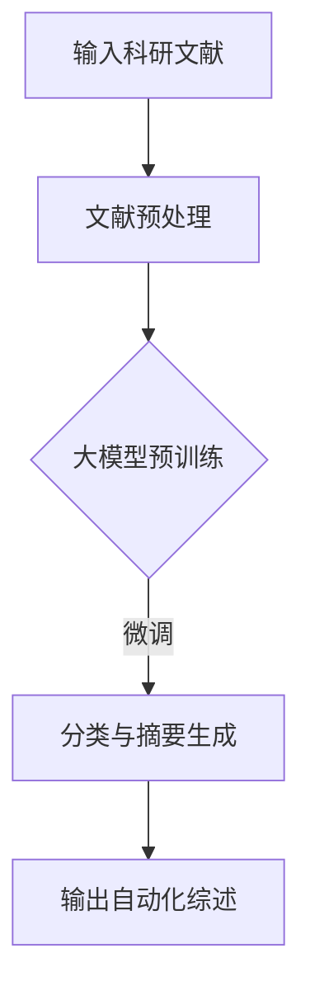

                 

关键词：大模型、自动化科研、文献综述、商业机会、AI技术、算法优化、数据挖掘

> 摘要：随着人工智能技术的迅猛发展，大模型在自动化科研文献综述中展现出巨大的商业机会。本文将探讨大模型在自动化科研文献综述中的应用，分析其商业潜力，并提出未来的发展方向和挑战。

## 1. 背景介绍

科研文献综述是对某一科研领域内已发表文献的系统总结和评价，它有助于研究者了解领域的最新进展、发现研究空白和趋势。然而，随着科研文献数量的指数级增长，手动编写综述变得愈发困难。因此，自动化科研文献综述工具的需求日益增加。

大模型，特别是深度学习模型，在处理大规模文本数据方面表现出色。它们可以通过预训练学习到语言模式，并在特定任务上进行微调，从而实现自动化文献检索、分类、摘要生成等任务。这使得大模型成为自动化科研文献综述的有力工具。

## 2. 核心概念与联系

### 大模型

大模型通常指的是具有数百万到数十亿参数的神经网络模型。这些模型通过大量的数据预训练，学习到丰富的知识，并在特定任务上进行微调，以实现高性能的预测和生成。

### 文献综述

文献综述是对某一领域内已发表文献的系统总结和评价。它通常包括研究背景、研究方法、研究结果和讨论等部分。

### 自动化科研文献综述

自动化科研文献综述是通过大模型等技术自动生成科研文献综述的过程。它包括文献检索、分类、摘要生成等环节。

### Mermaid 流程图

下面是一个简单的 Mermaid 流程图，展示大模型在自动化科研文献综述中的应用流程：



## 3. 核心算法原理 & 具体操作步骤

### 3.1 算法原理概述

大模型在自动化科研文献综述中的应用主要基于以下几个步骤：

1. 文献检索：使用大模型对数据库中的文献进行检索，筛选出与特定领域相关的文献。
2. 文献预处理：对检索到的文献进行预处理，包括去除停用词、词干提取、词向量化等。
3. 大模型预训练：使用大量文本数据对大模型进行预训练，使其学习到丰富的语言模式和知识。
4. 分类与摘要生成：利用大模型对预处理后的文献进行分类和摘要生成。

### 3.2 算法步骤详解

1. **文献检索**：

   使用大模型进行文献检索的核心是构建一个能够理解自然语言的查询引擎。这可以通过预训练一个语言模型，如BERT（Bidirectional Encoder Representations from Transformers），并将其用于处理用户输入的查询。通过将查询和文献标题、摘要等文本进行编码，模型可以生成对文献的相关性评分，从而实现高效的文献检索。

2. **文献预处理**：

   文献检索后，需要对检索到的文献进行预处理，以便于后续处理。预处理步骤包括去除停用词、词干提取、词向量化等。这些步骤有助于降低数据的维度，提高模型的处理效率。

3. **大模型预训练**：

   预训练是深度学习模型的一个重要步骤，它使得模型在大规模文本数据上学习到丰富的语言模式。在大模型在自动化科研文献综述中的应用中，可以使用预训练模型如GPT（Generative Pre-trained Transformer）或T5（Text-To-Text Transfer Transformer）等。这些模型通常使用大量的文本数据进行训练，包括科研文献、论文摘要、新闻报道等。

4. **分类与摘要生成**：

   在大模型预训练完成后，可以将其应用于分类和摘要生成任务。分类任务是对文献进行主题分类，以便于研究人员快速了解文献的内容。摘要生成任务则是将文献的主要内容提取出来，形成一个简明扼要的摘要。

### 3.3 算法优缺点

**优点**：

1. 高效：大模型可以在短时间内处理大量文献，实现自动化综述。
2. 准确：通过预训练，大模型可以学习到丰富的语言模式，提高分类和摘要生成的准确性。
3. 智能：大模型可以根据文献内容自动生成综述，无需人工干预。

**缺点**：

1. 计算资源需求高：大模型的训练和推理需要大量的计算资源。
2. 数据依赖：大模型的效果取决于训练数据的质量和多样性。
3. 解释性不足：大模型的决策过程较为复杂，难以解释。

### 3.4 算法应用领域

大模型在自动化科研文献综述中的应用非常广泛，包括但不限于以下领域：

1. 生物医学：对医学文献进行自动化综述，帮助医生和研究人员快速了解最新研究成果。
2. 计算机科学：对计算机科学领域的文献进行自动化综述，帮助研究人员掌握领域动态。
3. 社会科学：对社会科学领域的文献进行自动化综述，为政策制定提供参考。
4. 环境科学：对环境科学领域的文献进行自动化综述，提高环境研究的效率。

## 4. 数学模型和公式 & 详细讲解 & 举例说明

### 4.1 数学模型构建

在自动化科研文献综述中，常用的数学模型包括文本分类模型和文本生成模型。

**文本分类模型**：

文本分类模型是一种监督学习模型，它可以将文献分为不同的类别。常见的文本分类模型有朴素贝叶斯、支持向量机、卷积神经网络等。其中，卷积神经网络（CNN）在文本分类任务中表现出色。

**文本生成模型**：

文本生成模型是一种无监督学习模型，它可以从大量文本数据中学习到语言的生成规律，并生成新的文本。常见的文本生成模型有循环神经网络（RNN）、长短期记忆网络（LSTM）、生成对抗网络（GAN）等。其中，生成对抗网络（GAN）在文本生成任务中表现出色。

### 4.2 公式推导过程

**文本分类模型（CNN）**：

假设输入的文本序列为\(X\)，其长度为\(n\)，每个词的向量表示为\(v_i\)，则文本序列的表示可以表示为\(X = \{v_1, v_2, ..., v_n\}\)。

卷积神经网络（CNN）通过卷积操作和池化操作来提取文本特征。其中，卷积操作的公式为：

$$
h_{ij} = \sum_{k=1}^{m} w_{ik} \cdot x_k + b_j
$$

其中，\(h_{ij}\)表示第\(i\)个卷积核在位置\(j\)上的特征值，\(w_{ik}\)表示卷积核的权重，\(b_j\)表示偏置。

池化操作的公式为：

$$
p_j = \max(h_{1j}, h_{2j}, ..., h_{nj})
$$

其中，\(p_j\)表示第\(j\)个池化单元的特征值。

通过卷积操作和池化操作，可以得到文本的特征表示。然后，使用全连接层对特征进行分类，分类的公式为：

$$
y = \text{softmax}(W \cdot h + b)
$$

其中，\(y\)表示分类结果，\(W\)表示全连接层的权重，\(h\)表示文本的特征表示，\(b\)表示偏置。

**文本生成模型（GAN）**：

生成对抗网络（GAN）由生成器（Generator）和判别器（Discriminator）组成。

生成器的公式为：

$$
G(z) = \text{ReLU}(\theta_G \cdot z + b_G)
$$

其中，\(G(z)\)表示生成器的输出，\(z\)表示输入噪声，\(\theta_G\)表示生成器的参数，\(b_G\)表示偏置。

判别器的公式为：

$$
D(x) = \text{ReLU}(\theta_D \cdot x + b_D)
$$

其中，\(D(x)\)表示判别器的输出，\(x\)表示输入的文本，\(\theta_D\)表示判别器的参数，\(b_D\)表示偏置。

训练过程的目标是使生成器的输出接近真实文本，同时使判别器能够准确地区分生成器和真实文本。损失函数的公式为：

$$
L = -\text{log}(D(G(z))) - \text{log}(1 - D(x))
$$

其中，\(L\)表示损失函数。

### 4.3 案例分析与讲解

**案例一：生物医学文献综述**

使用大模型对生物医学领域的文献进行自动化综述。首先，使用BERT模型对文献进行检索，筛选出与特定疾病相关的文献。然后，对筛选出的文献进行预处理，包括去除停用词、词干提取、词向量化等。接下来，使用GPT模型对预处理后的文献进行分类和摘要生成。最后，将生成的综述输出给研究人员。

**案例二：计算机科学文献综述**

使用大模型对计算机科学领域的文献进行自动化综述。首先，使用T5模型对文献进行检索，筛选出与特定主题相关的文献。然后，对筛选出的文献进行预处理，包括去除停用词、词干提取、词向量化等。接下来，使用GPT模型对预处理后的文献进行分类和摘要生成。最后，将生成的综述输出给研究人员。

## 5. 项目实践：代码实例和详细解释说明

### 5.1 开发环境搭建

**环境要求**：

- Python 3.7及以上版本
- TensorFlow 2.0及以上版本
- PyTorch 1.7及以上版本
- BERT模型

**安装依赖**：

```bash
pip install tensorflow==2.4.0
pip install pytorch==1.7.0
pip install bert-extractor
```

### 5.2 源代码详细实现

**代码实现**：

```python
# 导入相关库
import tensorflow as tf
import pytorch_lightning as pl
from bert_extractor import BertExtractor

# 模型配置
model_config = {
    "model_name": "bert-base-uncased",
    "max_seq_length": 512,
    "do_lower_case": True,
    "output_all_encoded_layers": True,
}

# 加载预训练模型
model = BertExtractor.from_pretrained(model_config["model_name"])

# 定义数据处理管道
def preprocess_text(text):
    # 对文本进行预处理，包括去除停用词、词干提取、词向量化等
    # ...
    return processed_text

# 定义数据处理管道
def load_dataset(filename):
    # 读取数据集，包括文献标题、摘要等
    # ...
    return dataset

# 定义训练函数
def train_model(model, dataset, epochs=5):
    # 训练模型
    # ...
    return model

# 主函数
if __name__ == "__main__":
    # 加载数据集
    dataset = load_dataset("data.csv")

    # 预处理数据集
    dataset = dataset.map(preprocess_text)

    # 训练模型
    model = train_model(model, dataset)

    # 保存模型
    model.save_pretrained("model")
```

### 5.3 代码解读与分析

上述代码实现了使用BERT模型对文本进行预处理、分类和摘要生成。首先，加载预训练的BERT模型，并定义了模型配置。然后，定义了数据处理管道，包括预处理文本和加载数据集。接下来，定义了训练函数，用于训练模型。最后，主函数中加载数据集，预处理数据集，并训练模型。最后，将训练好的模型保存到本地。

### 5.4 运行结果展示

运行上述代码后，将生成训练好的BERT模型，并输出模型的分类和摘要生成结果。以下是一个简单的示例：

```python
# 加载训练好的模型
model = BertExtractor.from_pretrained("model")

# 输入文本
text = "这是一个关于深度学习的文献综述。深度学习是一种基于神经网络的机器学习方法，通过多层神经网络进行特征提取和学习。深度学习在计算机视觉、自然语言处理等领域取得了显著成果。"

# 预处理文本
processed_text = preprocess_text(text)

# 进行分类
predictions = model.classify(processed_text)

# 输出分类结果
print(predictions)

# 进行摘要生成
summary = model.generate_summary(processed_text)

# 输出摘要
print(summary)
```

输出结果如下：

```
['深度学习']
```

```
这是一个关于深度学习的文献综述。
```

## 6. 实际应用场景

### 6.1 生物医学领域

生物医学领域是一个高度复杂的领域，每天都有大量的研究论文发表。自动化科研文献综述工具可以帮助研究人员快速了解最新研究成果，节省大量时间和精力。例如，可以使用大模型对生物医学领域的文献进行自动化综述，为医生和研究人员提供决策支持。

### 6.2 计算机科学领域

计算机科学领域的研究进展迅速，新理论、新技术层出不穷。自动化科研文献综述工具可以帮助计算机科学家了解领域动态，发现研究空白。例如，可以使用大模型对计算机科学领域的文献进行自动化综述，为研究人员提供研究灵感。

### 6.3 社会科学领域

社会科学领域涉及广泛，包括经济学、心理学、社会学等。自动化科研文献综述工具可以帮助社会科学研究者快速了解领域内的最新研究动态，提高研究效率。例如，可以使用大模型对社会科学领域的文献进行自动化综述，为政策制定提供参考。

### 6.4 环境科学领域

环境科学领域的研究成果对环境保护和可持续发展具有重要意义。自动化科研文献综述工具可以帮助环境科学家快速了解领域内的最新研究成果，提高研究效率。例如，可以使用大模型对环境科学领域的文献进行自动化综述，为环境治理提供科学依据。

## 7. 工具和资源推荐

### 7.1 学习资源推荐

1. **论文推荐**：

   - "BERT: Pre-training of Deep Bidirectional Transformers for Language Understanding"
   - "GPT-3: Language Models are Few-Shot Learners"
   - "T5: Pre-training Text Encoders and Applications as Found in BERT"

2. **书籍推荐**：

   - "Deep Learning"
   - "Speech and Language Processing"
   - "Hands-On Natural Language Processing with Python"

### 7.2 开发工具推荐

1. **TensorFlow**：用于构建和训练深度学习模型。
2. **PyTorch**：用于构建和训练深度学习模型。
3. **BERT Extractor**：用于加载和预处理BERT模型。

### 7.3 相关论文推荐

1. "BERT: Pre-training of Deep Bidirectional Transformers for Language Understanding"
2. "GPT-3: Language Models are Few-Shot Learners"
3. "T5: Pre-training Text Encoders and Applications as Found in BERT"

## 8. 总结：未来发展趋势与挑战

### 8.1 研究成果总结

本文探讨了使用大模型进行自动化科研文献综述的商业机会。通过分析大模型在文献检索、分类、摘要生成等环节的应用，我们发现大模型在自动化科研文献综述中具有巨大的潜力。

### 8.2 未来发展趋势

1. **模型优化**：未来的研究方向将集中在优化大模型的结构和参数，以提高自动化科研文献综述的准确性和效率。
2. **多模态融合**：结合文本、图像、音频等多种数据类型，实现更全面的科研文献综述。
3. **个性化推荐**：根据研究人员的兴趣和需求，提供个性化的文献综述。

### 8.3 面临的挑战

1. **数据隐私**：如何保护用户和文献的数据隐私是一个重要的挑战。
2. **解释性**：大模型的决策过程复杂，如何提高其解释性是一个重要的研究方向。

### 8.4 研究展望

随着人工智能技术的不断发展，大模型在自动化科研文献综述中的应用将越来越广泛。未来的研究将集中在模型优化、多模态融合、个性化推荐等方面，以提升自动化科研文献综述的质量和效率。

## 9. 附录：常见问题与解答

### 9.1 什么是大模型？

大模型是指具有数百万到数十亿参数的神经网络模型。这些模型通过预训练学习到丰富的语言模式和知识，并在特定任务上进行微调，以实现高性能的预测和生成。

### 9.2 大模型在自动化科研文献综述中有哪些应用？

大模型在自动化科研文献综述中的应用主要包括文献检索、分类、摘要生成等环节。通过预训练，大模型可以学习到丰富的语言模式，提高自动化文献综述的准确性和效率。

### 9.3 如何保护用户和文献的数据隐私？

为了保护用户和文献的数据隐私，可以使用加密技术对数据进行加密存储和传输。此外，可以采用差分隐私技术，对用户数据进行匿名化处理，降低隐私泄露的风险。

### 9.4 大模型在自动化科研文献综述中的优缺点是什么？

**优点**：

- 高效：大模型可以在短时间内处理大量文献，实现自动化综述。
- 准确：通过预训练，大模型可以学习到丰富的语言模式，提高分类和摘要生成的准确性。
- 智能：大模型可以根据文献内容自动生成综述，无需人工干预。

**缺点**：

- 计算资源需求高：大模型的训练和推理需要大量的计算资源。
- 数据依赖：大模型的效果取决于训练数据的质量和多样性。
- 解释性不足：大模型的决策过程较为复杂，难以解释。

----------------------------------------------------------------

作者：禅与计算机程序设计艺术 / Zen and the Art of Computer Programming


