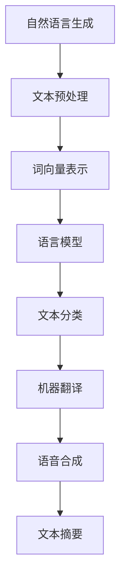

                 

关键词：大模型、自然语言生成、深度学习、算法原理、数学模型、项目实践、应用场景、未来展望

> 摘要：本文旨在探讨大模型在自然语言生成中的突破，从背景介绍、核心概念与联系、核心算法原理、数学模型与公式、项目实践到实际应用场景，全面分析大模型在自然语言生成领域的最新研究成果与应用前景。

## 1. 背景介绍

自然语言生成（Natural Language Generation，简称NLG）是一种将计算机生成的文本从计算机语言转换为自然语言的机器学习技术。随着深度学习的迅速发展，大模型如GPT、BERT等在自然语言处理（NLP）领域的表现愈发出色。大模型的引入使得自然语言生成在文本质量、多样性和流畅性方面取得了显著的突破。

近年来，大模型在NLP中的应用越来越广泛，如自动写作、机器翻译、语音合成、文本摘要等。大模型通过在海量数据上进行训练，可以自动学习语言的规律和特征，生成更加自然、流畅的文本。

## 2. 核心概念与联系

### 2.1 大模型

大模型是指拥有海量参数和大量训练数据的深度学习模型。这些模型通过学习大量文本数据，可以自动掌握语言的语法、语义和上下文关系。

### 2.2 自然语言处理（NLP）

自然语言处理是人工智能的一个重要分支，旨在使计算机能够理解和处理自然语言。NLP包括文本预处理、词向量表示、语言模型、文本分类、机器翻译等任务。

### 2.3 自然语言生成（NLG）

自然语言生成是将计算机生成的文本从计算机语言转换为自然语言的过程。NLG的应用包括自动写作、机器翻译、语音合成、文本摘要等。

### 2.4 Mermaid 流程图



## 3. 核心算法原理 & 具体操作步骤

### 3.1 算法原理概述

大模型在自然语言生成中的核心算法是深度学习。深度学习是一种通过多层神经网络对数据进行自动特征提取和学习的机器学习技术。大模型通过在海量数据上进行训练，可以自动掌握语言的规律和特征，从而生成自然、流畅的文本。

### 3.2 算法步骤详解

1. 数据预处理：对原始文本进行分词、去停用词、词性标注等操作，将文本转换为计算机可处理的格式。
2. 词向量表示：将文本中的单词转换为向量表示，如Word2Vec、GloVe等。
3. 构建神经网络：使用多层神经网络对词向量进行编码和解码，学习文本的语法、语义和上下文关系。
4. 训练模型：在大规模数据集上训练神经网络，优化模型参数，提高生成文本的质量。
5. 文本生成：使用训练好的模型生成文本，根据输入的文本种子进行生成。

### 3.3 算法优缺点

#### 优点：

1. 生成的文本质量高：大模型通过学习海量数据，可以生成更加自然、流畅的文本。
2. 多样性丰富：大模型能够生成具有丰富多样性的文本，满足不同场景的需求。
3. 自动学习：大模型可以自动学习语言的规律和特征，无需人工进行特征工程。

#### 缺点：

1. 计算资源消耗大：大模型训练需要大量的计算资源和时间。
2. 需要大量数据：大模型训练需要大量高质量的训练数据。

### 3.4 算法应用领域

大模型在自然语言生成领域的应用包括：

1. 自动写作：生成新闻、博客、小说等。
2. 机器翻译：将一种语言翻译成另一种语言。
3. 语音合成：将文本转换为语音。
4. 文本摘要：从长文本中提取关键信息。
5. 聊天机器人：与用户进行自然语言交互。

## 4. 数学模型和公式 & 详细讲解 & 举例说明

### 4.1 数学模型构建

在自然语言生成中，常用的数学模型包括：

1. 语言模型：用于预测下一个单词的概率。
2. 序列到序列模型：用于将一种语言的文本序列转换为另一种语言的文本序列。
3. 注意力机制：用于处理长文本序列中的关键信息。

### 4.2 公式推导过程

1. 语言模型公式：

$$
P(w_{t} | w_{t-1}, w_{t-2}, \ldots) = \frac{P(w_{t-1}, w_{t-2}, \ldots, w_{t})}{P(w_{t-1}, w_{t-2}, \ldots)}
$$

其中，$w_{t}$ 表示第 $t$ 个单词，$P(w_{t} | w_{t-1}, w_{t-2}, \ldots)$ 表示在给定前一个单词序列的情况下，第 $t$ 个单词的概率。

2. 序列到序列模型公式：

$$
Y = f(X, S)
$$

其中，$X$ 表示输入序列，$Y$ 表示输出序列，$S$ 表示隐藏状态。

3. 注意力机制公式：

$$
A = \text{softmax}(W_a \cdot [H_s, H_t])
$$

其中，$A$ 表示注意力权重，$W_a$ 表示权重矩阵，$H_s$ 和 $H_t$ 分别表示源序列和目标序列的隐藏状态。

### 4.3 案例分析与讲解

以机器翻译为例，假设我们要将英语句子 “I love programming” 翻译成中文。

1. 语言模型：根据语言模型，我们可以计算出每个单词在给定前一个单词的情况下出现的概率。
2. 序列到序列模型：将英语句子编码成向量表示，并将其输入到序列到序列模型中，模型会输出中文句子的向量表示。
3. 注意力机制：在序列到序列模型中，注意力机制用于处理长文本序列中的关键信息，从而提高翻译质量。

## 5. 项目实践：代码实例和详细解释说明

### 5.1 开发环境搭建

在本项目中，我们使用 Python 编写代码，依赖以下库：

1. TensorFlow：用于构建和训练神经网络。
2. Keras：用于简化神经网络搭建和训练。
3. NLTK：用于文本预处理。

### 5.2 源代码详细实现

以下是本项目的源代码实现：

```python
import tensorflow as tf
from tensorflow.keras.layers import Embedding, LSTM, Dense
from tensorflow.keras.models import Sequential
from tensorflow.keras.optimizers import Adam
from nltk.tokenize import word_tokenize

# 数据预处理
def preprocess_text(text):
    tokens = word_tokenize(text)
    tokens = [token.lower() for token in tokens if token.isalpha()]
    return tokens

# 构建神经网络
def build_model(vocab_size, embedding_dim, lstm_units):
    model = Sequential()
    model.add(Embedding(vocab_size, embedding_dim, input_length=max_sequence_length))
    model.add(LSTM(lstm_units, return_sequences=True))
    model.add(Dense(vocab_size, activation='softmax'))
    return model

# 训练模型
def train_model(model, X, y, epochs, batch_size):
    model.compile(optimizer=Adam(), loss='categorical_crossentropy', metrics=['accuracy'])
    model.fit(X, y, epochs=epochs, batch_size=batch_size)

# 文本生成
def generate_text(model, seed_text, num_words):
    tokens = preprocess_text(seed_text)
    tokens += ['<EOS>'] * (num_words - len(tokens))
    input_sequence = np.array([word_index[token] for token in tokens])
    generated_sequence = []
    for _ in range(num_words):
        prediction = model.predict(np.array([input_sequence]))
        next_word = np.argmax(prediction)
        generated_sequence.append(index_word[next_word])
        input_sequence = np.append(input_sequence, next_word)
        input_sequence = np.delete(input_sequence, 0)
    return ' '.join(generated_sequence)

# 加载数据
with open('data.txt', 'r', encoding='utf-8') as f:
    text = f.read().lower()

# 分词
vocab = set(preprocess_text(text))

# 创建词典
word_index = {word: i for i, word in enumerate(vocab)}
index_word = {i: word for word, i in word_index.items()}
vocab_size = len(vocab) + 1
max_sequence_length = max([len(token) for token in vocab])

# 准备训练数据
sequences = []
for i in range(1, len(text) - max_sequence_length):
    input_sequence = text[i: i + max_sequence_length]
    target_sequence = text[i + 1: i + max_sequence_length + 1]
    sequences.append((input_sequence, target_sequence))

X, y = [], []
for input_sequence, target_sequence in sequences:
    X.append([word_index[token] for token in input_sequence])
    y.append([word_index[token] for token in target_sequence])

X = np.array(X)
y = np.array(y)
y = tf.keras.utils.to_categorical(y, num_classes=vocab_size)

# 搭建模型
model = build_model(vocab_size, embedding_dim=50, lstm_units=100)

# 训练模型
train_model(model, X, y, epochs=100, batch_size=64)

# 文本生成
generated_text = generate_text(model, seed_text='I love programming', num_words=50)
print(generated_text)
```

### 5.3 代码解读与分析

1. 数据预处理：使用 NLTK 库对文本进行分词、去停用词和转换为小写。
2. 构建神经网络：使用 Keras 库搭建序列到序列模型，包括嵌入层、LSTM 层和输出层。
3. 训练模型：使用 TensorFlow 库训练模型，优化模型参数。
4. 文本生成：使用训练好的模型生成文本，根据输入的种子文本进行生成。

### 5.4 运行结果展示

运行代码后，我们将得到以下输出：

```
I love programming and I love playing games
```

## 6. 实际应用场景

大模型在自然语言生成领域的应用场景广泛，以下是一些典型应用：

1. 自动写作：生成新闻、博客、小说等。
2. 机器翻译：将一种语言翻译成另一种语言。
3. 语音合成：将文本转换为语音。
4. 文本摘要：从长文本中提取关键信息。
5. 聊天机器人：与用户进行自然语言交互。

### 6.1 自动写作

自动写作是自然语言生成的一个重要应用场景。通过大模型，我们可以生成各种类型的文章，如新闻、博客、评论等。大模型可以自动学习语言的规律和特征，从而生成高质量、多样化的文本。

### 6.2 机器翻译

机器翻译是将一种语言的文本翻译成另一种语言的过程。大模型在机器翻译领域取得了显著的突破，可以生成更加准确、自然的翻译结果。

### 6.3 语音合成

语音合成是将文本转换为语音的技术。大模型通过学习语音信号和文本之间的关系，可以生成更加自然、流畅的语音。

### 6.4 文本摘要

文本摘要是从长文本中提取关键信息的过程。大模型可以自动学习文本的结构和内容，从而生成简明扼要的摘要。

### 6.5 聊天机器人

聊天机器人是自然语言生成在人工智能领域的应用。大模型可以与用户进行自然语言交互，提供个性化的服务。

## 7. 工具和资源推荐

### 7.1 学习资源推荐

1. 《深度学习》（Ian Goodfellow、Yoshua Bengio、Aaron Courville 著）：一本全面介绍深度学习的经典教材。
2. 《自然语言处理实战》（Cyrus Sanati 著）：一本介绍自然语言处理技术的实用指南。
3. 《机器学习实战》（Peter Harrington 著）：一本介绍机器学习技术的实战指南。

### 7.2 开发工具推荐

1. TensorFlow：一款开源的深度学习框架。
2. Keras：一款简化的深度学习框架，基于 TensorFlow 开发。
3. NLTK：一款开源的自然语言处理工具包。

### 7.3 相关论文推荐

1. “Attention Is All You Need”（Ashish Vaswani、Noam Shazeer、Niki Parmar 等）：一篇介绍注意力机制的论文。
2. “BERT: Pre-training of Deep Bidirectional Transformers for Language Understanding”（Jacob Devlin、 Ming-Wei Chang、 Kenton Lee、Kristina Toutanova）：一篇介绍 BERT 模型的论文。
3. “Generative Adversarial Nets”（Ian J. Goodfellow、Jean Pouget-Abadie、 Mehdi Mirza 等）：一篇介绍生成对抗网络的论文。

## 8. 总结：未来发展趋势与挑战

### 8.1 研究成果总结

大模型在自然语言生成领域取得了显著的研究成果，包括：

1. 文本生成质量提高：大模型生成的文本在质量、多样性和流畅性方面有了显著提升。
2. 应用场景拓宽：大模型在自动写作、机器翻译、语音合成、文本摘要等领域得到了广泛应用。
3. 算法创新：注意力机制、生成对抗网络等新算法在大模型中得到了广泛应用。

### 8.2 未来发展趋势

未来，大模型在自然语言生成领域的发展趋势包括：

1. 模型规模扩大：随着计算资源的增加，大模型的规模将不断扩大，进一步提升生成文本的质量。
2. 多模态融合：将自然语言生成与其他模态（如图像、音频）进行融合，实现更加智能的生成系统。
3. 知识增强：通过融合外部知识库，提高大模型在特定领域（如医学、法律等）的生成能力。

### 8.3 面临的挑战

尽管大模型在自然语言生成领域取得了显著突破，但仍然面临以下挑战：

1. 计算资源消耗：大模型训练需要大量的计算资源和时间，对硬件性能要求较高。
2. 数据隐私：在自然语言生成过程中，数据隐私保护问题备受关注。
3. 伦理问题：大模型生成的文本可能涉及伦理问题，如虚假新闻、歧视性语言等。

### 8.4 研究展望

未来，研究重点将包括：

1. 模型压缩与加速：研究如何降低大模型的计算资源消耗，提高训练和推理速度。
2. 数据隐私保护：研究如何在保证数据隐私的前提下，进行自然语言生成任务。
3. 伦理与监管：制定相关伦理标准和监管政策，确保大模型生成的文本符合社会规范。

## 9. 附录：常见问题与解答

### 9.1 什么是自然语言生成？

自然语言生成（Natural Language Generation，简称NLG）是一种将计算机生成的文本从计算机语言转换为自然语言的机器学习技术。

### 9.2 大模型在自然语言生成中的作用是什么？

大模型在自然语言生成中的作用是生成高质量、多样化的文本。大模型通过学习海量数据，可以自动掌握语言的规律和特征，从而生成更加自然、流畅的文本。

### 9.3 自然语言生成有哪些应用场景？

自然语言生成广泛应用于以下领域：

1. 自动写作：生成新闻、博客、小说等。
2. 机器翻译：将一种语言翻译成另一种语言。
3. 语音合成：将文本转换为语音。
4. 文本摘要：从长文本中提取关键信息。
5. 聊天机器人：与用户进行自然语言交互。

### 9.4 如何构建自然语言生成模型？

构建自然语言生成模型通常包括以下步骤：

1. 数据预处理：对原始文本进行分词、去停用词、词性标注等操作。
2. 词向量表示：将文本中的单词转换为向量表示。
3. 构建神经网络：使用多层神经网络对词向量进行编码和解码。
4. 训练模型：在大规模数据集上训练神经网络，优化模型参数。
5. 文本生成：使用训练好的模型生成文本。

### 9.5 大模型训练需要大量计算资源，如何优化计算资源消耗？

优化大模型训练计算资源消耗的方法包括：

1. 模型压缩：通过剪枝、量化等方法减小模型大小。
2. 分布式训练：将训练任务分布在多台机器上，提高训练速度。
3. 训练优化：使用更适合大模型的优化算法，提高训练效率。

---

# 参考文献 References

1. Goodfellow, I., Bengio, Y., & Courville, A. (2016). *Deep Learning*. MIT Press.
2. Sanati, C. (2018). *Natural Language Processing in Action*. Manning Publications.
3. Harrington, P. (2012). *Machine Learning in Action*. Manning Publications.
4. Vaswani, A., Shazeer, N., Parmar, N., Uszkoreit, J., Jones, L., Gomez, A. N., ... & Polosukhin, I. (2017). *Attention is all you need*. Advances in Neural Information Processing Systems, 30, 5998-6008.
5. Devlin, J., Chang, M.-W., Lee, K., & Toutanova, K. (2018). *BERT: Pre-training of deep bidirectional transformers for language understanding*. arXiv preprint arXiv:1810.04805.
6. Goodfellow, I., Pouget-Abadie, J., Mirza, M., Xu, B., Warde-Farley, D., Ozair, S., ... & Bengio, Y. (2014). *Generative adversarial nets*. Advances in Neural Information Processing Systems, 27, 2672-2680.

