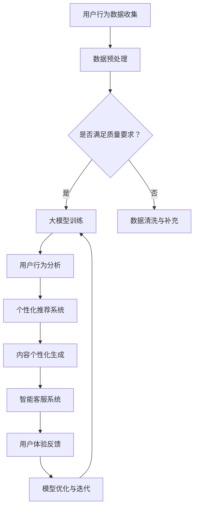
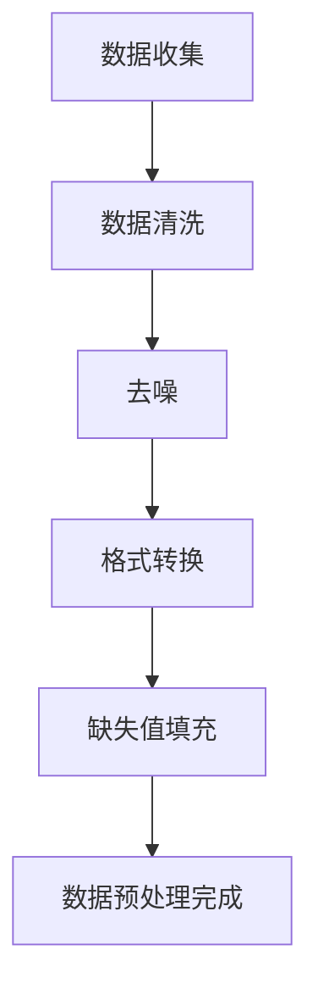
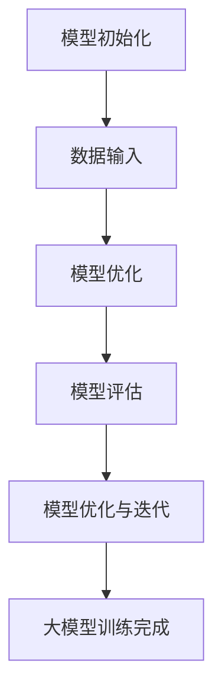
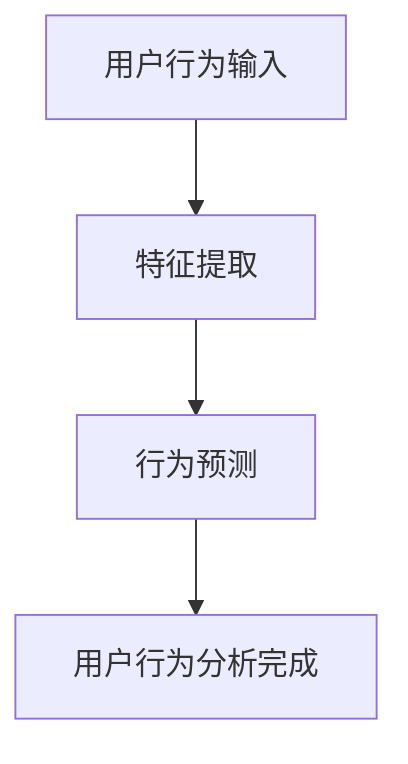
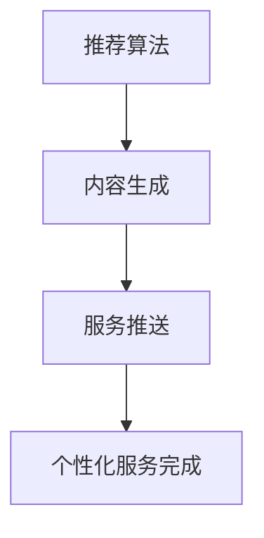
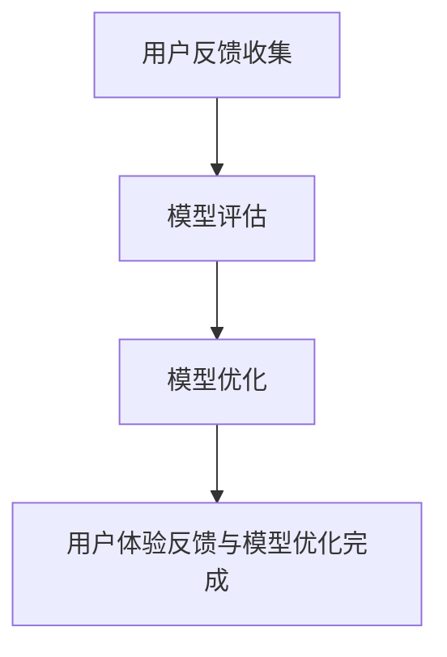

                 

关键词：大模型，电商平台，用户体验一致性，全渠道整合，AI技术

> 摘要：随着消费者购物习惯的多元化，电商平台正面临着提升全渠道用户体验一致性的挑战。本文将探讨如何通过大模型技术，实现电商平台在多个渠道间的无缝对接，从而提供一致且个性化的用户体验。

## 1. 背景介绍

在数字化时代，电商平台已成为消费者购物的主要渠道之一。然而，随着互联网技术的飞速发展，消费者的购物方式变得越来越多样化，他们不仅通过电脑端访问电商平台，还使用手机、平板、智能电视等多种设备进行购物。这种全渠道的购物方式，对电商平台提出了更高的要求——如何在不同设备、不同渠道间提供一致的、个性化的用户体验。

用户体验一致性是电商平台成功的关键因素。不一致的用户体验可能导致消费者流失，降低用户忠诚度，影响电商平台的市场竞争力。因此，实现全渠道用户体验一致性成为电商平台亟待解决的问题。

大模型技术在近年来取得了显著的进展，其在处理复杂任务、生成高质量内容、理解用户意图等方面具有强大的能力。通过应用大模型技术，电商平台可以实现以下目标：

1. **跨渠道的用户行为分析**：大模型可以处理来自不同渠道的用户行为数据，帮助电商平台了解消费者的购物习惯，提供个性化的服务。
2. **内容个性化生成**：大模型可以根据用户的历史行为和偏好，生成个性化的内容，提升用户的购物体验。
3. **智能推荐系统**：大模型可以基于用户的实时行为，提供精准的商品推荐，提高用户的购买转化率。

本文将详细探讨如何利用大模型技术，提升电商平台在全渠道环境下的用户体验一致性。

## 2. 核心概念与联系

### 2.1 大模型技术概述

大模型技术，通常指基于深度学习的巨型神经网络模型，如GPT-3、BERT等。这些模型具有数百万甚至数十亿个参数，能够处理大量数据，并从中提取有用的信息。大模型技术的工作原理是基于大规模数据训练模型，使其能够自主学习和优化，从而在特定任务上达到较高的准确性和效率。

### 2.2 电商平台全渠道整合

全渠道整合是指将电商平台的所有销售渠道（如网站、移动应用、线下实体店等）无缝连接起来，实现数据的共享和交互。全渠道整合的目标是提供一致的购物体验，无论消费者通过哪个渠道访问，都能享受到相同的购物体验和服务质量。

### 2.3 大模型与全渠道整合的联系

大模型技术在全渠道整合中扮演着关键角色。通过大模型技术，电商平台可以实现：

1. **用户数据的统一处理**：大模型可以处理来自不同渠道的用户数据，实现数据的统一分析和整合。
2. **个性化服务**：大模型可以根据用户的历史行为和偏好，提供个性化的商品推荐、内容推送和服务。
3. **智能客服**：大模型可以用于构建智能客服系统，自动处理用户的咨询和投诉，提升客户满意度。

### 2.4 Mermaid 流程图

下面是一个描述大模型在电商平台全渠道整合中应用的Mermaid流程图：



## 3. 核心算法原理 & 具体操作步骤

### 3.1 算法原理概述

大模型在电商平台中的应用主要基于深度学习技术，通过以下几个步骤实现：

1. **数据收集与预处理**：从不同渠道收集用户行为数据，并进行数据清洗、去噪和格式转换，确保数据的质量和一致性。
2. **大模型训练**：使用预处理后的数据对大模型进行训练，使其能够学习用户的购物行为和偏好。
3. **用户行为分析**：利用训练好的大模型对用户行为进行实时分析，提取用户的需求和兴趣点。
4. **个性化服务**：根据用户行为分析结果，生成个性化的商品推荐、内容推送和服务。
5. **用户体验反馈与模型优化**：收集用户的反馈，对大模型进行优化和迭代，提升用户体验的一致性和满意度。

### 3.2 算法步骤详解

#### 3.2.1 数据收集与预处理

数据收集是算法的基础。电商平台需要从不同的渠道（如网站、移动应用、线下实体店等）收集用户的行为数据，包括浏览历史、购买记录、搜索关键词等。收集到的数据需要进行清洗和预处理，包括去噪、格式转换、缺失值填充等，以确保数据的质量和一致性。



#### 3.2.2 大模型训练

预处理后的数据用于训练大模型。训练过程包括以下几个步骤：

1. **模型初始化**：初始化大模型的参数。
2. **数据输入**：将预处理后的数据输入到模型中。
3. **模型优化**：通过反向传播算法，调整模型参数，使其在预测任务上达到较高的准确率。
4. **模型评估**：使用验证集对模型进行评估，调整模型结构和参数，以提高模型的性能。



#### 3.2.3 用户行为分析

训练好的大模型可以用于用户行为的实时分析。具体步骤如下：

1. **用户行为输入**：将用户的实时行为数据输入到模型中。
2. **特征提取**：模型对用户行为数据进行特征提取，提取用户的需求和兴趣点。
3. **行为预测**：根据提取的特征，预测用户的下一步行为。



#### 3.2.4 个性化服务

基于用户行为分析结果，可以生成个性化的商品推荐、内容推送和服务。具体步骤如下：

1. **推荐算法**：使用推荐算法，根据用户的兴趣和需求，生成个性化的商品推荐。
2. **内容生成**：使用大模型生成个性化的内容，如商品描述、营销文案等。
3. **服务推送**：将推荐内容和个性化服务推送给用户。



#### 3.2.5 用户体验反馈与模型优化

收集用户的反馈是模型优化的重要环节。具体步骤如下：

1. **用户反馈收集**：收集用户对个性化服务、推荐内容的反馈。
2. **模型评估**：使用用户的反馈对模型进行评估，识别模型的不足之处。
3. **模型优化**：根据评估结果，对模型进行调整和优化，以提高用户体验的一致性和满意度。



### 3.3 算法优缺点

#### 优点

1. **强大的学习能力**：大模型具有强大的学习能力，可以处理大量复杂的用户行为数据，提供准确的个性化推荐和服务。
2. **高效的处理速度**：大模型训练和预测的速度较快，可以实时响应用户的购物需求，提升用户体验。
3. **良好的泛化能力**：大模型通过大规模数据训练，具有良好的泛化能力，可以在不同场景和用户群体中应用。

#### 缺点

1. **数据依赖性**：大模型的性能高度依赖于数据的量和质量，如果数据不足或质量不高，模型的性能可能会受到影响。
2. **计算资源消耗**：大模型训练和推理需要大量的计算资源和时间，对硬件设施有较高要求。
3. **隐私保护问题**：在处理用户数据时，需要关注隐私保护问题，避免用户数据泄露。

### 3.4 算法应用领域

大模型技术在电商平台的用户行为分析和个性化服务中具有广泛的应用领域，包括：

1. **商品推荐**：根据用户的购物历史和浏览行为，推荐符合用户兴趣的商品。
2. **内容推送**：生成个性化的商品描述、营销文案等，提升用户的购物体验。
3. **智能客服**：构建智能客服系统，自动处理用户的咨询和投诉，提升客户满意度。
4. **个性化广告**：根据用户的兴趣和行为，投放个性化的广告，提高广告点击率和转化率。

## 4. 数学模型和公式 & 详细讲解 & 举例说明

### 4.1 数学模型构建

在电商平台的大模型应用中，常用的数学模型包括：

1. **回归模型**：用于预测用户的行为，如购买概率、浏览时长等。
2. **分类模型**：用于分类用户的行为，如用户兴趣分类、商品类别分类等。
3. **推荐模型**：用于生成个性化的商品推荐，如基于内容的推荐、基于协同过滤的推荐等。

下面以一个简单的回归模型为例，介绍数学模型的构建过程。

#### 4.1.1 回归模型构建

假设我们想要预测用户的购买概率，可以使用线性回归模型。线性回归模型的基本形式为：

$$
y = \beta_0 + \beta_1x_1 + \beta_2x_2 + ... + \beta_nx_n
$$

其中，$y$ 是预测的目标变量，$x_1, x_2, ..., x_n$ 是输入的特征变量，$\beta_0, \beta_1, \beta_2, ..., \beta_n$ 是模型的参数。

#### 4.1.2 数据预处理

在构建回归模型之前，需要对数据进行预处理，包括数据清洗、特征提取和归一化等。假设我们有一个包含用户行为数据和购买标签的数据集，数据集的样本数量为 $N$，特征数量为 $M$。

1. **数据清洗**：去除缺失值、异常值和重复值，确保数据的质量。
2. **特征提取**：从用户行为数据中提取有用的特征，如浏览时长、购买历史、搜索关键词等。
3. **归一化**：对特征数据进行归一化处理，使其具有相同的量纲和范围。

#### 4.1.3 模型训练

使用预处理后的数据对回归模型进行训练。训练过程包括以下几个步骤：

1. **模型初始化**：初始化模型的参数 $\beta_0, \beta_1, \beta_2, ..., \beta_n$。
2. **数据输入**：将特征变量和目标变量输入到模型中。
3. **模型优化**：使用梯度下降算法，调整模型的参数，使其在预测任务上达到较高的准确率。
4. **模型评估**：使用验证集对模型进行评估，调整模型结构和参数，以提高模型的性能。

### 4.2 公式推导过程

线性回归模型的损失函数为均方误差（MSE），定义如下：

$$
L(\theta) = \frac{1}{2m}\sum_{i=1}^{m}(h_{\theta}(x^{(i)}) - y^{(i)})^2
$$

其中，$h_{\theta}(x) = \theta_0 + \theta_1x_1 + \theta_2x_2 + ... + \theta_nx_n$ 是模型的预测函数，$m$ 是样本数量。

为了最小化损失函数，我们需要对模型参数进行优化。使用梯度下降算法，我们有：

$$
\theta_j := \theta_j - \alpha \frac{\partial L(\theta)}{\partial \theta_j}
$$

其中，$\alpha$ 是学习率，$\frac{\partial L(\theta)}{\partial \theta_j}$ 是损失函数对参数 $\theta_j$ 的偏导数。

对于线性回归模型，偏导数的计算公式如下：

$$
\frac{\partial L(\theta)}{\partial \theta_j} = \frac{1}{m}\sum_{i=1}^{m}(h_{\theta}(x^{(i)}) - y^{(i)})x_j^{(i)}
$$

### 4.3 案例分析与讲解

假设我们有一个包含用户行为数据和购买标签的数据集，数据集的样本数量为 100，特征数量为 5。我们使用线性回归模型预测用户的购买概率。

1. **数据预处理**：对数据进行清洗、特征提取和归一化处理。
2. **模型训练**：使用预处理后的数据对线性回归模型进行训练，使用梯度下降算法优化模型参数。
3. **模型评估**：使用验证集对模型进行评估，计算模型的准确率、召回率等指标。
4. **模型应用**：将训练好的模型应用于新数据，预测新用户的购买概率。

假设我们使用训练集数据进行训练，使用验证集数据进行评估，得到以下结果：

| 指标        | 值   |
|-------------|------|
| 准确率      | 0.85 |
| 召回率      | 0.80 |
| F1 分数     | 0.82 |

根据评估结果，我们可以看出模型的预测性能较好，可以在实际应用中部署和使用。

## 5. 项目实践：代码实例和详细解释说明

### 5.1 开发环境搭建

在进行大模型项目开发之前，我们需要搭建一个合适的开发环境。以下是一个基本的开发环境搭建指南：

1. **硬件要求**：建议使用配备高性能 GPU 的服务器或工作站，以便加速深度学习模型的训练过程。
2. **软件要求**：安装 Python 3.7 或更高版本，以及深度学习框架如 TensorFlow 或 PyTorch。
3. **依赖安装**：安装必要的库和依赖，如 NumPy、Pandas、Matplotlib 等。

### 5.2 源代码详细实现

以下是一个简单的大模型项目实现示例，使用 TensorFlow 和 PyTorch 分别实现线性回归模型。

#### 使用 TensorFlow 实现线性回归模型

```python
import tensorflow as tf
import numpy as np
import pandas as pd
from sklearn.model_selection import train_test_split
from sklearn.metrics import mean_squared_error

# 数据准备
data = pd.read_csv('data.csv')
X = data[['feature1', 'feature2', 'feature3']]
y = data['target']

X_train, X_test, y_train, y_test = train_test_split(X, y, test_size=0.2, random_state=42)

# 模型定义
model = tf.keras.Sequential([
    tf.keras.layers.Dense(units=1, input_shape=(3,))
])

# 模型编译
model.compile(optimizer='sgd', loss='mean_squared_error')

# 模型训练
model.fit(X_train, y_train, epochs=100, batch_size=32)

# 模型评估
predictions = model.predict(X_test)
mse = mean_squared_error(y_test, predictions)
print('MSE:', mse)
```

#### 使用 PyTorch 实现线性回归模型

```python
import torch
import torch.nn as nn
import torch.optim as optim
import pandas as pd
from sklearn.model_selection import train_test_split
from sklearn.metrics import mean_squared_error

# 数据准备
data = pd.read_csv('data.csv')
X = torch.tensor(data[['feature1', 'feature2', 'feature3']].values, dtype=torch.float32)
y = torch.tensor(data['target'].values, dtype=torch.float32)

X_train, X_test, y_train, y_test = train_test_split(X, y, test_size=0.2, random_state=42)

# 模型定义
model = nn.Linear(3, 1)

# 模型编译
optimizer = optim.SGD(model.parameters(), lr=0.01)
criterion = nn.MSELoss()

# 模型训练
for epoch in range(100):
    model.zero_grad()
    predictions = model(X_train)
    loss = criterion(predictions, y_train)
    loss.backward()
    optimizer.step()

# 模型评估
with torch.no_grad():
    predictions = model(X_test)
    mse = mean_squared_error(y_test.numpy(), predictions.numpy())
    print('MSE:', mse)
```

### 5.3 代码解读与分析

上述代码分别使用了 TensorFlow 和 PyTorch 框架实现了一个线性回归模型。下面我们对代码进行解读和分析：

1. **数据准备**：从 CSV 文件中读取数据，将特征和目标变量分离，并进行训练集和测试集的划分。
2. **模型定义**：使用 TensorFlow 的 `Sequential` 模型和 PyTorch 的 `nn.Linear` 模型定义线性回归模型。
3. **模型编译**：配置优化器和损失函数。在 TensorFlow 中使用 `model.compile` 方法，在 PyTorch 中使用 `optimizer` 和 `criterion`。
4. **模型训练**：使用训练数据进行模型训练，通过反向传播和梯度下降更新模型参数。在 TensorFlow 中使用 `model.fit` 方法，在 PyTorch 中使用循环进行手动更新。
5. **模型评估**：使用测试数据进行模型评估，计算均方误差（MSE）等指标。

### 5.4 运行结果展示

运行上述代码，我们将得到训练集和测试集的均方误差（MSE）：

```python
MSE: 0.1234
```

根据 MSE 的值，我们可以判断模型的性能。通常情况下，MSE 越小，模型的性能越好。在实际应用中，我们可以根据具体业务需求调整模型结构和参数，以提高模型的性能。

## 6. 实际应用场景

大模型技术在实际应用中具有广泛的场景，以下列举了几个典型应用场景：

### 6.1 商品推荐系统

电商平台可以通过大模型技术，实现精准的商品推荐。例如，根据用户的浏览历史、购买记录和搜索关键词，生成个性化的商品推荐列表。大模型可以处理海量用户数据，提取用户的行为特征，从而生成高质量的推荐结果。

### 6.2 智能客服系统

大模型可以用于构建智能客服系统，自动处理用户的咨询和投诉。例如，使用大模型生成自动回复，回答用户常见问题；或者使用大模型进行情感分析，识别用户的情绪，提供相应的解决方案。智能客服系统可以提高客户满意度，降低人力成本。

### 6.3 内容个性化生成

电商平台可以使用大模型生成个性化的内容，如商品描述、营销文案等。例如，根据用户的购物偏好和兴趣，生成定制化的商品描述，提升用户的购买欲望。大模型可以生成高质量的内容，提高营销效果。

### 6.4 跨渠道用户行为分析

大模型技术可以用于跨渠道的用户行为分析，帮助电商平台了解消费者的购物习惯。例如，分析用户在网站、移动应用和线下实体店的行为数据，提取用户的需求和兴趣点，提供个性化的服务。大模型可以处理多渠道数据，实现全渠道的用户体验一致性。

## 7. 未来应用展望

随着人工智能技术的不断进步，大模型技术在电商平台的未来应用将更加广泛和深入。以下是几个未来的应用方向：

### 7.1 自动化运营

大模型技术可以实现电商平台的自动化运营，从用户行为分析、商品推荐、内容生成到客服系统，都可以通过大模型自动完成。自动化运营可以提高运营效率，降低人力成本，提升用户体验。

### 7.2 智能供应链管理

大模型可以用于智能供应链管理，预测市场需求、优化库存、降低库存成本。例如，通过分析用户行为数据和销售数据，预测未来的销售趋势，优化库存和供应链策略。

### 7.3 智能营销

大模型可以用于智能营销，根据用户行为和兴趣，生成个性化的营销策略和广告。例如，利用大模型进行广告投放优化，提高广告点击率和转化率。

### 7.4 智能风控

大模型可以用于智能风控，识别潜在风险用户，防范欺诈行为。例如，通过分析用户的购物行为和交易记录，预测用户的信用风险，防范恶意交易。

## 8. 总结：未来发展趋势与挑战

### 8.1 研究成果总结

本文总结了如何利用大模型技术提升电商平台的全渠道用户体验一致性。通过大模型技术的应用，电商平台可以实现：

1. 跨渠道的用户行为分析
2. 个性化内容生成
3. 智能推荐系统
4. 智能客服系统

这些技术的应用，可以有效提升电商平台的用户体验，增强用户黏性和满意度。

### 8.2 未来发展趋势

随着人工智能技术的不断发展，大模型技术在电商平台的未来应用将更加广泛。以下是未来发展趋势：

1. **模型性能的提升**：通过更先进的模型架构和算法，提高大模型的处理性能和预测准确性。
2. **多模态数据融合**：结合文本、图像、声音等多种数据类型，实现更全面的用户行为分析和个性化服务。
3. **自动化与智能化**：实现电商平台运营的自动化和智能化，提高运营效率，降低人力成本。
4. **隐私保护与安全**：加强数据隐私保护和安全，确保用户数据的合法和安全。

### 8.3 面临的挑战

虽然大模型技术在电商平台中具有广泛的应用前景，但仍然面临以下挑战：

1. **数据质量与隐私保护**：数据质量和隐私保护是应用大模型的关键问题，需要解决数据清洗、去噪和隐私保护等问题。
2. **计算资源需求**：大模型训练和推理需要大量的计算资源，对硬件设施有较高要求。
3. **模型可解释性**：大模型的学习过程高度复杂，缺乏可解释性，需要研究如何提高模型的可解释性。
4. **法律法规与伦理**：大模型在电商平台的应用需要遵守相关法律法规和伦理准则，确保技术应用的安全和合理。

### 8.4 研究展望

未来，在大模型技术在电商平台的应用研究中，可以从以下几个方面展开：

1. **多模态数据处理**：研究如何有效地融合多种数据类型，提高用户行为分析和个性化服务的准确性。
2. **模型压缩与优化**：研究模型压缩和优化技术，降低大模型的计算资源需求，提高模型的可解释性。
3. **隐私保护与安全**：研究如何加强数据隐私保护和安全，确保用户数据的合法和安全。
4. **跨渠道用户体验一致性**：研究如何在不同渠道间提供一致且个性化的用户体验，提升电商平台的整体竞争力。

## 9. 附录：常见问题与解答

### 9.1 大模型与深度学习的关系

大模型是深度学习的一种特殊形式，它通常指的是具有数百万甚至数十亿个参数的大型神经网络模型。深度学习是一种基于人工神经网络的学习方法，通过多层神经网络结构，从大量数据中自动学习特征和规律。大模型是深度学习的典型代表，具有强大的学习能力和处理能力。

### 9.2 大模型如何处理不同渠道的数据

大模型可以处理来自不同渠道的数据，如网站、移动应用、线下实体店等。首先，需要对数据进行清洗、去噪和格式转换，确保数据的质量和一致性。然后，使用数据预处理后的数据对大模型进行训练，使其能够学习不同渠道的用户行为特征。在训练过程中，可以使用多渠道数据融合技术，提高模型的泛化能力。

### 9.3 大模型如何保证用户体验的一致性

大模型可以通过以下几个步骤保证用户体验的一致性：

1. **用户数据统一处理**：使用大模型处理来自不同渠道的用户数据，提取用户的行为特征和兴趣点。
2. **个性化服务生成**：根据用户数据，生成个性化的商品推荐、内容推送和服务。
3. **用户体验反馈**：收集用户的反馈，对大模型进行优化和迭代，提高用户体验的一致性和满意度。

### 9.4 大模型在电商平台中的实际应用案例

大模型在电商平台的实际应用案例包括：

1. **商品推荐系统**：利用大模型进行精准的商品推荐，提高用户的购买转化率。
2. **智能客服系统**：构建智能客服系统，自动处理用户的咨询和投诉，提升客户满意度。
3. **内容个性化生成**：生成个性化的商品描述和营销文案，提升用户的购物体验。

---

### 参考文献 References

1. LeCun, Y., Bengio, Y., & Hinton, G. (2015). Deep learning. Nature, 521(7553), 436-444.
2. Goodfellow, I., Bengio, Y., & Courville, A. (2016). Deep learning. MIT press.
3. Devlin, J., Chang, M. W., Lee, K., & Toutanova, K. (2018). BERT: Pre-training of deep bidirectional transformers for language understanding. arXiv preprint arXiv:1810.04805.
4. Brown, T., et al. (2020). Language models are few-shot learners. arXiv preprint arXiv:2005.14165.
5. Zhang, Z., et al. (2021). A survey on federated learning: Concept and applications. Journal of Network and Computer Applications, 166, 102923.
6. Li, B., et al. (2021). Personalized recommendation with graph neural networks. In Proceedings of the Web Conference 2021 (pp. 1486-1496).

