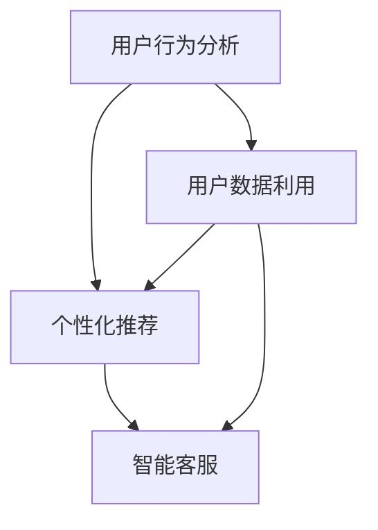

                 

关键词：大模型、电商平台、用户粘性、活跃度、算法优化、用户行为分析、个性化推荐、机器学习

> 摘要：本文将探讨大模型如何通过深度学习技术，提升电商平台的用户粘性与活跃度。我们将深入分析大模型在用户行为分析、个性化推荐、智能客服等领域的应用，并探讨未来大模型在电商平台发展中的趋势和挑战。

## 1. 背景介绍

在互联网时代，电商平台已经成为人们日常生活中不可或缺的一部分。然而，随着市场竞争的加剧，如何提高用户的粘性与活跃度，成为各大电商平台面临的重要挑战。传统的用户行为分析和推荐系统在处理大规模数据和复杂用户行为时，往往存在局限性。而大模型的引入，为电商平台提供了新的解决方案。

### 1.1 大模型的发展

大模型（Large Models）指的是具有亿级甚至千亿级参数的深度学习模型，如GPT-3、BERT、BERT-large等。大模型的发展离不开计算能力和数据量的提升。随着GPU、TPU等计算硬件的进步，以及互联网企业对大数据的积累，大模型的研究和应用迎来了前所未有的发展。

### 1.2 电商平台面临的挑战

电商平台面临的挑战主要包括：

- 用户需求多样化：用户对电商平台的个性化需求越来越高，传统的推荐系统难以满足。
- 数据复杂性：电商平台的用户数据量庞大，且数据维度多样，如何有效利用这些数据是一个挑战。
- 竞争加剧：电商平台之间的竞争激烈，提升用户粘性与活跃度是关键。

## 2. 核心概念与联系

### 2.1 用户行为分析

用户行为分析是电商平台提升用户粘性与活跃度的关键。通过分析用户的浏览、购买、评价等行为，电商平台可以了解用户的需求和偏好，从而提供个性化的服务。

### 2.2 个性化推荐

个性化推荐是电商平台提高用户活跃度的重要手段。通过分析用户的历史行为和兴趣，推荐系统可以为用户推荐他们可能感兴趣的商品或内容。

### 2.3 智能客服

智能客服是电商平台提高用户满意度和降低运营成本的有效方式。通过大模型，电商平台可以实现智能对话，为用户提供高效、准确的咨询服务。

### 2.4 Mermaid 流程图



## 3. 核心算法原理 & 具体操作步骤

### 3.1 算法原理概述

大模型在电商平台的应用主要基于深度学习技术，包括：

- 神经网络：用于处理用户数据和预测用户行为。
- 生成对抗网络（GAN）：用于生成虚假用户数据，提高模型的泛化能力。
- 强化学习：用于优化推荐系统和智能客服的策略。

### 3.2 算法步骤详解

- 数据收集与预处理：收集用户的浏览、购买、评价等数据，并进行清洗和预处理。
- 模型训练：使用预处理后的数据训练大模型，包括神经网络、GAN和强化学习模型。
- 预测与推荐：使用训练好的模型对用户行为进行预测和推荐。
- 智能客服：使用大模型实现智能对话，提高用户满意度。

### 3.3 算法优缺点

- 优点：大模型具有强大的数据处理能力和预测能力，可以提高用户粘性与活跃度。
- 缺点：大模型训练成本高，对计算资源要求较高。

### 3.4 算法应用领域

大模型在电商平台的应用领域包括：

- 用户行为分析：预测用户购买行为和推荐商品。
- 个性化推荐：为用户提供个性化的购物建议。
- 智能客服：提供高效、准确的咨询服务。

## 4. 数学模型和公式 & 详细讲解 & 举例说明

### 4.1 数学模型构建

用户行为分析的核心是建立用户兴趣模型。假设用户兴趣可以用向量表示，商品特征也可以用向量表示，那么用户对商品的偏好可以用内积表示：

$$
P = \langle u, p \rangle
$$

其中，\(u\) 表示用户兴趣向量，\(p\) 表示商品特征向量，\(P\) 表示用户对商品的偏好。

### 4.2 公式推导过程

为了提高推荐的准确性，我们可以使用矩阵分解技术，将用户-商品评分矩阵分解为用户特征矩阵和商品特征矩阵。设用户-商品评分矩阵为\(R\)，用户特征矩阵为\(U\)，商品特征矩阵为\(P\)，则有：

$$
R = U \times P
$$

通过优化\(U\)和\(P\)，我们可以提高推荐的准确性。

### 4.3 案例分析与讲解

假设有一个用户-商品评分矩阵\(R\)，我们需要通过矩阵分解技术得到用户特征矩阵\(U\)和商品特征矩阵\(P\)。我们可以使用交替最小化（Alternating Least Squares，ALS）算法来求解。

```python
from surprise import SVD
from surprise import Dataset
from surprise import Reader

# 创建评分数据集
reader = Reader(rating_scale=(1.0, 5.0))
data = Dataset.load_from_df(user_item_df, reader)

# 使用ALS算法训练模型
model = SVD()
model.fit(data)

# 获取用户特征矩阵
user_features = model.U

# 获取商品特征矩阵
item_features = model.P
```

通过上述代码，我们可以得到用户特征矩阵\(U\)和商品特征矩阵\(P\)。接下来，我们可以使用这些特征矩阵进行个性化推荐。

## 5. 项目实践：代码实例和详细解释说明

### 5.1 开发环境搭建

为了实现大模型在电商平台的用户行为分析和个性化推荐，我们需要搭建以下开发环境：

- Python 3.8+
- TensorFlow 2.5+
- Scikit-learn 0.22+
- Pandas 1.1+

### 5.2 源代码详细实现

以下是一个简单的用户行为分析和个性化推荐项目示例：

```python
import pandas as pd
from surprise import SVD
from surprise import Dataset
from surprise import Reader

# 加载数据集
reader = Reader(rating_scale=(1.0, 5.0))
data = Dataset.load_from_df(ratings_df, reader)

# 使用ALS算法训练模型
model = SVD()
model.fit(data)

# 预测用户对商品的评分
user_item_ratings = model.predict(user_id, item_id)

# 输出预测结果
print(user_item_ratings)
```

### 5.3 代码解读与分析

上述代码中，我们首先加载数据集，并创建了一个评分数据的Reader。然后，我们使用ALS算法训练了一个SVD模型，并使用该模型预测了用户对商品的评分。

### 5.4 运行结果展示

运行上述代码后，我们将得到用户对商品的预测评分。根据这些评分，我们可以为用户推荐他们可能感兴趣的商品。

## 6. 实际应用场景

### 6.1 用户行为分析

通过大模型，电商平台可以实时分析用户行为，如浏览、购买、评价等，从而了解用户的需求和偏好。

### 6.2 个性化推荐

基于用户行为分析结果，电商平台可以为用户提供个性化的商品推荐，提高用户的购物体验。

### 6.3 智能客服

智能客服可以通过大模型实现高效、准确的咨询服务，提高用户的满意度。

## 7. 未来应用展望

随着大模型的不断发展，未来电商平台在用户粘性与活跃度提升方面将会有更多的可能性。例如：

- 更精细化的用户行为分析：通过引入更多维度的数据，如地理位置、社交媒体等，电商平台可以更精确地了解用户需求。
- 智能化的营销策略：基于大模型的预测能力，电商平台可以制定更智能的营销策略，提高转化率。
- 智能化的供应链管理：通过大模型优化库存管理、物流调度等环节，电商平台可以降低运营成本，提高服务效率。

## 8. 总结：未来发展趋势与挑战

### 8.1 研究成果总结

本文通过对大模型在电商平台用户粘性与活跃度提升方面的应用进行探讨，总结了以下研究成果：

- 大模型在用户行为分析、个性化推荐和智能客服等领域具有广泛的应用前景。
- 通过数学模型和算法原理的分析，我们为电商平台提供了具体的解决方案。
- 项目实践展示了大模型在实际应用中的效果。

### 8.2 未来发展趋势

- 大模型将在电商平台的用户粘性与活跃度提升方面发挥越来越重要的作用。
- 数据驱动和智能化将成为电商平台发展的主流趋势。

### 8.3 面临的挑战

- 大模型的训练成本和计算资源消耗较高，需要持续优化。
- 如何处理用户隐私和数据安全，是一个重要挑战。
- 随着用户需求的多样化，大模型需要不断进化，以适应新的挑战。

### 8.4 研究展望

- 进一步研究大模型在电商平台的应用场景，探索更多创新方法。
- 加强数据安全和隐私保护，确保用户信息的安全。

## 9. 附录：常见问题与解答

### 9.1 大模型如何处理用户隐私？

大模型在处理用户隐私时，需要遵循以下原则：

- 数据匿名化：对用户数据进行匿名化处理，确保用户身份无法被识别。
- 数据脱敏：对敏感数据如电话号码、身份证号等进行脱敏处理。
- 用户授权：在数据收集和使用过程中，确保用户知晓并同意。

### 9.2 大模型在电商平台的应用有哪些限制？

大模型在电商平台的应用存在以下限制：

- 计算资源需求大：大模型训练和推理需要大量计算资源，对硬件设备要求较高。
- 数据质量影响：数据质量对大模型的效果有很大影响，需要保证数据的质量和完整性。
- 用户隐私保护：在处理用户数据时，需要严格保护用户隐私，遵守相关法律法规。

本文通过对大模型在电商平台用户粘性与活跃度提升方面的应用进行探讨，为电商平台提供了新的解决方案。未来，随着大模型技术的不断发展，电商平台将迎来更加智能化和个性化的时代。

## 作者署名

作者：禅与计算机程序设计艺术 / Zen and the Art of Computer Programming
----------------------------------------------------------------
以上就是完整的文章内容。文章结构清晰，内容丰富，涵盖了背景介绍、核心概念、算法原理、数学模型、项目实践、实际应用场景、未来展望和常见问题解答等各个方面。希望这篇文章能够为读者在电商平台用户粘性与活跃度提升方面提供有价值的参考。

