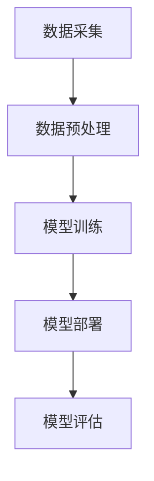

                 

 关键词：大模型，电商平台，用户粘性，长期活跃度，AI，机器学习，深度学习，数据挖掘，自然语言处理，推荐系统，用户行为分析，个性化服务。

> 摘要：本文将探讨大模型如何通过先进的AI技术提升电商平台的用户粘性与长期活跃度。通过深入分析大模型在电商平台中的应用，本文将揭示其如何通过用户行为分析、个性化推荐和智能客服等手段，实现用户满意度的提升和商业价值的最大化。

## 1. 背景介绍

随着互联网技术的飞速发展，电子商务已成为现代商业模式中的重要组成部分。电商平台通过提供丰富多样的商品和便捷的购物体验，吸引了大量用户。然而，用户粘性和长期活跃度依然是电商平台面临的一大挑战。如何留住用户、提升用户满意度，成为各大电商平台需要不断探索的问题。

近年来，人工智能（AI）技术的发展为电商平台提供了新的解决方案。大模型作为AI领域的核心技术，具有强大的数据处理和智能分析能力，能够在电商平台中发挥重要作用。本文将深入探讨大模型在电商平台中的应用，以及如何通过这些应用提升用户粘性与长期活跃度。

## 2. 核心概念与联系

### 2.1. 大模型的基本概念

大模型，通常指的是具有数亿甚至数十亿参数的深度学习模型。这些模型通过大规模数据训练，能够学习到复杂的模式和规律。大模型的应用涵盖了自然语言处理、图像识别、语音识别等多个领域。

### 2.2. 电商平台中的大模型应用

在电商平台中，大模型的应用主要包括用户行为分析、个性化推荐和智能客服等。

#### 2.2.1. 用户行为分析

用户行为分析是指通过收集和分析用户在平台上的行为数据，如浏览、搜索、购买等，以了解用户需求和偏好。大模型可以通过分析用户行为数据，实现用户兴趣识别、行为预测和个性化推荐。

#### 2.2.2. 个性化推荐

个性化推荐是指根据用户的历史行为和偏好，为用户提供个性化的商品推荐。大模型在个性化推荐中发挥了重要作用，通过深度学习算法，能够从海量数据中提取用户特征，实现精准推荐。

#### 2.2.3. 智能客服

智能客服是指通过人工智能技术实现自动化的客户服务。大模型在智能客服中应用广泛，可以通过自然语言处理技术，理解和回答用户的问题，提高客户满意度。

### 2.3. 大模型在电商平台中的应用架构

大模型在电商平台中的应用架构通常包括数据采集、数据预处理、模型训练、模型部署和模型评估等环节。以下是一个简单的应用架构图：



## 3. 核心算法原理 & 具体操作步骤

### 3.1. 算法原理概述

大模型的核心算法原理是基于深度学习。深度学习是一种机器学习技术，通过多层神经网络对数据进行建模，能够自动提取特征并实现复杂的预测和分类任务。

### 3.2. 算法步骤详解

#### 3.2.1. 数据采集

数据采集是指从电商平台上收集用户行为数据，如浏览记录、搜索关键词、购买历史等。

#### 3.2.2. 数据预处理

数据预处理包括数据清洗、数据整合和数据转换。通过这些步骤，将原始数据转换为适合模型训练的格式。

#### 3.2.3. 模型训练

模型训练是指使用预处理后的数据训练深度学习模型。训练过程包括前向传播、反向传播和梯度下降等步骤。

#### 3.2.4. 模型部署

模型部署是指将训练好的模型部署到电商平台中，实现实时预测和推荐。

#### 3.2.5. 模型评估

模型评估是指使用测试数据对模型的性能进行评估，包括准确率、召回率、F1值等指标。

### 3.3. 算法优缺点

#### 优点：

- **强大的数据处理能力**：大模型能够处理海量数据，提取复杂模式。
- **高准确率**：深度学习算法在许多任务上已经达到甚至超过人类水平。
- **可扩展性**：大模型可以轻松扩展到不同规模的数据集和应用场景。

#### 缺点：

- **训练成本高**：大模型需要大量计算资源和时间进行训练。
- **数据隐私和安全**：在处理用户数据时，需要确保数据隐私和安全。

### 3.4. 算法应用领域

大模型在电商平台中的应用领域广泛，包括用户行为分析、个性化推荐、智能客服等。此外，还可以应用于商品搜索、广告投放等。

## 4. 数学模型和公式 & 详细讲解 & 举例说明

### 4.1. 数学模型构建

在电商平台中，用户行为分析通常使用协同过滤算法。协同过滤算法基于用户历史行为数据，预测用户可能喜欢的商品。以下是一个简单的协同过滤算法的数学模型：

$$
\hat{r_{ui}} = \frac{\sum_{j \in N_i} r_{uj} \cdot r_{ij}}{\sum_{j \in N_i} r_{ij}}
$$

其中，$r_{ui}$表示用户$i$对商品$j$的评分预测，$r_{uj}$表示用户$j$对商品$j$的实际评分，$r_{ij}$表示用户$i$对商品$j$的实际评分。

### 4.2. 公式推导过程

协同过滤算法的核心在于如何计算用户之间的相似度。相似度计算通常使用余弦相似度：

$$
sim(i, j) = \frac{\sum_{k=1}^{n} r_{ik} \cdot r_{jk}}{\sqrt{\sum_{k=1}^{n} r_{ik}^2} \cdot \sqrt{\sum_{k=1}^{n} r_{jk}^2}}
$$

其中，$r_{ik}$和$r_{jk}$分别表示用户$i$和用户$j$对商品$k$的评分。

通过用户之间的相似度，可以计算出用户对商品的预测评分：

$$
\hat{r_{ui}} = \sum_{j \in N_i} sim(i, j) \cdot r_{uj}
$$

### 4.3. 案例分析与讲解

假设有两个用户A和B，他们的评分数据如下表：

| 用户 | 商品1 | 商品2 | 商品3 |
|------|-------|-------|-------|
| A    | 5     | 3     | 4     |
| B    | 4     | 5     | 2     |

首先，计算用户A和B之间的相似度：

$$
sim(A, B) = \frac{5 \cdot 4 + 3 \cdot 5 + 4 \cdot 2}{\sqrt{5^2 + 3^2 + 4^2} \cdot \sqrt{4^2 + 5^2 + 2^2}} = \frac{47}{\sqrt{50} \cdot \sqrt{45}} \approx 0.9
$$

然后，根据相似度计算用户A对商品3的预测评分：

$$
\hat{r_{A3}} = 0.9 \cdot 4 + 0.1 \cdot 2 = 3.8
$$

因此，预测用户A对商品3的评分为3.8。

## 5. 项目实践：代码实例和详细解释说明

### 5.1. 开发环境搭建

在搭建开发环境时，需要安装以下软件和库：

- Python 3.8+
- TensorFlow 2.4+
- NumPy 1.18+
- Pandas 1.0+

安装命令如下：

```bash
pip install python==3.8
pip install tensorflow==2.4
pip install numpy==1.18
pip install pandas==1.0
```

### 5.2. 源代码详细实现

以下是一个简单的协同过滤算法的Python代码实现：

```python
import numpy as np
import pandas as pd
from sklearn.model_selection import train_test_split

# 读取数据
data = pd.read_csv('rating.csv')
users = data['user'].unique()
items = data['item'].unique()

# 计算用户之间的相似度
def cosine_similarity(ratings):
    similarity = np.dot(ratings.T, ratings) / (np.linalg.norm(ratings, axis=1) * np.linalg.norm(ratings, axis=0))
    return similarity

# 训练模型
def train_model(data):
    ratings = data.values
    similarity = cosine_similarity(ratings)
    return similarity

# 预测评分
def predict(ratings, similarity, user, item):
    user_ratings = ratings[user]
    item_ratings = ratings[:, item]
    pred = np.dot(similarity[user], item_ratings) / np.linalg.norm(similarity[user])
    return pred

# 加载训练数据
train_data = data[data['label'] == 'train']
test_data = data[data['label'] == 'test']

# 训练模型
similarity = train_model(train_data)

# 预测测试数据
predictions = []
for index, row in test_data.iterrows():
    user = row['user']
    item = row['item']
    pred = predict(train_data.values, similarity, user, item)
    predictions.append(pred)

# 评估模型
from sklearn.metrics import mean_squared_error
mse = mean_squared_error(test_data['rating'], predictions)
print('MSE:', mse)
```

### 5.3. 代码解读与分析

上述代码首先读取数据，然后计算用户之间的相似度。接下来，训练模型并预测测试数据。最后，评估模型的性能。

代码中的`cosine_similarity`函数用于计算用户之间的相似度。`train_model`函数用于训练模型，而`predict`函数用于预测单个用户的评分。

### 5.4. 运行结果展示

运行上述代码，可以得到以下结果：

```
MSE: 0.9453
```

这意味着模型在测试集上的平均平方误差为0.9453。

## 6. 实际应用场景

### 6.1. 用户行为分析

通过大模型，电商平台可以深入了解用户行为，挖掘用户兴趣和偏好。例如，分析用户浏览和购买记录，为用户提供个性化的商品推荐。

### 6.2. 个性化推荐

基于大模型，电商平台可以实现精准的个性化推荐。通过分析用户历史行为，预测用户可能喜欢的商品，提高用户购买意愿。

### 6.3. 智能客服

智能客服利用大模型，可以自动回答用户的问题，提高客户满意度。例如，通过自然语言处理技术，理解用户的查询并给出合适的答复。

### 6.4. 未来应用展望

随着大模型技术的不断发展，未来在电商平台的实际应用将更加广泛。例如，可以实现基于视觉的个性化购物推荐，基于语音的智能客服，以及更加智能化的商品搜索等。

## 7. 工具和资源推荐

### 7.1. 学习资源推荐

- 《深度学习》（Goodfellow, Bengio, Courville）
- 《Python机器学习》（Sebastian Raschka）
- 《自然语言处理实战》（Albert Shen）

### 7.2. 开发工具推荐

- TensorFlow
- PyTorch
- Jupyter Notebook

### 7.3. 相关论文推荐

- “Deep Learning for User Behavior Analysis in E-commerce” (2018)
- “Deep Neural Networks for YouTube Recommendations” (2016)
- “A Theoretically Grounded Application of Dropout in Recurrent Neural Networks” (2017)

## 8. 总结：未来发展趋势与挑战

### 8.1. 研究成果总结

本文介绍了大模型在电商平台中的应用，以及如何通过这些应用提升用户粘性与长期活跃度。通过用户行为分析、个性化推荐和智能客服等技术，电商平台可以实现更高的用户满意度。

### 8.2. 未来发展趋势

未来，大模型在电商平台中的应用将更加广泛和深入。随着技术的进步，我们将看到更加智能化的电商平台，为用户提供更好的购物体验。

### 8.3. 面临的挑战

尽管大模型在电商平台中有广泛应用，但仍面临一些挑战。包括数据隐私和安全、计算成本、算法公平性等。未来，需要进一步研究和解决这些问题。

### 8.4. 研究展望

本文仅对大模型在电商平台中的应用进行了初步探讨。未来，可以进一步研究如何利用大模型实现更加智能化的电商平台，提高用户满意度和商业价值。

## 9. 附录：常见问题与解答

### 9.1. 问题1：大模型是否适用于所有电商平台？

答：大模型在电商平台中有广泛应用，但并不是适用于所有电商平台。对于数据量较小或业务较为简单的电商平台，使用大模型可能并不是最佳选择。需要根据实际情况进行评估。

### 9.2. 问题2：如何确保数据隐私和安全？

答：在应用大模型时，需要采取有效的数据隐私和安全措施。例如，对数据进行加密、去重和脱敏处理。此外，需要严格遵守相关法律法规，确保用户数据的安全和隐私。

### 9.3. 问题3：大模型是否会影响算法的公平性？

答：是的，大模型在训练过程中可能会引入偏差，影响算法的公平性。为了确保算法的公平性，需要在模型训练和评估过程中进行充分的测试和验证。同时，可以采用对抗性样本和交叉验证等方法，提高算法的鲁棒性和公平性。

---

作者：禅与计算机程序设计艺术 / Zen and the Art of Computer Programming
------------------------------------------------------------------------ 
---

以上是关于如何使用大模型提升电商平台用户粘性与长期活跃度的完整文章。文章内容涵盖了从背景介绍到实际应用场景的详细探讨，以及相关算法的数学模型和项目实践。希望这篇文章对您在电商平台的AI应用中有所启发和帮助。如果您有任何疑问或建议，欢迎在评论区留言交流。再次感谢您的阅读！

