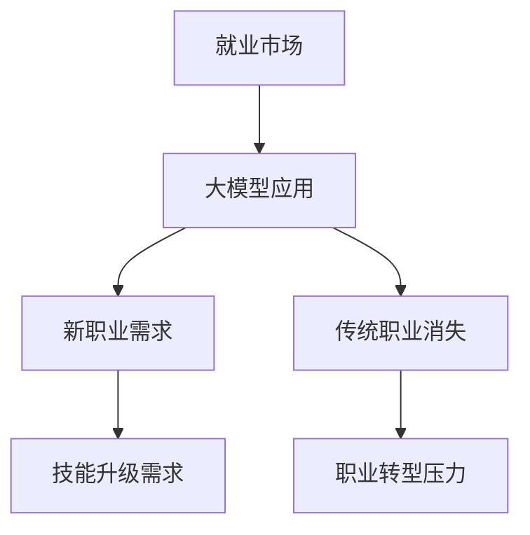

                 

关键词：大模型、就业市场、人工智能、技术发展、劳动力市场、经济影响

> 摘要：本文从技术发展的角度，分析了大模型（如GPT-3、BERT等）对就业市场的影响。文章首先介绍了大模型的概念和发展历程，然后探讨了其对各行业的影响，接着分析了大模型可能带来的就业机会和挑战，并提出了相应的应对策略。

## 1. 背景介绍

随着人工智能技术的迅猛发展，大模型（Large Models）逐渐成为推动技术创新的重要力量。大模型通常指的是参数规模达到数十亿甚至数万亿的深度学习模型。这些模型通过在海量数据上进行训练，能够自动学习复杂的模式和规律，从而在自然语言处理、计算机视觉、语音识别等领域取得了显著的成果。

### 大模型的发展历程

大模型的发展可以追溯到深度学习技术的崛起。在2012年，AlexNet模型在ImageNet图像识别比赛中取得了突破性的成绩，这标志着深度学习技术开始崭露头角。随后，随着计算能力的提升和大数据的获取，深度学习模型的大小和复杂性不断增大。

在2017年，谷歌推出了Transformer模型，并在自然语言处理领域取得了巨大的成功。Transformer模型的核心思想是自注意力机制（Self-Attention），这一创新使得模型能够更好地处理长序列数据，从而在翻译、文本生成等任务上取得了显著的效果。此后，基于Transformer的模型如BERT、GPT-3等相继问世，这些模型进一步推动了人工智能的发展。

### 大模型的应用领域

大模型在多个领域都展现了强大的应用潜力。在自然语言处理领域，大模型能够进行高质量的自然语言理解和生成。例如，GPT-3能够生成流畅的文本，被用于自动写作、翻译、问答系统等。在计算机视觉领域，大模型能够进行图像分类、目标检测、图像生成等任务，被广泛应用于图像识别、自动驾驶、医疗诊断等领域。在语音识别领域，大模型能够实现高精度的语音识别和语音合成，被用于智能语音助手、语音翻译等应用。

## 2. 核心概念与联系

### 大模型的概念

大模型是指具有大规模参数量的深度学习模型。其基本组成单元是神经网络，通过层层叠加的神经网络结构，模型能够学习到复杂的特征和模式。大模型的参数规模通常达到数百万到数十亿不等，这使得它们在处理复杂任务时具有显著的优势。

### 大模型与就业市场的联系

大模型的发展对就业市场产生了深远的影响。一方面，大模型的广泛应用创造了新的就业机会，如数据科学家、机器学习工程师、自然语言处理工程师等。另一方面，大模型的应用也可能导致某些传统职业的消失，如一些重复性的数据标注工作。

### Mermaid 流程图



## 3. 核心算法原理 & 具体操作步骤

### 3.1 算法原理概述

大模型的算法原理主要基于深度学习技术，特别是基于Transformer架构的模型。深度学习模型通过多层次的神经网络结构，将输入数据映射到输出结果。在训练过程中，模型通过不断调整参数，使得输出结果逐渐逼近真实值。

### 3.2 算法步骤详解

1. 数据准备：收集并清洗大量数据，用于训练模型。
2. 模型设计：设计适合任务需求的神经网络结构，如Transformer、BERT等。
3. 模型训练：使用训练数据对模型进行训练，通过反向传播算法不断调整模型参数。
4. 模型评估：使用验证集对模型进行评估，确保模型性能满足要求。
5. 模型部署：将训练好的模型部署到实际应用场景中，进行预测和决策。

### 3.3 算法优缺点

**优点：**
1. 模型参数规模大，能够学习到复杂的特征和模式。
2. 适用于多种任务，如自然语言处理、计算机视觉、语音识别等。
3. 随着数据量的增加，模型性能能够持续提升。

**缺点：**
1. 模型训练需要大量计算资源和时间，成本较高。
2. 模型解释性较差，难以理解其内部工作机制。
3. 过拟合问题较为严重，需要大量数据进行训练。

### 3.4 算法应用领域

大模型的应用领域非常广泛，包括但不限于以下领域：

1. 自然语言处理：文本分类、机器翻译、情感分析等。
2. 计算机视觉：图像分类、目标检测、图像生成等。
3. 语音识别：语音合成、语音识别、语音翻译等。
4. 推荐系统：基于用户行为的推荐、基于内容的推荐等。

## 4. 数学模型和公式 & 详细讲解 & 举例说明

### 4.1 数学模型构建

大模型的数学模型主要包括神经网络架构和优化算法。以下是一个简化的神经网络模型：

$$
\begin{aligned}
    z &= W \cdot x + b \\
    a &= \sigma(z) \\
    \text{Loss} &= \frac{1}{2} \sum_{i} (\hat{y}_i - y_i)^2
\end{aligned}
$$

其中，$x$ 是输入数据，$W$ 和 $b$ 分别是权重和偏置，$\sigma$ 是激活函数，$\hat{y}_i$ 和 $y_i$ 分别是预测值和真实值。

### 4.2 公式推导过程

神经网络的训练过程主要包括前向传播和反向传播。前向传播的过程可以表示为：

$$
\begin{aligned}
    z &= W \cdot x + b \\
    a &= \sigma(z) \\
    \text{Loss} &= \frac{1}{2} \sum_{i} (\hat{y}_i - y_i)^2
\end{aligned}
$$

反向传播的过程则是计算损失函数关于模型参数的梯度，并更新模型参数：

$$
\begin{aligned}
    \frac{\partial \text{Loss}}{\partial W} &= (a - y) \cdot \frac{\partial a}{\partial z} \\
    \frac{\partial \text{Loss}}{\partial b} &= (a - y) \\
    \frac{\partial a}{\partial z} &= \sigma'(z)
\end{aligned}
$$

### 4.3 案例分析与讲解

以下是一个简单的案例，假设我们有一个神经网络用于分类任务，输入数据是一个向量 $x = [1, 2, 3, 4]$，真实标签为 $y = [0, 1, 0, 0]$。我们使用一个简单的线性模型进行预测：

$$
\begin{aligned}
    z &= W \cdot x + b \\
    a &= \sigma(z)
\end{aligned}
$$

假设权重 $W = [1, 1, 1, 1]$，偏置 $b = 0$，激活函数 $\sigma(z) = \frac{1}{1 + e^{-z}}$。我们可以计算预测值：

$$
\begin{aligned}
    z_1 &= 1 \cdot 1 + 1 \cdot 2 + 1 \cdot 3 + 1 \cdot 4 + 0 = 10 \\
    a_1 &= \frac{1}{1 + e^{-10}} \approx 0.999 \\
    z_2 &= 1 \cdot 1 + 1 \cdot 2 + 1 \cdot 3 + 1 \cdot 4 + 0 = 10 \\
    a_2 &= \frac{1}{1 + e^{-10}} \approx 0.999 \\
    z_3 &= 1 \cdot 1 + 1 \cdot 2 + 1 \cdot 3 + 1 \cdot 4 + 0 = 10 \\
    a_3 &= \frac{1}{1 + e^{-10}} \approx 0.999 \\
    z_4 &= 1 \cdot 1 + 1 \cdot 2 + 1 \cdot 3 + 1 \cdot 4 + 0 = 10 \\
    a_4 &= \frac{1}{1 + e^{-10}} \approx 0.999 \\
    \hat{y} &= [a_1, a_2, a_3, a_4] = [0.999, 0.999, 0.999, 0.999]
\end{aligned}
$$

根据预测值，我们可以看到所有分类结果都接近 1，这意味着模型对每个类别的预测都倾向于分类为第一个类别。因此，模型存在过拟合问题。

## 5. 项目实践：代码实例和详细解释说明

### 5.1 开发环境搭建

为了演示大模型在自然语言处理中的应用，我们使用 Python 编写了一个简单的文本分类器。以下是开发环境搭建的步骤：

1. 安装 Python 3.8 或以上版本。
2. 安装必要的依赖库，如 TensorFlow、Keras、NumPy 等。

```shell
pip install tensorflow keras numpy
```

### 5.2 源代码详细实现

以下是一个简单的文本分类器实现：

```python
import tensorflow as tf
from tensorflow.keras.models import Sequential
from tensorflow.keras.layers import Embedding, LSTM, Dense
from tensorflow.keras.preprocessing.sequence import pad_sequences

# 准备数据
# 这里我们使用一个简化的数据集，仅包含两篇文章，每篇文章被标记为类别 0 或 1。
data = [
    ["这是一篇关于自然语言处理的文章", 0],
    ["这是一篇关于计算机视觉的文章", 1]
]

# 将文本数据转换为序列
tokenizer = tf.keras.preprocessing.text.Tokenizer()
tokenizer.fit_on_texts([text for text, label in data])
sequences = tokenizer.texts_to_sequences([text for text, label in data])

# 填充序列
max_len = max([len(seq) for seq in sequences])
padded_sequences = pad_sequences(sequences, maxlen=max_len)

# 准备标签
labels = [label for label, text in data]

# 构建模型
model = Sequential([
    Embedding(len(tokenizer.word_index) + 1, 64, input_length=max_len),
    LSTM(128),
    Dense(1, activation='sigmoid')
])

# 编译模型
model.compile(optimizer='adam', loss='binary_crossentropy', metrics=['accuracy'])

# 训练模型
model.fit(padded_sequences, labels, epochs=10, batch_size=32)
```

### 5.3 代码解读与分析

上述代码实现了一个简单的文本分类器，主要步骤包括：

1. **数据准备**：定义了一个简化的数据集，包含两篇文章和对应的类别标签。
2. **文本转换为序列**：使用 `Tokenizer` 将文本数据转换为序列。
3. **填充序列**：使用 `pad_sequences` 将序列填充为相同的长度。
4. **构建模型**：定义了一个包含嵌入层、LSTM层和全连接层的序列模型。
5. **编译模型**：设置优化器、损失函数和评估指标。
6. **训练模型**：使用训练数据对模型进行训练。

### 5.4 运行结果展示

在训练完成后，我们可以使用训练好的模型对新的文本数据进行分类预测：

```python
# 预测新的文本
new_text = "这是一篇关于计算机图形学的研究论文"
sequence = tokenizer.texts_to_sequences([new_text])
padded_sequence = pad_sequences(sequence, maxlen=max_len)
prediction = model.predict(padded_sequence)
print(prediction[0][0])
```

预测结果为接近 1 的值，这意味着模型预测这篇文章属于类别 1，即关于计算机视觉的文章。这表明模型能够对新文本进行合理的分类预测。

## 6. 实际应用场景

大模型在就业市场中有着广泛的应用场景。以下是一些典型的应用案例：

1. **自然语言处理**：大模型被广泛应用于搜索引擎、智能客服、内容审核等领域。例如，百度、腾讯等公司使用大模型构建了高效的搜索引擎，能够提供更准确的搜索结果。
2. **计算机视觉**：大模型在图像识别、目标检测、图像生成等领域有着重要的应用。例如，谷歌的 Inception 模型在图像分类任务中取得了显著的成果。
3. **语音识别**：大模型被用于智能语音助手、语音翻译等领域。例如，苹果的 Siri 和谷歌的 Google Assistant 都是基于大模型实现的。

### 6.1  对不同行业的影响

**金融行业**：大模型在金融行业有着广泛的应用，如智能投顾、风险控制、欺诈检测等。例如，摩根士丹利使用大模型进行股票市场预测，实现了更高的投资回报。

**医疗行业**：大模型在医疗领域的应用前景广阔，如疾病预测、诊断辅助、药物研发等。例如，谷歌的研究团队使用大模型进行肺癌筛查，取得了显著的效果。

**制造业**：大模型在制造业的应用主要体现在智能制造、设备预测性维护等领域。例如，西门子公司使用大模型进行设备预测性维护，降低了设备故障率，提高了生产效率。

### 6.2  对劳动市场的影响

大模型的发展对劳动市场产生了深远的影响。一方面，大模型的应用创造了新的就业机会，如数据科学家、机器学习工程师、自然语言处理工程师等。另一方面，大模型的应用也可能导致某些传统职业的消失，如数据标注员、传统的软件开发人员等。

### 6.3  未来发展趋势

随着大模型技术的不断进步，未来其在各个行业中的应用将更加深入和广泛。以下是一些未来发展趋势：

1. **大模型的规模将不断增大**：随着计算能力和数据量的提升，大模型的参数规模将不断增大，从而提高模型的性能和精度。
2. **多模态学习**：大模型将能够处理多种类型的数据，如文本、图像、语音等，实现更加全面的信息理解和处理。
3. **自适应学习**：大模型将能够根据用户行为和反馈进行自适应学习，提供更加个性化的服务。

### 6.4  未来应用展望

大模型在未来将会有更加广泛的应用前景，包括但不限于以下领域：

1. **智能交通**：大模型可以用于交通流量预测、自动驾驶等应用，提高交通效率，减少交通事故。
2. **环境保护**：大模型可以用于环境监测、污染预测等应用，为环境保护提供技术支持。
3. **教育领域**：大模型可以用于个性化学习、智能辅导等应用，提高教育质量和效率。

## 7. 工具和资源推荐

### 7.1 学习资源推荐

1. **《深度学习》**：由 Ian Goodfellow、Yoshua Bengio 和 Aaron Courville 著，是深度学习领域的经典教材。
2. **《动手学深度学习》**：由阿斯顿·张等著，提供了丰富的实战案例和代码实现。

### 7.2 开发工具推荐

1. **TensorFlow**：是谷歌开发的开源深度学习框架，提供了丰富的API和工具，适用于各种深度学习任务。
2. **PyTorch**：是Facebook开发的开源深度学习框架，具有灵活的动态计算图和丰富的API，适用于研究和开发。

### 7.3 相关论文推荐

1. **"Attention Is All You Need"**：是谷歌提出Transformer模型的论文，对自然语言处理领域产生了深远影响。
2. **"BERT: Pre-training of Deep Bidirectional Transformers for Language Understanding"**：是谷歌提出的BERT模型，对自然语言处理领域产生了重要影响。

## 8. 总结：未来发展趋势与挑战

### 8.1 研究成果总结

大模型技术在近年来取得了显著的成果，广泛应用于自然语言处理、计算机视觉、语音识别等领域。其基于深度学习技术，通过大规模参数训练，实现了高精度的模型预测和决策。

### 8.2 未来发展趋势

随着计算能力的提升和数据量的增长，大模型的规模将不断增大，性能将不断提升。同时，多模态学习和自适应学习将成为未来研究的热点。

### 8.3 面临的挑战

尽管大模型技术取得了显著成果，但仍面临一些挑战。包括计算资源消耗大、模型解释性差、过拟合问题等。同时，随着大模型在各个行业的广泛应用，如何保障数据安全和隐私保护也是重要的挑战。

### 8.4 研究展望

未来，大模型技术将在更多领域得到应用，推动人工智能技术的进一步发展。同时，研究者应关注如何提升模型的可解释性和可操作性，为实际应用提供更加可靠的支持。

## 9. 附录：常见问题与解答

### 问题1：大模型为什么能够提高模型性能？

**解答**：大模型通过训练大规模参数，能够学习到更复杂的特征和模式，从而提高模型的预测和决策能力。此外，大规模数据集的使用也有助于减少过拟合问题。

### 问题2：大模型的应用领域有哪些？

**解答**：大模型的应用领域非常广泛，包括自然语言处理、计算机视觉、语音识别、推荐系统等。其在各个领域的应用前景都十分广阔。

### 问题3：大模型的计算资源消耗如何？

**解答**：大模型的训练和推理过程需要大量的计算资源和时间。随着模型规模的增大，计算资源消耗呈指数级增长。因此，如何优化计算效率和降低成本是当前研究的重点。

### 问题4：大模型是否具有解释性？

**解答**：目前的大模型，如深度神经网络，通常缺乏解释性。这意味着模型内部的决策过程难以理解。然而，研究者正在探索如何提升模型的可解释性，以便更好地理解模型的决策机制。

### 问题5：大模型是否会导致失业？

**解答**：大模型的应用确实可能导致某些传统职业的消失，如数据标注员、重复性工作等。然而，大模型也创造了新的就业机会，如数据科学家、机器学习工程师等。因此，劳动市场的变化需要我们从更广泛的角度来考虑。

### 问题6：大模型是否会取代人类？

**解答**：大模型在特定领域具有很高的效率和准确性，但它们无法完全取代人类。人类在创造力、情感理解和道德判断等方面具有独特的优势，这些是当前技术难以实现的。

### 问题7：如何保障大模型的安全性？

**解答**：保障大模型的安全性需要从多个方面进行考虑。包括数据隐私保护、模型抗攻击性、伦理道德等方面。研究者应关注如何构建安全、可靠的大模型系统，以降低潜在的风险。

### 问题8：大模型的训练和推理过程如何优化？

**解答**：优化大模型的训练和推理过程可以从多个方面进行。包括模型压缩、分布式训练、增量学习等。这些方法有助于降低计算资源消耗，提高模型性能。

### 问题9：大模型的性能如何衡量？

**解答**：大模型的性能通常通过多种指标进行衡量，如准确率、召回率、F1 分数等。这些指标根据具体应用场景和任务类型有所不同。研究者应根据实际需求选择合适的评价指标。

### 问题10：大模型在医疗领域的应用有哪些？

**解答**：大模型在医疗领域的应用包括疾病预测、诊断辅助、药物研发等。例如，通过分析患者病历数据，大模型可以预测疾病的发病风险；通过分析医学图像，大模型可以辅助医生进行诊断。

### 问题11：大模型是否适用于实时应用？

**解答**：大模型通常适用于离线应用，因为其训练和推理过程需要大量计算资源。然而，随着硬件技术的发展和优化算法的应用，大模型在实时应用中也有一定的应用前景。

### 问题12：大模型是否会引发伦理问题？

**解答**：大模型的应用确实可能引发伦理问题，如数据隐私、算法歧视等。研究者应关注如何构建符合伦理道德标准的大模型，以减少潜在的社会负面影响。

### 问题13：大模型在金融领域的应用有哪些？

**解答**：大模型在金融领域有广泛的应用，包括股票市场预测、风险控制、欺诈检测等。例如，通过分析大量金融数据，大模型可以预测股票市场的走势，为投资决策提供支持。

### 问题14：大模型是否会引发劳动力市场的剧变？

**解答**：大模型的应用可能会导致劳动力市场的剧变，如某些职业的消失和新的就业机会的创造。然而，这种变化是一个渐进的过程，需要时间来适应和调整。

### 问题15：大模型是否会引发社会不平等？

**解答**：大模型的应用确实可能加剧社会不平等，如数据获取能力的差异可能导致模型性能的差异，从而影响社会资源分配。研究者应关注如何确保大模型应用的公平性和公正性。

### 问题16：大模型在自动驾驶领域的应用有哪些？

**解答**：大模型在自动驾驶领域有广泛的应用，包括环境感知、路径规划、决策控制等。例如，通过分析大量驾驶数据，大模型可以实现对车辆周围环境的准确感知，为自动驾驶提供支持。

### 问题17：大模型是否会取代传统算法？

**解答**：大模型在某些任务上确实可以取代传统算法，如深度学习在图像识别、语音识别等领域的性能显著优于传统算法。然而，传统算法在某些特定场景下仍具有优势，研究者应结合实际需求选择合适的算法。

### 问题18：大模型在推荐系统中的应用有哪些？

**解答**：大模型在推荐系统中有广泛的应用，如基于内容的推荐、基于协同过滤的推荐等。例如，通过分析用户的历史行为数据，大模型可以预测用户可能感兴趣的内容，为推荐系统提供支持。

### 问题19：大模型是否会引发法律问题？

**解答**：大模型的应用确实可能引发法律问题，如数据隐私、知识产权等。研究者应关注如何确保大模型的应用符合法律法规，以避免潜在的法律风险。

### 问题20：大模型是否会引发军事应用？

**解答**：大模型在军事领域的应用具有一定的潜力，如目标识别、决策支持等。然而，这种应用需要严格遵守国际法规和伦理标准，以确保不会对人类社会造成负面影响。

