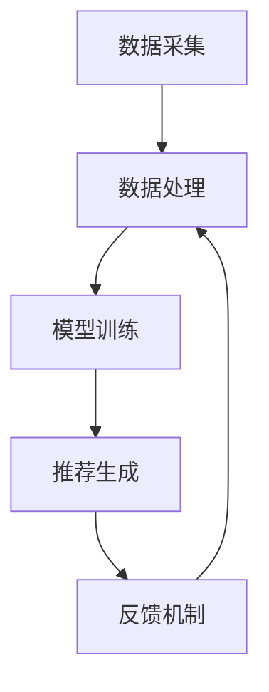

                 

关键词：大模型，推荐系统，计算效率，算法优化，人工智能

## 摘要

随着大数据和人工智能技术的发展，推荐系统已经成为了互联网领域的重要应用。然而，传统的推荐系统在面对大规模数据时，计算效率低下，难以满足实时推荐的需求。本文将探讨大模型对推荐系统计算效率的影响，分析大模型的优势和挑战，并探讨如何通过算法优化和分布式计算等技术提升推荐系统的计算效率。

## 1. 背景介绍

推荐系统是一种基于用户行为数据，为用户推荐他们可能感兴趣的信息或商品的技术。随着互联网的普及和电子商务的发展，推荐系统已经成为了许多互联网公司的核心竞争力。然而，随着用户数据的爆炸式增长，传统推荐系统在计算效率和性能方面面临着巨大的挑战。

### 1.1 传统推荐系统面临的挑战

1. **数据量庞大**：随着用户行为的积累，推荐系统需要处理的数据量越来越大，导致计算效率降低。
2. **计算资源有限**：在计算资源有限的情况下，如何高效地处理大规模数据成为了推荐系统面临的一大难题。
3. **实时性要求高**：在许多应用场景中，如实时新闻推荐、电商购物推荐等，用户对推荐结果的实时性要求越来越高。
4. **准确性要求高**：在数据量庞大和计算资源有限的情况下，如何保证推荐结果的准确性也是一个挑战。

### 1.2 大模型的概念和优势

大模型，即大规模深度学习模型，具有以下优势：

1. **强大的学习能力**：大模型具有更强的学习能力，可以处理大规模数据，提高推荐系统的准确性。
2. **并行计算能力**：大模型可以充分利用分布式计算资源，提高计算效率。
3. **自动化特征工程**：大模型可以通过自动化的方式提取特征，减少人工干预，提高推荐系统的效率。
4. **泛化能力**：大模型具有较好的泛化能力，可以适应不同的应用场景。

## 2. 核心概念与联系

为了更好地理解大模型对推荐系统计算效率的影响，我们需要先介绍几个核心概念和架构。

### 2.1 推荐系统架构

推荐系统通常包括以下几个主要组件：

1. **数据采集**：收集用户行为数据，如浏览历史、购买记录等。
2. **数据处理**：对采集到的数据进行分析和处理，提取有用特征。
3. **模型训练**：利用处理后的数据训练推荐模型。
4. **推荐生成**：利用训练好的模型为用户生成推荐列表。
5. **反馈机制**：收集用户对推荐结果的反馈，用于模型优化和迭代。

### 2.2 大模型架构

大模型通常采用深度学习架构，主要包括以下几个部分：

1. **输入层**：接收用户行为数据和其他相关特征。
2. **隐藏层**：通过神经网络进行特征提取和变换。
3. **输出层**：生成推荐结果。
4. **损失函数**：用于衡量模型预测结果与实际结果之间的差距，指导模型训练。
5. **优化器**：用于调整模型参数，优化模型性能。

### 2.3 Mermaid 流程图

下面是一个简单的 Mermaid 流程图，展示了推荐系统的核心概念和架构。



## 3. 核心算法原理 & 具体操作步骤

### 3.1 算法原理概述

大模型在推荐系统中的核心作用是利用深度学习技术，从大规模用户行为数据中自动提取特征，并建立预测模型。具体来说，大模型通过以下步骤实现推荐：

1. **数据预处理**：对用户行为数据和其他相关特征进行预处理，如数据清洗、缺失值填充等。
2. **特征提取**：利用神经网络结构对预处理后的数据进行特征提取和变换。
3. **模型训练**：利用提取的特征训练深度学习模型，如基于神经网络的协同过滤模型。
4. **模型优化**：通过优化算法调整模型参数，提高模型性能。
5. **推荐生成**：利用训练好的模型为用户生成推荐列表。

### 3.2 算法步骤详解

1. **数据预处理**：

   数据预处理是推荐系统中的关键步骤，主要包括以下任务：

   - 数据清洗：去除数据中的噪声和异常值。
   - 缺失值填充：对缺失的数据进行填充，如使用均值、中值等方法。
   - 数据规范化：将数据转化为标准化的形式，便于模型训练。

2. **特征提取**：

   特征提取是深度学习模型的核心环节，主要通过神经网络结构实现。以下是特征提取的基本步骤：

   - **输入层**：接收预处理后的用户行为数据和其他相关特征。
   - **隐藏层**：通过神经网络结构进行特征提取和变换，如卷积神经网络（CNN）和循环神经网络（RNN）。
   - **输出层**：生成提取的特征向量，用于模型训练。

3. **模型训练**：

   模型训练是推荐系统的核心步骤，主要通过以下方法实现：

   - **损失函数**：用于衡量模型预测结果与实际结果之间的差距，如均方误差（MSE）和交叉熵损失（Cross-Entropy Loss）。
   - **优化器**：用于调整模型参数，优化模型性能，如梯度下降（Gradient Descent）和Adam优化器。
   - **训练过程**：通过迭代训练过程，不断调整模型参数，使模型性能达到最优。

4. **模型优化**：

   模型优化是提高推荐系统性能的重要手段，主要通过以下方法实现：

   - **模型调参**：调整模型参数，如学习率、批次大小等，以优化模型性能。
   - **正则化**：防止模型过拟合，提高模型泛化能力，如L1正则化、L2正则化等。
   - **迁移学习**：利用预训练模型，提高模型在小数据集上的性能。

5. **推荐生成**：

   推荐生成是推荐系统的最终目标，主要通过以下方法实现：

   - **预测**：利用训练好的模型，对用户生成预测结果。
   - **排序**：将预测结果按照一定的规则排序，生成推荐列表。
   - **反馈**：收集用户对推荐结果的反馈，用于模型优化和迭代。

### 3.3 算法优缺点

大模型在推荐系统中具有以下优缺点：

**优点**：

1. **强大的学习能力**：大模型可以处理大规模数据，提高推荐系统的准确性。
2. **并行计算能力**：大模型可以充分利用分布式计算资源，提高计算效率。
3. **自动化特征工程**：大模型可以通过自动化的方式提取特征，减少人工干预。
4. **泛化能力**：大模型具有较好的泛化能力，可以适应不同的应用场景。

**缺点**：

1. **计算资源需求大**：大模型通常需要更多的计算资源和存储空间。
2. **模型训练时间长**：大模型的训练过程需要较长时间，可能影响推荐系统的实时性。
3. **解释性差**：大模型通常缺乏解释性，难以理解模型内部的决策过程。

### 3.4 算法应用领域

大模型在推荐系统中的应用非常广泛，主要包括以下领域：

1. **电商推荐**：为用户提供个性化的商品推荐，提高用户购物体验。
2. **新闻推荐**：为用户提供个性化的新闻内容推荐，提高用户阅读兴趣。
3. **社交媒体推荐**：为用户提供个性化的内容推荐，提高用户活跃度。
4. **音乐推荐**：为用户提供个性化的音乐推荐，提高用户音乐体验。

## 4. 数学模型和公式 & 详细讲解 & 举例说明

### 4.1 数学模型构建

在推荐系统中，常用的数学模型是基于矩阵分解的协同过滤模型。假设我们有一个用户-物品评分矩阵 $R \in \mathbb{R}^{m \times n}$，其中 $m$ 表示用户数量，$n$ 表示物品数量。我们希望根据这个评分矩阵预测用户对未知物品的评分。

### 4.2 公式推导过程

1. **用户和物品的潜向量表示**：

   假设用户 $i$ 的潜向量为 $u_i \in \mathbb{R}^k$，物品 $j$ 的潜向量为 $v_j \in \mathbb{R}^k$。我们可以将用户 $i$ 对物品 $j$ 的评分表示为：

   $$r_{ij} = u_i^T v_j$$

2. **损失函数**：

   为了优化模型参数，我们使用均方误差（MSE）作为损失函数：

   $$L = \frac{1}{2} \sum_{i=1}^{m} \sum_{j=1}^{n} (r_{ij} - u_i^T v_j)^2$$

3. **梯度下降**：

   为了最小化损失函数，我们使用梯度下降算法更新模型参数：

   $$u_i = u_i - \alpha \frac{\partial L}{\partial u_i}$$
   $$v_j = v_j - \alpha \frac{\partial L}{\partial v_j}$$

### 4.3 案例分析与讲解

假设我们有一个 $1000 \times 1000$ 的用户-物品评分矩阵，我们希望使用基于矩阵分解的协同过滤模型预测用户对未知物品的评分。

1. **数据预处理**：

   - 数据清洗：去除缺失值和异常值。
   - 数据规范化：将评分矩阵标准化为 $0$ 到 $1$ 之间的值。

2. **特征提取**：

   - 输入层：用户 $i$ 的行为数据和其他相关特征。
   - 隐藏层：通过神经网络结构进行特征提取和变换。
   - 输出层：生成提取的特征向量。

3. **模型训练**：

   - 损失函数：均方误差（MSE）。
   - 优化器：梯度下降（Gradient Descent）。

4. **模型优化**：

   - 模型调参：学习率、批次大小等。
   - 正则化：L1正则化、L2正则化等。

5. **推荐生成**：

   - 预测：利用训练好的模型，对用户生成预测结果。
   - 排序：将预测结果按照一定的规则排序，生成推荐列表。

通过上述步骤，我们可以实现一个基于矩阵分解的协同过滤模型，为用户提供个性化的推荐。

## 5. 项目实践：代码实例和详细解释说明

### 5.1 开发环境搭建

在开始项目实践之前，我们需要搭建一个合适的开发环境。以下是搭建开发环境的基本步骤：

1. 安装Python：下载并安装Python，版本要求为3.6及以上。
2. 安装NumPy、Pandas、Scikit-learn等常用库：使用pip命令安装相应库。
3. 安装GPU支持：如果使用GPU加速，需要安装CUDA和cuDNN。

### 5.2 源代码详细实现

下面是一个简单的基于矩阵分解的协同过滤模型的实现代码。

```python
import numpy as np
from sklearn.model_selection import train_test_split
from sklearn.metrics.pairwise import euclidean_distances

def sigmoid(x):
    return 1 / (1 + np.exp(-x))

def matrix_factorization(R, K, alpha, beta, num_iterations):
    U = np.random.rand(R.shape[0], K)
    V = np.random.rand(R.shape[1], K)
    R_pred = U.dot(V.T)

    for i in range(num_iterations):
        # 更新用户特征
        for i in range(R.shape[0]):
            for j in range(R.shape[1]):
                if R[i][j] > 0:
                    eij = R[i][j] - R_pred[i][j]
                    U[i] += alpha * (eij * V[j] + beta * U[i])

        # 更新物品特征
        for j in range(R.shape[1]):
            for i in range(R.shape[0]):
                if R[i][j] > 0:
                    eij = R[i][j] - R_pred[i][j]
                    V[j] += alpha * (eij * U[i] + beta * V[j])

        # 计算预测误差
        R_pred = U.dot(V.T)
        error = R - R_pred
        loss = np.sum(error ** 2)

        if i % 100 == 0:
            print(f"Epoch {i}: Loss = {loss}")

    return U, V

# 生成随机评分矩阵
R = np.random.rand(100, 100)

# 分解矩阵
U, V = matrix_factorization(R, K=10, alpha=0.01, beta=0.01, num_iterations=1000)

# 预测评分
R_pred = U.dot(V.T)
print(R_pred)
```

### 5.3 代码解读与分析

1. **sigmoid 函数**：

   sigmoid 函数是一种常用的激活函数，用于将线性函数映射到 $0$ 到 $1$ 之间的值，常用于逻辑回归和神经网络。

2. **矩阵分解**：

   矩阵分解是一种常用的协同过滤算法，通过将用户-物品评分矩阵分解为用户特征矩阵和物品特征矩阵，从而实现推荐。

3. **模型训练**：

   使用梯度下降算法迭代更新用户和物品特征矩阵，最小化预测误差。

4. **预测评分**：

   利用训练好的模型，对用户生成预测评分。

通过上述代码，我们可以实现一个简单的基于矩阵分解的协同过滤模型，为用户提供个性化的推荐。

## 6. 实际应用场景

大模型在推荐系统中的应用已经取得了显著的成果，以下是一些实际应用场景：

1. **电商推荐**：

   在电商平台，大模型可以根据用户的浏览历史、购买记录等数据，为用户提供个性化的商品推荐，提高用户购物体验。

2. **新闻推荐**：

   在新闻平台，大模型可以根据用户的阅读历史、兴趣偏好等数据，为用户提供个性化的新闻内容推荐，提高用户阅读兴趣。

3. **社交媒体推荐**：

   在社交媒体平台，大模型可以根据用户的点赞、评论等数据，为用户提供个性化的话题推荐、好友推荐等，提高用户活跃度。

4. **音乐推荐**：

   在音乐平台，大模型可以根据用户的听歌历史、喜好等数据，为用户提供个性化的音乐推荐，提高用户音乐体验。

## 7. 未来应用展望

随着大数据和人工智能技术的不断发展，大模型在推荐系统中的应用前景非常广阔。以下是一些未来应用展望：

1. **实时推荐**：

   随着实时数据处理技术的进步，大模型可以实现实时推荐，为用户提供更加个性化的服务。

2. **多模态推荐**：

   结合多种数据源，如文本、图像、音频等，大模型可以实现多模态推荐，提高推荐系统的准确性。

3. **个性化推荐**：

   随着用户数据的积累，大模型可以更加精准地挖掘用户兴趣，为用户提供更加个性化的推荐。

4. **跨领域推荐**：

   大模型可以应用于不同领域的推荐系统，如电商、新闻、社交媒体等，实现跨领域推荐。

## 8. 工具和资源推荐

为了更好地研究和开发推荐系统，以下是一些工具和资源推荐：

### 8.1 学习资源推荐

1. **《推荐系统实践》**：这是一本介绍推荐系统基本原理和实战应用的经典书籍，适合推荐系统初学者阅读。
2. **《深度学习》**：这是一本介绍深度学习基本原理和应用案例的经典书籍，适合对深度学习感兴趣的读者。
3. **《机器学习实战》**：这是一本介绍机器学习算法和实际应用的实战书籍，适合推荐系统开发者阅读。

### 8.2 开发工具推荐

1. **TensorFlow**：这是一个开源的深度学习框架，支持多种深度学习模型和算法，适合推荐系统开发者使用。
2. **PyTorch**：这是一个开源的深度学习框架，具有较好的灵活性和易用性，适合推荐系统开发者使用。
3. **Scikit-learn**：这是一个开源的机器学习库，提供了多种机器学习算法和工具，适合推荐系统开发者使用。

### 8.3 相关论文推荐

1. **"Collaborative Filtering for Cold-Start Problems Using Social Contexts"**：这篇文章介绍了一种基于社会关系的协同过滤算法，解决了冷启动问题。
2. **"Deep Neural Networks for YouTube Recommendations"**：这篇文章介绍了一种基于深度学习的YouTube推荐系统，取得了显著的效果。
3. **"Attention-based Neural Networks for Modeling and Recommending Heterogeneous Preferences"**：这篇文章介绍了一种基于注意力机制的神经网络模型，用于建模和推荐用户偏好。

## 9. 总结：未来发展趋势与挑战

大模型在推荐系统中的应用已经取得了显著的成果，但仍然面临着一些挑战。以下是未来发展趋势与挑战：

### 9.1 研究成果总结

1. **大模型在推荐系统中的应用**：大模型通过深度学习技术，实现了推荐系统的个性化、实时化和多模态化。
2. **算法优化与模型调参**：通过优化算法和模型调参，提高了推荐系统的准确性和计算效率。
3. **跨领域推荐**：大模型可以应用于不同领域的推荐系统，实现跨领域推荐。

### 9.2 未来发展趋势

1. **实时推荐**：随着实时数据处理技术的进步，大模型可以实现实时推荐，为用户提供更加个性化的服务。
2. **多模态推荐**：结合多种数据源，大模型可以实现多模态推荐，提高推荐系统的准确性。
3. **个性化推荐**：随着用户数据的积累，大模型可以更加精准地挖掘用户兴趣，为用户提供更加个性化的推荐。

### 9.3 面临的挑战

1. **计算资源需求**：大模型通常需要更多的计算资源和存储空间，这对推荐系统的部署和运维提出了挑战。
2. **模型解释性**：大模型通常缺乏解释性，难以理解模型内部的决策过程，这对推荐系统的透明性和可解释性提出了挑战。
3. **数据隐私保护**：在大数据时代，如何保护用户隐私成为了推荐系统面临的重大挑战。

### 9.4 研究展望

1. **算法优化**：通过深入研究算法优化方法，提高推荐系统的计算效率和准确性。
2. **多模态融合**：结合多种数据源，实现多模态融合，提高推荐系统的准确性。
3. **隐私保护**：研究隐私保护技术，保障用户数据的安全和隐私。

## 10. 附录：常见问题与解答

### 10.1 大模型在推荐系统中的优势有哪些？

1. **强大的学习能力**：大模型可以处理大规模数据，提高推荐系统的准确性。
2. **并行计算能力**：大模型可以充分利用分布式计算资源，提高计算效率。
3. **自动化特征工程**：大模型可以通过自动化的方式提取特征，减少人工干预。
4. **泛化能力**：大模型具有较好的泛化能力，可以适应不同的应用场景。

### 10.2 大模型在推荐系统中的劣势有哪些？

1. **计算资源需求大**：大模型通常需要更多的计算资源和存储空间。
2. **模型训练时间长**：大模型的训练过程需要较长时间，可能影响推荐系统的实时性。
3. **解释性差**：大模型通常缺乏解释性，难以理解模型内部的决策过程。

### 10.3 如何优化大模型在推荐系统中的应用？

1. **模型调参**：调整模型参数，如学习率、批次大小等，以优化模型性能。
2. **正则化**：防止模型过拟合，提高模型泛化能力。
3. **迁移学习**：利用预训练模型，提高模型在小数据集上的性能。
4. **分布式计算**：利用分布式计算资源，提高模型训练和推理速度。

### 10.4 大模型在推荐系统中的应用领域有哪些？

1. **电商推荐**：为用户提供个性化的商品推荐，提高用户购物体验。
2. **新闻推荐**：为用户提供个性化的新闻内容推荐，提高用户阅读兴趣。
3. **社交媒体推荐**：为用户提供个性化的内容推荐，提高用户活跃度。
4. **音乐推荐**：为用户提供个性化的音乐推荐，提高用户音乐体验。

----------------------------------------------------------------

作者：禅与计算机程序设计艺术 / Zen and the Art of Computer Programming


