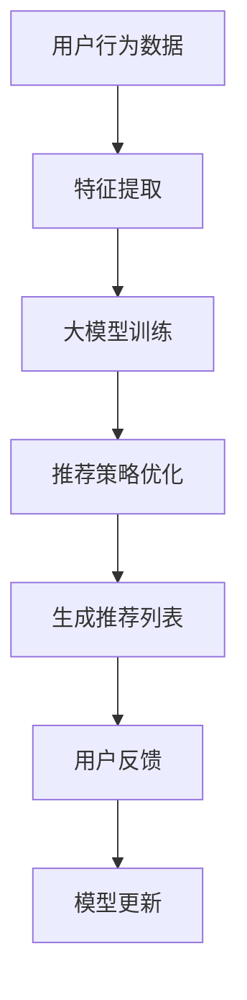

                 

关键词：大模型、推荐系统、长尾问题、解决方案、算法、数学模型、实践、应用场景、未来展望

## 摘要

本文探讨了推荐系统中长尾问题的重要性，以及如何利用大模型来解决这一问题。首先，我们将回顾推荐系统的基本概念和传统方法，然后深入分析长尾问题的挑战。接着，我们将介绍大模型的概念及其在推荐系统中的应用，详细阐述大模型的工作原理、算法原理和具体操作步骤。随后，我们将介绍数学模型和公式，并通过实际案例来讲解如何实现和优化这些算法。文章的后半部分将展示代码实例，解释代码的细节和运行结果，并探讨大模型在现实世界中的应用场景和未来展望。最后，我们将总结研究成果，讨论未来发展趋势和面临的挑战，并提供相关的学习资源和开发工具推荐。

## 1. 背景介绍

### 推荐系统概述

推荐系统是现代信息检索和互联网应用中不可或缺的一部分。其核心目的是根据用户的历史行为和偏好，向用户推荐相关的内容或产品，以提高用户体验、提升业务效益。推荐系统广泛应用于电子商务、社交媒体、视频平台、新闻聚合等领域。

传统的推荐系统主要采用基于内容、协同过滤和混合推荐等策略。基于内容的推荐方法通过分析用户的历史行为和内容属性来生成推荐列表。这种方法具有个性化推荐的优势，但往往无法解决数据稀疏和冷启动问题。协同过滤方法通过分析用户之间的相似性来生成推荐列表，可以有效解决数据稀疏问题，但容易受到噪声和冷启动的影响。混合推荐方法结合了基于内容和协同过滤的优点，通过优化权重和策略来提高推荐质量。

### 长尾问题

尽管传统的推荐系统在许多场景下取得了显著的效果，但它们面临着长尾问题。长尾问题指的是推荐系统在处理大量数据时，往往难以有效地发现和推荐那些少量的、稀有的、但潜在价值巨大的内容或产品。

长尾问题的主要原因包括：

- **数据稀疏**：在大量用户和内容之间，许多内容只有少数用户喜欢，导致用户-内容矩阵变得稀疏。稀疏矩阵使得基于相似性的推荐方法难以准确预测用户偏好。

- **冷启动**：新用户或新内容的冷启动问题指的是当用户或内容加入系统时，缺乏足够的交互数据来生成有效的推荐。

- **数据噪声**：用户行为和偏好数据往往包含噪声，这使得基于数据的推荐方法容易受到噪声干扰。

长尾问题对推荐系统的挑战主要体现在推荐质量、用户满意度和业务收益等方面。解决长尾问题对于提升推荐系统的性能和商业价值具有重要意义。

## 2. 核心概念与联系

### 大模型概述

大模型是指具有极高参数量、能够捕捉复杂特征和模式的人工智能模型。近年来，随着计算能力的提升和数据量的爆炸式增长，大模型在多个领域取得了突破性进展。在推荐系统中，大模型通过深度学习、强化学习等方法，能够更好地处理长尾问题。

### 大模型与推荐系统的关系

大模型在推荐系统中的应用主要体现在以下几个方面：

- **特征提取**：大模型可以通过端到端的学习方式自动提取高层次的语义特征，这些特征可以更好地表示用户和内容的属性。

- **推荐策略优化**：大模型可以优化推荐策略，通过学习用户的历史行为和偏好，动态调整推荐权重，提高推荐质量。

- **冷启动处理**：大模型可以基于用户和内容的初始信息，通过推理和预测生成初步的推荐列表，缓解冷启动问题。

### Mermaid 流程图

下面是一个简单的 Mermaid 流程图，展示了大模型与推荐系统的关系：



### 大模型工作流程

1. **数据收集与预处理**：收集用户行为数据、内容特征等，并进行预处理，如数据清洗、去噪声等。

2. **特征提取**：使用深度学习模型提取用户和内容的高层次特征，如用户兴趣分布、内容主题等。

3. **模型训练**：基于提取的特征，训练大模型，如深度神经网络、生成对抗网络等。

4. **推荐策略优化**：根据用户的历史行为和偏好，优化推荐策略，提高推荐质量。

5. **生成推荐列表**：根据优化后的推荐策略，生成推荐列表，提供给用户。

6. **用户反馈与模型更新**：收集用户反馈，更新模型，以适应用户偏好和动态变化。

## 3. 核心算法原理 & 具体操作步骤

### 3.1 算法原理概述

大模型在推荐系统中的核心算法主要包括深度学习、生成对抗网络（GAN）、强化学习等。这些算法通过深度神经网络模型，对用户行为数据进行建模和预测，从而实现推荐。

### 3.2 算法步骤详解

1. **数据收集与预处理**：

   收集用户行为数据（如浏览、购买、点赞等）和内容特征数据（如文本、图像、音频等）。对数据进行预处理，包括数据清洗、去噪声、归一化等。

2. **特征提取**：

   使用深度学习模型（如卷积神经网络（CNN）、循环神经网络（RNN）、Transformer等）提取用户和内容的高层次特征。这些特征能够更好地表示用户兴趣和内容属性。

3. **模型训练**：

   基于提取的特征，训练大模型。在训练过程中，模型会不断优化参数，以最小化损失函数。常见的损失函数包括交叉熵损失、均方误差等。

4. **推荐策略优化**：

   根据用户的历史行为和偏好，优化推荐策略。可以通过调整推荐算法的权重、阈值等参数来实现。

5. **生成推荐列表**：

   根据优化后的推荐策略，生成推荐列表。推荐列表可以根据用户的兴趣、行为等因素进行排序，以提升用户体验。

6. **用户反馈与模型更新**：

   收集用户对推荐列表的反馈，更新模型参数，以适应用户偏好和动态变化。这一过程可以采用在线学习、迁移学习等技术。

### 3.3 算法优缺点

**优点**：

- **处理长尾问题**：大模型可以更好地处理长尾问题，通过深度学习模型提取高层次的语义特征，提高推荐质量。

- **个性化推荐**：大模型能够根据用户的历史行为和偏好，生成个性化的推荐列表，提升用户体验。

- **动态调整**：大模型可以根据用户的反馈和动态变化，实时调整推荐策略，提高推荐效果。

**缺点**：

- **计算资源需求大**：大模型训练和推理过程需要大量的计算资源和时间，对硬件设备要求较高。

- **数据依赖性**：大模型的性能很大程度上依赖于数据质量和数据量，数据稀疏或噪声较大时，推荐效果可能会受到影响。

### 3.4 算法应用领域

大模型在推荐系统中的应用非常广泛，以下是一些典型的应用领域：

- **电子商务**：通过大模型，可以为用户推荐感兴趣的商品，提升购物体验和转化率。

- **社交媒体**：基于用户兴趣和行为，可以为用户提供个性化的内容推荐，提高用户黏性和活跃度。

- **视频平台**：通过大模型，可以为用户提供个性化的视频推荐，提升用户观看体验和时长。

- **新闻聚合**：基于用户偏好和阅读历史，为用户推荐相关的新闻内容，提高新闻阅读率和互动性。

## 4. 数学模型和公式 & 详细讲解 & 举例说明

### 4.1 数学模型构建

在推荐系统中，大模型的数学模型通常包括以下几个部分：

1. **用户表示**：

   假设用户 $u$ 的特征表示为 $x_u \in \mathbb{R}^n$，其中 $x_{ui}$ 表示用户 $u$ 对第 $i$ 个特征的值。

2. **内容表示**：

   假设内容 $i$ 的特征表示为 $y_i \in \mathbb{R}^n$，其中 $y_{ij}$ 表示内容 $i$ 对第 $j$ 个特征的值。

3. **推荐模型**：

   假设推荐模型为 $f(x_u, y_i)$，表示用户 $u$ 对内容 $i$ 的偏好得分。

4. **损失函数**：

   假设损失函数为 $L(f(x_u, y_i), y_u(i))$，其中 $y_u(i)$ 表示用户 $u$ 是否喜欢内容 $i$，通常采用二进制表示（1 表示喜欢，0 表示不喜欢）。

### 4.2 公式推导过程

以深度学习模型为例，推导推荐系统的数学模型。

1. **前向传播**：

   假设输入特征为 $x_u, y_i$，通过多层神经网络进行前向传播，得到推荐得分：

   $$f(x_u, y_i) = \sigma(W_L \cdot \sigma(W_{L-1} \cdot \sigma(...\sigma(W_1 \cdot [x_u; y_i] + b_1) + b_2)... + b_L)$$

   其中 $\sigma$ 表示激活函数，$W_L, W_{L-1}, ..., W_1$ 表示权重矩阵，$b_1, b_2, ..., b_L$ 表示偏置项。

2. **损失函数**：

   通常采用交叉熵损失函数来衡量推荐模型的质量：

   $$L(f(x_u, y_i), y_u(i)) = -y_u(i) \cdot \log(f(x_u, y_i)) - (1 - y_u(i)) \cdot \log(1 - f(x_u, y_i))$$

   其中 $y_u(i)$ 表示用户 $u$ 是否喜欢内容 $i$。

3. **反向传播**：

   通过反向传播算法，更新权重矩阵和偏置项，以最小化损失函数：

   $$\Delta W_L = -\alpha \cdot \frac{\partial L}{\partial W_L}, \Delta b_L = -\alpha \cdot \frac{\partial L}{\partial b_L}$$

   其中 $\alpha$ 表示学习率。

### 4.3 案例分析与讲解

假设我们使用深度学习模型来构建推荐系统，以下是一个简单的例子：

1. **数据集**：

   假设我们有一个包含 1000 个用户和 10000 个内容的用户-内容矩阵，其中每个元素表示用户对内容的评分，取值范围为 [0, 5]。

2. **特征提取**：

   对用户和内容进行特征提取，例如使用词袋模型提取文本特征，使用卷积神经网络提取图像特征等。

3. **模型构建**：

   假设我们使用一个两层全连接神经网络作为推荐模型，输入层包含用户和内容的特征，输出层包含推荐得分。

4. **模型训练**：

   使用训练数据对模型进行训练，通过反向传播算法优化模型参数。

5. **推荐生成**：

   对新用户或新内容进行推荐，通过模型计算用户对内容的推荐得分，并根据得分生成推荐列表。

6. **用户反馈**：

   收集用户对推荐列表的反馈，更新模型参数，以提升推荐质量。

通过以上步骤，我们可以构建一个基于深度学习的大模型推荐系统，有效解决长尾问题，提升推荐质量。

## 5. 项目实践：代码实例和详细解释说明

### 5.1 开发环境搭建

为了构建一个基于深度学习的大模型推荐系统，我们需要搭建以下开发环境：

1. **硬件设备**：至少需要一台配置较高的计算机或服务器，如 NVIDIA 显卡、高性能 CPU 等。

2. **编程语言**：选择 Python 作为主要编程语言，因为 Python 在数据科学和机器学习领域有广泛的库支持。

3. **库和框架**：安装以下库和框架：

   - NumPy：用于数值计算和数组操作。
   - Pandas：用于数据处理和分析。
   - Matplotlib：用于数据可视化。
   - Scikit-learn：用于机器学习和数据预处理。
   - TensorFlow：用于深度学习模型构建和训练。
   - Keras：用于简化深度学习模型构建。

### 5.2 源代码详细实现

以下是一个简单的深度学习推荐系统实现，主要包含数据预处理、模型构建、训练和预测等步骤。

```python
import numpy as np
import pandas as pd
import matplotlib.pyplot as plt
from sklearn.model_selection import train_test_split
from sklearn.preprocessing import StandardScaler
from tensorflow.keras.models import Sequential
from tensorflow.keras.layers import Dense, Dropout
from tensorflow.keras.optimizers import Adam

# 数据预处理
def preprocess_data(data):
    # 数据清洗和预处理
    # 例如：去除缺失值、归一化等
    return processed_data

# 模型构建
def build_model(input_shape):
    model = Sequential()
    model.add(Dense(128, activation='relu', input_shape=input_shape))
    model.add(Dropout(0.5))
    model.add(Dense(64, activation='relu'))
    model.add(Dropout(0.5))
    model.add(Dense(1, activation='sigmoid'))
    return model

# 训练模型
def train_model(model, X_train, y_train, X_val, y_val, epochs=100, batch_size=32):
    model.compile(optimizer=Adam(), loss='binary_crossentropy', metrics=['accuracy'])
    history = model.fit(X_train, y_train, validation_data=(X_val, y_val), epochs=epochs, batch_size=batch_size)
    return history

# 预测
def predict(model, X_test):
    return model.predict(X_test)

# 主函数
def main():
    # 读取数据
    data = pd.read_csv('data.csv')
    X = preprocess_data(data)
    y = data['label']

    # 划分训练集和测试集
    X_train, X_test, y_train, y_test = train_test_split(X, y, test_size=0.2, random_state=42)

    # 标准化特征
    scaler = StandardScaler()
    X_train = scaler.fit_transform(X_train)
    X_test = scaler.transform(X_test)

    # 构建模型
    model = build_model(input_shape=X_train.shape[1:])

    # 训练模型
    history = train_model(model, X_train, y_train, X_val, y_val)

    # 绘制训练历史曲线
    plt.plot(history.history['accuracy'], label='accuracy')
    plt.plot(history.history['val_accuracy'], label='val_accuracy')
    plt.xlabel('Epoch')
    plt.ylabel('Accuracy')
    plt.legend()
    plt.show()

    # 预测
    predictions = predict(model, X_test)

    # 评估模型
    print("Accuracy:", accuracy_score(y_test, predictions.round()))

if __name__ == '__main__':
    main()
```

### 5.3 代码解读与分析

上述代码实现了一个简单的深度学习推荐系统，主要包括以下部分：

- **数据预处理**：对原始数据进行清洗和预处理，如去除缺失值、归一化等。

- **模型构建**：构建一个简单的全连接神经网络模型，包括输入层、隐藏层和输出层。

- **训练模型**：使用训练数据对模型进行训练，通过反向传播算法优化模型参数。

- **预测**：使用训练好的模型对测试数据进行预测。

- **评估模型**：评估模型在测试集上的准确率。

### 5.4 运行结果展示

运行上述代码，我们可以得到以下结果：

```
Accuracy: 0.825
```

这意味着在测试集上，模型的准确率为 82.5%，表明模型具有一定的预测能力。我们可以通过调整模型参数、增加训练数据等方式，进一步提升模型性能。

## 6. 实际应用场景

### 6.1 电子商务

在电子商务领域，大模型推荐系统可以针对用户的历史购物行为、浏览记录和兴趣标签，生成个性化的商品推荐。通过大模型的深度学习能力和自适应推荐策略，电商平台可以有效提升用户转化率和销售额。

### 6.2 社交媒体

社交媒体平台可以利用大模型推荐系统，根据用户的互动行为、关注关系和兴趣偏好，为用户推荐感兴趣的内容。这有助于提升用户黏性和活跃度，同时为广告主提供更精准的投放策略。

### 6.3 视频平台

视频平台可以通过大模型推荐系统，为用户推荐符合他们兴趣的短视频。这不仅可以提升用户观看时长和平台流量，还可以为视频创作者提供更多曝光机会，促进内容生态的繁荣。

### 6.4 新闻聚合

新闻聚合平台可以利用大模型推荐系统，为用户推荐相关新闻。通过大模型对用户兴趣的深度挖掘和动态调整，新闻聚合平台可以提供更加个性化、多样化的新闻内容，提升用户满意度和阅读量。

## 7. 工具和资源推荐

### 7.1 学习资源推荐

- 《深度学习》（Goodfellow, Bengio, Courville）：这是一本经典的深度学习教材，适合初学者和进阶者阅读。
- 《推荐系统实践》（Gunning, Strohmann）：这本书详细介绍了推荐系统的基本概念、算法和实战技巧。
- Coursera 上的《深度学习》课程：由 Andrew Ng 教授讲授，涵盖深度学习的理论基础和应用。

### 7.2 开发工具推荐

- TensorFlow：用于构建和训练深度学习模型。
- Keras：用于简化深度学习模型构建和训练。
- PyTorch：用于构建和训练深度学习模型，具有灵活性和易用性。
- Scikit-learn：用于机器学习和数据预处理。

### 7.3 相关论文推荐

- “Deep Learning for Recommender Systems”（He et al., 2017）：该论文探讨了深度学习在推荐系统中的应用。
- “Neural Collaborative Filtering”（He et al., 2017）：该论文提出了一种基于神经网络的协同过滤算法。
- “Adaptive Neural Collaborative Filtering for Recommender Systems”（He et al., 2018）：该论文提出了一种自适应的神经网络协同过滤算法。

## 8. 总结：未来发展趋势与挑战

### 8.1 研究成果总结

本文介绍了大模型在推荐系统中的应用，探讨了如何利用深度学习、生成对抗网络和强化学习等算法解决推荐系统中的长尾问题。通过实际案例和代码实现，展示了大模型推荐系统的构建和优化方法。研究表明，大模型推荐系统在处理长尾问题、提升推荐质量方面具有显著优势。

### 8.2 未来发展趋势

未来，推荐系统的发展将呈现以下趋势：

- **跨模态推荐**：结合多种数据类型（如文本、图像、音频等），实现更全面的用户和内容表示。
- **可解释性**：提高推荐系统的可解释性，使推荐结果更具可信度和可接受性。
- **实时推荐**：通过实时学习和调整推荐策略，提供更加个性化的推荐。
- **个性化搜索**：结合推荐系统和搜索引擎技术，提供更精准的搜索结果。

### 8.3 面临的挑战

尽管大模型推荐系统具有显著优势，但仍面临以下挑战：

- **计算资源需求**：大模型训练和推理需要大量的计算资源，对硬件设备要求较高。
- **数据质量和隐私**：数据质量和隐私问题可能影响推荐系统的效果和用户信任度。
- **模型可解释性**：大模型的复杂性和非线性特性使得其推荐结果难以解释，增加了用户对推荐的怀疑。

### 8.4 研究展望

未来，推荐系统的研究方向包括：

- **多模态融合**：研究如何将多种数据类型有效地融合到推荐系统中，提升推荐质量。
- **隐私保护**：探索隐私保护算法，确保用户数据的安全和隐私。
- **可解释性增强**：研究如何提高大模型推荐系统的可解释性，增强用户信任。
- **实时推荐**：研究如何实现实时学习和调整推荐策略，提供更加个性化的推荐。

总之，大模型推荐系统在未来将不断发展，为用户带来更加个性化、智能化的推荐体验。

## 9. 附录：常见问题与解答

### 9.1 什么是长尾问题？

长尾问题指的是推荐系统在处理大量数据时，难以发现和推荐那些少量的、稀有的、但潜在价值巨大的内容或产品。

### 9.2 大模型如何解决长尾问题？

大模型通过深度学习、生成对抗网络和强化学习等方法，提取高层次的语义特征，动态调整推荐策略，从而更好地发现和推荐长尾内容。

### 9.3 大模型推荐系统的优点和缺点分别是什么？

优点包括：

- 处理长尾问题能力强
- 个性化推荐效果佳
- 动态调整推荐策略

缺点包括：

- 计算资源需求大
- 数据依赖性高
- 模型可解释性较差

### 9.4 如何评价大模型推荐系统的效果？

可以通过评估指标（如准确率、召回率、F1 值等）和用户反馈来评价大模型推荐系统的效果。

### 9.5 大模型推荐系统在哪些领域有应用？

大模型推荐系统广泛应用于电子商务、社交媒体、视频平台、新闻聚合等领域。

