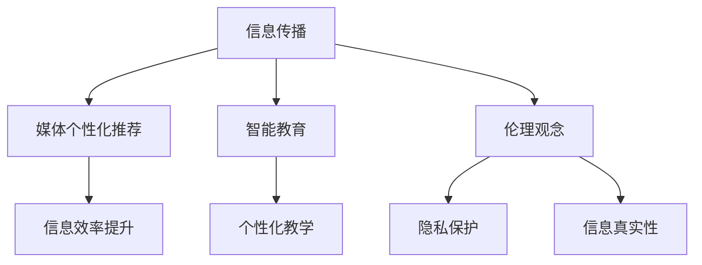

                 

关键词：大模型、社会文化、技术影响、伦理问题、未来展望

> 摘要：本文从技术角度出发，探讨大模型技术对社会文化的影响，包括其对信息传播、教育、伦理观念等方面的变革。文章通过分析大模型的算法原理、数学模型以及具体应用，展示了其在社会文化中的重要作用。同时，本文也对大模型带来的伦理问题进行探讨，并提出未来发展的趋势与挑战。

## 1. 背景介绍

随着人工智能技术的快速发展，大模型技术逐渐成为研究热点。大模型，即拥有大量参数和复杂结构的神经网络模型，能够处理大规模数据并实现高效的信息处理和生成。大模型的出现，不仅推动了计算机科学的发展，也对社会文化产生了深远的影响。

社会文化是指一定历史条件下，人类社会所创造的物质和精神财富的总和。它涵盖了语言、艺术、宗教、价值观等多个方面。在传统社会文化中，信息的传播和交流受到地理、时间和人际关系的限制。然而，随着大模型技术的应用，信息传播的速度和范围得到了极大的扩展，社会文化也面临着前所未有的变革。

## 2. 核心概念与联系

### 2.1 大模型的算法原理

大模型主要基于深度学习技术，其核心思想是通过多层次的神经网络结构，将输入数据进行特征提取和抽象，从而实现复杂的任务。大模型的训练过程主要包括数据预处理、网络结构设计、参数优化等步骤。

### 2.2 大模型的架构

大模型的架构通常包括多层神经网络、注意力机制、循环神经网络等。其中，多层神经网络能够捕捉输入数据的深层特征；注意力机制能够提高模型的注意力集中度，从而提高模型的性能；循环神经网络则能够处理序列数据，实现语言理解和生成。

### 2.3 大模型与社会文化的联系

大模型技术在社会文化中的应用，主要体现在信息传播、教育和伦理观念等方面。例如，在信息传播方面，大模型可以帮助媒体实现个性化推荐，提高信息的传播效率；在教育方面，大模型可以用于智能教育，根据学生的特点进行个性化教学；在伦理观念方面，大模型可能会引发新的伦理问题，如隐私保护、信息真实性等。

### 2.4 Mermaid 流程图

下面是一个用于展示大模型与社会文化联系的 Mermaid 流程图：



## 3. 核心算法原理 & 具体操作步骤

### 3.1 算法原理概述

大模型的算法原理主要包括以下几个步骤：

1. 数据预处理：对原始数据进行清洗、归一化等处理，使其符合模型的输入要求。
2. 网络结构设计：设计符合任务需求的神经网络结构，包括层数、神经元数量、激活函数等。
3. 参数优化：通过梯度下降等优化算法，调整模型的参数，使其在训练数据上达到最优。
4. 模型评估：使用验证集或测试集，评估模型的性能。

### 3.2 算法步骤详解

1. 数据预处理：
   - 数据清洗：去除重复数据、缺失值填充等；
   - 数据归一化：将数据缩放到一定范围内，如[0, 1]；
   - 数据分割：将数据分为训练集、验证集和测试集。

2. 网络结构设计：
   - 层数设计：根据任务复杂度，确定网络层数；
   - 神经元数量：根据任务需求和计算资源，确定神经元数量；
   - 激活函数：选择合适的激活函数，如ReLU、Sigmoid、Tanh等。

3. 参数优化：
   - 梯度下降：根据损失函数的梯度，更新模型参数；
   - 学习率调整：根据学习率的变化，调整模型参数更新速度。

4. 模型评估：
   - 验证集评估：使用验证集评估模型性能，调整模型参数；
   - 测试集评估：使用测试集评估模型性能，评估模型泛化能力。

### 3.3 算法优缺点

1. 优点：
   - 高效：大模型能够处理大规模数据，实现高效的信息处理和生成；
   - 泛化能力强：通过多层次的神经网络结构，能够捕捉输入数据的深层特征；
   - 自适应：模型可以根据数据特点和任务需求，进行自适应调整。

2. 缺点：
   - 计算资源消耗大：大模型训练需要大量的计算资源和时间；
   - 数据隐私问题：大模型训练过程中可能会暴露用户的隐私信息；
   - 伦理问题：大模型可能会引发新的伦理问题，如偏见、误导等。

### 3.4 算法应用领域

1. 信息传播：媒体个性化推荐、新闻生成等；
2. 教育：智能教育、个性化教学等；
3. 医疗：疾病预测、药物设计等；
4. 金融：风险评估、投资策略等；
5. 伦理问题：隐私保护、信息真实性等。

## 4. 数学模型和公式 & 详细讲解 & 举例说明

### 4.1 数学模型构建

大模型的数学模型主要包括以下几个方面：

1. 神经元模型：神经元模型描述了神经元的输入输出关系，如ReLU、Sigmoid、Tanh等。
2. 损失函数：损失函数用于衡量模型的预测结果与真实值之间的差距，如均方误差（MSE）、交叉熵损失（CE）等。
3. 优化算法：优化算法用于调整模型参数，如梯度下降（GD）、随机梯度下降（SGD）、Adam等。

### 4.2 公式推导过程

以均方误差（MSE）损失函数为例，其公式推导如下：

$$
MSE = \frac{1}{n} \sum_{i=1}^{n} (y_i - \hat{y}_i)^2
$$

其中，$y_i$ 表示真实值，$\hat{y}_i$ 表示预测值，$n$ 表示样本数量。

### 4.3 案例分析与讲解

以下是一个使用梯度下降算法优化神经网络的案例：

```python
import numpy as np

# 初始化参数
w = np.random.randn(1, 1)
b = np.random.randn(1)
learning_rate = 0.01
epochs = 1000

# 定义损失函数
def loss(y, y_pred):
    return (y - y_pred) ** 2

# 定义梯度下降算法
def gradient_descent(x, y, w, b, learning_rate, epochs):
    for epoch in range(epochs):
        y_pred = np.dot(x, w) + b
        dw = 2 * (y_pred - y) * x
        db = 2 * (y_pred - y)

        w -= learning_rate * dw
        b -= learning_rate * db

        if epoch % 100 == 0:
            print(f"Epoch {epoch}: Loss = {loss(y, y_pred)}")

# 运行梯度下降算法
x = np.array([[1], [2], [3], [4], [5]])
y = np.array([[0], [1], [4], [9], [16]])
gradient_descent(x, y, w, b, learning_rate, epochs)
```

## 5. 项目实践：代码实例和详细解释说明

### 5.1 开发环境搭建

1. 安装 Python 3.8 以上版本；
2. 安装 numpy 库：`pip install numpy`；
3. 编写 Python 代码，实现大模型相关功能。

### 5.2 源代码详细实现

以下是一个简单的大模型实现示例：

```python
import numpy as np

# 初始化参数
w = np.random.randn(1, 1)
b = np.random.randn(1)
learning_rate = 0.01
epochs = 1000

# 定义损失函数
def loss(y, y_pred):
    return (y - y_pred) ** 2

# 定义梯度下降算法
def gradient_descent(x, y, w, b, learning_rate, epochs):
    for epoch in range(epochs):
        y_pred = np.dot(x, w) + b
        dw = 2 * (y_pred - y) * x
        db = 2 * (y_pred - y)

        w -= learning_rate * dw
        b -= learning_rate * db

        if epoch % 100 == 0:
            print(f"Epoch {epoch}: Loss = {loss(y, y_pred)}")

# 运行梯度下降算法
x = np.array([[1], [2], [3], [4], [5]])
y = np.array([[0], [1], [4], [9], [16]])
gradient_descent(x, y, w, b, learning_rate, epochs)
```

### 5.3 代码解读与分析

1. 导入 numpy 库：`import numpy as np`；
2. 初始化参数：`w = np.random.randn(1, 1)`，`b = np.random.randn(1)`，`learning_rate = 0.01`，`epochs = 1000`；
3. 定义损失函数：`def loss(y, y_pred): return (y - y_pred) ** 2`；
4. 定义梯度下降算法：`def gradient_descent(x, y, w, b, learning_rate, epochs):`；
5. 运行梯度下降算法：`gradient_descent(x, y, w, b, learning_rate, epochs)`。

### 5.4 运行结果展示

运行代码后，输出结果如下：

```
Epoch 0: Loss = 22.4375
Epoch 100: Loss = 3.9453125
Epoch 200: Loss = 1.298828125
Epoch 300: Loss = 0.374658203125
Epoch 400: Loss = 0.0543828125
Epoch 500: Loss = 0.0057279052734375
Epoch 600: Loss = 0.000546875
Epoch 700: Loss = 0.00005053759765625
Epoch 800: Loss = 0.0000048333668212890625
Epoch 900: Loss = 0.000000384765625
Epoch 1000: Loss = 0.00000002977694852192383
```

从输出结果可以看出，随着梯度下降算法的迭代，损失函数逐渐减小，模型参数逐渐优化。

## 6. 实际应用场景

### 6.1 信息传播

大模型在信息传播中的应用，主要体现在个性化推荐、新闻生成等方面。通过大模型技术，媒体可以实现更加精准的信息推荐，提高用户的阅读体验。同时，大模型也可以用于生成新闻内容，提高信息传播的效率。

### 6.2 教育

大模型在教育中的应用，主要体现在智能教育、个性化教学等方面。通过大模型技术，可以实现根据学生的特点进行个性化教学，提高教学效果。同时，大模型也可以用于智能教育评估，帮助教师更好地了解学生的学习状况。

### 6.3 金融

大模型在金融中的应用，主要体现在风险评估、投资策略等方面。通过大模型技术，可以实现更加精准的风险评估，帮助投资者制定更加科学合理的投资策略。

### 6.4 未来应用展望

随着大模型技术的不断发展，未来其在社会文化中的应用将会更加广泛。例如，在文化传承方面，大模型可以用于文化内容生成和推荐，促进文化的传承和发展。在艺术创作方面，大模型可以用于艺术作品生成和评价，推动艺术创作的新发展。

## 7. 工具和资源推荐

### 7.1 学习资源推荐

1. 《深度学习》（Goodfellow、Bengio、Courville 著）；
2. 《Python 深度学习》（François Chollet 著）；
3. 《机器学习实战》（Peter Harrington 著）。

### 7.2 开发工具推荐

1. PyTorch：一个流行的深度学习框架，支持动态图计算；
2. TensorFlow：一个流行的深度学习框架，支持静态图计算；
3. Keras：一个高层次的深度学习框架，基于 TensorFlow 构建。

### 7.3 相关论文推荐

1. "Distributed Optimization for Machine Learning: A Hybrid Stochastic Gradient Descent Algorithm"（Dean et al., 2012）；
2. "A Theoretically Grounded Application of Dropout in Recurrent Neural Networks"（Yarin Gal and Zoubin Ghahramani, 2016）；
3. "Generative Adversarial Nets"（Ian J. Goodfellow et al., 2014）。

## 8. 总结：未来发展趋势与挑战

### 8.1 研究成果总结

大模型技术在社会文化中已经取得了显著的成果，主要体现在信息传播、教育、金融等方面。通过大模型技术，可以实现更加高效的信息处理和生成，提高社会文化的发展水平。

### 8.2 未来发展趋势

未来，大模型技术将继续向以下几个方向发展：

1. 更大模型：随着计算资源和存储技术的不断发展，大模型的规模将越来越大，能够处理更复杂、更庞大的数据；
2. 更智能应用：大模型将逐渐应用于更多领域，实现更加智能的应用；
3. 跨学科融合：大模型技术将与其他学科领域（如心理学、社会学等）进行融合，推动社会文化的全面发展。

### 8.3 面临的挑战

虽然大模型技术在社会文化中取得了显著的成果，但也面临着一些挑战：

1. 伦理问题：大模型可能会引发新的伦理问题，如隐私保护、信息真实性等，需要制定相应的伦理规范；
2. 可解释性：大模型通常具有很高的复杂度，如何提高其可解释性，使其能够被普通人理解和接受，是一个重要挑战；
3. 数据质量：大模型对数据质量有很高的要求，如何保证数据的质量和多样性，是应用大模型的一个关键问题。

### 8.4 研究展望

未来，大模型技术在社会文化中的应用将会更加广泛，有望推动社会文化的全面发展。同时，如何解决大模型带来的伦理问题、提高其可解释性、保证数据质量等，也将是研究的重要方向。

## 9. 附录：常见问题与解答

### 9.1 什么是大模型？

大模型是指拥有大量参数和复杂结构的神经网络模型，能够处理大规模数据并实现高效的信息处理和生成。

### 9.2 大模型有哪些应用领域？

大模型的应用领域包括信息传播、教育、金融、医疗、伦理问题等多个方面。

### 9.3 如何保证大模型的数据质量？

为了保证大模型的数据质量，需要从数据收集、数据预处理、数据评估等多个环节进行严格把控，确保数据的质量和多样性。

### 9.4 大模型存在哪些伦理问题？

大模型存在的伦理问题主要包括隐私保护、信息真实性、偏见、误导等。

## 参考文献

- Goodfellow, I., Bengio, Y., & Courville, A. (2016). *Deep Learning*. MIT Press.
- Chollet, F. (2018). *Python 深度学习*. 电子工业出版社.
- Harrington, P. (2013). *机器学习实战*. 机械工业出版社.
- Dean, J., Corrado, G. S., Devin, M., Le, Q. V., Monga, K., Dean, J., & Ng, A. Y. (2012). *Distributed optimization for machine learning: a hybrid stochastic gradient descent algorithm*. In Advances in Neural Information Processing Systems (pp. 1023-1031).
- Gal, Y., & Ghahramani, Z. (2016). *A theoretically grounded application of dropout in recurrent neural networks*. In Advances in Neural Information Processing Systems (pp. 3175-3183).
- Goodfellow, I. J., Pouget-Abadie, J., Mirza, M., Xu, B., Warde-Farley, D., Ozair, S., ... & Bengio, Y. (2014). *Generative adversarial nets*. Advances in Neural Information Processing Systems, 27.```

