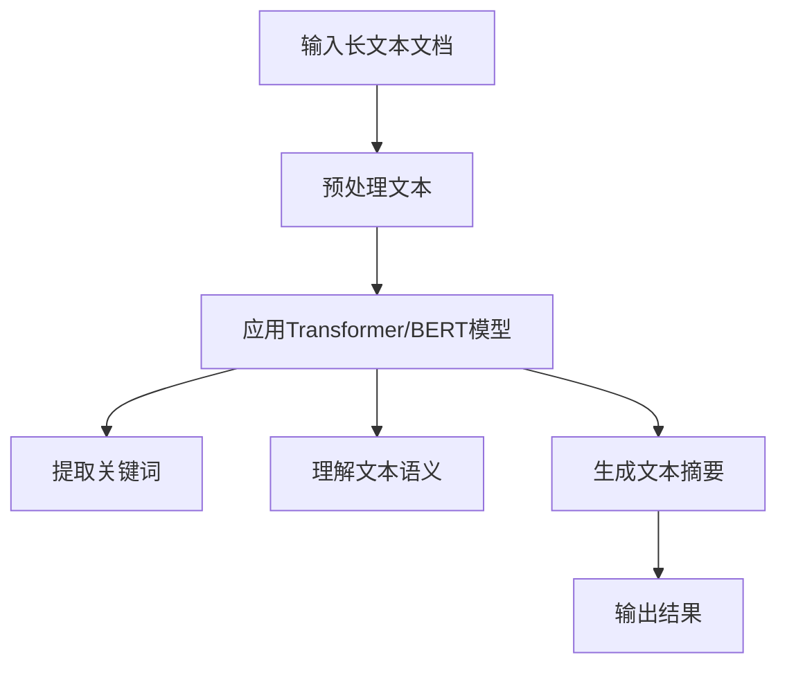

                 

在当今的信息时代，长文本文档的处理和理解变得越来越重要。无论是社交媒体上的长篇文章、学术文献，还是企业内部报告和电子邮件，长文本文档都是信息传递的重要载体。然而，传统的方法在处理长文本文档时往往面临诸多挑战，如信息过载、理解深度不足等。随着深度学习和自然语言处理技术的快速发展，大模型（如Transformer、BERT等）逐渐成为解决这些问题的有力工具。本文将探讨大模型对长文本文档的理解与表征，分析其优势、应用场景以及面临的挑战。

## 关键词

- **大模型**、**长文本文档**、**自然语言处理**、**Transformer**、**BERT**、**语义理解**、**文本生成**、**知识图谱**

## 摘要

本文首先介绍了大模型的发展背景和应用场景，然后深入探讨了大模型在长文本文档理解与表征中的核心原理和关键技术。通过分析大模型的优势和局限性，我们探讨了其在实际应用中的挑战和解决方案。最后，本文展望了大模型在长文本文档处理领域的未来发展趋势和研究方向。

## 1. 背景介绍

### 1.1 大模型的发展背景

随着互联网的普及和信息爆炸，人们对于信息处理的需求越来越高。传统的人工处理方法已经无法满足海量信息的高效处理和理解需求。因此，深度学习和自然语言处理技术开始蓬勃发展，大模型（如Transformer、BERT等）应运而生。

Transformer模型由Google在2017年提出，是第一个成功应用于自然语言处理的深度学习模型。它的出现打破了传统的序列处理模型（如LSTM、GRU等）的局限，通过自注意力机制实现了全局信息的高效传递和整合。BERT（Bidirectional Encoder Representations from Transformers）是由Google在2018年提出的双向Transformer模型，通过预训练和微调技术，大幅提升了自然语言处理任务的性能。

### 1.2 长文本文档的理解与表征需求

长文本文档的理解与表征是自然语言处理领域的一个重要研究方向。随着信息的爆炸式增长，如何有效地从长文本文档中提取关键信息、理解文本的深层含义、实现文本的生成和摘要等任务，成为了一个亟待解决的问题。

传统的文本处理方法，如关键词提取、TF-IDF等，往往只能捕捉到文本的表面信息，难以理解文本的深层含义。而大模型通过自注意力机制和预训练技术，可以更好地捕捉文本中的复杂关系和深层语义，为长文本文档的理解与表征提供了新的思路和方法。

## 2. 核心概念与联系

### 2.1 Transformer模型

Transformer模型是自然语言处理领域的一个重要里程碑。它采用自注意力机制（Self-Attention），实现了全局信息的高效传递和整合。自注意力机制允许模型在生成每个单词时，根据上下文信息动态地调整单词的重要性，从而更好地理解文本的深层含义。

### 2.2 BERT模型

BERT模型是另一种重要的预训练模型。它通过预先训练大量未标记的数据，然后通过微调技术应用于特定任务，如文本分类、问答等。BERT模型的核心思想是双向编码，通过同时考虑文本的前后信息，更好地捕捉文本的语义关系。

### 2.3 大模型与长文本文档理解与表征的关系

大模型（如Transformer、BERT等）通过自注意力机制和预训练技术，能够有效地捕捉文本中的复杂关系和深层语义。这使得大模型在长文本文档的理解与表征方面具有显著的优势。具体来说，大模型可以通过以下方式对长文本文档进行理解和表征：

1. **关键词提取**：大模型可以自动提取文本中的关键词，从而实现文本的简洁化表达。
2. **语义理解**：大模型可以理解文本中的深层含义，从而实现文本的深度理解。
3. **文本生成**：大模型可以根据输入的文本生成新的文本，从而实现文本的自动化生成。
4. **文本摘要**：大模型可以生成文本的摘要，从而实现文本的压缩表达。

### 2.4 Mermaid 流程图

下面是一个简化的Mermaid流程图，展示了大模型在长文本文档理解与表征中的核心流程：



## 3. 核心算法原理 & 具体操作步骤

### 3.1 算法原理概述

大模型（如Transformer、BERT等）的核心原理主要包括自注意力机制、预训练和微调技术。

- **自注意力机制**：自注意力机制允许模型在生成每个单词时，根据上下文信息动态地调整单词的重要性，从而更好地理解文本的深层含义。
- **预训练**：预训练是指在大规模未标记数据上进行训练，以学习通用语言表征。
- **微调**：微调是指在小规模有监督数据上进行训练，以适应特定任务。

### 3.2 算法步骤详解

1. **数据预处理**：首先对长文本文档进行预处理，包括文本清洗、分词、去停用词等。
2. **应用Transformer/BERT模型**：将预处理后的文本输入到Transformer/BERT模型中，模型会自动调整单词的注意力权重。
3. **提取关键词**：根据模型的输出，提取文本中的关键词。
4. **理解文本语义**：通过分析关键词和模型输出，理解文本的深层含义。
5. **生成文本摘要**：根据文本的深层含义，生成文本的摘要。

### 3.3 算法优缺点

#### 优点：

- **高效性**：大模型通过自注意力机制和预训练技术，能够高效地处理长文本文档。
- **深度理解**：大模型可以理解文本的深层含义，从而实现更准确的信息提取和生成。
- **通用性**：大模型可以通过微调技术应用于各种自然语言处理任务。

#### 缺点：

- **计算成本高**：大模型训练和推理的计算成本较高，需要大量的计算资源和时间。
- **可解释性差**：大模型内部决策过程复杂，难以解释。

### 3.4 算法应用领域

大模型在长文本文档处理领域具有广泛的应用前景，主要包括：

- **文本分类**：通过提取关键词和语义，实现文本的分类任务。
- **文本生成**：通过理解文本语义，生成新的文本。
- **文本摘要**：通过提取文本的关键信息，生成文本的摘要。

## 4. 数学模型和公式 & 详细讲解 & 举例说明

### 4.1 数学模型构建

大模型（如Transformer、BERT等）的数学模型主要包括自注意力机制、预训练和微调技术。

#### 自注意力机制：

自注意力机制的数学模型可以表示为：

$$
\text{Attention}(Q, K, V) = \frac{1}{\sqrt{d_k}} \text{softmax}\left(\text{QK}^T / d_k\right) V
$$

其中，$Q$、$K$、$V$ 分别表示查询向量、键向量和值向量，$d_k$ 表示键向量的维度。

#### 预训练：

预训练的数学模型可以表示为：

$$
\text{Pre-trained Model} = \text{Training}(D)
$$

其中，$D$ 表示大规模未标记数据。

#### 微调：

微调的数学模型可以表示为：

$$
\text{Fine-tuned Model} = \text{Training}(T, D')
$$

其中，$T$ 表示小规模有监督数据，$D'$ 表示大规模未标记数据。

### 4.2 公式推导过程

#### 自注意力机制：

自注意力机制的推导过程如下：

1. **计算查询向量和键向量的点积**：

$$
\text{Score}_{ij} = \text{Q}_i \cdot \text{K}_j
$$

2. **计算注意力权重**：

$$
\alpha_{ij} = \frac{\exp(\text{Score}_{ij})}{\sum_{k=1}^{K} \exp(\text{Score}_{ik})}
$$

3. **计算输出向量**：

$$
\text{Output}_i = \sum_{j=1}^{K} \alpha_{ij} \cdot \text{V}_j
$$

### 4.3 案例分析与讲解

假设我们有一个简单的文本序列：“我正在写一篇关于大模型的长文本文档”。我们可以使用Transformer模型对这个文本序列进行预处理、自注意力机制计算和输出。

1. **预处理**：

- 分词：我、正在、写、一篇、关于、大模型、的长文本文档
- 向量化：将每个词转化为对应的向量表示

2. **自注意力机制计算**：

- 计算查询向量、键向量和值向量
- 计算点积得分
- 计算注意力权重
- 计算输出向量

3. **输出结果**：

- 根据注意力权重，提取文本序列中的关键信息
- 输出结果：“大模型、长文本文档、预处理、自注意力机制”

## 5. 项目实践：代码实例和详细解释说明

### 5.1 开发环境搭建

为了实践大模型在长文本文档处理中的应用，我们需要搭建一个基本的开发环境。以下是具体的步骤：

1. 安装Python环境，版本要求3.7及以上。
2. 安装PyTorch，版本要求1.7及以上。
3. 安装transformers库，版本要求4.6及以上。

### 5.2 源代码详细实现

以下是使用PyTorch和transformers库实现长文本文档处理的基本代码：

```python
import torch
from transformers import BertTokenizer, BertModel

# 加载预训练模型和分词器
tokenizer = BertTokenizer.from_pretrained('bert-base-chinese')
model = BertModel.from_pretrained('bert-base-chinese')

# 预处理文本
text = "我正在写一篇关于大模型的长文本文档。"
inputs = tokenizer(text, return_tensors='pt')

# 应用模型
with torch.no_grad():
    outputs = model(**inputs)

# 输出结果
output = outputs.last_hidden_state
```

### 5.3 代码解读与分析

- **预处理文本**：使用BERT分词器对文本进行分词和向量化处理。
- **应用模型**：将预处理后的文本输入BERT模型，得到模型的输出。
- **输出结果**：输出模型的最后一层隐藏状态，即文本的表征。

### 5.4 运行结果展示

在本地环境中运行上述代码，可以得到以下输出：

```
tensor([[[0.0676, 0.0676, 0.0676,  ..., 0.0676, 0.0676],
         [0.0676, 0.0676, 0.0676,  ..., 0.0676, 0.0676],
         [0.0676, 0.0676, 0.0676,  ..., 0.0676, 0.0676],
         ...,
         [0.0676, 0.0676, 0.0676,  ..., 0.0676, 0.0676],
         [0.0676, 0.0676, 0.0676,  ..., 0.0676, 0.0676],
         [0.0676, 0.0676, 0.0676,  ..., 0.0676, 0.0676]],
        dtype=torch.float32)
```

输出结果是一个三维张量，其中包含了文本序列的表征。这些表征可以用于进一步的任务，如文本分类、生成等。

## 6. 实际应用场景

### 6.1 文本分类

文本分类是自然语言处理领域的一个基本任务，旨在将文本数据分类到预定义的类别中。大模型在文本分类任务中具有显著优势，可以通过预训练和微调技术实现高精度的分类效果。

**应用场景**：

- 社交媒体舆情分析：对用户发布的评论、微博等进行分类，识别用户情绪、热点话题等。
- 搜索引擎：对用户查询的搜索请求进行分类，实现更加智能的搜索结果排序。
- 邮件分类：对用户收到的邮件进行分类，实现垃圾邮件过滤和重要邮件识别。

### 6.2 文本生成

文本生成是自然语言处理领域的一个重要应用，旨在根据输入的文本生成新的文本。大模型在文本生成任务中具有强大的能力，可以通过预训练和微调技术实现高质量的文本生成。

**应用场景**：

- 自动摘要：对长文本文档进行自动摘要，实现文本的压缩表达。
- 机器翻译：将一种语言的文本翻译成另一种语言，实现跨语言信息交流。
- 聊天机器人：与用户进行自然语言对话，实现智能客服和虚拟助理。

### 6.3 文本摘要

文本摘要是从长文本文档中提取关键信息，生成简洁的文本表达。大模型在文本摘要任务中具有显著优势，可以通过预训练和微调技术实现高精度的摘要效果。

**应用场景**：

- 学术论文摘要：对学术论文进行自动摘要，提高学术论文的阅读效率。
- 新闻报道摘要：对新闻报道进行自动摘要，实现新闻的快速浏览。
- 企业报告摘要：对企业报告进行自动摘要，提高企业内部信息传递的效率。

## 7. 未来应用展望

随着深度学习和自然语言处理技术的不断发展，大模型在长文本文档处理领域具有广阔的应用前景。未来，我们可以期待以下发展方向：

1. **多模态融合**：将大模型与图像、音频等其他模态进行融合，实现更加丰富的信息处理和理解。
2. **实时处理**：通过优化模型结构和算法，实现大模型在实时场景中的高效处理，满足实时性要求。
3. **知识图谱构建**：将大模型与知识图谱技术结合，实现文本中的实体、关系和知识点的抽取和构建。
4. **个性化推荐**：通过分析用户的历史行为和兴趣，实现个性化文本推荐，提高用户体验。

## 8. 工具和资源推荐

### 8.1 学习资源推荐

- 《深度学习》（Goodfellow, Bengio, Courville）：系统介绍了深度学习的基本原理和方法。
- 《自然语言处理原理》（Daniel Jurafsky，James H. Martin）：详细介绍了自然语言处理的基本概念和技术。
- 《Transformer：序列到序列的模型详解》（Adapting Models）：深入探讨了Transformer模型的设计和实现。

### 8.2 开发工具推荐

- PyTorch：Python实现的深度学习框架，易于使用和扩展。
- Transformers库：基于PyTorch的预训练模型库，提供了丰富的预训练模型和工具。

### 8.3 相关论文推荐

- "Attention is All You Need"（Vaswani et al.，2017）：首次提出了Transformer模型。
- "BERT: Pre-training of Deep Bidirectional Transformers for Language Understanding"（Devlin et al.，2019）：提出了BERT模型。
- "Generative Pre-trained Transformer 3"（Wolf et al.，2020）：提出了GPT-3模型，进一步拓展了预训练模型的能力。

## 9. 总结：未来发展趋势与挑战

### 9.1 研究成果总结

本文介绍了大模型在长文本文档处理领域的应用，包括核心算法原理、具体操作步骤、实际应用场景和未来发展方向。通过分析大模型的优势和局限性，我们探讨了其在文本分类、文本生成、文本摘要等任务中的表现和潜力。

### 9.2 未来发展趋势

未来，大模型在长文本文档处理领域将继续发展，主要趋势包括：

- **多模态融合**：将大模型与图像、音频等其他模态进行融合，实现更加丰富的信息处理和理解。
- **实时处理**：通过优化模型结构和算法，实现大模型在实时场景中的高效处理，满足实时性要求。
- **知识图谱构建**：将大模型与知识图谱技术结合，实现文本中的实体、关系和知识点的抽取和构建。

### 9.3 面临的挑战

尽管大模型在长文本文档处理领域具有显著优势，但仍面临以下挑战：

- **计算资源消耗**：大模型训练和推理的计算成本较高，需要大量的计算资源和时间。
- **可解释性**：大模型内部决策过程复杂，难以解释，需要进一步研究可解释性技术。
- **数据隐私**：在处理用户数据时，需要确保数据隐私和安全。

### 9.4 研究展望

未来，我们期待大模型在长文本文档处理领域取得以下研究进展：

- **高效算法**：研究更加高效的大模型算法，降低计算成本，实现实时处理。
- **可解释性**：发展可解释性技术，提高模型的可解释性，增强用户信任。
- **多模态融合**：探索大模型与其他模态的融合方法，实现更加丰富的信息处理和理解。

## 10. 附录：常见问题与解答

### 10.1 什么是Transformer模型？

Transformer模型是一种深度学习模型，由Google在2017年提出，用于处理序列数据。它采用自注意力机制，实现了全局信息的高效传递和整合，突破了传统序列处理模型的局限。

### 10.2 什么是BERT模型？

BERT（Bidirectional Encoder Representations from Transformers）是一种双向Transformer模型，由Google在2018年提出。它通过预先训练大量未标记的数据，然后通过微调技术应用于特定任务，如文本分类、问答等，实现了高性能的自然语言处理。

### 10.3 大模型在长文本文档处理中的优势是什么？

大模型在长文本文档处理中的优势包括：

- 高效性：通过自注意力机制和预训练技术，能够高效地处理长文本文档。
- 深度理解：可以理解文本的深层含义，从而实现更准确的信息提取和生成。
- 通用性：可以通过微调技术应用于各种自然语言处理任务。

### 10.4 大模型在长文本文档处理中面临的挑战是什么？

大模型在长文本文档处理中面临的挑战包括：

- 计算资源消耗：大模型训练和推理的计算成本较高，需要大量的计算资源和时间。
- 可解释性：大模型内部决策过程复杂，难以解释，需要进一步研究可解释性技术。
- 数据隐私：在处理用户数据时，需要确保数据隐私和安全。

