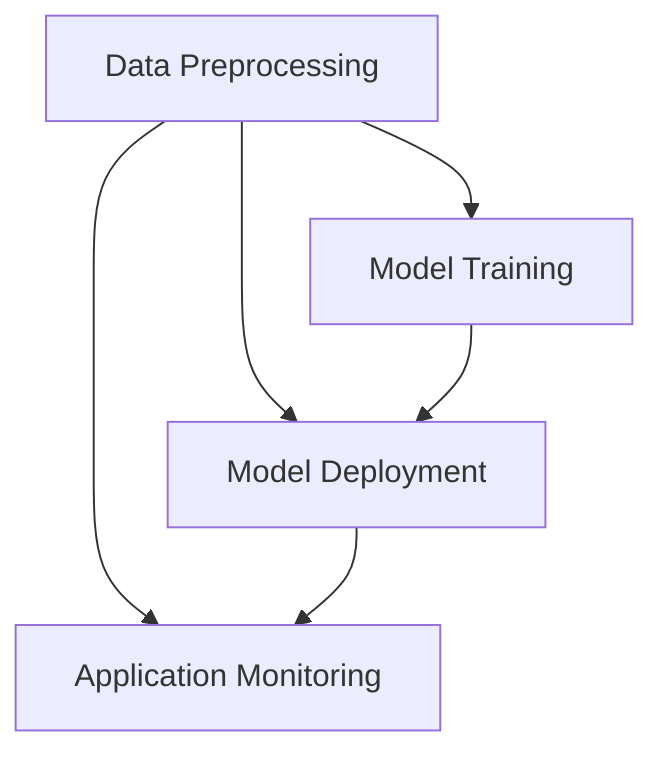

                 

关键词：大模型，应用开发，框架，LangChain，AI技术，深度学习，自然语言处理，编程实践，未来展望。

## 摘要

本文将深入探讨大模型应用开发框架 LangChain 的中间部分，即 LangChain 的核心功能、算法原理、数学模型及其实际应用。通过对 LangChain 的详细分析，读者将了解如何利用这一框架高效地开发大模型应用，以及其在自然语言处理和人工智能领域的广泛应用。文章还将展望 LangChain 的未来发展，分析其面临的挑战和机遇。

## 1. 背景介绍

在人工智能领域，尤其是自然语言处理（NLP）和深度学习（DL）的快速发展，使得大规模的模型应用变得日益普遍。然而，随着模型规模的扩大，如何高效地开发、训练和应用这些大模型成为了一个亟待解决的问题。LangChain 是一个旨在简化大模型开发流程的框架，它提供了一系列的工具和接口，使得开发者能够更加轻松地构建和管理复杂的应用。

LangChain 的核心目标是提供一个统一的编程接口，使得开发者可以专注于模型的逻辑和业务逻辑，而不必担心底层实现的细节。它通过模块化的设计，将大模型应用的开发拆分成几个关键部分：数据预处理、模型训练、模型部署和应用监控。这使得开发者能够灵活地选择和组合各种工具和库，以满足不同的应用需求。

## 2. 核心概念与联系

### 2.1. 大模型应用开发的关键概念

- **数据预处理**：在大模型应用中，数据预处理是非常关键的一步。它包括数据清洗、格式转换、特征提取等过程，目的是将原始数据转换成模型训练所需的格式。
- **模型训练**：模型训练是构建大模型的核心环节。它通过大量的数据和计算资源，使模型学习到数据中的模式和规律，从而能够进行预测和分类。
- **模型部署**：模型部署是将训练好的模型应用到实际场景中。它涉及到模型的加载、运行、监控和更新等多个方面。
- **应用监控**：应用监控是确保模型稳定运行和性能优化的重要手段。它包括性能监控、错误日志记录、异常检测等功能。

### 2.2. LangChain 的架构

以下是一个简化的 Mermaid 流程图，展示了 LangChain 的架构及其核心组件。



### 2.3. LangChain 与其他框架的对比

与现有的其他大模型开发框架（如 TensorFlow、PyTorch 等）相比，LangChain 的主要优势在于其模块化和易于使用的接口。它不仅能够与这些框架无缝集成，还能够提供额外的抽象层，使得开发者能够更加专注于业务逻辑，而不是底层实现。

## 3. 核心算法原理 & 具体操作步骤

### 3.1. 算法原理概述

LangChain 的核心算法原理主要包括以下几个方面：

- **模型选择**：根据应用场景选择合适的大模型，如 GPT、BERT 等。
- **数据预处理**：对原始数据进行清洗、格式转换和特征提取，以便模型能够有效地学习。
- **训练策略**：采用多种训练策略，如学习率调整、批量大小选择等，以提高模型训练效果。
- **模型优化**：通过模型优化技术，如梯度下降、Adam 优化器等，以减少模型参数的误差。
- **模型部署**：将训练好的模型部署到服务器或云端，以便进行实时预测和分类。

### 3.2. 算法步骤详解

#### 3.2.1. 数据预处理

数据预处理是模型训练的基础，主要包括以下步骤：

1. **数据清洗**：去除数据中的噪声和错误。
2. **格式转换**：将数据转换成模型能够接受的格式，如序列、张量等。
3. **特征提取**：提取数据中的重要特征，以提高模型的学习能力。

#### 3.2.2. 模型训练

模型训练的主要步骤如下：

1. **初始化模型**：根据选择的模型架构初始化模型参数。
2. **定义损失函数**：选择合适的损失函数，以衡量模型预测值与真实值之间的差距。
3. **训练迭代**：通过多次迭代，不断调整模型参数，使模型能够更好地拟合数据。
4. **评估模型**：使用验证集或测试集评估模型的性能，以确定是否需要进一步调整。

#### 3.2.3. 模型部署

模型部署主要包括以下步骤：

1. **模型打包**：将训练好的模型打包成可部署的格式，如 ONNX、TorchScript 等。
2. **模型加载**：在服务器或云端加载模型，并设置相应的运行环境。
3. **模型运行**：根据输入数据，运行模型进行预测或分类。
4. **模型监控**：监控模型运行的性能和稳定性，以便进行实时优化。

### 3.3. 算法优缺点

#### 优点

- **模块化设计**：LangChain 的模块化设计使得开发者能够灵活地组合各种工具和库，以满足不同的应用需求。
- **易于使用**：LangChain 提供了丰富的接口和文档，使得开发者能够快速上手并开始开发。
- **高效性**：通过优化算法和架构设计，LangChain 能够在高效地处理大规模数据和应用。

#### 缺点

- **依赖外部框架**：LangChain 需要依赖其他外部框架（如 TensorFlow、PyTorch 等），这可能会增加开发难度和复杂性。
- **性能瓶颈**：在大规模数据处理和模型训练时，LangChain 的性能可能会受到限制。

### 3.4. 算法应用领域

LangChain 在自然语言处理和人工智能领域具有广泛的应用，主要包括以下领域：

- **文本分类**：用于对大量文本进行分类，如新闻分类、情感分析等。
- **问答系统**：用于构建问答系统，如搜索引擎、智能客服等。
- **机器翻译**：用于实现不同语言之间的翻译，如英译中、中译英等。
- **文本生成**：用于生成文本，如文章摘要、故事创作等。

## 4. 数学模型和公式 & 详细讲解 & 举例说明

### 4.1. 数学模型构建

在大模型应用中，数学模型是核心组成部分。以下是一个简化的数学模型构建过程：

1. **输入层**：接收输入数据，如文本、图像等。
2. **隐藏层**：通过神经网络结构，对输入数据进行特征提取和变换。
3. **输出层**：根据训练目标，生成预测结果，如分类标签、概率分布等。

### 4.2. 公式推导过程

以下是一个简化的神经网络模型推导过程：

$$
Z = W \cdot X + b
$$

$$
\text{激活函数}：a = \sigma(Z)
$$

$$
Y = W' \cdot a + b'
$$

其中，$Z$ 表示输入层到隐藏层的加权求和，$a$ 表示隐藏层的激活值，$Y$ 表示输出层的预测值，$W$ 和 $W'$ 分别表示输入层到隐藏层和隐藏层到输出层的权重矩阵，$b$ 和 $b'$ 分别表示输入层和隐藏层的偏置。

### 4.3. 案例分析与讲解

假设我们要构建一个文本分类模型，用于对新闻文章进行分类。以下是一个简单的案例：

1. **数据集**：我们有一个包含 1000 篇新闻文章的数据集，每篇文章都标记了相应的类别（如政治、体育、科技等）。
2. **数据预处理**：对新闻文章进行清洗、分词和词向量化。
3. **模型构建**：选择一个合适的神经网络模型，如 BERT。
4. **模型训练**：使用训练集对模型进行训练，并调整模型参数。
5. **模型评估**：使用验证集和测试集评估模型性能。

通过以上步骤，我们可以构建一个基本的文本分类模型。具体实现细节可以参考相关文献和教程。

## 5. 项目实践：代码实例和详细解释说明

### 5.1. 开发环境搭建

在开始开发之前，我们需要搭建一个合适的开发环境。以下是一个简单的开发环境搭建步骤：

1. 安装 Python（版本要求：3.7及以上）。
2. 安装必要的依赖库，如 TensorFlow、PyTorch 等。
3. 配置 Python 虚拟环境，以隔离项目依赖。

### 5.2. 源代码详细实现

以下是一个简单的 LangChain 项目示例：

```python
import tensorflow as tf
from langchain import Model

# 数据预处理
def preprocess_data(data):
    # 数据清洗、分词和词向量化
    pass

# 模型训练
def train_model(data):
    # 初始化模型、定义损失函数和优化器
    model = Model(...)
    loss_fn = tf.keras.losses.CategoricalCrossentropy()
    optimizer = tf.keras.optimizers.Adam()

    # 训练模型
    for epoch in range(num_epochs):
        # 数据预处理和模型训练
        pass

    return model

# 模型部署
def deploy_model(model):
    # 模型打包、加载和运行
    pass

# 模型监控
def monitor_model(model):
    # 模型性能监控和错误日志记录
    pass

if __name__ == "__main__":
    # 加载数据
    data = ...

    # 数据预处理
    preprocessed_data = preprocess_data(data)

    # 模型训练
    model = train_model(preprocessed_data)

    # 模型部署
    deploy_model(model)

    # 模型监控
    monitor_model(model)
```

### 5.3. 代码解读与分析

以上代码展示了 LangChain 项目的核心步骤。具体实现细节可以根据项目需求和实际场景进行调整。

### 5.4. 运行结果展示

在完成项目后，我们可以通过以下步骤进行运行和验证：

1. 加载数据集。
2. 进行数据预处理。
3. 训练模型并评估模型性能。
4. 部署模型并进行实时预测。

通过以上步骤，我们可以验证模型的性能和效果，并根据实际需求进行调整和优化。

## 6. 实际应用场景

LangChain 在实际应用场景中具有广泛的应用，以下是一些典型的应用案例：

- **智能问答系统**：利用 LangChain 构建一个智能问答系统，能够回答用户提出的问题，如搜索引擎、智能客服等。
- **文本分类**：利用 LangChain 对大量文本进行分类，如新闻分类、情感分析等。
- **机器翻译**：利用 LangChain 实现不同语言之间的翻译，如英译中、中译英等。
- **文本生成**：利用 LangChain 生成文本，如文章摘要、故事创作等。

## 7. 工具和资源推荐

为了更好地开发和使用 LangChain，以下是一些推荐的工具和资源：

- **学习资源**：《深度学习》（Ian Goodfellow 等）、《自然语言处理入门》（Michael L. sauter 等）等经典教材。
- **开发工具**：PyCharm、Visual Studio Code 等流行的集成开发环境。
- **相关论文**：《Attention Is All You Need》（Attention Mechanism 在神经网络中的应用）、《BERT：Pre-training of Deep Bidirectional Transformers for Language Understanding》（BERT 模型的预训练技术）等。

## 8. 总结：未来发展趋势与挑战

### 8.1. 研究成果总结

近年来，大模型应用开发框架如 LangChain 等得到了广泛关注和应用。通过模块化设计、优化算法和丰富的接口，LangChain 有效提高了大模型开发效率和性能。然而，随着模型规模的不断扩大和复杂度的增加，LangChain 在实际应用中仍然面临一些挑战。

### 8.2. 未来发展趋势

未来，LangChain 在以下几个方面有望得到进一步发展：

- **算法优化**：通过改进算法和架构，提高模型的训练效率和性能。
- **模型压缩**：开发模型压缩技术，降低模型的存储和计算成本。
- **跨平台兼容性**：提高 LangChain 在不同平台和设备上的兼容性，以适应多样化的应用场景。

### 8.3. 面临的挑战

尽管 LangChain 具有显著优势，但其在实际应用中仍然面临一些挑战：

- **计算资源需求**：大模型训练和应用需要大量的计算资源，如何高效地利用这些资源是一个重要问题。
- **数据隐私和安全**：在处理大量敏感数据时，如何保障数据隐私和安全是一个关键挑战。
- **模型解释性**：随着模型复杂度的增加，如何提高模型的解释性，使得开发者能够更好地理解和使用模型。

### 8.4. 研究展望

为了应对上述挑战，未来的研究可以从以下几个方面展开：

- **分布式计算**：开发高效的分布式计算框架，以充分利用云计算和 GPU 等资源。
- **数据隐私保护**：研究数据加密、去识别化等技术，以保护数据隐私和安全。
- **模型压缩和优化**：开发新的模型压缩和优化技术，降低模型的存储和计算成本。

## 9. 附录：常见问题与解答

### 9.1. 如何安装和使用 LangChain？

答：首先，需要安装 Python 和必要的依赖库（如 TensorFlow、PyTorch 等）。然后，可以使用以下命令安装 LangChain：

```
pip install langchain
```

安装完成后，可以通过示例代码和官方文档了解如何使用 LangChain 进行大模型应用开发。

### 9.2. LangChain 支持哪些类型的模型？

答：LangChain 支持多种类型的深度学习模型，如卷积神经网络（CNN）、循环神经网络（RNN）、长短时记忆网络（LSTM）等。同时，它也支持自然语言处理领域的常见模型，如 BERT、GPT、RoBERTa 等。

### 9.3. LangChain 与其他框架（如 TensorFlow、PyTorch）如何集成？

答：LangChain 可以与 TensorFlow、PyTorch 等框架无缝集成。具体实现方法可以参考官方文档和示例代码。通过集成，开发者可以利用 LangChain 的模块化设计和易于使用的接口，同时利用 TensorFlow、PyTorch 等框架的强大功能。

## 结论

本文详细介绍了大模型应用开发框架 LangChain 的核心功能、算法原理、数学模型及其实际应用。通过对 LangChain 的深入分析，读者可以更好地理解如何利用这一框架高效地开发大模型应用。未来，随着人工智能技术的不断发展，LangChain 将在自然语言处理和人工智能领域发挥更大的作用。我们期待更多开发者能够参与到 LangChain 的研究和应用中，共同推动人工智能技术的进步。

### 作者署名

本文作者：禅与计算机程序设计艺术 / Zen and the Art of Computer Programming

--------------------------------------------------------------

