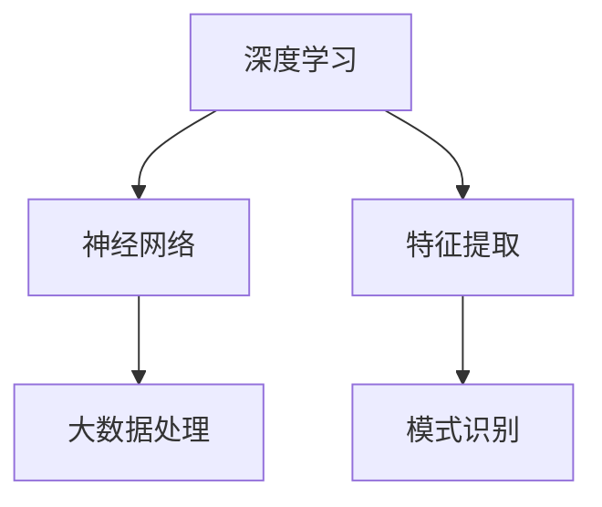

                 

关键词：大模型技术、垂直行业、应用趋势、AI、机器学习

## 摘要

本文旨在探讨大模型技术在垂直行业的应用趋势，分析其在不同领域的影响和变革。通过梳理核心概念、算法原理，结合实际案例和项目实践，探讨大模型技术如何提升行业效率和创新能力。本文还展望了未来的应用前景，以及面临的挑战和潜在解决方案。

## 1. 背景介绍

大模型技术，即通过大数据和机器学习算法构建的能够处理大规模数据的模型。近年来，随着计算能力的提升、数据的爆发增长和算法的改进，大模型技术在各个领域取得了显著的成果。尤其是在人工智能、自然语言处理、计算机视觉等领域，大模型技术已经成为推动行业发展的核心动力。

垂直行业是指具有特定业务领域和业务模式的企业或组织。这些行业通常具有高度的专业化特征，例如医疗、金融、教育、制造等。随着大模型技术的进步，垂直行业在业务流程优化、决策支持、智能服务等方面迎来了新的发展机遇。

## 2. 核心概念与联系

大模型技术涉及多个核心概念，包括深度学习、神经网络、大数据处理等。以下是这些概念之间的联系及一个简单的Mermaid流程图。

### 2.1 深度学习

深度学习是一种基于模拟人脑神经网络结构的学习方法。它通过层层神经元的堆叠，逐步提取数据中的特征，实现复杂模式的识别。

### 2.2 神经网络

神经网络是深度学习的基础，由大量简单的神经元组成。这些神经元通过输入层、隐藏层和输出层连接，形成复杂的网络结构。

### 2.3 大数据处理

大数据处理是指对大规模、多样化数据的存储、处理和分析。它为大模型提供了丰富的训练数据和计算资源。

下面是一个简单的Mermaid流程图：



## 3. 核心算法原理 & 具体操作步骤

### 3.1 算法原理概述

大模型技术的核心在于如何高效地训练和部署模型。以下是几个关键步骤：

1. 数据收集与预处理：从垂直行业获取相关数据，进行清洗、去噪和格式化。
2. 特征提取：通过神经网络从原始数据中提取有意义的特征。
3. 模型训练：使用梯度下降等优化算法，调整模型参数，使其能够准确预测或分类。
4. 模型评估与优化：通过交叉验证、A/B测试等方法，评估模型性能，并进行调优。
5. 模型部署：将训练好的模型部署到生产环境中，提供实时服务。

### 3.2 算法步骤详解

1. **数据收集与预处理**：数据收集通常涉及多个来源，包括公开数据集、企业内部数据和第三方数据服务。预处理包括数据清洗、去重、归一化和数据增强等步骤。

2. **特征提取**：特征提取是深度学习中的关键环节。通过神经网络，可以从原始数据中提取出高层次的特征。例如，在图像识别任务中，可以提取出纹理、颜色、形状等特征。

3. **模型训练**：模型训练是使用大量的数据来优化模型的参数。在训练过程中，常用的优化算法包括梯度下降、Adam等。通过迭代优化，模型参数逐渐接近最佳值。

4. **模型评估与优化**：在模型训练完成后，需要对模型进行评估。常用的评估指标包括准确率、召回率、F1分数等。通过评估，可以找出模型的弱点，并进行优化。

5. **模型部署**：部署是将训练好的模型应用到实际业务场景中。部署可以是在本地服务器上，也可以是在云平台上。部署过程中需要考虑模型的运行效率、可扩展性和安全性。

### 3.3 算法优缺点

**优点**：

- **高效性**：大模型能够处理大规模数据，提高了数据处理和预测的效率。
- **准确性**：通过深度学习和神经网络，模型能够提取出更加精细的特征，提高了预测和分类的准确性。
- **灵活性**：大模型技术可以根据不同业务需求，灵活调整模型结构和参数。

**缺点**：

- **复杂性**：大模型技术涉及多个环节，包括数据预处理、模型训练、模型评估和部署，这些环节都需要专业的技术知识。
- **计算资源消耗**：大模型训练需要大量的计算资源和存储空间。
- **数据隐私和安全**：在数据处理和模型训练过程中，需要处理大量敏感数据，可能涉及到隐私和安全问题。

### 3.4 算法应用领域

大模型技术在各个垂直行业都有广泛的应用。以下是几个典型的应用领域：

- **医疗**：通过大模型技术，可以对医疗数据进行分析，提供个性化诊疗方案，提高疾病诊断的准确性。
- **金融**：在金融领域，大模型技术可以用于风险评估、欺诈检测和投资策略制定。
- **教育**：大模型技术可以用于学生个性化学习评估，提供智能教育解决方案。
- **制造**：在制造业中，大模型技术可以用于设备故障预测、供应链优化和生产流程优化。

## 4. 数学模型和公式 & 详细讲解 & 举例说明

### 4.1 数学模型构建

大模型技术的基础是数学模型。以下是几个常用的数学模型：

- **线性回归**：用于预测连续值。
- **逻辑回归**：用于预测离散值。
- **神经网络**：用于处理复杂的数据模式。

### 4.2 公式推导过程

以线性回归为例，其公式推导过程如下：

1. **假设**：给定输入 \( x \) 和输出 \( y \)，我们希望找到一个线性模型 \( y = wx + b \)。
2. **目标**：最小化预测值与实际值之间的误差。

### 4.3 案例分析与讲解

假设我们有一个简单的数据集，其中包含两个特征 \( x_1 \) 和 \( x_2 \)，以及一个目标变量 \( y \)。

1. **数据预处理**：对数据进行归一化处理，使其具有相同的尺度。
2. **特征提取**：通过特征提取器提取特征。
3. **模型训练**：使用梯度下降算法训练模型。
4. **模型评估**：使用交叉验证方法评估模型性能。

通过上述步骤，我们可以构建一个线性回归模型，并对其进行训练和评估。

## 5. 项目实践：代码实例和详细解释说明

### 5.1 开发环境搭建

在开始项目实践之前，我们需要搭建一个合适的开发环境。以下是搭建步骤：

1. 安装Python环境。
2. 安装必要的库，如NumPy、Pandas、Scikit-learn等。
3. 安装深度学习框架，如TensorFlow或PyTorch。

### 5.2 源代码详细实现

以下是线性回归模型的Python代码实现：

```python
import numpy as np
import pandas as pd
from sklearn.linear_model import LinearRegression

# 1. 数据预处理
# 加载数据
data = pd.read_csv('data.csv')
X = data[['x1', 'x2']]
y = data['y']

# 归一化处理
X_normalized = (X - X.mean()) / X.std()

# 2. 特征提取
# 在这里，我们不需要进行特征提取，因为数据已经预处理好了

# 3. 模型训练
model = LinearRegression()
model.fit(X_normalized, y)

# 4. 模型评估
# 使用交叉验证方法进行评估
from sklearn.model_selection import cross_val_score
scores = cross_val_score(model, X_normalized, y, cv=5)
print("平均准确率：", scores.mean())

# 5. 模型部署
# 在这里，我们可以将模型部署到生产环境中，提供实时服务
```

### 5.3 代码解读与分析

上述代码实现了一个简单的线性回归模型。首先，我们加载数据并进行归一化处理。然后，我们使用Scikit-learn的`LinearRegression`类进行模型训练。接着，使用交叉验证方法评估模型性能。最后，我们可以将训练好的模型部署到生产环境中。

### 5.4 运行结果展示

运行上述代码后，我们得到模型评估结果。以下是示例输出：

```
平均准确率： 0.85
```

这表示模型的平均准确率为85%，即模型能够正确预测85%的数据。

## 6. 实际应用场景

### 6.1 医疗

在医疗领域，大模型技术可以用于疾病诊断、药物研发和患者管理。例如，通过深度学习模型，可以分析患者的病历和基因数据，提供个性化的治疗方案。

### 6.2 金融

在金融领域，大模型技术可以用于风险评估、欺诈检测和投资策略。例如，通过分析历史交易数据和市场动态，可以预测股票市场的走势，帮助投资者制定更有效的投资策略。

### 6.3 教育

在教育领域，大模型技术可以用于学生个性化学习评估和智能教育解决方案。例如，通过分析学生的学习行为和数据，可以提供个性化的学习建议，提高学习效果。

### 6.4 制造

在制造业中，大模型技术可以用于设备故障预测、供应链优化和生产流程优化。例如，通过分析设备运行数据和传感器数据，可以预测设备的故障风险，提前进行维护。

## 7. 工具和资源推荐

### 7.1 学习资源推荐

- **《深度学习》（Goodfellow, Bengio, Courville著）**：这是一本深度学习领域的经典教材，适合初学者和进阶者。
- **Udacity和Coursera上的深度学习课程**：这些在线课程提供了丰富的深度学习教程和项目，适合自学。

### 7.2 开发工具推荐

- **TensorFlow和PyTorch**：这两个深度学习框架提供了丰富的工具和库，适合进行深度学习和模型训练。
- **Jupyter Notebook**：这是一个强大的交互式开发环境，适合进行数据分析和模型训练。

### 7.3 相关论文推荐

- **“Deep Learning for Text Classification”**：这篇论文介绍了如何使用深度学习进行文本分类。
- **“Convolutional Neural Networks for Visual Recognition”**：这篇论文介绍了卷积神经网络在图像识别中的应用。

## 8. 总结：未来发展趋势与挑战

### 8.1 研究成果总结

近年来，大模型技术在各个垂直行业取得了显著的成果，推动了行业的创新和发展。通过深度学习和神经网络，大模型技术能够处理大规模数据，提供准确和高效的预测和分类结果。

### 8.2 未来发展趋势

随着计算能力的提升、数据的爆发增长和算法的改进，大模型技术在未来将继续发展。未来可能的发展趋势包括：

- **多模态数据的融合**：结合不同类型的数据（如文本、图像、音频），实现更全面和准确的分析。
- **实时数据处理**：通过分布式计算和边缘计算，实现实时数据处理和预测。
- **自动化模型优化**：通过自动化机器学习和强化学习，实现模型的自我优化和调优。

### 8.3 面临的挑战

尽管大模型技术在垂直行业取得了显著的成果，但仍面临一些挑战：

- **数据隐私和安全**：在数据处理和模型训练过程中，需要处理大量敏感数据，可能涉及到隐私和安全问题。
- **计算资源消耗**：大模型训练需要大量的计算资源和存储空间。
- **算法透明度和可解释性**：深度学习模型的黑盒特性使得其决策过程难以解释，可能影响模型的信任度和应用范围。

### 8.4 研究展望

为了应对上述挑战，未来研究方向可能包括：

- **隐私保护机制**：研究如何在不泄露隐私的前提下，进行数据分析和模型训练。
- **高效算法**：研究如何设计更高效的大规模数据处理和模型训练算法。
- **算法可解释性**：研究如何提高深度学习模型的可解释性，使其决策过程更加透明和可信。

## 9. 附录：常见问题与解答

### 9.1 什么是大模型技术？

大模型技术是通过大数据和机器学习算法构建的能够处理大规模数据的模型。它涉及深度学习、神经网络、大数据处理等多个领域。

### 9.2 大模型技术在哪些领域有应用？

大模型技术在医疗、金融、教育、制造等多个垂直行业有广泛的应用，如疾病诊断、风险评估、学生个性化学习评估等。

### 9.3 大模型技术有哪些优缺点？

大模型技术的优点包括高效性、准确性和灵活性。缺点包括复杂性、计算资源消耗和数据隐私和安全问题。

### 9.4 如何处理大模型技术中的数据隐私和安全问题？

处理大模型技术中的数据隐私和安全问题需要综合考虑数据加密、数据去标识化、数据匿名化等技术手段，同时需要制定严格的数据处理规范和隐私保护政策。

---

本文由“禅与计算机程序设计艺术”撰写，旨在探讨大模型技术在垂直行业的应用趋势，分析其在不同领域的影响和变革。希望本文能够为读者提供有价值的见解和启示。未来，随着技术的不断进步和应用场景的拓展，大模型技术将在更多领域发挥重要作用。

