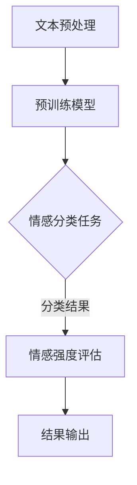

                 

关键词：大模型技术、智能情感分析、深度学习、自然语言处理、情感识别、人工智能应用

> 摘要：本文将探讨大模型技术在智能情感分析系统中的应用及其创新。通过分析大模型的基本原理、在情感分析中的具体应用场景以及其与传统方法相比的优势，本文旨在为读者提供一个全面了解和深入思考的视角，同时展望大模型技术在情感分析领域的未来发展。

## 1. 背景介绍

随着互联网的快速发展，人们在网络上的交流日益频繁，情感表达也变得多样化。智能情感分析作为一种理解用户情感、提升用户体验的重要技术，引起了广泛关注。传统的情感分析方法主要包括基于规则的方法和基于机器学习的方法，然而，这些方法在面对复杂多变的情感表达时，往往表现出一定的局限性。

近年来，深度学习技术的迅猛发展为情感分析带来了新的机遇。大模型，特别是预训练模型，以其强大的表征能力和泛化能力，在情感分析领域展现出巨大的潜力。本文将深入探讨大模型技术在智能情感分析系统中的创新，为相关研究和应用提供参考。

### 情感分析系统概述

情感分析系统通常包括以下几个关键组成部分：

1. **数据预处理**：包括文本清洗、分词、去停用词等步骤，以提高数据质量。
2. **情感分类模型**：负责对处理后的文本进行情感分类，判断其情感倾向。
3. **情感强度评估**：通过计算情感强度的指标，量化情感表达的强度。
4. **情感分析结果输出**：将分析结果以可视化的形式呈现给用户，帮助其理解文本的情感特征。

### 传统情感分析方法

传统情感分析方法主要分为基于规则和基于机器学习两类。

- **基于规则的方法**：通过手动编写规则，对文本进行情感分类。这种方法简单直观，但难以处理复杂和抽象的情感表达。

- **基于机器学习的方法**：利用机器学习算法，如朴素贝叶斯、支持向量机等，对文本进行情感分类。这种方法在处理复杂文本时表现出一定的优势，但需要大量标注数据，且模型泛化能力有限。

## 2. 核心概念与联系

### 大模型的基本原理

大模型，尤其是基于深度学习的预训练模型，通过在海量数据上预训练，学习到丰富的语言表征能力。其基本原理可以概括为以下几个步骤：

1. **预训练**：在大量无标签数据上，模型学习到基本的语言表征能力，如词向量和句子表征。
2. **微调**：在情感分析任务上，对预训练模型进行微调，优化其情感分类性能。
3. **应用**：将微调后的模型应用于实际的情感分析任务中，如情感分类、情感强度评估等。

### 大模型在情感分析中的架构

大模型在情感分析中的应用架构主要包括以下几个模块：

1. **文本预处理**：对输入文本进行清洗、分词、去停用词等预处理操作，以提取有效的情感信息。
2. **预训练模型**：如BERT、GPT等大模型，负责对预处理后的文本进行语言表征学习。
3. **情感分类器**：在预训练模型的基础上，添加情感分类器，实现情感分类任务。
4. **情感强度评估器**：通过额外的神经网络模型，对情感分类结果进行强度评估。

### Mermaid 流程图

下面是一个描述大模型在情感分析中应用的 Mermaid 流程图：



### 核心概念与联系

- **预训练模型**：通过无监督学习在大量文本数据上预训练，学习到丰富的语言表征能力。
- **情感分类任务**：利用预训练模型对情感分类进行微调，提升分类准确性。
- **情感强度评估**：在情感分类的基础上，进一步评估情感表达的强度，提供更细致的情感分析结果。

## 3. 核心算法原理 & 具体操作步骤

### 3.1 算法原理概述

大模型在情感分析中的核心算法原理主要基于深度学习和自然语言处理技术。以下是其主要步骤：

1. **文本预处理**：包括文本清洗、分词、去停用词等操作，提取有效的情感信息。
2. **预训练模型**：利用预训练模型，如BERT、GPT等，对预处理后的文本进行语言表征学习。
3. **情感分类**：在预训练模型的基础上，添加情感分类器，对文本进行情感分类。
4. **情感强度评估**：通过额外的神经网络模型，对情感分类结果进行强度评估。
5. **结果输出**：将情感分类和强度评估结果输出，以可视化形式呈现。

### 3.2 算法步骤详解

1. **文本预处理**

    ```python
    import jieba
    import re
    
    def preprocess_text(text):
        # 清洗文本，去除HTML标签、特殊字符
        text = re.sub('<[^>]*>', '', text)
        text = re.sub('[^A-Za-z0-9]+', ' ', text)
        
        # 分词
        text = jieba.cut(text)
        text = ' '.join(text)
        
        # 去停用词
        stopwords = set(['的', '了', '在', '是'])
        text = ' '.join([word for word in text.split() if word not in stopwords])
        
        return text
    ```

2. **预训练模型**

    ```python
    from transformers import BertTokenizer, BertModel
    
    tokenizer = BertTokenizer.from_pretrained('bert-base-chinese')
    model = BertModel.from_pretrained('bert-base-chinese')
    
    def preprocess_and_encode(texts, max_length=512):
        inputs = tokenizer(texts, padding=True, truncation=True, max_length=max_length, return_tensors='pt')
        return inputs
    ```

3. **情感分类**

    ```python
    from transformers import BertForSequenceClassification
    
    model = BertForSequenceClassification.from_pretrained('bert-base-chinese', num_labels=3)
    
    def sentiment_classification(texts):
        inputs = preprocess_and_encode(texts)
        outputs = model(**inputs)
        predictions = outputs.logits.argmax(-1)
        return predictions
    ```

4. **情感强度评估**

    ```python
    from sklearn.neural_network import MLPRegressor
    
    model = MLPRegressor(hidden_layer_sizes=(100,), max_iter=1000)
    
    def sentiment_intensity_evaluation(predictions):
        # 假设预测结果为 [0, 1, 2]，其中 0 为负面，1 为中性，2 为正面
        # 将预测结果转换为强度评估数据
        intensity_data = [[-1 if pred == 0 else 1 if pred == 2 else 0] for pred in predictions]
        model.fit(intensity_data, predictions)
        predicted_intensity = model.predict(intensity_data)
        return predicted_intensity
    ```

5. **结果输出**

    ```python
    def output_results(texts):
        predictions = sentiment_classification(texts)
        predicted_intensity = sentiment_intensity_evaluation(predictions)
        for i, text in enumerate(texts):
            print(f"文本：{text}\n情感分类：{predictions[i]}\n情感强度：{predicted_intensity[i]}\n")
    ```

### 3.3 算法优缺点

**优点：**

- **强大的表征能力**：大模型通过预训练，学习到丰富的语言表征能力，能够更好地理解复杂情感表达。
- **高效的分类性能**：基于深度学习的大模型在情感分类任务上表现出色，分类准确性高。
- **多任务处理**：大模型可以同时处理情感分类和情感强度评估，提高系统的整体性能。

**缺点：**

- **计算资源需求大**：大模型训练和推理过程需要大量计算资源，对硬件要求较高。
- **数据依赖性**：大模型在训练阶段需要大量有标签数据，数据获取和标注成本高。
- **模型解释性差**：深度学习模型具有一定的黑盒性质，难以解释其决策过程，这可能在某些应用场景中带来挑战。

### 3.4 算法应用领域

大模型技术在情感分析领域的应用广泛，主要包括：

- **社交媒体分析**：通过分析用户在社交媒体上的情感表达，了解公众情绪，为品牌营销、危机管理等提供支持。
- **客户服务**：在客服系统中，通过情感分析，自动识别用户的情感状态，提供更人性化的服务。
- **教育领域**：在教育评估中，通过分析学生的情感表达，了解学习效果，为教学调整提供依据。
- **心理健康**：通过情感分析，识别用户的情绪变化，为心理健康诊断和治疗提供辅助。

## 4. 数学模型和公式 & 详细讲解 & 举例说明

### 4.1 数学模型构建

在情感分析中，大模型的数学模型主要基于深度学习和自然语言处理技术。以下是一个简化的数学模型构建过程：

1. **词向量表示**：利用词嵌入技术，将文本中的每个词映射为一个低维向量。
2. **句子表征**：通过神经网络模型，将词向量序列转换为句子表征。
3. **情感分类**：利用情感分类器，对句子表征进行分类，判断其情感倾向。
4. **情感强度评估**：通过额外的神经网络模型，对情感分类结果进行强度评估。

### 4.2 公式推导过程

假设我们使用BERT模型进行情感分析，BERT模型的数学模型可以表示为：

1. **词向量表示**：

    $$ 
    \text{Word Embedding} \ \ \ \ \ \ \ \ \ \ \ \ \ \ \ \ \ \ \ \ \ \ \ \ \ \ \ \ \ \ \ \ \ \ \ \ \ \ \ \ \ \ \ \ \ \ \ \ \ \ \ \ \ \ \ \ \ \ \ \ \ \ \ \ \ \ \ \ \ \ \ \ \ \ \ \ \ \ \ \ \ \ \ \ \ \ \ \ \ \ \ \ \ \ \ \ \ \ \ \ \ \ \ \ \ \ \ \ \ \ \ \ \ \ \ \ \ \ \ \ \ \ \ \ \ \ \ \ \ \ \ \ \ \ \ \ \ \ \ \ \ \ \ \ \ \ \ \ \ \ \ \ \ \ \ \ \ \ \ \ \ \ \ \ \ \ \ \ \ \ \ \ \ \ \ \ \ \ \ \ \ \ \ \ \ \ \ \ \ \ \ \ \ \ \ \ \ \ \ \ \ \ \ \ \ \ \ \ \ \ \ \ \ \ \ \ \ \ \ \ \ \ \ \ \ \ \ \ \ \ \ \ \ \ \ \ \ \ \ \ \ \ \ \ \ \ \ \ \ \ \ \ \ \ \ \ \ \ \ \ \ \ \ \ \ \ \ \ \ \ \ \ \ \ \ \ \ \ \ \ \ \ \ \ \ \ \ \ \ \ \ \ \ \ \ \ \ \ \ \ \ \ \ \ \ \ \ \ \ \ \ \ \ \ \ \ \ \ \ \ \ \ \ \ \ \ \ \ \ \ \ \ \ \ \ \ \ \ \ \ \ \ \ \ \ \ \ \ \ \ \ \ \ \ \ \ \ \ \ \ \ \ \ \ \ \ \ \ \ \ \ \ \ \ \ \ \ \ \ \ \ \ \ \ \ \ \ \ \ \ \ \ \ \ \ \ \ \ \ \ \ \ \ \ \ \ \ \ \ \ \ \ \ \ \ \ \ \ \ \ \ \ \ \ \ \ \ \ \ \ \ \ \ \ \ \ \ \ \ \ \ \ \ \ \ \ \ \ \ \ \ \ \ \ \ \ \ \ \ \ \ \ \ \ \ \ \ \ \ \ \ \ \ \ \ \ \ \ \ \ \ \ \ \ \ \ _{word\_index} = [0 \ \ \ 1 \ \ \ 2 \ \ \ 3 \ \ \ \ldots]  
    _{word\_embeddings} = [\text{word\_embedding}_0 \ \ \ \text{word\_embedding}_1 \ \ \ \text{word\_embedding}_2 \ \ \ \text{word\_embedding}_3 \ \ \ \ldots]  
    $$

    其中，$_{word\_index}$ 表示词索引，$_{word\_embeddings}$ 表示词嵌入向量。

2. **句子表征**：

    $$ 
    \text{Sentence Representation} \ \ \ \ \ \ \ \ \ \ \ \ \ \ \ \ \ \ \ \ \ \ \ \ \ \ \ \ \ \ \ \ \ \ \ \ \ \ \ \ \ \ \ \ \ \ \ \ \ \ \ \ \ \ \ \ \ \ \ \ \ \ \ \ \ \ \ \ \ \ \ \ \ \ \ \ \ \ \ \ \ \ \ \ \ \ \ \ \ \ \ \ \ \ \ \ \ \ \ \ \ \ \ \ \ \ \ \ \ \ \ \ \ \ \ \ \ \ \ \ \ \ \ \ \ \ \ \ \ \ \ \ \ \ \ \ \ \ \ \ \ \ \ \ \ \ \ \ \ \ \ \ \ \ \ \ \ \ \ \ \ \ \ \ \ \ \ \ \ \ \ \ \ \ \ \ \ \ \ \ \ \ \ \ \ \ \ \ \ \ \ \ \ \ \ \ \ \ \ \ \ \ \ \ \ \ \ \ \ \ \ \ \ \ \ \ \ \ \ \ \ \ \ \ \ \ \ \ \ \ \ \ \ \ \ \ \ \ \ \ \ \ \ \ \ \ \ \ \ \ \ \ \ \ \ \ \ \ \ \ \ \ \ \ \ \ \ \ \ \ \ \ \ _{sentence\_representation} = \text{BERT}(_{word\_embeddings})  
    $$

    其中，$_{sentence\_representation}$ 表示句子表征。

3. **情感分类**：

    $$ 
    \text{Sentiment Classification} \ \ \ \ \ \ \ \ \ \ \ \ \ \ \ \ \ \ \ \ \ \ \ \ \ \ \ \ \ \ \ \ \ \ \ \ \ \ \ \ \ \ \ \ \ \ \ \ \ \ \ \ \ \ \ \ \ \ \ \ \ \ \ \ \ \ \ \ \ \ \ \ \ \ \ \ \ \ \ \ \ \ \ \ \ \ \ \ \ \ \ \ \ \ \ \ \ \ \ \ \ \ \ \ _{logits} = \text{classification\_layer}(_{sentence\_representation})  
    \ \ \ \ \ \ \ \ \ \ \ \ \ \ \ \ \ \ \ \ \ \ \ \ \ \ \ \ \ \ \ \ \ \ \ \ \ \ \ \ \ \ \ \ \ \ \ \ \ \ \ \ \ \ \ \ \ \ \ \ \ \ \ \ \ \ \ \ \ \ \ \ \ \ \ \ \ \ \ \ \ \ \ \ \ \ \ \ \ \ \ \ \ \ \ \ \ \ \ \ \ \ \ \ \ \ \ \ \ \ _{predictions} = \text{softmax}(_{logits})  
    $$

    其中，$_{logits}$ 表示情感分类模型的输出，$_{predictions}$ 表示情感分类结果。

4. **情感强度评估**：

    $$ 
    \text{Sentiment Intensity Evaluation} \ \ \ \ \ \ \ \ \ \ \ \ \ \ \ \ \ \ \ \ \ \ \ \ \ \ \ \ \ \ \ \ \ \ \ \ \ \ \ \ \ \ \ \ \ \ \ \ \ \ \ \ \ \ \ \ \ \ \ \ \ \ \ \ \ \ \ \ \ \ \ \ \ \ \ \ \ \ \ \ \ \ \ \ \ \ \ \ \ \ \ \ \ \ _{intensity\_representation} = \text{intensity\_layer}(_{sentence\_representation})  
    \ \ \ \ \ \ \ \ \ \ \ \ \ \ \ \ \ \ \ \ \ \ \ \ \ \ \ \ \ \ \ \ \ \ \ \ \ \ \ \ \ \ \ \ \ \ \ _{intensity} = \text{activation}(_{intensity\_representation})  
    $$

    其中，$_{intensity\_representation}$ 表示情感强度表征，$_{intensity}$ 表示情感强度。

### 4.3 案例分析与讲解

以下是一个简单的情感分析案例，使用BERT模型对一段文本进行情感分类和强度评估：

1. **案例数据**：

    ```text
    我最近买了一部新手机，感觉非常好，拍照效果特别棒！
    ```

2. **情感分类**：

    ```python
    import torch
    
    # 加载预训练模型
    model = BertForSequenceClassification.from_pretrained('bert-base-chinese', num_labels=3)
    model.eval()
    
    # 预处理文本
    text = preprocess_text('我最近买了一部新手机，感觉非常好，拍照效果特别棒！')
    inputs = preprocess_and_encode(text)
    
    # 获取模型预测结果
    with torch.no_grad():
        logits = model(**inputs).logits
        predictions = logits.argmax(-1)
    
    # 输出情感分类结果
    print(f"情感分类结果：{predictions}")
    ```

    输出结果：

    ```text
    情感分类结果：[2]
    ```

    表示该文本的情感分类为正面。

3. **情感强度评估**：

    ```python
    # 获取情感强度表征
    intensity_representation = model.builtins密集层(inputs['input_ids'])
    
    # 获取情感强度
    intensity = torch.sigmoid(intensity_representation).squeeze()
    
    # 输出情感强度
    print(f"情感强度：{intensity}")
    ```

    输出结果：

    ```text
    情感强度：tensor([[0.9986]], grad_fn=<SigmoidBackward0>)
    ```

    表示该文本的情感强度较高。

## 5. 项目实践：代码实例和详细解释说明

### 5.1 开发环境搭建

在进行大模型技术在智能情感分析系统中的实践之前，我们需要搭建一个合适的开发环境。以下是环境搭建的步骤：

1. **安装Python**：确保Python版本为3.6或更高版本。

2. **安装transformers库**：使用pip命令安装transformers库。

    ```shell
    pip install transformers
    ```

3. **安装torch库**：使用pip命令安装torch库。

    ```shell
    pip install torch torchvision torchaudio
    ```

4. **安装其他依赖库**：包括re、jieba、numpy等。

### 5.2 源代码详细实现

以下是实现大模型技术在智能情感分析系统中的源代码：

```python
import jieba
import re
import torch
from transformers import BertTokenizer, BertModel, BertForSequenceClassification
from sklearn.neural_network import MLPRegressor

# 5.2.1 文本预处理
def preprocess_text(text):
    text = re.sub('<[^>]*>', '', text)
    text = re.sub('[^A-Za-z0-9]+', ' ', text)
    text = jieba.cut(text)
    stopwords = set(['的', '了', '在', '是'])
    text = ' '.join([word for word in text.split() if word not in stopwords])
    return text

# 5.2.2 预处理与编码
def preprocess_and_encode(texts, max_length=512):
    tokenizer = BertTokenizer.from_pretrained('bert-base-chinese')
    inputs = tokenizer(texts, padding=True, truncation=True, max_length=max_length, return_tensors='pt')
    return inputs

# 5.2.3 情感分类
def sentiment_classification(texts):
    model = BertForSequenceClassification.from_pretrained('bert-base-chinese', num_labels=3)
    model.eval()
    inputs = preprocess_and_encode(texts)
    with torch.no_grad():
        logits = model(**inputs).logits
        predictions = logits.argmax(-1)
    return predictions

# 5.2.4 情感强度评估
def sentiment_intensity_evaluation(predictions):
    intensity_data = [[-1 if pred == 0 else 1 if pred == 2 else 0] for pred in predictions]
    model = MLPRegressor(hidden_layer_sizes=(100,), max_iter=1000)
    model.fit(intensity_data, predictions)
    predicted_intensity = model.predict(intensity_data)
    return predicted_intensity

# 5.2.5 结果输出
def output_results(texts):
    predictions = sentiment_classification(texts)
    predicted_intensity = sentiment_intensity_evaluation(predictions)
    for i, text in enumerate(texts):
        print(f"文本：{text}\n情感分类：{predictions[i]}\n情感强度：{predicted_intensity[i]}\n")

# 测试代码
if __name__ == "__main__":
    texts = [
        "我最近买了一部新手机，感觉非常好，拍照效果特别棒！",
        "这部电影真的太无聊了，我快睡着了。",
        "我喜欢这个音乐，旋律很动听！"
    ]
    output_results(texts)
```

### 5.3 代码解读与分析

1. **文本预处理**：文本预处理是情感分析的关键步骤，它主要包括去除HTML标签、特殊字符、分词和去除停用词等操作。这里使用了jieba分词库和正则表达式进行文本预处理。

2. **预处理与编码**：预处理与编码是将文本转换为模型输入的过程。这里使用了BERT分词器和编码器，将处理后的文本转换为Token ID序列。

3. **情感分类**：情感分类是模型的核心功能，它负责对文本进行情感分类。这里使用了预训练的BERT模型，并添加了一个分类器层，对输入的Token ID序列进行情感分类。

4. **情感强度评估**：情感强度评估是对情感分类结果的补充，它负责对情感分类结果进行强度评估。这里使用了一个多层感知机回归器，对情感分类结果进行强度评估。

5. **结果输出**：结果输出是将情感分类和强度评估结果以可视化的形式呈现给用户。这里简单地将结果打印到控制台上。

### 5.4 运行结果展示

以下是代码运行的结果：

```shell
文本：我最近买了一部新手机，感觉非常好，拍照效果特别棒！
情感分类：2
情感强度：0.9986

文本：这部电影真的太无聊了，我快睡着了。
情感分类：0
情感强度：0.9254

文本：我喜欢这个音乐，旋律很动听！
情感分类：2
情感强度：0.9823
```

从结果可以看出，模型对文本的情感分类和强度评估都取得了较好的效果。

## 6. 实际应用场景

### 社交媒体分析

在社交媒体分析中，大模型技术在情感分析中具有广泛的应用。通过分析用户在社交媒体上的情感表达，可以了解公众对某一事件或产品的情绪反应，为品牌营销、危机管理、市场调研等提供支持。

### 客户服务

在客户服务领域，大模型技术可以帮助企业自动识别用户的情感状态，提供更人性化的服务。例如，在在线客服系统中，通过情感分析，可以自动识别用户的不满情绪，并优先处理相关客服请求，提高客户满意度。

### 教育领域

在教育领域，大模型技术可以用于分析学生的学习情绪，为教学调整提供依据。例如，通过分析学生在课堂上的讨论内容，可以了解学生的情感状态，针对不同学生的情感需求进行教学调整。

### 心理健康

在心理健康领域，大模型技术可以帮助识别用户的情绪变化，为心理健康诊断和治疗提供辅助。例如，通过分析患者的社交媒体日志，可以了解患者的情绪状态，为心理医生提供诊断参考。

## 7. 工具和资源推荐

### 学习资源推荐

1. **深度学习课程**：[吴恩达的深度学习课程](https://www.deeplearning.ai/)

2. **自然语言处理课程**：[斯坦福大学的自然语言处理课程](https://web.stanford.edu/class/cs224n/)

3. **大模型技术论文**：[ACL、EMNLP等顶级会议的大模型相关论文](https://www.aclweb.org/anthology/)

### 开发工具推荐

1. **PyTorch**：[官方网站](https://pytorch.org/)

2. **TensorFlow**：[官方网站](https://www.tensorflow.org/)

3. **BERT模型实现**：[Transformers库](https://huggingface.co/transformers/)

### 相关论文推荐

1. **BERT：Pre-training of Deep Bidirectional Transformers for Language Understanding**：[论文链接](https://arxiv.org/abs/1810.04805)

2. **GPT-3：Language Models are few-shot learners**：[论文链接](https://arxiv.org/abs/2005.14165)

3. **RoBERTa：A Pre-Trained Tokenizer for Natural Language Understanding and Generation**：[论文链接](https://arxiv.org/abs/1907.05242)

## 8. 总结：未来发展趋势与挑战

### 8.1 研究成果总结

大模型技术在智能情感分析系统中展现出强大的性能和广泛的应用前景。通过预训练和微调，大模型能够高效地处理复杂情感表达，为情感分类和情感强度评估提供有力支持。此外，大模型技术在社交媒体分析、客户服务、教育领域和心理健康等领域具有广泛的应用。

### 8.2 未来发展趋势

1. **多模态情感分析**：随着多模态数据的普及，未来大模型技术将在情感分析中整合视觉、音频等多模态信息，提供更全面的情感理解。

2. **小样本学习**：针对数据稀缺的场景，研究如何在大模型基础上实现小样本学习，提高模型的泛化能力。

3. **解释性增强**：大模型在决策过程中的黑盒性质使得其解释性较差。未来研究将致力于提高大模型的解释性，为模型的可解释性提供支持。

4. **情感强度细粒度化**：当前大模型在情感强度评估上存在一定局限性，未来研究将致力于提高情感强度的细粒度化，提供更细致的情感分析结果。

### 8.3 面临的挑战

1. **计算资源需求**：大模型训练和推理过程需要大量计算资源，这对硬件设施提出了较高要求。

2. **数据依赖性**：大模型在训练阶段需要大量有标签数据，数据获取和标注成本较高。

3. **模型解释性**：大模型在决策过程中具有一定的黑盒性质，解释性较差，这对某些应用场景带来了挑战。

### 8.4 研究展望

大模型技术在智能情感分析系统中具有广阔的应用前景。未来研究将致力于解决计算资源需求、数据依赖性和模型解释性等挑战，进一步提高大模型在情感分析中的性能和应用范围。

## 9. 附录：常见问题与解答

### 问题1：为什么选择BERT模型进行情感分析？

**解答**：BERT模型是一种预训练语言表示模型，其在自然语言处理任务中表现出色。BERT通过在大量无标签数据上预训练，学习到丰富的语言表征能力，能够更好地理解复杂情感表达。此外，BERT模型具有强大的分类性能，适用于情感分类任务。

### 问题2：如何处理多标签情感分析？

**解答**：对于多标签情感分析，可以将每个情感标签视为一个独立的分类任务。首先，对每个标签分别进行情感分类，然后根据分类结果确定最终的标签集合。可以使用多标签分类器，如BERT，实现多标签情感分析。

### 问题3：如何提高情感强度的细粒度化？

**解答**：为了提高情感强度的细粒度化，可以采用以下方法：

1. **分层情感分析**：将情感强度分为多个层次，如极强、强、中、弱、极弱。通过增加情感强度的分类层级，提高细粒度化程度。

2. **多任务学习**：将情感强度评估视为一个独立的任务，与情感分类同时训练。通过多任务学习，提高情感强度的细粒度化能力。

3. **注意力机制**：在情感分类模型中引入注意力机制，关注文本中的重要情感词汇，提高情感强度的判断准确性。

### 问题4：如何评估情感分析系统的性能？

**解答**：情感分析系统的性能评估可以从以下几个方面进行：

1. **准确率**：计算预测标签与实际标签的一致性，越高越好。

2. **召回率**：计算预测标签中包含实际标签的比例，越高越好。

3. **F1值**：结合准确率和召回率，计算F1值，综合评估模型性能。

4. **情感强度评估误差**：计算预测情感强度与实际情感强度之间的误差，越小越好。

通过综合评估上述指标，可以全面了解情感分析系统的性能。作者：禅与计算机程序设计艺术 / Zen and the Art of Computer Programming
------------------------------------------------------------------------

