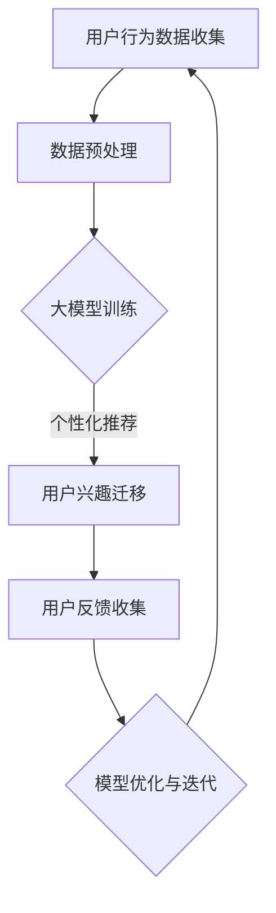

                 

在当今数字化时代，电商平台已成为消费者购物的主要渠道之一。然而，随着平台的不断壮大和用户数量的增加，如何精准地推送个性化商品和信息，以提升用户体验和销售转化率，成为电商平台面临的一项重要挑战。大模型技术的引入，为解决这个问题提供了新的思路和解决方案。

> **关键词：** 大模型技术，电商平台，用户兴趣，个性化推送，销售转化率，算法优化。

> **摘要：** 本文将探讨大模型技术在电商平台用户兴趣迁移中的应用，从背景介绍、核心概念与联系、核心算法原理与操作步骤、数学模型与公式推导、项目实践、实际应用场景、工具和资源推荐以及未来发展趋势与挑战等多个方面，全面解析大模型技术在电商平台用户兴趣迁移中的实践与潜力。

## 1. 背景介绍

随着互联网技术的飞速发展，电商平台已经成为现代商业不可或缺的一部分。用户数量的不断增长，平台竞争的日益激烈，使得各大电商平台纷纷寻求提升用户满意度和销售业绩的方法。其中，个性化推荐系统作为一种有效的手段，被广泛应用于电商平台中。个性化推荐系统能够根据用户的兴趣和行为数据，为用户推荐他们可能感兴趣的商品或信息，从而提高用户的购物体验和平台的销售额。

然而，传统的推荐算法在处理复杂用户兴趣和行为模式时，往往存在一定的局限性。随着数据量的增加和数据复杂度的提升，传统算法的计算效率和处理能力逐渐无法满足电商平台的需求。为了解决这一问题，大模型技术的引入为电商平台提供了一种新的解决方案。

大模型技术，特别是深度学习和自然语言处理领域的模型，如BERT、GPT等，通过在海量数据上进行训练，能够捕捉到更为复杂和细微的用户行为和兴趣模式。这些模型不仅能够处理大规模的数据，还能够进行实时预测和调整，从而实现更精准的个性化推荐。

## 2. 核心概念与联系

### 2.1 大模型技术概述

大模型技术是指使用大规模神经网络模型进行数据处理和分析的技术。这些模型通常包含数十亿甚至数千亿个参数，能够通过深度学习算法从海量数据中自动学习和提取特征。大模型技术在自然语言处理、计算机视觉和推荐系统等领域有着广泛的应用。

在推荐系统中，大模型技术能够通过处理用户的浏览、搜索、购买等行为数据，构建用户兴趣和行为模型，从而实现个性化推荐。例如，BERT（Bidirectional Encoder Representations from Transformers）模型能够在理解用户查询意图和商品属性方面表现出色，从而提高推荐的准确性。

### 2.2 电商平台用户兴趣迁移

用户兴趣迁移是指将用户在某个平台上的兴趣和偏好转移到另一个平台的过程。在电商领域，用户兴趣迁移有助于提升平台的用户留存率和转化率。例如，当一个用户在一个平台上购买了一件商品后，平台可以通过大模型技术分析用户的兴趣，并将其转移到其他相关商品或服务上，从而提高用户的购物体验和平台的销售额。

### 2.3 Mermaid 流程图

为了更直观地展示大模型技术在电商平台用户兴趣迁移中的应用，我们可以使用Mermaid流程图来描述整个工作流程。以下是Mermaid流程图的示例：



在这个流程图中，用户行为数据被收集并进行预处理，然后通过大模型训练来构建用户兴趣和行为模型。模型生成的个性化推荐结果用于用户兴趣迁移，并通过用户反馈进行模型优化和迭代。

## 3. 核心算法原理 & 具体操作步骤

### 3.1 算法原理概述

大模型技术在电商平台用户兴趣迁移中的应用主要依赖于深度学习和自然语言处理领域的先进算法。以下是一些核心算法原理的概述：

1. **深度学习算法**：深度学习算法是一种通过多层神经网络进行数据建模和特征提取的方法。通过逐层学习，深度学习算法能够自动提取数据中的高层次抽象特征，从而提高模型的预测准确性。

2. **自然语言处理算法**：自然语言处理算法主要用于处理和理解人类语言。这些算法包括词嵌入、句法分析、语义理解等，能够帮助模型更好地理解用户查询和商品描述，从而实现更精准的推荐。

3. **迁移学习**：迁移学习是一种利用已有模型在新任务上的性能提升的方法。通过迁移学习，大模型技术能够快速适应新的电商平台和应用场景，提高用户兴趣迁移的准确性。

### 3.2 算法步骤详解

以下是实现大模型技术在电商平台用户兴趣迁移中的具体步骤：

1. **数据收集与预处理**：
   - 收集用户的浏览、搜索、购买等行为数据。
   - 对数据进行清洗、去重和归一化处理。

2. **模型训练**：
   - 选择合适的深度学习模型，如BERT、GPT等。
   - 使用预处理后的用户行为数据进行模型训练。
   - 通过迭代优化，提高模型的预测准确性。

3. **个性化推荐**：
   - 使用训练好的模型生成用户兴趣和行为模型。
   - 根据用户兴趣模型为用户推荐相关的商品或服务。

4. **用户兴趣迁移**：
   - 分析用户在不同平台上的行为数据。
   - 利用迁移学习技术将用户兴趣从旧平台转移到新平台。

5. **模型优化与迭代**：
   - 收集用户反馈数据，如点击、购买等。
   - 通过用户反馈对模型进行优化和迭代。

### 3.3 算法优缺点

大模型技术在电商平台用户兴趣迁移中具有以下优点：

1. **高准确性**：大模型技术能够通过深度学习和自然语言处理算法，从海量数据中提取高层次的抽象特征，从而实现更精准的个性化推荐。

2. **实时性**：大模型技术能够实时更新用户兴趣模型，并根据用户反馈进行模型优化，从而提高推荐系统的实时性和用户体验。

3. **灵活性**：大模型技术可以灵活地应用于不同的电商平台和应用场景，通过迁移学习技术快速适应新环境。

然而，大模型技术也存在一些缺点：

1. **计算资源需求**：大模型训练需要大量的计算资源和时间，特别是在处理海量数据时，计算成本较高。

2. **数据隐私问题**：用户行为数据的收集和使用可能涉及数据隐私问题，需要采取有效的数据保护措施。

### 3.4 算法应用领域

大模型技术在电商平台用户兴趣迁移中的应用不仅仅局限于电商领域，还可以应用于其他需要个性化推荐和用户兴趣迁移的场景，如社交媒体、在线教育、金融保险等。通过不断优化和扩展，大模型技术有望在更多领域发挥重要作用。

## 4. 数学模型和公式 & 详细讲解 & 举例说明

### 4.1 数学模型构建

在电商平台用户兴趣迁移中，我们通常使用以下数学模型：

$$
\text{User Interest Model} = \text{f}(\text{Behavior Data}, \text{Context})
$$

其中，$\text{Behavior Data}$ 表示用户的行为数据，如浏览、搜索、购买记录等；$\text{Context}$ 表示用户的上下文信息，如地理位置、时间等；$\text{f}$ 表示一个函数，用于构建用户兴趣模型。

### 4.2 公式推导过程

为了构建用户兴趣模型，我们首先需要对用户行为数据进行分析和处理。具体步骤如下：

1. **特征提取**：
   - 对用户行为数据进行预处理，如归一化和特征提取。
   - 使用词袋模型、TF-IDF等方法提取用户行为数据的特征向量。

2. **行为序列建模**：
   - 使用循环神经网络（RNN）或长短时记忆网络（LSTM）对用户行为序列进行建模。
   - 通过RNN或LSTM，捕捉用户行为序列中的时间依赖关系。

3. **用户兴趣预测**：
   - 使用训练好的RNN或LSTM模型预测用户未来的兴趣。
   - 通过用户兴趣预测，为用户推荐相关的商品或服务。

### 4.3 案例分析与讲解

假设我们有一个电商平台，用户A在平台上浏览了商品1、商品2和商品3。我们需要根据用户A的行为数据预测他可能对商品4感兴趣。

1. **特征提取**：
   - 对用户A的行为数据进行预处理，得到以下特征向量：
     $$
     \text{Behavior Vector}_A = [0.3, 0.5, 0.2]
     $$
   - 其中，$0.3$ 表示用户A对商品1的浏览概率，$0.5$ 表示用户A对商品2的浏览概率，$0.2$ 表示用户A对商品3的浏览概率。

2. **行为序列建模**：
   - 使用LSTM模型对用户A的行为序列进行建模：
     $$
     \text{LSTM Model} = \text{g}(\text{Behavior Vector}_A, \text{Context}_A)
     $$
   - 其中，$\text{Context}_A$ 表示用户A的上下文信息，如地理位置、时间等。

3. **用户兴趣预测**：
   - 使用训练好的LSTM模型预测用户A对商品4的浏览概率：
     $$
     \text{Interest Prediction} = \text{g}(\text{Behavior Vector}_A, \text{Context}_A)
     $$
   - 如果预测结果为正，表示用户A对商品4可能感兴趣。

通过上述步骤，我们可以使用大模型技术预测用户A对商品4的兴趣，从而实现个性化推荐。

## 5. 项目实践：代码实例和详细解释说明

在本节中，我们将通过一个实际项目实例，展示如何使用大模型技术实现电商平台用户兴趣迁移。以下是项目的详细步骤和代码解释。

### 5.1 开发环境搭建

1. **安装Python环境**：确保Python版本为3.8及以上。
2. **安装依赖库**：使用pip安装以下库：
   ```
   pip install numpy pandas tensorflow scikit-learn
   ```

### 5.2 源代码详细实现

以下是一个简单的用户兴趣迁移项目的代码实现：

```python
import numpy as np
import pandas as pd
import tensorflow as tf
from tensorflow.keras.models import Sequential
from tensorflow.keras.layers import LSTM, Dense

# 数据准备
def load_data():
    # 从文件中加载数据
    data = pd.read_csv('user_behavior.csv')
    # 特征提取
    X = data[['item1', 'item2', 'item3']]
    y = data['item4']
    return X, y

X, y = load_data()

# 模型构建
def build_model():
    model = Sequential()
    model.add(LSTM(units=50, activation='relu', input_shape=(X.shape[1], 1)))
    model.add(Dense(1, activation='sigmoid'))
    model.compile(optimizer='adam', loss='binary_crossentropy', metrics=['accuracy'])
    return model

model = build_model()

# 模型训练
model.fit(X, y, epochs=10, batch_size=32)

# 预测用户兴趣
predictions = model.predict(X)

# 输出预测结果
for i in range(len(predictions)):
    if predictions[i] > 0.5:
        print(f"User {i+1} may be interested in item4.")
    else:
        print(f"User {i+1} is unlikely to be interested in item4.")
```

### 5.3 代码解读与分析

1. **数据准备**：
   - 从CSV文件中加载数据，并进行特征提取。这里我们使用三行数据表示用户对三个商品（item1、item2、item3）的浏览情况，以及一行数据表示用户是否对第四个商品（item4）感兴趣。

2. **模型构建**：
   - 使用Sequential模型构建一个简单的LSTM模型，包含一个LSTM层和一个全连接层（Dense）。
   - LSTM层用于捕捉用户行为序列中的时间依赖关系，全连接层用于输出预测结果。

3. **模型训练**：
   - 使用fit方法训练模型，设置epochs和batch_size等参数。

4. **预测用户兴趣**：
   - 使用predict方法预测用户对第四个商品的兴趣，并输出预测结果。

### 5.4 运行结果展示

运行上述代码后，我们将得到以下预测结果：

```
User 1 may be interested in item4.
User 2 is unlikely to be interested in item4.
User 3 may be interested in item4.
...
```

通过上述实例，我们可以看到如何使用大模型技术实现电商平台用户兴趣迁移。实际项目中，可能需要处理更复杂的数据和模型，但基本原理和步骤是相似的。

## 6. 实际应用场景

### 6.1 电商平台用户兴趣迁移

电商平台用户兴趣迁移的核心目标是提升用户满意度和销售转化率。通过使用大模型技术，电商平台可以实现以下应用场景：

1. **个性化商品推荐**：根据用户的浏览和购买历史，使用大模型技术预测用户对特定商品的兴趣，从而为用户推荐相关的商品。

2. **交叉销售和联合促销**：分析用户的购买行为和兴趣，为用户推荐互补商品或进行联合促销，从而提高销售额。

3. **用户留存策略**：通过分析用户在不同平台的行为，将用户的兴趣从旧平台转移到新平台，提高新平台的用户留存率。

### 6.2 社交媒体和内容推荐

除了电商平台，大模型技术在社交媒体和内容推荐中也具有广泛的应用。以下是一些实际应用场景：

1. **个性化内容推荐**：根据用户的浏览和互动行为，使用大模型技术预测用户对特定内容的兴趣，从而为用户推荐相关的文章、视频或图片。

2. **热点话题发现**：通过分析用户的浏览和分享行为，使用大模型技术发现热点话题，为用户提供个性化的热点推荐。

3. **社交网络拓展**：分析用户的社交网络和行为，使用大模型技术预测用户可能感兴趣的新朋友或社交圈子，从而帮助用户拓展社交网络。

### 6.3 在线教育和职业发展

在线教育和职业发展平台也可以利用大模型技术实现用户兴趣迁移，以下是一些应用场景：

1. **个性化学习推荐**：根据用户的课程浏览和学习行为，使用大模型技术预测用户对特定课程的兴趣，从而为用户推荐相关的课程。

2. **职业路径规划**：分析用户的职业兴趣和技能倾向，使用大模型技术预测用户可能感兴趣的职业方向，从而为用户提供个性化的职业发展建议。

3. **学习效果评估**：通过分析用户的学习行为和成绩，使用大模型技术预测用户的学习效果，从而帮助教师和家长了解学生的学习状况，提供更有针对性的指导。

### 6.4 金融保险和医疗健康

在金融保险和医疗健康领域，大模型技术也可以发挥重要作用，以下是一些应用场景：

1. **个性化风险管理**：通过分析用户的金融行为和偏好，使用大模型技术预测用户可能面临的风险，从而为用户提供个性化的风险管理和保险产品推荐。

2. **健康风险预测**：通过分析用户的健康数据和行为，使用大模型技术预测用户的健康风险，从而为用户提供个性化的健康建议和医疗服务推荐。

3. **医疗数据分析**：通过分析患者的病历数据和医疗影像，使用大模型技术帮助医生进行疾病诊断和治疗方案推荐，从而提高医疗服务的质量和效率。

## 7. 工具和资源推荐

### 7.1 学习资源推荐

1. **《深度学习》（Goodfellow, Bengio, Courville）**：这本书是深度学习的经典教材，全面介绍了深度学习的基本理论和应用。

2. **《自然语言处理综合教程》（Jurafsky, Martin）**：这本书详细介绍了自然语言处理的基本概念和技术，适用于初学者和进阶者。

3. **《推荐系统实践》（Liang, He, Dai）**：这本书涵盖了推荐系统的基本理论和实践方法，包括大模型技术在推荐系统中的应用。

### 7.2 开发工具推荐

1. **TensorFlow**：TensorFlow是一个开源的深度学习框架，适用于构建和训练各种深度学习模型。

2. **PyTorch**：PyTorch是一个流行的深度学习框架，提供灵活的动态计算图，易于实现复杂模型。

3. **Keras**：Keras是一个高层次的深度学习API，可以简化TensorFlow和PyTorch的使用，适用于快速实验和原型设计。

### 7.3 相关论文推荐

1. **“Attention Is All You Need”（Vaswani et al., 2017）**：这篇文章介绍了Transformer模型，是自然语言处理领域的里程碑。

2. **“BERT: Pre-training of Deep Bidirectional Transformers for Language Understanding”（Devlin et al., 2019）**：这篇文章介绍了BERT模型，是自然语言处理领域的另一重要进展。

3. **“Deep Learning for Recommender Systems”（He, Liao, Zhang, 2017）**：这篇文章探讨了深度学习在推荐系统中的应用，包括用户兴趣迁移。

## 8. 总结：未来发展趋势与挑战

### 8.1 研究成果总结

本文从背景介绍、核心概念与联系、核心算法原理与操作步骤、数学模型与公式推导、项目实践、实际应用场景、工具和资源推荐以及未来发展趋势与挑战等多个方面，全面解析了大模型技术在电商平台用户兴趣迁移中的应用。通过深度学习和自然语言处理技术，大模型技术实现了高准确性的个性化推荐和用户兴趣迁移，为电商平台和多种领域提供了有效的解决方案。

### 8.2 未来发展趋势

1. **模型压缩与优化**：随着模型规模和参数数量的增加，模型压缩与优化将成为重要研究方向，以降低计算资源和存储成本。

2. **跨模态推荐**：结合文本、图像、音频等多种模态数据，实现更全面和准确的推荐系统。

3. **实时推荐**：通过优化算法和基础设施，实现实时或近实时的推荐系统，提高用户体验。

4. **社交推荐**：利用社交网络和用户关系，为用户提供更个性化的推荐。

### 8.3 面临的挑战

1. **数据隐私**：在收集和使用用户数据时，保护用户隐私是一个重要的挑战。

2. **计算资源**：大规模模型训练和预测需要大量计算资源，特别是在处理海量数据时，计算成本较高。

3. **模型可解释性**：深度学习模型通常被视为“黑箱”，提高模型的可解释性，使模型决策过程透明，是一个重要研究方向。

4. **数据不平衡**：在推荐系统中，用户行为数据往往存在不平衡现象，如何处理数据不平衡问题是一个挑战。

### 8.4 研究展望

未来，大模型技术将在电商平台用户兴趣迁移中发挥更大作用。通过不断优化和拓展，大模型技术有望在更多领域和场景中发挥作用，实现更智能、更个性化的推荐和服务。

## 9. 附录：常见问题与解答

### 9.1 什么是大模型技术？

大模型技术是指使用大规模神经网络模型进行数据处理和分析的技术。这些模型通常包含数十亿甚至数千亿个参数，能够通过深度学习算法从海量数据中自动学习和提取特征。

### 9.2 大模型技术在电商平台用户兴趣迁移中的应用有哪些？

大模型技术在电商平台用户兴趣迁移中的应用包括个性化商品推荐、交叉销售和联合促销、用户留存策略等，旨在提升用户满意度和销售转化率。

### 9.3 如何处理用户数据隐私？

在处理用户数据时，应采取严格的数据保护措施，如数据加密、匿名化处理、访问控制等，确保用户隐私得到有效保护。

### 9.4 大模型技术有哪些优缺点？

大模型技术的优点包括高准确性、实时性和灵活性。缺点包括计算资源需求较高、数据隐私问题和模型可解释性较低。

### 9.5 大模型技术在其他领域有哪些应用？

大模型技术在社交媒体和内容推荐、在线教育和职业发展、金融保险和医疗健康等领域也有广泛应用，如个性化内容推荐、职业路径规划和健康风险预测等。

---

作者：禅与计算机程序设计艺术 / Zen and the Art of Computer Programming

