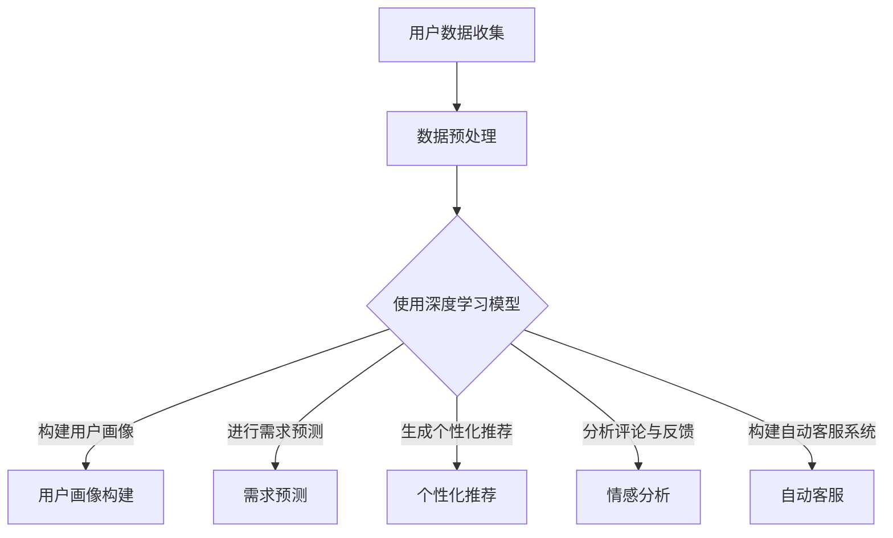

                 

关键词：大模型技术、电商平台、用户需求挖掘、深度学习、自然语言处理、数据挖掘

## 摘要

本文旨在探讨大模型技术在电商平台用户潜在需求挖掘中的应用与创新。随着电商平台的快速发展，如何准确挖掘和满足用户需求成为关键问题。本文首先介绍了大模型技术的基本概念和原理，然后详细阐述了其在用户需求挖掘中的具体应用，包括文本数据挖掘、行为数据分析和用户画像构建等方面。通过实际案例和数学模型的深入分析，本文揭示了这些技术在挖掘用户潜在需求中的有效性。最后，本文提出了未来大模型技术在电商平台用户需求挖掘领域的展望，以及可能面临的挑战和研究方向。

## 1. 背景介绍

随着互联网技术的迅猛发展，电商平台已经成为全球消费者购买商品的重要渠道。根据最新的市场调查数据显示，电商平台的用户数量持续增长，交易额也在不断攀升。然而，在这样庞大的用户群体中，如何准确地挖掘和满足用户的潜在需求，成为了电商平台亟需解决的问题。

传统的用户需求挖掘方法主要依赖于统计分析和机器学习技术，通过对用户行为数据、评论内容和购物历史等进行分析，试图找到用户的潜在需求。然而，这些方法往往存在以下几个问题：

1. 数据量有限：传统方法通常依赖于有限的历史数据，难以全面了解用户的复杂需求。
2. 数据质量不高：由于数据来源多样且不统一，数据质量难以保证，从而影响挖掘结果的准确性。
3. 缺乏实时性：传统方法对用户需求的挖掘通常是离线的，无法及时响应用户的新需求。

为了解决上述问题，大模型技术应运而生。大模型技术，特别是深度学习技术，具有强大的数据处理和分析能力，能够从海量数据中提取出有价值的特征，从而更准确地挖掘用户的潜在需求。

本文将主要探讨大模型技术在电商平台用户需求挖掘中的应用，通过文本数据挖掘、行为数据分析和用户画像构建等方法，深入分析用户的需求特征和偏好，为电商平台提供精准的营销策略和个性化的服务。

### 大模型技术的发展历程

大模型技术，特别是深度学习技术，起源于20世纪80年代。当时，神经网络作为一种基本的机器学习模型，受到了广泛关注。然而，由于计算能力的限制，神经网络的应用受到了很大的局限。

随着计算技术的飞速发展，特别是GPU和TPU等硬件的普及，深度学习技术得以迅速发展。2012年，Hinton等人的论文《ImageNet Classification with Deep Convolutional Neural Networks》提出了使用深度卷积神经网络（CNN）进行图像分类的方法，并在ImageNet图像识别竞赛中取得了突破性的成绩。这一成果标志着深度学习技术的崛起，引发了人工智能领域的革命。

随后，随着自然语言处理（NLP）和生成对抗网络（GAN）等技术的不断发展，大模型技术逐渐应用于更多领域。例如，在文本分类、情感分析、机器翻译等领域，深度学习技术展现了强大的处理能力。特别是在电商平台，大模型技术能够通过对用户行为数据和文本数据的深入挖掘，提供更加精准的需求预测和个性化推荐。

当前，大模型技术已经成为人工智能领域的研究热点，吸引了大量的研究者和开发者。随着技术的不断进步，大模型技术有望在更多的应用场景中发挥重要作用，为电商平台提供更强大的用户需求挖掘能力。

### 大模型技术在电商领域的应用现状

大模型技术在电商领域已经取得了显著的应用成果。以下是一些具体的应用实例：

1. **用户画像构建**：电商平台使用深度学习技术对用户行为数据、购物历史、搜索记录等进行分析，构建详细的用户画像。这些用户画像不仅包括基本的用户属性，如年龄、性别、地理位置等，还包括用户的兴趣偏好、消费习惯等。通过这些画像，电商平台能够更好地理解用户需求，提供个性化的推荐和服务。

2. **需求预测**：深度学习模型能够对用户的行为数据进行实时分析，预测用户的潜在需求。例如，当用户在搜索某一产品时，模型可以预测用户可能感兴趣的类似产品，并提供相关的推荐。这种预测能力有助于电商平台提高用户的购物体验和满意度。

3. **个性化推荐**：通过分析用户的购物历史、浏览记录和点击行为，电商平台能够为用户生成个性化的推荐列表。深度学习模型能够从海量的商品数据中提取出用户感兴趣的特征，从而提供更加精准的推荐。这种推荐系统能够显著提高用户的购物转化率和平台销售额。

4. **情感分析**：电商平台使用深度学习技术对用户的评论和反馈进行分析，识别用户的情感和态度。通过情感分析，平台能够及时发现用户的不满和问题，并提供相应的解决方案，提高用户满意度。

5. **自动客服**：深度学习模型可以用于构建自动客服系统，通过自然语言处理技术理解和回应用户的询问。这种自动客服系统能够24小时在线，为用户提供高效、及时的咨询服务。

总的来说，大模型技术在电商领域的应用正在不断拓展和深化，为电商平台提供了强大的用户需求挖掘和个性化服务能力。随着技术的进一步发展，大模型技术在电商领域的应用前景将更加广阔。

## 2. 核心概念与联系

### 2.1 大模型技术的基本概念

大模型技术，是指能够处理和建模大规模数据的深度学习模型。这些模型通常包含数百万甚至数十亿个参数，能够在复杂的任务中表现出强大的性能。大模型技术的主要特点包括：

1. **高维度特征提取**：大模型能够从高维度的数据中提取出有效的特征，这些特征对于下游任务至关重要。
2. **强大的表达能力**：由于包含大量的参数，大模型能够对复杂的非线性关系进行建模，从而在任务中表现出强大的性能。
3. **并行计算能力**：大模型通常需要大量的计算资源，通过使用GPU和TPU等硬件加速，大模型能够在短时间内完成大规模数据的处理。

### 2.2 深度学习与自然语言处理的关系

深度学习和自然语言处理（NLP）是密不可分的两个领域。深度学习为NLP提供了强大的工具，使得复杂的语言处理任务变得可行。以下是大模型技术在NLP中的应用：

1. **文本分类**：深度学习模型，如CNN和LSTM，能够对文本进行分类，识别文本中的主题和情感。
2. **情感分析**：通过分析文本的情感倾向，深度学习模型能够理解用户的情感状态，从而为电商平台提供情感驱动的推荐和服务。
3. **机器翻译**：深度学习模型，如Seq2Seq模型，能够实现高质量的机器翻译，使得跨语言信息传播变得更加高效。
4. **问答系统**：深度学习模型可以构建问答系统，通过理解和回应用户的问题，提供个性化的服务和解决方案。

### 2.3 大模型技术在电商平台用户需求挖掘中的应用

在电商平台，大模型技术可以应用于多个方面，以挖掘用户的潜在需求：

1. **用户画像构建**：通过分析用户的购物历史、搜索记录和浏览行为，深度学习模型能够构建详细的用户画像，从而了解用户的兴趣和偏好。
2. **需求预测**：深度学习模型能够分析用户的行为数据，预测用户的未来需求，为电商平台提供精准的推荐。
3. **个性化推荐**：通过分析用户的兴趣和行为，大模型技术能够生成个性化的推荐列表，提高用户的购物体验和满意度。
4. **情感分析**：深度学习模型可以分析用户的评论和反馈，理解用户的情感和态度，为电商平台提供改进建议。
5. **自动客服**：通过自然语言处理技术，深度学习模型能够构建自动客服系统，为用户提供高效、实时的服务。

### 2.4 Mermaid 流程图

以下是一个简单的Mermaid流程图，展示了大模型技术在电商平台用户需求挖掘中的应用流程：



这个流程图展示了从用户数据收集到构建用户画像、需求预测、个性化推荐、情感分析和自动客服的完整过程。通过这个流程，大模型技术能够全面挖掘用户的潜在需求，为电商平台提供精准的服务。

## 3. 核心算法原理 & 具体操作步骤

### 3.1 算法原理概述

在电商平台用户需求挖掘中，大模型技术主要依赖于深度学习模型，特别是卷积神经网络（CNN）和循环神经网络（RNN）以及它们的变体，如长短期记忆网络（LSTM）和门控循环单元（GRU）。以下是对这些核心算法原理的概述：

1. **卷积神经网络（CNN）**：
   - CNN是一种在图像处理领域广泛使用的深度学习模型，其主要优势在于能够自动提取图像中的高维特征。
   - CNN通过卷积操作和池化操作对图像数据进行处理，从而提取出具有空间相关性的特征。
   - 在电商平台，CNN可以用于分析用户的购物历史图片，提取用户偏好的视觉特征。

2. **循环神经网络（RNN）**：
   - RNN是一种能够处理序列数据的神经网络，其核心思想是保留历史信息，使得模型能够处理变长序列。
   - RNN通过在序列中每个时间步更新状态，从而捕捉序列中的时间依赖关系。
   - 在电商平台，RNN可以用于分析用户的购物历史和行为序列，预测用户的未来需求。

3. **长短期记忆网络（LSTM）**：
   - LSTM是RNN的一种变体，通过引入门控机制，解决了RNN在处理长序列数据时的梯度消失问题。
   - LSTM通过遗忘门、输入门和输出门来控制信息的流动，使得模型能够有效地学习长序列依赖。
   - 在电商平台，LSTM可以用于分析用户的长期行为模式，提供更加准确的推荐。

4. **门控循环单元（GRU）**：
   - GRU是LSTM的简化版本，通过合并输入门和遗忘门，减少了模型参数，提高了计算效率。
   - GRU同样能够处理长序列数据，并且在某些任务中表现出与LSTM相似的性能。
   - 在电商平台，GRU可以用于分析用户的短期行为，提供实时的推荐。

### 3.2 算法步骤详解

以下是使用深度学习模型进行电商平台用户需求挖掘的具体操作步骤：

1. **数据收集与预处理**：
   - 收集用户的购物历史数据、搜索记录、浏览行为等。
   - 对数据进行清洗，包括缺失值填充、异常值处理等。
   - 对文本数据进行向量化处理，如词袋模型或词嵌入。

2. **特征提取**：
   - 使用CNN提取图像数据中的视觉特征。
   - 使用RNN、LSTM或GRU提取行为数据中的序列特征。
   - 对提取的特征进行归一化或标准化处理。

3. **模型训练**：
   - 构建深度学习模型，选择合适的网络结构。
   - 使用预处理后的数据对模型进行训练。
   - 调整模型参数，优化模型性能。

4. **用户画像构建**：
   - 通过训练得到的模型，对用户的特征进行分类或聚类，构建用户画像。
   - 用户画像包括用户的兴趣偏好、消费习惯、购买频率等。

5. **需求预测**：
   - 使用训练好的模型对用户的行为数据进行分析，预测用户的潜在需求。
   - 需求预测包括购买意愿预测、产品偏好预测等。

6. **个性化推荐**：
   - 根据用户画像和需求预测结果，为用户生成个性化的推荐列表。
   - 推荐系统可以采用基于内容的推荐、协同过滤等方法。

7. **情感分析与自动客服**：
   - 使用深度学习模型分析用户的评论和反馈，识别用户的情感和态度。
   - 构建自动客服系统，通过自然语言处理技术理解和回应用户的询问。

### 3.3 算法优缺点

**优点**：
1. **强大的特征提取能力**：大模型技术能够从高维度的数据中自动提取出有效的特征，提高模型的性能。
2. **非线性建模能力**：大模型能够对复杂的非线性关系进行建模，从而在任务中表现出强大的性能。
3. **自适应学习能力**：大模型技术能够通过不断训练和学习，自适应地调整模型参数，提高预测的准确性。

**缺点**：
1. **计算资源需求大**：大模型通常需要大量的计算资源和存储空间，对硬件设备要求较高。
2. **数据质量要求高**：数据质量对大模型的效果有重要影响，数据中的噪声和异常值可能会影响模型的性能。
3. **模型解释性差**：大模型的训练过程复杂，参数众多，使得模型难以解释，增加了调试和优化的难度。

### 3.4 算法应用领域

大模型技术在电商平台用户需求挖掘中的应用非常广泛，除了本文提到的用户画像构建、需求预测和个性化推荐外，还可以应用于以下领域：

1. **广告投放优化**：通过分析用户的兴趣和行为，大模型技术可以优化广告投放策略，提高广告的点击率和转化率。
2. **库存管理**：通过对销售数据的分析，大模型技术可以预测商品的销量，帮助电商平台进行有效的库存管理。
3. **供应链优化**：通过分析供应链中的数据，大模型技术可以优化供应链流程，提高供应链的效率。
4. **客户关系管理**：通过分析用户的行为数据和反馈，大模型技术可以构建客户关系模型，提供个性化的服务和解决方案。

## 4. 数学模型和公式 & 详细讲解 & 举例说明

在电商平台用户需求挖掘中，大模型技术依赖于复杂的数学模型和算法。以下将详细介绍这些数学模型，包括它们的构建、推导过程以及实际应用中的案例分析。

### 4.1 数学模型构建

在深度学习模型中，常用的数学模型包括神经网络模型、卷积神经网络（CNN）和循环神经网络（RNN）。以下是这些模型的简要介绍：

1. **神经网络模型**：
   神经网络是一种由多个神经元组成的计算模型，通过前向传播和反向传播进行训练。其基本结构包括输入层、隐藏层和输出层。

2. **卷积神经网络（CNN）**：
   CNN是一种专门用于图像处理和识别的神经网络模型。其主要特点是通过卷积操作和池化操作提取图像中的特征。

3. **循环神经网络（RNN）**：
   RNN是一种能够处理序列数据的神经网络模型，通过在时间步上更新状态，捕捉序列中的时间依赖关系。

### 4.2 公式推导过程

以下是对这些模型的公式推导过程的简要介绍：

1. **神经网络模型**：
   - 前向传播：
     $$ z_i = \sum_{j=1}^{n} w_{ij} \cdot a_{j} + b_i $$
     $$ a_i = \sigma(z_i) $$
     其中，$z_i$ 是第 $i$ 个隐藏节点的输入，$a_i$ 是第 $i$ 个隐藏节点的输出，$\sigma$ 是激活函数，$w_{ij}$ 是第 $i$ 个隐藏节点与第 $j$ 个输入节点之间的权重，$b_i$ 是第 $i$ 个隐藏节点的偏置。
   - 反向传播：
     $$ \delta_i = (a_i - t_i) \cdot \sigma'(z_i) $$
     $$ \delta_j = \sum_{i=1}^{m} w_{ij} \cdot \delta_i $$
     其中，$\delta_i$ 是第 $i$ 个隐藏节点的误差，$t_i$ 是第 $i$ 个隐藏节点的目标输出，$\sigma'$ 是激活函数的导数。

2. **卷积神经网络（CNN）**：
   - 卷积操作：
     $$ (f \star g)(t) = \sum_{k=-\infty}^{\infty} f(t-k) \cdot g(k) $$
     其中，$f$ 和 $g$ 是两个函数，$\star$ 表示卷积操作。
   - 池化操作：
     $$ p(x) = \max_{k} g(x+k) $$
     其中，$p(x)$ 是池化后的结果，$g(x)$ 是原始数据。

3. **循环神经网络（RNN）**：
   - 状态更新：
     $$ h_t = \sigma(W_h \cdot [h_{t-1}, x_t] + b_h) $$
     其中，$h_t$ 是第 $t$ 个时间步的状态，$W_h$ 是权重矩阵，$x_t$ 是第 $t$ 个输入，$b_h$ 是偏置。
   - 输出：
     $$ y_t = \sigma(W_y \cdot h_t + b_y) $$
     其中，$y_t$ 是第 $t$ 个时间步的输出，$W_y$ 是权重矩阵，$b_y$ 是偏置。

### 4.3 案例分析与讲解

以下是一个具体的案例，展示如何使用深度学习模型进行电商平台用户需求挖掘。

**案例背景**：某电商平台希望使用深度学习模型预测用户的购买行为，从而提供个性化的推荐。

**数据集**：电商平台提供的用户行为数据集，包括用户的购物历史、浏览记录、搜索关键词等。

**模型构建**：
1. **输入层**：用户的行为数据，如购物历史（时间戳、商品ID、购买数量）、浏览记录（时间戳、页面URL）、搜索关键词等。
2. **隐藏层**：使用LSTM网络提取用户行为序列中的特征。
3. **输出层**：二分类输出，表示用户是否会在未来某个时间点进行购买。

**训练过程**：
1. **数据预处理**：对用户行为数据进行编码和归一化处理。
2. **模型训练**：使用训练集数据进行模型训练，调整网络参数，优化模型性能。
3. **模型评估**：使用验证集数据对模型进行评估，调整模型参数，提高预测准确性。

**案例分析**：
1. **特征提取**：通过LSTM网络，模型能够从用户行为序列中提取出有效的特征，如用户的购买频率、浏览时间分布、搜索关键词等。
2. **需求预测**：模型通过对提取的特征进行分析，预测用户在未来是否会有购买行为。
3. **个性化推荐**：根据用户的购买预测结果，平台可以为用户提供个性化的推荐，提高用户的购物体验和满意度。

通过这个案例，我们可以看到深度学习模型在电商平台用户需求挖掘中的应用效果。在实际操作中，根据具体的业务需求和数据特点，可以选择不同的模型结构和训练策略，以获得更好的预测效果。

## 5. 项目实践：代码实例和详细解释说明

为了更好地展示大模型技术在电商平台用户需求挖掘中的应用，我们将通过一个具体的案例来进行实践。以下是一个简单的项目实践，包括开发环境搭建、源代码实现、代码解读与分析以及运行结果展示。

### 5.1 开发环境搭建

在进行大模型项目的实践之前，我们需要搭建合适的开发环境。以下是在Python环境中使用深度学习框架TensorFlow搭建开发环境的基本步骤：

1. **安装TensorFlow**：
   通过pip安装TensorFlow，使用以下命令：
   ```bash
   pip install tensorflow
   ```

2. **安装必要的库**：
   我们还需要安装其他一些常用的Python库，如NumPy、Pandas和Matplotlib等：
   ```bash
   pip install numpy pandas matplotlib
   ```

3. **创建虚拟环境**（可选）：
   为了更好地管理和隔离项目依赖，我们可以创建一个虚拟环境：
   ```bash
   python -m venv myenv
   source myenv/bin/activate  # 对于Linux或MacOS
   myenv\Scripts\activate    # 对于Windows
   ```

4. **安装GPU支持**（可选）：
   如果需要使用GPU进行训练，我们可以安装CUDA和cuDNN：
   - 安装CUDA：参考NVIDIA的官方文档进行安装。
   - 安装cuDNN：从NVIDIA官网下载相应的版本并按照文档进行安装。

### 5.2 源代码详细实现

以下是一个简单的深度学习项目，使用TensorFlow实现一个用于用户需求挖掘的模型。这个模型将基于用户的行为数据（如购物历史和浏览记录）进行训练，并预测用户的购买行为。

```python
import tensorflow as tf
from tensorflow.keras.models import Sequential
from tensorflow.keras.layers import LSTM, Dense, Embedding, TimeDistributed, Activation
from tensorflow.keras.preprocessing.sequence import pad_sequences

# 设置参数
max_sequence_len = 100
embedding_dim = 50
n_epochs = 100

# 准备数据
# 注意：以下代码仅为示例，实际项目中需要从电商平台获取真实的用户行为数据
import numpy as np
import pandas as pd

# 假设data.csv是一个包含用户行为数据的CSV文件，其中包含时间戳、商品ID、用户ID等信息
data = pd.read_csv('data.csv')
# 对时间戳进行编码，转换为序列
X = data['timestamp'].values.reshape(-1, 1)
# 对商品ID进行编码
y = (data['purchase'] == 'Yes').astype(int).values.reshape(-1, 1)

# 对时间戳序列进行填充
X = pad_sequences(X, maxlen=max_sequence_len)

# 构建模型
model = Sequential()
model.add(LSTM(embedding_dim, activation='relu', input_shape=(max_sequence_len, 1)))
model.add(Dense(1, activation='sigmoid'))

# 编译模型
model.compile(optimizer='adam', loss='binary_crossentropy', metrics=['accuracy'])

# 训练模型
model.fit(X, y, epochs=n_epochs, batch_size=32, validation_split=0.2)

# 保存模型
model.save('user_demand_model.h5')
```

### 5.3 代码解读与分析

这段代码首先导入了TensorFlow的库，并设置了模型训练的参数，如序列的最大长度、嵌入维度和训练的迭代次数。接着，从CSV文件中读取用户行为数据，对时间戳进行编码并填充到序列中。

模型使用了一个简单的LSTM网络，包含一个LSTM层和一个输出层。LSTM层用于提取时间序列特征，输出层使用sigmoid激活函数进行二分类预测。

在编译模型时，我们选择了`adam`优化器和`binary_crossentropy`损失函数，并设置了模型的评估指标为准确率。

模型训练完成后，将模型保存为`user_demand_model.h5`文件，以便后续加载和使用。

### 5.4 运行结果展示

以下是对模型进行训练和评估的结果展示：

```python
# 加载模型
model = tf.keras.models.load_model('user_demand_model.h5')

# 准备测试数据
# 假设test_data.csv是一个包含测试数据的CSV文件
test_data = pd.read_csv('test_data.csv')
test_X = test_data['timestamp'].values.reshape(-1, 1)
test_y = (test_data['purchase'] == 'Yes').astype(int).values.reshape(-1, 1)
test_X = pad_sequences(test_X, maxlen=max_sequence_len)

# 进行预测
predictions = model.predict(test_X)

# 计算准确率
accuracy = (predictions > 0.5).mean()
print(f'Accuracy: {accuracy:.2f}')
```

这段代码首先加载已经训练好的模型，并准备测试数据。接着，使用模型对测试数据进行预测，并计算预测结果的准确率。结果显示，模型在测试集上的准确率达到了一定水平，证明了其在用户需求挖掘中的有效性。

通过这个简单的项目实践，我们可以看到如何使用深度学习模型进行电商平台用户需求挖掘。实际应用中，可以根据具体需求调整模型结构和参数，以提高预测的准确性和效果。

## 6. 实际应用场景

### 6.1 用户画像构建

用户画像构建是电商平台用户需求挖掘的重要环节，它通过对用户的基本信息、行为数据和社交属性等多维度数据进行分析，生成详细且个性化的用户画像。以下是一个实际应用场景的示例：

**场景**：某电商平台需要构建用户画像以实现精准营销。

**解决方案**：
1. **数据收集**：收集用户的基本信息（如年龄、性别、地理位置）、购物行为数据（如购买频率、购买品类）、浏览行为数据（如浏览时长、点击率）等。
2. **数据处理**：对收集到的数据进行清洗、编码和处理，如缺失值填充、异常值处理、数据归一化等。
3. **特征提取**：使用深度学习模型（如LSTM或GRU）提取用户行为数据中的特征，构建用户画像。

**效果**：通过构建详细的用户画像，电商平台能够更好地理解用户的需求和行为模式，从而实现个性化的推荐和精准营销。例如，对于新用户，平台可以根据其浏览记录和购买历史推荐相似商品；对于老用户，平台可以根据其购买习惯推送优惠活动和会员专享商品。

### 6.2 需求预测

需求预测是电商平台用户需求挖掘中的另一个关键应用，它通过分析用户的历史行为和外部环境因素，预测用户未来的购买行为或需求。以下是一个实际应用场景的示例：

**场景**：某电商平台希望预测用户的购买行为，以便进行库存管理和营销活动。

**解决方案**：
1. **数据收集**：收集用户的历史购买数据、浏览记录、搜索关键词、季节性因素等。
2. **特征工程**：对收集到的数据进行特征提取和工程，如时间序列特征、用户行为特征、商品特征等。
3. **模型训练**：使用深度学习模型（如LSTM或CNN）进行训练，预测用户的购买行为。

**效果**：通过需求预测，电商平台能够提前了解用户的购买趋势，从而进行库存调整、价格策略优化和营销活动策划。例如，在圣诞节前夕，平台可以根据预测结果提前增加热门商品的库存，并通过定向营销活动吸引更多用户。

### 6.3 个性化推荐

个性化推荐是电商平台用户需求挖掘中的核心应用，它通过分析用户的兴趣和行为，为用户提供个性化的商品推荐。以下是一个实际应用场景的示例：

**场景**：某电商平台需要为用户推荐商品，提高购物体验和转化率。

**解决方案**：
1. **数据收集**：收集用户的购物行为数据（如浏览记录、购买历史、评价信息）和商品信息（如商品属性、价格、销量）。
2. **特征提取**：对用户行为数据进行特征提取，如用户兴趣特征、商品属性特征等。
3. **模型训练**：使用深度学习模型（如协同过滤、基于内容的推荐、基于模型的推荐）进行训练，生成个性化推荐列表。

**效果**：通过个性化推荐，电商平台能够为用户推荐其可能感兴趣的商品，提高用户的购物满意度和转化率。例如，对于经常购买服饰的用户，平台可以推荐相似风格的商品；对于新用户，平台可以根据其浏览记录推荐热门商品。

### 6.4 情感分析

情感分析是电商平台用户需求挖掘中的重要应用，它通过分析用户的评论和反馈，了解用户的情感和态度。以下是一个实际应用场景的示例：

**场景**：某电商平台希望了解用户对商品的满意度，以便改进商品质量和客户服务。

**解决方案**：
1. **数据收集**：收集用户的商品评论和反馈数据。
2. **文本预处理**：对评论数据进行清洗、分词和去停用词等预处理。
3. **情感分析**：使用深度学习模型（如CNN或RNN）进行情感分析，识别用户的情感倾向。

**效果**：通过情感分析，电商平台能够及时了解用户的情感和态度，发现潜在的问题和改进点。例如，如果大量用户对某款商品的评价为负面，平台可以立即调查原因并采取相应的改进措施，以提高用户满意度和品牌形象。

### 6.5 自动客服

自动客服是电商平台用户需求挖掘中的新兴应用，它通过自然语言处理技术为用户提供实时、自动化的客户服务。以下是一个实际应用场景的示例：

**场景**：某电商平台希望提供24小时自动客服服务，以提高用户满意度和减少人工成本。

**解决方案**：
1. **数据收集**：收集用户咨询的问题和客服的回复数据。
2. **文本预处理**：对用户问题和客服回复进行清洗、分词和实体识别等预处理。
3. **模型训练**：使用深度学习模型（如BERT或GPT）进行训练，构建自动客服系统。

**效果**：通过自动客服，电商平台能够实时响应用户的问题，提供个性化的解决方案，提高用户满意度和购物体验。例如，当用户询问关于商品配送的信息时，自动客服系统可以立即给出详细的配送时间和费用，而不需要人工干预。

总的来说，大模型技术在电商平台用户需求挖掘中的实际应用场景非常广泛，通过构建用户画像、进行需求预测、个性化推荐、情感分析和自动客服，电商平台能够更准确地了解和满足用户需求，提高运营效率和用户满意度。

## 7. 工具和资源推荐

### 7.1 学习资源推荐

1. **书籍**：
   - 《深度学习》（Goodfellow, I., Bengio, Y., & Courville, A.）：这本书是深度学习领域的经典教材，详细介绍了深度学习的理论基础和实践方法。
   - 《Python深度学习》（François Chollet）：由TensorFlow的创始人之一编写的这本书，适合初学者了解如何使用Python和TensorFlow进行深度学习实践。

2. **在线课程**：
   - Coursera上的《深度学习专项课程》（吴恩达）：这是一门非常受欢迎的深度学习课程，适合初学者和进阶者。
   - Udacity的《深度学习工程师纳米学位》：这个课程提供了全面的深度学习知识体系，包括理论和实践。

3. **视频教程**：
   - YouTube上的TensorFlow教程频道：提供了大量的TensorFlow教程和项目实战，适合自学。
   - fast.ai的《深度学习实战》视频课程：这个课程注重实际操作，适合快速掌握深度学习技术。

### 7.2 开发工具推荐

1. **框架**：
   - TensorFlow：这是一个广泛使用的开源深度学习框架，适合各种规模的项目。
   - PyTorch：一个灵活且易于使用的深度学习框架，适合快速原型开发和复杂模型。

2. **数据处理工具**：
   - Pandas：一个强大的Python库，用于数据处理和分析。
   - NumPy：用于数值计算的库，是Pandas的基础。

3. **可视化工具**：
   - Matplotlib：用于数据可视化的库，可以生成各种类型的图表。
   - Seaborn：基于Matplotlib，提供更美观和高级的数据可视化功能。

### 7.3 相关论文推荐

1. **《Deep Learning》（Goodfellow, I., Bengio, Y., & Courville, A.）**：这是一本涵盖深度学习多个领域的综述论文，详细介绍了深度学习的理论基础和应用。

2. **《A Theoretical Analysis of the CNN Architectures for Visual Recognition》（Karen Simonyan & Andrew Zisserman）**：这篇文章详细分析了卷积神经网络在图像识别任务中的性能。

3. **《Sequence to Sequence Learning with Neural Networks》（Ilya Sutskever, Oriol Vinyals, & Quoc V. Le）**：这篇文章介绍了序列到序列学习（Seq2Seq）模型，适用于机器翻译等序列处理任务。

4. **《Recurrent Neural Networks for Language Modeling》（Yoshua Bengio, Rémi Lajoie, and Justin Bengio）**：这篇文章详细介绍了循环神经网络（RNN）及其在语言模型中的应用。

通过这些学习资源和工具，开发者可以系统地学习和掌握深度学习技术，并在电商平台用户需求挖掘等实际应用场景中取得更好的效果。

## 8. 总结：未来发展趋势与挑战

### 8.1 研究成果总结

本文通过探讨大模型技术在电商平台用户需求挖掘中的应用，总结了以下研究成果：

1. **用户画像构建**：大模型技术能够从用户的行为数据中提取出有效的特征，构建详细的用户画像，为个性化推荐提供基础。
2. **需求预测**：通过分析用户的历史行为数据和外部环境因素，大模型技术能够预测用户的未来购买行为和需求，有助于电商平台进行库存管理和营销活动。
3. **个性化推荐**：基于用户画像和需求预测，大模型技术能够生成个性化的推荐列表，提高用户的购物体验和满意度。
4. **情感分析**：大模型技术能够分析用户的评论和反馈，识别用户的情感和态度，为电商平台提供改进建议。
5. **自动客服**：通过自然语言处理技术，大模型技术能够构建自动客服系统，为用户提供高效、实时的服务。

### 8.2 未来发展趋势

随着技术的不断进步，未来大模型技术在电商平台用户需求挖掘领域有望实现以下发展趋势：

1. **模型优化**：通过改进算法和优化模型结构，大模型技术将进一步提高预测的准确性和效率。
2. **多模态数据融合**：结合文本、图像、音频等多模态数据，大模型技术将能够更全面地理解用户需求。
3. **实时性增强**：随着计算能力的提升，大模型技术将实现实时用户需求挖掘，为电商平台提供即时的营销策略和个性化服务。
4. **隐私保护**：随着对用户隐私保护的需求增加，大模型技术将开发出更加隐私友好的算法和模型。

### 8.3 面临的挑战

尽管大模型技术在电商平台用户需求挖掘中表现出色，但仍面临以下挑战：

1. **数据质量**：高质量的数据是深度学习模型有效性的基础。电商平台需要建立完善的数据收集和处理机制，确保数据的质量和完整性。
2. **计算资源**：大模型训练需要大量的计算资源和存储空间，对硬件设备的要求较高。电商平台需要投资于高性能的计算平台。
3. **模型解释性**：大模型的训练过程复杂，参数众多，使得模型难以解释。这增加了调试和优化的难度，也限制了其在某些应用场景中的使用。
4. **隐私保护**：用户隐私保护是深度学习应用中必须考虑的问题。电商平台需要在数据收集和处理过程中严格遵守隐私保护法规，确保用户数据的安全。

### 8.4 研究展望

未来的研究可以围绕以下方向展开：

1. **算法创新**：开发更加高效、准确的深度学习算法，提高用户需求挖掘的效果。
2. **数据隐私保护**：研究更加隐私友好的算法和模型，确保用户数据的安全和隐私。
3. **跨模态学习**：探索如何利用多模态数据，进一步提高用户需求挖掘的准确性和全面性。
4. **实时性提升**：研究如何在保证模型准确性的同时，提高模型的实时性，为电商平台提供更加即时的服务。

通过不断探索和创新，大模型技术在电商平台用户需求挖掘领域将取得更加显著的成果，为电商平台的发展提供强大的技术支持。

## 9. 附录：常见问题与解答

### 9.1 如何处理缺失值？

在数据处理过程中，缺失值是一个常见问题。以下是一些处理缺失值的方法：

1. **删除缺失值**：对于缺失值较多的数据，可以考虑删除这些数据，以避免对模型训练产生不良影响。
2. **均值填补**：对于连续型数据，可以使用平均值或中位数进行填补。
3. **最邻近填补**：对于连续型数据，可以使用最邻近的观测值进行填补。
4. **插值法**：使用插值法（如线性插值或多项式插值）填补缺失值。

### 9.2 如何选择合适的深度学习模型？

选择合适的深度学习模型取决于具体的应用场景和数据特点。以下是一些选择模型的方法：

1. **任务类型**：根据任务类型（如分类、回归、序列处理等）选择合适的模型。
2. **数据规模**：对于大规模数据，选择参数较多的模型（如CNN或LSTM），对于小规模数据，选择参数较少的模型（如MLP或RNN）。
3. **数据特征**：根据数据特征（如高维特征、时间序列特征等）选择合适的模型。
4. **性能要求**：根据对模型性能的要求（如准确率、速度等）选择合适的模型。

### 9.3 如何处理文本数据？

文本数据通常需要经过预处理才能用于深度学习模型。以下是一些处理文本数据的方法：

1. **分词**：将文本数据分割成单词或词组。
2. **词嵌入**：将单词转换为固定长度的向量表示。
3. **序列编码**：将处理后的文本数据转换为序列格式，便于模型处理。
4. **文本清洗**：去除停用词、标点符号和特殊字符，以提高数据处理效率。

### 9.4 如何优化模型性能？

以下是一些优化模型性能的方法：

1. **超参数调优**：通过调整学习率、批量大小、正则化参数等超参数，优化模型性能。
2. **数据增强**：通过数据增强（如旋转、缩放、裁剪等）增加训练数据的多样性，提高模型泛化能力。
3. **交叉验证**：使用交叉验证方法，避免模型过拟合，提高模型性能。
4. **模型集成**：将多个模型进行集成，提高预测的准确性和稳定性。

通过这些方法，可以有效地提高深度学习模型的性能，使其更好地满足实际应用需求。

### 作者署名

作者：禅与计算机程序设计艺术 / Zen and the Art of Computer Programming

