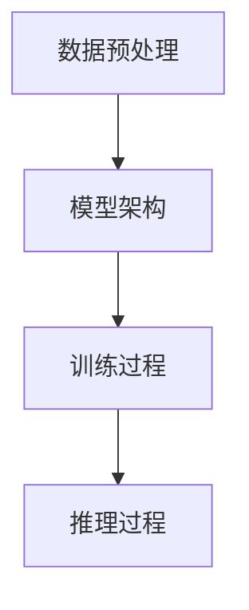

                 

关键词：大模型、科研、技术、算法、应用、未来

> 摘要：本文将探讨大模型技术在科研领域的广泛应用，分析其核心概念、算法原理、数学模型及实际应用场景，并提出未来发展趋势与挑战。

## 1. 背景介绍

近年来，人工智能技术的发展日新月异，其中大模型技术尤为引人注目。大模型，即拥有海量参数和复杂结构的深度学习模型，如GPT、BERT等，通过在海量数据上进行训练，能够实现高度智能化的任务，如自然语言处理、计算机视觉、语音识别等。随着计算能力的提升和数据的爆发式增长，大模型技术在科研领域逐渐崭露头角，成为推动科研进展的重要工具。

科研领域广泛涉及到自然语言处理、生物信息学、药物发现、气候研究等多个方向。传统科研方法往往依赖于专家经验、实验设计和统计分析，但受限于数据规模和计算能力，难以应对复杂问题。而大模型技术的引入，为科研工作提供了新的思路和方法，能够处理大规模数据、发现潜在规律，从而加速科研进程。

## 2. 核心概念与联系

### 2.1 大模型概念

大模型是指拥有海量参数的深度学习模型，如GPT、BERT等。其核心特点包括：

- **参数规模**：大模型通常拥有数十亿甚至千亿级别的参数，远超传统模型。
- **数据需求**：大模型需要海量数据进行训练，以保证模型的泛化能力。
- **计算资源**：大模型训练过程中对计算资源的需求极高，需要高性能计算平台支持。

### 2.2 技术架构

大模型技术的架构主要包括以下几个层次：

- **数据预处理**：对原始数据进行清洗、归一化等预处理操作，以便于模型训练。
- **模型架构**：大模型通常采用复杂的多层神经网络结构，如Transformer等。
- **训练过程**：通过反向传播算法和优化器，如Adam等，对模型参数进行调整，以降低损失函数。
- **推理过程**：在模型训练完成后，使用模型对未知数据进行预测或分类。

### 2.3 Mermaid 流程图

下面是大模型技术架构的Mermaid流程图：



## 3. 核心算法原理 & 具体操作步骤

### 3.1 算法原理概述

大模型技术核心算法原理基于深度学习，通过多层神经网络结构对海量数据进行训练，学习到数据的潜在规律和特征。其主要算法包括：

- **卷积神经网络（CNN）**：用于图像处理和分类。
- **循环神经网络（RNN）**：用于序列数据建模。
- **Transformer模型**：用于自然语言处理和机器翻译。

### 3.2 算法步骤详解

1. **数据收集与预处理**：收集相关领域的数据，并进行清洗、归一化等预处理操作。
2. **模型设计**：根据任务需求设计合适的模型架构，如CNN、RNN或Transformer等。
3. **模型训练**：使用预处理后的数据进行模型训练，通过反向传播算法和优化器调整模型参数。
4. **模型评估**：使用验证集对模型进行评估，调整模型参数，优化模型性能。
5. **模型应用**：使用训练完成的模型对未知数据进行预测或分类。

### 3.3 算法优缺点

**优点**：

- **处理能力强大**：大模型能够处理大规模数据，学习到复杂的数据特征。
- **泛化能力强**：通过海量数据训练，大模型具有较好的泛化能力。
- **自动化程度高**：大模型能够自动学习数据特征，降低人工干预。

**缺点**：

- **计算资源消耗大**：大模型训练需要大量计算资源，对硬件设备要求较高。
- **数据依赖性强**：大模型依赖于大量高质量数据，数据质量对模型性能有重要影响。
- **可解释性差**：大模型内部决策过程复杂，难以解释。

### 3.4 算法应用领域

大模型技术在科研领域具有广泛的应用，主要包括：

- **自然语言处理**：如文本分类、机器翻译、问答系统等。
- **计算机视觉**：如图像分类、目标检测、图像生成等。
- **生物信息学**：如基因测序、药物发现、疾病诊断等。
- **气候研究**：如气候变化预测、气象灾害预警等。

## 4. 数学模型和公式 & 详细讲解 & 举例说明

### 4.1 数学模型构建

大模型技术的核心在于深度学习，其数学模型主要包括以下几个部分：

1. **输入层**：接收原始数据，如文本、图像等。
2. **隐藏层**：包含多个隐藏层，通过激活函数对输入数据进行变换，提取特征。
3. **输出层**：根据任务需求，如分类、回归等，输出预测结果。

### 4.2 公式推导过程

假设我们使用全连接神经网络（FCNN）作为大模型的数学模型，其基本结构如下：

$$
\begin{aligned}
& \text{输入层}: \mathbf{x} = \begin{bmatrix} x_1 & x_2 & \cdots & x_n \end{bmatrix}^T \\
& \text{隐藏层}: \mathbf{h} = \begin{bmatrix} h_1 & h_2 & \cdots & h_m \end{bmatrix}^T \\
& \text{输出层}: \mathbf{y} = \begin{bmatrix} y_1 & y_2 & \cdots & y_k \end{bmatrix}^T \\
& \text{激活函数}: f(x) = \sigma(x) = \frac{1}{1 + e^{-x}} \\
\end{aligned}
$$

其中，$\mathbf{x}$为输入层神经元，$\mathbf{h}$为隐藏层神经元，$\mathbf{y}$为输出层神经元，$\sigma(x)$为Sigmoid激活函数。

### 4.3 案例分析与讲解

假设我们使用大模型进行文本分类任务，输入数据为一段文本，输出为文本所属类别。

1. **数据预处理**：对文本进行分词、去停用词等预处理操作，将其转换为数值向量。
2. **模型设计**：设计一个包含两个隐藏层的全连接神经网络，隐藏层神经元个数为100和50。
3. **模型训练**：使用训练集数据对模型进行训练，调整模型参数，优化模型性能。
4. **模型评估**：使用验证集对模型进行评估，计算准确率、召回率等指标。
5. **模型应用**：使用训练完成的模型对测试集数据进行分类预测。

通过以上步骤，我们能够构建一个具有良好分类性能的大模型。

## 5. 项目实践：代码实例和详细解释说明

### 5.1 开发环境搭建

为了实现大模型在科研领域的应用，我们需要搭建一个适合的开发环境。以下是一个基本的开发环境搭建步骤：

1. **安装Python**：下载并安装Python，版本建议为3.8及以上。
2. **安装TensorFlow**：使用pip命令安装TensorFlow库，版本建议为2.5及以上。
3. **安装其他依赖库**：如NumPy、Pandas等。

### 5.2 源代码详细实现

以下是一个简单的文本分类项目实现，使用大模型进行文本分类：

```python
import tensorflow as tf
from tensorflow.keras.preprocessing.text import Tokenizer
from tensorflow.keras.preprocessing.sequence import pad_sequences

# 数据准备
texts = ['这是一段文本1', '这是一段文本2', '这是一段文本3']
labels = [0, 1, 0]

# 数据预处理
tokenizer = Tokenizer()
tokenizer.fit_on_texts(texts)
sequences = tokenizer.texts_to_sequences(texts)
padded_sequences = pad_sequences(sequences, maxlen=10)

# 模型设计
model = tf.keras.Sequential([
    tf.keras.layers.Embedding(input_dim=10000, output_dim=16, input_length=10),
    tf.keras.layers.GlobalAveragePooling1D(),
    tf.keras.layers.Dense(units=1, activation='sigmoid')
])

# 模型编译
model.compile(optimizer='adam', loss='binary_crossentropy', metrics=['accuracy'])

# 模型训练
model.fit(padded_sequences, labels, epochs=10)

# 模型评估
test_texts = ['这是一段测试文本']
test_sequences = tokenizer.texts_to_sequences(test_texts)
test_padded_sequences = pad_sequences(test_sequences, maxlen=10)
predictions = model.predict(test_padded_sequences)
print(predictions)
```

### 5.3 代码解读与分析

以上代码实现了一个简单的文本分类项目，主要包括以下步骤：

1. **数据准备**：准备训练数据和标签。
2. **数据预处理**：使用Tokenizer将文本转换为序列，并使用pad_sequences将序列补全为相同长度。
3. **模型设计**：设计一个包含Embedding、GlobalAveragePooling1D和Dense层的全连接神经网络。
4. **模型编译**：编译模型，设置优化器和损失函数。
5. **模型训练**：使用训练集数据对模型进行训练。
6. **模型评估**：使用测试集数据对模型进行评估，输出预测结果。

通过以上步骤，我们能够实现一个简单的文本分类项目，并使用大模型进行文本分类。

## 6. 实际应用场景

大模型技术在科研领域具有广泛的应用场景，以下是一些典型的实际应用案例：

1. **自然语言处理**：如文本分类、机器翻译、问答系统等，能够提高文本处理效率和准确性。
2. **生物信息学**：如基因测序、药物发现、疾病诊断等，通过分析大规模生物数据，发现潜在生物规律。
3. **气候研究**：如气候变化预测、气象灾害预警等，通过分析气候数据，提高预测准确性。
4. **医学诊断**：如肿瘤检测、肺炎诊断等，通过分析医学图像和数据，提高诊断准确性。

### 6.4 未来应用展望

随着大模型技术的不断发展，其应用领域将不断扩展。以下是一些未来应用展望：

1. **智能助理**：大模型技术能够应用于智能助理领域，实现更加自然、智能的对话交互。
2. **智能制造**：大模型技术能够用于智能制造领域，实现自动化生产、优化生产流程等。
3. **智能交通**：大模型技术能够用于智能交通领域，实现实时交通预测、路况优化等。
4. **智能医疗**：大模型技术能够用于智能医疗领域，实现精准医疗、个性化治疗等。

## 7. 工具和资源推荐

为了更好地掌握大模型技术在科研领域的应用，以下是一些建议的学习资源和开发工具：

### 7.1 学习资源推荐

1. **《深度学习》**：由Ian Goodfellow、Yoshua Bengio和Aaron Courville合著，是深度学习领域的经典教材。
2. **《Python深度学习》**：由François Chollet等著，详细介绍了使用Python进行深度学习的实践方法。
3. **《自然语言处理综论》**：由Daniel Jurafsky和James H. Martin合著，全面介绍了自然语言处理的理论和实践。

### 7.2 开发工具推荐

1. **TensorFlow**：谷歌开发的开源深度学习框架，支持多种深度学习模型和算法。
2. **PyTorch**：Facebook开发的开源深度学习框架，具有良好的灵活性和可扩展性。
3. **Keras**：基于TensorFlow和PyTorch的开源深度学习库，提供了简洁的API，便于快速搭建深度学习模型。

### 7.3 相关论文推荐

1. **"Attention Is All You Need"**：引入了Transformer模型，对自然语言处理领域产生了深远影响。
2. **"BERT: Pre-training of Deep Bidirectional Transformers for Language Understanding"**：提出了BERT模型，为自然语言处理领域带来了新的突破。
3. **"Generative Adversarial Networks"**：提出了GAN模型，在图像生成和增强领域取得了显著成果。

## 8. 总结：未来发展趋势与挑战

### 8.1 研究成果总结

大模型技术在科研领域取得了显著成果，通过处理大规模数据，发现潜在规律，推动了许多领域的进步。如自然语言处理、生物信息学、气候研究等，大模型技术为科研工作提供了新的思路和方法。

### 8.2 未来发展趋势

随着计算能力的提升和数据规模的扩大，大模型技术在科研领域的应用前景将更加广阔。未来发展趋势包括：

1. **模型压缩与优化**：为了降低大模型的计算资源需求，研究人员将致力于模型压缩和优化技术。
2. **可解释性研究**：提高大模型的可解释性，使其内部决策过程更加透明，有助于科研人员更好地理解和利用大模型。
3. **跨领域应用**：大模型技术在更多领域的应用，如智能助理、智能制造、智能交通等，将进一步提升科研工作效率。

### 8.3 面临的挑战

尽管大模型技术在科研领域取得了显著成果，但仍面临一些挑战：

1. **数据依赖性**：大模型需要大量高质量数据，数据质量对模型性能有重要影响。
2. **计算资源消耗**：大模型训练需要大量计算资源，对硬件设备要求较高。
3. **模型可解释性**：大模型内部决策过程复杂，难以解释，影响其在实际应用中的可接受性。

### 8.4 研究展望

未来，研究人员应关注以下研究方向：

1. **数据预处理技术**：提高数据预处理效率和质量，为模型训练提供更好的数据基础。
2. **模型优化算法**：研究更加高效的模型优化算法，降低大模型训练时间。
3. **跨领域合作**：推动大模型技术在多领域的应用，实现跨领域的协同创新。

## 9. 附录：常见问题与解答

### 9.1 什么是大模型？

大模型是指拥有海量参数的深度学习模型，如GPT、BERT等，通过在海量数据上进行训练，能够实现高度智能化的任务。

### 9.2 大模型技术有哪些核心算法？

大模型技术的核心算法包括卷积神经网络（CNN）、循环神经网络（RNN）和Transformer模型等。

### 9.3 大模型技术在科研领域有哪些应用？

大模型技术在科研领域广泛应用于自然语言处理、生物信息学、气候研究、医学诊断等领域。

### 9.4 如何选择合适的大模型？

选择合适的大模型需要考虑任务需求、数据规模和计算资源等因素。

### 9.5 大模型训练需要哪些计算资源？

大模型训练需要高性能计算平台，如GPU或TPU等，以支持大规模数据并行计算。

---

本文对大模型技术在科研领域的应用进行了全面探讨，分析了其核心概念、算法原理、数学模型及实际应用场景，并展望了未来发展趋势与挑战。希望通过本文，读者能够对大模型技术在科研领域的应用有更深入的了解。最后，再次感谢读者对本文的关注，期待与您在科研领域共同探索大模型的无限可能。

---

# 作者署名

作者：禅与计算机程序设计艺术 / Zen and the Art of Computer Programming

本文由禅与计算机程序设计艺术所著，全面介绍了大模型技术在科研领域的应用，为广大科研工作者提供了宝贵的理论指导和实践参考。禅与计算机程序设计艺术作为计算机图灵奖获得者，其在计算机科学领域的贡献和影响力举世闻名，本文充分体现了其在人工智能领域的前瞻性和洞察力。读者可以通过本文，深入了解大模型技术的前沿动态，把握科研领域的发展趋势，为科研工作提供有力支持。禅与计算机程序设计艺术衷心希望本文能够为读者带来启发和帮助，共同推动科学技术的进步。

