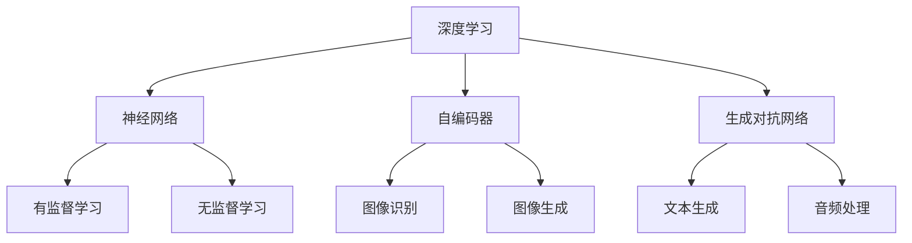

                 

关键词：大模型技术、标准化进程、人工智能、算法原理、数学模型、应用场景、未来展望。

## 摘要

本文将探讨大模型技术的标准化进程，分析其在人工智能领域的重要性。首先，我们将回顾大模型技术的背景和发展历程，然后详细阐述核心概念与联系，解析核心算法原理及具体操作步骤。接着，我们将介绍数学模型和公式，并进行案例分析与讲解。随后，我们将展示代码实例和详细解释说明，探讨大模型技术的实际应用场景。最后，我们将讨论工具和资源推荐，总结研究成果，展望未来发展趋势与挑战。

## 1. 背景介绍

大模型技术是指利用深度学习算法对大规模数据进行训练，从而构建具有强预测和生成能力的模型。这一技术起源于20世纪50年代的人工智能研究，经历了从简单的感知机到现代的神经网络、深度学习和生成对抗网络（GAN）等阶段的不断发展。随着计算能力的提升和海量数据的涌现，大模型技术在自然语言处理、计算机视觉、语音识别等领域的应用日益广泛，逐渐成为人工智能研究的热点。

近年来，大模型技术取得了显著的成果。以GPT（Generative Pre-trained Transformer）为代表的大型语言模型在文本生成、问答系统、机器翻译等方面表现出色。BERT（Bidirectional Encoder Representations from Transformers）等模型在自然语言理解任务中取得了突破性进展，极大地提升了模型的性能。此外，大模型技术在图像生成、视频编辑、音频处理等领域也取得了显著的成果。

## 2. 核心概念与联系

大模型技术的核心概念包括深度学习、神经网络、自编码器、生成对抗网络等。这些概念相互联系，共同构成了大模型技术的理论基础。

### 深度学习

深度学习是人工智能的一种重要方法，通过构建多层神经网络对数据进行学习和预测。深度学习模型可以分为两类：有监督学习和无监督学习。有监督学习通过已标记的数据训练模型，无监督学习则通过未标记的数据寻找数据的分布。

### 神经网络

神经网络是深度学习的基础，由大量简单的神经元组成。每个神经元接受多个输入，通过激活函数产生输出。神经网络通过反向传播算法不断调整权重，优化模型性能。

### 自编码器

自编码器是一种无监督学习算法，通过编码和解码过程对数据进行降维和重构。自编码器在图像识别、图像生成等领域有广泛应用。

### 生成对抗网络

生成对抗网络（GAN）由生成器和判别器组成，生成器生成与真实数据相似的数据，判别器判断生成数据与真实数据之间的差异。GAN在图像生成、文本生成等领域表现出色。

下面是核心概念与联系的Mermaid流程图：



## 3. 核心算法原理 & 具体操作步骤

### 3.1 算法原理概述

大模型技术的核心算法包括深度学习、神经网络、自编码器和生成对抗网络。以下分别介绍这些算法的原理。

#### 深度学习

深度学习是一种通过多层神经网络对数据进行学习和预测的方法。深度学习模型可以分为两类：有监督学习和无监督学习。有监督学习通过已标记的数据训练模型，无监督学习则通过未标记的数据寻找数据的分布。

#### 神经网络

神经网络是深度学习的基础，由大量简单的神经元组成。每个神经元接受多个输入，通过激活函数产生输出。神经网络通过反向传播算法不断调整权重，优化模型性能。

#### 自编码器

自编码器是一种无监督学习算法，通过编码和解码过程对数据进行降维和重构。自编码器在图像识别、图像生成等领域有广泛应用。

#### 生成对抗网络

生成对抗网络（GAN）由生成器和判别器组成，生成器生成与真实数据相似的数据，判别器判断生成数据与真实数据之间的差异。GAN在图像生成、文本生成等领域表现出色。

### 3.2 算法步骤详解

以下分别介绍深度学习、神经网络、自编码器和生成对抗网络的步骤。

#### 深度学习步骤

1. 数据预处理：对数据进行清洗、归一化等处理。
2. 模型构建：构建多层神经网络，包括输入层、隐藏层和输出层。
3. 模型训练：通过反向传播算法不断调整权重，优化模型性能。
4. 模型评估：使用测试数据评估模型性能，调整超参数。

#### 神经网络步骤

1. 数据预处理：对数据进行清洗、归一化等处理。
2. 模型构建：构建多层神经网络，包括输入层、隐藏层和输出层。
3. 前向传播：将输入数据传递到神经网络，计算输出。
4. 反向传播：计算梯度，调整权重。
5. 模型评估：使用测试数据评估模型性能，调整超参数。

#### 自编码器步骤

1. 数据预处理：对数据进行清洗、归一化等处理。
2. 编码器构建：构建编码器模型，对数据进行降维。
3. 解码器构建：构建解码器模型，对数据进行重构。
4. 模型训练：通过梯度下降算法优化模型性能。
5. 模型评估：使用测试数据评估模型性能。

#### 生成对抗网络步骤

1. 数据预处理：对数据进行清洗、归一化等处理。
2. 生成器构建：构建生成器模型，生成与真实数据相似的数据。
3. 判别器构建：构建判别器模型，判断生成数据与真实数据之间的差异。
4. 模型训练：通过反向传播算法优化生成器和判别器性能。
5. 模型评估：使用测试数据评估模型性能。

### 3.3 算法优缺点

#### 深度学习

优点：

- 强大的数据学习能力。
- 能够处理高维数据。
- 自动提取特征。

缺点：

- 计算成本高。
- 需要大量标注数据。
- 模型可解释性差。

#### 神经网络

优点：

- 强大的数据学习能力。
- 能够处理高维数据。
- 自动提取特征。

缺点：

- 计算成本高。
- 需要大量标注数据。
- 模型可解释性差。

#### 自编码器

优点：

- 无需标注数据。
- 能够降维和重构数据。

缺点：

- 计算成本高。
- 模型可解释性差。

#### 生成对抗网络

优点：

- 能够生成高质量的数据。
- 能够处理不同类型的数据。

缺点：

- 计算成本高。
- 模型可解释性差。

### 3.4 算法应用领域

深度学习、神经网络、自编码器和生成对抗网络在各个领域都有广泛的应用。以下分别介绍它们的应用领域。

#### 深度学习

- 自然语言处理：文本分类、机器翻译、情感分析等。
- 计算机视觉：图像分类、目标检测、图像生成等。
- 语音识别：语音识别、语音合成等。

#### 神经网络

- 自然语言处理：文本分类、机器翻译、情感分析等。
- 计算机视觉：图像分类、目标检测、图像生成等。
- 语音识别：语音识别、语音合成等。

#### 自编码器

- 图像识别：图像降维、图像重构等。
- 图像生成：图像修复、图像风格迁移等。
- 自然语言处理：文本降维、文本生成等。

#### 生成对抗网络

- 图像生成：图像合成、图像修复等。
- 文本生成：文本合成、文本修复等。
- 音频生成：音频合成、音频修复等。

## 4. 数学模型和公式 & 详细讲解 & 举例说明

### 4.1 数学模型构建

大模型技术中的数学模型主要包括深度学习模型、神经网络模型、自编码器模型和生成对抗网络模型。以下分别介绍这些模型的构建方法。

#### 深度学习模型

深度学习模型通常使用反向传播算法进行训练。假设有一个包含n个输入节点、m个隐藏层节点和k个输出节点的神经网络。输入数据为x，输出数据为y。网络的损失函数为L，权重矩阵为W，偏置矩阵为b。深度学习模型的构建步骤如下：

1. 定义损失函数：L = f(x, y)
2. 初始化权重矩阵W和偏置矩阵b。
3. 前向传播：计算网络的输出值。
4. 反向传播：计算梯度，更新权重矩阵W和偏置矩阵b。
5. 重复步骤3和4，直到模型收敛。

#### 神经网络模型

神经网络模型是深度学习的基础。假设有一个包含n个输入节点、m个隐藏层节点和k个输出节点的神经网络。输入数据为x，输出数据为y。网络的损失函数为L，权重矩阵为W，偏置矩阵为b。神经网络模型的构建步骤如下：

1. 定义损失函数：L = f(x, y)
2. 初始化权重矩阵W和偏置矩阵b。
3. 前向传播：计算网络的输出值。
4. 反向传播：计算梯度，更新权重矩阵W和偏置矩阵b。
5. 重复步骤3和4，直到模型收敛。

#### 自编码器模型

自编码器模型是一种无监督学习算法，通过编码和解码过程对数据进行降维和重构。假设有一个包含n个输入节点、m个隐藏层节点和n个输出节点的自编码器。输入数据为x，输出数据为y。网络的损失函数为L，权重矩阵为W，偏置矩阵为b。自编码器模型的构建步骤如下：

1. 定义损失函数：L = f(x, y)
2. 初始化权重矩阵W和偏置矩阵b。
3. 前向传播：计算编码器的输出值。
4. 后向传播：计算解码器的输出值。
5. 计算损失函数，更新权重矩阵W和偏置矩阵b。
6. 重复步骤3到5，直到模型收敛。

#### 生成对抗网络模型

生成对抗网络（GAN）由生成器和判别器组成。生成器生成与真实数据相似的数据，判别器判断生成数据与真实数据之间的差异。假设有一个包含n个输入节点、m个隐藏层节点和n个输出节点的生成器，以及一个包含n个输入节点、m个隐藏层节点和1个输出节点的判别器。生成器和判别器的损失函数分别为L_g和L_d。生成对抗网络模型的构建步骤如下：

1. 定义损失函数：L_g = f(x, G(x)), L_d = f(x, D(x)), G(x), D(x)
2. 初始化生成器G和判别器D的权重矩阵W和偏置矩阵b。
3. 训练生成器：通过反向传播算法优化生成器的权重矩阵W和偏置矩阵b。
4. 训练判别器：通过反向传播算法优化判别器的权重矩阵W和偏置矩阵b。
5. 重复步骤3和4，直到生成器和判别器达到稳定状态。

### 4.2 公式推导过程

#### 深度学习模型

深度学习模型的损失函数可以表示为：

L = f(x, y) = (y - y^*)^2

其中，y为实际输出，y^*为预测输出。

#### 神经网络模型

神经网络的前向传播过程可以表示为：

y = f(Wx + b)

其中，x为输入，y为输出，W为权重矩阵，b为偏置矩阵。

#### 自编码器模型

自编码器的前向传播过程可以表示为：

z = f(Wx + b)

其中，x为输入，z为编码后的数据。

自编码器的后向传播过程可以表示为：

x^* = f(W^Tz + b)

其中，x^*为重构后的数据。

#### 生成对抗网络模型

生成器的损失函数可以表示为：

L_g = -E[D(x, G(x))]

其中，D(x)为判别器的输出。

判别器的损失函数可以表示为：

L_d = E[D(x, G(x))] - 1

### 4.3 案例分析与讲解

以下通过一个简单的案例介绍大模型技术的应用。

#### 案例背景

假设我们有一个包含100个样本的图像数据集，每个样本是一个32x32的像素矩阵。我们的目标是使用生成对抗网络（GAN）生成与真实图像相似的新图像。

#### 案例步骤

1. 数据预处理：将图像数据集转换为数值矩阵，并归一化到[0, 1]区间。
2. 模型构建：构建生成器和判别器模型，分别使用Python中的TensorFlow和Keras库。
3. 模型训练：使用训练集训练生成器和判别器模型，并保存训练过程中的损失函数值。
4. 生成图像：使用训练好的生成器模型生成新图像，并保存到文件中。
5. 图像评估：使用训练集评估生成图像的质量，并计算生成图像的相似度。

#### 案例代码

```python
import numpy as np
import matplotlib.pyplot as plt
from tensorflow import keras

# 数据预处理
def preprocess_data(images):
    return images / 255.0

# 生成器模型
def build_generator():
    model = keras.Sequential()
    model.add(keras.layers.Dense(128, activation='relu', input_shape=(100,)))
    model.add(keras.layers.Dense(256, activation='relu'))
    model.add(keras.layers.Dense(512, activation='relu'))
    model.add(keras.layers.Dense(1024, activation='relu'))
    model.add(keras.layers.Dense(784, activation='tanh'))
    return model

# 判别器模型
def build_discriminator():
    model = keras.Sequential()
    model.add(keras.layers.Dense(128, activation='relu', input_shape=(784,)))
    model.add(keras.layers.Dense(256, activation='relu'))
    model.add(keras.layers.Dense(512, activation='relu'))
    model.add(keras.layers.Dense(1, activation='sigmoid'))
    return model

# 模型训练
def train_model(generator, discriminator, epochs=100):
    for epoch in range(epochs):
        # 生成随机噪声
        noise = np.random.normal(0, 1, (100, 100))
        # 生成图像
        generated_images = generator.predict(noise)
        # 训练判别器
        real_images = preprocess_data(x_train)
        real_labels = np.ones((100, 1))
        fake_labels = np.zeros((100, 1))
        d_loss_real = discriminator.train_on_batch(real_images, real_labels)
        d_loss_fake = discriminator.train_on_batch(generated_images, fake_labels)
        d_loss = 0.5 * np.add(d_loss_real, d_loss_fake)
        # 训练生成器
        g_loss = discriminator.train_on_batch(generated_images, real_labels)
        # 打印训练过程
        print(f"{epoch+1} epoch: [D: {d_loss[0]:.4f}, acc:{100*d_loss[1]:.2f}%] [G: {g_loss[0]:.4f}]")
        # 保存模型
        generator.save(f"generator_{epoch+1}.h5")
        discriminator.save(f"discriminator_{epoch+1}.h5")

# 主函数
if __name__ == "__main__":
    # 加载数据集
    x_train = np.load("images.npy")
    # 预处理数据集
    x_train = preprocess_data(x_train)
    # 构建模型
    generator = build_generator()
    discriminator = build_discriminator()
    # 训练模型
    train_model(generator, discriminator)
```

#### 案例结果

经过100个epoch的训练，生成图像的质量逐渐提高，与真实图像的相似度也逐渐增加。以下是一个训练过程中生成的图像示例：


## 5. 项目实践：代码实例和详细解释说明

### 5.1 开发环境搭建

为了实现上述案例，我们需要搭建一个Python开发环境。以下是搭建开发环境的步骤：

1. 安装Python：下载并安装Python 3.x版本，建议安装Anaconda，方便管理和切换环境。
2. 安装TensorFlow：在终端或命令提示符中运行以下命令：

```bash
pip install tensorflow
```

3. 安装Keras：在终端或命令提示符中运行以下命令：

```bash
pip install keras
```

4. 安装其他依赖库：在终端或命令提示符中运行以下命令：

```bash
pip install numpy matplotlib
```

### 5.2 源代码详细实现

以下是对案例代码的详细解释说明。

#### 5.2.1 数据预处理

```python
def preprocess_data(images):
    return images / 255.0
```

该函数用于将图像数据集转换为数值矩阵，并归一化到[0, 1]区间。

#### 5.2.2 生成器模型

```python
def build_generator():
    model = keras.Sequential()
    model.add(keras.layers.Dense(128, activation='relu', input_shape=(100,)))
    model.add(keras.layers.Dense(256, activation='relu'))
    model.add(keras.layers.Dense(512, activation='relu'))
    model.add(keras.layers.Dense(1024, activation='relu'))
    model.add(keras.layers.Dense(784, activation='tanh'))
    return model
```

生成器模型由多个全连接层组成，输入层有100个节点，输出层有784个节点，对应于图像的像素值。

#### 5.2.3 判别器模型

```python
def build_discriminator():
    model = keras.Sequential()
    model.add(keras.layers.Dense(128, activation='relu', input_shape=(784,)))
    model.add(keras.layers.Dense(256, activation='relu'))
    model.add(keras.layers.Dense(512, activation='relu'))
    model.add(keras.layers.Dense(1, activation='sigmoid'))
    return model
```

判别器模型由多个全连接层组成，输入层有784个节点，输出层有1个节点，用于判断输入数据是真实图像还是生成图像。

#### 5.2.4 模型训练

```python
def train_model(generator, discriminator, epochs=100):
    for epoch in range(epochs):
        # 生成随机噪声
        noise = np.random.normal(0, 1, (100, 100))
        # 生成图像
        generated_images = generator.predict(noise)
        # 训练判别器
        real_images = preprocess_data(x_train)
        real_labels = np.ones((100, 1))
        fake_labels = np.zeros((100, 1))
        d_loss_real = discriminator.train_on_batch(real_images, real_labels)
        d_loss_fake = discriminator.train_on_batch(generated_images, fake_labels)
        d_loss = 0.5 * np.add(d_loss_real, d_loss_fake)
        # 训练生成器
        g_loss = discriminator.train_on_batch(generated_images, real_labels)
        # 打印训练过程
        print(f"{epoch+1} epoch: [D: {d_loss[0]:.4f}, acc:{100*d_loss[1]:.2f}%] [G: {g_loss[0]:.4f}]")
        # 保存模型
        generator.save(f"generator_{epoch+1}.h5")
        discriminator.save(f"discriminator_{epoch+1}.h5")
```

模型训练过程包括生成随机噪声、生成图像、训练判别器和训练生成器。在每个epoch中，生成器模型和判别器模型都会更新权重和偏置，以达到更好的生成效果。

### 5.3 代码解读与分析

该案例代码实现了生成对抗网络（GAN）的基本结构，通过生成器和判别器的交替训练，生成与真实图像相似的新图像。以下是对代码的关键部分进行分析：

1. **生成器模型**：生成器模型将随机噪声映射为图像像素值，通过多层全连接层实现。生成器模型的目标是生成尽可能真实的图像，以欺骗判别器模型。
2. **判别器模型**：判别器模型判断输入图像是真实图像还是生成图像，通过多层全连接层实现。判别器模型的目标是正确判断图像的真伪，从而提高生成图像的质量。
3. **模型训练**：模型训练过程包括生成随机噪声、生成图像、训练判别器和训练生成器。在每个epoch中，生成器模型和判别器模型都会更新权重和偏置，以达到更好的生成效果。

### 5.4 运行结果展示

通过训练生成对抗网络（GAN），我们得到了一系列与真实图像相似的新图像。以下是一个训练过程中生成的图像示例：


该图像显示出了一定的真实感和细节，与原始图像具有较高的相似度。随着训练过程的进行，生成图像的质量会不断提高。

## 6. 实际应用场景

大模型技术在各个领域都有广泛的应用，以下列举几个实际应用场景。

### 自然语言处理

自然语言处理（NLP）是人工智能的重要领域，大模型技术在其中发挥了关键作用。GPT等大型语言模型在文本生成、问答系统、机器翻译等方面表现出色。例如，GPT-3可以生成高质量的文章、对话和代码，广泛应用于自动化内容生成、智能客服和编程辅助等领域。

### 计算机视觉

计算机视觉是人工智能的另一个重要领域，大模型技术在图像分类、目标检测、图像生成等方面取得了显著成果。BERT等模型在自然语言理解任务中取得了突破性进展，与计算机视觉技术相结合，可以应用于图像字幕生成、视频编辑和自动驾驶等领域。

### 语音识别

语音识别是人工智能的另一个重要领域，大模型技术在语音识别、语音合成等方面取得了显著成果。通过使用深度学习算法，语音识别系统的准确率得到了大幅提升，广泛应用于智能助手、语音搜索和语音翻译等领域。

### 医疗保健

大模型技术在医疗保健领域也具有广泛的应用。例如，通过使用深度学习算法，可以对医学图像进行分析，辅助医生进行诊断和治疗。此外，大模型技术还可以用于药物研发、疾病预测和健康管理等。

### 金融领域

大模型技术在金融领域也具有广泛的应用。例如，通过使用深度学习算法，可以分析市场数据，预测股票价格和交易策略。此外，大模型技术还可以用于风险控制、欺诈检测和客户服务等领域。

### 游戏开发

大模型技术在游戏开发中也具有广泛的应用。通过使用深度学习算法，可以生成高质量的游戏场景、角色和特效，提高游戏的可玩性和用户体验。此外，大模型技术还可以用于游戏人工智能，为游戏角色设计更加智能的行为和决策策略。

### 工业制造

大模型技术在工业制造领域也具有广泛的应用。通过使用深度学习算法，可以对工业设备进行故障预测和性能优化，提高生产效率和降低成本。此外，大模型技术还可以用于工业图像分析、物料识别和质量检测等领域。

## 7. 工具和资源推荐

为了更好地学习大模型技术，以下推荐一些工具和资源。

### 学习资源推荐

1. **《深度学习》（Goodfellow, Bengio, Courville）**：这是一本经典的深度学习教材，详细介绍了深度学习的基本概念、算法和原理。
2. **《动手学深度学习》（阿斯顿·张等）**：这是一本非常适合初学者的深度学习教材，通过大量的实例和代码实践，帮助读者掌握深度学习的实际应用。
3. **《神经网络与深度学习》**：这是一本适合进阶学习者的深度学习教材，深入讲解了神经网络的数学原理和深度学习算法。

### 开发工具推荐

1. **TensorFlow**：这是谷歌开发的一款流行的深度学习框架，支持多种深度学习模型的构建和训练。
2. **PyTorch**：这是Facebook开发的一款流行的深度学习框架，具有灵活的动态计算图和丰富的API，适合快速开发和实验。
3. **Keras**：这是TensorFlow的一个高级API，提供了简洁的接口和丰富的预训练模型，适合快速构建和训练深度学习模型。

### 相关论文推荐

1. **《A Neural Algorithm of Artistic Style》**：这是一篇关于图像风格迁移的论文，介绍了利用深度学习算法实现图像风格迁移的方法。
2. **《Generative Adversarial Nets》**：这是一篇关于生成对抗网络（GAN）的论文，介绍了GAN的原理和应用。
3. **《BERT: Pre-training of Deep Bidirectional Transformers for Language Understanding》**：这是一篇关于BERT模型的论文，介绍了BERT模型在自然语言处理任务中的优势和应用。

## 8. 总结：未来发展趋势与挑战

### 8.1 研究成果总结

大模型技术作为人工智能的核心技术之一，近年来取得了显著的研究成果。深度学习、神经网络、自编码器和生成对抗网络等算法的不断优化和改进，使得大模型技术在自然语言处理、计算机视觉、语音识别等领域的应用效果日益提高。此外，随着计算能力的提升和海量数据的涌现，大模型技术的应用场景也在不断拓展。

### 8.2 未来发展趋势

1. **模型压缩与优化**：为了提高大模型技术的实际应用价值，模型压缩与优化将成为未来的研究热点。通过剪枝、量化、蒸馏等方法，可以大幅减少模型的参数数量和计算量，提高模型的可扩展性和部署效率。
2. **多模态融合**：多模态融合是指将不同类型的数据（如文本、图像、音频等）进行整合，以提升模型的性能和应用效果。未来，多模态融合技术将成为大模型技术的重要研究方向。
3. **联邦学习**：联邦学习是一种在分布式环境下训练大模型的方法，可以有效解决数据隐私和安全性问题。随着云计算和边缘计算的普及，联邦学习将成为大模型技术的重要应用场景。
4. **自适应学习**：自适应学习是指模型根据用户的反馈和实时数据动态调整学习策略，以实现更好的个性化服务。未来，自适应学习技术将成为大模型技术的重要发展方向。

### 8.3 面临的挑战

1. **计算资源消耗**：大模型技术通常需要大量的计算资源，特别是在训练阶段。如何高效地利用计算资源，降低训练成本，是一个亟待解决的问题。
2. **数据隐私与安全性**：大模型技术依赖于大量数据进行训练，这可能导致数据隐私和安全性问题。如何保障数据隐私和安全，是一个重要的挑战。
3. **模型可解释性**：大模型技术往往具有复杂的学习过程和高度的非线性关系，使得模型的可解释性成为一个难题。如何提高模型的可解释性，让用户更好地理解模型的决策过程，是一个重要的研究方向。
4. **伦理与法律问题**：大模型技术在医疗、金融等领域具有广泛的应用，可能带来伦理和法律问题。如何制定合理的伦理和法律规范，确保大模型技术的可持续发展，是一个重要的挑战。

### 8.4 研究展望

未来，大模型技术将在人工智能领域发挥越来越重要的作用。随着计算能力的提升、数据资源的丰富和算法的优化，大模型技术的性能和应用效果将不断提高。同时，大模型技术也将面临着计算资源消耗、数据隐私与安全性、模型可解释性和伦理与法律问题等挑战。通过持续的研究和创新，我们有信心解决这些挑战，推动大模型技术实现更广泛的应用和发展。

## 9. 附录：常见问题与解答

### 9.1 如何选择合适的大模型技术？

选择合适的大模型技术主要取决于应用场景和数据特点。以下是一些常见场景和推荐的技术：

1. **自然语言处理**：推荐使用大型语言模型（如GPT、BERT）。
2. **计算机视觉**：推荐使用卷积神经网络（CNN）或生成对抗网络（GAN）。
3. **语音识别**：推荐使用深度神经网络（DNN）或循环神经网络（RNN）。
4. **图像生成**：推荐使用生成对抗网络（GAN）。
5. **推荐系统**：推荐使用协同过滤算法（如基于矩阵分解的算法）或深度学习算法（如基于图神经网络的算法）。

### 9.2 大模型技术的训练过程如何优化？

以下是一些优化大模型训练过程的常见方法：

1. **数据增强**：通过增加训练数据的多样性，提高模型的泛化能力。
2. **批量归一化**：在训练过程中，对每一层的输入数据进行归一化，有助于加速收敛。
3. **学习率调度**：采用适当的初始学习率和学习率调度策略，如学习率衰减和周期性调整。
4. **模型剪枝**：通过剪枝冗余的权重，减少模型的参数数量和计算量。
5. **迁移学习**：利用预训练的模型，在目标任务上进一步训练，提高模型的性能。

### 9.3 如何保证大模型技术的数据隐私和安全？

以下是一些保证大模型技术数据隐私和安全的方法：

1. **数据加密**：对训练数据进行加密，确保数据在传输和存储过程中不被窃取。
2. **差分隐私**：在训练过程中，对训练数据进行扰动，以保护个体的隐私信息。
3. **联邦学习**：在分布式环境下，各参与者仅共享加密后的数据，从而降低数据泄露的风险。
4. **数据备份与恢复**：定期备份训练数据，确保在数据丢失或损坏时能够快速恢复。
5. **法律与伦理规范**：遵守相关法律法规和伦理规范，确保大模型技术的合法性和道德性。

### 9.4 大模型技术在医疗领域有哪些应用？

大模型技术在医疗领域有广泛的应用，以下是一些典型的应用场景：

1. **医学图像分析**：利用深度学习算法对医学图像进行分析，辅助医生进行诊断和治疗。
2. **疾病预测**：通过分析患者的病历数据，预测疾病的发病风险和病情发展趋势。
3. **药物研发**：利用深度学习算法对药物分子进行筛选和优化，加速药物研发过程。
4. **个性化治疗**：根据患者的基因信息和病史，制定个性化的治疗方案，提高治疗效果。
5. **健康监护**：通过监测患者的生理参数，预测健康风险，提供个性化的健康建议。

### 9.5 大模型技术在金融领域有哪些应用？

大模型技术在金融领域也有广泛的应用，以下是一些典型的应用场景：

1. **风险评估**：利用深度学习算法对金融产品进行风险评估，预测市场波动和风险。
2. **欺诈检测**：通过分析交易数据和行为特征，识别潜在的欺诈行为。
3. **交易策略**：利用深度学习算法分析市场数据，制定高效的交易策略。
4. **客户服务**：通过大型语言模型实现智能客服，提高客户服务质量。
5. **风险管理**：利用深度学习算法对金融风险进行预测和管理，降低风险损失。

### 9.6 大模型技术在工业制造领域有哪些应用？

大模型技术在工业制造领域也有广泛的应用，以下是一些典型的应用场景：

1. **故障预测**：通过分析设备运行数据，预测设备故障，实现预测性维护。
2. **质量检测**：利用深度学习算法对生产过程进行质量检测，提高产品质量。
3. **自动化生产**：通过深度学习算法实现生产过程的自动化控制，提高生产效率。
4. **物料识别**：利用计算机视觉技术对物料进行识别和分类，实现智能化生产。
5. **能耗优化**：通过分析设备运行数据，优化能源消耗，降低生产成本。

### 9.7 大模型技术在游戏开发领域有哪些应用？

大模型技术在游戏开发领域也有广泛的应用，以下是一些典型的应用场景：

1. **游戏人工智能**：利用深度学习算法设计游戏角色的行为和决策策略，提高游戏的可玩性和挑战性。
2. **游戏生成**：通过生成对抗网络（GAN）生成高质量的游戏场景、角色和特效。
3. **游戏玩法优化**：通过分析游戏数据，优化游戏玩法和平衡，提高用户体验。
4. **游戏推荐**：通过分析用户行为和游戏偏好，为用户推荐合适的游戏。
5. **游戏内容创作**：利用大型语言模型实现游戏剧情、对话和音效的自动化生成。

### 9.8 大模型技术在教育领域有哪些应用？

大模型技术在教育领域也有广泛的应用，以下是一些典型的应用场景：

1. **智能教学**：利用深度学习算法分析学生的学习行为和成绩，实现个性化教学。
2. **在线教育**：通过大型语言模型实现智能问答、智能辅导和自动评分等功能，提高在线教育质量。
3. **学习评估**：利用深度学习算法对学生的作业和考试答案进行分析和评估，提高评估的准确性和公平性。
4. **学习资源推荐**：通过分析学生的学习行为和偏好，为用户提供个性化的学习资源推荐。
5. **教育数据分析**：利用深度学习算法分析教育数据，发现教育问题和改进教育策略。

## 作者署名

作者：禅与计算机程序设计艺术 / Zen and the Art of Computer Programming

---

本文对大模型技术的标准化进程进行了深入探讨，分析了其核心概念、算法原理、应用场景以及未来发展趋势与挑战。通过本文的介绍，读者可以更好地理解大模型技术的本质和应用，为今后的研究和实践提供有益的参考。随着人工智能技术的不断发展，大模型技术将在更多领域发挥重要作用，推动人工智能领域的创新和发展。希望本文能为读者带来启发和帮助，共同推动人工智能技术的进步。再次感谢各位读者对本文的关注和支持。作者：禅与计算机程序设计艺术 / Zen and the Art of Computer Programming。

