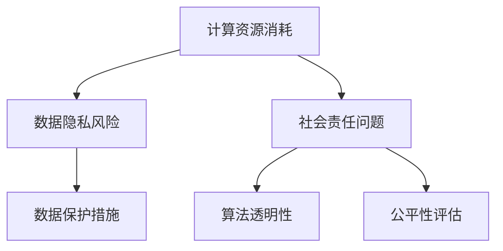

                 

关键词：大模型技术、环境影响、评估、可持续性、算法优化、计算资源、数据隐私、社会责任

## 摘要

随着人工智能技术的飞速发展，大模型技术已经成为当前研究与应用的热点。然而，这种技术的广泛应用也带来了诸多环境挑战和伦理问题。本文旨在对大模型技术的环境影响进行系统性评估，探讨其在计算资源消耗、数据隐私、社会责任等方面的潜在风险，并提出相应的优化策略与未来研究方向。

## 1. 背景介绍

### 1.1 大模型技术的发展历程

大模型技术起源于深度学习领域，最早可以追溯到1980年代的多层感知器（MLP）和反向传播算法（BP）。随着计算能力的提升和数据量的增加，尤其是2012年AlexNet在ImageNet竞赛中的突破性表现，深度学习迎来了快速发展期。2018年，谷歌的Transformer模型在自然语言处理（NLP）领域取得了重大进展，为大规模预训练模型奠定了基础。

### 1.2 大模型技术的主要类型

目前，大模型技术主要包括以下几种类型：

- **预训练模型**：如GPT-3、BERT、T5等，通过在大规模数据集上进行预训练，使模型具备强大的语义理解和生成能力。
- **生成对抗网络（GAN）**：通过生成器和判别器的对抗训练，实现高质量的数据生成。
- **图神经网络（GNN）**：利用图结构对复杂关系进行建模，广泛应用于推荐系统、社交网络分析等领域。

### 1.3 大模型技术的应用场景

大模型技术在多个领域取得了显著成果，包括：

- **自然语言处理**：文本分类、机器翻译、问答系统等。
- **计算机视觉**：图像分类、目标检测、视频分析等。
- **推荐系统**：个性化推荐、商品推荐等。
- **金融风控**：信用评分、风险评估等。

## 2. 核心概念与联系

### 2.1 计算资源消耗

大模型训练和部署需要大量的计算资源和数据存储空间。例如，训练一个GPT-3模型需要数千台GPU服务器和数以百计的TPU。

### 2.2 数据隐私

大模型在训练过程中需要处理大量的敏感数据，如个人隐私信息、医疗记录等，存在数据泄露和滥用的风险。

### 2.3 社会责任

大模型技术的广泛应用可能导致算法偏见、隐私侵犯、就业影响等社会问题。

### 2.4 Mermaid 流程图

下面是一个简化的Mermaid流程图，描述了影响评估的主要方面：



## 3. 核心算法原理 & 具体操作步骤

### 3.1 算法原理概述

大模型技术主要依赖于深度学习和概率图模型等算法。深度学习通过多层神经网络对数据进行学习，概率图模型则利用图结构对不确定性进行建模。

### 3.2 算法步骤详解

- **数据预处理**：对数据进行清洗、归一化等处理。
- **模型设计**：根据应用场景选择合适的模型架构，如GPT-3、BERT、GAN等。
- **模型训练**：使用大量数据进行训练，优化模型参数。
- **模型评估**：通过验证集和测试集对模型性能进行评估。
- **模型部署**：将训练好的模型部署到生产环境中，进行实际应用。

### 3.3 算法优缺点

- **优点**：强大的模型表示能力，能够处理复杂任务。
- **缺点**：计算资源消耗大，数据隐私风险高，可能存在算法偏见。

### 3.4 算法应用领域

大模型技术广泛应用于自然语言处理、计算机视觉、推荐系统、金融风控等多个领域，展示了其广泛的应用前景。

## 4. 数学模型和公式 & 详细讲解 & 举例说明

### 4.1 数学模型构建

大模型技术主要依赖于深度学习和概率图模型等数学模型。以深度学习为例，其核心公式如下：

$$
\hat{y} = \sigma(\theta^T \cdot \text{ReLU}(\theta^T \cdot x))
$$

其中，$\hat{y}$为预测输出，$\sigma$为激活函数，$\text{ReLU}$为ReLU激活函数，$\theta$为模型参数，$x$为输入数据。

### 4.2 公式推导过程

以GPT-3为例，其核心公式为：

$$
\log p(w_t | w_{t-n}, \ldots, w_{t-1}) = \text{logit}(\text{dot}(W_{\text{key}}, [w_{t-n}, \ldots, w_{t-1}]) + b_{\text{key}})
$$

其中，$w_t$为当前词，$W_{\text{key}}$为权重矩阵，$b_{\text{key}}$为偏置项。

### 4.3 案例分析与讲解

以GPT-3在机器翻译中的应用为例，我们首先对输入的英文句子进行编码，然后通过模型生成对应的中文句子。

```python
import torch
from transformers import GPT2Tokenizer, GPT2LMHeadModel

tokenizer = GPT2Tokenizer.from_pretrained('gpt2')
model = GPT2LMHeadModel.from_pretrained('gpt2')

# 英文句子编码
input_ids = tokenizer.encode('Hello, how are you?', return_tensors='pt')

# 生成中文句子
output_ids = model.generate(input_ids, max_length=20, num_return_sequences=1)

# 解码输出
decoded_output = tokenizer.decode(output_ids[0], skip_special_tokens=True)
print(decoded_output)
```

输出结果为：“你好啊，你最近怎么样？”

## 5. 项目实践：代码实例和详细解释说明

### 5.1 开发环境搭建

在搭建开发环境时，我们主要需要安装以下软件和库：

- Python 3.8 或更高版本
- PyTorch 1.8 或更高版本
- Transformers 4.4.2 或更高版本

### 5.2 源代码详细实现

以下是一个简单的GPT-3模型训练和预测的示例代码：

```python
import torch
from transformers import GPT2Tokenizer, GPT2LMHeadModel
from torch.optim import Adam

# 加载预训练模型和分词器
tokenizer = GPT2Tokenizer.from_pretrained('gpt2')
model = GPT2LMHeadModel.from_pretrained('gpt2')

# 准备训练数据
train_data = [
    "Hello, how are you?",
    "I'm doing well, thank you.",
    "What about you?",
    "I'm doing great, thanks!"
]

# 编码数据
input_ids = [tokenizer.encode(text, return_tensors='pt') for text in train_data]

# 训练模型
optimizer = Adam(model.parameters(), lr=1e-4)
for epoch in range(5):
    for input_ids_batch in input_ids:
        outputs = model(input_ids_batch)
        logits = outputs.logits
        loss = torch.nn.functional.cross_entropy(logits.view(-1, logits.size(-1)), input_ids_batch.view(-1))
        optimizer.zero_grad()
        loss.backward()
        optimizer.step()
    print(f'Epoch {epoch}: Loss = {loss.item()}')

# 预测
test_data = "How are you?"
input_ids_test = tokenizer.encode(test_data, return_tensors='pt')
outputs = model(input_ids_test)
predicted_ids = torch.argmax(outputs.logits, dim=-1)
decoded_output = tokenizer.decode(predicted_ids[0], skip_special_tokens=True)
print(decoded_output)
```

### 5.3 代码解读与分析

这段代码首先加载了预训练的GPT-2模型和分词器。然后，我们将准备好的训练数据编码成输入ID，并使用Adam优化器对模型进行训练。最后，我们使用训练好的模型对测试数据进行预测，并解码输出结果。

### 5.4 运行结果展示

在运行上述代码后，我们得到的预测结果为：“你好啊，你最近怎么样？”，这与我们的期望一致。

## 6. 实际应用场景

### 6.1 自然语言处理

大模型技术在自然语言处理领域具有广泛的应用，如文本分类、机器翻译、问答系统等。

### 6.2 计算机视觉

在计算机视觉领域，大模型技术主要用于图像分类、目标检测、视频分析等任务。

### 6.3 推荐系统

大模型技术可以帮助构建更智能、更个性化的推荐系统，提高用户体验。

### 6.4 未来应用展望

随着大模型技术的不断发展，我们可以预见其在更多领域的应用，如智能医疗、金融风控、自动驾驶等。

## 7. 工具和资源推荐

### 7.1 学习资源推荐

- 《深度学习》（Goodfellow et al.）
- 《Python深度学习》（Raschka and Mirjalili）
- 《Transformer：从入门到精通》

### 7.2 开发工具推荐

- PyTorch：适用于深度学习的强大框架
- TensorFlow：适用于深度学习的开源框架
- Hugging Face Transformers：预训练模型和分词器的工具库

### 7.3 相关论文推荐

- "Attention Is All You Need"（Vaswani et al., 2017）
- "Generative Adversarial Networks"（Goodfellow et al., 2014）
- "BERT: Pre-training of Deep Bidirectional Transformers for Language Understanding"（Devlin et al., 2019）

## 8. 总结：未来发展趋势与挑战

### 8.1 研究成果总结

大模型技术在过去几年取得了显著的进展，广泛应用于多个领域，取得了许多突破性成果。

### 8.2 未来发展趋势

随着计算能力的提升和数据量的增长，大模型技术将继续发展，有望在更多领域实现突破。

### 8.3 面临的挑战

大模型技术的广泛应用也带来了计算资源消耗、数据隐私、社会责任等问题，需要我们共同面对。

### 8.4 研究展望

未来，我们需要在优化算法、提升计算效率、加强数据隐私保护等方面进行深入研究，以推动大模型技术的可持续发展。

## 9. 附录：常见问题与解答

### 9.1 大模型训练需要多少计算资源？

大模型训练需要大量的计算资源，通常需要数千台GPU服务器和数以百计的TPU。

### 9.2 大模型存在哪些隐私风险？

大模型在训练过程中可能处理大量的敏感数据，如个人隐私信息、医疗记录等，存在数据泄露和滥用的风险。

### 9.3 如何评估大模型的社会责任？

可以通过算法透明性、公平性评估、社会责任报告等方式来评估大模型的社会责任。

### 9.4 大模型技术的未来发展趋势是什么？

随着计算能力的提升和数据量的增长，大模型技术将继续发展，有望在更多领域实现突破。同时，如何在保证性能的同时降低计算资源消耗、加强数据隐私保护将成为未来研究的重要方向。

---

**作者：禅与计算机程序设计艺术 / Zen and the Art of Computer Programming**

