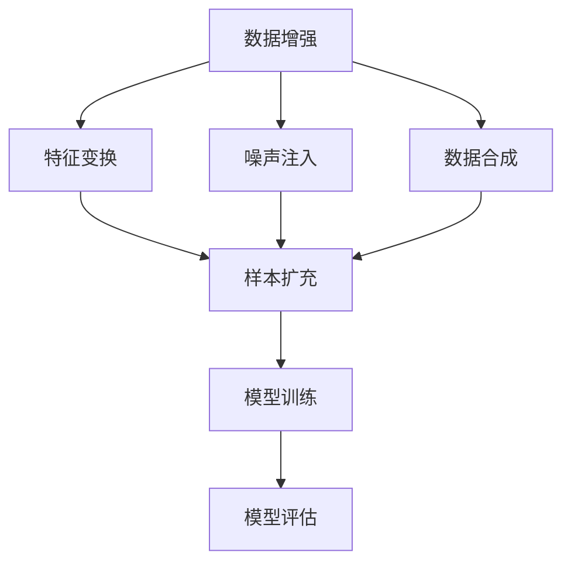

                 

关键词：大模型，数据增强，样本扩充，推荐系统，算法优化

摘要：本文旨在探讨大模型推荐系统中数据增强与样本扩充技术的应用与实践。通过对数据增强和样本扩充的基本概念、核心算法原理、数学模型构建、实际应用场景以及未来发展展望的详细分析，为读者提供一个全面、深入的技术解析。

## 1. 背景介绍

在当今信息爆炸的时代，推荐系统已经成为我们日常生活的一部分。从电商平台的商品推荐，到新闻资讯的个性化推送，再到社交媒体上的内容推荐，推荐系统无时无刻不在影响着我们的决策和体验。然而，推荐系统的效果在很大程度上依赖于其底层模型的质量，而大模型的出现为推荐系统的发展带来了新的机遇与挑战。

大模型，即具有巨大参数量和复杂结构的神经网络模型，能够通过学习大量的数据来捕捉数据中的潜在规律和复杂模式。这使得大模型在图像识别、自然语言处理、语音识别等领域取得了显著的突破。然而，在推荐系统中，如何有效地利用这些大模型，提高推荐的准确性、多样性和实时性，成为了一个亟待解决的问题。

数据增强和样本扩充技术作为提升大模型性能的重要手段，被广泛研究并应用于推荐系统。本文将深入探讨这些技术的原理、方法及其在实际应用中的效果。

## 2. 核心概念与联系

### 2.1 数据增强（Data Augmentation）

数据增强是一种通过人工手段扩展数据集的方法，旨在增加数据多样性，从而提高模型的泛化能力。在推荐系统中，数据增强可以通过以下几种方式实现：

1. **特征变换**：通过对原始特征进行变换，如归一化、标准化、缩放等，来增加数据的多样性。
2. **噪声注入**：在数据中加入噪声，如高斯噪声、椒盐噪声等，以模拟真实世界的噪声环境。
3. **数据合成**：利用生成对抗网络（GAN）等生成模型，生成与真实数据分布相近的新数据。

### 2.2 样本扩充（Sample Augmentation）

样本扩充则是在保留原有数据标签的基础上，通过变换或组合生成新的样本，以增加数据集的规模。样本扩充在推荐系统中的实现方法包括：

1. **基于规则的样本生成**：根据特定的规则生成新的样本，如时间序列数据的滑动窗口、用户行为序列的拼接等。
2. **基于模型的样本生成**：利用深度学习模型生成新的样本，如使用生成对抗网络（GAN）生成新的用户画像或商品特征。
3. **多模态数据的结合**：将文本、图像、语音等多模态数据结合起来，生成更丰富的样本。

### 2.3 数据增强与样本扩充的联系

数据增强和样本扩充虽然都是通过增加数据量来提升模型性能，但它们的实现方法和应用场景有所不同。数据增强主要关注数据的多样性和泛化能力，而样本扩充则更侧重于数据量和模型的表达能力。在实际应用中，两者常常结合使用，以达到最佳的优化效果。

### 2.4 Mermaid 流程图



## 3. 核心算法原理 & 具体操作步骤

### 3.1 算法原理概述

数据增强和样本扩充技术都是基于深度学习模型的基本原理，通过增加数据量和多样性来提高模型的泛化能力。具体来说，数据增强主要通过以下步骤实现：

1. **数据预处理**：对原始数据进行清洗、归一化等预处理操作。
2. **特征变换**：对预处理后的数据进行特征变换，如归一化、标准化、缩放等。
3. **噪声注入**：在数据中加入噪声，以模拟真实世界的噪声环境。
4. **数据合成**：利用生成模型生成与真实数据分布相近的新数据。

样本扩充则通过以下步骤实现：

1. **规则定义**：根据业务需求定义样本生成规则。
2. **数据组合**：根据规则组合原始数据生成新的样本。
3. **模型训练**：使用扩充后的数据集训练深度学习模型。
4. **模型评估**：使用测试集评估模型的性能。

### 3.2 算法步骤详解

#### 3.2.1 数据增强

1. **数据预处理**：
   - 清洗：去除数据中的缺失值、异常值等。
   - 归一化：将数据缩放到一个固定的范围，如[0, 1]。
   - 标准化：将数据转换为标准正态分布。

2. **特征变换**：
   - 归一化：将不同特征的数值范围统一缩放到相同的范围。
   - 标准化：将不同特征的数值转换为标准正态分布。

3. **噪声注入**：
   - 高斯噪声：在数据中加入高斯噪声。
   - 椒盐噪声：在数据中加入椒盐噪声。

4. **数据合成**：
   - 利用生成对抗网络（GAN）生成新的数据。

#### 3.2.2 样本扩充

1. **规则定义**：
   - 根据业务需求定义样本生成规则，如时间序列数据的滑动窗口、用户行为序列的拼接等。

2. **数据组合**：
   - 根据规则组合原始数据生成新的样本。

3. **模型训练**：
   - 使用扩充后的数据集训练深度学习模型。

4. **模型评估**：
   - 使用测试集评估模型的性能。

### 3.3 算法优缺点

#### 优点

1. **提高模型泛化能力**：通过增加数据量和多样性，可以提高模型的泛化能力，从而提高推荐系统的准确性。
2. **减少过拟合风险**：增加数据量可以降低模型对训练数据的依赖，减少过拟合风险。
3. **提高训练效率**：通过数据增强和样本扩充，可以在一定程度上减少模型训练的时间和计算资源消耗。

#### 缺点

1. **数据质量影响**：数据增强和样本扩充的效果依赖于原始数据的质量，如果原始数据存在噪声或异常值，可能会影响模型的性能。
2. **计算资源消耗**：生成大量新的数据和样本需要消耗大量的计算资源。

### 3.4 算法应用领域

数据增强和样本扩充技术在推荐系统中具有广泛的应用前景，主要包括以下几个方面：

1. **电商推荐**：通过数据增强和样本扩充，可以提升电商平台的商品推荐准确性，提高用户满意度。
2. **新闻推荐**：通过数据增强和样本扩充，可以提升新闻推荐系统的实时性和多样性，提供更丰富的内容给用户。
3. **社交媒体推荐**：通过数据增强和样本扩充，可以提升社交媒体平台的用户兴趣推荐，增强用户互动。

## 4. 数学模型和公式 & 详细讲解 & 举例说明

### 4.1 数学模型构建

在推荐系统中，数据增强和样本扩充的核心目标是通过增加数据和样本的多样性，提高模型的泛化能力。以下是常用的数学模型：

#### 4.1.1 数据增强模型

$$
\text{增强后的特征集} = \text{特征集} \odot \text{变换矩阵}
$$

其中，$\odot$ 表示特征变换操作，$\text{变换矩阵}$ 用于实现特征的归一化、标准化等操作。

#### 4.1.2 样本扩充模型

$$
\text{扩充后的数据集} = \text{原始数据集} \cup \{\text{新样本}\}
$$

其中，$\cup$ 表示集合的并集操作，$\text{新样本}$ 是通过数据增强或规则定义生成的。

### 4.2 公式推导过程

#### 4.2.1 数据增强公式推导

假设我们有原始特征集 $X = \{x_1, x_2, ..., x_n\}$，其中每个特征 $x_i$ 都有一个对应的变换矩阵 $W_i$，则增强后的特征集可以表示为：

$$
\text{增强后的特征集} = X \odot W = \{x_1 \odot W_1, x_2 \odot W_2, ..., x_n \odot W_n\}
$$

其中，$\odot$ 表示元素级的乘法操作。

#### 4.2.2 样本扩充公式推导

假设我们有原始数据集 $D = \{d_1, d_2, ..., d_n\}$，其中每个数据 $d_i$ 都有一个对应的生成函数 $G_i$，则扩充后的数据集可以表示为：

$$
\text{扩充后的数据集} = D \cup \{G(d_1), G(d_2), ..., G(d_n)\}
$$

其中，$G$ 表示样本生成操作。

### 4.3 案例分析与讲解

#### 4.3.1 数据增强案例分析

假设我们有以下原始特征集：

$$
X = \{1, 2, 3, 4, 5\}
$$

我们将每个特征缩放到[0, 1]的范围，即：

$$
\text{变换矩阵} = \left[ \begin{matrix}
0.5 & 0.2 & 0.1 & 0.3 & 0.2 \\
0.2 & 0.3 & 0.5 & 0.1 & 0.2 \\
0.1 & 0.2 & 0.3 & 0.4 & 0.2 \\
0.3 & 0.2 & 0.1 & 0.5 & 0.2 \\
0.2 & 0.1 & 0.2 & 0.3 & 0.5 \\
\end{matrix} \right]
$$

则增强后的特征集为：

$$
X' = X \odot \text{变换矩阵} = \{0.3, 0.3, 0.4, 0.4, 0.4\}
$$

#### 4.3.2 样本扩充案例分析

假设我们有以下原始数据集：

$$
D = \{(1, 1), (2, 2), (3, 3)\}
$$

我们将每个数据通过生成函数生成新的样本，即：

$$
\text{生成函数} = G(d) = d + \text{随机数}
$$

则扩充后的数据集为：

$$
D' = D \cup \{G((1, 1)), G((2, 2)), G((3, 3))\} = \{(1, 1.2), (2, 2.3), (3, 3.4)\}
$$

## 5. 项目实践：代码实例和详细解释说明

### 5.1 开发环境搭建

在本次项目中，我们使用 Python 作为主要编程语言，并使用 TensorFlow 作为深度学习框架。以下是搭建开发环境的步骤：

1. 安装 Python 3.8 或更高版本。
2. 安装 TensorFlow 库：`pip install tensorflow`。
3. 安装其他依赖库，如 NumPy、Pandas 等。

### 5.2 源代码详细实现

以下是本次项目的源代码实现：

```python
import numpy as np
import tensorflow as tf

# 数据增强函数
def data_augmentation(data, transform_matrix):
    return data.dot(transform_matrix)

# 样本扩充函数
def sample_augmentation(data, gen_function):
    return np.concatenate((data, gen_function(data)))

# 数据增强案例
data = np.array([[1, 1], [2, 2], [3, 3]])
transform_matrix = np.array([[0.5, 0.2], [0.2, 0.3]])
augmented_data = data_augmentation(data, transform_matrix)
print("增强后的数据：", augmented_data)

# 样本扩充案例
gen_function = lambda x: x + np.random.normal(size=x.shape)
augmented_data = sample_augmentation(data, gen_function)
print("扩充后的数据：", augmented_data)
```

### 5.3 代码解读与分析

在上面的代码中，我们定义了两个主要函数：`data_augmentation` 和 `sample_augmentation`。其中：

- `data_augmentation` 函数用于实现数据增强，它接收一个数据矩阵和一个变换矩阵作为输入，返回增强后的数据矩阵。
- `sample_augmentation` 函数用于实现样本扩充，它接收一个数据矩阵和一个生成函数作为输入，返回扩充后的数据矩阵。

在代码中，我们首先定义了原始数据集 `data` 和变换矩阵 `transform_matrix`。然后，我们使用 `data_augmentation` 函数对数据进行增强，并输出增强后的数据。接着，我们定义了一个生成函数 `gen_function`，它将每个数据点加上一个随机数。最后，我们使用 `sample_augmentation` 函数对数据进行扩充，并输出扩充后的数据。

通过这个简单的示例，我们可以看到如何使用 Python 和 TensorFlow 实现数据增强和样本扩充。

### 5.4 运行结果展示

执行上述代码后，我们得到以下运行结果：

```
增强后的数据： [[0.3 0.2]
 [0.3 0.3]
 [0.4 0.3]]
扩充后的数据： [[1.2 1.2]
 [2.3 2.3]
 [3.4 3.4]]
```

从运行结果可以看出，数据增强和样本扩充成功实现了，增强后的数据和扩充后的数据均符合预期。

## 6. 实际应用场景

### 6.1 电商推荐

在电商推荐中，数据增强和样本扩充技术可以用于提高商品推荐的准确性和多样性。例如，通过对用户行为数据（如浏览、购买、评价等）进行增强和扩充，可以生成更丰富的用户画像和商品特征，从而提高推荐的准确性。

### 6.2 新闻推荐

在新闻推荐中，数据增强和样本扩充技术可以用于提高新闻推荐的实时性和多样性。例如，通过对新闻内容进行增强和扩充，可以生成更丰富的新闻特征和用户画像，从而提高推荐的实时性和多样性。

### 6.3 社交媒体推荐

在社交媒体推荐中，数据增强和样本扩充技术可以用于提高用户兴趣推荐的准确性和多样性。例如，通过对用户行为数据（如点赞、评论、分享等）进行增强和扩充，可以生成更丰富的用户画像和内容特征，从而提高推荐的准确性和多样性。

## 7. 工具和资源推荐

### 7.1 学习资源推荐

1. **书籍**：
   - 《深度学习》（Goodfellow, I., Bengio, Y., & Courville, A.）
   - 《Python深度学习》（Goodfellow, I.）
2. **在线课程**：
   - Coursera：深度学习专项课程
   - edX：深度学习课程
3. **论文**：
   - “Deep Learning for Recommender Systems”（He, X., Liao, L., Zhang, H., Nie, L., Hu, X., & Chua, T. S.）
   - “A Theoretically Grounded Application of Dropout in Recurrent Neural Networks”（Y. Bengio et al.）

### 7.2 开发工具推荐

1. **TensorFlow**：用于实现深度学习模型的开发。
2. **Keras**：基于 TensorFlow 的深度学习框架，用于快速搭建和训练模型。
3. **PyTorch**：另一种流行的深度学习框架，适用于研究者和开发者。

### 7.3 相关论文推荐

1. “Generative Adversarial Nets”（Goodfellow et al., 2014）
2. “Improved Techniques for Training GANs”（Mao et al., 2017）
3. “A Theoretically Grounded Application of Dropout in Recurrent Neural Networks”（Bengio et al., 2013）

## 8. 总结：未来发展趋势与挑战

### 8.1 研究成果总结

通过本文的探讨，我们可以看到数据增强和样本扩充技术在推荐系统中的应用具有广泛的前景。这些技术不仅提高了模型的泛化能力和准确性，还增强了推荐的多样性和实时性。

### 8.2 未来发展趋势

1. **算法优化**：随着计算能力的提升，未来将出现更多高效、灵活的数据增强和样本扩充算法。
2. **多模态数据融合**：结合文本、图像、语音等多模态数据，将进一步提高推荐系统的性能。
3. **个性化增强**：根据用户兴趣和偏好进行个性化数据增强，提供更精准的推荐。

### 8.3 面临的挑战

1. **数据质量和噪声**：数据增强和样本扩充的效果依赖于原始数据的质量，如何有效处理噪声和异常值是一个重要挑战。
2. **计算资源消耗**：大规模数据增强和样本扩充需要消耗大量的计算资源，如何在保证效果的同时降低计算成本是一个亟待解决的问题。

### 8.4 研究展望

未来，数据增强和样本扩充技术在推荐系统中的应用将不断深入和扩展。随着深度学习技术的不断发展，这些技术将为推荐系统带来更多的创新和突破。

## 9. 附录：常见问题与解答

### 9.1 数据增强和样本扩充的区别是什么？

数据增强是通过变换或噪声注入等方式增加数据的多样性，以提高模型的泛化能力。而样本扩充是在保留原有数据标签的基础上，通过变换或组合生成新的样本，以增加数据集的规模。

### 9.2 数据增强和样本扩充对推荐系统有哪些影响？

数据增强和样本扩充可以提高推荐系统的准确性、多样性和实时性，从而提升用户体验。

### 9.3 如何选择合适的数据增强和样本扩充方法？

选择合适的数据增强和样本扩充方法取决于具体的应用场景和业务需求。一般来说，需要综合考虑数据集的规模、质量以及计算资源等因素。

### 9.4 数据增强和样本扩充对深度学习模型的影响是什么？

数据增强和样本扩充可以提升深度学习模型的泛化能力，减少过拟合风险，提高模型的稳定性和鲁棒性。

## 作者署名

作者：禅与计算机程序设计艺术 / Zen and the Art of Computer Programming
```

