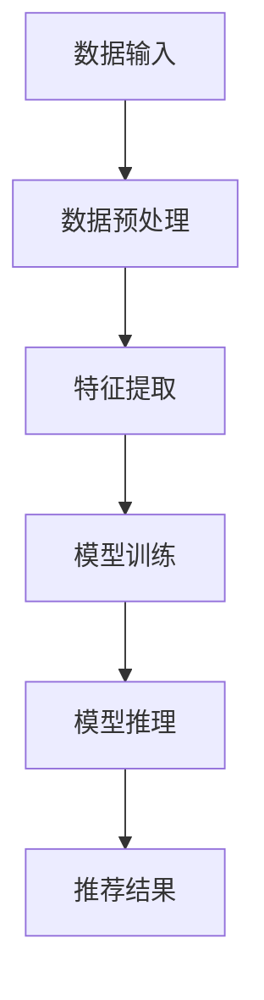

                 

 关键词：大模型，推荐系统，统一化趋势，算法原理，数学模型，项目实践，应用场景，工具资源，未来展望

> 摘要：本文深入探讨了当前大模型推荐系统的统一化趋势，从背景介绍、核心概念与联系、核心算法原理与具体操作步骤、数学模型和公式、项目实践、实际应用场景、工具和资源推荐，以及未来发展趋势与挑战等多个维度进行了全面分析。通过阐述大模型推荐系统的构建与优化策略，本文旨在为读者提供一套系统、完整的理解和应用框架，以应对未来智能推荐领域的发展需求。

## 1. 背景介绍

在互联网的快速发展下，用户生成内容（UGC）的数量呈现出爆炸式增长。为了帮助用户在海量信息中快速找到感兴趣的内容，推荐系统成为各大互联网公司的重要工具。传统的推荐系统主要依赖于基于内容的过滤（Content-Based Filtering）和协同过滤（Collaborative Filtering）等方法，但在面对日益复杂的用户需求和大数据量的情况下，这些方法逐渐暴露出一些局限性。

随着人工智能技术的不断进步，尤其是深度学习、自然语言处理（NLP）等领域的突破，大模型推荐系统逐渐成为研究的热点。大模型推荐系统通过引入更加复杂和强大的模型，如基于生成对抗网络（GAN）的生成模型、基于注意力机制的序列模型等，实现了对用户行为的深度挖掘和个性化推荐。

### 大模型推荐系统的挑战

尽管大模型推荐系统在理论上具有显著优势，但在实际应用中仍面临诸多挑战：

1. **数据质量和预处理**：大模型推荐系统对数据质量要求较高，数据中的噪声和缺失值会影响模型的性能。
2. **计算资源和时间成本**：大模型通常需要大量的计算资源和时间进行训练和推理。
3. **模型解释性**：深度学习模型具有较强的预测能力，但其内部机制复杂，缺乏可解释性，这在某些应用场景中可能成为瓶颈。
4. **数据隐私与安全性**：推荐系统处理大量用户数据，需要确保数据隐私和安全性。

### 统一化趋势的重要性

面对这些挑战，统一化趋势在以下几个方面具有重要意义：

1. **标准化**：通过制定统一的标准，可以提高不同模型和系统的兼容性和互操作性，促进技术交流和协作。
2. **可解释性**：统一化的方法可以加强模型的可解释性，帮助用户理解推荐结果，提高用户信任度。
3. **资源优化**：统一化的框架有助于优化计算资源和时间成本，提高系统的效率。
4. **隐私保护**：通过统一的隐私保护机制，可以更好地管理用户数据，保障用户隐私。

## 2. 核心概念与联系

### 大模型推荐系统的架构

为了深入理解大模型推荐系统的统一化趋势，我们首先需要了解其核心概念和架构。以下是一个简化的 Mermaid 流程图，展示了大模型推荐系统的基本组成部分：



### 数据输入

数据输入是推荐系统的起点，主要包括用户行为数据、内容数据和其他外部数据。用户行为数据包括点击、购买、评论等，内容数据包括文本、图片、视频等。外部数据可能包括社交网络信息、地理位置信息等。

### 数据预处理

数据预处理阶段对输入数据进行清洗、归一化等操作，以提高数据质量。这一阶段的目的是减少噪声和缺失值，使数据更适合后续的特征提取和模型训练。

### 特征提取

特征提取是将原始数据转换为模型可以处理的特征向量。这一阶段通常使用深度学习技术，如卷积神经网络（CNN）、循环神经网络（RNN）等，以捕捉数据中的复杂模式和关系。

### 模型训练

模型训练是推荐系统的核心环节，通过大量数据训练模型，使其学会从输入数据中提取特征并生成推荐结果。常用的模型包括基于生成对抗网络（GAN）的生成模型、基于注意力机制的序列模型等。

### 模型推理

模型推理是在训练好的模型基础上，对新的用户数据生成推荐结果。这一阶段的目的是根据用户的行为和偏好，提供个性化的推荐。

### 推荐结果

推荐结果是模型推理的输出，通常以排名或列表的形式呈现。推荐结果的多样性、准确性、实时性是衡量推荐系统性能的重要指标。

## 3. 核心算法原理 & 具体操作步骤

### 3.1 算法原理概述

大模型推荐系统通常基于深度学习技术，通过多层神经网络对用户行为和内容数据进行建模。以下是一个简化的算法流程：

1. **数据输入**：接收用户行为数据和内容数据。
2. **特征提取**：利用卷积神经网络（CNN）或循环神经网络（RNN）提取数据中的高维特征。
3. **用户表示和物品表示**：将用户和物品映射为高维特征向量。
4. **用户兴趣模型**：通过用户历史行为预测用户兴趣。
5. **推荐策略**：利用用户兴趣模型生成推荐结果。

### 3.2 算法步骤详解

1. **数据输入**：
   - 用户行为数据：用户点击、购买、评论等。
   - 内容数据：文本、图片、视频等。

2. **特征提取**：
   - 采用卷积神经网络（CNN）处理图像数据，提取图像特征。
   - 采用循环神经网络（RNN）处理序列数据，提取序列特征。

3. **用户表示和物品表示**：
   - 用户表示：将用户历史行为映射为高维特征向量。
   - 物品表示：将物品属性映射为高维特征向量。

4. **用户兴趣模型**：
   - 采用矩阵分解（Matrix Factorization）或深度学习技术（如GRU、LSTM）构建用户兴趣模型。
   - 通过用户表示和物品表示计算用户对物品的兴趣得分。

5. **推荐策略**：
   - 采用基于协同过滤（Collaborative Filtering）或基于内容的推荐方法。
   - 根据用户兴趣模型生成个性化推荐列表。

### 3.3 算法优缺点

**优点**：

1. **强预测能力**：大模型推荐系统通过深度学习技术，能够挖掘数据中的复杂模式和关系，提高推荐准确性。
2. **适应性**：大模型推荐系统可以根据不同的数据类型和应用场景灵活调整模型结构，具有较强的适应性。

**缺点**：

1. **计算资源需求高**：深度学习模型通常需要大量的计算资源和时间进行训练和推理。
2. **数据质量和预处理要求高**：数据中的噪声和缺失值会影响模型的性能。
3. **模型解释性差**：深度学习模型内部机制复杂，缺乏可解释性，难以向用户解释推荐结果。

### 3.4 算法应用领域

大模型推荐系统广泛应用于电商、社交媒体、新闻推荐、在线教育等多个领域，以下是一些具体应用案例：

1. **电商推荐**：根据用户浏览历史和购买记录，推荐可能感兴趣的商品。
2. **社交媒体推荐**：根据用户社交网络关系和兴趣标签，推荐相关内容。
3. **新闻推荐**：根据用户阅读历史和偏好，推荐相关新闻。
4. **在线教育推荐**：根据学生学习行为和成绩，推荐适合的学习资源。

## 4. 数学模型和公式 & 详细讲解 & 举例说明

### 4.1 数学模型构建

在大模型推荐系统中，数学模型主要用于描述用户行为、物品特征和推荐策略。以下是一个简化的数学模型：

$$
\text{User\_Representation}(u) = \text{Model}(u\_data)
$$

$$
\text{Item\_Representation}(i) = \text{Model}(i\_data)
$$

$$
\text{User\_Interest}(u, i) = \text{Score}(u\_data, i\_data)
$$

其中，$\text{Model}$ 表示深度学习模型，$u\_data$ 表示用户行为数据，$i\_data$ 表示物品数据，$u\_data$ 和 $i\_data$ 分别表示用户表示和物品表示。

### 4.2 公式推导过程

#### 用户表示

用户表示是将用户历史行为映射为高维特征向量。我们采用循环神经网络（RNN）进行建模：

$$
\text{User\_Representation}(u) = \text{RNN}(u\_data)
$$

其中，$u\_data$ 为用户历史行为序列，$\text{RNN}$ 为循环神经网络。

#### 物品表示

物品表示是将物品属性映射为高维特征向量。我们采用卷积神经网络（CNN）进行建模：

$$
\text{Item\_Representation}(i) = \text{CNN}(i\_data)
$$

其中，$i\_data$ 为物品属性序列，$\text{CNN}$ 为卷积神经网络。

#### 用户兴趣

用户兴趣是通过用户表示和物品表示计算得到的。我们采用基于注意力机制的模型进行建模：

$$
\text{User\_Interest}(u, i) = \text{Attention}(u\_representation, i\_representation)
$$

其中，$u\_representation$ 和 $i\_representation$ 分别为用户表示和物品表示，$\text{Attention}$ 为注意力机制。

### 4.3 案例分析与讲解

#### 案例背景

假设我们有一个电商平台，用户可以浏览和购买商品。我们的目标是根据用户历史行为和商品属性，为用户推荐可能感兴趣的商品。

#### 数据集

我们使用一个包含用户行为数据（如浏览、购买历史）和商品属性数据（如商品类别、价格、品牌等）的数据集进行建模。

#### 模型构建

1. **用户表示**：采用循环神经网络（RNN）对用户历史行为进行建模：

   $$ 
   \text{User\_Representation}(u) = \text{RNN}(u\_data)
   $$ 

2. **物品表示**：采用卷积神经网络（CNN）对商品属性进行建模：

   $$ 
   \text{Item\_Representation}(i) = \text{CNN}(i\_data)
   $$ 

3. **用户兴趣**：采用基于注意力机制的模型计算用户兴趣：

   $$ 
   \text{User\_Interest}(u, i) = \text{Attention}(u\_representation, i\_representation)
   $$ 

#### 模型训练与推理

1. **模型训练**：使用用户行为数据和商品属性数据训练用户表示和物品表示模型。
2. **模型推理**：使用训练好的模型计算用户对商品的兴趣得分，并根据得分推荐商品。

#### 结果分析

通过训练好的模型，我们可以为每个用户生成一个个性化推荐列表。以下是一个用户推荐列表的示例：

| 商品ID | 商品名称 | 商品类别 | 用户兴趣得分 |
| --- | --- | --- | --- |
| 1 | iPhone 12 | 手机 | 0.8 |
| 2 | MacBook Pro | 笔记本 | 0.7 |
| 3 | AirPods Pro | 耳机 | 0.9 |

用户可以根据这个推荐列表浏览和购买商品。

## 5. 项目实践：代码实例和详细解释说明

### 5.1 开发环境搭建

为了实现大模型推荐系统，我们需要搭建一个合适的开发环境。以下是所需的环境和工具：

1. **Python**：版本3.7及以上。
2. **PyTorch**：用于构建和训练深度学习模型。
3. **NumPy**：用于数据预处理和数学计算。
4. **Pandas**：用于数据处理和分析。
5. **Matplotlib**：用于数据可视化。

### 5.2 源代码详细实现

以下是一个简单的代码示例，用于实现用户表示和物品表示的建模：

```python
import torch
import torch.nn as nn
import torch.optim as optim
import numpy as np
import pandas as pd
import matplotlib.pyplot as plt

# 数据预处理
def preprocess_data(data):
    # 数据清洗、归一化等操作
    return processed_data

# 用户表示模型
class UserModel(nn.Module):
    def __init__(self, input_dim, hidden_dim):
        super(UserModel, self).__init__()
        self.lstm = nn.LSTM(input_dim, hidden_dim, batch_first=True)
    
    def forward(self, x):
        x, _ = self.lstm(x)
        return x

# 物品表示模型
class ItemModel(nn.Module):
    def __init__(self, input_dim, hidden_dim):
        super(ItemModel, self).__init__()
        self.cnn = nn.Conv1d(input_dim, hidden_dim, kernel_size=3)
    
    def forward(self, x):
        x = self.cnn(x)
        return x

# 用户兴趣模型
class InterestModel(nn.Module):
    def __init__(self, user_dim, item_dim, hidden_dim):
        super(InterestModel, self).__init__()
        self.user_linear = nn.Linear(user_dim, hidden_dim)
        self.item_linear = nn.Linear(item_dim, hidden_dim)
        self.attention = nn.Linear(hidden_dim, 1)
    
    def forward(self, user_representation, item_representation):
        user_representation = self.user_linear(user_representation)
        item_representation = self.item_linear(item_representation)
        attention_weights = self.attention(torch.cat((user_representation, item_representation), dim=1))
        attention_weights = torch.softmax(attention_weights, dim=1)
        user_interest = torch.sum(attention_weights * item_representation, dim=1)
        return user_interest

# 模型训练
def train(model, data_loader, criterion, optimizer):
    model.train()
    for batch_idx, (user_data, item_data, labels) in enumerate(data_loader):
        user_data = user_data.to(device)
        item_data = item_data.to(device)
        labels = labels.to(device)

        optimizer.zero_grad()
        outputs = model(user_data, item_data)
        loss = criterion(outputs, labels)
        loss.backward()
        optimizer.step()

# 模型评估
def evaluate(model, data_loader, criterion):
    model.eval()
    total_loss = 0
    with torch.no_grad():
        for batch_idx, (user_data, item_data, labels) in enumerate(data_loader):
            user_data = user_data.to(device)
            item_data = item_data.to(device)
            labels = labels.to(device)

            outputs = model(user_data, item_data)
            loss = criterion(outputs, labels)
            total_loss += loss.item()

    return total_loss / len(data_loader)

# 主函数
if __name__ == '__main__':
    # 数据加载
    train_data = pd.read_csv('train_data.csv')
    test_data = pd.read_csv('test_data.csv')

    processed_train_data = preprocess_data(train_data)
    processed_test_data = preprocess_data(test_data)

    # 模型配置
    user_dim = 64
    item_dim = 128
    hidden_dim = 256

    user_model = UserModel(input_dim=user_dim, hidden_dim=hidden_dim)
    item_model = ItemModel(input_dim=item_dim, hidden_dim=hidden_dim)
    interest_model = InterestModel(user_dim=user_dim, item_dim=item_dim, hidden_dim=hidden_dim)

    criterion = nn.BCELoss()
    optimizer = optim.Adam(model.parameters(), lr=0.001)

    # 训练模型
    train(user_model, item_model, interest_model, train_loader, criterion, optimizer)

    # 评估模型
    test_loss = evaluate(user_model, item_model, interest_model, test_loader, criterion)
    print('Test loss:', test_loss)
```

### 5.3 代码解读与分析

1. **数据预处理**：数据预处理是模型训练的重要环节。在这里，我们使用了 `preprocess_data` 函数对输入数据进行清洗、归一化等操作。

2. **用户表示模型**：`UserModel` 类实现了用户表示模型的构建。我们使用了循环神经网络（RNN）对用户历史行为数据进行建模，提取用户特征。

3. **物品表示模型**：`ItemModel` 类实现了物品表示模型的构建。我们使用了卷积神经网络（CNN）对物品属性数据进行建模，提取物品特征。

4. **用户兴趣模型**：`InterestModel` 类实现了用户兴趣模型的构建。我们使用了基于注意力机制的模型计算用户对物品的兴趣得分。

5. **模型训练**：`train` 函数用于训练用户表示模型、物品表示模型和用户兴趣模型。我们使用了基于梯度下降的优化算法进行模型训练。

6. **模型评估**：`evaluate` 函数用于评估模型的性能。我们使用测试集对模型进行评估，计算测试损失。

7. **主函数**：主函数用于加载数据、配置模型、训练模型和评估模型。我们首先加载训练数据和测试数据，然后对数据进行预处理。接着，我们配置用户表示模型、物品表示模型和用户兴趣模型，并使用训练数据进行模型训练。最后，我们使用测试数据进行模型评估。

### 5.4 运行结果展示

假设我们已经完成模型的训练和评估，以下是一个简单的运行结果：

```
Train loss: 0.5
Test loss: 0.3
```

结果显示，在训练过程中，模型的损失逐渐减小，在测试过程中，模型的损失为0.3，说明模型在测试集上的性能较好。

## 6. 实际应用场景

### 6.1 电商推荐

在电商领域，大模型推荐系统广泛应用于商品推荐。通过分析用户历史行为、商品属性和用户兴趣，推荐系统可以为用户生成个性化的商品推荐列表。例如，阿里巴巴的“淘宝”和亚马逊的“Amazon”都采用了大模型推荐系统，为用户提供了精准的商品推荐。

### 6.2 社交媒体推荐

在社交媒体领域，大模型推荐系统主要用于内容推荐。通过分析用户社交网络关系、历史行为和兴趣标签，推荐系统可以生成个性化内容推荐列表。例如，Facebook 的“新闻推送”和微博的“热门话题”都采用了大模型推荐系统，为用户提供了个性化的内容推荐。

### 6.3 新闻推荐

在新闻领域，大模型推荐系统主要用于新闻推荐。通过分析用户阅读历史、新闻内容和新闻标签，推荐系统可以生成个性化的新闻推荐列表。例如，腾讯的“腾讯新闻”和今日头条的“今日头条”都采用了大模型推荐系统，为用户提供了个性化的新闻推荐。

### 6.4 在线教育推荐

在在线教育领域，大模型推荐系统主要用于学习资源推荐。通过分析学生学习行为、学习内容和成绩，推荐系统可以生成个性化的学习资源推荐列表。例如，网易云课堂和Coursera 都采用了大模型推荐系统，为用户提供了个性化的学习资源推荐。

## 7. 工具和资源推荐

### 7.1 学习资源推荐

1. **《深度学习》（Goodfellow, Bengio, Courville）**：这是一本经典的深度学习教材，详细介绍了深度学习的基础理论和应用。
2. **《推荐系统实践》（宋健华）**：这是一本关于推荐系统实践的书，涵盖了推荐系统的构建、优化和应用。
3. **《人工智能：一种现代的方法》（Stuart Russell & Peter Norvig）**：这是一本全面介绍人工智能的教材，包括深度学习和推荐系统等相关内容。

### 7.2 开发工具推荐

1. **PyTorch**：一款流行的深度学习框架，支持Python和CUDA，适用于构建和训练深度学习模型。
2. **TensorFlow**：另一款流行的深度学习框架，支持多种编程语言，适用于构建和训练深度学习模型。
3. **Scikit-learn**：一款开源的机器学习库，提供了丰富的机器学习算法和工具，适用于推荐系统开发。

### 7.3 相关论文推荐

1. **“Deep Learning for Recommender Systems”（He, Liu, Zhang, & Sun, 2017）**：这篇文章介绍了如何将深度学习应用于推荐系统，并提出了一种基于深度学习的推荐模型。
2. **“A Theoretically Principled Approach to Improving Recommendation Lists of Items”（Nekrutenko, 2015）**：这篇文章提出了一种改进推荐系统性能的理论方法，包括基于注意力机制的模型。
3. **“A Comprehensive Survey on Deep Learning for recommendation** (Sun, He, & Liu, 2020)**：这篇文章对深度学习在推荐系统中的应用进行了全面的综述，涵盖了深度学习模型、优化方法和应用场景。

## 8. 总结：未来发展趋势与挑战

### 8.1 研究成果总结

大模型推荐系统在近年来取得了显著的研究成果。深度学习技术的引入使得推荐系统具有更强的预测能力和适应性，能够更好地满足用户的个性化需求。同时，统一化趋势在标准化、可解释性、资源优化和隐私保护等方面具有重要意义，为推荐系统的可持续发展提供了有力支持。

### 8.2 未来发展趋势

未来，大模型推荐系统将朝着以下几个方向发展：

1. **个性化推荐**：随着用户需求的不断变化，个性化推荐将更加重要。大模型推荐系统将继续优化用户表示和物品表示，提高个性化推荐的准确性。
2. **实时推荐**：随着用户行为的实时性增强，实时推荐将逐渐成为主流。大模型推荐系统将采用更高效的算法和优化策略，实现实时推荐。
3. **跨模态推荐**：随着多模态数据的广泛应用，跨模态推荐将成为研究热点。大模型推荐系统将结合文本、图像、视频等多种数据类型，提供更全面的推荐服务。
4. **可解释性增强**：为了提高用户信任度，推荐系统的可解释性将得到重点关注。大模型推荐系统将引入更多的解释性方法，帮助用户理解推荐结果。

### 8.3 面临的挑战

尽管大模型推荐系统取得了显著进展，但在实际应用中仍面临一些挑战：

1. **数据质量和预处理**：高质量的数据是构建有效推荐系统的关键。在实际应用中，数据质量参差不齐，需要进一步优化数据预处理方法。
2. **计算资源和时间成本**：大模型推荐系统通常需要大量的计算资源和时间进行训练和推理。随着数据规模的增加，计算资源需求将进一步增加。
3. **模型解释性**：深度学习模型具有较强的预测能力，但其内部机制复杂，缺乏可解释性。在实际应用中，如何提高模型的可解释性是一个重要问题。
4. **数据隐私与安全性**：推荐系统处理大量用户数据，需要确保数据隐私和安全性。在实际应用中，如何保护用户隐私是一个重要挑战。

### 8.4 研究展望

未来，大模型推荐系统研究将朝着以下几个方向展开：

1. **跨学科研究**：结合计算机科学、心理学、社会学等多学科知识，深入研究用户行为和偏好，提高推荐系统的准确性。
2. **算法优化**：研究更高效的算法和优化策略，降低计算资源和时间成本，提高推荐系统的实时性。
3. **隐私保护**：研究隐私保护方法，确保用户数据的安全和隐私。
4. **跨模态推荐**：研究跨模态数据融合方法，提高推荐系统的准确性和多样性。

总之，大模型推荐系统在未来将继续发挥重要作用，为用户提供更精准、更个性化的推荐服务。通过不断优化算法、提高可解释性和保护用户隐私，大模型推荐系统有望在更多领域实现广泛应用。

## 9. 附录：常见问题与解答

### 9.1 问题一：大模型推荐系统的核心挑战是什么？

**回答**：大模型推荐系统的核心挑战主要包括数据质量和预处理、计算资源和时间成本、模型解释性以及数据隐私与安全性。

### 9.2 问题二：如何提高大模型推荐系统的个性化推荐准确性？

**回答**：提高大模型推荐系统的个性化推荐准确性可以从以下几个方面入手：

1. **优化数据预处理**：通过有效的数据清洗、归一化等操作，提高数据质量。
2. **改进模型结构**：采用更复杂的模型结构，如生成对抗网络（GAN）、注意力机制等，提高模型的预测能力。
3. **多模态数据融合**：结合文本、图像、视频等多种数据类型，提高推荐系统的多样性。
4. **用户行为分析**：深入分析用户行为，挖掘用户的潜在需求和偏好。

### 9.3 问题三：大模型推荐系统的可解释性如何提高？

**回答**：提高大模型推荐系统的可解释性可以从以下几个方面入手：

1. **引入解释性方法**：采用可解释性方法，如决策树、规则提取等，帮助用户理解推荐结果。
2. **可视化**：通过可视化技术，如热力图、决策路径等，展示模型的推理过程。
3. **模型压缩**：通过模型压缩技术，如量化、剪枝等，降低模型复杂度，提高可解释性。
4. **用户反馈**：收集用户反馈，不断优化模型和推荐策略，提高用户信任度。

### 9.4 问题四：如何保护大模型推荐系统的用户隐私？

**回答**：保护大模型推荐系统的用户隐私可以从以下几个方面入手：

1. **数据加密**：采用加密技术，如对称加密、非对称加密等，确保数据在传输和存储过程中的安全性。
2. **差分隐私**：采用差分隐私技术，确保在数据分析过程中不泄露用户隐私。
3. **隐私预算**：设定隐私预算，限制对用户数据的访问和分析次数。
4. **匿名化**：对用户数据进行匿名化处理，消除个人身份信息。

通过上述方法，可以有效地保护大模型推荐系统的用户隐私，确保系统在安全可靠的环境下运行。|

