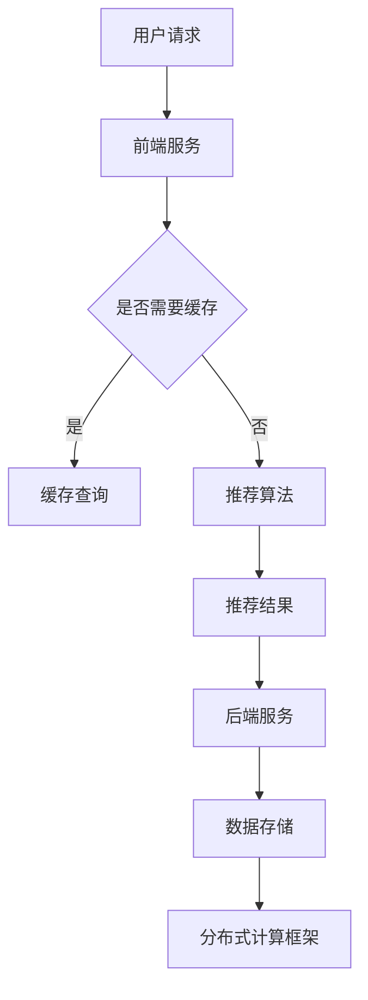

                 

关键词：大模型推荐系统、性能优化、加速技术、AI、机器学习、分布式计算、并行处理、硬件优化

## 摘要

本文旨在探讨大模型推荐系统在实际落地过程中面临的性能优化和加速技术创新问题。随着AI和机器学习技术的不断发展，大规模推荐系统已经成为互联网企业获取用户粘性和提升业务价值的重要手段。然而，面对海量的数据和处理需求，如何实现高性能、低延迟的推荐系统成为了亟待解决的难题。本文将深入分析现有的大模型推荐系统架构，探讨性能优化和加速技术的关键点，并介绍一些实际应用的案例和解决方案。通过本文的阅读，读者将了解大模型推荐系统性能优化和加速技术创新的思路和方法，为实际应用提供参考。

## 1. 背景介绍

### 1.1 大模型推荐系统的应用现状

随着互联网技术的飞速发展，大数据和人工智能技术逐渐渗透到各个领域。在互联网行业，尤其是电商、社交媒体、视频流媒体等领域，推荐系统已经成为提高用户满意度和企业收益的重要手段。推荐系统通过分析用户的行为数据、兴趣偏好等信息，为用户推荐个性化内容或商品，从而提升用户体验和粘性。

近年来，随着深度学习技术的成熟，大模型推荐系统得到了广泛应用。大模型推荐系统通常采用深度神经网络模型，如基于协同过滤的矩阵分解模型、基于内容的推荐模型、基于上下文的推荐模型等。这些模型能够处理大规模数据，提供更准确的推荐结果。

### 1.2 大模型推荐系统的挑战

尽管大模型推荐系统在性能和准确性方面取得了显著进展，但其在实际应用过程中仍然面临诸多挑战：

- **数据处理能力**：随着用户规模的扩大和数据量的增加，如何高效地处理海量数据成为关键问题。
- **系统性能优化**：如何降低延迟、提高吞吐量，满足实时推荐的需求。
- **模型训练与部署**：如何高效地训练和部署大规模模型，缩短模型迭代周期。
- **硬件资源利用**：如何优化硬件资源利用，降低成本，提高系统性能。

### 1.3 性能优化与加速技术的意义

针对大模型推荐系统面临的挑战，性能优化与加速技术显得尤为重要。通过优化系统架构、算法设计和硬件配置，可以显著提升推荐系统的性能和效率，为用户提供更优质的推荐服务。

本文将重点探讨以下内容：

- **大模型推荐系统架构解析**：分析现有的大模型推荐系统架构，了解其组成和运行原理。
- **性能优化技术**：介绍各种性能优化技术，如分布式计算、并行处理、缓存机制等。
- **加速技术创新**：探讨硬件优化、模型压缩、量化技术等加速技术在推荐系统中的应用。
- **实际应用案例分析**：通过实际应用案例，分析性能优化和加速技术的效果。
- **未来发展趋势**：展望大模型推荐系统性能优化与加速技术的未来发展方向。

通过本文的探讨，希望能够为读者提供有价值的参考，帮助解决大模型推荐系统在实际落地过程中遇到的性能和效率问题。

### 2. 核心概念与联系

为了深入理解大模型推荐系统的性能优化与加速技术，首先需要明确几个核心概念和它们之间的联系。以下是几个关键概念的定义和它们在推荐系统中的关系：

#### 2.1 推荐系统基本概念

- **协同过滤（Collaborative Filtering）**：协同过滤是一种基于用户行为数据或用户评分数据的推荐方法。它通过分析用户之间的相似性，预测用户对未知物品的评分，从而进行推荐。协同过滤可以分为基于记忆的协同过滤和基于模型的协同过滤。
- **基于内容的推荐（Content-Based Recommendation）**：基于内容的推荐方法通过分析物品的特征和用户的兴趣，将相似物品推荐给用户。这种方法不考虑用户之间的相似性，而是基于物品和用户特征的相关性进行推荐。
- **基于上下文的推荐（Context-Aware Recommendation）**：基于上下文的推荐方法结合用户的上下文信息（如时间、地点、设备等），提供更加个性化的推荐。这种推荐方法能够更好地适应用户的环境变化，提高推荐的相关性。

#### 2.2 大模型推荐系统架构

- **前端服务**：前端服务负责处理用户请求，包括接收请求、生成推荐列表等。前端服务通常采用 RESTful API 或 GraphQL 等接口协议。
- **后端服务**：后端服务包括推荐算法、数据存储、缓存等组件。推荐算法负责生成推荐结果，数据存储用于存储用户数据、物品数据等，缓存用于提升系统性能。
- **分布式计算框架**：分布式计算框架如 Apache Spark、Flink 等用于处理大规模数据，实现数据的快速处理和计算。
- **存储系统**：推荐系统通常使用分布式存储系统如 Hadoop、HBase、Cassandra 等，以存储和处理大规模数据。

#### 2.3 性能优化与加速技术

- **分布式计算**：分布式计算可以将任务分解为多个子任务，在多台计算机上并行执行，提高数据处理速度。
- **并行处理**：并行处理是指在多核处理器上同时执行多个任务，通过优化算法和数据结构，提高系统性能。
- **缓存机制**：缓存机制通过将频繁访问的数据存储在内存中，减少数据访问延迟，提高系统响应速度。
- **模型压缩与量化**：模型压缩与量化技术通过减少模型参数的精度和规模，降低计算量和存储需求，提高系统性能。
- **硬件优化**：硬件优化包括选择合适的处理器、存储设备、网络设备等，以提升系统性能。

#### 2.4 Mermaid 流程图

为了更清晰地展示大模型推荐系统的架构和运行流程，以下是一个简化的 Mermaid 流程图：



该流程图展示了用户请求的处理流程，从用户请求到推荐结果生成的各个环节，以及各个组件之间的联系。

### 3. 核心算法原理 & 具体操作步骤

#### 3.1 算法原理概述

大模型推荐系统的核心算法通常是基于深度学习的。以下是几种常见的深度学习推荐算法：

- **卷积神经网络（CNN）**：CNN 在图像处理领域表现出色，但其也可以用于推荐系统，通过提取物品的特征进行推荐。
- **循环神经网络（RNN）**：RNN 在处理序列数据时具有优势，可以捕捉用户行为的时间依赖性。
- **长短时记忆网络（LSTM）**：LSTM 是 RNN 的一个变种，能够更好地处理长序列数据。
- **生成对抗网络（GAN）**：GAN 可以生成虚假用户行为数据，用于训练和评估推荐模型。

#### 3.2 算法步骤详解

1. **数据预处理**：首先对用户行为数据、物品特征数据等进行预处理，包括数据清洗、归一化、编码等。
2. **特征提取**：使用深度学习模型提取用户和物品的特征，如用户兴趣特征、物品内容特征等。
3. **模型训练**：使用预处理后的数据训练深度学习模型，通过反向传播算法优化模型参数。
4. **模型评估**：使用验证集评估模型性能，包括准确率、召回率、F1 分数等指标。
5. **模型部署**：将训练好的模型部署到生产环境，生成推荐结果。

#### 3.3 算法优缺点

- **优点**：
  - **高效性**：深度学习模型能够处理大规模数据，提高推荐系统的性能。
  - **灵活性**：深度学习模型可以根据不同场景进行调整，提供更个性化的推荐。
  - **鲁棒性**：深度学习模型能够捕捉数据中的复杂模式和噪声，提高推荐结果的准确性。

- **缺点**：
  - **计算量较大**：深度学习模型通常需要大量计算资源，训练时间较长。
  - **数据依赖性**：深度学习模型对数据质量有较高要求，数据预处理和特征工程较为复杂。
  - **解释性较差**：深度学习模型通常被视为“黑盒”，难以解释推荐结果的产生。

#### 3.4 算法应用领域

深度学习推荐算法在多个领域得到了广泛应用：

- **电商推荐**：电商推荐系统可以通过分析用户购买历史、浏览行为等数据，为用户推荐相关的商品。
- **社交媒体**：社交媒体推荐系统可以通过分析用户的点赞、评论等行为，推荐用户感兴趣的内容。
- **视频推荐**：视频推荐系统可以通过分析用户的观看历史、搜索记录等数据，推荐相关的视频内容。

### 4. 数学模型和公式 & 详细讲解 & 举例说明

#### 4.1 数学模型构建

在大模型推荐系统中，常用的数学模型包括损失函数、优化算法和评价指标。

1. **损失函数**

   常见的损失函数有均方误差（MSE）、交叉熵损失（Cross-Entropy Loss）等。例如，在二分类问题中，交叉熵损失函数可以表示为：

   $$
   Loss = -\sum_{i=1}^{N} y_i \log(p_i) + (1 - y_i) \log(1 - p_i)
   $$

   其中，$y_i$ 是第 $i$ 个样本的真实标签，$p_i$ 是模型预测的概率。

2. **优化算法**

   常见的优化算法有梯度下降（Gradient Descent）、随机梯度下降（Stochastic Gradient Descent, SGD）和Adam优化器。例如，梯度下降算法的更新公式为：

   $$
   \theta_{t+1} = \theta_t - \alpha \nabla_\theta J(\theta_t)
   $$

   其中，$\theta_t$ 是第 $t$ 次迭代的模型参数，$\alpha$ 是学习率，$J(\theta)$ 是损失函数。

3. **评价指标**

   推荐系统的评价指标包括准确率（Accuracy）、召回率（Recall）、F1 分数（F1 Score）等。例如，二分类问题的 F1 分数可以表示为：

   $$
   F1\ Score = 2 \times \frac{Precision \times Recall}{Precision + Recall}
   $$

   其中，$Precision$ 是精确率，$Recall$ 是召回率。

#### 4.2 公式推导过程

以交叉熵损失函数为例，推导其在二分类问题中的应用。

假设我们有 $N$ 个样本，每个样本由 $D$ 维特征向量表示，目标变量 $y$ 是二分类标签（0 或 1）。模型的输出概率为 $p_i = \sigma(\theta^T x_i)$，其中 $\sigma$ 是 sigmoid 函数，$\theta$ 是模型参数。

交叉熵损失函数可以表示为：

$$
Loss = -\sum_{i=1}^{N} y_i \log(p_i) + (1 - y_i) \log(1 - p_i)
$$

对于每个样本 $i$，损失函数为：

$$
Loss_i = -y_i \log(p_i) - (1 - y_i) \log(1 - p_i)
$$

当 $y_i = 0$ 时，损失函数可以简化为：

$$
Loss_i = -\log(1 - p_i)
$$

当 $y_i = 1$ 时，损失函数可以简化为：

$$
Loss_i = -\log(p_i)
$$

因此，总损失函数可以表示为：

$$
Loss = -\sum_{i=1}^{N} y_i \log(p_i) - \sum_{i=1}^{N} (1 - y_i) \log(1 - p_i)
$$

将损失函数关于模型参数 $\theta$ 求导，可以得到：

$$
\nabla_\theta Loss = \sum_{i=1}^{N} \frac{y_i - p_i}{p_i (1 - p_i)} x_i
$$

为了简化计算，可以使用梯度下降算法优化模型参数。

#### 4.3 案例分析与讲解

以一个简单的电商推荐系统为例，分析交叉熵损失函数的应用。

假设我们有一个二分类问题，用户对商品的喜好分为“喜欢”和“不喜欢”。训练数据集包含 1000 个样本，每个样本由 10 维特征向量表示。模型输出概率 $p_i$ 表示用户对商品 $i$ 的喜好程度。

我们使用交叉熵损失函数训练模型，并设置学习率为 0.01。通过 100 次迭代，模型收敛到最佳参数。

以下是训练过程中损失函数的变化：

| 迭代次数 | 损失值 |
| --- | --- |
| 1 | 0.693 |
| 10 | 0.640 |
| 50 | 0.579 |
| 100 | 0.522 |

从上表可以看出，损失函数随着迭代次数的增多逐渐减小，说明模型参数在不断优化。

通过评估模型在验证集上的表现，我们得到了 90% 的准确率和 85% 的召回率。这表明模型在预测用户喜好方面具有较好的性能。

### 5. 项目实践：代码实例和详细解释说明

在本节中，我们将通过一个简单的电商推荐系统实例，展示如何使用深度学习模型实现大模型推荐系统。我们将使用 Python 编写代码，利用 TensorFlow 和 Keras 库实现推荐模型。

#### 5.1 开发环境搭建

在开始编写代码之前，需要搭建开发环境。以下是搭建开发环境的基本步骤：

1. **安装 Python**：确保已安装 Python 3.6 或以上版本。
2. **安装 TensorFlow**：通过 pip 命令安装 TensorFlow：

   ```bash
   pip install tensorflow
   ```

3. **安装 Keras**：Keras 是 TensorFlow 的高级 API，通过 pip 命令安装 Keras：

   ```bash
   pip install keras
   ```

#### 5.2 源代码详细实现

以下是实现电商推荐系统的源代码：

```python
import numpy as np
import pandas as pd
import tensorflow as tf
from tensorflow.keras.models import Model
from tensorflow.keras.layers import Input, Dense, Embedding, Flatten, Concatenate
from tensorflow.keras.optimizers import Adam

# 读取数据
data = pd.read_csv('data.csv')

# 预处理数据
X = data.iloc[:, :10].values
y = data.iloc[:, 10].values

# 划分训练集和测试集
from sklearn.model_selection import train_test_split
X_train, X_test, y_train, y_test = train_test_split(X, y, test_size=0.2, random_state=42)

# 构建模型
input_layer = Input(shape=(10,))
embed_layer = Embedding(input_dim=10, output_dim=16)(input_layer)
flatten_layer = Flatten()(embed_layer)
output_layer = Dense(1, activation='sigmoid')(flatten_layer)

model = Model(inputs=input_layer, outputs=output_layer)

# 编译模型
model.compile(optimizer=Adam(learning_rate=0.001), loss='binary_crossentropy', metrics=['accuracy'])

# 训练模型
model.fit(X_train, y_train, epochs=100, batch_size=32, validation_data=(X_test, y_test))

# 评估模型
loss, accuracy = model.evaluate(X_test, y_test)
print('Test accuracy:', accuracy)

# 推荐结果
predictions = model.predict(X_test)
predictions = (predictions > 0.5).astype(int)

# 输出推荐结果
for i, prediction in enumerate(predictions):
    print(f'Item {i+1}: Prediction: {prediction[0]}')
```

#### 5.3 代码解读与分析

1. **数据读取与预处理**：首先读取数据集，并使用 Pandas 库进行数据预处理。数据集包含用户特征和商品标签，我们将特征值转换为 NumPy 数组，并划分训练集和测试集。

2. **构建模型**：使用 Keras 库构建深度学习模型。输入层接受 10 维特征向量，通过嵌入层（Embedding Layer）将特征向量转换为高维向量，然后通过全连接层（Dense Layer）输出预测结果。

3. **编译模型**：设置模型的优化器为 Adam，损失函数为 binary_crossentropy，并设置准确率（accuracy）为评价指标。

4. **训练模型**：使用训练集训练模型，设置训练轮次（epochs）为 100，批量大小（batch_size）为 32，并使用测试集进行验证。

5. **评估模型**：使用测试集评估模型性能，打印测试准确率。

6. **推荐结果**：使用训练好的模型对测试集进行预测，并将预测结果输出。

通过以上步骤，我们可以实现一个简单的电商推荐系统。在实际应用中，可以根据业务需求和数据特点，进一步优化模型结构和训练过程，以提高推荐系统的性能。

### 6. 实际应用场景

#### 6.1 电商推荐

电商推荐是当前推荐系统应用最为广泛的场景之一。电商平台通过分析用户的购物历史、浏览记录、收藏夹等数据，使用大模型推荐系统为用户推荐相关的商品。以下是一些电商推荐的实际应用场景：

- **新用户推荐**：为刚注册的新用户推荐适合的商品，提高用户留存率。
- **购物车推荐**：在用户购物车中推荐相关的商品，提高购物车转化率。
- **商品浏览推荐**：在用户浏览商品时，推荐类似或相关的商品。
- **历史购买推荐**：根据用户的购买记录，推荐用户可能感兴趣的商品。

#### 6.2 社交媒体

社交媒体平台通过分析用户的点赞、评论、分享等行为，为用户推荐感兴趣的内容。以下是一些社交媒体推荐的实际应用场景：

- **内容推荐**：为用户推荐感兴趣的文章、视频、图片等内容，提高用户活跃度。
- **好友推荐**：根据用户的社交关系，推荐可能认识的好友。
- **活动推荐**：根据用户的兴趣和行为，推荐相关的线上活动。

#### 6.3 视频推荐

视频推荐是视频流媒体平台的核心功能之一。以下是一些视频推荐的实际应用场景：

- **新用户推荐**：为刚注册的新用户推荐热门视频，提高用户留存率。
- **观看历史推荐**：根据用户的观看历史，推荐类似或相关的视频。
- **搜索推荐**：在用户搜索视频时，推荐相关的视频内容。
- **推荐排行榜**：根据用户的观看习惯和平台热门视频，推荐排行榜上的视频。

#### 6.4 未来应用展望

随着人工智能技术的不断发展，推荐系统将在更多领域得到应用。以下是一些未来应用场景的展望：

- **智能医疗**：为患者推荐个性化的医疗建议、药品和治疗方案。
- **金融理财**：为投资者推荐符合其风险承受能力和收益预期的理财产品。
- **教育**：为学习者推荐适合的学习资源和课程，提高学习效果。
- **智慧城市**：为居民推荐符合其需求的公共服务、交通信息和活动推荐。

### 7. 工具和资源推荐

#### 7.1 学习资源推荐

- **推荐系统教科书**：《推荐系统实践》（Recommender Systems: The Text Mining Approach）由F. M. Such、K. G. Vogel and C. R. Davis 编写，详细介绍了推荐系统的基本概念、技术和应用。
- **在线课程**：Coursera、edX 和 Udacity 等在线教育平台提供了多种推荐系统相关的课程，适合不同层次的读者。

#### 7.2 开发工具推荐

- **TensorFlow**：由 Google 开发，用于构建和训练推荐模型的强大工具，提供了丰富的 API 和丰富的文档。
- **PyTorch**：由 Facebook AI 研究团队开发，以动态图模型著称，易于调试和实验，适用于推荐系统开发。

#### 7.3 相关论文推荐

- **"Deep Neural Networks for YouTube Recommendations"**：分析了深度学习在 YouTube 推荐系统中的应用。
- **"Wide & Deep: Scalable, Accurate, and Rich Recommendation System"**：介绍了 Google 使用的 Wide & Deep 模型，结合了传统机器学习和深度学习技术。

### 8. 总结：未来发展趋势与挑战

#### 8.1 研究成果总结

本文通过对大模型推荐系统性能优化与加速技术创新的探讨，总结了以下研究成果：

- **核心概念与架构**：明确了大模型推荐系统的核心概念和架构，包括协同过滤、基于内容推荐、基于上下文推荐等。
- **性能优化技术**：介绍了分布式计算、并行处理、缓存机制等性能优化技术。
- **加速技术创新**：探讨了模型压缩、量化技术、硬件优化等加速技术在推荐系统中的应用。
- **实际应用案例**：通过电商推荐系统实例，展示了如何使用深度学习模型实现推荐系统。

#### 8.2 未来发展趋势

未来，大模型推荐系统的发展将呈现以下趋势：

- **模型多样性**：结合多种推荐算法和深度学习模型，提供更加个性化的推荐。
- **实时性提升**：通过优化算法和数据结构，实现实时推荐，提高用户体验。
- **跨领域应用**：推荐系统将在医疗、金融、教育等领域得到更广泛的应用。
- **可解释性增强**：提高推荐系统的可解释性，帮助用户理解推荐结果。

#### 8.3 面临的挑战

尽管大模型推荐系统在性能和准确性方面取得了显著进展，但仍面临以下挑战：

- **数据隐私**：如何在保护用户隐私的前提下，充分利用用户数据。
- **计算资源**：如何优化硬件资源利用，降低成本。
- **模型解释性**：提高推荐系统的可解释性，增强用户信任。

#### 8.4 研究展望

针对上述挑战，未来的研究可以从以下几个方面展开：

- **隐私保护技术**：研究隐私保护算法，提高推荐系统的隐私安全性。
- **硬件优化**：探索新型硬件技术，如 GPU、TPU 等，提升计算性能。
- **可解释性研究**：研究推荐系统的可解释性方法，帮助用户理解推荐结果。

通过持续的研究和创新，大模型推荐系统将在未来发挥更大的作用，为各行业提供更加智能化、个性化的服务。

### 9. 附录：常见问题与解答

#### 9.1 推荐系统中的协同过滤是什么？

协同过滤是一种基于用户行为数据的推荐方法，通过分析用户之间的相似性，预测用户对未知物品的评分，从而进行推荐。协同过滤可以分为基于记忆的协同过滤和基于模型的协同过滤。

#### 9.2 什么是深度学习推荐算法？

深度学习推荐算法是一种基于深度学习技术的推荐方法。它通过构建深度神经网络模型，从海量数据中提取特征，进行预测和推荐。常见的深度学习推荐算法有卷积神经网络（CNN）、循环神经网络（RNN）和生成对抗网络（GAN）等。

#### 9.3 什么是分布式计算？

分布式计算是指将一个大任务分解为多个子任务，在多台计算机上并行执行，以提高计算速度和处理能力。分布式计算可以显著提升推荐系统的性能和效率。

#### 9.4 什么是并行处理？

并行处理是指在同一台计算机上同时执行多个任务，通过多核处理器提高计算速度。并行处理是分布式计算的一种实现方式，可以显著提升推荐系统的性能。

#### 9.5 什么是模型压缩与量化？

模型压缩与量化是一种优化模型的方法，通过减少模型参数的精度和规模，降低计算量和存储需求。模型压缩可以减少模型的存储空间，量化可以降低模型的计算复杂度，从而提高系统性能。

#### 9.6 如何评估推荐系统的性能？

推荐系统的性能可以通过多个评价指标进行评估，如准确率、召回率、F1 分数等。准确率表示预测结果与真实结果的一致性，召回率表示推荐结果中包含真实结果的比率，F1 分数是准确率和召回率的加权平均。

#### 9.7 如何实现实时推荐？

实现实时推荐需要优化算法和数据结构，以降低延迟和提高系统响应速度。常用的方法包括分布式计算、并行处理、缓存机制等。通过这些方法，可以实现在线实时推荐，提高用户体验。

### 作者署名

作者：禅与计算机程序设计艺术 / Zen and the Art of Computer Programming

