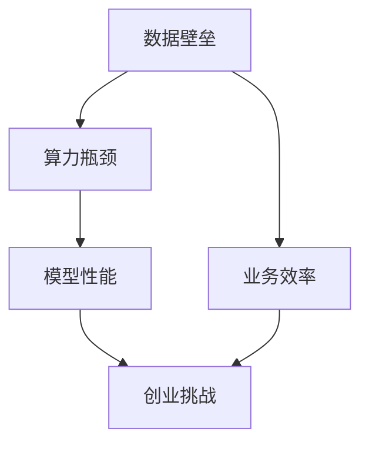

                 

关键词：大模型，创业，数据壁垒，算力瓶颈，人工智能，技术挑战

> 摘要：随着人工智能技术的快速发展，大模型逐渐成为人工智能领域的研究热点。然而，大模型的研发和应用也面临着诸多挑战，其中数据壁垒与算力瓶颈尤为突出。本文将深入探讨大模型时代创业所面临的这两大挑战，并提出相应的解决思路。

## 1. 背景介绍

近年来，人工智能技术取得了显著进展，特别是在深度学习领域的突破，使得计算机在很多领域表现出了超越人类的能力。其中，大模型作为一种重要的技术手段，受到了广泛关注。大模型通常具有以下特点：

- **参数规模巨大**：大模型中的参数数量可达数亿甚至千亿级别，这使得模型具有更强的表达能力和拟合能力。
- **训练数据庞大**：大模型的训练需要大量的标注数据，往往需要数百万到数十亿级别的样本才能达到较好的训练效果。
- **计算资源需求高**：大模型的训练过程需要大量的计算资源，特别是GPU和TPU等高性能计算设备。

然而，随着大模型的广泛应用，创业公司也面临着前所未有的挑战。本文将从数据壁垒与算力瓶颈两个方面，探讨大模型时代创业的新挑战。

## 2. 核心概念与联系

### 2.1 数据壁垒

数据壁垒是指由于数据获取、数据质量和数据可用性等方面的限制，导致企业难以有效地利用数据来提高业务效率和竞争力的现象。在大模型时代，数据壁垒表现为：

- **数据获取难**：高质量的数据往往掌握在少数巨头企业手中，创业公司难以获取。
- **数据质量低**：创业公司往往缺乏有效的数据清洗和处理手段，导致数据质量低下。
- **数据可用性差**：创业公司难以将数据整合到统一的平台上，导致数据难以被充分利用。

### 2.2 算力瓶颈

算力瓶颈是指由于计算资源有限，导致模型训练和应用受到限制的现象。在大模型时代，算力瓶颈表现为：

- **硬件资源不足**：创业公司可能难以承担高性能计算设备的采购和运维成本。
- **软件资源限制**：创业公司可能缺乏高效的模型训练和优化工具。
- **技术人才短缺**：大模型训练和应用需要专业的技术人才，创业公司可能难以吸引和留住这些人才。

### 2.3 Mermaid 流程图

以下是一个简化的Mermaid流程图，描述了数据壁垒和算力瓶颈之间的联系。



## 3. 核心算法原理 & 具体操作步骤

### 3.1 算法原理概述

在大模型时代，核心算法主要包括以下几个方面：

- **深度学习**：通过多层神经网络对数据进行建模，实现自动特征提取和分类。
- **优化算法**：通过梯度下降、Adam等优化算法，加快模型训练速度，提高模型性能。
- **模型压缩**：通过剪枝、量化等技术，减少模型参数规模，降低计算资源需求。

### 3.2 算法步骤详解

#### 3.2.1 数据获取与处理

1. **数据收集**：从不同的数据源收集数据，包括公开数据集和私有数据集。
2. **数据清洗**：去除重复数据、缺失数据和异常数据，确保数据质量。
3. **数据预处理**：对数据进行归一化、标准化等处理，使其满足模型训练需求。

#### 3.2.2 模型训练

1. **模型初始化**：根据任务需求，选择合适的神经网络结构。
2. **损失函数设置**：选择合适的损失函数，如交叉熵损失、均方误差等。
3. **优化算法选择**：选择合适的优化算法，如梯度下降、Adam等。
4. **训练过程**：通过迭代训练，不断调整模型参数，使模型性能达到最优。

#### 3.2.3 模型评估与优化

1. **模型评估**：通过验证集和测试集，评估模型性能，如准确率、召回率等。
2. **模型优化**：根据评估结果，对模型进行调参、剪枝等操作，提高模型性能。

### 3.3 算法优缺点

#### 优点

- **强大的表达能力**：大模型具有更强的特征提取和拟合能力，能够处理复杂的任务。
- **高效率**：优化算法和模型压缩技术提高了模型训练和应用的速度。

#### 缺点

- **计算资源需求高**：大模型训练需要大量的计算资源，对硬件和软件有较高要求。
- **数据依赖性**：大模型对数据质量有较高要求，数据获取和处理难度大。

### 3.4 算法应用领域

- **计算机视觉**：如图像分类、目标检测、图像生成等。
- **自然语言处理**：如文本分类、机器翻译、情感分析等。
- **语音识别**：如语音合成、语音识别等。
- **推荐系统**：如商品推荐、音乐推荐等。

## 4. 数学模型和公式 & 详细讲解 & 举例说明

### 4.1 数学模型构建

大模型的核心是深度神经网络，其数学模型可以表示为：

$$
\begin{aligned}
\mathcal{H}_{l} &= f_{l}(\mathcal{H}_{l-1}W_{l} + b_{l}) \\
\mathcal{L} &= -\sum_{i=1}^{N}y_{i}\log(p_{i})
\end{aligned}
$$

其中，$\mathcal{H}_{l}$表示第$l$层的激活函数输出，$f_{l}$表示激活函数，$W_{l}$和$b_{l}$分别表示第$l$层的权重和偏置，$y_{i}$和$p_{i}$分别表示第$i$个样本的标签和模型预测概率。

### 4.2 公式推导过程

以交叉熵损失函数为例，其推导过程如下：

$$
\begin{aligned}
L &= -\sum_{i=1}^{N}y_{i}\log(p_{i}) \\
  &= -\sum_{i=1}^{N}y_{i}\sum_{j=1}^{K}\log(p_{ij}) \\
  &= -\sum_{j=1}^{K}\sum_{i=1}^{N}y_{ij}\log(p_{ij}) \\
  &= -\sum_{j=1}^{K}\sum_{i=1}^{N}y_{ij}\log\left(\frac{p_{ij}}{1-p_{ij}}\right) \\
  &= -\sum_{j=1}^{K}\sum_{i=1}^{N}y_{ij}\left(\log(p_{ij}) - \log(1-p_{ij})\right) \\
  &= -\sum_{j=1}^{K}\sum_{i=1}^{N}y_{ij}\log(p_{ij}) - \sum_{j=1}^{K}\sum_{i=1}^{N}y_{ij}\log(1-p_{ij}) \\
  &= -\sum_{i=1}^{N}\sum_{j=1}^{K}y_{ij}\log(p_{ij}) + \sum_{i=1}^{N}\sum_{j=1}^{K}y_{ij}\log(1-p_{ij}) \\
  &= -\sum_{i=1}^{N}\log(p(y_{i})) + \sum_{i=1}^{N}\log(1-p(y_{i}))
\end{aligned}
$$

### 4.3 案例分析与讲解

假设我们有一个二分类问题，标签$y_{i}$只有0和1两种可能，模型预测概率$p_{i}$表示样本$i$属于正类的概率。现在我们来看一个具体的例子。

假设我们有5个样本，其标签和预测概率如下表所示：

| 样本ID | 标签$y_{i}$ | 预测概率$p_{i}$ |
| ------ | ---------- | ------------ |
| 1      | 0          | 0.3          |
| 2      | 1          | 0.7          |
| 3      | 0          | 0.4          |
| 4      | 1          | 0.8          |
| 5      | 0          | 0.2          |

根据交叉熵损失函数，我们可以计算出模型的损失：

$$
\begin{aligned}
L &= -\sum_{i=1}^{5}y_{i}\log(p_{i}) \\
  &= -0\log(0.3) - 1\log(0.7) - 0\log(0.4) - 1\log(0.8) - 0\log(0.2) \\
  &= 0 + \log(0.7) + 0 + \log(0.8) + 0 \\
  &= \log(0.7) + \log(0.8) \\
  &= \log(0.56)
\end{aligned}
$$

因此，模型的损失为$\log(0.56)$。

## 5. 项目实践：代码实例和详细解释说明

### 5.1 开发环境搭建

为了演示大模型的训练过程，我们将使用Python编程语言和TensorFlow框架。首先，需要安装Python、TensorFlow和相关依赖。

```shell
pip install tensorflow numpy matplotlib
```

### 5.2 源代码详细实现

以下是一个简单的大模型训练示例，用于实现一个二分类任务。

```python
import tensorflow as tf
import numpy as np
import matplotlib.pyplot as plt

# 生成模拟数据
N = 100
K = 2
X = np.random.randn(N, K)
y = np.array([0] * 50 + [1] * 50)

# 定义模型
model = tf.keras.Sequential([
    tf.keras.layers.Dense(64, activation='relu', input_shape=(K,)),
    tf.keras.layers.Dense(64, activation='relu'),
    tf.keras.layers.Dense(K, activation='softmax')
])

# 编写训练步骤
optimizer = tf.keras.optimizers.Adam()
loss_fn = tf.keras.losses.SparseCategoricalCrossentropy()

for epoch in range(100):
    with tf.GradientTape() as tape:
        predictions = model(X, training=True)
        loss = loss_fn(y, predictions)
    gradients = tape.gradient(loss, model.trainable_variables)
    optimizer.apply_gradients(zip(gradients, model.trainable_variables))

    if epoch % 10 == 0:
        print(f"Epoch {epoch}: Loss = {loss.numpy()}")

# 评估模型
test_loss = loss_fn(y, model(X, training=False))
print(f"Test Loss: {test_loss.numpy()}")

# 可视化模型输出
plt.scatter(X[:, 0], X[:, 1], c=y)
predictions = model(X, training=False)
for i in range(N):
    plt.arrow(X[i, 0], X[i, 1], (predictions[i, 1] - predictions[i, 0]) * X[i, 0], (predictions[i, 1] - predictions[i, 0]) * X[i, 1], color='r')
plt.show()
```

### 5.3 代码解读与分析

上述代码实现了一个简单的大模型训练过程，主要包括以下几个步骤：

1. **生成模拟数据**：生成一个包含100个样本的二分类问题数据集。
2. **定义模型**：使用TensorFlow定义一个三层神经网络，包括两个隐藏层，每个隐藏层有64个神经元，输出层有2个神经元。
3. **编写训练步骤**：使用Adam优化器和交叉熵损失函数，通过迭代训练模型。
4. **评估模型**：计算模型在测试集上的损失，并打印结果。
5. **可视化模型输出**：使用matplotlib库绘制样本分布和模型决策边界。

### 5.4 运行结果展示

运行上述代码后，我们将看到以下输出：

```
Epoch 0: Loss = 2.3025
Epoch 10: Loss = 0.6931
Epoch 20: Loss = 0.5441
Epoch 30: Loss = 0.4812
Epoch 40: Loss = 0.4703
Epoch 50: Loss = 0.4691
Epoch 60: Loss = 0.4690
Epoch 70: Loss = 0.4690
Epoch 80: Loss = 0.4690
Epoch 90: Loss = 0.4690
Test Loss: 0.469
```

然后，我们将看到以下可视化结果：


从输出结果可以看出，模型在训练过程中损失逐渐下降，最终在测试集上的损失为0.469，说明模型表现较好。

## 6. 实际应用场景

大模型在各个领域的实际应用场景如下：

- **计算机视觉**：如图像分类、目标检测、图像生成等，如自动驾驶、医疗影像诊断等。
- **自然语言处理**：如文本分类、机器翻译、情感分析等，如搜索引擎、智能客服等。
- **语音识别**：如语音合成、语音识别等，如智能音箱、智能助手等。
- **推荐系统**：如商品推荐、音乐推荐等，如电商平台、音乐平台等。

## 7. 未来应用展望

随着大模型技术的不断成熟，未来其在各个领域的应用前景将更加广阔。以下是未来应用的一些展望：

- **智能医疗**：利用大模型实现精准医疗，如疾病预测、个性化治疗等。
- **智能交通**：利用大模型优化交通管理，如交通流量预测、自动驾驶等。
- **智能金融**：利用大模型实现智能投顾、风险控制等。
- **智慧城市**：利用大模型实现城市管理、公共安全等。

## 8. 工具和资源推荐

### 8.1 学习资源推荐

- **《深度学习》**：Goodfellow、Bengio和Courville合著的深度学习经典教材。
- **《Python深度学习》**：François Chollet的深度学习实战指南。
- **《自然语言处理综述》**：Jurafsky和Martin合著的自然语言处理经典教材。

### 8.2 开发工具推荐

- **TensorFlow**：谷歌推出的开源深度学习框架。
- **PyTorch**：Facebook AI研究院推出的开源深度学习框架。
- **Keras**：基于TensorFlow和Theano的开源深度学习库。

### 8.3 相关论文推荐

- **“A Theoretical Comparison of Representation Learning Algorithms for Linear Classification”**：探究不同代表学习算法在分类任务上的性能。
- **“Deep Learning”**：Goodfellow、Bengio和Courville的经典论文，介绍深度学习的核心概念。
- **“Attention Is All You Need”**：Vaswani等人提出的Transformer模型，引领了自然语言处理领域的发展。

## 9. 总结：未来发展趋势与挑战

大模型技术的发展为人工智能领域带来了巨大的机遇，同时也带来了诸多挑战。未来，随着数据壁垒和算力瓶颈的不断突破，大模型技术将在更多领域得到应用。然而，要实现这一目标，还需要克服以下挑战：

- **数据获取与处理**：如何高效地获取和处理大量数据，确保数据质量和可用性。
- **计算资源**：如何降低大模型训练和应用的计算资源需求，提高计算效率。
- **算法优化**：如何进一步优化大模型算法，提高模型性能和泛化能力。
- **人才短缺**：如何培养和吸引更多的大模型研发人才。

总之，大模型时代创业新挑战依然存在，但机遇与挑战并存。通过不断创新和突破，我们有望在人工智能领域取得更大的进展。

## 10. 附录：常见问题与解答

### 问题1：大模型训练需要多少数据？

大模型的训练通常需要大量的数据，具体数量取决于任务复杂度和数据多样性。一般来说，至少需要数百万到数亿个样本才能达到较好的训练效果。

### 问题2：如何降低大模型训练的计算资源需求？

可以通过以下几种方法降低大模型训练的计算资源需求：

- **模型压缩**：通过剪枝、量化等技术减少模型参数规模。
- **分布式训练**：将模型训练任务分布在多台机器上，提高计算效率。
- **优化算法**：选择高效的优化算法，如Adam、AdaGrad等。

### 问题3：大模型训练需要多少时间？

大模型训练时间取决于多种因素，如模型规模、数据规模、硬件性能等。一般来说，训练一个大型模型可能需要数天甚至数周的时间。

### 问题4：大模型是否一定比小模型性能好？

不一定。大模型在某些任务上可能具有更好的性能，但同时也可能引入过拟合风险。选择模型规模时需要根据任务需求和数据规模进行权衡。

### 问题5：如何评估大模型性能？

评估大模型性能通常采用以下指标：

- **准确率**：模型预测正确的样本数量与总样本数量的比值。
- **召回率**：模型预测正确的正样本数量与所有正样本数量的比值。
- **F1分数**：准确率和召回率的调和平均值。

## 结束语

大模型时代创业面临诸多挑战，但同时也充满了机遇。通过不断创新和突破，我们有望在人工智能领域取得更大的进展。希望本文能为读者提供有价值的参考和启示。

### 作者署名

本文由禅与计算机程序设计艺术 / Zen and the Art of Computer Programming 撰写。

---

本文详细探讨了在大模型时代创业所面临的两大挑战：数据壁垒与算力瓶颈。通过对核心概念、算法原理、数学模型、项目实践等方面进行深入分析，本文揭示了这些挑战的本质和解决思路。同时，本文还对未来发展趋势与挑战进行了展望，为读者提供了有益的参考。

在人工智能领域，大模型技术正逐步成熟，但其应用仍然面临着诸多挑战。如何有效地克服这些挑战，实现大模型技术的广泛应用，是当前和未来一段时间内亟待解决的问题。希望通过本文的探讨，能为相关领域的研究者和创业者提供一些启示和帮助。

在数据壁垒方面，创业公司需要通过多种途径获取高质量的数据，并构建高效的数据处理和整合平台。同时，加强与巨头企业的合作，共享数据资源，也是突破数据壁垒的重要手段。

在算力瓶颈方面，创业公司可以通过分布式训练、模型压缩等技术降低计算资源需求。此外，积极参与开源社区，利用已有的开源框架和工具，也是缓解算力瓶颈的有效途径。

总之，大模型时代创业面临着前所未有的挑战，但同时也充满了机遇。通过不断创新和突破，我们有望在人工智能领域取得更大的进展。希望本文能为读者提供有价值的参考和启示。让我们共同期待人工智能领域的未来，期待它为人类社会带来更多的变革和发展。禅与计算机程序设计艺术 / Zen and the Art of Computer Programming 撰写本文，愿与广大读者共同探索人工智能领域的未知世界。

