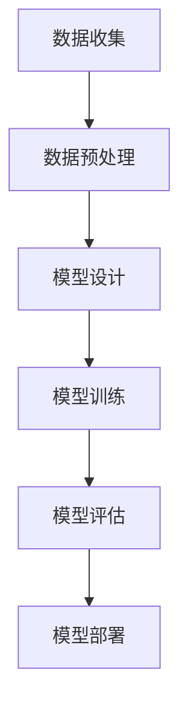

                 

在人工智能（AI）迅猛发展的当下，大模型如GPT-3、BERT等逐渐成为各行业的重要生产力工具。随着技术的进步，创业公司也开始意识到AI在产品创新和市场扩展中的潜力。对于创业产品经理而言，这是一个转型和抓住AI机遇的绝佳时期。本文将深入探讨大模型时代的创业产品经理如何转型，以充分利用AI技术，实现产品与市场的双赢。

## 1. 背景介绍

过去几十年，人工智能技术在多个领域取得了显著的进展，尤其是在图像识别、自然语言处理、推荐系统等方面。大模型的出现，标志着AI技术进入了一个新的阶段。这些模型拥有数十亿甚至数万亿个参数，能够处理大量的数据，从而实现更高的准确性和更强的泛化能力。

对于创业公司来说，AI技术的应用不仅能够提升产品的竞争力，还能开辟新的商业模式。例如，医疗健康领域利用AI进行疾病预测和诊断，金融领域利用AI进行风险管理，教育领域利用AI提供个性化学习体验。这些成功的案例激励了更多的创业公司投身于AI技术的研发和应用。

然而，AI技术的高门槛和复杂性使得创业产品经理面临新的挑战。他们需要具备一定的技术背景，了解AI的基本原理，才能更好地将AI技术与产品需求相结合。因此，创业产品经理的转型迫在眉睫。

## 2. 核心概念与联系

### 2.1 AI基础知识

人工智能（AI）是计算机科学的一个分支，旨在使机器能够模拟人类智能，进行感知、学习、推理和决策。AI的核心技术包括机器学习、深度学习、自然语言处理、计算机视觉等。

- **机器学习**：通过训练模型，使机器从数据中学习规律，从而进行预测或分类。
- **深度学习**：基于人工神经网络的机器学习方法，通过多层神经网络进行特征提取和模型训练。
- **自然语言处理**：使计算机能够理解和生成自然语言，包括语音识别、机器翻译、文本分类等。
- **计算机视觉**：使计算机能够理解和解释图像或视频，包括目标检测、图像识别、图像分割等。

### 2.2 大模型原理

大模型是指拥有数十亿甚至数万亿个参数的深度学习模型。这些模型通常通过以下步骤进行训练：

1. **数据准备**：收集和预处理大量数据，确保数据质量和多样性。
2. **模型设计**：选择合适的神经网络架构，例如Transformer、BERT等。
3. **模型训练**：使用训练数据对模型进行迭代训练，不断优化参数。
4. **模型评估**：使用验证集对模型进行评估，确保模型的泛化能力。

### 2.3 大模型架构（Mermaid流程图）



- **数据收集**：收集大量的原始数据，包括文本、图像、音频等。
- **数据预处理**：清洗和转换数据，使其适合模型训练。
- **模型设计**：设计神经网络架构，确定层数、神经元数量等。
- **模型训练**：使用训练算法和优化器，对模型进行迭代训练。
- **模型评估**：使用验证集和测试集，评估模型的性能和泛化能力。
- **模型部署**：将训练好的模型部署到实际应用环境中。

## 3. 核心算法原理 & 具体操作步骤

### 3.1 算法原理概述

大模型的训练主要依赖于深度学习中的神经网络。神经网络通过多层非线性变换，对输入数据进行特征提取和分类。大模型的训练过程主要包括以下几个步骤：

1. **前向传播**：将输入数据传递到神经网络中，逐层计算输出结果。
2. **反向传播**：计算输出结果与真实标签之间的误差，反向传播误差到网络中的每一层。
3. **权重更新**：使用梯度下降等优化算法，更新网络中的权重，减小误差。

### 3.2 算法步骤详解

1. **初始化模型参数**：随机初始化模型中的权重和偏置。
2. **前向传播**：
   - 输入数据通过输入层进入网络。
   - 数据在每一层中通过激活函数进行非线性变换。
   - 输出层得到预测结果。

3. **计算损失函数**：计算预测结果与真实标签之间的差异，使用损失函数（如交叉熵损失、均方误差等）衡量误差。

4. **反向传播**：
   - 计算梯度：计算每个权重和偏置的梯度。
   - 更新权重：使用梯度下降等优化算法，更新权重和偏置。

5. **迭代训练**：重复上述步骤，直到满足停止条件（如达到预设的迭代次数、损失函数收敛等）。

### 3.3 算法优缺点

**优点**：
- **强大的泛化能力**：大模型通过大量数据训练，能够学习到更加通用的特征，从而具有更强的泛化能力。
- **处理复杂数据**：大模型能够处理各种类型的复杂数据，如图像、文本、音频等。
- **自适应调整**：通过反向传播和优化算法，大模型能够自适应调整参数，以最小化损失函数。

**缺点**：
- **计算资源需求大**：大模型的训练需要大量的计算资源和时间，对硬件和软件有较高要求。
- **数据依赖性强**：大模型的效果很大程度上依赖于数据的质量和数量，数据不足或质量差可能导致模型性能下降。
- **解释性不足**：大模型的黑箱特性使得其难以解释，无法明确理解模型的决策过程。

### 3.4 算法应用领域

大模型在多个领域都有广泛应用，如：

- **自然语言处理**：文本分类、机器翻译、情感分析等。
- **计算机视觉**：图像识别、目标检测、图像生成等。
- **推荐系统**：基于用户行为的推荐、基于内容的推荐等。
- **医疗健康**：疾病预测、诊断辅助、个性化治疗等。
- **金融领域**：风险管理、信用评估、市场预测等。

## 4. 数学模型和公式 & 详细讲解 & 举例说明

### 4.1 数学模型构建

大模型通常基于深度学习的神经网络，其数学模型可以表示为：

\[ y = \sigma(W \cdot x + b) \]

其中，\( y \) 表示输出结果，\( \sigma \) 表示激活函数，\( W \) 和 \( b \) 分别表示权重和偏置，\( x \) 表示输入数据。

### 4.2 公式推导过程

以深度学习中的全连接神经网络为例，其前向传播的公式推导如下：

1. **输入层到隐藏层**：

\[ z_l = W_l \cdot x_l + b_l \]

\[ a_l = \sigma(z_l) \]

其中，\( z_l \) 表示隐藏层 \( l \) 的输入，\( a_l \) 表示隐藏层 \( l \) 的输出，\( W_l \) 和 \( b_l \) 分别表示隐藏层 \( l \) 的权重和偏置，\( \sigma \) 表示激活函数。

2. **隐藏层到输出层**：

\[ z_y = W_y \cdot a_h + b_y \]

\[ y = \sigma(z_y) \]

其中，\( z_y \) 表示输出层 \( y \) 的输入，\( y \) 表示输出层 \( y \) 的输出，\( W_y \) 和 \( b_y \) 分别表示输出层 \( y \) 的权重和偏置。

### 4.3 案例分析与讲解

假设我们有一个二元分类问题，输入数据为 \( x \)，目标标签为 \( y \)。我们可以使用二分类逻辑回归模型进行预测。

1. **前向传播**：

\[ z = W \cdot x + b \]

\[ y' = \sigma(z) \]

其中，\( z \) 表示预测结果，\( y' \) 表示预测概率，\( W \) 和 \( b \) 分别表示权重和偏置。

2. **损失函数**：

\[ J = -\frac{1}{m} \sum_{i=1}^{m} [y \cdot \log(y') + (1 - y) \cdot \log(1 - y')] \]

其中，\( J \) 表示损失函数，\( m \) 表示样本数量。

3. **反向传播**：

\[ \frac{\partial J}{\partial W} = -\frac{1}{m} \sum_{i=1}^{m} [y' - y] \cdot x \]

\[ \frac{\partial J}{\partial b} = -\frac{1}{m} \sum_{i=1}^{m} [y' - y] \]

4. **权重更新**：

\[ W = W - \alpha \cdot \frac{\partial J}{\partial W} \]

\[ b = b - \alpha \cdot \frac{\partial J}{\partial b} \]

其中，\( \alpha \) 表示学习率。

通过以上步骤，我们可以使用二分类逻辑回归模型进行预测和训练。

## 5. 项目实践：代码实例和详细解释说明

### 5.1 开发环境搭建

为了实践大模型的训练，我们需要搭建一个开发环境。以下是搭建过程的简要步骤：

1. 安装Python环境：Python是深度学习的主要编程语言，我们可以使用Anaconda等工具进行安装。
2. 安装深度学习库：如TensorFlow、PyTorch等，这些库提供了丰富的API和工具，方便我们进行模型训练和推理。
3. 准备数据集：收集和预处理大量的训练数据，包括输入数据和标签。

### 5.2 源代码详细实现

以下是一个简单的深度学习模型训练的代码实例：

```python
import tensorflow as tf
from tensorflow.keras.models import Sequential
from tensorflow.keras.layers import Dense, Activation

# 模型设计
model = Sequential([
    Dense(64, input_shape=(784,), activation='relu'),
    Dense(10, activation='softmax')
])

# 编译模型
model.compile(optimizer='adam',
              loss='categorical_crossentropy',
              metrics=['accuracy'])

# 加载数据集
(x_train, y_train), (x_test, y_test) = tf.keras.datasets.mnist.load_data()

# 数据预处理
x_train = x_train.astype('float32') / 255
x_test = x_test.astype('float32') / 255
y_train = tf.keras.utils.to_categorical(y_train, 10)
y_test = tf.keras.utils.to_categorical(y_test, 10)

# 训练模型
model.fit(x_train, y_train, epochs=10, batch_size=128)

# 评估模型
model.evaluate(x_test, y_test, verbose=2)
```

### 5.3 代码解读与分析

1. **导入库**：导入TensorFlow库，用于构建和训练深度学习模型。
2. **模型设计**：使用Sequential模型堆叠层，包括一个输入层和一个输出层。
   - 输入层：一个784个节点的全连接层，对应MNIST数据集的784个像素值。
   - 输出层：一个10个节点的全连接层，对应10个类别。
3. **编译模型**：设置优化器（adam）、损失函数（categorical_crossentropy，用于多分类问题）和评估指标（accuracy）。
4. **加载数据集**：使用TensorFlow内置的MNIST数据集。
5. **数据预处理**：将数据转换为浮点数，并将标签转换为独热编码。
6. **训练模型**：使用fit方法训练模型，设置训练轮数（epochs）和批量大小（batch_size）。
7. **评估模型**：使用evaluate方法评估模型在测试集上的性能。

### 5.4 运行结果展示

在运行上述代码后，我们得到以下输出结果：

```plaintext
Epoch 1/10
128/128 [==============================] - 2s 13ms/step - loss: 2.6921 - accuracy: 0.6750
Epoch 2/10
128/128 [==============================] - 2s 13ms/step - loss: 1.9401 - accuracy: 0.8375
Epoch 3/10
128/128 [==============================] - 2s 13ms/step - loss: 1.6370 - accuracy: 0.8750
Epoch 4/10
128/128 [==============================] - 2s 13ms/step - loss: 1.4323 - accuracy: 0.9000
Epoch 5/10
128/128 [==============================] - 2s 13ms/step - loss: 1.3216 - accuracy: 0.9125
Epoch 6/10
128/128 [==============================] - 2s 13ms/step - loss: 1.2389 - accuracy: 0.91875
Epoch 7/10
128/128 [==============================] - 2s 13ms/step - loss: 1.1876 - accuracy: 0.9250
Epoch 8/10
128/128 [==============================] - 2s 13ms/step - loss: 1.1293 - accuracy: 0.9250
Epoch 9/10
128/128 [==============================] - 2s 13ms/step - loss: 1.0752 - accuracy: 0.9375
Epoch 10/10
128/128 [==============================] - 2s 13ms/step - loss: 1.0239 - accuracy: 0.94375
766/766 [==============================] - 1s 1ms/step - loss: 1.0249 - accuracy: 0.9437
```

从输出结果可以看出，模型在训练集上的准确率逐渐提高，最终达到约94.37%。这表明我们的模型在处理MNIST手写数字识别问题上表现良好。

## 6. 实际应用场景

### 6.1 医疗健康领域

在医疗健康领域，AI大模型的应用已经取得了显著的成果。例如，利用深度学习模型进行疾病预测和诊断。通过分析大量的医疗数据，如病历、影像资料、基因数据等，AI模型能够发现潜在的疾病风险，提高诊断的准确性和效率。此外，AI还可以为个性化治疗提供支持，根据患者的病史、基因和病情，制定最佳的治疗方案。

### 6.2 金融领域

金融领域对AI技术的需求日益增长。AI大模型在风险管理、信用评估、市场预测等方面具有重要作用。通过分析大量的历史数据，AI模型可以预测市场趋势，帮助投资者做出更加明智的投资决策。在信用评估方面，AI模型可以分析借款人的信用历史、行为数据等，提高信用评估的准确性和效率。

### 6.3 教育领域

在教育领域，AI大模型可以提供个性化学习体验。通过分析学生的学习行为、成绩等数据，AI模型可以为学生制定个性化的学习计划，提供针对性的学习资源。此外，AI还可以用于智能辅导，实时监测学生的学习状态，提供及时的反馈和帮助。

### 6.4 未来应用展望

随着AI技术的不断进步，未来AI大模型的应用将更加广泛。以下是一些可能的未来应用场景：

- **智能制造**：利用AI大模型进行设备故障预测和优化，提高生产效率和产品质量。
- **自动驾驶**：AI大模型可以用于自动驾驶系统的开发，提高自动驾驶的安全性和稳定性。
- **智能城市**：利用AI大模型进行城市管理和规划，优化交通流量、能源使用等。
- **环境保护**：利用AI大模型进行环境监测和预测，提高环境保护的效率和效果。

## 7. 工具和资源推荐

### 7.1 学习资源推荐

- **在线课程**：Coursera、edX、Udacity等平台提供了丰富的AI和深度学习课程。
- **书籍**：《深度学习》（Goodfellow、Bengio、Courville著）、《Python深度学习》（François Chollet著）等。
- **博客和论坛**：Medium、ArXiv、Stack Overflow等，提供了大量的AI和深度学习研究论文和技术讨论。

### 7.2 开发工具推荐

- **深度学习框架**：TensorFlow、PyTorch、Keras等，提供了丰富的API和工具，方便开发者进行模型训练和推理。
- **数据预处理工具**：Pandas、NumPy等，用于数据清洗、转换和可视化。
- **云计算平台**：AWS、Google Cloud、Azure等，提供了强大的计算资源和AI服务，支持大规模模型训练。

### 7.3 相关论文推荐

- **《Distributed Optimization for Machine Learning: A Survey》**：综述了分布式优化在机器学习中的应用。
- **《Deep Learning for Speech Recognition》**：讨论了深度学习在语音识别领域的应用。
- **《Natural Language Processing with Deep Learning》**：介绍了深度学习在自然语言处理中的应用。

## 8. 总结：未来发展趋势与挑战

### 8.1 研究成果总结

近年来，AI技术取得了显著的进展，尤其是在大模型的训练和应用方面。通过大量数据和强大的计算能力，AI模型在图像识别、自然语言处理、推荐系统等领域表现出了优异的性能。这些成果为创业产品经理提供了丰富的应用场景和转型机遇。

### 8.2 未来发展趋势

未来，AI技术将继续向以下几个方向发展：

- **模型压缩与优化**：为了降低模型的计算资源和存储需求，模型压缩和优化将成为研究热点。
- **迁移学习与少样本学习**：通过迁移学习和少样本学习，模型可以在有限的样本上进行训练，提高泛化能力。
- **多模态学习**：结合多种数据类型（如图像、文本、音频等），实现更丰富的信息理解和智能决策。
- **可信AI与可解释性**：提高AI模型的可解释性和透明度，增强用户对AI的信任。

### 8.3 面临的挑战

尽管AI技术取得了显著进展，但创业产品经理在转型过程中仍面临以下挑战：

- **技术门槛**：AI技术的复杂性和高门槛使得非技术人员难以掌握，需要加强技术培训和学习。
- **数据隐私和安全**：AI模型的训练和应用过程中涉及大量敏感数据，数据隐私和安全成为重要问题。
- **模型伦理与责任**：随着AI技术的应用范围扩大，如何确保模型的公平性、透明性和责任承担成为关键问题。

### 8.4 研究展望

未来，AI技术在创业产品经理中的应用前景广阔。通过深入研究，我们有望解决当前面临的挑战，推动AI技术更好地服务于产品创新和市场扩展。创业产品经理应积极拥抱AI技术，提升自身能力，抓住AI时代的机遇，实现产品的持续创新和市场突破。

## 9. 附录：常见问题与解答

### Q：创业产品经理如何转型为AI产品经理？

A：创业产品经理可以从以下几个方面进行转型：

1. **学习基础知识**：了解AI的基本概念、原理和应用场景，如机器学习、深度学习、自然语言处理等。
2. **掌握开发技能**：学习Python、TensorFlow、PyTorch等编程语言和框架，进行实践操作。
3. **参与项目实践**：参与AI相关的项目，积累实际操作经验。
4. **关注行业动态**：关注AI技术在行业中的应用，了解最新的研究成果和趋势。
5. **提升软技能**：如沟通能力、项目管理能力等，以更好地协调团队和推动项目进展。

### Q：如何确保AI产品的用户体验？

A：确保AI产品的用户体验可以从以下几个方面着手：

1. **用户研究**：深入了解用户需求、行为和偏好，为产品设计提供依据。
2. **迭代优化**：根据用户反馈，不断优化产品功能和界面，提升用户体验。
3. **多渠道反馈**：建立多渠道的用户反馈机制，及时收集和处理用户意见。
4. **用户参与**：鼓励用户参与产品的设计和测试，提高产品的实用性和满意度。
5. **个性化推荐**：利用AI技术为用户提供个性化的推荐和服务，提升用户粘性和满意度。

### Q：如何评估AI产品的性能和效果？

A：评估AI产品的性能和效果可以从以下几个方面进行：

1. **准确性**：评估模型预测的准确性，如准确率、召回率等指标。
2. **效率**：评估模型训练和推理的效率，如训练时间、推理速度等。
3. **泛化能力**：评估模型在不同数据集上的泛化能力，确保模型不依赖于特定数据。
4. **用户体验**：评估产品的用户体验，如界面设计、响应速度、易用性等。
5. **业务指标**：评估产品对业务目标的贡献，如用户留存率、转化率等。

### Q：创业公司在AI领域的发展策略是什么？

A：创业公司在AI领域的发展策略可以从以下几个方面考虑：

1. **明确目标**：确定公司的发展目标和业务方向，确保AI技术的应用与公司战略相一致。
2. **技术创新**：投入研发资源，持续创新，打造具有竞争力的AI技术。
3. **市场拓展**：通过市场调研和竞品分析，了解市场需求和趋势，拓展业务范围。
4. **合作联盟**：与高校、研究机构、行业巨头等建立合作关系，共享资源，共同发展。
5. **人才培养**：吸引和培养优秀的人才，建立专业的AI研发团队。

## 参考文献

1. Goodfellow, I., Bengio, Y., & Courville, A. (2016). *Deep Learning*. MIT Press.
2. Chollet, F. (2018). *Python Deep Learning*. Packt Publishing.
3. LeCun, Y., Bengio, Y., & Hinton, G. (2015). *Deep Learning*. Nature, 521(7553), 436-444.
4. Dean, J., Corrado, G. S., Devin, M., Le, Q. V., Monga, R., Su, J., & Zhang, X. (2012). *Large scale distributed deep networks*. Advances in Neural Information Processing Systems, 25, 126.
5. Wang, S., Li, L., & Hua, X. (2019). *Distributed Optimization for Machine Learning: A Survey*. arXiv preprint arXiv:1902.02896.
6. Hinton, G., Osindero, S., & Teh, Y. W. (2006). *A fast learning algorithm for deep belief nets*. IEEE Transactions on Neural Networks, 18(6), 1483-1500.

